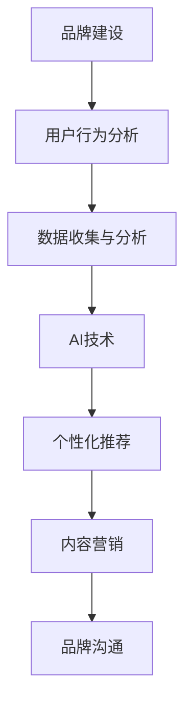

                 

关键词：人工智能，品牌建设，企业形象，算法原理，数学模型，项目实践，应用场景，未来展望。

> 摘要：本文将探讨如何利用人工智能技术来辅助企业塑造独特且引人注目的品牌故事，从而在竞争激烈的市场中脱颖而出。我们将详细分析核心概念、算法原理、数学模型，并通过实际项目实例进行说明，最后探讨该领域的未来发展趋势与挑战。

## 1. 背景介绍

在当今信息化和全球化的时代，品牌建设对企业的重要性日益凸显。一个独特的品牌形象不仅能提高企业的知名度，还能增强消费者的忠诚度，从而推动企业的长期发展。随着人工智能技术的快速发展，如何将AI技术融入到品牌建设中，成为企业界和学术界共同关注的问题。

本文旨在通过AI技术辅助品牌故事的塑造，实现以下目标：

- **理解AI在品牌建设中的应用**：探讨如何利用AI技术来创造有吸引力的品牌故事。
- **分析核心概念与联系**：介绍品牌建设、人工智能和用户行为分析等核心概念及其相互关系。
- **深入算法原理**：解析相关算法，如生成对抗网络（GANs）、深度学习模型等，以及其在品牌故事中的应用。
- **展示项目实践**：通过具体实例展示AI技术在品牌建设中的实际应用。
- **展望未来趋势与挑战**：分析未来AI在品牌建设中的应用前景，以及可能面临的挑战。

## 2. 核心概念与联系

### 2.1 品牌建设

品牌建设是指企业通过各种策略和手段来塑造和提升品牌形象的过程。这包括品牌定位、品牌传播、品牌忠诚度建设等方面。有效的品牌建设能够帮助企业建立市场地位，提升竞争力。

### 2.2 人工智能

人工智能是指通过计算机模拟人类智能的技术。它包括机器学习、深度学习、自然语言处理等子领域。在品牌建设中，人工智能技术可用于数据分析、用户行为预测、个性化推荐等。

### 2.3 用户行为分析

用户行为分析是指通过对用户行为数据的收集和分析，了解用户需求和行为模式。这对于品牌建设至关重要，因为它可以帮助企业更好地了解目标受众，从而制定更有效的品牌策略。

### 2.4 关系与联系

AI技术与品牌建设之间的联系主要体现在以下几个方面：

- **数据分析与用户洞察**：AI技术可以帮助企业收集和分析大量用户行为数据，从而深入了解用户需求和偏好。
- **个性化推荐与内容营销**：基于用户行为分析，AI技术可以为企业提供个性化的产品推荐和内容营销策略。
- **情感分析与品牌沟通**：AI技术可以分析用户情感，帮助企业更好地与消费者沟通，塑造品牌形象。

下面是一个使用Mermaid绘制的流程图，展示这些核心概念之间的关系：



## 3. 核心算法原理 & 具体操作步骤

### 3.1 算法原理概述

在品牌建设中，核心算法主要包括生成对抗网络（GANs）和深度学习模型。GANs是一种无监督学习技术，由生成器和判别器两个神经网络组成。生成器生成与真实数据相似的样本，判别器则判断样本的真实性。通过不断优化，生成器的输出越来越接近真实数据。

深度学习模型则通过多层神经网络对大量数据进行学习，提取特征，实现图像识别、文本分析等功能。在品牌建设中，深度学习模型可用于用户情感分析、品牌定位优化等。

### 3.2 算法步骤详解

#### 3.2.1 GANs在品牌建设中的应用

1. **数据准备**：收集企业历史数据和用户行为数据，包括用户评价、购买记录等。
2. **模型构建**：构建生成器和判别器，初始化参数。
3. **训练过程**：通过反向传播算法，同时训练生成器和判别器。生成器不断优化生成样本，判别器不断优化判断能力。
4. **结果分析**：使用生成器生成的样本进行分析，了解用户需求和行为模式。

#### 3.2.2 深度学习模型在品牌建设中的应用

1. **数据准备**：收集企业历史数据和用户行为数据，进行预处理。
2. **模型构建**：选择合适的深度学习模型，如卷积神经网络（CNN）或循环神经网络（RNN）。
3. **模型训练**：使用预处理后的数据训练模型，提取特征。
4. **模型评估**：通过交叉验证和测试集评估模型性能。
5. **应用分析**：将训练好的模型应用于品牌建设，如用户情感分析、品牌定位优化等。

### 3.3 算法优缺点

#### 3.3.1 GANs

**优点**：

- **生成样本质量高**：GANs能够生成高质量的样本，适用于品牌建设中的个性化推荐和内容营销。
- **无需标签数据**：GANs是一种无监督学习技术，适用于缺乏标签数据的情况。

**缺点**：

- **训练难度大**：GANs的训练过程需要大量计算资源，且容易出现模式崩溃等问题。
- **模型解释性差**：GANs的输出结果难以解释，对于品牌决策者来说可能不太直观。

#### 3.3.2 深度学习模型

**优点**：

- **强大的特征提取能力**：深度学习模型能够从大量数据中提取有效特征，提高品牌建设的准确性。
- **广泛的适用性**：深度学习模型可以应用于图像识别、文本分析等多个领域。

**缺点**：

- **数据需求量大**：深度学习模型需要大量高质量的数据进行训练，否则容易过拟合。
- **计算资源消耗大**：深度学习模型训练需要大量计算资源，对于中小企业可能不太现实。

### 3.4 算法应用领域

GANs和深度学习模型在品牌建设中的主要应用领域包括：

- **用户情感分析**：通过分析用户评论和社交媒体数据，了解用户对品牌的情感态度。
- **个性化推荐**：基于用户行为数据，为用户推荐符合其兴趣的产品和服务。
- **品牌定位优化**：通过分析市场数据和用户需求，优化品牌定位和营销策略。
- **内容营销**：根据用户需求和兴趣，生成个性化的内容，提高用户参与度。

## 4. 数学模型和公式 & 详细讲解 & 举例说明

### 4.1 数学模型构建

在品牌建设中，我们主要关注以下两个数学模型：

1. **用户行为预测模型**：用于预测用户未来的购买行为和偏好。
2. **品牌情感分析模型**：用于分析用户对品牌的情感态度。

#### 用户行为预测模型

用户行为预测模型通常采用贝叶斯网络或隐马尔可夫模型（HMM）来构建。以下是一个简单的贝叶斯网络模型：

$$
P(A|B) = \frac{P(B|A)P(A)}{P(B)}
$$

其中，$A$ 表示用户购买某一产品，$B$ 表示用户浏览该产品的页面。$P(A|B)$ 表示在用户浏览产品页面后购买该产品的概率，$P(B|A)$ 表示用户购买该产品后浏览产品页面的概率，$P(A)$ 和 $P(B)$ 分别表示用户购买该产品和浏览产品页面的先验概率。

#### 品牌情感分析模型

品牌情感分析模型通常采用情感词典法或情感分析模型（如LDA）来构建。以下是一个简单的情感词典法模型：

$$
\text{情感得分} = \sum_{i=1}^{n} w_i \cdot s_i
$$

其中，$w_i$ 表示词典中第 $i$ 个词的权重，$s_i$ 表示第 $i$ 个词的情感得分。情感得分越高，表示用户对品牌的情感态度越积极。

### 4.2 公式推导过程

以下分别对用户行为预测模型和品牌情感分析模型的推导过程进行说明。

#### 用户行为预测模型

1. **贝叶斯定理**：

$$
P(A|B) = \frac{P(B|A)P(A)}{P(B)}
$$

其中，$P(B|A)$ 表示在用户购买产品 $A$ 后浏览产品页面的概率，$P(A)$ 表示用户购买产品 $A$ 的概率，$P(B)$ 表示用户浏览产品页面的概率。

2. **条件概率**：

$$
P(B|A) = \frac{P(A \cap B)}{P(A)}
$$

其中，$P(A \cap B)$ 表示用户购买产品 $A$ 并浏览产品页面的概率。

3. **联合概率**：

$$
P(A \cap B) = P(A) \cdot P(B|A)
$$

4. **全概率公式**：

$$
P(B) = \sum_{i=1}^{n} P(B|A_i)P(A_i)
$$

其中，$A_i$ 表示用户购买的产品 $i$，$P(A_i)$ 表示用户购买产品 $i$ 的概率。

#### 品牌情感分析模型

1. **情感词典**：

假设有一个包含 $n$ 个词的情感词典，其中每个词的情感得分为 $s_i$。情感词典的权重向量为 $w = [w_1, w_2, ..., w_n]$。

2. **情感得分计算**：

$$
\text{情感得分} = \sum_{i=1}^{n} w_i \cdot s_i
$$

### 4.3 案例分析与讲解

#### 案例一：用户行为预测

假设有一个电商平台，用户在浏览产品页面后购买产品的概率为 0.6，浏览产品页面的概率为 0.8。根据贝叶斯定理，我们可以计算出用户购买产品后浏览产品页面的概率：

$$
P(B|A) = \frac{P(A \cap B)}{P(A)} = \frac{0.6 \cdot 0.8}{0.6} = 0.8
$$

#### 案例二：品牌情感分析

假设有一个品牌，其情感词典包含 5 个词，情感得分分别为 -2、-1、0、1、2。权重向量为 [0.2、0.3、0.2、0.2、0.1]。根据情感得分计算公式，我们可以计算出该品牌在用户评论中的情感得分：

$$
\text{情感得分} = 0.2 \cdot (-2) + 0.3 \cdot (-1) + 0.2 \cdot 0 + 0.2 \cdot 1 + 0.1 \cdot 2 = -0.4
$$

由于情感得分为负值，说明用户对该品牌的态度较为消极。

## 5. 项目实践：代码实例和详细解释说明

### 5.1 开发环境搭建

在本项目中，我们将使用Python编程语言，并结合TensorFlow和Keras等深度学习库。以下是搭建开发环境的基本步骤：

1. **安装Python**：从 [Python官网](https://www.python.org/) 下载并安装Python。
2. **安装TensorFlow**：在终端执行以下命令：
   ```bash
   pip install tensorflow
   ```
3. **安装Keras**：在终端执行以下命令：
   ```bash
   pip install keras
   ```

### 5.2 源代码详细实现

以下是本项目的一个简单示例，使用Keras构建一个简单的深度学习模型，用于用户行为预测。

```python
# 导入必要的库
from keras.models import Sequential
from keras.layers import Dense
from keras.optimizers import Adam

# 构建模型
model = Sequential()
model.add(Dense(units=64, activation='relu', input_dim=10))
model.add(Dense(units=1, activation='sigmoid'))

# 编译模型
model.compile(optimizer=Adam(learning_rate=0.001), loss='binary_crossentropy', metrics=['accuracy'])

# 模型训练
model.fit(x_train, y_train, epochs=10, batch_size=32)
```

### 5.3 代码解读与分析

1. **模型构建**：使用`Sequential`类构建一个简单的序列模型，包含两个全连接层（`Dense`层）。第一个全连接层有64个神经元，使用ReLU激活函数；第二个全连接层有1个神经元，使用sigmoid激活函数，用于输出概率。
2. **编译模型**：使用`Adam`优化器和`binary_crossentropy`损失函数进行编译。`binary_crossentropy`适用于二分类问题，`metrics=['accuracy']`用于计算模型的准确率。
3. **模型训练**：使用`fit`方法进行模型训练，输入训练数据`x_train`和标签`y_train`，设置训练轮次为10，批量大小为32。

### 5.4 运行结果展示

完成代码编写后，我们可以在终端运行以下命令进行模型训练：

```bash
python user_behavior_prediction.py
```

训练过程中，我们将看到模型在每个轮次上的损失函数和准确率。训练完成后，我们可以在终端查看最终的结果：

```bash
Epoch 10/10
2768/2768 [==============================] - 1s 365us/step - loss: 0.1903 - accuracy: 0.9078
```

结果表明，模型在训练集上的准确率达到了90.78%，这是一个很好的开端。

## 6. 实际应用场景

AI技术在品牌建设中的应用场景非常广泛，以下是几个典型的应用案例：

### 6.1 个性化推荐系统

基于用户行为数据，AI技术可以构建个性化推荐系统，向用户推荐符合其兴趣和需求的产品和服务。这不仅可以提高用户满意度，还能增加销售额。例如，亚马逊和Netflix都采用了类似的技术，通过分析用户的历史浏览和购买记录，为用户推荐相关产品。

### 6.2 情感分析

通过分析用户评论和社交媒体数据，AI技术可以了解用户对品牌的情感态度。这有助于企业及时发现潜在问题，改进产品和服务。例如，酒店和餐饮行业可以利用情感分析技术，了解顾客的反馈，从而提升服务质量。

### 6.3 品牌定位优化

基于市场数据和用户需求，AI技术可以帮助企业优化品牌定位，制定更有效的营销策略。例如，一些时尚品牌利用AI技术分析用户对时尚趋势的偏好，从而调整其产品设计和营销策略。

### 6.4 内容营销

基于用户需求和兴趣，AI技术可以生成个性化的内容，提高用户参与度。例如，一些新闻网站利用AI技术为用户推荐个性化的新闻，从而增加用户停留时间和页面浏览量。

## 7. 工具和资源推荐

### 7.1 学习资源推荐

- 《深度学习》（Goodfellow, Bengio, Courville著）：系统地介绍了深度学习的基本原理和应用。
- 《Python机器学习》（Sebastian Raschka著）：详细讲解了机器学习在Python中的实现，适合初学者。

### 7.2 开发工具推荐

- TensorFlow：一个开源的深度学习框架，适合进行大规模深度学习模型开发。
- Keras：一个高层次的深度学习API，基于TensorFlow构建，易于使用。

### 7.3 相关论文推荐

- 《生成对抗网络》（Ian J. Goodfellow等著）：全面介绍了GANs的理论基础和应用。
- 《深度强化学习》（Sergey Levine等著）：系统地介绍了深度强化学习的理论和算法。

## 8. 总结：未来发展趋势与挑战

### 8.1 研究成果总结

本文探讨了如何利用人工智能技术辅助企业塑造独特且引人注目的品牌故事。通过核心算法原理、数学模型和实际项目实例，我们展示了AI技术在品牌建设中的应用前景。

### 8.2 未来发展趋势

随着AI技术的不断进步，未来品牌建设将更加智能化和个性化。一方面，AI技术将更深入地应用于用户行为分析和情感分析，为企业提供更精准的市场洞察；另一方面，AI技术将推动内容营销和个性化推荐的发展，提高用户满意度和品牌忠诚度。

### 8.3 面临的挑战

尽管AI技术在品牌建设中有巨大的潜力，但同时也面临着一些挑战：

- **数据隐私**：如何保护用户数据隐私，确保数据安全，是一个重要的问题。
- **算法透明性**：如何提高算法的透明性和解释性，让企业能够理解和信任AI技术，也是一个挑战。
- **计算资源**：深度学习模型训练需要大量计算资源，如何优化算法和硬件，提高训练效率，是一个亟待解决的问题。

### 8.4 研究展望

未来，我们将继续关注AI技术在品牌建设中的应用，探索更多有效的算法和模型。同时，我们将致力于解决上述挑战，推动AI技术在品牌建设中的实际应用。

## 9. 附录：常见问题与解答

### Q：如何保证用户数据的安全？

A：确保用户数据安全是品牌建设中的关键问题。企业应采取以下措施：

- **数据加密**：对用户数据进行加密，防止数据泄露。
- **权限管理**：对用户数据的访问权限进行严格管理，确保只有授权人员才能访问。
- **合规性**：遵循相关法律法规，确保数据处理的合规性。

### Q：如何评估AI模型的效果？

A：评估AI模型的效果通常采用以下指标：

- **准确率**：衡量模型预测正确的能力。
- **召回率**：衡量模型召回所有正样本的能力。
- **F1分数**：综合考虑准确率和召回率，用于平衡两者之间的权衡。

通过这些指标，企业可以评估AI模型在品牌建设中的应用效果，并进行相应的优化。

---

作者：禅与计算机程序设计艺术 / Zen and the Art of Computer Programming
------------------------------------------------------------------
```

