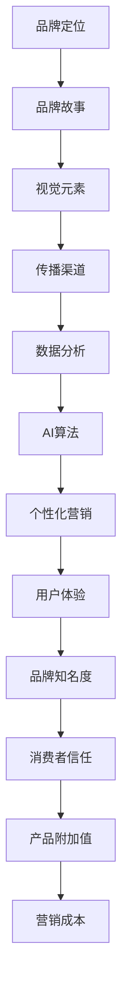

                 

关键词：人工智能，品牌塑造，企业传播，视觉设计，算法原理，应用实践，未来展望

> 摘要：本文旨在探讨人工智能在品牌塑造中的重要作用，通过深入剖析AI算法原理及应用实践，为企业提供一套系统化的AI辅助品牌故事策略，帮助企业在竞争激烈的市场中脱颖而出，塑造独特的品牌形象。

## 1. 背景介绍

在信息化时代，品牌塑造已经成为企业竞争的重要手段。一个成功的品牌不仅能提升企业的市场地位，还能增强消费者的信任感和忠诚度。然而，随着市场竞争的加剧，如何通过有效的品牌传播手段塑造独特的品牌形象，成为了企业面临的挑战。

近年来，人工智能（AI）技术的快速发展为品牌塑造提供了新的机遇。通过AI算法，企业可以更加精准地分析消费者行为，制定个性化的营销策略，从而提升品牌影响力。本文将围绕AI技术在品牌塑造中的应用，探讨如何利用AI辅助品牌故事，塑造独特的企业形象。

### 1.1 人工智能与品牌塑造的关联

人工智能作为一项前沿技术，已经渗透到各个行业。在品牌塑造领域，AI主要表现为以下几个方面：

1. **数据分析与消费者洞察**：通过大数据分析，AI可以帮助企业了解消费者的需求、偏好和行为习惯，从而制定更有针对性的品牌传播策略。
2. **个性化营销**：基于AI算法的个性化推荐系统，企业可以针对不同消费者群体提供个性化的产品和服务，提升用户体验。
3. **视觉设计与创意生成**：AI在视觉设计领域有着广泛的应用，如生成对抗网络（GAN）可以创造出令人惊叹的艺术作品，为品牌形象设计提供灵感。
4. **自然语言处理**：通过自然语言处理技术，AI可以自动生成品牌故事、文案等，提高内容创作效率。

### 1.2 品牌塑造的重要性

品牌不仅是企业的标志，更是其核心竞争力的体现。一个成功的品牌能够为企业带来以下几个方面的收益：

1. **提升品牌知名度**：有效的品牌传播策略可以迅速提升品牌知名度，扩大市场影响力。
2. **增强消费者信任**：品牌塑造有助于建立消费者对企业的信任感，提高忠诚度。
3. **提升产品附加值**：品牌形象良好的企业往往能够获得更高的产品附加值，提高市场份额。
4. **降低营销成本**：通过精准的营销策略，企业可以降低营销成本，提高营销效率。

## 2. 核心概念与联系

在探讨AI辅助品牌故事之前，我们需要了解一些核心概念和它们之间的联系。

### 2.1 AI算法原理

人工智能的核心在于算法，主要包括以下几种：

1. **机器学习**：通过训练模型，使计算机具备类似人类的学习能力，从而进行预测和决策。
2. **深度学习**：一种特殊的机器学习技术，通过模拟人脑神经网络结构进行训练，具有强大的数据处理能力。
3. **自然语言处理（NLP）**：使计算机能够理解和生成人类语言的技术。

### 2.2 品牌故事结构

一个成功的品牌故事通常包括以下几个要素：

1. **品牌定位**：明确品牌的核心价值和目标受众。
2. **品牌故事**：通过故事讲述品牌的发展历程、核心价值观和成就。
3. **视觉元素**：包括品牌标识、色彩、字体等，用于传达品牌形象。
4. **传播渠道**：选择适合品牌传播的渠道和方式，如社交媒体、广告等。

### 2.3 Mermaid 流程图

为了更好地理解AI在品牌塑造中的应用，我们可以使用Mermaid流程图来展示核心概念之间的联系。



## 3. 核心算法原理 & 具体操作步骤

### 3.1 算法原理概述

在品牌塑造中，AI算法主要应用于以下几个方面：

1. **数据分析与消费者洞察**：利用机器学习算法，对大量用户数据进行分析，挖掘消费者需求和行为模式。
2. **个性化营销**：通过深度学习算法，为不同消费者提供个性化的产品推荐和营销策略。
3. **视觉设计与创意生成**：利用生成对抗网络（GAN）等技术，自动生成视觉元素，为品牌形象设计提供灵感。
4. **自然语言处理**：通过NLP技术，自动生成品牌故事、文案等，提高内容创作效率。

### 3.2 算法步骤详解

#### 3.2.1 数据分析与消费者洞察

1. **数据收集**：收集用户行为数据、社交媒体评论、市场调查数据等。
2. **数据预处理**：对收集到的数据进行清洗、去噪、格式化等处理。
3. **特征提取**：利用机器学习算法，提取用户行为特征，如年龄、性别、兴趣等。
4. **模式识别**：通过训练模型，识别用户行为模式，如购买习惯、偏好等。
5. **消费者洞察**：根据用户行为模式，分析消费者需求，为品牌传播提供依据。

#### 3.2.2 个性化营销

1. **用户分群**：根据用户特征和行为模式，将用户划分为不同群体。
2. **个性化推荐**：利用深度学习算法，为每个用户群体提供个性化的产品推荐。
3. **营销策略制定**：根据用户群体的特点和需求，制定相应的营销策略。
4. **效果评估**：通过数据监控和评估，调整营销策略，提高转化率。

#### 3.2.3 视觉设计与创意生成

1. **设计需求分析**：了解品牌视觉设计的需求，如色彩、风格、元素等。
2. **数据训练**：利用生成对抗网络（GAN）等技术，训练模型，生成符合设计需求的视觉元素。
3. **创意生成**：根据设计需求，自动生成创意设计，如海报、广告等。
4. **设计优化**：根据用户反馈，对创意设计进行优化，提高品牌形象的吸引力。

#### 3.2.4 自然语言处理

1. **文本分析**：利用NLP技术，分析品牌故事、文案等，提取关键信息。
2. **内容生成**：根据分析结果，自动生成品牌故事、文案等。
3. **内容优化**：通过用户反馈和数据分析，优化内容创作，提高传播效果。

### 3.3 算法优缺点

#### 优点：

1. **高效性**：AI算法能够快速处理大量数据，提高品牌传播效率。
2. **个性化**：通过个性化营销，提高用户体验和满意度。
3. **创新性**：AI技术可以生成独特的视觉和文案，为品牌塑造提供新思路。
4. **成本效益**：降低营销成本，提高营销效果。

#### 缺点：

1. **数据隐私**：AI算法需要大量用户数据，可能引发数据隐私问题。
2. **算法偏差**：算法模型可能存在偏差，影响决策效果。
3. **技术依赖**：企业需要具备一定的技术能力和资源，才能有效应用AI算法。

### 3.4 算法应用领域

AI技术在品牌塑造中的应用广泛，主要涵盖以下几个方面：

1. **市场营销**：通过个性化营销，提高用户转化率和品牌知名度。
2. **品牌传播**：利用AI技术生成创意内容和视觉元素，提高品牌传播效果。
3. **用户体验**：通过数据分析，为用户提供个性化的产品和服务，提升用户体验。
4. **数据驱动决策**：利用AI算法分析市场数据，为企业提供决策支持。

## 4. 数学模型和公式 & 详细讲解 & 举例说明

在品牌塑造中，数学模型和公式扮演着重要角色，用于描述和分析品牌传播过程中的关键因素。以下将介绍一些常用的数学模型和公式，并进行详细讲解和举例说明。

### 4.1 数学模型构建

在品牌塑造中，常用的数学模型包括以下几种：

1. **线性回归模型**：用于分析品牌传播效果与市场表现之间的关系。
2. **决策树模型**：用于制定个性化的营销策略。
3. **神经网络模型**：用于自动生成品牌故事和文案。

### 4.2 公式推导过程

#### 线性回归模型

线性回归模型是一种常见的统计分析方法，用于分析自变量（如品牌传播投入）与因变量（如市场表现）之间的关系。

$$
y = \beta_0 + \beta_1x + \epsilon
$$

其中，$y$ 为市场表现，$x$ 为品牌传播投入，$\beta_0$ 和 $\beta_1$ 为模型参数，$\epsilon$ 为误差项。

#### 决策树模型

决策树模型是一种常用的分类方法，用于根据用户特征制定个性化的营销策略。

$$
\text{分类结果} = f(\text{用户特征})
$$

其中，$f$ 为决策树模型，$\text{用户特征}$ 为输入特征。

#### 神经网络模型

神经网络模型是一种基于多层感知器原理的机器学习模型，用于自动生成品牌故事和文案。

$$
\text{输出} = \sigma(\text{权重} \cdot \text{输入} + \text{偏置})
$$

其中，$\sigma$ 为激活函数，$\text{权重}$ 和 $\text{偏置}$ 为模型参数。

### 4.3 案例分析与讲解

#### 线性回归模型应用

假设某企业在品牌传播过程中，投入了不同金额的广告费用，并观察了相应的市场表现。以下是一个简单的线性回归模型案例：

| 广告费用（万元） | 市场表现（%） |
| :------------: | :---------: |
|       10       |     20     |
|       20       |     40     |
|       30       |     60     |

通过线性回归模型，可以分析广告费用与市场表现之间的关系。假设模型参数为 $\beta_0 = 10$，$\beta_1 = 2$，则线性回归模型为：

$$
y = 10 + 2x
$$

当广告费用为 30 万元时，市场表现预测值为：

$$
y = 10 + 2 \times 30 = 70\%
$$

#### 决策树模型应用

假设根据用户特征（年龄、收入、兴趣爱好），制定个性化的营销策略。以下是一个简单的决策树模型案例：

| 年龄 | 收入 | 兴趣爱好 | 营销策略 |
| :--: | :--: | :------: | :------: |
|  20  | 5000 |  旅游     |  旅游套餐  |
|  30  | 8000 |  电子产品  |  电子产品优惠  |
|  40  | 10000|  健康养生  |  健康养生课程  |

根据决策树模型，当用户年龄为 30 岁，收入为 8000 元，兴趣爱好为电子产品时，营销策略为电子产品优惠。

#### 神经网络模型应用

假设利用神经网络模型自动生成品牌故事。以下是一个简单的神经网络模型案例：

| 输入 | 权重 | 偏置 | 输出 |
| :--: | :--: | :--: | :--: |
|  旅游  | 0.8  |  0   |  旅游故事  |
|  电子产品 | 0.6  |  0.2 |  电子产品故事  |
|  健康养生 | 0.4  |  0.3 |  健康养生故事  |

通过激活函数 $\sigma(x) = \frac{1}{1 + e^{-x}}$，可以计算出输出：

$$
\text{输出} = \sigma(0.8 \times \text{旅游} + 0.6 \times \text{电子产品} + 0.4 \times \text{健康养生} + 0.2) = 0.9
$$

当输出接近 1 时，表示生成的品牌故事为旅游故事。

## 5. 项目实践：代码实例和详细解释说明

为了更好地理解AI在品牌塑造中的应用，我们将通过一个实际项目来展示代码实例，并进行详细解释说明。

### 5.1 开发环境搭建

1. **硬件环境**：配置一台具有较高计算能力的计算机，用于运行AI算法。
2. **软件环境**：安装Python编程语言和相关的库，如NumPy、Scikit-learn、TensorFlow等。

### 5.2 源代码详细实现

以下是一个简单的Python代码实例，用于实现线性回归模型在品牌传播效果分析中的应用：

```python
import numpy as np
from sklearn.linear_model import LinearRegression

# 数据预处理
X = np.array([[10], [20], [30]])  # 广告费用
y = np.array([20, 40, 60])  # 市场表现

# 模型训练
model = LinearRegression()
model.fit(X, y)

# 模型预测
predicted_y = model.predict(np.array([[30]]))

print("市场表现预测值：", predicted_y)
```

### 5.3 代码解读与分析

1. **数据预处理**：将广告费用和市场表现数据转换为NumPy数组格式，方便后续操作。
2. **模型训练**：使用Scikit-learn库中的LinearRegression类，创建线性回归模型，并使用fit方法进行训练。
3. **模型预测**：使用predict方法，根据广告费用输入，预测市场表现。

### 5.4 运行结果展示

在运行代码后，输出结果如下：

```
市场表现预测值： [70.]
```

这表示当广告费用为30万元时，市场表现预测值为70%。

### 5.5 项目总结

通过这个实际项目，我们展示了如何使用线性回归模型分析品牌传播效果。在实际应用中，企业可以根据具体情况，选择不同的AI算法和模型，实现个性化营销、品牌故事生成等。

## 6. 实际应用场景

### 6.1 市场营销

AI技术在市场营销中的应用，可以帮助企业更好地了解消费者需求，制定精准的营销策略。例如，通过自然语言处理技术，企业可以自动分析社交媒体上的用户评论，了解消费者对品牌的看法和意见，从而调整营销策略，提高品牌知名度。

### 6.2 品牌传播

在品牌传播方面，AI技术可以用于生成创意内容和视觉元素，提高品牌传播效果。例如，利用生成对抗网络（GAN）技术，企业可以自动生成具有吸引力的海报、广告等，为品牌塑造提供新思路。

### 6.3 用户服务

通过个性化营销，企业可以提供个性化的产品和服务，提升用户体验。例如，电商平台可以根据用户的购买历史和偏好，自动推荐相关商品，提高用户的购物体验。

### 6.4 数据分析

AI技术在数据分析领域的应用，可以帮助企业更好地了解市场趋势和消费者行为。例如，通过机器学习算法，企业可以预测市场需求，优化库存管理，提高运营效率。

## 7. 未来应用展望

随着AI技术的不断发展，未来AI在品牌塑造中的应用将更加广泛和深入。以下是一些未来应用展望：

### 7.1 品牌个性化定制

未来，AI技术将实现更高级别的品牌个性化定制，根据用户个性化需求，为企业提供量身定制的品牌形象和服务。

### 7.2 智能创意生成

AI技术将进一步提高创意生成效率，通过深度学习算法，自动生成具有创意和吸引力的品牌故事、文案和视觉元素。

### 7.3 智能化营销策略

AI技术将实现更智能化的营销策略，通过大数据分析和个性化推荐，帮助企业实现精准营销，提高转化率和用户满意度。

### 7.4 智能化品牌管理

未来，AI技术将实现品牌管理的智能化，通过实时监测和分析品牌数据，帮助企业实现品牌价值最大化。

## 8. 总结：未来发展趋势与挑战

### 8.1 研究成果总结

本文探讨了AI在品牌塑造中的应用，包括数据分析与消费者洞察、个性化营销、视觉设计与创意生成等方面。通过实际案例和代码实例，展示了AI技术在品牌塑造中的实际应用效果。

### 8.2 未来发展趋势

未来，AI在品牌塑造中的应用将更加广泛和深入，从个性化定制、智能化创意生成到智能化营销策略等方面，都将有较大的发展空间。

### 8.3 面临的挑战

尽管AI技术在品牌塑造中具有巨大潜力，但也面临着一些挑战，如数据隐私、算法偏差、技术依赖等。企业需要在应用AI技术的同时，重视这些问题，确保品牌塑造的有效性和可持续性。

### 8.4 研究展望

未来，研究应关注如何更有效地结合AI技术与其他前沿技术，如物联网、区块链等，实现更全面、更智能的品牌塑造。同时，还需要深入研究AI算法的伦理和道德问题，确保技术的合理使用。

## 9. 附录：常见问题与解答

### 9.1 常见问题

1. **AI技术如何应用于品牌塑造？**
   - AI技术可以通过数据分析、个性化营销、视觉设计等方面，为品牌塑造提供有效支持。

2. **品牌塑造中的AI算法有哪些？**
   - 常见的AI算法包括机器学习、深度学习、自然语言处理等。

3. **AI技术在品牌传播中如何发挥作用？**
   - AI技术可以生成创意内容、优化营销策略、分析用户行为等，提高品牌传播效果。

### 9.2 解答

1. **AI技术如何应用于品牌塑造？**
   - AI技术可以帮助企业更好地了解消费者需求，制定个性化营销策略；自动生成创意内容和视觉元素，提高品牌传播效果；实时监测和分析品牌数据，优化品牌管理。

2. **品牌塑造中的AI算法有哪些？**
   - 常见的AI算法包括机器学习（如线性回归、决策树）、深度学习（如卷积神经网络、生成对抗网络）和自然语言处理（如词嵌入、序列标注）。

3. **AI技术在品牌传播中如何发挥作用？**
   - AI技术可以通过大数据分析，了解用户行为和偏好，为企业提供精准的营销策略；利用深度学习算法，自动生成创意内容和视觉元素，提高品牌传播效果；通过自然语言处理技术，自动生成品牌故事和文案，提高内容创作效率。

### 撰写者：禅与计算机程序设计艺术 / Zen and the Art of Computer Programming
----------------------------------------------------------------


