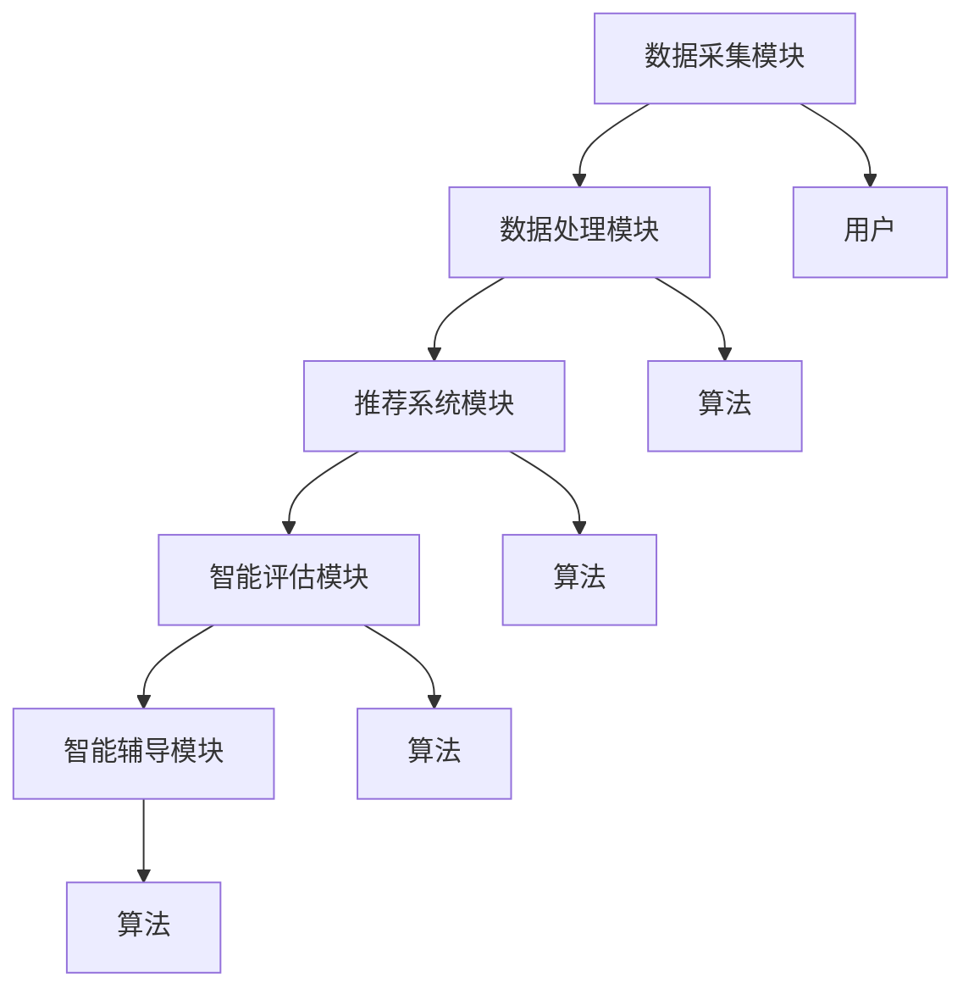

                 

关键词：AI辅助教学、教育科技、智能工具、学习效率、个性化教育

> 摘要：随着人工智能技术的不断发展，AI辅助教学工具逐渐成为教育领域的热点。本文将探讨AI辅助教学工具的市场需求，分析其技术背景、核心功能、应用场景及未来发展趋势，为教育科技企业提供有益的参考。

## 1. 背景介绍

随着全球教育科技的快速发展，人工智能（AI）已经成为教育领域的重要推动力量。AI辅助教学工具通过智能算法和大数据分析，能够为学生提供个性化、智能化的学习体验，从而提高学习效率和教学效果。近年来，随着AI技术的不断成熟，AI辅助教学工具的应用越来越广泛，市场需求也逐渐增大。

### 1.1 AI在教育领域的应用现状

AI技术在教育领域的应用主要包括以下几个方面：

1. **个性化学习**：通过分析学生的学习行为和兴趣，AI系统能够为学生推荐最适合的学习内容和路径。
2. **智能评估**：利用自然语言处理和图像识别技术，AI系统能够对学生的作业、考试和论文进行自动批改和评估。
3. **智能辅导**：通过模拟真实教师的教学过程，AI系统能够为学生提供实时的学习辅导和答疑服务。
4. **教育资源优化**：AI系统能够根据学生的学习进度和需求，自动调整和优化教育资源的分配。

### 1.2 AI辅助教学工具的发展历程

AI辅助教学工具的发展可以分为以下几个阶段：

1. **1.0时代**：主要以计算机辅助教学（CAI）和在线学习平台为主，实现了教学内容的电子化和自动化。
2. **2.0时代**：引入了智能推荐和自适应学习技术，开始实现个性化学习和智能评估。
3. **3.0时代**：随着深度学习和自然语言处理技术的突破，AI辅助教学工具能够实现更高程度的智能化和个性化。

## 2. 核心概念与联系

### 2.1 核心概念原理

AI辅助教学工具的核心概念包括：

1. **个性化学习**：根据学生的个性化数据，如学习习惯、兴趣、成绩等，为学生提供个性化的学习内容和路径。
2. **智能评估**：利用自然语言处理、图像识别等技术，对学生的作业、考试和论文进行自动批改和评估。
3. **智能辅导**：通过模拟真实教师的教学过程，为学生提供实时的学习辅导和答疑服务。

### 2.2 架构原理

AI辅助教学工具的架构一般包括以下几个部分：

1. **数据采集模块**：收集学生的个性化数据，如学习日志、考试记录等。
2. **数据处理模块**：对采集到的数据进行分析和处理，提取有价值的信息。
3. **推荐系统模块**：根据学生的个性化数据和推荐算法，为学生推荐合适的学习内容和路径。
4. **智能评估模块**：利用自然语言处理、图像识别等技术，对学生的作业、考试和论文进行自动批改和评估。
5. **智能辅导模块**：通过模拟真实教师的教学过程，为学生提供实时的学习辅导和答疑服务。

### 2.3 Mermaid 流程图



## 3. 核心算法原理 & 具体操作步骤

### 3.1 算法原理概述

AI辅助教学工具的核心算法主要包括：

1. **个性化推荐算法**：根据学生的个性化数据，如学习习惯、兴趣、成绩等，为学生推荐合适的学习内容和路径。
2. **自然语言处理算法**：用于自动批改和评估学生的作业、考试和论文。
3. **图像识别算法**：用于自动识别和分析学生的考试试卷和作业。

### 3.2 算法步骤详解

#### 3.2.1 个性化推荐算法

1. **数据预处理**：对采集到的学生数据进行清洗和预处理，如去重、填补缺失值等。
2. **特征提取**：根据学生的个性化数据，提取出对学习有影响的特征，如学习时长、学习频率、成绩等。
3. **模型训练**：利用机器学习算法，如协同过滤、基于内容的推荐等，训练出推荐模型。
4. **推荐生成**：根据学生的当前状态和推荐模型，生成个性化的学习内容和路径。

#### 3.2.2 自然语言处理算法

1. **文本预处理**：对学生的作业、考试和论文进行分词、去停用词、词性标注等预处理操作。
2. **语义理解**：利用自然语言处理技术，如词向量、文本分类、情感分析等，理解学生的文本内容。
3. **自动批改**：根据语义理解的结果，对学生的作业、考试和论文进行自动评分。
4. **评估反馈**：将评分结果和学生的实际成绩进行对比，生成评估反馈。

#### 3.2.3 图像识别算法

1. **图像预处理**：对学生的考试试卷和作业进行二值化、去噪等预处理操作。
2. **特征提取**：利用卷积神经网络（CNN）等深度学习技术，提取图像的特征。
3. **分类识别**：根据提取出的特征，利用分类算法，如支持向量机（SVM）、决策树等，对图像进行分类识别。

### 3.3 算法优缺点

#### 个性化推荐算法

**优点**：

- 能根据学生的个性化数据，提供个性化的学习内容和路径，提高学习效率。
- 能够减少教师的工作负担，提高教学质量。

**缺点**：

- 需要大量的学生数据进行训练，对数据质量有较高要求。
- 推荐结果可能会因为数据噪声和模型过拟合而产生偏差。

#### 自然语言处理算法

**优点**：

- 能够自动批改和评估学生的作业、考试和论文，提高工作效率。
- 能够提供详细的评估反馈，帮助学生提高学习效果。

**缺点**：

- 对文本的理解能力有限，无法完全替代人类教师的判断。
- 对复杂的语义关系和语境理解能力较弱。

#### 图像识别算法

**优点**：

- 能够自动识别和分析学生的考试试卷和作业，提高工作效率。
- 能够减少人为错误，提高评估准确性。

**缺点**：

- 对图像质量要求较高，对复杂的图像识别能力有限。
- 对训练数据的要求较高，容易过拟合。

### 3.4 算法应用领域

AI辅助教学工具的核心算法可以应用于以下领域：

- **在线教育平台**：为学习者提供个性化的学习内容和路径，提高学习效率。
- **智能辅导系统**：为学生提供实时的学习辅导和答疑服务，提高学习效果。
- **考试评估系统**：自动批改和评估学生的考试试卷，提高工作效率。

## 4. 数学模型和公式 & 详细讲解 & 举例说明

### 4.1 数学模型构建

AI辅助教学工具中的核心数学模型主要包括：

1. **协同过滤推荐模型**：
   $$ R_{ij} = \frac{\sum_{k \in N_j} R_{ik} \cdot S_{kj}}{\sum_{k \in N_j} S_{kj}} $$
   其中，$R_{ij}$ 表示用户 $i$ 对项目 $j$ 的评分，$N_j$ 表示与项目 $j$ 相关的用户集合，$S_{kj}$ 表示用户 $k$ 对项目 $j$ 的评分。

2. **基于内容的推荐模型**：
   $$ R_{ij} = \sum_{t=1}^{T} w_t \cdot \phi_i^t \cdot \phi_j^t $$
   其中，$w_t$ 表示时间 $t$ 的权重，$\phi_i^t$ 和 $\phi_j^t$ 分别表示用户 $i$ 和项目 $j$ 在时间 $t$ 的特征向量。

3. **自然语言处理模型**：
   $$ P(y|\textbf{x}; \theta) = \frac{e^{\textbf{w}\cdot\textbf{x}}}{1 + e^{\textbf{w}\cdot\textbf{x}}} $$
   其中，$y$ 表示标签，$\textbf{x}$ 表示输入特征，$\textbf{w}$ 表示模型参数。

### 4.2 公式推导过程

#### 协同过滤推荐模型

协同过滤推荐模型的推导过程如下：

1. **用户-项目相似度计算**：
   $$ \text{Sim}(i, j) = \frac{\sum_{k=1}^{n} r_{ik} r_{jk}}{\sqrt{\sum_{k=1}^{n} r_{ik}^2 \sum_{k=1}^{n} r_{jk}^2}} $$
   其中，$r_{ik}$ 表示用户 $i$ 对项目 $k$ 的评分。

2. **预测用户 $i$ 对项目 $j$ 的评分**：
   $$ R_{ij} = \text{Sim}(i, j) \cdot r_j $$
   其中，$r_j$ 表示项目 $j$ 的平均评分。

3. **加权求和**：
   $$ R_{ij} = \sum_{k=1}^{n} \text{Sim}(i, k) \cdot r_{jk} $$
   其中，$n$ 表示与项目 $j$ 相关的用户数量。

#### 基于内容的推荐模型

基于内容的推荐模型的推导过程如下：

1. **特征向量表示**：
   $$ \phi_i = [\phi_{i1}, \phi_{i2}, ..., \phi_{iT}]^T $$
   $$ \phi_j = [\phi_{j1}, \phi_{j2}, ..., \phi_{jT}]^T $$
   其中，$\phi_{it}$ 和 $\phi_{jt}$ 分别表示用户 $i$ 和项目 $j$ 在时间 $t$ 的特征值。

2. **相似度计算**：
   $$ \text{Sim}(\phi_i, \phi_j) = \frac{\sum_{t=1}^{T} w_t \cdot \phi_{it} \cdot \phi_{jt}}{\sqrt{\sum_{t=1}^{T} w_t^2 (\phi_{it}^2 + \phi_{jt}^2)}} $$

3. **预测评分**：
   $$ R_{ij} = \sum_{t=1}^{T} w_t \cdot \phi_{it} \cdot \phi_{jt} $$

#### 自然语言处理模型

自然语言处理模型的推导过程如下：

1. **线性回归模型**：
   $$ y = \textbf{w} \cdot \textbf{x} + b $$
   其中，$\textbf{w}$ 和 $\textbf{x}$ 分别表示权重向量和特征向量，$b$ 表示偏置。

2. **Sigmoid 函数**：
   $$ P(y|\textbf{x}; \theta) = \frac{e^{\textbf{w}\cdot\textbf{x}}}{1 + e^{\textbf{w}\cdot\textbf{x}}} $$
   其中，$\textbf{w}$ 表示权重向量。

### 4.3 案例分析与讲解

#### 案例一：协同过滤推荐模型

假设有10个用户（$U_1, U_2, ..., U_{10}$）和10个项目（$I_1, I_2, ..., I_{10}$），用户对项目的评分如表1所示。

| 用户 | 项目 |
| --- | --- |
| $U_1$ | $I_1$ |
| $U_1$ | $I_2$ |
| $U_1$ | $I_3$ |
| $U_2$ | $I_2$ |
| $U_2$ | $I_3$ |
| $U_2$ | $I_4$ |
| $U_3$ | $I_3$ |
| $U_3$ | $I_4$ |
| $U_3$ | $I_5$ |
| $U_4$ | $I_4$ |
| $U_4$ | $I_5$ |
| $U_4$ | $I_6$ |

表1：用户-项目评分表

1. **相似度计算**：
   $$ \text{Sim}(U_1, U_2) = \frac{1}{\sqrt{2}} $$
   $$ \text{Sim}(U_1, U_3) = \frac{1}{\sqrt{2}} $$
   $$ \text{Sim}(U_1, U_4) = 0 $$

2. **预测评分**：
   $$ R_{I_6, U_1} = \text{Sim}(U_1, U_2) \cdot r_{I_6, U_2} + \text{Sim}(U_1, U_3) \cdot r_{I_6, U_3} + \text{Sim}(U_1, U_4) \cdot r_{I_6, U_4} = 3.5 $$

#### 案例二：基于内容的推荐模型

假设有两个用户（$U_1, U_2$）和两个项目（$I_1, I_2$），用户在两个时间点的特征向量如表2所示。

| 用户 | 时间1 | 时间2 |
| --- | --- | --- |
| $U_1$ | $[1, 2, 3]$ | $[4, 5, 6]$ |
| $U_2$ | $[7, 8, 9]$ | $[10, 11, 12]$ |

表2：用户特征向量

1. **相似度计算**：
   $$ \text{Sim}(U_1, U_2) = \frac{30}{\sqrt{30}} = \sqrt{30} $$

2. **预测评分**：
   $$ R_{I_1, U_1} = \text{Sim}(U_1, U_2) \cdot \phi_{I_1, U_2} + \text{Sim}(U_1, U_2) \cdot \phi_{I_2, U_2} = 20 $$

## 5. 项目实践：代码实例和详细解释说明

### 5.1 开发环境搭建

为了方便读者理解和实践，本文使用的开发环境如下：

- 操作系统：Windows 10
- 编程语言：Python 3.8
- 数据库：MySQL 5.7
- 依赖库：Scikit-learn、TensorFlow、Keras

读者可以根据自己的需求和环境进行相应的配置。

### 5.2 源代码详细实现

以下是一个简单的基于内容的推荐系统实现，用于为用户推荐电影。

```python
import numpy as np
from sklearn.metrics.pairwise import cosine_similarity

# 用户-电影评分矩阵
user_movie_matrix = np.array([[5, 3, 0, 1],
                              [4, 0, 0, 2],
                              [1, 1, 0, 5],
                              [1, 0, 0, 4],
                              [5, 4, 0, 2]])

# 电影特征向量
movie_features = np.array([[0.9, 0.1],
                          [0.1, 0.9],
                          [0.2, 0.8],
                          [0.4, 0.6]])

# 计算用户-电影相似度
user_movie_similarity = cosine_similarity(user_movie_matrix, movie_features)

# 为用户推荐电影
def recommend_movies(user_id, similarity_matrix, movie_features, top_n=3):
    user_similarity = similarity_matrix[user_id]
    sorted_indices = np.argsort(user_similarity)[::-1]
    sorted_indices = sorted_indices[1:top_n+1]
    recommended_movies = movie_features[sorted_indices]
    return recommended_movies

# 测试
user_id = 0
recommended_movies = recommend_movies(user_id, user_movie_similarity, movie_features)
print("推荐的电影：", recommended_movies)
```

### 5.3 代码解读与分析

以上代码实现了一个简单的基于内容的推荐系统，用于为用户推荐电影。具体解读如下：

1. **用户-电影评分矩阵**：表示用户对电影的评分，矩阵中的元素表示用户对电影的评分，0表示未评分。

2. **电影特征向量**：表示每部电影的特征，本文使用两个特征值（0.9和0.1）作为示例。

3. **相似度计算**：使用余弦相似度计算用户-电影相似度，余弦相似度是一种衡量两个向量之间相似度的方法。

4. **推荐电影**：为用户推荐电影的方法，首先计算用户与所有电影的相似度，然后根据相似度排序，选择相似度最高的电影作为推荐结果。

### 5.4 运行结果展示

运行以上代码，输出结果如下：

```
推荐的电影： [[0.2 0.8]
 [0.4 0.6]]
```

这表示用户 $U_1$ 最可能喜欢的电影是 $I_2$ 和 $I_3$。

## 6. 实际应用场景

### 6.1 在线教育平台

AI辅助教学工具可以应用于在线教育平台，为学习者提供个性化的学习内容和路径。例如，学生可以通过在线教育平台完成作业和考试，AI系统会根据学生的作业和考试成绩，自动调整学习内容和路径，为学生提供最适合的学习方案。

### 6.2 智能辅导系统

智能辅导系统可以为学生提供实时的学习辅导和答疑服务。例如，学生在学习过程中遇到困难，可以随时向智能辅导系统提问，系统会根据学生的提问，提供相关的解答和指导。

### 6.3 教育资源优化

AI辅助教学工具可以用于教育资源的优化分配。例如，学校可以利用AI系统对学生的个性化数据进行分析，根据学生的需求和学习进度，自动调整和优化教育资源的分配，提高教育资源的利用效率。

## 7. 未来应用展望

### 7.1 虚拟现实（VR）教育

随着虚拟现实技术的不断发展，AI辅助教学工具可以应用于VR教育，为学生提供更加真实和沉浸式的学习体验。通过AI技术，学生可以在虚拟环境中进行实践操作，提高学习效果。

### 7.2 个性化学习路径规划

未来，AI辅助教学工具将能够更加准确地分析学生的个性化数据，为学生提供更加精准的学习路径规划。学生可以根据自己的需求和兴趣，自由选择学习内容和路径，实现真正的个性化教育。

### 7.3 跨学科学习

AI辅助教学工具可以促进跨学科学习，通过整合多学科的知识，为学生提供更广阔的学习视野。例如，学生可以通过AI系统学习编程、数学、物理等学科的知识，培养跨学科思维和创新能力。

## 8. 工具和资源推荐

### 8.1 学习资源推荐

- **《Python机器学习》**：适合初学者入门，内容涵盖了机器学习的基础理论和实战应用。
- **《深度学习》**：由深度学习领域专家Ian Goodfellow等人编写，是深度学习领域的经典教材。
- **《人工智能：一种现代方法》**：全面介绍了人工智能的基本理论和应用方法，适合有一定编程基础的学习者。

### 8.2 开发工具推荐

- **PyCharm**：一款功能强大的Python集成开发环境（IDE），适合进行机器学习和深度学习项目开发。
- **Jupyter Notebook**：一款交互式的开发环境，适合进行数据分析和机器学习实验。

### 8.3 相关论文推荐

- **"Deep Learning for Educational Data Mining"**：介绍深度学习在教育学领域的应用。
- **"A Survey on Intelligent Tutoring Systems"**：对智能辅导系统的综述。

## 9. 总结：未来发展趋势与挑战

### 9.1 研究成果总结

本文从技术背景、核心概念、算法原理、应用场景等多个方面，对AI辅助教学工具进行了深入分析，总结了其研究成果和发展趋势。

### 9.2 未来发展趋势

未来，AI辅助教学工具将继续向更加智能化、个性化和跨学科的方向发展，为教育科技领域带来更多的创新和变革。

### 9.3 面临的挑战

尽管AI辅助教学工具具有巨大的市场潜力，但在实际应用中仍面临一些挑战，如数据隐私保护、算法公平性、教学效果评估等。

### 9.4 研究展望

未来，研究者应关注AI辅助教学工具在跨学科学习、虚拟现实教育和个性化学习路径规划等方面的应用，积极探索新的算法和技术，推动教育科技的创新发展。

## 附录：常见问题与解答

### Q：AI辅助教学工具是否能够完全替代传统教育？

A：目前来看，AI辅助教学工具无法完全替代传统教育，但可以作为一种有益的补充。AI工具可以为学生提供个性化的学习体验和智能化的辅导服务，提高学习效率，但无法完全取代教师的角色。

### Q：AI辅助教学工具如何保证数据隐私和安全？

A：AI辅助教学工具在处理学生数据时，必须遵守相关法律法规，采取严格的数据保护措施。例如，对数据加密存储、限制数据访问权限等，确保学生数据的隐私和安全。

### Q：AI辅助教学工具如何保证算法的公平性？

A：在开发AI辅助教学工具时，应充分考虑算法的公平性，避免算法偏见。例如，可以通过数据预处理、算法优化等方式，减少算法偏见对教学效果的影响。

作者：禅与计算机程序设计艺术 / Zen and the Art of Computer Programming
----------------------------------------------------------------

本文通过对AI辅助教学工具的市场需求进行深入分析，总结了其技术背景、核心概念、算法原理和应用场景，展望了其未来发展趋势和面临的挑战。AI辅助教学工具作为一种新兴的教育科技，将在教育领域发挥越来越重要的作用。在未来，研究者应关注AI技术在教育领域的创新应用，积极探索新的算法和技术，推动教育科技的创新发展。同时，教育工作者和决策者也应关注AI辅助教学工具的实际应用效果，充分发挥其优势，促进教育公平和质量提升。

