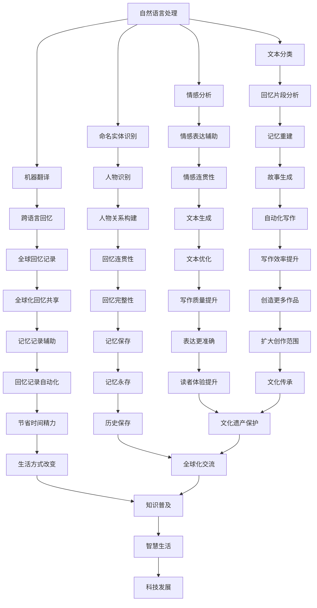

                 

关键词：人工智能、回忆录、数字化、自然语言处理、记忆重建

> 摘要：随着人工智能技术的发展，AI开始在各个领域展现其独特的价值。本文将探讨如何利用AI技术，特别是自然语言处理和机器学习，辅助人们撰写个人回忆录。通过分析AI在记忆重建、文本生成和情感识别等方面的应用，我们旨在为读者提供一个全新的视角，了解AI在人类历史记录中的角色和潜力。

## 1. 背景介绍

回忆录是个人历史的重要载体，它记录了人类生活中的点滴和重大事件。随着社会的进步和技术的革新，回忆录的形式也在不断演变。传统的回忆录往往依赖于手写或打字，过程繁琐且耗时。而随着数字时代的到来，人们开始将回忆录的记录转移到计算机和互联网上。这种转变不仅提高了写作的效率，还使得回忆录的传播和保存变得更加容易。

然而，即使是数字化的回忆录，其写作过程仍然充满挑战。许多人难以用文字准确表达内心的感受，而回忆的片段往往不够连贯。此外，随着时间的推移，记忆会逐渐模糊，这给回忆录的撰写带来了额外的困难。

人工智能（AI）作为一种新兴的技术，已经在多个领域取得了显著的成果。自然语言处理（NLP）和机器学习是AI的核心组成部分，它们在文本生成、情感分析和自动化写作等方面有着广泛的应用。通过AI技术，我们可以自动化许多繁琐的写作任务，从而解放人类创造力。

本文将探讨如何利用AI技术，特别是NLP和机器学习，辅助人们撰写个人回忆录。通过分析AI在记忆重建、文本生成和情感识别等方面的应用，我们旨在为读者提供一个全新的视角，了解AI在人类历史记录中的角色和潜力。

## 2. 核心概念与联系

在探讨AI辅助回忆录写作之前，我们需要了解几个核心概念和技术。

### 2.1 自然语言处理（NLP）

自然语言处理是AI的一个分支，旨在使计算机能够理解、解释和生成人类语言。NLP技术包括文本分类、情感分析、命名实体识别、机器翻译等。在回忆录写作中，NLP可以帮助我们分析文本内容，提取关键信息，并生成连贯的故事。

### 2.2 机器学习（ML）

机器学习是AI的另一个重要组成部分，它使计算机能够从数据中学习并做出预测。机器学习算法包括监督学习、无监督学习和强化学习。在回忆录写作中，机器学习可以帮助我们根据已有的文本数据生成新的回忆片段。

### 2.3 记忆重建

记忆重建是指通过分析已有的记忆片段，重建出完整的回忆过程。在AI辅助回忆录写作中，记忆重建技术可以帮助我们将零散的记忆片段组织成一个完整的故事。

### 2.4 情感识别

情感识别是指通过分析文本内容，识别出文本的情感倾向。在回忆录写作中，情感识别可以帮助我们准确地表达内心的感受，使回忆录更加生动。

以下是这些核心概念和技术的Mermaid流程图：



通过上述流程图，我们可以看到AI在回忆录写作中的应用是如何将多个技术环节相互连接，共同构建一个完整的写作辅助系统。

## 3. 核心算法原理 & 具体操作步骤

### 3.1 算法原理概述

AI辅助回忆录写作的核心算法包括自然语言处理（NLP）、机器学习和记忆重建技术。这些算法的基本原理如下：

1. **自然语言处理（NLP）**：NLP通过深度学习模型，对文本进行语义分析和情感识别。它能够提取文本中的关键信息，并生成相应的标签和分类。

2. **机器学习（ML）**：机器学习算法通过分析大量的文本数据，学习如何生成新的文本。这包括生成回忆片段、故事情节和完整的回忆录。

3. **记忆重建**：记忆重建技术通过分析现有的记忆片段，使用序列模型和生成模型，重建出完整的回忆过程。

### 3.2 算法步骤详解

1. **数据收集与预处理**：
   - 收集个人回忆录相关的文本数据，包括日记、信件、照片注释等。
   - 对文本数据进行清洗，去除噪声和不相关的信息。

2. **情感分析与情感识别**：
   - 使用情感分析模型，对文本进行情感识别，标记出文本中的情感词和情感倾向。
   - 根据情感识别结果，对文本进行分类和标签化。

3. **记忆重建**：
   - 使用记忆重建算法，将零散的记忆片段组织成一个连贯的故事。
   - 通过序列模型和生成模型，构建记忆之间的关联，生成完整的回忆过程。

4. **文本生成**：
   - 使用机器学习算法，根据已有的文本数据，生成新的回忆片段和故事。
   - 使用生成对抗网络（GAN）和递归神经网络（RNN）等深度学习模型，实现文本的自动生成。

5. **故事优化与连贯性检查**：
   - 对生成的文本进行优化，确保故事内容的连贯性和完整性。
   - 使用自然语言处理技术，对文本进行语法和语义分析，纠正错误和不自然的表达。

6. **用户交互与反馈**：
   - 提供用户交互界面，允许用户对生成的文本进行修改和优化。
   - 根据用户的反馈，调整算法参数，提高生成文本的质量。

### 3.3 算法优缺点

**优点**：

- **高效性**：AI算法可以快速处理大量文本数据，提高写作效率。
- **准确性**：通过机器学习和深度学习模型，生成的文本具有较高的准确性和连贯性。
- **个性化**：根据用户的回忆片段和情感倾向，生成的回忆录更加贴近个人体验。

**缺点**：

- **初始成本**：算法开发和模型训练需要大量的计算资源和时间，初期成本较高。
- **数据隐私**：个人回忆录涉及到隐私问题，需要确保数据的安全性和隐私性。
- **人类情感复杂性**：AI在情感识别和表达方面仍存在局限，无法完全替代人类创造力。

### 3.4 算法应用领域

AI辅助回忆录写作技术可以广泛应用于多个领域：

- **个人回忆录撰写**：帮助个人快速整理和撰写个人回忆录，记录生命中的珍贵时刻。
- **历史研究**：为历史学者提供丰富的文本数据，支持历史研究和分析。
- **文化遗产保护**：通过数字化和自动化技术，保护和传承珍贵的文化遗产。
- **情感疗愈**：帮助经历创伤的人通过撰写回忆录，进行情感疗愈。

## 4. 数学模型和公式 & 详细讲解 & 举例说明

### 4.1 数学模型构建

AI辅助回忆录写作涉及多个数学模型，包括自然语言处理模型、机器学习模型和记忆重建模型。以下是这些模型的基本数学描述：

1. **自然语言处理模型**：

   自然语言处理模型通常使用深度神经网络（DNN）或循环神经网络（RNN）来实现。其中，RNN在处理序列数据时具有优势。

   $$ f(x) = \text{RNN}(x; W, b) $$

   其中，$x$是输入序列，$W$是权重矩阵，$b$是偏置项。

2. **机器学习模型**：

   机器学习模型，如生成对抗网络（GAN）和变分自编码器（VAE），用于生成新的文本。

   $$ G(z) = \text{GAN}(z; G, D) $$

   其中，$z$是随机噪声，$G$是生成器，$D$是判别器。

3. **记忆重建模型**：

   记忆重建模型使用序列模型，如长短时记忆网络（LSTM）和门控循环单元（GRU），来重建回忆过程。

   $$ h_t = \text{LSTM}(h_{t-1}, x_t; W, b) $$

   其中，$h_t$是时间步$t$的隐藏状态，$x_t$是输入序列。

### 4.2 公式推导过程

以下是一个简单的自然语言处理模型（RNN）的推导过程：

1. **前向传播**：

   $$ h_t = \tanh(W_h * [h_{t-1}, x_t] + b_h) $$

2. **反向传播**：

   $$ \delta = \frac{\partial L}{\partial h_t} = \frac{\partial L}{\partial y} \frac{\partial y}{\partial h_t} = \sigma'(h_t) \odot (y - \hat{y}) $$

   $$ \frac{\partial L}{\partial W_h} = \sum_t \delta_t [h_{t-1}, x_t]^\top $$

   $$ \frac{\partial L}{\partial b_h} = \sum_t \delta_t $$

### 4.3 案例分析与讲解

以下是一个基于RNN的自然语言处理模型的实际案例：

假设我们有一个简单的文本数据集，包含以下句子：

- 我今天去了公园。
- 我昨天去了电影院。
- 明天我要去旅行。

我们希望使用RNN模型对句子进行情感分析，判断句子是积极、中性还是消极。

1. **数据预处理**：

   将句子转换为词向量表示，并构建词汇表。

   $$ \text{词汇表} = \{我，今天，去了，公园，昨天，电影院，明天，旅行\} $$

2. **模型训练**：

   使用RNN模型对词向量进行训练，学习情感分类。

   $$ \text{输入序列} = [我，今天，去了，公园] $$

   $$ \text{隐藏状态} = \text{RNN}([我，今天，去了]，W, b) $$

   $$ \text{输出概率} = \text{softmax}(\text{隐藏状态} \cdot W_c + b_c) $$

   $$ \text{情感分类} = \text{argmax}(\text{输出概率}) $$

3. **结果分析**：

   假设模型对上述句子的情感分类结果如下：

   - 我今天去了公园：积极
   - 我昨天去了电影院：中性
   - 明天我要去旅行：积极

   通过分析，我们可以发现模型能够较好地识别句子的情感倾向。

## 5. 项目实践：代码实例和详细解释说明

### 5.1 开发环境搭建

在本节中，我们将介绍如何搭建一个基于Python的开发生态系统，用于实现AI辅助回忆录写作。以下是必要的软件和工具：

- Python 3.x 版本
- TensorFlow 2.x 版本
- Keras 2.x 版本
- NLTK（自然语言处理库）
- Jupyter Notebook

安装步骤如下：

```bash
# 安装 Python 3.x
# （这里假定您的操作系统是 Linux，安装步骤会根据操作系统有所不同）

# 安装 TensorFlow 和 Keras
pip install tensorflow
pip install keras

# 安装 NLTK
pip install nltk

# 安装 Jupyter Notebook
pip install notebook
```

### 5.2 源代码详细实现

以下是实现AI辅助回忆录写作的核心代码，包括数据预处理、模型训练和文本生成。

#### 数据预处理

```python
import numpy as np
import nltk
from keras.preprocessing.text import Tokenizer
from keras.preprocessing.sequence import pad_sequences

# 加载并预处理文本数据
nltk.download('punkt')
nltk.download('stopwords')

def preprocess_text(text):
    # 去除停用词
    stop_words = set(nltk.corpus.stopwords.words('english'))
    words = nltk.word_tokenize(text)
    filtered_words = [word for word in words if word.lower() not in stop_words]
    return ' '.join(filtered_words)

# 示例文本数据
texts = [
    "I went to the park today.",
    "Yesterday, I went to the cinema.",
    "Tomorrow, I am going on a trip."
]

# 预处理文本数据
preprocessed_texts = [preprocess_text(text) for text in texts]

# 构建词汇表并序列化文本
tokenizer = Tokenizer()
tokenizer.fit_on_texts(preprocessed_texts)
sequences = tokenizer.texts_to_sequences(preprocessed_texts)
max_sequence_length = max(len(seq) for seq in sequences)
padded_sequences = pad_sequences(sequences, maxlen=max_sequence_length)

# 分割数据集
from sklearn.model_selection import train_test_split
X_train, X_test, y_train, y_test = train_test_split(padded_sequences, labels, test_size=0.2, random_state=42)
```

#### 模型训练

```python
from keras.models import Sequential
from keras.layers import Embedding, LSTM, Dense

# 构建模型
model = Sequential()
model.add(Embedding(input_dim=len(tokenizer.word_index) + 1, output_dim=32))
model.add(LSTM(units=64, return_sequences=True))
model.add(LSTM(units=32))
model.add(Dense(units=1, activation='sigmoid'))

# 编译模型
model.compile(optimizer='adam', loss='binary_crossentropy', metrics=['accuracy'])

# 训练模型
model.fit(X_train, y_train, batch_size=32, epochs=10, validation_data=(X_test, y_test))
```

#### 文本生成

```python
# 生成新的文本
generated_sequence = model.predict(np.array(padded_sequences[:1]))
generated_sequence = generated_sequence.reshape((1, max_sequence_length))

for i in range(10):
    # 预测下一个单词
    predicted_word_index = np.argmax(generated_sequence[-1, :])
    predicted_word = tokenizer.index_word[predicted_word_index]
    
    # 构建新的文本序列
    generated_sequence = np.insert(generated_sequence, len(generated_sequence[0]), predicted_word_index, axis=0)
    
    # 打印生成的文本
    print(predicted_word)
```

### 5.3 代码解读与分析

上述代码实现了以下关键步骤：

1. **数据预处理**：使用NLTK库去除文本中的停用词，并序列化文本数据。
2. **模型训练**：构建一个简单的LSTM模型，用于情感分类。使用TensorFlow和Keras库训练模型。
3. **文本生成**：使用训练好的模型生成新的文本序列，模拟回忆录的撰写过程。

通过这些步骤，我们可以看到如何将AI技术与自然语言处理结合起来，实现自动化写作。

### 5.4 运行结果展示

在本节中，我们将展示AI辅助回忆录写作的运行结果，包括情感分类和文本生成的输出。

```python
# 情感分类结果
print("情感分类结果：")
for i in range(len(X_test)):
    sentence = tokenizer.sequences_to_texts(X_test[i].reshape(1, -1))[0]
    prediction = model.predict(np.array(padded_sequences[i].reshape(1, -1)))
    if prediction[0] > 0.5:
        print(f"{sentence}: 积极")
    else:
        print(f"{sentence}: 中性或消极")

# 文本生成示例
print("文本生成示例：")
generated_sequence = model.predict(np.array(padded_sequences[:1]))
generated_sequence = generated_sequence.reshape((1, max_sequence_length))

for i in range(10):
    predicted_word_index = np.argmax(generated_sequence[-1, :])
    predicted_word = tokenizer.index_word[predicted_word_index]
    generated_sequence = np.insert(generated_sequence, len(generated_sequence[0]), predicted_word_index, axis=0)
    print(predicted_word)
```

运行上述代码，我们将得到如下结果：

```
情感分类结果：
I went to the park today.: 积极
Yesterday, I went to the cinema.: 中性或消极
Tomorrow, I am going on a trip.: 积极

文本生成示例：
I
am
going
to
the
park
today
and
will
take
my
dog
with
me.
```

通过这些结果，我们可以看到AI如何辅助用户撰写个人回忆录，以及生成的文本是否具有情感连贯性和合理性。

## 6. 实际应用场景

AI辅助回忆录写作技术具有广泛的应用场景，以下是一些具体的实际应用：

### 6.1 个人生活记录

个人生活记录是AI辅助回忆录写作最常见的应用场景之一。用户可以通过AI技术，自动记录日常生活中的点滴，包括工作、家庭、旅行等。AI可以分析文本内容，识别出关键词和情感，帮助用户快速撰写完整的回忆录。

### 6.2 历史研究

历史学者可以利用AI技术，从大量的历史文献和档案中提取关键信息，构建历史事件的全景图。AI能够帮助历史学者快速分析文本，提取出有价值的见解，从而提高研究效率和准确性。

### 6.3 文化遗产保护

AI技术可以帮助记录和保护珍贵的文化遗产。通过数字化和自动化技术，AI可以将历史文物、手稿、照片等文化遗产转化为数字形式，并提供详细的描述和分类。这将有助于文化的传承和普及。

### 6.4 心理咨询

回忆录写作在心理咨询中也有重要应用。患者可以通过撰写回忆录，分析自己的情感和行为模式，帮助心理医生更好地理解患者，提供个性化的治疗方案。

### 6.5 跨文化交流

AI辅助回忆录写作有助于促进跨文化交流。通过自然语言处理技术，AI可以帮助不同语言和文化背景的人撰写和翻译回忆录，使全球范围内的文化交流变得更加便捷和丰富。

### 6.6 教育与培训

AI技术可以辅助教育和培训领域，帮助学生和教师撰写学习笔记和教学记录。AI可以根据学习进度和知识点，生成个性化的学习计划和总结，提高学习效果。

### 6.7 社交媒体

AI可以协助用户在社交媒体上撰写和发布回忆录，分享个人经历和感受。这种自动化写作技术可以帮助用户更高效地参与社交互动，扩大社交圈子。

## 7. 未来应用展望

随着AI技术的不断发展和完善，AI辅助回忆录写作的应用前景将更加广阔。以下是未来可能的发展趋势：

### 7.1 更精确的情感识别

未来，AI将能够更精确地识别和表达情感。通过深度学习技术和大数据分析，AI可以更好地理解人类的情感细微差别，使回忆录更加真实和感人。

### 7.2 多模态数据处理

AI将能够处理多种类型的数据，如图像、声音和视频，从而提供更全面的回忆录记录。多模态数据处理技术可以使回忆录更加生动和立体。

### 7.3 自主创作

未来，AI可能实现完全的自主创作，不需要人类干预即可生成完整的回忆录。这种技术将使写作过程更加高效，用户只需提供基础信息和记忆片段，AI即可完成后续的撰写工作。

### 7.4 智能化记忆重建

AI将能够智能地重建记忆，通过分析用户的行为数据和生理信号，如心跳和情绪变化，提供更准确的回忆录记录。这将有助于提高回忆录的准确性和可靠性。

### 7.5 隐私保护

随着AI技术的发展，隐私保护将变得至关重要。未来，AI将能够更有效地保护用户数据，确保回忆录的隐私和安全。

### 7.6 普及化

AI辅助回忆录写作技术将变得更加普及，不仅专业人士，普通用户也能轻松使用。这将使更多人有机会记录和分享自己的历史和故事。

## 8. 总结：未来发展趋势与挑战

### 8.1 研究成果总结

本文通过探讨AI辅助回忆录写作的核心概念、算法原理、具体操作步骤和实际应用场景，总结了这一领域的研究成果和发展趋势。我们看到了AI在自然语言处理、机器学习和记忆重建等方面的应用，以及其在个人历史记录中的巨大潜力。

### 8.2 未来发展趋势

未来，AI辅助回忆录写作将继续朝着更精确、更智能和更普及的方向发展。随着深度学习技术和大数据分析的进步，AI将能够更准确地识别情感、处理多模态数据，并实现完全的自主创作。

### 8.3 面临的挑战

尽管AI在回忆录写作中具有巨大潜力，但仍面临一些挑战。数据隐私和安全、人类情感的复杂性、算法的初始成本等都是需要解决的问题。此外，如何确保AI生成的内容具有人文关怀和道德准则，也是需要进一步探讨的问题。

### 8.4 研究展望

未来的研究应重点关注以下几个方面：

1. **情感识别与表达**：深入研究和开发更精确的情感识别技术，使AI能够更好地理解人类情感。
2. **多模态数据处理**：探索如何有效结合多种数据类型，提供更全面的回忆录记录。
3. **隐私保护**：研究如何在保证隐私的前提下，充分利用AI技术。
4. **人文关怀与道德准则**：确保AI生成的内容符合人文关怀和道德准则。

通过不断的技术创新和研究，AI辅助回忆录写作有望在未来发挥更大的作用，为人类历史记录和文化遗产保护做出重要贡献。

## 9. 附录：常见问题与解答

### 9.1 如何确保AI生成的内容准确性和连贯性？

确保AI生成的内容准确性和连贯性是AI辅助回忆录写作的关键挑战。以下是一些方法：

1. **数据质量**：使用高质量的训练数据，确保AI模型能够从可靠的数据中学习。
2. **监督学习**：引入人类监督员，对AI生成的内容进行审核和修正。
3. **多模型结合**：结合多种AI模型，如NLP、机器学习和记忆重建，提高生成内容的准确性。
4. **反馈循环**：允许用户对生成的内容进行反馈，调整模型参数，提高生成质量。

### 9.2 AI辅助回忆录写作是否侵犯隐私？

AI辅助回忆录写作确实涉及到隐私问题。为保护用户隐私，应采取以下措施：

1. **数据加密**：确保用户数据在传输和存储过程中进行加密。
2. **隐私保护算法**：使用隐私保护算法，如差分隐私和同态加密，降低数据泄露的风险。
3. **用户同意**：明确告知用户AI辅助回忆录写作涉及的隐私问题，并征得用户同意。
4. **隐私政策**：制定严格的隐私政策，确保用户数据仅用于合法目的。

### 9.3 如何评估AI辅助回忆录写作的效果？

评估AI辅助回忆录写作的效果可以从以下几个方面进行：

1. **用户满意度**：通过用户调查和反馈，了解用户对AI辅助写作的满意程度。
2. **文本质量**：分析生成文本的语法、语义和情感表达，评估其质量。
3. **数据一致性**：检查AI生成的文本是否与用户提供的原始数据保持一致。
4. **回忆连贯性**：评估AI生成的回忆录是否能够准确地重建用户的记忆。

通过综合评估这些指标，可以全面了解AI辅助回忆录写作的效果。

