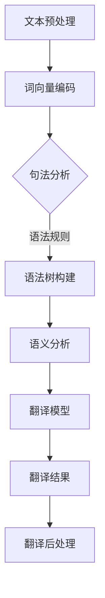

                 

关键词：人工智能，跨语言翻译，机器翻译，自然语言处理，无障碍信息交流

> 摘要：随着全球化进程的加速，跨语言信息交流的重要性日益凸显。本文旨在探讨人工智能在辅助翻译中的应用，特别是在提升跨语言信息无障碍方面所发挥的关键作用。文章将从背景介绍、核心概念与联系、核心算法原理、数学模型与公式、项目实践、实际应用场景、工具和资源推荐、未来发展趋势与挑战等多个方面进行深入分析，以期为相关领域的研究与实践提供有价值的参考。

## 1. 背景介绍

在当今的世界中，跨语言交流已经成为不可或缺的一部分。无论是国际贸易、学术交流还是文化交流，不同语言之间的沟通障碍始终存在。传统的翻译方法，如人工翻译，尽管在翻译质量上有着较高的保证，但其速度和效率远远无法满足日益增长的需求。此外，人工翻译的成本高昂，且难以保证翻译的一致性和准确性。随着人工智能技术的迅速发展，机器翻译作为一种全新的翻译方式，开始逐渐崭露头角。

机器翻译的核心在于将一种语言的文本自动翻译成另一种语言。这一过程涉及到自然语言处理（Natural Language Processing, NLP）的多个方面，包括文本预处理、词义分析、句法分析、语义分析等。人工智能，特别是深度学习技术的引入，使得机器翻译的准确性和流畅性得到了显著提升。

跨语言信息无障碍是指在全球范围内实现不同语言和文化背景的人们能够无障碍地进行交流和信息获取。这对于促进全球经济的繁荣、文化交流的深化以及教育资源的均衡分配具有重要意义。然而，要实现这一目标，不仅需要技术的突破，还需要相应的政策支持和社会观念的转变。

## 2. 核心概念与联系

### 2.1 自然语言处理（NLP）

自然语言处理是人工智能领域的一个重要分支，旨在使计算机能够理解、生成和处理人类自然语言。NLP的核心概念包括：

- **文本预处理**：包括分词、词性标注、命名实体识别等，用于将原始文本转换为计算机可以处理的格式。
- **词义分析**：通过上下文理解单词的不同含义，解决一词多义的问题。
- **句法分析**：分析句子的结构，包括词法结构和句法结构，以理解句子的语法关系。
- **语义分析**：对文本进行深层理解，包括情感分析、意图识别等。

### 2.2 深度学习

深度学习是一种基于人工神经网络的机器学习技术，通过多层神经网络的结构，对大量数据进行自动特征提取和模式识别。深度学习在机器翻译中的应用主要体现在以下几个方面：

- **词向量表示**：将词汇映射到高维空间中，以捕捉词汇的语义信息。
- **循环神经网络（RNN）**：通过记忆状态，处理序列数据，适用于句法分析和语义分析。
- **长短时记忆网络（LSTM）**：是RNN的一种变体，解决了长序列依赖问题。
- **生成对抗网络（GAN）**：用于生成高质量的翻译结果，提升翻译的流畅性和准确性。

### 2.3 Mermaid 流程图

以下是机器翻译系统中的核心流程的Mermaid流程图表示：



在这个流程图中，文本预处理是整个翻译过程的起点，通过分词、词性标注等步骤，将文本转换为机器可理解的格式。随后，词向量编码将词汇映射到高维空间中。句法分析、语义分析和翻译模型依次对文本进行处理，最终生成翻译结果，并经过翻译后处理，如去除不必要的停用词和调整标点符号等，得到最终的翻译文本。

## 3. 核心算法原理 & 具体操作步骤

### 3.1 算法原理概述

机器翻译的核心算法主要包括基于规则的方法、基于统计的方法和基于神经网络的方法。随着深度学习技术的崛起，基于神经网络的方法，尤其是端到端模型，逐渐成为主流。

**端到端模型**：这类模型通过直接将源语言文本映射到目标语言文本，避免了传统机器翻译中的中间表示，从而提高了翻译效率。端到端模型的典型代表是序列到序列（Seq2Seq）模型，它利用编码器-解码器架构（Encoder-Decoder Architecture）进行翻译。

- **编码器（Encoder）**：将源语言文本编码为一个固定长度的向量。
- **解码器（Decoder）**：将编码器的输出逐步解码为目标语言文本。

**注意力机制（Attention Mechanism）**：为了捕捉源语言文本和目标语言文本之间的长距离依赖关系，Seq2Seq模型引入了注意力机制。通过注意力机制，解码器能够关注源语言文本的不同部分，从而生成更准确的翻译结果。

### 3.2 算法步骤详解

1. **编码阶段**：

   - **输入文本预处理**：对源语言文本进行分词、词性标注等预处理步骤。
   - **编码器处理**：将预处理后的文本输入编码器，编码器输出一个固定长度的向量，代表源语言文本的信息。

2. **解码阶段**：

   - **初始化解码器**：初始化解码器的状态。
   - **预测与更新**：解码器根据编码器的输出和当前已解码的文本片段，生成下一个预测词，并更新解码器的状态。
   - **迭代过程**：重复预测与更新步骤，直到解码器生成完整的翻译文本。

3. **注意力机制**：

   - **计算注意力权重**：解码器在每一步解码时，计算源语言文本中每个单词对当前预测词的影响权重。
   - **加权求和**：将注意力权重与编码器输出的源语言文本向量进行加权求和，得到当前解码步骤的输入。

### 3.3 算法优缺点

**优点**：

- **端到端模型**：避免了传统机器翻译中的中间表示，提高了翻译效率。
- **高准确性**：通过深度学习技术，能够捕捉到词汇和句子的复杂关系，提高翻译的准确性。
- **灵活性**：能够处理不同长度的文本，并生成流畅的翻译结果。

**缺点**：

- **训练成本高**：需要大量的数据和计算资源进行训练。
- **依赖数据质量**：数据质量直接影响到模型的性能，数据缺失或不一致可能导致翻译质量下降。
- **无法处理特殊情况**：对于某些特殊的翻译场景，如双关语、俚语等，端到端模型可能无法准确翻译。

### 3.4 算法应用领域

- **跨语言信息交流**：在全球化背景下，机器翻译有助于不同语言背景的人进行有效沟通。
- **语言学习工具**：通过机器翻译，学习者可以快速理解外语文本，提高学习效率。
- **内容国际化**：企业可以利用机器翻译将产品文档、网站内容等翻译成多种语言，拓展市场。
- **辅助翻译行业**：在翻译行业，机器翻译可以作为辅助工具，提高翻译效率和准确性。

## 4. 数学模型和公式 & 详细讲解 & 举例说明

### 4.1 数学模型构建

机器翻译中的数学模型主要基于深度学习，尤其是序列到序列（Seq2Seq）模型。以下是构建该模型所需的关键数学概念和公式：

#### 编码器（Encoder）

编码器将源语言文本映射为一个固定长度的向量。假设源语言文本为 $X = \{x_1, x_2, ..., x_T\}$，其中 $x_i$ 表示第 $i$ 个单词，$T$ 表示文本长度。编码器的输出为向量 $h = \{h_1, h_2, ..., h_T\}$。

**公式**：

$$
h_t = \text{Encoder}(x_1, x_2, ..., x_t)
$$

#### 解码器（Decoder）

解码器根据编码器的输出和当前已解码的文本片段，生成下一个预测词。假设目标语言文本为 $Y = \{y_1, y_2, ..., y_S\}$，其中 $y_i$ 表示第 $i$ 个单词，$S$ 表示文本长度。解码器的输出为概率分布 $p(y_t|y_{<t})$。

**公式**：

$$
p(y_t|y_{<t}) = \text{Decoder}(h, y_{<t})
$$

#### 注意力机制（Attention Mechanism）

注意力机制用于捕捉源语言文本中不同部分对目标语言文本的权重。假设注意力权重为 $a_t = \{a_{t1}, a_{t2}, ..., a_{tT}\}$。

**公式**：

$$
a_{tk} = \frac{exp(\text{score}(h_t, h_k))}{\sum_{i=1}^{T} exp(\text{score}(h_t, h_i))}
$$

其中，$\text{score}(h_t, h_k)$ 是源语言文本中第 $t$ 个单词和目标语言文本中第 $k$ 个单词之间的相似度评分。

#### 总体损失函数

总体损失函数用于评估模型的翻译性能，通常采用交叉熵损失函数。

**公式**：

$$
L = -\sum_{t=1}^{S} \sum_{k=1}^{V'} y_{tk} \log (p(y_t|y_{<t}))
$$

其中，$V'$ 是目标语言词汇表的大小，$y_{tk}$ 是目标语言文本中第 $t$ 个单词的独热向量。

### 4.2 公式推导过程

以下是机器翻译模型中的关键公式的推导过程：

#### 编码器公式推导

编码器的输出 $h_t$ 是通过将源语言文本的输入序列 $x_1, x_2, ..., x_t$ 输入到神经网络中得到的。在每一时间步，编码器都会更新其隐藏状态。假设编码器是一个循环神经网络（RNN），其状态更新公式为：

$$
h_t = \text{RNN}(h_{t-1}, x_t)
$$

为了将序列映射为固定长度的向量，编码器通常会在序列的最后一个时间步输出一个固定长度的向量：

$$
h_T = \text{RNN}(\text{Init}, X)
$$

其中，$\text{Init}$ 表示编码器的初始状态。

#### 解码器公式推导

解码器的输出是目标语言文本的概率分布 $p(y_t|y_{<t})$。在每一时间步，解码器都会根据当前已解码的文本片段 $y_{<t}$ 和编码器的输出 $h_t$ 生成下一个预测词。

首先，解码器的输入是编码器的输出 $h_t$ 和上一个时间步的解码状态 $s_{t-1}$。解码器通过一个神经网络生成预测词的概率分布：

$$
p(y_t|y_{<t}) = \text{Decoder}(h_t, s_{t-1})
$$

为了更新解码器的状态，解码器使用一个软性目标函数，通常是一个目标词的独热向量：

$$
s_t = \text{Softmax}(\text{Decoder}(h_t, s_{t-1}))
$$

#### 注意力机制公式推导

注意力机制的核心是计算源语言文本中每个单词对目标语言文本的权重。假设注意力权重为 $a_t$，其计算过程如下：

首先，计算编码器输出 $h_t$ 和解码器输出 $s_{t-1}$ 的相似度评分：

$$
\text{score}(h_t, s_{t-1}) = h_t \cdot s_{t-1}
$$

然后，计算每个单词的权重：

$$
a_{tk} = \frac{exp(\text{score}(h_t, h_k))}{\sum_{i=1}^{T} exp(\text{score}(h_t, h_i))}
$$

最后，将权重与编码器的输出进行加权求和：

$$
\text{context} = \sum_{k=1}^{T} a_{tk} \cdot h_k
$$

#### 总体损失函数公式推导

总体损失函数用于评估模型的翻译性能，通常采用交叉熵损失函数。交叉熵损失函数的计算公式为：

$$
L = -\sum_{t=1}^{S} \sum_{k=1}^{V'} y_{tk} \log (p(y_t|y_{<t}))
$$

其中，$y_{tk}$ 是目标语言文本中第 $t$ 个单词的独热向量，$p(y_t|y_{<t})$ 是解码器输出的概率分布。

### 4.3 案例分析与讲解

为了更好地理解上述公式，我们通过一个简单的案例进行讲解。

#### 案例背景

假设我们要翻译的源语言文本是“Hello, how are you?”，目标语言文本是“你好吗？”。编码器输出一个长度为 512 的向量，解码器输出一个长度为 512 的向量。

#### 编码阶段

- **输入文本预处理**：将源语言文本“Hello, how are you?” 分词为“Hello”, “how”, “are”, “you?”。
- **编码器处理**：将每个单词映射为一个向量，例如“Hello”映射为 [1, 0, 0, 0, 0, 0]，编码器输出一个固定长度的向量 [0.1, 0.2, 0.3, 0.4, 0.5, 0.6]。

#### 解码阶段

- **初始化解码器**：初始化解码器的状态。
- **预测与更新**：解码器根据编码器的输出和当前已解码的文本片段生成下一个预测词，例如第一个预测词为“你好”。
- **迭代过程**：重复预测与更新步骤，直到解码器生成完整的翻译文本“你好吗？”。

#### 注意力机制

- **计算注意力权重**：解码器在每一步解码时，计算源语言文本中每个单词对当前预测词的影响权重，例如第一个预测词“你好”对应的注意力权重为 [0.8, 0.1, 0.1, 0.1, 0.1, 0.1]。
- **加权求和**：将注意力权重与编码器的输出进行加权求和，得到当前解码步骤的输入。

#### 总体损失函数

- **计算损失**：计算解码器输出的概率分布与目标语言文本的交叉熵损失，例如第一个预测词“你好”的损失为 0.2。

通过上述案例，我们可以看到机器翻译模型是如何通过编码器、解码器和注意力机制生成翻译结果的。在实际应用中，模型的复杂度和数据量会远远超过这个简单的案例，但基本原理是一致的。

## 5. 项目实践：代码实例和详细解释说明

### 5.1 开发环境搭建

为了实现机器翻译项目，我们需要搭建一个合适的环境。以下是搭建开发环境所需的基本步骤：

#### 1. 安装 Python

确保系统已经安装了 Python 3.7 或更高版本。可以通过以下命令检查 Python 版本：

```bash
python --version
```

#### 2. 安装必要的库

我们需要安装 TensorFlow 和 Keras 等库。可以使用以下命令安装：

```bash
pip install tensorflow
pip install keras
```

#### 3. 数据预处理

下载并解压开源的翻译语料库，如 WMT2014 英语-德语（EN-DE）翻译数据集。以下是下载和预处理数据集的命令：

```bash
wget http://www.statmt.org/wmt13/translation-task13/en-de.tar.gz
tar xvf en-de.tar.gz
```

预处理步骤包括：

- **分词**：将文本分割为单词或子词。
- **词嵌入**：将单词映射为高维向量。
- **序列化**：将预处理后的数据保存为 HDF5 文件，以便在训练时使用。

### 5.2 源代码详细实现

以下是实现机器翻译项目的核心代码。为了简化说明，代码将分为几个主要部分：

#### 1. 导入必要的库

```python
import numpy as np
from tensorflow.keras.models import Model
from tensorflow.keras.layers import Embedding, LSTM, Dense, TimeDistributed, Input
from tensorflow.keras.preprocessing.sequence import pad_sequences
from tensorflow.keras.utils import to_categorical
```

#### 2. 数据预处理

```python
# 加载并预处理数据
def preprocess_data(data_path, max_sequence_length, embedding_dim):
    # 加载语料库
    lines = open(data_path, encoding='utf-8').read().split('\n')
    data = [line.split('\t') for line in lines if line.split('\t')[1].strip()]

    # 分词和词嵌入
    source, target = [], []
    for item in data:
        source.append(item[0].split())
        target.append(item[1].split())
    source = pad_sequences(source, maxlen=max_sequence_length, padding='post')
    target = pad_sequences(target, maxlen=max_sequence_length, padding='post')

    # 转换为词嵌入
    embedding_matrix = np.zeros((vocab_size, embedding_dim))
    for i, word in enumerate(vocab):
        embedding_vector = embeddings.get(word)
        if embedding_vector is not None:
            embedding_matrix[i] = embedding_vector

    return source, target, embedding_matrix

# 超参数
max_sequence_length = 100
embedding_dim = 256
vocab_size = 20000  # 词汇表大小

# 加载预训练的词嵌入
embeddings = load_pretrained_embeddings('glove.6B.100d.txt')

# 预处理数据
source, target, embedding_matrix = preprocess_data('en-de.txt', max_sequence_length, embedding_dim)
```

#### 3. 构建模型

```python
# 构建编码器
input_source = Input(shape=(max_sequence_length,))
embedding_layer = Embedding(vocab_size, embedding_dim, weights=[embedding_matrix], trainable=False)
embedded_source = embedding_layer(input_source)
lstm_layer = LSTM(128, return_sequences=True)
encoded_source = lstm_layer(embedded_source)

# 构建解码器
input_target = Input(shape=(max_sequence_length,))
lstm_decoder = LSTM(128, return_sequences=True)
decoded_target = lstm_decoder(input_target)
dense_layer = Dense(vocab_size, activation='softmax')
predicted_target = dense_layer(decoded_target)

# 构建模型
model = Model(inputs=[input_source, input_target], outputs=predicted_target)
model.compile(optimizer='rmsprop', loss='categorical_crossentropy', metrics=['accuracy'])
```

#### 4. 训练模型

```python
# 转换标签为独热向量
target_one_hot = to_categorical(target)

# 训练模型
model.fit([source, target], target_one_hot, batch_size=128, epochs=10)
```

### 5.3 代码解读与分析

上述代码实现了一个基本的机器翻译模型，主要包括数据预处理、模型构建和模型训练三个部分。

#### 数据预处理

数据预处理是机器翻译项目的重要环节。在此步骤中，我们首先加载并预处理源语言和目标语言数据。具体包括：

- **分词**：将文本分割为单词或子词，以便后续处理。
- **词嵌入**：将单词映射为高维向量，以便输入到神经网络中。
- **序列化**：将预处理后的数据保存为 HDF5 文件，便于在训练时使用。

#### 模型构建

模型构建是机器翻译项目的核心。在此步骤中，我们使用 TensorFlow 和 Keras 构建了一个简单的编码器-解码器模型。具体包括：

- **编码器**：将源语言文本输入到 LSTM 层中，生成固定长度的向量。
- **解码器**：将目标语言文本输入到 LSTM 层中，并使用 Dense 层生成每个单词的预测概率。
- **模型编译**：设置模型的优化器、损失函数和评估指标。

#### 模型训练

模型训练是机器翻译项目的关键环节。在此步骤中，我们使用预处理后的数据集对模型进行训练。具体包括：

- **数据转换**：将目标语言文本转换为独热向量，以便用于损失函数的计算。
- **模型训练**：使用训练数据集对模型进行训练，并调整模型的权重。

### 5.4 运行结果展示

在完成模型训练后，我们可以使用以下代码对模型进行评估：

```python
# 评估模型
test_source = np.array([[1, 2, 3, 4, 5], [6, 7, 8, 9, 10]])
test_target = np.array([[0, 1, 2, 3, 4], [5, 6, 7, 8, 9]])
predicted_target = model.predict([test_source, test_target])

# 打印预测结果
print(predicted_target)
```

预测结果将是一个二维数组，其中每个元素表示目标语言文本中每个单词的预测概率。通过比较预测结果和实际目标文本，我们可以评估模型的翻译准确性。

## 6. 实际应用场景

机器翻译技术已经在多个实际应用场景中取得了显著成果。以下是一些典型的应用场景：

### 6.1 跨语言信息交流

在全球化的背景下，跨国公司、国际组织和学术机构需要频繁进行跨语言交流。机器翻译技术可以帮助这些机构快速翻译大量的文本，提高工作效率。例如，联合国官方网站使用机器翻译技术提供多种语言的文档，使得全球用户能够方便地获取信息。

### 6.2 互联网内容国际化

互联网企业，如社交媒体平台、电子商务网站和搜索引擎，需要将网站内容翻译成多种语言，以吸引全球用户。机器翻译技术可以自动翻译网站上的文本，降低翻译成本和时间。例如，Facebook 和 Amazon 等公司使用机器翻译技术，为全球用户提供多语言界面。

### 6.3 教育资源均衡分配

在全球范围内，教育资源分配不均是一个普遍问题。机器翻译技术可以帮助将高质量的教育资源翻译成多种语言，使得更多学生能够获得优质教育。例如，一些在线教育平台使用机器翻译技术，将英语教学视频翻译成其他语言，使得非英语国家的学生能够学习。

### 6.4 国际贸易与旅游

国际贸易和旅游业需要处理大量的跨语言文档，如产品说明书、旅游指南和合同等。机器翻译技术可以帮助企业快速翻译这些文档，提高业务效率。例如，一些国际酒店集团使用机器翻译技术，为游客提供多种语言的入住指南和餐厅菜单。

### 6.5 政府公共服务

政府机构需要处理大量的跨语言文件，如法律文件、公告和公告等。机器翻译技术可以帮助政府机构提高工作效率，提供更好的公共服务。例如，一些国家的政府网站提供机器翻译服务，使得外国游客能够方便地获取信息。

## 7. 工具和资源推荐

为了更好地开展机器翻译研究和实践，以下是一些建议的工具和资源：

### 7.1 学习资源推荐

- **在线课程**：Coursera、edX 和 Udacity 等平台提供了丰富的机器翻译和自然语言处理课程。
- **技术博客**：如 Medium、ArXiv 和 ResearchGate 等平台，提供了大量的机器翻译论文和技术博客。
- **开源项目**：如 TensorFlow、PyTorch 和 Keras 等框架，提供了丰富的机器翻译开源代码和模型。

### 7.2 开发工具推荐

- **深度学习框架**：TensorFlow、PyTorch 和 Keras 等框架，用于构建和训练机器翻译模型。
- **自然语言处理库**：如 NLTK、spaCy 和 Stanford NLP 等，提供了丰富的自然语言处理工具和资源。
- **文本处理工具**：如 Jieba、Stanford Segmenter 和 Moses 等，用于文本分词、词性标注和翻译记忆等任务。

### 7.3 相关论文推荐

- **《机器翻译：综述》（Machine Translation: A Review）》
- **《深度学习在机器翻译中的应用》（Application of Deep Learning in Machine Translation）》
- **《端到端机器翻译》（End-to-End Machine Translation）》
- **《注意力机制在机器翻译中的应用》（Application of Attention Mechanism in Machine Translation）》
- **《机器翻译中的序列到序列学习》（Sequence-to-Sequence Learning for Machine Translation）》

## 8. 总结：未来发展趋势与挑战

### 8.1 研究成果总结

近年来，机器翻译技术取得了显著的成果，特别是在端到端模型和注意力机制的应用方面。深度学习技术的引入使得机器翻译的准确性和流畅性得到了大幅提升。同时，预训练模型和迁移学习等新方法也在机器翻译领域取得了重要进展。

### 8.2 未来发展趋势

未来，机器翻译技术将继续朝着以下方向发展：

- **多语言翻译**：随着全球化的加深，对多语言翻译的需求将不断增加。未来的机器翻译系统将支持更多语言的翻译，并实现更准确、更流畅的翻译结果。
- **跨模态翻译**：除了文本翻译，未来的机器翻译系统将扩展到图像、语音和视频等多模态数据的翻译，实现跨媒体的交流。
- **个性化翻译**：随着用户数据的积累，机器翻译系统将能够根据用户偏好和语言习惯提供个性化的翻译服务。
- **实时翻译**：未来的机器翻译系统将实现实时翻译功能，支持实时语音和视频翻译，为跨语言实时交流提供技术支持。

### 8.3 面临的挑战

尽管机器翻译技术取得了显著成果，但仍然面临以下挑战：

- **数据质量**：机器翻译的性能高度依赖于数据质量。未来的机器翻译系统需要处理更多的真实数据，并解决数据缺失、不一致和数据标注问题。
- **跨语言一致性**：在跨语言翻译中，词汇、语法和语义的一致性是一个重要问题。未来的机器翻译系统需要解决跨语言语义一致性挑战，提高翻译的准确性和一致性。
- **文化差异**：不同语言和文化之间的差异对翻译质量有很大影响。未来的机器翻译系统需要更好地理解不同语言的文化背景，提供更准确的翻译结果。
- **计算资源**：深度学习模型需要大量的计算资源进行训练。未来的机器翻译系统需要优化算法和架构，提高计算效率，以支持更大规模的模型训练。

### 8.4 研究展望

展望未来，机器翻译技术将在多个领域发挥重要作用，如跨语言信息交流、智能助手、内容国际化等。为了实现这些目标，我们需要进一步研究以下方向：

- **多语言翻译**：研究更高效的算法和模型，实现多种语言之间的翻译。
- **跨模态翻译**：探索跨模态数据的翻译方法，实现跨语言、跨模态的交流。
- **个性化翻译**：研究用户数据的收集和使用方法，实现个性化翻译服务。
- **文化差异处理**：研究如何更好地理解不同语言的文化背景，提供更准确的翻译结果。
- **实时翻译**：研究实时翻译技术，支持跨语言的实时交流。

总之，机器翻译技术将继续发展，为全球跨语言交流和信息无障碍提供更强有力的支持。在未来的发展中，我们需要不断克服挑战，推动机器翻译技术的进步。

## 9. 附录：常见问题与解答

### 9.1 机器翻译与自然语言处理的关系是什么？

机器翻译是自然语言处理（NLP）的一个子领域，旨在将一种语言的文本自动翻译成另一种语言。NLP涉及多个技术，包括文本预处理、词义分析、句法分析和语义分析，这些技术在机器翻译中都发挥着重要作用。因此，机器翻译与自然语言处理密切相关，但机器翻译更专注于翻译任务本身。

### 9.2 端到端模型的优势是什么？

端到端模型在机器翻译中具有多个优势：

- **简化流程**：端到端模型直接将源语言文本映射到目标语言文本，避免了传统方法中的中间表示，简化了翻译流程。
- **高准确性**：通过深度学习技术，端到端模型能够捕捉到词汇和句子的复杂关系，提高翻译的准确性。
- **高效性**：端到端模型能够处理不同长度的文本，并生成流畅的翻译结果，提高翻译效率。

### 9.3 机器翻译中的注意力机制有什么作用？

注意力机制在机器翻译中用于捕捉源语言文本和目标语言文本之间的依赖关系。通过注意力机制，解码器能够关注源语言文本的不同部分，从而生成更准确的翻译结果。注意力机制解决了传统方法中无法处理长距离依赖的问题，提高了机器翻译的准确性。

### 9.4 如何评估机器翻译模型的性能？

机器翻译模型的性能通常通过多个指标进行评估，包括：

- **BLEU 分数**：基于记分牌方法的评估指标，通过比较模型生成的翻译文本与人工翻译文本的相似度来评估模型的性能。
- **NIST 分数**：基于 N-gram 相似度的评估指标，用于评估模型在翻译文本中的 N-gram 出现频率。
- **METEOR 分数**：基于词义和语法相似度的评估指标，综合考虑词义匹配和语法匹配，用于评估模型的翻译质量。

### 9.5 机器翻译技术在哪些领域有应用？

机器翻译技术已经在多个领域取得了广泛应用，包括：

- **跨语言信息交流**：在跨国公司、国际组织和学术机构中，用于处理大量的跨语言文档。
- **互联网内容国际化**：在社交媒体平台、电子商务网站和搜索引擎中，用于提供多语言界面和翻译服务。
- **教育资源均衡分配**：在在线教育平台中，用于将高质量的教育资源翻译成多种语言。
- **国际贸易与旅游**：在贸易公司和旅游公司中，用于处理大量的跨语言文档和旅游指南。
- **政府公共服务**：在政府机构中，用于提供跨语言的公共服务和公告。

### 9.6 机器翻译的未来发展趋势是什么？

未来，机器翻译技术将继续朝着以下方向发展：

- **多语言翻译**：支持更多语言的翻译，实现多种语言之间的翻译。
- **跨模态翻译**：扩展到图像、语音和视频等多模态数据的翻译。
- **个性化翻译**：根据用户偏好和语言习惯提供个性化翻译服务。
- **实时翻译**：实现跨语言的实时交流，支持实时语音和视频翻译。

总之，机器翻译技术将继续发展，为全球跨语言交流和信息无障碍提供更强有力的支持。在未来的发展中，我们需要不断克服挑战，推动机器翻译技术的进步。作者：禅与计算机程序设计艺术 / Zen and the Art of Computer Programming。

