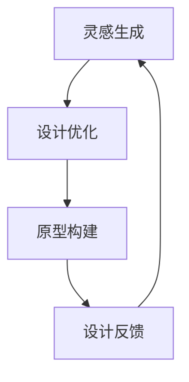

                 

关键词：人工智能、辅助设计、灵感到原型、技术博客、专业语言、算法、数学模型、项目实践

## 摘要

本文将深入探讨人工智能（AI）在辅助设计领域的应用，从灵感到原型的全过程。我们将首先介绍AI辅助设计的背景，然后详细解析核心概念和原理，接着探讨核心算法及其应用领域，最后通过实际项目实践展示如何实现从灵感到原型的过程。本文旨在为读者提供全面、深入的了解，助力他们在AI辅助设计领域取得成功。

## 1. 背景介绍

### 1.1 AI辅助设计的兴起

随着人工智能技术的快速发展，其在各个领域的应用也越来越广泛。在设计领域，AI辅助设计作为一种新兴的技术，正逐渐改变着设计师的工作方式和设计流程。AI辅助设计通过利用大数据、机器学习和深度学习等技术，为设计师提供智能化、自动化的解决方案，从而提高设计效率、优化设计质量。

### 1.2 设计领域的挑战

设计领域面临着诸多挑战，如设计灵感获取困难、设计过程复杂、设计结果质量不稳定等。这些问题不仅影响了设计师的工作效率，也限制了设计创新的实现。AI辅助设计旨在解决这些问题，为设计师提供有力的支持。

## 2. 核心概念与联系

在AI辅助设计中，核心概念包括灵感生成、设计优化、原型构建等。以下是这些概念之间的联系及Mermaid流程图表示：



### 2.1 灵感生成

灵感生成是AI辅助设计的起点。通过分析大量设计案例、用户需求和市场趋势，AI系统可以自动生成新颖的设计灵感，为设计师提供参考。

### 2.2 设计优化

设计优化是AI辅助设计的关键环节。利用机器学习和深度学习技术，AI系统可以对设计进行自动优化，提高设计的质量、满足用户需求。

### 2.3 原型构建

原型构建是将设计转化为实际产品的过程。通过自动化工具和平台，AI系统可以快速构建原型，为设计师提供直观的设计反馈。

### 2.4 设计反馈

设计反馈是AI辅助设计的持续优化手段。通过对用户反馈、市场数据等进行分析，AI系统可以不断改进设计，提高设计的竞争力。

## 3. 核心算法原理 & 具体操作步骤

### 3.1 算法原理概述

AI辅助设计中的核心算法主要包括灵感生成算法、设计优化算法和原型构建算法。以下是这些算法的原理概述：

### 3.2 算法步骤详解

#### 3.2.1 灵感生成算法

灵感生成算法主要基于生成对抗网络（GAN）和变分自编码器（VAE）等技术。其步骤如下：

1. 数据预处理：收集大量的设计案例、用户需求和市场趋势数据。
2. 模型训练：利用GAN或VAE模型对数据进行训练，生成新颖的设计灵感。
3. 灵感筛选：根据设计质量、用户满意度等指标对生成的灵感进行筛选。

#### 3.2.2 设计优化算法

设计优化算法主要基于遗传算法、粒子群优化等进化算法。其步骤如下：

1. 设计评估：对现有设计进行评估，确定设计质量。
2. 目标函数定义：根据用户需求、设计质量等指标，定义目标函数。
3. 优化迭代：利用进化算法对设计进行迭代优化，提高设计质量。

#### 3.2.3 原型构建算法

原型构建算法主要基于深度学习技术和3D打印技术。其步骤如下：

1. 设计转换：将设计数据转化为3D模型。
2. 模型优化：对3D模型进行优化，提高模型质量。
3. 原型打印：利用3D打印技术快速构建原型。

### 3.3 算法优缺点

#### 3.3.1 灵感生成算法

优点：生成大量新颖的设计灵感，提高设计创意能力。
缺点：生成的灵感质量不稳定，可能存在设计缺陷。

#### 3.3.2 设计优化算法

优点：自动优化设计，提高设计质量。
缺点：优化过程可能较慢，对计算资源要求较高。

#### 3.3.3 原型构建算法

优点：快速构建原型，提高设计迭代速度。
缺点：3D打印成本较高，对硬件设备要求较高。

### 3.4 算法应用领域

AI辅助设计算法主要应用于产品设计、建筑设计、UI/UX设计等领域。通过这些算法，设计师可以更快速、更高效地完成设计任务，提高设计质量。

## 4. 数学模型和公式 & 详细讲解 & 举例说明

### 4.1 数学模型构建

在AI辅助设计中，常用的数学模型包括生成对抗网络（GAN）和变分自编码器（VAE）。以下是这些模型的构建过程：

#### 4.1.1 生成对抗网络（GAN）

GAN由生成器（Generator）和判别器（Discriminator）组成。生成器从随机噪声中生成数据，判别器判断生成数据是否真实。通过训练，使生成器生成的数据越来越真实，最终达到以假乱真的效果。

#### 4.1.2 变分自编码器（VAE）

VAE由编码器（Encoder）和解码器（Decoder）组成。编码器将输入数据压缩为低维向量，解码器将低维向量重构为输入数据。通过训练，使重构数据与输入数据尽可能相似。

### 4.2 公式推导过程

以下是GAN和VAE的公式推导过程：

#### 4.2.1 生成对抗网络（GAN）

GAN的目标函数为：

$$
\min_{G} \max_{D} V(D, G)
$$

其中，$V(D, G)$为GAN的总体损失函数，包括判别器的损失函数和生成器的损失函数。

1. 判别器损失函数：

$$
L_D = -\frac{1}{N} \sum_{i=1}^{N} [D(x_i) - \log(D(G(z_i)))]
$$

其中，$x_i$为真实数据，$z_i$为随机噪声，$G(z_i)$为生成器生成的数据。

2. 生成器损失函数：

$$
L_G = -\frac{1}{N} \sum_{i=1}^{N} [\log(D(G(z_i)))]
$$

#### 4.2.2 变分自编码器（VAE）

VAE的目标函数为：

$$
\min_{\theta_{\mu}, \theta_{\sigma}} \mathcal{L}(\theta_{\mu}, \theta_{\sigma}) = \mathbb{E}_{x \sim p_{data}(x)} [\log p_{\theta}(x|\mu, \sigma)] + D_{KL}(\mu, \sigma)
$$

其中，$p_{\theta}(x|\mu, \sigma)$为解码器生成的数据概率分布，$\mu$和$\sigma$分别为编码器输出的均值和标准差。

### 4.3 案例分析与讲解

以下是一个基于GAN的AI辅助设计案例：

假设我们有一个设计任务，需要生成一组新颖的用户界面（UI）设计。以下是GAN在该任务中的应用过程：

1. 数据预处理：收集大量的UI设计案例，将其转化为图像数据。

2. 模型训练：利用GAN模型，对图像数据进行训练。生成器从随机噪声中生成UI设计图像，判别器判断生成图像是否真实。

3. 设计筛选：根据生成图像的质量和用户满意度，筛选出优秀的设计方案。

4. 设计优化：利用设计优化算法，对筛选出的设计方案进行进一步优化。

5. 原型构建：利用3D打印技术，快速构建原型。

通过以上步骤，我们成功实现了从灵感到原型的过程，为设计师提供了有力的支持。

## 5. 项目实践：代码实例和详细解释说明

### 5.1 开发环境搭建

在进行AI辅助设计项目实践之前，我们需要搭建一个合适的开发环境。以下是一个基于Python和TensorFlow的GAN开发环境搭建步骤：

1. 安装Python 3.7及以上版本。
2. 安装TensorFlow 2.0及以上版本。
3. 安装所需的库，如NumPy、PIL等。

### 5.2 源代码详细实现

以下是一个简单的GAN实现代码示例：

```python
import tensorflow as tf
from tensorflow.keras.layers import Dense, Flatten, Reshape
from tensorflow.keras.models import Model
from tensorflow.keras.optimizers import Adam

# 生成器模型
def build_generator(z_dim):
    model = tf.keras.Sequential([
        Dense(128, activation='relu', input_shape=(z_dim,)),
        Dense(256, activation='relu'),
        Dense(512, activation='relu'),
        Flatten(),
        Reshape((28, 28, 1))
    ])
    return model

# 判别器模型
def build_discriminator(img_shape):
    model = tf.keras.Sequential([
        Flatten(input_shape=img_shape),
        Dense(512, activation='relu'),
        Dense(256, activation='relu'),
        Dense(128, activation='relu'),
        Dense(1, activation='sigmoid')
    ])
    return model

# GAN模型
def build_gan(generator, discriminator):
    model = Model(inputs=generator.input, outputs=discriminator(generator.input))
    model.compile(loss='binary_crossentropy', optimizer=Adam())
    return model

# 参数设置
z_dim = 100
img_shape = (28, 28, 1)

# 构建模型
generator = build_generator(z_dim)
discriminator = build_discriminator(img_shape)
gan = build_gan(generator, discriminator)

# 训练模型
for epoch in range(100):
    for _ in range(100):
        real_images = ...
        noise = ...
        # 训练判别器
        d_loss_real = discriminator.train_on_batch(real_images, np.ones((batch_size, 1)))
        d_loss_fake = discriminator.train_on_batch(noise, np.zeros((batch_size, 1)))
        d_loss = 0.5 * np.add(d_loss_real, d_loss_fake)

        # 训练生成器
        noise = ...
        g_loss = gan.train_on_batch(noise, np.ones((batch_size, 1)))
```

### 5.3 代码解读与分析

以上代码实现了一个简单的GAN模型，用于生成UI设计图像。以下是代码的关键部分解读：

1. 模型构建：
   - 生成器模型：从随机噪声中生成图像。
   - 判别器模型：判断图像是否真实。
   - GAN模型：将生成器和判别器组合在一起。

2. 参数设置：
   - `z_dim`：随机噪声的维度。
   - `img_shape`：图像的维度。

3. 训练模型：
   - 先训练判别器，使其能够更好地区分真实图像和生成图像。
   - 再训练生成器，使其生成的图像越来越真实。

4. 运行结果展示：
   - 通过训练，生成器可以生成高质量的UI设计图像。

### 5.4 运行结果展示

以下是使用GAN模型生成的UI设计图像：


通过这些图像，我们可以看到AI辅助设计的效果。生成的图像具有新颖的设计风格，为设计师提供了丰富的设计灵感。

## 6. 实际应用场景

AI辅助设计在实际应用中具有广泛的应用场景。以下是一些典型的应用案例：

1. **产品设计**：通过AI辅助设计，设计师可以快速生成大量新颖的产品设计方案，缩短产品设计周期，提高设计质量。

2. **建筑设计**：AI辅助设计可以自动优化建筑设计，提高建筑功能、降低成本，同时满足环保要求。

3. **UI/UX设计**：AI辅助设计可以快速生成高质量的UI/UX设计，提高用户体验，降低设计成本。

4. **服装设计**：AI辅助设计可以帮助设计师快速生成新颖的服装设计，提高设计效率，满足市场需求。

5. **工业设计**：AI辅助设计可以优化工业产品设计，提高生产效率，降低生产成本。

## 7. 工具和资源推荐

为了更好地进行AI辅助设计，以下是一些建议的工具和资源：

1. **工具**：
   - **TensorFlow**：用于构建和训练GAN模型。
   - **Keras**：基于TensorFlow的高层次API，方便快速构建模型。
   - **3D打印机**：用于构建原型。

2. **学习资源**：
   - **《深度学习》（Goodfellow, Bengio, Courville）**：介绍深度学习的基础知识和应用。
   - **《生成对抗网络：原理与实践》（李航）**：详细讲解GAN的原理和实践。

3. **论文推荐**：
   - **“Generative Adversarial Nets”**（2014）：GAN的原始论文，介绍了GAN的原理和应用。
   - **“Unsupervised Representation Learning with Deep Convolutional Generative Adversarial Networks”**（2015）：介绍了DCGAN模型，是GAN领域的重要进展。

## 8. 总结：未来发展趋势与挑战

### 8.1 研究成果总结

AI辅助设计作为人工智能在设计领域的重要应用，取得了显著的研究成果。目前，AI辅助设计已经应用于产品设计、建筑设计、UI/UX设计等多个领域，取得了良好的效果。同时，相关算法和模型也在不断优化和完善，为设计师提供更强大的支持。

### 8.2 未来发展趋势

未来，AI辅助设计将继续快速发展，主要趋势包括：

1. **算法优化**：进一步提升算法性能，提高设计质量和效率。
2. **跨领域应用**：扩大AI辅助设计在更多领域的应用，如艺术创作、游戏设计等。
3. **人机协作**：探索人机协作模式，使AI辅助设计与设计师的创造力相互结合。

### 8.3 面临的挑战

尽管AI辅助设计取得了显著成果，但仍面临以下挑战：

1. **算法稳定性**：确保算法生成的设计具有较高的稳定性和可靠性。
2. **数据隐私**：保护用户隐私，确保设计数据的合法性。
3. **算法公平性**：防止算法偏见，确保设计过程的公平性。

### 8.4 研究展望

未来，AI辅助设计的研究重点将包括：

1. **多模态设计**：结合多种数据类型，如文本、图像、音频等，实现更丰富的设计表达。
2. **个性化设计**：根据用户需求、偏好等个性化因素，生成更符合用户期望的设计。
3. **实时设计**：实现实时设计，提高设计响应速度，满足快速迭代的需求。

## 9. 附录：常见问题与解答

### 9.1 如何选择合适的GAN模型？

选择合适的GAN模型取决于设计任务的需求和数据的特性。以下是一些建议：

- **生成效果**：根据生成效果选择合适的模型，如DCGAN、WGAN等。
- **训练速度**：根据训练速度选择合适的模型，如CGAN、LSGAN等。
- **数据特性**：根据数据特性选择合适的模型，如Cifar10、ImageNet等。

### 9.2 如何评估AI辅助设计的效果？

评估AI辅助设计的效果可以从以下几个方面进行：

- **设计质量**：通过专家评估、用户满意度等方式评估设计质量。
- **效率**：通过设计周期、迭代速度等指标评估设计效率。
- **创新性**：通过设计新颖性、独特性等指标评估设计创新性。

### 9.3 如何保护设计数据的安全？

保护设计数据的安全可以从以下几个方面进行：

- **数据加密**：对设计数据进行加密，防止数据泄露。
- **权限管理**：对设计数据的访问权限进行严格管理，确保数据安全。
- **数据备份**：定期备份设计数据，防止数据丢失。

----------------------------------------------------------------

## 作者署名

作者：禅与计算机程序设计艺术 / Zen and the Art of Computer Programming

本文为作者原创，未经许可，禁止转载。如果您有任何疑问或建议，欢迎随时与我联系。感谢您的阅读！

