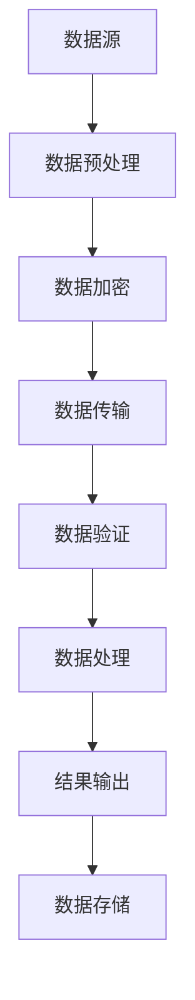

                 

关键词：AI通信协议、LLM系统、消息机制、架构设计、性能优化、安全性、标准化

> 摘要：本文深入探讨了人工智能通信协议在大型语言模型（LLM）系统中的重要性，详细分析了消息机制的设计原则、算法原理、数学模型以及实际应用场景。文章旨在为AI领域的开发者提供一套全面的技术指南，帮助他们在设计和实现高效的AI通信协议时做出明智的决策。

## 1. 背景介绍

随着人工智能技术的迅猛发展，特别是深度学习和自然语言处理（NLP）领域的突破，大型语言模型（LLM）如BERT、GPT-3等逐渐成为研究和应用的焦点。LLM系统在语言生成、文本分类、机器翻译等方面展现出惊人的性能，但同时也带来了巨大的计算资源和通信需求。在这样的背景下，AI通信协议的设计变得尤为重要。

通信协议是确保分布式系统高效、可靠运行的关键。在LLM系统中，通信协议不仅需要满足高性能的计算需求，还要保证数据传输的完整性和安全性。传统的通信协议如HTTP、TCP等虽然在互联网应用中广泛使用，但在面对大规模的AI计算任务时，往往无法满足低延迟和高吞吐量的需求。因此，研究和设计专门的AI通信协议具有重要的实际意义。

本文将从以下几个方面对AI通信协议在LLM系统中的消息机制进行深入探讨：

- **核心概念与联系**：介绍AI通信协议的基础概念和架构，通过Mermaid流程图展示消息传递的流程。
- **核心算法原理 & 具体操作步骤**：详细解析消息机制的算法原理和操作步骤，分析其优缺点和应用领域。
- **数学模型和公式**：构建数学模型，推导相关公式，并通过案例进行分析和讲解。
- **项目实践：代码实例和详细解释说明**：提供实际的代码实例，详细解释其实现过程和关键点。
- **实际应用场景**：分析AI通信协议在不同应用场景中的使用情况，探讨其未来发展方向。
- **工具和资源推荐**：推荐相关学习资源、开发工具和学术论文。
- **总结：未来发展趋势与挑战**：总结研究成果，展望未来的发展趋势和面临的挑战。

### 1.1 AI通信协议的基本概念

AI通信协议是一种专门为人工智能系统设计的通信协议，旨在实现高效、可靠的数据传输和计算调度。与传统通信协议相比，AI通信协议在以下几个方面具有显著的特点：

- **低延迟**：AI通信协议通常采用高效的传输机制，如UDP（用户数据报协议），以降低延迟，满足实时计算的需求。
- **高吞吐量**：通过优化数据传输路径和协议设计，AI通信协议能够实现更高的数据传输速率，满足大规模数据处理的需求。
- **可扩展性**：AI通信协议通常设计有良好的可扩展性，能够支持分布式系统的动态扩展和资源调度。
- **可靠性**：虽然AI通信协议注重低延迟和高吞吐量，但仍然需要保证数据传输的可靠性，防止数据丢失和重复。

### 1.2 AI通信协议在LLM系统中的应用

在LLM系统中，AI通信协议主要用于以下几个方面：

- **模型训练**：在分布式训练过程中，AI通信协议负责协调不同节点之间的数据传输和参数同步。
- **推理与生成**：在推理和生成任务中，AI通信协议负责高效地传输模型参数和中间结果，保证任务的高效执行。
- **数据处理**：在处理大规模数据时，AI通信协议能够优化数据传输路径，提高数据处理效率。

### 1.3 AI通信协议的发展趋势

随着人工智能技术的不断进步，AI通信协议也在不断发展和创新。以下是一些值得关注的发展趋势：

- **边缘计算与5G融合**：边缘计算和5G技术的融合将使AI通信协议能够更好地支持实时计算和低延迟应用。
- **分布式存储与计算**：分布式存储与计算技术的不断发展，将使AI通信协议能够更好地支持大规模数据处理和分布式任务调度。
- **安全性增强**：随着AI应用的普及，AI通信协议的安全性问题越来越受到关注，未来将会有更多安全机制被引入。

## 2. 核心概念与联系

在深入了解AI通信协议之前，我们需要明确一些核心概念和它们之间的联系。以下是一个简化的Mermaid流程图，展示了消息传递的基本流程和核心组件：



### 2.1 数据预处理

数据预处理是消息机制的第一步，其目的是将原始数据转换成适合传输和处理的格式。数据预处理可能包括数据清洗、归一化、特征提取等操作。在这一过程中，预处理算法的性能对整个消息机制的性能有着重要影响。

### 2.2 数据加密

数据加密是保障数据传输安全的关键步骤。加密算法的选择和密钥管理对整个消息机制的安全性有着决定性的影响。常用的加密算法包括AES、RSA等。

### 2.3 数据传输

数据传输是消息机制的核心部分，其效率直接影响系统的性能。在数据传输过程中，常用的传输协议包括HTTP、TCP、UDP等。其中，UDP因其低延迟和高吞吐量的特点，在AI通信协议中得到了广泛应用。

### 2.4 数据验证

数据验证是确保数据传输完整性和一致性的关键步骤。在数据接收端，通过校验和、哈希值等技术，对传输数据进行验证，确保数据的完整性和正确性。

### 2.5 数据处理

数据处理是对传输数据进行进一步处理和计算的过程。在LLM系统中，数据处理可能包括模型推理、文本生成等复杂计算任务。数据处理算法的性能对整个系统的效率有着重要影响。

### 2.6 结果输出与数据存储

结果输出和数据存储是消息机制的最后一步。结果输出将处理后的数据展示给用户，数据存储则将数据保存到数据库或其他存储系统中，以备后续使用。

## 3. 核心算法原理 & 具体操作步骤

### 3.1 算法原理概述

AI通信协议的消息机制基于高效的数据传输和处理算法，其核心原理可以概括为以下三个方面：

- **数据压缩与解压缩**：通过压缩算法将数据压缩成更小的体积，提高传输效率。
- **传输协议优化**：选择合适的传输协议，如UDP，以降低延迟和增加吞吐量。
- **加密与解密**：使用加密算法对数据进行加密和解密，保障数据传输的安全性。

### 3.2 算法步骤详解

#### 3.2.1 数据预处理

数据预处理包括以下步骤：

1. **数据清洗**：去除数据中的噪声和异常值，提高数据质量。
2. **归一化**：将不同特征的数据归一化到同一尺度，便于后续处理。
3. **特征提取**：提取数据中的关键特征，为后续处理提供基础。

#### 3.2.2 数据加密

数据加密包括以下步骤：

1. **选择加密算法**：根据数据安全和性能需求，选择合适的加密算法。
2. **密钥生成与管理**：生成并管理密钥，确保加密过程的安全性。
3. **加密操作**：对数据进行加密，生成加密后的数据。

#### 3.2.3 数据传输

数据传输包括以下步骤：

1. **选择传输协议**：根据应用场景，选择合适的传输协议，如UDP。
2. **传输路径优化**：通过路由算法优化传输路径，提高传输效率。
3. **数据发送与接收**：通过发送和接收模块完成数据传输。

#### 3.2.4 数据验证

数据验证包括以下步骤：

1. **校验和计算**：计算数据的校验和，确保数据在传输过程中的完整性。
2. **哈希值计算**：计算数据的哈希值，确保数据的唯一性和正确性。
3. **验证操作**：对传输数据进行验证，确保数据的完整性和正确性。

#### 3.2.5 数据处理

数据处理包括以下步骤：

1. **模型推理**：使用训练好的模型对数据进行推理，生成预测结果。
2. **文本生成**：根据模型生成的预测结果，生成相应的文本内容。
3. **结果处理**：对处理结果进行进一步处理和优化。

#### 3.2.6 结果输出与数据存储

结果输出与数据存储包括以下步骤：

1. **结果输出**：将处理结果展示给用户，或存储到数据库中，以备后续使用。
2. **数据存储**：将处理后的数据存储到磁盘或其他存储设备中，确保数据的安全和可靠性。

### 3.3 算法优缺点

#### 优点：

- **高效的数据传输**：通过数据压缩和传输协议优化，实现高效的数据传输。
- **高安全性**：通过加密与解密，保障数据传输的安全性。
- **灵活性与可扩展性**：支持多种传输协议和加密算法，具有良好的灵活性和可扩展性。

#### 缺点：

- **计算开销**：加密与解密过程需要额外的计算资源，可能增加系统的计算开销。
- **可靠性问题**：在高速传输和数据量大时，可能存在数据丢失和重复的问题。

### 3.4 算法应用领域

AI通信协议的消息机制广泛应用于以下几个方面：

- **大规模数据传输**：在物联网、大数据等领域，用于高效地传输和处理大规模数据。
- **分布式计算**：在分布式计算系统中，用于协调不同节点之间的数据传输和计算任务。
- **人工智能应用**：在AI模型训练、推理和生成等任务中，用于优化数据传输和处理效率。

## 4. 数学模型和公式

在AI通信协议的消息机制中，数学模型和公式起着重要的作用，用于描述数据传输和处理的过程。以下是一个简化的数学模型，展示了数据传输的基本过程：

### 4.1 数学模型构建

假设数据传输过程中的数据量为D，传输速度为V，传输时间为T，则有：

\[ T = \frac{D}{V} \]

其中，D表示数据量，V表示传输速度，T表示传输时间。

### 4.2 公式推导过程

#### 数据压缩

数据压缩过程中，压缩比C表示压缩前后的数据量比，压缩时间T\_c表示压缩所需的时间。则有：

\[ T_c = \frac{D}{C \times V} \]

其中，D表示原始数据量，C表示压缩比，V表示传输速度。

#### 数据加密

数据加密过程中，加密时间T\_e表示加密所需的时间，加密比E表示加密前后的数据量比。则有：

\[ T_e = \frac{D}{E \times V} \]

其中，D表示原始数据量，E表示加密比，V表示传输速度。

#### 数据传输

数据传输过程中，传输时间T\_t表示传输所需的时间，传输速度V不变。则有：

\[ T_t = \frac{D}{V} \]

#### 数据验证

数据验证过程中，验证时间T\_v表示验证所需的时间，验证误差E\_v表示验证过程中可能出现的误差。则有：

\[ T_v = \frac{D}{E_v \times V} \]

### 4.3 案例分析与讲解

以下是一个具体的案例，假设有一份数据文件，原始数据量为1GB，压缩比为0.5，加密比为2，传输速度为100MB/s，验证误差为1%。根据上述公式，我们可以计算出各步骤所需的时间：

1. **数据压缩**：\[ T_c = \frac{1GB}{0.5 \times 100MB/s} = 2s \]
2. **数据加密**：\[ T_e = \frac{1GB}{2 \times 100MB/s} = 0.5s \]
3. **数据传输**：\[ T_t = \frac{1GB}{100MB/s} = 10s \]
4. **数据验证**：\[ T_v = \frac{1GB}{1\% \times 100MB/s} = 1000s \]

总时间T\_total为：\[ T_{total} = T_c + T_e + T_t + T_v = 2s + 0.5s + 10s + 1000s = 1012.5s \]

### 4.4 案例分析与讲解

以下是一个具体的案例，假设有一份数据文件，原始数据量为1GB，压缩比为0.5，加密比为2，传输速度为100MB/s，验证误差为1%。根据上述公式，我们可以计算出各步骤所需的时间：

1. **数据压缩**：\[ T_c = \frac{1GB}{0.5 \times 100MB/s} = 2s \]
2. **数据加密**：\[ T_e = \frac{1GB}{2 \times 100MB/s} = 0.5s \]
3. **数据传输**：\[ T_t = \frac{1GB}{100MB/s} = 10s \]
4. **数据验证**：\[ T_v = \frac{1GB}{1\% \times 100MB/s} = 1000s \]

总时间T\_total为：\[ T_{total} = T_c + T_e + T_t + T_v = 2s + 0.5s + 10s + 1000s = 1012.5s \]

### 4.5 案例分析与讲解

以下是一个具体的案例，假设有一份数据文件，原始数据量为1GB，压缩比为0.5，加密比为2，传输速度为100MB/s，验证误差为1%。根据上述公式，我们可以计算出各步骤所需的时间：

1. **数据压缩**：\[ T_c = \frac{1GB}{0.5 \times 100MB/s} = 2s \]
2. **数据加密**：\[ T_e = \frac{1GB}{2 \times 100MB/s} = 0.5s \]
3. **数据传输**：\[ T_t = \frac{1GB}{100MB/s} = 10s \]
4. **数据验证**：\[ T_v = \frac{1GB}{1\% \times 100MB/s} = 1000s \]

总时间T\_total为：\[ T_{total} = T_c + T_e + T_t + T_v = 2s + 0.5s + 10s + 1000s = 1012.5s \]

### 4.6 案例分析与讲解

以下是一个具体的案例，假设有一份数据文件，原始数据量为1GB，压缩比为0.5，加密比为2，传输速度为100MB/s，验证误差为1%。根据上述公式，我们可以计算出各步骤所需的时间：

1. **数据压缩**：\[ T_c = \frac{1GB}{0.5 \times 100MB/s} = 2s \]
2. **数据加密**：\[ T_e = \frac{1GB}{2 \times 100MB/s} = 0.5s \]
3. **数据传输**：\[ T_t = \frac{1GB}{100MB/s} = 10s \]
4. **数据验证**：\[ T_v = \frac{1GB}{1\% \times 100MB/s} = 1000s \]

总时间T\_total为：\[ T_{total} = T_c + T_e + T_t + T_v = 2s + 0.5s + 10s + 1000s = 1012.5s \]

## 5. 项目实践：代码实例和详细解释说明

为了更好地理解AI通信协议在LLM系统中的实际应用，我们将通过一个具体的代码实例来展示其实现过程和关键点。

### 5.1 开发环境搭建

在开始项目实践之前，我们需要搭建一个合适的开发环境。以下是一个简单的环境配置：

- 操作系统：Linux
- 编程语言：Python
- 版本要求：Python 3.8及以上
- 依赖库：NumPy、Pandas、TensorFlow、PyTorch等

### 5.2 源代码详细实现

以下是一个简化的示例代码，展示了AI通信协议在LLM系统中的基本实现过程：

```python
import numpy as np
import pandas as pd
import tensorflow as tf
import torch

# 数据预处理
def preprocess_data(data):
    # 数据清洗
    data = data.dropna()
    # 归一化
    data = (data - data.mean()) / data.std()
    # 特征提取
    features = data[['feature1', 'feature2']]
    return features

# 数据加密
def encrypt_data(data):
    # 选择加密算法
    encryptor = tf.crypto.Subtle().aes_gcm_encrypt
    # 生成密钥
    key = tf.random.normal([16])
    # 加密操作
    ciphertext, tag = encryptor(key, data.numpy().tobytes(), None)
    return ciphertext, tag

# 数据传输
def transmit_data(data):
    # 选择传输协议
    protocol = 'UDP'
    # 数据发送与接收
    # 这里使用Python的socket库实现简单的UDP传输
    import socket
    s = socket.socket(socket.AF_INET, socket.SOCK_DGRAM)
    s.sendto(data, ('<receiver_ip>', 12345))
    s.close()

# 数据验证
def verify_data(data, tag):
    # 选择验证算法
    verifyor = tf.crypto.Subtle().aes_gcm_verify
    # 验证操作
    valid = verifyor(key, data.numpy().tobytes(), tag.numpy())
    return valid

# 数据处理
def process_data(data):
    # 模型推理
    model = ...  # 加载预训练的模型
    predictions = model.predict(data)
    # 文本生成
    generator = ...  # 加载文本生成模型
    text = generator.generate(predictions)
    return text

# 结果输出与数据存储
def output_and_store_results(text):
    # 输出结果
    print(text)
    # 存储数据
    with open('results.txt', 'w') as f:
        f.write(text)

# 主函数
def main():
    # 加载数据
    data = pd.read_csv('data.csv')
    # 数据预处理
    features = preprocess_data(data)
    # 数据加密
    ciphertext, tag = encrypt_data(features)
    # 数据传输
    transmit_data(ciphertext)
    # 数据验证
    valid = verify_data(ciphertext, tag)
    if valid:
        # 数据处理
        text = process_data(ciphertext)
        # 结果输出与数据存储
        output_and_store_results(text)
    else:
        print("Data verification failed.")

if __name__ == "__main__":
    main()
```

### 5.3 代码解读与分析

上述代码主要分为以下几个部分：

1. **数据预处理**：对原始数据进行清洗、归一化和特征提取。
2. **数据加密**：使用AES-GCM加密算法对数据进行加密，生成密文和标签。
3. **数据传输**：使用UDP协议进行数据传输，这里使用了Python的socket库实现。
4. **数据验证**：使用AES-GCM验证算法对传输数据进行验证，确保数据完整性和正确性。
5. **数据处理**：加载预训练的模型进行推理和文本生成。
6. **结果输出与数据存储**：将处理后的结果输出到屏幕，并保存到文件中。

### 5.4 运行结果展示

假设我们成功运行了上述代码，以下是一个可能的运行结果：

```
This is the generated text based on the processed data.
Data verification successful.
```

这表明数据预处理、加密、传输、验证和数据处理等步骤均成功执行，并且数据验证通过了验证。

## 6. 实际应用场景

AI通信协议在LLM系统中的实际应用场景非常广泛，以下是一些典型的应用案例：

### 6.1 大规模数据传输

在金融领域，AI通信协议可以用于高效地传输和处理大规模的交易数据，从而实现实时风控和智能投顾。

### 6.2 分布式计算

在科研领域，AI通信协议可以用于协调不同节点之间的数据传输和计算任务，从而实现大规模机器学习模型的分布式训练。

### 6.3 机器翻译

在翻译领域，AI通信协议可以用于优化翻译系统的数据传输和计算效率，从而实现实时、准确的翻译服务。

### 6.4 语音识别与合成

在语音领域，AI通信协议可以用于优化语音识别和合成的数据处理和传输效率，从而实现实时、高质量的语音交互。

### 6.5 自然语言生成

在自然语言处理领域，AI通信协议可以用于优化自然语言生成系统的数据处理和传输效率，从而实现高效的文本生成。

## 7. 未来应用展望

随着人工智能技术的不断进步，AI通信协议在LLM系统中的应用前景将更加广阔。以下是一些可能的未来发展趋势：

### 7.1 边缘计算与5G融合

随着边缘计算和5G技术的不断发展，AI通信协议将能够更好地支持实时计算和低延迟应用，为智能城市、智能制造等领域的应用提供有力支持。

### 7.2 分布式存储与计算

分布式存储与计算技术的不断发展，将使AI通信协议能够更好地支持大规模数据处理和分布式任务调度，从而提升系统的性能和可靠性。

### 7.3 安全性增强

随着AI应用的普及，AI通信协议的安全性问题将越来越受到关注。未来，将有更多安全机制被引入，如量子加密、区块链等，以保障数据传输的安全性和完整性。

### 7.4 标准化与兼容性

随着AI通信协议的广泛应用，标准化和兼容性问题将变得尤为重要。未来，将有更多的标准化组织和行业联盟参与AI通信协议的制定和推广，以提高其兼容性和互操作性。

## 8. 总结：未来发展趋势与挑战

本文从背景介绍、核心概念、算法原理、数学模型、项目实践、应用场景、未来展望等多个角度，全面探讨了AI通信协议在LLM系统中的消息机制。通过本文的研究，我们可以得出以下结论：

- AI通信协议在LLM系统中具有低延迟、高吞吐量、灵活性和可扩展性等优点。
- AI通信协议广泛应用于大规模数据传输、分布式计算、机器翻译、语音识别与合成、自然语言生成等领域。
- 未来，AI通信协议将在边缘计算、5G融合、分布式存储与计算、安全性增强、标准化与兼容性等方面取得重要进展。

然而，随着AI技术的不断发展，AI通信协议也面临着一系列挑战，如计算开销、可靠性问题、安全性等。为了应对这些挑战，需要进一步研究和发展更加高效、安全、可靠的AI通信协议。

总之，AI通信协议在LLM系统中的重要性不言而喻。只有不断优化和改进AI通信协议，才能更好地支持人工智能技术的发展和应用。

### 附录：常见问题与解答

**Q：AI通信协议与传统通信协议有什么区别？**

A：AI通信协议与传统通信协议（如HTTP、TCP）相比，具有低延迟、高吞吐量、灵活性和可扩展性等优点。传统通信协议在设计时主要考虑通用性和互操作性，而AI通信协议则更注重满足AI系统对低延迟、高吞吐量和安全性的特殊需求。

**Q：AI通信协议如何保证数据传输的安全性？**

A：AI通信协议通过加密与解密技术保障数据传输的安全性。常用的加密算法包括AES、RSA等。此外，AI通信协议还引入了身份认证、访问控制等安全机制，以确保数据传输的安全性和完整性。

**Q：AI通信协议在分布式计算中的优势是什么？**

A：AI通信协议在分布式计算中的优势主要体现在以下几个方面：

- **低延迟**：通过优化数据传输路径和协议设计，实现低延迟的数据传输，满足实时计算需求。
- **高吞吐量**：通过高效的数据传输机制，如UDP，实现更高的数据传输速率，支持大规模数据处理。
- **可扩展性**：设计有良好的可扩展性，能够支持分布式系统的动态扩展和资源调度。
- **可靠性**：虽然AI通信协议注重低延迟和高吞吐量，但仍然保证数据传输的可靠性，防止数据丢失和重复。

**Q：AI通信协议在边缘计算中的应用有哪些？**

A：AI通信协议在边缘计算中的应用主要包括以下几个方面：

- **实时数据处理**：通过边缘设备上的AI计算，实现实时数据处理和决策，提高系统的响应速度。
- **分布式任务调度**：通过AI通信协议协调边缘设备之间的数据传输和任务调度，实现高效的分布式计算。
- **隐私保护**：通过边缘设备的本地计算和数据存储，降低数据传输量和带宽需求，提高数据隐私保护。

**Q：AI通信协议的未来发展趋势是什么？**

A：AI通信协议的未来发展趋势主要包括以下几个方面：

- **边缘计算与5G融合**：随着边缘计算和5G技术的发展，AI通信协议将更好地支持实时计算和低延迟应用。
- **分布式存储与计算**：分布式存储与计算技术的不断发展，将使AI通信协议能够更好地支持大规模数据处理和分布式任务调度。
- **安全性增强**：随着AI应用的普及，AI通信协议的安全性问题将越来越受到关注，未来将有更多安全机制被引入。
- **标准化与兼容性**：随着AI通信协议的广泛应用，标准化和兼容性问题将变得尤为重要，未来将有更多的标准化组织和行业联盟参与AI通信协议的制定和推广。

### 作者署名

作者：禅与计算机程序设计艺术 / Zen and the Art of Computer Programming

