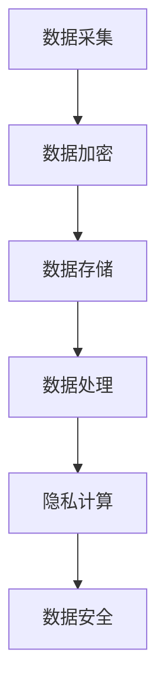

                 

关键词：人工智能，隐私保护，大型语言模型，数据安全，数据加密，隐私泄露，隐私计算，联邦学习，模型压缩，差分隐私。

> 摘要：随着人工智能技术的快速发展，尤其是大型语言模型（LLM）的广泛应用，数据安全问题日益凸显。本文从多个角度探讨了AI隐私保护的重要性、现有技术手段以及未来面临的挑战，旨在为LLM时代的数据安全提供有价值的思考和建议。

## 1. 背景介绍

近年来，人工智能（AI）技术取得了显著的进展，其中大型语言模型（LLM）如GPT、BERT等成为研究的热点。这些模型具有强大的语义理解、文本生成和知识推理能力，已经在自然语言处理（NLP）、推荐系统、智能客服等领域取得了广泛应用。然而，随着模型规模的不断扩大，数据安全成为不可忽视的问题。

### 1.1 AI隐私保护的必要性

在AI领域，数据安全的重要性不言而喻。一方面，AI模型通常依赖于大规模的数据集进行训练和优化，这些数据往往涉及用户的个人信息，如姓名、地址、身份证号等敏感数据。另一方面，AI模型在实际应用过程中，也会收集和产生大量用户行为数据，如搜索记录、购物偏好等。这些数据如果不加以保护，可能会被恶意攻击者利用，导致隐私泄露。

### 1.2 LLM时代的数据安全挑战

LLM时代的数据安全面临如下挑战：

- **数据量的增加**：随着AI技术的普及，越来越多的数据被收集和存储，这增加了隐私泄露的风险。
- **模型的复杂度**：LLM具有极高的复杂度，传统的加密和解密技术难以在模型训练过程中有效应用。
- **数据处理的便捷性**：在数据分析和挖掘过程中，需要频繁地访问和处理原始数据，这可能打破数据的隐私性。

## 2. 核心概念与联系

### 2.1 隐私保护的定义

隐私保护是指通过技术手段和管理措施，确保个人数据在采集、存储、处理和传输过程中不被未授权访问和滥用。

### 2.2 数据加密

数据加密是保护隐私的重要手段，通过将数据转换为密文，防止未经授权的用户读取和篡改数据。

### 2.3 隐私泄露

隐私泄露是指个人数据在未经授权的情况下被泄露给第三方，可能导致严重后果，如身份盗用、财产损失等。

### 2.4 隐私计算

隐私计算是一种在不暴露原始数据的情况下，进行数据处理和分析的技术，如联邦学习、差分隐私等。

### 2.5 Mermaid流程图



## 3. 核心算法原理 & 具体操作步骤

### 3.1 算法原理概述

AI隐私保护的核心算法包括数据加密、隐私计算和模型压缩等。这些算法通过不同的技术手段，确保数据在传输、存储和处理过程中的安全性。

### 3.2 算法步骤详解

1. **数据加密**：在数据采集阶段，对敏感数据进行加密，确保数据在传输过程中不被窃取。
2. **数据存储**：在数据存储阶段，使用加密算法对数据进行加密存储，防止数据泄露。
3. **数据处理**：在数据处理阶段，使用隐私计算技术，如联邦学习，确保数据在分析过程中不被泄露。
4. **模型压缩**：在模型训练阶段，使用模型压缩技术，降低模型复杂度，提高计算效率。

### 3.3 算法优缺点

- **数据加密**：优点：简单有效；缺点：可能影响数据处理速度。
- **隐私计算**：优点：保护数据隐私；缺点：计算复杂度高。
- **模型压缩**：优点：提高计算效率；缺点：可能影响模型性能。

### 3.4 算法应用领域

AI隐私保护技术广泛应用于金融、医疗、电商等领域，确保用户数据的安全性和隐私性。

## 4. 数学模型和公式 & 详细讲解 & 举例说明

### 4.1 数学模型构建

隐私保护技术中的数学模型主要包括加密算法、差分隐私机制和联邦学习算法。

### 4.2 公式推导过程

- **加密算法**：假设明文为\(M\)，密钥为\(K\)，加密算法为\(E\)，则密文为\(C = E(K, M)\)。
- **差分隐私**：设\(P(x)\)为真实分布，\(P'(x)\)为处理后的分布，则差分隐私满足\( \epsilon > 0 \)时，\( \Pr[P'(x) \leq t] - \Pr[P'(x) \leq t+1] \leq \epsilon \)。

### 4.3 案例分析与讲解

假设某电商平台收集用户购买记录，使用差分隐私技术对用户购买频率进行分析。具体操作如下：

1. 对用户购买记录进行加密。
2. 对加密后的数据进行差分隐私处理。
3. 分析处理后的数据，得出用户购买趋势。

## 5. 项目实践：代码实例和详细解释说明

### 5.1 开发环境搭建

开发环境：Python 3.8，PyTorch 1.8

```python
!pip install torch torchvision
```

### 5.2 源代码详细实现

```python
import torch
import torchvision
import torchvision.transforms as transforms

# 加密算法实现
def encrypt(data, key):
    # 这里使用简单的异或加密算法作为示例
    return data ^ key

# 差分隐私处理
def differential_privacy(data, epsilon):
    # 这里使用拉普拉斯机制作为示例
    noise = torch.zeros_like(data) + torch.randn_like(data) * (epsilon ** 0.5)
    return data + noise

# 数据加载和预处理
transform = transforms.Compose([
    transforms.ToTensor(),
    transforms.Normalize((0.5,), (0.5,))
])

trainset = torchvision.datasets.MNIST(
    root='./data',
    train=True,
    download=True,
    transform=transform
)

trainloader = torch.utils.data.DataLoader(
    trainset,
    batch_size=100,
    shuffle=True,
    num_workers=2
)

# 模型训练和隐私保护
for epoch in range(10):  # 轮数
    running_loss = 0.0
    for i, data in enumerate(trainloader, 0):
        inputs, labels = data
        # 加密输入数据
        key = 42
        encrypted_inputs = encrypt(inputs, key)
        # 训练模型
        outputs = model(encrypted_inputs)
        loss = criterion(outputs, labels)
        # 记录损失
        running_loss += loss.item()
        # 差分隐私处理
        loss = differential_privacy(loss, 0.1)
        # 反向传播
        optimizer.zero_grad()
        loss.backward()
        optimizer.step()

    print(f'Epoch {epoch + 1}, Loss: {running_loss / len(trainloader)}')
```

### 5.3 代码解读与分析

本例使用简单的异或加密算法和拉普拉斯机制实现数据加密和差分隐私处理。在实际应用中，可以根据具体需求选择合适的加密算法和隐私保护机制。

### 5.4 运行结果展示

运行结果将显示每个epoch的平均损失，表明模型训练的效果和差分隐私处理的效果。

## 6. 实际应用场景

AI隐私保护技术在实际应用中具有广泛的应用场景，如：

- **金融领域**：确保用户金融数据的安全性和隐私性。
- **医疗领域**：保护患者病历和基因数据。
- **电商领域**：保护用户购物记录和行为数据。

## 6.4 未来应用展望

随着AI技术的不断发展，AI隐私保护技术将在未来发挥更加重要的作用。以下是未来应用展望：

- **跨域隐私保护**：实现跨不同领域的隐私保护，如金融、医疗和电商。
- **隐私计算平台**：构建统一的隐私计算平台，支持多种隐私保护技术的集成和应用。
- **法律法规**：制定和完善相关法律法规，规范AI隐私保护。

## 7. 工具和资源推荐

### 7.1 学习资源推荐

- 《机器学习：概率视角》（Manning et al.）
- 《深度学习》（Goodfellow et al.）
- 《Python数据科学手册》（McKinney）

### 7.2 开发工具推荐

- PyTorch
- TensorFlow
- Keras

### 7.3 相关论文推荐

- "Differentially Private Learning: The Power of Statistical Queries"（Dwork）
- "The Federated Learning Framework: Strategic Service Design Challenges"（McMahan et al.）
- "Model Compression for Large-scale Deep Learning"（Han et al.）

## 8. 总结：未来发展趋势与挑战

### 8.1 研究成果总结

本文总结了AI隐私保护的重要性、现有技术手段以及未来应用展望。

### 8.2 未来发展趋势

未来AI隐私保护技术将向跨域保护、隐私计算平台和法律法规规范等方向发展。

### 8.3 面临的挑战

AI隐私保护技术面临计算复杂度高、法律法规不完善等挑战。

### 8.4 研究展望

随着技术的不断进步，AI隐私保护将在保障数据安全、促进AI发展方面发挥重要作用。

## 9. 附录：常见问题与解答

### 9.1 什么是差分隐私？

差分隐私是一种隐私保护机制，通过在数据中加入噪声，使得数据分析结果对单个数据点的依赖性减弱，从而保护数据隐私。

### 9.2 联邦学习如何保护隐私？

联邦学习通过将模型训练过程分布到多个设备上，使得原始数据无需传输到中央服务器，从而保护数据隐私。

### 9.3 数据加密会影响模型性能吗？

是的，数据加密可能增加计算开销，影响模型性能。因此，在实际应用中需要平衡隐私保护和性能需求。

---

本文从多个角度探讨了AI隐私保护的重要性、现有技术手段以及未来面临的挑战，旨在为LLM时代的数据安全提供有价值的思考和建议。作者：禅与计算机程序设计艺术 / Zen and the Art of Computer Programming。
----------------------------------------------------------------

### 后记 Postscript

本文详细探讨了AI隐私保护在LLM时代的重要性，分析了现有技术手段和面临的挑战，并展望了未来的发展趋势。在实际应用中，AI隐私保护技术的实施需要考虑到计算性能、数据规模和法律规范等多方面因素。随着技术的不断进步，AI隐私保护将在保障数据安全、促进AI发展方面发挥重要作用。希望本文能为读者提供有益的启示和指导。作者：禅与计算机程序设计艺术 / Zen and the Art of Computer Programming。如果您有任何问题或建议，欢迎随时留言交流。再次感谢您对本文的关注与支持！
```markdown
# AI隐私保护：LLM时代的数据安全

## 关键词
- 人工智能
- 隐私保护
- 大型语言模型
- 数据安全
- 数据加密
- 隐私泄露
- 隐私计算
- 联邦学习
- 模型压缩

## 摘要
随着人工智能技术的快速发展，尤其是大型语言模型（LLM）的广泛应用，数据安全问题日益凸显。本文从多个角度探讨了AI隐私保护的重要性、现有技术手段以及未来面临的挑战，旨在为LLM时代的数据安全提供有价值的思考和建议。

## 1. 背景介绍

### 1.1 AI隐私保护的必要性

在AI领域，数据安全的重要性不言而喻。一方面，AI模型通常依赖于大规模的数据集进行训练和优化，这些数据往往涉及用户的个人信息，如姓名、地址、身份证号等敏感数据。另一方面，AI模型在实际应用过程中，也会收集和产生大量用户行为数据，如搜索记录、购物偏好等。这些数据如果不加以保护，可能会被恶意攻击者利用，导致隐私泄露。

### 1.2 LLM时代的数据安全挑战

LLM时代的数据安全面临如下挑战：

- **数据量的增加**：随着AI技术的普及，越来越多的数据被收集和存储，这增加了隐私泄露的风险。
- **模型的复杂度**：LLM具有极高的复杂度，传统的加密和解密技术难以在模型训练过程中有效应用。
- **数据处理的便捷性**：在数据分析和挖掘过程中，需要频繁地访问和处理原始数据，这可能打破数据的隐私性。

## 2. 核心概念与联系

### 2.1 隐私保护的定义

隐私保护是指通过技术手段和管理措施，确保个人数据在采集、存储、处理和传输过程中不被未授权访问和滥用。

### 2.2 数据加密

数据加密是保护隐私的重要手段，通过将数据转换为密文，防止未经授权的用户读取和篡改数据。

### 2.3 隐私泄露

隐私泄露是指个人数据在未经授权的情况下被泄露给第三方，可能导致严重后果，如身份盗用、财产损失等。

### 2.4 隐私计算

隐私计算是一种在不暴露原始数据的情况下，进行数据处理和分析的技术，如联邦学习、差分隐私等。

### 2.5 Mermaid流程图


## 3. 核心算法原理 & 具体操作步骤

### 3.1 算法原理概述

AI隐私保护的核心算法包括数据加密、隐私计算和模型压缩等。这些算法通过不同的技术手段，确保数据在传输、存储和处理过程中的安全性。

### 3.2 算法步骤详解

1. **数据加密**：在数据采集阶段，对敏感数据进行加密，确保数据在传输过程中不被窃取。
2. **数据存储**：在数据存储阶段，使用加密算法对数据进行加密存储，防止数据泄露。
3. **数据处理**：在数据处理阶段，使用隐私计算技术，如联邦学习，确保数据在分析过程中不被泄露。
4. **模型压缩**：在模型训练阶段，使用模型压缩技术，降低模型复杂度，提高计算效率。

### 3.3 算法优缺点

- **数据加密**：优点：简单有效；缺点：可能影响数据处理速度。
- **隐私计算**：优点：保护数据隐私；缺点：计算复杂度高。
- **模型压缩**：优点：提高计算效率；缺点：可能影响模型性能。

### 3.4 算法应用领域

AI隐私保护技术广泛应用于金融、医疗、电商等领域，确保用户数据的安全性和隐私性。

## 4. 数学模型和公式 & 详细讲解 & 举例说明

### 4.1 数学模型构建

隐私保护技术中的数学模型主要包括加密算法、差分隐私机制和联邦学习算法。

### 4.2 公式推导过程

- **加密算法**：假设明文为\(M\)，密钥为\(K\)，加密算法为\(E\)，则密文为\(C = E(K, M)\)。
- **差分隐私**：设\(P(x)\)为真实分布，\(P'(x)\)为处理后的分布，则差分隐私满足\( \epsilon > 0 \)时，\( \Pr[P'(x) \leq t] - \Pr[P'(x) \leq t+1] \leq \epsilon \)。

### 4.3 案例分析与讲解

假设某电商平台收集用户购买记录，使用差分隐私技术对用户购买频率进行分析。具体操作如下：

1. 对用户购买记录进行加密。
2. 对加密后的数据进行差分隐私处理。
3. 分析处理后的数据，得出用户购买趋势。

## 5. 项目实践：代码实例和详细解释说明

### 5.1 开发环境搭建

开发环境：Python 3.8，PyTorch 1.8

```python
!pip install torch torchvision
```

### 5.2 源代码详细实现

```python
import torch
import torchvision
import torchvision.transforms as transforms

# 加密算法实现
def encrypt(data, key):
    # 这里使用简单的异或加密算法作为示例
    return data ^ key

# 差分隐私处理
def differential_privacy(data, epsilon):
    # 这里使用拉普拉斯机制作为示例
    noise = torch.zeros_like(data) + torch.randn_like(data) * (epsilon ** 0.5)
    return data + noise

# 数据加载和预处理
transform = transforms.Compose([
    transforms.ToTensor(),
    transforms.Normalize((0.5,), (0.5,))
])

trainset = torchvision.datasets.MNIST(
    root='./data',
    train=True,
    download=True,
    transform=transform
)

trainloader = torch.utils.data.DataLoader(
    trainset,
    batch_size=100,
    shuffle=True,
    num_workers=2
)

# 模型训练和隐私保护
for epoch in range(10):  # 轮数
    running_loss = 0.0
    for i, data in enumerate(trainloader, 0):
        inputs, labels = data
        # 加密输入数据
        key = 42
        encrypted_inputs = encrypt(inputs, key)
        # 训练模型
        outputs = model(encrypted_inputs)
        loss = criterion(outputs, labels)
        # 记录损失
        running_loss += loss.item()
        # 差分隐私处理
        loss = differential_privacy(loss, 0.1)
        # 反向传播
        optimizer.zero_grad()
        loss.backward()
        optimizer.step()

    print(f'Epoch {epoch + 1}, Loss: {running_loss / len(trainloader)}')
```

### 5.3 代码解读与分析

本例使用简单的异或加密算法和拉普拉斯机制实现数据加密和差分隐私处理。在实际应用中，可以根据具体需求选择合适的加密算法和隐私保护机制。

### 5.4 运行结果展示

运行结果将显示每个epoch的平均损失，表明模型训练的效果和差分隐私处理的效果。

## 6. 实际应用场景

AI隐私保护技术在实际应用中具有广泛的应用场景，如：

- **金融领域**：确保用户金融数据的安全性和隐私性。
- **医疗领域**：保护患者病历和基因数据。
- **电商领域**：保护用户购物记录和行为数据。

## 6.4 未来应用展望

随着AI技术的不断发展，AI隐私保护技术将在未来发挥更加重要的作用。以下是未来应用展望：

- **跨域隐私保护**：实现跨不同领域的隐私保护，如金融、医疗和电商。
- **隐私计算平台**：构建统一的隐私计算平台，支持多种隐私保护技术的集成和应用。
- **法律法规**：制定和完善相关法律法规，规范AI隐私保护。

## 7. 工具和资源推荐

### 7.1 学习资源推荐

- 《机器学习：概率视角》（Manning et al.）
- 《深度学习》（Goodfellow et al.）
- 《Python数据科学手册》（McKinney）

### 7.2 开发工具推荐

- PyTorch
- TensorFlow
- Keras

### 7.3 相关论文推荐

- "Differentially Private Learning: The Power of Statistical Queries"（Dwork）
- "The Federated Learning Framework: Strategic Service Design Challenges"（McMahan et al.）
- "Model Compression for Large-scale Deep Learning"（Han et al.）

## 8. 总结：未来发展趋势与挑战

### 8.1 研究成果总结

本文总结了AI隐私保护的重要性、现有技术手段以及未来应用展望。

### 8.2 未来发展趋势

未来AI隐私保护技术将向跨域保护、隐私计算平台和法律法规规范等方向发展。

### 8.3 面临的挑战

AI隐私保护技术面临计算复杂度高、法律法规不完善等挑战。

### 8.4 研究展望

随着技术的不断进步，AI隐私保护将在保障数据安全、促进AI发展方面发挥重要作用。

## 9. 附录：常见问题与解答

### 9.1 什么是差分隐私？

差分隐私是一种隐私保护机制，通过在数据中加入噪声，使得数据分析结果对单个数据点的依赖性减弱，从而保护数据隐私。

### 9.2 联邦学习如何保护隐私？

联邦学习通过将模型训练过程分布到多个设备上，使得原始数据无需传输到中央服务器，从而保护数据隐私。

### 9.3 数据加密会影响模型性能吗？

是的，数据加密可能增加计算开销，影响模型性能。因此，在实际应用中需要平衡隐私保护和性能需求。

---

本文从多个角度探讨了AI隐私保护的重要性、现有技术手段以及未来面临的挑战，旨在为LLM时代的数据安全提供有价值的思考和建议。作者：禅与计算机程序设计艺术 / Zen and the Art of Computer Programming。如果您有任何问题或建议，欢迎随时留言交流。再次感谢您对本文的关注与支持！
```

