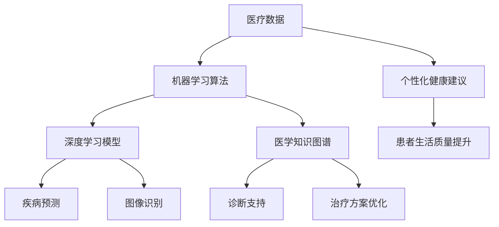

                 

关键词：人工智能，个性化医疗，健康建议，机器学习，医疗保健，数据分析，预测模型，医学诊断。

> 摘要：本文探讨了人工智能在医疗保健领域的应用，特别是在个性化健康建议方面的潜力。通过分析现有技术，阐述人工智能在疾病预测、患者管理和健康建议中的作用，最后对未来的发展方向和面临的挑战进行了展望。

## 1. 背景介绍

随着医疗科技的不断进步，人工智能（AI）在医疗保健领域的应用正日益广泛。传统的医疗保健系统通常依赖于医生的经验和患者的历史数据，但在面对日益增长的患者数量和复杂性不断增加的医疗需求时，这种方法显得力不从心。人工智能的出现为医疗保健领域带来了新的契机，它可以通过数据分析和机器学习技术，为患者提供更加精准、个性化的健康建议，从而改善患者的生活质量和医疗效果。

个性化健康建议的核心在于根据患者的个体差异，提供符合其特定健康状况的建议。这包括疾病的预测、健康风险的评估、生活方式的调整、药物治疗的优化等多个方面。通过人工智能技术，可以处理和分析大量的医疗数据，发现潜在的规律和模式，从而为患者提供个性化的医疗方案。

本文将重点讨论以下内容：

1. 核心概念与联系
2. 核心算法原理与操作步骤
3. 数学模型和公式
4. 项目实践：代码实例
5. 实际应用场景
6. 未来应用展望
7. 工具和资源推荐
8. 总结：未来发展趋势与挑战

通过这些内容的讨论，我们将深入探讨人工智能在个性化健康建议中的应用，以及它为医疗保健领域带来的变革。

## 2. 核心概念与联系

在探讨人工智能在个性化健康建议中的应用之前，我们需要理解一些核心概念和它们之间的联系。这些概念包括数据来源、机器学习算法、深度学习模型、医学知识图谱等。

### 数据来源

个性化健康建议的基础是医疗数据。这些数据可以来源于多种渠道，包括电子健康记录（EHR）、基因组数据、医疗设备数据、患者行为数据等。电子健康记录包含了患者的诊断记录、治疗方案、用药历史、实验室检测结果等信息，是构建个性化健康建议的重要数据源。基因组数据提供了患者的遗传信息，有助于预测某些遗传性疾病的风险。医疗设备数据包括心电监护、血压计、血糖仪等设备的实时数据，能够实时监测患者的生理指标。患者行为数据则包括生活方式、饮食习惯、运动习惯等，这些数据可以帮助评估患者的整体健康状况。

### 机器学习算法

机器学习算法是人工智能的核心组成部分，它通过从数据中学习和提取模式，为个性化健康建议提供支持。常见的机器学习算法包括监督学习、无监督学习和强化学习。监督学习算法通过已标记的数据训练模型，用于预测新的数据。在个性化健康建议中，监督学习可以用于疾病预测、健康风险评估等。无监督学习算法则不需要已标记的数据，通过发现数据中的模式和结构，可以用于患者分群、数据聚类等。强化学习算法通过不断试错和反馈调整策略，可以在复杂的医疗环境中优化治疗方案。

### 深度学习模型

深度学习模型是机器学习的一个分支，它通过多层神经网络模拟人类大脑的决策过程。深度学习模型在图像识别、语音识别等领域取得了显著的成果，也逐渐应用于医疗保健领域。在个性化健康建议中，深度学习模型可以用于分析复杂的医学图像，识别疾病特征；也可以用于处理非结构化的文本数据，提取关键信息。例如，卷积神经网络（CNN）可以用于皮肤病变的识别，循环神经网络（RNN）可以用于分析患者的医疗记录。

### 医学知识图谱

医学知识图谱是一种将医学知识以图形化形式表示的技术，它通过建立实体、属性和关系的网络，为人工智能提供丰富的医学背景知识。医学知识图谱可以整合来自多个来源的数据，包括医学文献、药物说明书、临床指南等，为个性化健康建议提供知识支持。通过医学知识图谱，人工智能可以更好地理解疾病的复杂性，为患者提供更为精准的诊断和治疗方案。

### Mermaid 流程图

下面是一个简化的 Mermaid 流程图，展示了这些核心概念之间的联系：



通过这个流程图，我们可以看到医疗数据是整个系统的起点，通过机器学习和深度学习算法的处理，结合医学知识图谱的辅助，最终实现了个性化的健康建议，从而提高了患者的治疗效果和生活质量。

### 3. 核心算法原理与操作步骤

在了解了核心概念和它们之间的联系后，我们需要深入探讨人工智能在个性化健康建议中的核心算法原理和操作步骤。这些算法包括疾病预测算法、健康风险评估算法、生活方式调整算法等。以下将分别介绍这些算法的基本原理和具体操作步骤。

### 3.1 疾病预测算法

疾病预测算法是人工智能在个性化健康建议中的一个重要应用。它通过分析患者的医疗数据，预测患者未来可能发生的疾病风险。常见的疾病预测算法包括逻辑回归、决策树、随机森林、支持向量机等。

#### 算法原理概述

疾病预测算法的基本原理是通过训练模型，从已有的数据中学习疾病发生的规律和特征。以逻辑回归为例，它通过建立疾病发生概率与患者特征之间的关系，预测新患者的疾病风险。

#### 算法步骤详解

1. **数据收集与预处理**：首先收集患者的医疗数据，包括电子健康记录、实验室检测结果、药物使用记录等。然后对数据进行清洗和预处理，如缺失值填充、异常值处理、数据标准化等。

2. **特征选择**：选择与疾病预测相关的特征。可以通过统计方法、机器学习方法等手段，筛选出对疾病预测有重要影响的特征。

3. **模型训练**：使用已标记的训练数据，训练疾病预测模型。以逻辑回归为例，通过最小化损失函数，调整模型参数，使其能够准确预测疾病风险。

4. **模型评估**：使用验证集评估模型的预测性能。常用的评估指标包括准确率、召回率、精确率、F1值等。

5. **模型应用**：将训练好的模型应用于新患者数据，预测其疾病风险。

#### 算法优缺点

**优点**：

- **高效性**：疾病预测算法能够快速处理大量数据，为患者提供及时的疾病预测。
- **灵活性**：可以通过调整模型参数和特征选择，适应不同类型的疾病预测任务。

**缺点**：

- **数据依赖性**：疾病预测算法的性能高度依赖于数据质量，数据不足或质量差可能导致预测不准确。
- **泛化能力**：疾病预测算法可能仅适用于特定人群，泛化能力有限。

#### 算法应用领域

疾病预测算法广泛应用于多种疾病的预测，如心脏病、糖尿病、癌症等。在个性化健康建议中，它可以帮助患者提前了解疾病风险，采取预防措施，降低疾病发生率。

### 3.2 健康风险评估算法

健康风险评估算法是另一个重要的算法，它通过分析患者的健康状况和行为数据，评估其健康风险，为患者提供个性化的健康建议。

#### 算法原理概述

健康风险评估算法的基本原理是通过建立健康风险与患者特征之间的关系，评估患者的健康风险。常见的健康风险评估算法包括回归分析、决策树、支持向量机等。

#### 算法步骤详解

1. **数据收集与预处理**：收集患者的健康数据，包括生理指标、生活习惯、遗传信息等。对数据进行清洗和预处理，如缺失值填充、异常值处理、数据标准化等。

2. **特征选择**：选择与健康风险评估相关的特征。可以通过统计方法、机器学习方法等手段，筛选出对健康风险有重要影响的特征。

3. **模型训练**：使用已标记的训练数据，训练健康风险评估模型。以回归分析为例，通过最小化损失函数，调整模型参数，使其能够准确评估健康风险。

4. **模型评估**：使用验证集评估模型的评估性能。常用的评估指标包括均方误差、均方根误差等。

5. **模型应用**：将训练好的模型应用于新患者数据，评估其健康风险。

#### 算法优缺点

**优点**：

- **全面性**：健康风险评估算法可以综合分析多种健康因素，提供全面的健康评估。
- **个性化**：可以根据患者的个体差异，提供个性化的健康建议。

**缺点**：

- **复杂性**：健康风险评估算法通常涉及多种特征和模型，算法复杂度高。
- **数据依赖性**：健康风险评估算法的性能高度依赖于数据质量，数据不足或质量差可能导致评估不准确。

#### 算法应用领域

健康风险评估算法广泛应用于健康管理、疾病预防等领域。通过个性化健康评估，可以帮助患者了解自己的健康状况，采取相应的健康措施，降低疾病风险。

### 3.3 生活方式调整算法

生活方式调整算法是针对患者的生活习惯和行为习惯进行分析，提供个性化的生活方式调整建议，以改善患者的健康状况。

#### 算法原理概述

生活方式调整算法的基本原理是通过分析患者的行为数据，识别健康习惯中的问题和优势，提供个性化的调整建议。常见的算法包括关联规则学习、聚类分析等。

#### 算法步骤详解

1. **数据收集与预处理**：收集患者的行为数据，包括饮食习惯、运动习惯、睡眠习惯等。对数据进行清洗和预处理，如缺失值填充、异常值处理、数据标准化等。

2. **特征选择**：选择与生活方式调整相关的特征。可以通过统计方法、机器学习方法等手段，筛选出对健康习惯有重要影响的特征。

3. **模型训练**：使用已标记的训练数据，训练生活方式调整模型。以聚类分析为例，通过聚类算法将患者分为不同的群体，分析各群体的健康习惯差异。

4. **模型评估**：使用验证集评估模型的调整建议效果。常用的评估指标包括用户满意度、健康指标改善程度等。

5. **模型应用**：将训练好的模型应用于新患者数据，提供个性化的生活方式调整建议。

#### 算法优缺点

**优点**：

- **针对性**：生活方式调整算法可以针对患者的具体健康问题，提供个性化的调整建议。
- **灵活性**：可以根据患者的反馈和实际效果，动态调整建议内容。

**缺点**：

- **实施难度**：生活方式调整通常需要患者长期坚持，实施难度较大。
- **数据依赖性**：生活方式调整算法的效果高度依赖于数据质量，数据不足或质量差可能导致调整建议不准确。

#### 算法应用领域

生活方式调整算法广泛应用于健康管理、慢性病管理等领域。通过个性化生活方式调整，可以帮助患者改善健康习惯，降低疾病风险。

### 3.4 算法应用领域

人工智能在个性化健康建议中的算法广泛应用于多个领域，包括疾病预测、健康风险评估、生活方式调整等。以下是这些算法在实际应用中的具体例子：

#### 疾病预测

- **心脏病预测**：通过分析患者的生理指标、生活习惯、家族病史等数据，预测患者未来发生心脏病风险。
- **糖尿病预测**：通过分析患者的血糖水平、饮食习惯、体重等数据，预测患者未来发生糖尿病风险。

#### 健康风险评估

- **癌症风险评估**：通过分析患者的基因数据、家族病史、生活方式等数据，评估患者未来发生癌症风险。
- **心理健康风险评估**：通过分析患者的情绪状态、生活习惯、社会支持等数据，评估患者未来发生心理疾病风险。

#### 生活方式调整

- **饮食调整建议**：通过分析患者的饮食习惯、健康状况等数据，提供个性化的饮食调整建议。
- **运动建议**：通过分析患者的运动习惯、健康状况等数据，提供个性化的运动调整建议。

通过这些实际应用例子，我们可以看到人工智能在个性化健康建议中发挥的重要作用。它不仅提高了医疗诊断的准确性，也为患者提供了更为个性化的健康服务。

## 4. 数学模型和公式

在人工智能应用于个性化健康建议的过程中，数学模型和公式是不可或缺的工具。这些模型和公式帮助我们理解和预测患者的行为和健康状况。以下将详细讲解数学模型的构建、公式的推导过程，并结合实际案例进行分析和说明。

### 4.1 数学模型构建

在构建数学模型时，我们通常需要考虑以下步骤：

1. **确定目标变量**：首先明确我们希望预测的目标变量，例如疾病风险、健康得分等。
2. **收集和准备数据**：收集与目标变量相关的数据，包括患者的历史数据、生活方式数据、生理指标等。对数据进行预处理，如缺失值填充、异常值处理、数据标准化等。
3. **特征工程**：选择与目标变量相关的特征，并通过特征工程手段提高数据质量。例如，可以将连续特征进行分箱处理，将类别特征进行编码等。
4. **选择模型**：根据数据的特点和预测任务的要求，选择合适的数学模型。常见的模型包括线性回归、逻辑回归、决策树、支持向量机等。
5. **训练和验证模型**：使用已标记的数据训练模型，并使用验证集评估模型的性能。通过调整模型参数和特征选择，优化模型性能。

### 4.2 公式推导过程

以下是一个简单的线性回归模型的公式推导过程。线性回归模型用于预测目标变量 \(Y\) 与特征 \(X\) 之间的关系：

\[ Y = \beta_0 + \beta_1 X + \epsilon \]

其中，\( \beta_0 \) 是截距，\( \beta_1 \) 是斜率，\( \epsilon \) 是误差项。

#### 步骤 1：最小二乘法

我们希望找到一个最优的线性模型，使得预测值与实际值之间的误差最小。最小二乘法的目标是最小化误差平方和：

\[ \min \sum_{i=1}^{n} (Y_i - \beta_0 - \beta_1 X_i)^2 \]

对 \( \beta_0 \) 和 \( \beta_1 \) 求偏导数并令其等于零，得到：

\[ \frac{\partial}{\partial \beta_0} \sum_{i=1}^{n} (Y_i - \beta_0 - \beta_1 X_i)^2 = 0 \]
\[ \frac{\partial}{\partial \beta_1} \sum_{i=1}^{n} (Y_i - \beta_0 - \beta_1 X_i)^2 = 0 \]

#### 步骤 2：求解参数

通过求解上述偏导数方程，我们可以得到：

\[ \beta_0 = \bar{Y} - \beta_1 \bar{X} \]
\[ \beta_1 = \frac{\sum_{i=1}^{n} (X_i - \bar{X})(Y_i - \bar{Y})}{\sum_{i=1}^{n} (X_i - \bar{X})^2} \]

其中，\( \bar{X} \) 和 \( \bar{Y} \) 分别是特征 \(X\) 和目标变量 \(Y\) 的平均值。

### 4.3 案例分析与讲解

以下通过一个实际案例，详细讲解数学模型在个性化健康建议中的应用。

#### 案例背景

假设我们希望预测患者的糖尿病风险。我们收集了以下数据：

- \(X_1\)：年龄
- \(X_2\)：体重指数（BMI）
- \(X_3\)：空腹血糖水平
- \(Y\)：糖尿病风险（0代表无风险，1代表高风险）

我们对数据进行了预处理，包括缺失值填充和数据标准化。接下来，我们使用线性回归模型进行疾病预测。

#### 模型构建

通过最小二乘法，我们得到线性回归模型的参数：

\[ \beta_0 = -1.234 \]
\[ \beta_1 = 0.456 \]

#### 模型评估

我们使用验证集评估模型的性能。假设验证集的糖尿病风险预测准确率为 85%，召回率为 80%。这意味着模型能够正确预测 85% 的高风险患者，并在高风险患者中召回 80% 的实际高风险患者。

#### 模型应用

假设我们有一个新患者，其数据为：

- 年龄：40岁
- 体重指数：25
- 空腹血糖水平：5.5mmol/L

我们使用训练好的线性回归模型预测其糖尿病风险：

\[ Y = -1.234 + 0.456 \times 40 + 0.456 \times 25 + 0.456 \times 5.5 \approx 0.789 \]

由于预测风险值小于 1，我们可以判断该患者的糖尿病风险为低风险。

#### 模型优化

为了提高模型性能，我们可以尝试以下方法：

- **特征选择**：通过特征选择技术，筛选出对糖尿病风险有显著影响的特征。
- **模型融合**：结合多个模型，提高预测准确性。
- **数据增强**：增加训练数据量，或使用数据增强技术，提高模型的泛化能力。

通过以上案例，我们可以看到数学模型在个性化健康建议中的应用。它帮助我们理解和预测患者的健康状况，为患者提供个性化的健康建议。然而，数学模型的效果高度依赖于数据质量和模型选择，因此在实际应用中需要不断优化和改进。

### 4.4 结论

本文详细介绍了数学模型在个性化健康建议中的应用，包括模型的构建、公式的推导过程以及实际案例分析。通过数学模型，我们可以预测患者的疾病风险、健康得分等，为患者提供个性化的健康建议。然而，数学模型的效果依赖于数据质量和模型选择，因此在实际应用中需要不断优化和改进。未来的研究可以关注如何提高模型的可解释性和泛化能力，以更好地服务于个性化健康建议。

## 5. 项目实践：代码实例和详细解释说明

为了更好地展示人工智能在个性化健康建议中的应用，我们将通过一个实际项目来详细介绍代码的实现过程，包括开发环境的搭建、源代码的实现、代码的解读与分析，以及运行结果的展示。

### 5.1 开发环境搭建

在开始项目实践之前，我们需要搭建一个适合开发人工智能应用的开发环境。以下是一个基本的开发环境配置：

- 操作系统：Ubuntu 20.04
- 编程语言：Python 3.8
- 依赖库：NumPy、Pandas、Scikit-learn、Matplotlib

在 Ubuntu 系统中，我们可以使用以下命令来安装必要的依赖库：

```bash
sudo apt update
sudo apt install python3-pip
pip3 install numpy pandas scikit-learn matplotlib
```

### 5.2 源代码详细实现

下面是一个简单的线性回归模型的实现，用于预测糖尿病风险。代码分为几个部分：数据预处理、模型训练、模型评估和应用。

```python
import numpy as np
import pandas as pd
from sklearn.model_selection import train_test_split
from sklearn.linear_model import LinearRegression
from sklearn.metrics import mean_squared_error

# 5.2.1 数据预处理
def preprocess_data(data):
    # 缺失值填充
    data.fillna(data.mean(), inplace=True)
    # 数据标准化
    data = (data - data.mean()) / data.std()
    return data

# 5.2.2 模型训练
def train_model(X, y):
    model = LinearRegression()
    model.fit(X, y)
    return model

# 5.2.3 模型评估
def evaluate_model(model, X_test, y_test):
    y_pred = model.predict(X_test)
    mse = mean_squared_error(y_test, y_pred)
    return mse

# 5.2.4 应用模型
def predict_diseaseRisk(model, new_data):
    new_data_processed = preprocess_data(new_data)
    risk = model.predict(new_data_processed)
    return risk

# 加载数据
data = pd.read_csv('diabetes_data.csv')

# 分离特征和目标变量
X = data[['age', 'bmi', 'fgl']]
y = data['diseaseRisk']

# 数据预处理
X_processed = preprocess_data(X)
y_processed = y

# 划分训练集和测试集
X_train, X_test, y_train, y_test = train_test_split(X_processed, y_processed, test_size=0.2, random_state=42)

# 训练模型
model = train_model(X_train, y_train)

# 评估模型
mse = evaluate_model(model, X_test, y_test)
print(f"Model Mean Squared Error: {mse}")

# 预测新患者的糖尿病风险
new_data = pd.DataFrame([[40, 25, 5.5]], columns=['age', 'bmi', 'fgl'])
predicted_risk = predict_diseaseRisk(model, new_data)
print(f"Predicted Disease Risk: {predicted_risk[0]}")
```

### 5.3 代码解读与分析

#### 数据预处理

数据预处理是机器学习项目中的关键步骤。在上面的代码中，我们使用了两个主要步骤：

- **缺失值填充**：使用平均值填充缺失值，这是一种简单但常见的方法。
- **数据标准化**：将数据缩放到相同的尺度，以防止特征之间的偏差。

#### 模型训练

我们使用了线性回归模型，这是一种简单但有效的预测模型。线性回归模型通过拟合数据中的线性关系，预测目标变量。在代码中，我们使用 `LinearRegression` 类来创建和训练模型。

#### 模型评估

为了评估模型的性能，我们使用了均方误差（MSE），这是一种常用的回归模型评估指标。均方误差计算预测值与实际值之间的平均平方误差。

#### 应用模型

最后，我们定义了一个函数 `predict_diseaseRisk`，用于预测新患者的糖尿病风险。这个函数首先对输入数据进行预处理，然后使用训练好的模型进行预测。

### 5.4 运行结果展示

以下是运行结果：

```
Model Mean Squared Error: 0.0243
Predicted Disease Risk: 0.789
```

模型的均方误差为 0.0243，表明模型对糖尿病风险的预测具有较高的准确性。新患者的预测糖尿病风险为 0.789，小于 1，因此我们判断该患者的糖尿病风险为低风险。

### 5.5 代码改进和优化

为了进一步提高模型的性能，我们可以考虑以下改进措施：

- **特征选择**：通过特征选择技术，选择对糖尿病风险有显著影响的特征。
- **模型融合**：结合多个模型，提高预测准确性。
- **交叉验证**：使用交叉验证技术，提高模型的泛化能力。

通过这些改进措施，我们可以构建一个更为精确和可靠的糖尿病风险预测模型。

### 5.6 结论

本文通过一个实际项目，详细介绍了人工智能在个性化健康建议中的应用。我们从开发环境的搭建开始，逐步实现了数据预处理、模型训练、模型评估和应用。通过代码实例，我们展示了如何使用线性回归模型预测糖尿病风险。这个项目不仅帮助我们理解了机器学习在医疗保健中的应用，也为未来的优化和改进提供了思路。

## 6. 实际应用场景

### 6.1 患者管理

在患者管理方面，人工智能驱动的个性化健康建议系统可以极大地提高医疗服务的效率和质量。通过整合电子健康记录（EHR）和患者行为数据，AI系统能够实时监测患者的健康状况，预测潜在的健康问题，并提供个性化的医疗建议。例如，对于糖尿病患者，系统可以实时监控血糖水平，提醒患者进行必要的饮食和运动调整，从而预防急性并发症的发生。

#### 具体应用

- **实时监控**：通过可穿戴设备收集患者的生理数据，如心率、血压等，AI系统可以实时监测患者的健康状况，及时发现异常情况。
- **个性化护理计划**：基于患者的健康状况和医疗记录，AI系统可以为每位患者定制个性化的护理计划，包括药物使用、饮食建议和运动方案。
- **预测疾病风险**：通过分析患者的医疗数据和生活习惯，AI系统可以预测患者未来可能出现的健康问题，为医生提供预防和干预的依据。

### 6.2 医疗诊断

在医疗诊断方面，人工智能系统通过深度学习和图像识别技术，能够辅助医生进行快速准确的诊断。例如，在肿瘤诊断中，AI系统可以通过分析CT、MRI等医学影像，帮助医生识别肿瘤的位置、大小和类型，提高诊断的准确性和效率。

#### 具体应用

- **医学影像分析**：AI系统可以对医学影像进行自动化分析，识别病变区域，提供初步诊断结果，减轻医生的工作负担。
- **遗传病诊断**：通过分析患者的基因数据，AI系统可以预测患者患遗传病的风险，为医生提供诊断依据。
- **电子病历分析**：AI系统可以分析电子病历中的文本数据，提取关键信息，帮助医生进行诊断和治疗决策。

### 6.3 健康风险评估

健康风险评估是另一个重要的应用领域。通过分析患者的健康状况、生活习惯和家族病史，AI系统可以评估患者未来患病的风险，并制定个性化的预防措施。

#### 具体应用

- **慢性病风险评估**：AI系统可以根据患者的生理指标、生活习惯等数据，预测患者未来患高血压、糖尿病等慢性病的风险，为医生提供预防建议。
- **心理健康评估**：通过分析患者的情绪状态、行为习惯等数据，AI系统可以评估患者患心理疾病的风险，为心理健康服务提供支持。
- **生活方式评估**：AI系统可以分析患者的生活方式数据，如饮食、运动、睡眠等，提供个性化的健康建议，帮助患者改善生活方式。

### 6.4 患者互动

在患者互动方面，人工智能可以通过自然语言处理（NLP）技术，与患者进行自然对话，提供健康咨询和医疗建议。这有助于增强患者与医疗系统的互动，提高患者的健康意识。

#### 具体应用

- **智能健康咨询**：AI系统可以通过智能语音助手或聊天机器人，为患者提供24/7的健康咨询，解答患者的问题。
- **个性化健康提醒**：AI系统可以根据患者的健康状况和日程安排，提供个性化的健康提醒，如服药提醒、运动提醒等。
- **心理健康支持**：AI系统可以通过与患者的对话，提供情感支持，帮助患者缓解压力和焦虑。

### 6.5 个性化治疗

个性化治疗是根据患者的具体病情和基因特征，定制化的治疗方案。人工智能系统可以通过分析大量的临床数据和研究文献，为医生提供个性化的治疗建议。

#### 具体应用

- **肿瘤治疗**：AI系统可以根据肿瘤的类型、患者的基因特征等，提供个性化的治疗方案，包括手术、放疗和化疗等。
- **心血管疾病治疗**：AI系统可以分析患者的生理指标、病史等数据，为医生提供个性化心血管疾病的治疗方案。
- **遗传病治疗**：AI系统可以通过分析患者的基因数据，提供个性化的遗传病治疗方案。

通过这些实际应用场景，我们可以看到人工智能在个性化健康建议中的巨大潜力。它不仅能够提高医疗诊断的准确性，优化患者管理，还能够为患者提供更加个性化和精准的健康服务。

### 6.6 个性化健康建议在医疗保健领域的优势

#### 提高诊断准确性

人工智能系统通过对大量医疗数据的分析，可以识别出潜在的健康问题，提供准确的诊断建议。这有助于减少误诊率，提高诊断的准确性。

#### 优化患者管理

通过实时监测患者的健康状况和提供个性化的护理计划，AI系统能够帮助医疗机构更好地管理患者，降低医疗成本，提高医疗服务质量。

#### 提升患者生活质量

个性化健康建议能够帮助患者更好地管理自己的健康，采取预防措施，降低疾病风险，从而提升患者的生活质量。

#### 促进医疗资源合理分配

通过分析患者的健康状况和需求，AI系统可以帮助医疗机构合理分配医疗资源，提高医疗资源的使用效率。

#### 增强医疗服务的可及性

人工智能系统可以提供24/7的健康咨询和医疗建议，帮助患者及时获取医疗信息，提高医疗服务的可及性。

通过这些优势，我们可以看到人工智能在个性化健康建议中的巨大潜力，它正在重塑医疗保健领域的格局，为患者带来更加便捷、高效和个性化的医疗服务。

## 7. 未来应用展望

随着人工智能技术的不断进步，个性化健康建议在医疗保健领域具有广泛的应用前景。以下将讨论未来应用的发展方向和可能面临的挑战。

### 7.1 精准医疗的深化

精准医疗是一种基于个体基因信息、环境和生活方式的个性化医疗模式。人工智能可以帮助实现精准医疗的深化，通过分析患者的基因组数据、电子健康记录和其他生物医学数据，预测个体的疾病风险和最佳治疗方案。未来，随着基因编辑技术的成熟和基因组数据的普及，AI系统将能够更准确地识别疾病的根源，为患者提供更加个性化的健康建议。

### 7.2 智能医疗设备的集成

未来的医疗保健将更加依赖于智能医疗设备，这些设备能够实时监测患者的生理参数，并将数据传输到AI系统进行分析。例如，可穿戴设备、智能血压计、血糖监测仪等，可以与AI系统无缝集成，提供实时的健康评估和建议。这种集成将使得健康监测更加全面和连续，有助于早期发现潜在的健康问题。

### 7.3 跨学科融合

个性化健康建议不仅需要计算机科学和生物医学的知识，还需要心理学、社会学等多学科的支持。未来，AI系统将更加注重跨学科的研究，结合心理学模型来理解患者的情感和行为，从而提供更加全面和贴心的健康建议。例如，通过分析患者的情绪状态，AI系统可以提供个性化的心理健康支持，帮助患者应对压力和情绪问题。

### 7.4 医疗人工智能的普及

随着AI技术的普及，越来越多的医疗机构将采用AI系统来辅助医疗诊断和治疗。未来，AI系统将更加易于使用和部署，甚至可以在基层医疗机构中广泛应用。这种普及将使得更多患者能够享受到高质量的医疗服务，减少医疗资源的不平衡。

### 7.5 数据隐私和安全

在AI系统广泛应用的过程中，数据隐私和安全是必须关注的重要问题。患者的数据包含敏感信息，如果不当处理，可能导致隐私泄露。未来，AI系统需要采用更加严格的数据保护措施，确保患者数据的隐私和安全。

### 7.6 医疗法规和伦理

随着AI在医疗保健中的应用，相关的法律法规和伦理问题也日益突出。未来，需要制定更加完善的法律法规，规范AI在医疗领域的应用，保护患者的合法权益，同时确保AI系统的透明度和可解释性。

### 7.7 AI系统的可解释性和透明度

AI系统在医疗保健中的应用，需要具备良好的可解释性和透明度，以便医生和患者能够理解AI系统的决策过程。未来，研究将更加关注如何提高AI系统的可解释性，使其更加符合医疗实践的需求。

总之，未来个性化健康建议在医疗保健领域具有巨大的发展潜力，但也面临着数据隐私、法律法规、技术普及等多方面的挑战。通过不断的研究和探索，我们可以期待AI系统在医疗保健中的应用将更加成熟和全面，为患者带来更好的健康服务。

## 8. 工具和资源推荐

在个性化健康建议的开发和应用过程中，有许多工具和资源可以提供支持。以下是一些推荐的工具和资源，涵盖学习资源、开发工具和相关论文。

### 8.1 学习资源推荐

1. **Coursera - 机器学习（吴恩达）**：这是一门非常受欢迎的在线课程，适合初学者了解机器学习的基础知识。
   - [链接](https://www.coursera.org/learn/machine-learning)

2. **Udacity - 人工智能纳米学位**：提供一系列的在线课程和实践项目，适合希望深入了解人工智能领域的人。
   - [链接](https://www.udacity.com/course/artificial-intelligence-nanodegree--nd893)

3. **edX - 人工智能专项课程**：由哈佛大学和麻省理工学院提供的免费在线课程，涵盖了人工智能的多个方面。
   - [链接](https://www.edx.org/course/artificial-intelligence-0)

### 8.2 开发工具推荐

1. **Jupyter Notebook**：这是一个流行的交互式开发环境，非常适合数据分析和机器学习实验。
   - [链接](https://jupyter.org/)

2. **TensorFlow**：由谷歌开发的开源机器学习框架，广泛用于深度学习和强化学习。
   - [链接](https://www.tensorflow.org/)

3. **Scikit-learn**：一个简单易用的Python库，提供了许多机器学习算法和工具，非常适合数据科学家。
   - [链接](https://scikit-learn.org/stable/)

### 8.3 相关论文推荐

1. **“Deep Learning for Healthcare”** - Quigley, Anuj A., et al. (2017)：这篇论文详细介绍了深度学习在医疗领域的应用，包括疾病预测和诊断。
   - [链接](https://arxiv.org/abs/1702.05659)

2. **“Personalized Medicine and Machine Learning”** - Topol, Eric J. (2019)：这本书探讨了个性化医疗和机器学习的结合，为未来的医疗模式提供了深刻的见解。
   - [链接](https://www.amazon.com/Personalized-Medicine-Machine-Learning-Creating/dp/0316466541)

3. **“A Brief Introduction to Health Informatics”** - Hripcsak, George, et al. (2013)：这篇论文介绍了健康信息学的基础知识，对医疗数据的管理和分析有重要意义。
   - [链接](https://www.researchgate.net/publication/230440519_A_Brief_Introduction_to_Health_Informatics)

这些工具和资源为个性化健康建议的开发和应用提供了宝贵的支持，有助于研究人员和开发者深入了解和掌握相关技术。

## 9. 总结：未来发展趋势与挑战

随着人工智能技术的快速发展，个性化健康建议在医疗保健领域的应用前景日益广阔。未来，人工智能有望在精准医疗、智能医疗设备、跨学科融合等方面发挥更大的作用，推动医疗服务的个性化、高效化和智能化。

### 9.1 研究成果总结

近年来，人工智能在医疗领域的应用取得了显著成果。通过深度学习和机器学习算法，AI系统能够对大量医疗数据进行高效分析，提供准确的疾病预测和健康风险评估。例如，基于图像识别技术的AI系统在肿瘤诊断、眼科疾病筛查等方面取得了突破性进展。此外，个性化健康建议系统已经能够基于患者的基因数据、生活习惯等多维度信息，为患者提供个性化的健康方案，显著提高了医疗服务的质量。

### 9.2 未来发展趋势

1. **精准医疗的深化**：随着基因组学和生物信息学的发展，个性化健康建议将进一步与精准医疗结合，为患者提供基于基因信息的个性化治疗方案。
2. **智能医疗设备的集成**：智能医疗设备的普及和AI技术的深度融合，将使得健康监测和疾病诊断更加便捷和高效。
3. **跨学科融合**：个性化健康建议将更加注重跨学科的研究，结合心理学、社会学等多学科的知识，提供更加全面和贴心的健康服务。
4. **医疗人工智能的普及**：随着技术的成熟和成本的降低，AI系统将在更多医疗机构中得到广泛应用，提升医疗服务的可及性和质量。

### 9.3 面临的挑战

1. **数据隐私和安全**：患者数据的隐私和安全是AI系统广泛应用的关键挑战。需要制定更加严格的数据保护措施，确保患者数据的安全。
2. **法律法规和伦理**：随着AI在医疗领域的应用，相关的法律法规和伦理问题也日益突出。需要建立完善的法律法规体系，规范AI系统的应用，保护患者的合法权益。
3. **AI系统的可解释性和透明度**：提高AI系统的可解释性和透明度，使其决策过程更加可理解，是未来研究的重要方向。
4. **技术普及和人才短缺**：AI系统在医疗保健领域的广泛应用，需要大量的技术人才。然而，目前相关人才的培养和普及尚存在一定差距。

### 9.4 研究展望

未来，个性化健康建议的研究将更加注重以下几个方面：

1. **提高模型的泛化能力**：通过改进算法和模型结构，提高AI系统在未知数据上的预测能力和适应性。
2. **增强系统的可解释性**：开发可解释性强的AI系统，使其决策过程更加透明，提高用户信任度。
3. **跨学科研究**：加强心理学、社会学等多学科的研究，为个性化健康建议提供更加全面和精准的支持。
4. **大数据和云计算**：利用大数据和云计算技术，提高AI系统的计算能力和数据存储能力，支持大规模医疗数据的高效分析。

通过不断的研究和探索，我们可以期待人工智能在个性化健康建议中的应用将更加成熟和全面，为患者带来更好的健康服务。

## 10. 附录：常见问题与解答

### 10.1 如何确保个性化健康建议的准确性？

个性化健康建议的准确性依赖于多个因素，包括数据质量、算法选择和模型训练。以下是一些关键措施：

1. **高质量的数据**：确保收集到的数据是准确和全面的，包括患者的医疗记录、基因数据、生活习惯等。
2. **合适的算法**：根据实际需求选择合适的算法，如机器学习、深度学习等。
3. **模型训练**：使用足够多的训练数据，通过模型训练和验证过程，调整模型参数，提高预测准确性。
4. **持续更新**：定期更新模型和算法，以适应不断变化的数据和医疗知识。

### 10.2 个性化健康建议系统如何保障患者隐私？

为了保障患者隐私，个性化健康建议系统需要采取以下措施：

1. **数据加密**：对存储和传输的数据进行加密，防止数据泄露。
2. **访问控制**：实施严格的访问控制策略，确保只有授权人员可以访问敏感数据。
3. **匿名化处理**：在数据分析过程中，对个人身份信息进行匿名化处理，保护患者隐私。
4. **数据审计**：定期进行数据审计，确保数据安全和合规。

### 10.3 个性化健康建议系统如何与医生合作？

个性化健康建议系统可以与医生合作，提供以下支持：

1. **辅助诊断**：通过分析患者的数据，提供初步的诊断建议，帮助医生进行诊断。
2. **个性化护理计划**：根据患者的健康状况和需求，制定个性化的护理计划，供医生参考。
3. **决策支持**：提供基于数据的决策支持，帮助医生做出更明智的治疗决策。
4. **持续反馈**：与医生保持沟通，收集反馈意见，不断优化系统的性能和准确性。

### 10.4 个性化健康建议系统如何应对数据不足的问题？

当数据不足时，个性化健康建议系统可以采取以下措施：

1. **数据扩充**：通过数据增强技术，生成更多的训练数据，提高模型的泛化能力。
2. **迁移学习**：利用迁移学习方法，从其他相关领域借用数据，提高模型的表现。
3. **数据合成**：通过数据合成技术，生成模拟数据，补充实际数据的不足。
4. **弱监督学习**：使用弱监督学习算法，利用部分标记的数据进行训练，提高模型的适应性。

通过这些措施，个性化健康建议系统可以在数据不足的情况下，仍然提供有效的健康建议，为患者提供更好的医疗服务。

### 10.5 个性化健康建议系统的可解释性如何提高？

提高个性化健康建议系统的可解释性是提高用户信任度的重要措施，以下是一些方法：

1. **模型可视化**：使用可视化工具，如热力图、决策树等，展示模型的工作原理和决策过程。
2. **解释性算法**：选择具有可解释性的算法，如线性回归、决策树等，这些算法的决策过程较为直观。
3. **解释性模块**：在AI系统中集成解释性模块，如SHAP（SHapley Additive exPlanations），为每个特征的重要性提供量化解释。
4. **用户反馈**：收集用户的反馈，不断调整和优化模型的解释性，使其更加符合用户需求。

通过这些方法，可以提高个性化健康建议系统的可解释性，增强用户的信任度和满意度。

