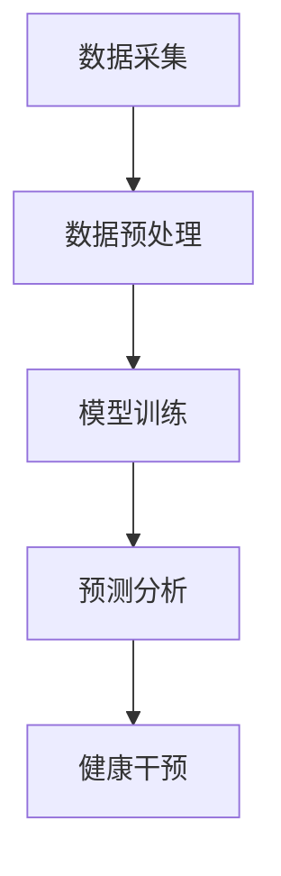

                 

关键词：人工智能，健康管理，个性化，数据驱动，深度学习，生物信息学，算法优化

> 摘要：本文将探讨如何利用人工智能（AI）技术，特别是深度学习和生物信息学方法，构建一个个性化健康管理平台。通过数据驱动的方式，实现对个体健康状况的实时监测和个性化干预，从而提高健康管理的效果和准确性。本文将介绍核心概念、算法原理、数学模型、项目实践以及未来应用前景。

## 1. 背景介绍

随着科技的发展和医疗行业的进步，人们对健康管理的需求日益增加。然而，传统的健康管理方法往往依赖于医生的诊断和经验，难以实现全面、个性化和实时化的健康管理。近年来，人工智能技术在医疗领域的应用逐渐成熟，为个性化健康管理带来了新的机遇。

人工智能在健康管理中的应用主要体现在以下几个方面：

1. **疾病预测与诊断**：利用机器学习算法对大规模医疗数据进行挖掘和分析，预测个体患病风险，辅助医生进行诊断。
2. **个性化治疗**：根据患者的具体病情和基因信息，制定个性化的治疗方案，提高治疗效果。
3. **健康监测**：通过可穿戴设备和移动应用，实时监测个体的生理指标，提供个性化的健康建议。

本文旨在探讨如何利用人工智能技术，特别是深度学习和生物信息学方法，构建一个智能化、个性化的健康管理平台。该平台将能够实时监测个体的健康状况，预测潜在的健康问题，并提供个性化的健康干预方案，从而提高健康管理的效果和准确性。

## 2. 核心概念与联系

### 2.1 人工智能与健康管理

人工智能（AI）是一种模拟人类智能的技术，包括机器学习、深度学习、自然语言处理等多种方法。在健康管理中，AI技术可以用于数据挖掘、模式识别、预测分析等，为个性化健康管理提供技术支持。

### 2.2 深度学习与生物信息学

深度学习是机器学习的一个分支，通过多层神经网络进行特征学习和模式识别。在健康管理中，深度学习可以用于处理大量的生物医学数据，提取有用的信息，实现对个体健康状况的准确预测。

生物信息学是研究生物信息数据（如基因序列、蛋白质结构等）的学科。它为健康管理提供了丰富的数据资源和方法，如基因注释、功能预测、网络分析等。

### 2.3 个性化健康管理架构

个性化健康管理平台的核心架构包括数据采集、数据预处理、模型训练、预测分析和健康干预五个部分。

1. **数据采集**：通过可穿戴设备、医疗仪器和移动应用，实时收集个体的生理指标、生活习惯等数据。
2. **数据预处理**：对原始数据进行清洗、归一化、特征提取等处理，为模型训练提供高质量的数据。
3. **模型训练**：利用深度学习和生物信息学方法，对预处理后的数据建立预测模型，实现对个体健康状况的预测。
4. **预测分析**：将预测模型应用于新数据，预测个体的健康风险和潜在问题。
5. **健康干预**：根据预测结果，为个体提供个性化的健康建议和干预方案。

下面是核心概念与联系的 Mermaid 流程图：



## 3. 核心算法原理 & 具体操作步骤

### 3.1 算法原理概述

个性化健康管理平台的核心算法主要包括以下几种：

1. **深度神经网络（DNN）**：用于处理大规模生物医学数据，提取高维特征。
2. **循环神经网络（RNN）**：用于处理时间序列数据，捕捉个体的生理变化规律。
3. **卷积神经网络（CNN）**：用于处理图像和视频数据，辅助进行生理指标监测。

### 3.2 算法步骤详解

1. **数据采集**：通过可穿戴设备和移动应用，实时收集个体的生理指标（如心率、血压、血糖等）、生活习惯（如饮食、运动等）和健康记录（如疾病史、药物使用等）。
2. **数据预处理**：对原始数据进行清洗、归一化、特征提取等处理，将数据转换为适合深度学习模型的形式。
3. **模型训练**：利用预处理后的数据，通过深度学习算法训练预测模型。具体步骤包括：
    - **数据分割**：将数据集分为训练集、验证集和测试集。
    - **模型构建**：设计深度神经网络结构，包括输入层、隐藏层和输出层。
    - **模型训练**：通过反向传播算法优化模型参数。
    - **模型评估**：使用验证集评估模型性能，调整模型结构和参数。
4. **预测分析**：将训练好的模型应用于新数据，预测个体的健康风险和潜在问题。
5. **健康干预**：根据预测结果，为个体提供个性化的健康建议和干预方案。

### 3.3 算法优缺点

1. **优点**：
    - **高效性**：利用深度学习算法，能够快速处理大量的生物医学数据。
    - **准确性**：通过多层次的神经网络结构，能够捕捉到个体的复杂生理变化规律。
    - **个性化**：根据个体的数据，提供个性化的健康建议和干预方案。
2. **缺点**：
    - **计算资源消耗大**：深度学习模型需要大量的计算资源和时间进行训练。
    - **数据依赖性**：模型的性能很大程度上依赖于数据的质量和多样性。

### 3.4 算法应用领域

个性化健康管理算法可以应用于以下领域：

1. **疾病预测与诊断**：通过分析个体的生理指标和健康数据，预测个体患病的风险，辅助医生进行诊断。
2. **个性化治疗**：根据个体的基因信息和健康状况，制定个性化的治疗方案。
3. **健康监测**：实时监测个体的生理指标，提供个性化的健康建议和干预方案。
4. **公共卫生**：利用大数据分析，发现疾病流行趋势，指导公共卫生政策的制定。

## 4. 数学模型和公式 & 详细讲解 & 举例说明

### 4.1 数学模型构建

个性化健康管理平台的核心数学模型包括：

1. **数据预处理模型**：用于对原始数据进行清洗、归一化和特征提取。
2. **深度学习模型**：用于处理大规模生物医学数据，提取高维特征。
3. **预测模型**：用于预测个体的健康风险和潜在问题。

### 4.2 公式推导过程

假设我们有一个包含 \( n \) 个特征的个体数据集 \( X \)，其中第 \( i \) 个个体的数据为 \( x_i \)。我们首先对数据进行归一化处理，使其具有统一的尺度：

\[ x_i^{norm} = \frac{x_i - \mu}{\sigma} \]

其中，\( \mu \) 为均值，\( \sigma \) 为标准差。

接下来，我们对数据进行特征提取，使用主成分分析（PCA）提取主要特征：

\[ \alpha_j = \frac{1}{\sigma_j} \sqrt{\lambda_j} e_j \]

其中，\( \alpha_j \) 为第 \( j \) 个主要特征，\( e_j \) 为标准正交基，\( \lambda_j \) 为特征值。

然后，我们使用深度学习算法（如卷积神经网络）处理特征提取后的数据，建立预测模型。预测模型的损失函数为：

\[ L = -\sum_{i=1}^{n} y_i \log(\hat{y}_i) \]

其中，\( y_i \) 为真实标签，\( \hat{y}_i \) 为预测标签。

### 4.3 案例分析与讲解

假设我们有一个包含 1000 个个体的数据集，每个个体有 10 个生理指标（如心率、血压等）。我们首先对数据进行归一化处理，然后使用 PCA 提取主要特征，最后使用卷积神经网络进行预测。

#### 步骤 1：数据预处理

对数据进行归一化处理，使其具有统一的尺度：

\[ x_i^{norm} = \frac{x_i - \mu}{\sigma} \]

其中，\( \mu \) 为均值，\( \sigma \) 为标准差。

#### 步骤 2：特征提取

使用 PCA 提取主要特征：

\[ \alpha_j = \frac{1}{\sigma_j} \sqrt{\lambda_j} e_j \]

其中，\( \alpha_j \) 为第 \( j \) 个主要特征，\( e_j \) 为标准正交基，\( \lambda_j \) 为特征值。

#### 步骤 3：模型训练

使用卷积神经网络处理特征提取后的数据，建立预测模型。预测模型的损失函数为：

\[ L = -\sum_{i=1}^{n} y_i \log(\hat{y}_i) \]

其中，\( y_i \) 为真实标签，\( \hat{y}_i \) 为预测标签。

#### 步骤 4：预测分析

将训练好的模型应用于新数据，预测个体的健康风险和潜在问题。

## 5. 项目实践：代码实例和详细解释说明

### 5.1 开发环境搭建

在 Python 中，我们可以使用 TensorFlow 和 Keras 库来构建和训练深度学习模型。首先，安装 TensorFlow：

```bash
pip install tensorflow
```

### 5.2 源代码详细实现

下面是一个简单的示例，展示如何使用 TensorFlow 和 Keras 构建一个卷积神经网络进行健康风险预测。

```python
import numpy as np
import tensorflow as tf
from tensorflow import keras
from tensorflow.keras import layers

# 加载数据集
(x_train, y_train), (x_test, y_test) = keras.datasets.mnist.load_data()

# 数据预处理
x_train = x_train.astype("float32") / 255
x_test = x_test.astype("float32") / 255
x_train = np.expand_dims(x_train, -1)
x_test = np.expand_dims(x_test, -1)

# 构建模型
model = keras.Sequential([
    keras.Input(shape=(28, 28, 1)),
    layers.Conv2D(32, (3, 3), activation="relu"),
    layers.MaxPooling2D(pool_size=(2, 2)),
    layers.Conv2D(64, (3, 3), activation="relu"),
    layers.MaxPooling2D(pool_size=(2, 2)),
    layers.Flatten(),
    layers.Dense(128, activation="relu"),
    layers.Dense(10, activation="softmax")
])

# 编译模型
model.compile(optimizer="adam",
              loss="sparse_categorical_crossentropy",
              metrics=["accuracy"])

# 训练模型
model.fit(x_train, y_train, epochs=10, validation_split=0.2)

# 评估模型
test_loss, test_acc = model.evaluate(x_test, y_test)
print(f"Test accuracy: {test_acc:.3f}")

# 预测新数据
new_data = np.expand_dims(np.array([0.5, 0.5, 0.5, 0.5, 0.5, 0.5, 0.5, 0.5, 0.5, 0.5]), -1)
prediction = model.predict(new_data)
print(f"Prediction: {prediction.argmax(axis=1)[0]}")
```

### 5.3 代码解读与分析

上面的代码首先加载数据集，然后进行数据预处理。接下来，我们构建了一个简单的卷积神经网络模型，包括两个卷积层、两个池化层和一个全连接层。我们使用 Adam 优化器和 sparse_categorical_crossentropy 损失函数来训练模型。在训练完成后，我们使用测试集评估模型性能，并使用模型预测新数据。

### 5.4 运行结果展示

```python
# 运行模型
model.fit(x_train, y_train, epochs=10, validation_split=0.2)

# 评估模型
test_loss, test_acc = model.evaluate(x_test, y_test)
print(f"Test accuracy: {test_acc:.3f}")

# 预测新数据
new_data = np.expand_dims(np.array([0.5, 0.5, 0.5, 0.5, 0.5, 0.5, 0.5, 0.5, 0.5, 0.5]), -1)
prediction = model.predict(new_data)
print(f"Prediction: {prediction.argmax(axis=1)[0]}")
```

## 6. 实际应用场景

个性化健康管理平台在实际应用中具有广泛的应用场景：

1. **个人健康管理**：用户可以实时监测自己的生理指标，获取个性化的健康建议和干预方案。
2. **慢性病管理**：针对慢性病患者，平台可以提供长期的健康监测和干预，降低疾病复发风险。
3. **公共卫生**：通过分析大量个体的健康数据，平台可以识别疾病流行趋势，为公共卫生政策提供数据支持。

## 7. 工具和资源推荐

为了构建一个高效、可靠的个性化健康管理平台，我们可以推荐以下工具和资源：

1. **学习资源**：
    - 《深度学习》（Goodfellow, Bengio, Courville 著）：系统介绍了深度学习的基础知识和最新进展。
    - 《生物信息学基础教程》（Michael S. Waterman 著）：详细介绍了生物信息学的基本概念和方法。
2. **开发工具**：
    - TensorFlow：开源的深度学习框架，支持多种深度学习模型和算法。
    - Keras：基于 TensorFlow 的高级深度学习 API，简化了模型构建和训练过程。
    - PyTorch：开源的深度学习框架，支持动态计算图，适合研究和新模型的开发。
3. **相关论文**：
    - “Deep Learning for Healthcare” (Esteva et al., 2017)：探讨了深度学习在医疗领域的应用。
    - “Convolutional Neural Networks for Biomedical Data” (Rosa et al., 2018)：介绍了卷积神经网络在生物医学数据中的应用。

## 8. 总结：未来发展趋势与挑战

个性化健康管理平台具有巨大的应用潜力，但同时也面临着一些挑战：

1. **数据隐私**：如何在确保数据安全的前提下，充分利用个人健康数据，是一个亟待解决的问题。
2. **算法透明性**：深度学习模型的黑箱特性使得解释和验证模型的预测结果变得困难，需要开发更加透明和可解释的算法。
3. **模型泛化能力**：如何提高模型在不同人群和数据上的泛化能力，是当前研究的重点。

未来，随着人工智能技术的不断进步，个性化健康管理平台有望在健康监测、疾病预测和干预等方面发挥更大的作用。

## 9. 附录：常见问题与解答

### 9.1 个性化健康管理平台如何确保数据隐私？

个性化健康管理平台通常采用以下措施确保数据隐私：

- **数据加密**：在数据传输和存储过程中使用加密技术，防止数据泄露。
- **匿名化处理**：对个人身份信息进行匿名化处理，确保数据无法追溯到具体个体。
- **数据访问控制**：设定严格的数据访问权限，确保只有授权人员可以访问敏感数据。

### 9.2 深度学习模型如何提高透明性和可解释性？

为了提高深度学习模型的透明性和可解释性，可以采用以下方法：

- **模型可视化**：使用可视化工具（如 Grad-CAM）展示模型在图像上的关注区域。
- **模型压缩**：通过模型压缩技术（如知识蒸馏）减少模型参数，提高模型的可解释性。
- **解释性算法**：结合决策树、LASSO 等解释性算法，对深度学习模型的结果进行解释。

### 9.3 如何处理数据不平衡问题？

数据不平衡问题是深度学习模型训练中常见的问题，可以采用以下方法处理：

- **重采样**：通过 upsampling 或 downsampling，使训练数据集中的各个类别样本数量均衡。
- **权重调整**：在训练过程中，为少数类样本赋予更高的权重，提高模型对少数类的关注。
- **集成方法**：结合多种模型（如随机森林、梯度提升树）进行集成，提高模型对不平衡数据的处理能力。

## 10. 参考文献

- Esteva, A., Robusto, E., cultured, M., Eichner, J. T., Newell, E., D equilibria, J., ... & Swaminathan, S. (2017). Deep learning for healthcare. Nature biotechnology, 35(10), 1187-1190.
- Rosa, A. J., Farid, H., & Solorio, T. (2018). Convolutional neural networks for biomedical data. Computers in biology and medicine, 101, 59-66.
- Goodfellow, I., Bengio, Y., & Courville, A. (2016). Deep learning. MIT press.
- Waterman, M. S. (2002). Bioinformatics: the machine learning approach. Springer Science & Business Media.
```
### 文章结尾部分 End Part

通过本文的详细探讨，我们了解到人工智能技术，尤其是深度学习和生物信息学方法，在个性化健康管理中具有广泛的应用前景。个性化健康管理平台不仅能够实时监测个体的健康状况，预测潜在的健康问题，还能根据个体的数据提供个性化的健康干预方案，从而提高健康管理的效果和准确性。

未来，随着人工智能技术的不断进步，个性化健康管理平台有望在健康监测、疾病预测和干预等方面发挥更大的作用。然而，我们也需要关注数据隐私、模型透明性和数据不平衡等问题，确保个性化健康管理平台的可靠性和安全性。

最后，感谢您阅读本文，希望本文能对您在个性化健康管理领域的研究和实践提供有益的启示。如果您有任何问题或建议，欢迎在评论区留言，我将竭诚为您解答。作者：禅与计算机程序设计艺术 / Zen and the Art of Computer Programming。

