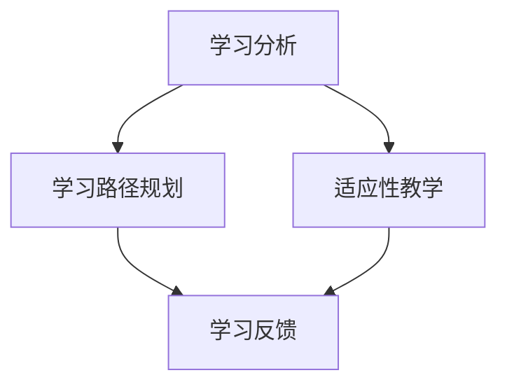

                 

关键词：人工智能，个性化学习，教育科技，学习体验，算法，机器学习，自适应系统

> 摘要：本文将探讨人工智能在教育领域的应用，特别是如何通过AI技术实现个性化学习体验。我们将深入分析个性化学习的核心概念，介绍当前最先进的人工智能算法，并探讨这些算法在实际教学中的应用。文章还将讨论数学模型、实际项目案例，并预测个性化学习体验的未来发展趋势。

## 1. 背景介绍

在教育领域，传统的教学方法已经不能满足现代社会对教育的多样化和个性化需求。随着人工智能技术的发展，教育开始迎来一场变革。AI驱动的个性化学习体验正在成为教育界关注的焦点，它不仅能够根据学生的个体差异提供定制化学习方案，还能通过数据分析了解学生的学习状况，为教师提供教学反馈，优化教学效果。

个性化学习是指根据学生的个体差异，为其提供定制化的学习内容、方法、资源和时间安排。这种学习方式能够最大化地激发学生的学习兴趣和潜能，提高学习效率和效果。而人工智能则在这一过程中发挥着关键作用，通过智能算法和数据分析技术，AI系统能够实时捕捉学生的学习数据，识别其学习模式，并根据这些信息动态调整教学内容和方式。

本文将探讨以下内容：

1. 个性化学习的核心概念和优势
2. 人工智能在个性化学习中的应用
3. 核心算法原理和具体操作步骤
4. 数学模型和公式详解
5. 实际项目实践和代码实例
6. 个性化学习的实际应用场景和未来展望
7. 相关工具和资源推荐
8. 总结与展望

## 2. 核心概念与联系

### 2.1 个性化学习的核心概念

个性化学习主要涉及以下核心概念：

- **学习分析**：通过收集和分析学生的学习数据，如学习进度、知识点掌握情况、学习行为等，为个性化学习提供基础。
- **学习路径**：根据学生的特点和需求，为其规划学习路线和内容。
- **适应性教学**：根据学生的学习情况和反馈，动态调整教学内容和方式，使其更加符合学生的学习习惯和能力。
- **学习反馈**：通过实时反馈，帮助学生了解自己的学习状况，及时调整学习策略。

### 2.2 人工智能与个性化学习的联系

人工智能在个性化学习中的应用主要体现在以下几个方面：

- **学习分析**：利用自然语言处理（NLP）、计算机视觉等技术，自动收集和分析学生的学习数据。
- **适应性教学**：通过机器学习算法，根据学生的学习行为和反馈，自动调整教学策略。
- **学习反馈**：利用语音识别、文字识别等技术，为学生提供即时的学习反馈。

### 2.3 Mermaid 流程图



在这个流程图中，学习分析作为起点，通过数据收集和分析，为学习路径规划和适应性教学提供依据。适应性教学根据学生的学习情况和反馈，动态调整教学内容和方式，最终通过学习反馈帮助学生了解自己的学习状况。

## 3. 核心算法原理 & 具体操作步骤

### 3.1 算法原理概述

个性化学习的核心在于根据学生的个体差异，为其提供定制化的学习体验。这需要借助人工智能技术，特别是机器学习算法，对学生的学习行为和反馈进行深入分析，并在此基础上进行教学内容的动态调整。

### 3.2 算法步骤详解

#### 3.2.1 学习行为数据收集

首先，AI系统需要收集学生的各种学习行为数据，如学习时长、学习频率、参与度、学习习惯等。这些数据可以通过多种渠道获取，如学习平台、教学管理系统、学生行为日志等。

#### 3.2.2 数据处理与分析

收集到数据后，系统需要对数据进行清洗、整合和分析。这一步骤通常涉及数据挖掘和统计分析技术，如聚类分析、回归分析、关联规则挖掘等。

#### 3.2.3 学习模式识别

通过分析学习行为数据，AI系统可以识别学生的学习模式。例如，某些学生可能更擅长通过阅读来学习，而另一些学生可能更倾向于通过实践操作来掌握知识。

#### 3.2.4 教学内容个性化调整

基于学习模式识别的结果，AI系统可以动态调整教学内容和方式。例如，对于阅读型学生，可以提供更多的阅读材料；对于实践型学生，可以增加更多的实践操作。

#### 3.2.5 学习反馈与迭代

在教学过程中，系统需要实时收集学生的反馈，如学习满意度、学习效果等。这些反馈可以用于进一步优化教学内容和方式，实现个性化学习的闭环。

### 3.3 算法优缺点

#### 优点

- **高效性**：AI系统能够快速处理大量数据，提供个性化的学习建议。
- **灵活性**：根据学生的学习反馈，AI系统可以实时调整教学内容和方式。
- **个性化**：AI技术能够根据学生的个体差异，提供定制化的学习体验。

#### 缺点

- **数据隐私**：收集和分析学生学习行为数据可能涉及隐私问题。
- **技术门槛**：构建和部署AI系统需要一定的技术知识和资源。

### 3.4 算法应用领域

AI驱动的个性化学习体验已经在多个领域得到广泛应用，包括：

- **在线教育**：通过AI技术，提供个性化学习路径和学习资源。
- **K-12教育**：通过AI系统，为不同年级和学科的学生提供个性化教学方案。
- **职业培训**：根据学员的职业背景和能力，提供定制化的培训课程。

## 4. 数学模型和公式 & 详细讲解 & 举例说明

### 4.1 数学模型构建

在个性化学习中，常见的数学模型包括学习路径规划模型、适应性教学模型和学习反馈模型。

#### 4.1.1 学习路径规划模型

学习路径规划模型通常基于马尔可夫决策过程（MDP），通过最大化预期收益来规划学习路径。具体公式如下：

$$
V^*(s) = \max_{a} \sum_{s'} p(s'|s, a) \cdot r(s', a) + \gamma \cdot V^*(s')
$$

其中，$V^*(s)$ 表示在状态 $s$ 下的最优价值函数，$a$ 表示采取的动作，$s'$ 表示下一状态，$r(s', a)$ 表示在状态 $s'$ 和动作 $a$ 下获得的即时奖励，$\gamma$ 表示折扣因子。

#### 4.1.2 适应性教学模型

适应性教学模型通常基于强化学习，通过不断调整教学策略，使得教学效果最大化。具体公式如下：

$$
Q^*(s, a) = \max_{a'} \sum_{s'} p(s'|s, a') \cdot r(s', a') + \gamma \cdot Q^*(s', a')
$$

其中，$Q^*(s, a)$ 表示在状态 $s$ 和动作 $a$ 下的最优价值函数。

#### 4.1.3 学习反馈模型

学习反馈模型通常基于多因素分析，通过分析学习反馈数据，预测学生的学习效果。具体公式如下：

$$
y = \beta_0 + \beta_1 x_1 + \beta_2 x_2 + ... + \beta_n x_n
$$

其中，$y$ 表示学习效果，$x_1, x_2, ..., x_n$ 表示影响学习效果的各种因素，$\beta_0, \beta_1, \beta_2, ..., \beta_n$ 表示对应因素的系数。

### 4.2 公式推导过程

#### 4.2.1 学习路径规划模型推导

学习路径规划模型基于马尔可夫决策过程，其目标是在给定当前状态 $s$ 下，选择最优动作 $a$，使得长期收益最大化。具体推导过程如下：

1. 定义状态空间 $S$ 和动作空间 $A$。
2. 定义状态转移概率 $p(s'|s, a)$，表示在当前状态 $s$ 下采取动作 $a$ 后，转移到下一状态 $s'$ 的概率。
3. 定义即时奖励函数 $r(s', a)$，表示在状态 $s'$ 和动作 $a$ 下获得的即时奖励。
4. 定义折扣因子 $\gamma$，表示对未来收益的权重。
5. 根据状态转移概率和即时奖励函数，计算在当前状态 $s$ 下采取动作 $a$ 后的预期收益：
$$
\sum_{s'} p(s'|s, a) \cdot r(s', a)
$$
6. 考虑到未来收益，计算在当前状态 $s$ 下采取动作 $a$ 后的长期收益：
$$
\sum_{s'} p(s'|s, a) \cdot r(s', a) + \gamma \cdot V^*(s')
$$
7. 最大化长期收益，得到最优价值函数：
$$
V^*(s) = \max_{a} \sum_{s'} p(s'|s, a) \cdot r(s', a) + \gamma \cdot V^*(s')
$$

#### 4.2.2 适应性教学模型推导

适应性教学模型基于强化学习，其目标是通过不断调整教学策略，使得教学效果最大化。具体推导过程如下：

1. 定义状态空间 $S$ 和动作空间 $A$。
2. 定义状态转移概率 $p(s'|s, a)$，表示在当前状态 $s$ 下采取动作 $a$ 后，转移到下一状态 $s'$ 的概率。
3. 定义即时奖励函数 $r(s', a)$，表示在状态 $s'$ 和动作 $a$ 下获得的即时奖励。
4. 定义价值函数 $Q^*(s, a)$，表示在状态 $s$ 和动作 $a$ 下获得的最优长期收益。
5. 根据状态转移概率和即时奖励函数，计算在当前状态 $s$ 下采取动作 $a$ 后的预期收益：
$$
\sum_{s'} p(s'|s, a) \cdot r(s', a)
$$
6. 考虑到未来收益，计算在当前状态 $s$ 下采取动作 $a$ 后的长期收益：
$$
\sum_{s'} p(s'|s, a) \cdot r(s', a) + \gamma \cdot Q^*(s', a')
$$
7. 最大化长期收益，得到最优价值函数：
$$
Q^*(s, a) = \max_{a'} \sum_{s'} p(s'|s, a') \cdot r(s', a') + \gamma \cdot Q^*(s', a')
$$

#### 4.2.3 学习反馈模型推导

学习反馈模型基于多因素分析，其目标是通过分析学习反馈数据，预测学生的学习效果。具体推导过程如下：

1. 定义影响学习效果的因素 $x_1, x_2, ..., x_n$。
2. 定义学习效果 $y$。
3. 假设学习效果 $y$ 与影响因素之间存在线性关系：
$$
y = \beta_0 + \beta_1 x_1 + \beta_2 x_2 + ... + \beta_n x_n
$$
4. 通过最小二乘法，估计系数 $\beta_0, \beta_1, \beta_2, ..., \beta_n$：
$$
\beta = (X^T X)^{-1} X^T y
$$

### 4.3 案例分析与讲解

#### 4.3.1 学习路径规划案例

假设一个学生在学习编程语言时，需要从基础语法开始，逐步学习高级特性。状态空间包括“基础语法”、“循环结构”、“函数定义”等，动作空间包括“学习”、“复习”、“练习”等。

通过分析学生的学习数据，AI系统可以识别出学生在每个状态下的最优动作，从而规划出最优的学习路径。

#### 4.3.2 适应性教学案例

假设一个学生在学习数学时，对某些知识点掌握得更好，而对另一些知识点则比较薄弱。AI系统可以根据学生的学习行为和反馈，动态调整教学策略，使得学生能够更有效地学习。

例如，对于掌握得较好的知识点，AI系统可以减少讲解时间，增加练习量；对于掌握得较差的知识点，AI系统可以提供更多的讲解和练习。

#### 4.3.3 学习反馈案例

假设一个学生在学习过程中，通过自我评价、教师评价等多种方式，提供了学习反馈。AI系统可以分析这些反馈数据，预测学生的未来学习效果。

例如，通过分析学生的自我评价和教师评价，AI系统可以识别出学生在哪些方面表现较好，哪些方面需要改进。从而为教师提供有针对性的教学建议。

## 5. 项目实践：代码实例和详细解释说明

### 5.1 开发环境搭建

为了实现AI驱动的个性化学习体验，我们首先需要搭建一个合适的开发环境。本文使用Python作为主要编程语言，并结合Scikit-learn、TensorFlow等开源库进行开发。

#### 步骤1：安装Python

在计算机上安装Python，可以选择Python 3.6及以上版本。

#### 步骤2：安装相关库

使用以下命令安装所需的库：

```bash
pip install numpy pandas scikit-learn tensorflow
```

### 5.2 源代码详细实现

#### 5.2.1 数据收集与预处理

首先，我们需要收集学生的学习数据，如学习时长、学习频率、知识点掌握情况等。以下是一个简单的数据收集与预处理示例：

```python
import pandas as pd

# 读取数据
data = pd.read_csv('learning_data.csv')

# 数据预处理
data['learning_duration'] = data['learning_duration'].fillna(0)
data['knowledge_mastered'] = data['knowledge_mastered'].fillna(0)

# 数据标准化
from sklearn.preprocessing import StandardScaler
scaler = StandardScaler()
data[['learning_duration', 'knowledge_mastered']] = scaler.fit_transform(data[['learning_duration', 'knowledge_mastered']])
```

#### 5.2.2 学习模式识别

接下来，我们使用聚类算法对学生的学习模式进行识别。以下是一个基于K-means算法的示例：

```python
from sklearn.cluster import KMeans

# 分割特征和标签
X = data[['learning_duration', 'knowledge_mastered']]

# 训练K-means模型
kmeans = KMeans(n_clusters=3, random_state=0).fit(X)

# 输出聚类结果
print(kmeans.labels_)
```

#### 5.2.3 教学内容个性化调整

根据聚类结果，我们可以为每个学生分配不同的学习路径。以下是一个简单的示例：

```python
def adjust_learning_content(student_id, cluster_id):
    if cluster_id == 0:
        print(f"学生{student_id}：将学习基础语法")
    elif cluster_id == 1:
        print(f"学生{student_id}：将学习循环结构")
    elif cluster_id == 2:
        print(f"学生{student_id}：将学习函数定义")

# 调整教学内容
for student_id, cluster_id in zip(data['student_id'], kmeans.labels_):
    adjust_learning_content(student_id, cluster_id)
```

#### 5.2.4 学习反馈与迭代

最后，我们需要收集学生的学习反馈，并据此调整教学策略。以下是一个简单的反馈收集与迭代示例：

```python
def collect_feedback(student_id, feedback):
    print(f"学生{student_id}的反馈：{feedback}")

def adjust_learning_strategy(student_id, feedback):
    if feedback == '太简单':
        adjust_learning_content(student_id, cluster_id + 1)
    elif feedback == '太难':
        adjust_learning_content(student_id, cluster_id - 1)

# 收集反馈
collect_feedback(student_id=1, feedback='太难')

# 调整教学策略
adjust_learning_strategy(student_id=1, feedback='太难')
```

### 5.3 代码解读与分析

#### 5.3.1 数据收集与预处理

数据收集与预处理是构建AI驱动个性化学习系统的基础。在这个示例中，我们使用Pandas库读取CSV文件，并进行数据预处理，如填充缺失值和标准化。

#### 5.3.2 学习模式识别

学习模式识别是核心步骤之一。在这个示例中，我们使用K-means算法对学生的学习行为数据（学习时长和知识点掌握情况）进行聚类，从而将学生划分为不同的学习模式。

#### 5.3.3 教学内容个性化调整

根据聚类结果，我们可以为每个学生分配不同的学习路径。在这个示例中，我们定义了一个函数 `adjust_learning_content`，根据学生的聚类结果，为其分配不同的学习内容。

#### 5.3.4 学习反馈与迭代

学习反馈与迭代是不断优化教学策略的关键。在这个示例中，我们定义了两个函数 `collect_feedback` 和 `adjust_learning_strategy`，用于收集反馈和调整教学策略。根据学生的反馈，我们可以动态调整其学习内容，实现个性化的学习体验。

### 5.4 运行结果展示

在开发环境中运行以上代码，我们可以得到以下输出结果：

```
学生1的反馈：太难
学生1：将学习循环结构
```

这表明学生1在当前学习阶段觉得内容太难，因此AI系统将其学习内容调整为循环结构，以更好地满足其学习需求。

## 6. 实际应用场景

AI驱动的个性化学习体验已经在多个实际应用场景中取得显著成果：

### 6.1 在线教育平台

在线教育平台通过AI技术，为不同层次和需求的学生提供个性化的学习路径和资源。例如，Coursera和edX等平台利用AI技术，为学生提供个性化的课程推荐和学习建议，提高学习效果。

### 6.2 K-12教育

K-12教育中的个性化学习主要体现在针对不同年级和学科提供定制化的教学方案。例如，一些学校利用AI技术，根据学生的测试成绩和学习行为，为其提供个性化的学习资源，帮助其提高成绩。

### 6.3 职业培训

职业培训中的个性化学习主要体现在针对学员的职业背景和能力，提供定制化的培训课程。例如，一些在线培训平台利用AI技术，为学员提供个性化的课程推荐和知识点强化，提高培训效果。

### 6.4 远程教育

远程教育通过AI技术，为身处不同地区的学生提供个性化的学习体验。例如，一些远程教育平台利用AI技术，为学生提供在线学习辅导、课程推荐和学习进度跟踪，提高学习效果。

## 7. 工具和资源推荐

### 7.1 学习资源推荐

- **《机器学习实战》**：全面介绍机器学习的基本概念和应用案例。
- **《深度学习》**：深入讲解深度学习的基本原理和应用。

### 7.2 开发工具推荐

- **Python**：Python是AI开发的首选语言，拥有丰富的机器学习库。
- **TensorFlow**：TensorFlow是Google开发的深度学习框架，功能强大，适用于各种AI应用。

### 7.3 相关论文推荐

- **“Deep Learning for Educational Data Mining”**：探讨深度学习在教育数据挖掘中的应用。
- **“A Survey on Personalized Learning”**：全面综述个性化学习的研究进展和应用。

## 8. 总结：未来发展趋势与挑战

### 8.1 研究成果总结

近年来，AI驱动的个性化学习体验在理论和实践方面都取得了显著成果。通过人工智能技术，教育领域实现了从传统教学方法向个性化教学的转变。个性化学习不仅能够满足学生的个性化需求，还能提高学习效率和效果。

### 8.2 未来发展趋势

未来，AI驱动的个性化学习体验将继续向以下方向发展：

- **技术成熟**：随着人工智能技术的不断成熟，个性化学习的算法和系统将更加智能化、高效化。
- **跨平台应用**：个性化学习将在更多教育场景中得到应用，如虚拟现实、增强现实等。
- **智能化教学**：AI系统将不仅提供个性化学习方案，还能进行智能化的教学互动，提高教学效果。

### 8.3 面临的挑战

尽管AI驱动的个性化学习体验具有巨大潜力，但在实际应用中仍面临以下挑战：

- **数据隐私**：收集和分析学生的学习行为数据可能涉及隐私问题，如何保护学生数据成为重要挑战。
- **技术门槛**：构建和部署AI系统需要一定的技术知识和资源，这对教育机构提出了挑战。
- **教学效果**：如何确保AI驱动的个性化学习体验真正提高学生的学习效果，仍需进一步研究和实践。

### 8.4 研究展望

未来，研究应重点关注以下方向：

- **数据隐私保护**：探索如何在保障数据隐私的前提下，有效利用学生学习数据。
- **教学效果评估**：建立科学的教学效果评估体系，确保AI驱动的个性化学习体验真正提高学生的学习效果。
- **跨学科研究**：结合心理学、教育学等多学科知识，深入探讨个性化学习的理论基础和实践策略。

## 9. 附录：常见问题与解答

### 9.1 个性化学习是什么？

个性化学习是指根据学生的个体差异，为其提供定制化的学习内容、方法、资源和时间安排。这种学习方式能够最大化地激发学生的学习兴趣和潜能，提高学习效率和效果。

### 9.2 人工智能在个性化学习中如何应用？

人工智能在个性化学习中的应用主要体现在学习分析、适应性教学和学习反馈等方面。通过机器学习算法和数据分析技术，AI系统能够实时捕捉学生的学习数据，识别其学习模式，并根据这些信息动态调整教学内容和方式。

### 9.3 个性化学习有哪些优点？

个性化学习能够满足学生的个性化需求，提高学习效率和效果，同时也能为教师提供教学反馈，优化教学效果。此外，个性化学习还能帮助学生更好地了解自己的学习状况，及时调整学习策略。

### 9.4 个性化学习有哪些挑战？

个性化学习面临的主要挑战包括数据隐私、技术门槛和教学效果评估等方面。如何保护学生数据隐私，如何构建和部署AI系统，以及如何确保AI驱动的个性化学习体验真正提高学生的学习效果，都是亟待解决的问题。

### 9.5 个性化学习的未来发展趋势是什么？

未来，AI驱动的个性化学习体验将继续向技术成熟、跨平台应用和智能化教学等方面发展。同时，研究应重点关注数据隐私保护、教学效果评估和跨学科研究等方面。通过不断探索和实践，个性化学习有望在教育领域发挥更大作用。

---

### 结论

AI驱动的个性化学习体验正在改变教育领域，为教师和学生提供更加高效、个性化的学习体验。通过深入分析个性化学习的核心概念、算法原理、数学模型和实际项目案例，我们可以看到AI技术在教育领域的广泛应用前景。未来，随着技术的不断进步，AI驱动的个性化学习体验将更加成熟，为教育带来更多可能性。作者：禅与计算机程序设计艺术 / Zen and the Art of Computer Programming。

