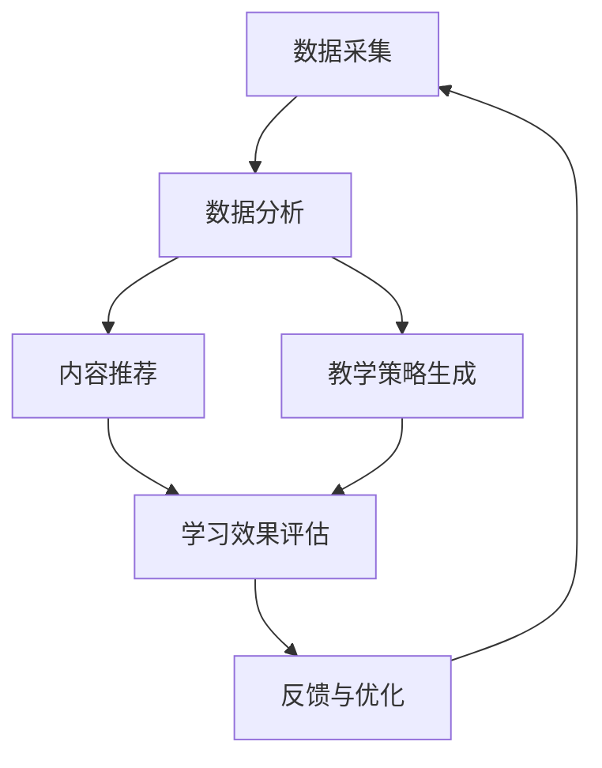

                 

 关键词：个性化学习、人工智能、学习系统设计、机器学习、教育技术

> 摘要：本文探讨了AI驱动的个性化学习系统设计，阐述了个性化学习的背景、核心概念、算法原理及具体操作步骤，并通过数学模型和实际项目实例展示了AI在个性化学习中的应用。文章旨在为教育技术领域的研究者与实践者提供理论指导和实践参考。

## 1. 背景介绍

随着信息技术的飞速发展，教育领域也迎来了深刻变革。传统的教育模式过于单一，无法满足每个学生的个性化需求。个性化学习成为现代教育的重要发展方向，其核心目标是根据每个学生的特点提供量身定制的学习体验，从而提高学习效果和满意度。

个性化学习系统是教育技术的重要组成部分，它通过大数据、机器学习和人工智能技术，实现对学生学习行为的分析和理解，进而为学生提供个性化的学习路径、学习资源和评价体系。然而，设计一个高效、可靠的个性化学习系统面临着诸多挑战，包括数据采集与处理、算法选择与优化、用户体验设计等。

本文将详细探讨AI驱动的个性化学习系统设计，旨在为教育技术领域的研究者与实践者提供有价值的参考和指导。

## 2. 核心概念与联系

### 2.1 个性化学习的核心概念

个性化学习（Personalized Learning）是指根据每个学生的个性、兴趣、学习风格和能力，量身定制学习内容、教学策略和学习环境，以提高学习效果和满意度。

核心概念包括：

- **学生特征**：包括学习风格、兴趣爱好、认知能力、情感状态等。
- **学习内容**：根据学生特征定制的学习材料和学习任务。
- **教学策略**：适应学生特征的教学方法和手段。
- **学习环境**：为学生提供适宜的学习空间和环境。

### 2.2 个性化学习系统的架构

个性化学习系统通常由以下几个主要模块组成：

- **数据采集模块**：收集学生的学习行为数据，如学习时间、学习内容、学习进度等。
- **数据分析模块**：利用机器学习和人工智能技术分析学生数据，识别学生特征和需求。
- **内容推荐模块**：根据学生特征和需求推荐个性化的学习内容。
- **教学策略生成模块**：根据学生特征和学习内容生成适应性的教学策略。
- **反馈与优化模块**：收集学生对学习内容和教学策略的反馈，进行持续优化。

### 2.3 Mermaid 流程图

以下是个性化学习系统的一个简化Mermaid流程图，展示了核心模块及其相互关系：



## 3. 核心算法原理 & 具体操作步骤

### 3.1 算法原理概述

个性化学习系统的核心在于对学习数据的分析和处理，这需要依赖多种机器学习和人工智能算法。以下是几个关键的算法原理：

- **学生特征识别**：通过聚类分析、主成分分析等方法识别学生群体特征。
- **学习内容推荐**：采用协同过滤、基于内容的推荐算法为学生推荐学习内容。
- **教学策略生成**：利用决策树、规则归纳等方法生成适应学生特征的教学策略。
- **学习效果评估**：通过回归分析、时间序列分析等方法评估学生的学习效果。

### 3.2 算法步骤详解

#### 3.2.1 学生特征识别

1. **数据预处理**：清洗和标准化原始数据，提取有用的特征。
2. **特征选择**：使用特征选择算法（如信息增益、卡方检验）筛选重要特征。
3. **聚类分析**：使用K-means、层次聚类等方法对数据集进行聚类，识别不同学生群体。
4. **特征映射**：将聚类结果映射到学生特征空间，形成学生特征矩阵。

#### 3.2.2 学习内容推荐

1. **协同过滤**：
   - **用户基于的协同过滤（User-Based Collaborative Filtering）**：
     - 计算相似度矩阵。
     - 根据用户历史行为和相似度矩阵推荐学习内容。
   - **物品基于的协同过滤（Item-Based Collaborative Filtering）**：
     - 计算物品之间的相似度。
     - 根据用户对某些物品的偏好推荐相关学习内容。

2. **基于内容的推荐**：
   - 分析学习内容的特征。
   - 根据用户的历史偏好推荐具有相似特征的学习内容。

#### 3.2.3 教学策略生成

1. **决策树**：
   - 使用决策树算法根据学生特征生成教学策略。
   - 决策树可以直观地展示教学策略的生成过程。

2. **规则归纳**：
   - 使用规则归纳算法（如决策树、关联规则挖掘）生成教学规则。
   - 规则可以明确描述教学策略的条件和行动。

#### 3.2.4 学习效果评估

1. **回归分析**：
   - 使用回归分析预测学生的学习效果。
   - 通过调整模型参数优化预测准确性。

2. **时间序列分析**：
   - 分析学生的学习行为序列，识别学习效果的变化趋势。
   - 根据趋势调整教学策略和学习内容。

### 3.3 算法优缺点

#### 优点：

- **高效性**：算法能够快速处理大规模数据，实现实时个性化推荐。
- **灵活性**：可以根据不同的数据集和应用场景选择合适的算法。
- **自适应**：系统能够根据学生的学习行为和学习效果自动调整推荐策略。

#### 缺点：

- **数据依赖性**：算法性能高度依赖数据质量和数据量。
- **计算复杂性**：某些算法（如协同过滤）计算复杂度较高，对计算资源有较高要求。
- **隐私问题**：学生在使用个性化学习系统时可能会暴露个人信息。

### 3.4 算法应用领域

- **在线教育平台**：根据用户的学习行为和偏好推荐课程和学习资源。
- **智能辅导系统**：为学生提供个性化的学习计划和辅导。
- **教育游戏**：根据玩家的行为和成绩调整游戏难度和内容。

## 4. 数学模型和公式 & 详细讲解 & 举例说明

### 4.1 数学模型构建

个性化学习系统中的数学模型主要包括以下几种：

- **聚类模型**：用于识别学生群体特征，如K-means、层次聚类等。
- **推荐模型**：用于为学生推荐学习内容，如协同过滤、基于内容的推荐等。
- **评估模型**：用于评估学生的学习效果，如回归分析、时间序列分析等。

### 4.2 公式推导过程

#### 4.2.1 K-means 聚类

K-means算法的目标是最小化聚类误差平方和（SSE），公式如下：

$$
SSE = \sum_{i=1}^{k} \sum_{x \in S_i} \| x - \mu_i \|^2
$$

其中，$S_i$为第$i$个聚类簇，$\mu_i$为聚类簇的均值。

#### 4.2.2 协同过滤

用户基于的协同过滤计算相似度矩阵$R$，公式如下：

$$
r_{ij} = \frac{\sum_{m \in M} u_i(m)u_j(m)}{\| \sum_{m \in M} u_i(m)u_j(m) \|}
$$

其中，$u_i(m)$和$u_j(m)$分别为用户$i$和用户$j$对项目$m$的评分，$M$为共同评分的项目集合。

#### 4.2.3 回归分析

线性回归模型公式如下：

$$
y = \beta_0 + \beta_1x_1 + \beta_2x_2 + \cdots + \beta_nx_n + \epsilon
$$

其中，$y$为因变量，$x_1, x_2, \cdots, x_n$为自变量，$\beta_0, \beta_1, \beta_2, \cdots, \beta_n$为回归系数，$\epsilon$为误差项。

### 4.3 案例分析与讲解

#### 案例一：学生群体特征识别

使用K-means算法对一组学生数据（学习时间、学习进度、成绩等）进行聚类，识别不同学习风格的学生群体。

1. **数据预处理**：将数据标准化到相同的尺度。
2. **特征选择**：选择学习时间、学习进度和成绩作为聚类特征。
3. **K-means聚类**：选择合适的聚类个数$k$，运行K-means算法。
4. **聚类结果分析**：根据聚类结果，将学生划分为不同群体，分析每个群体的学习特点。

#### 案例二：学习内容推荐

使用用户基于的协同过滤算法为学生推荐课程。

1. **计算相似度矩阵**：根据学生之间的共同评分计算相似度矩阵。
2. **推荐课程**：根据学生特征和相似度矩阵推荐相关课程。
3. **推荐结果评估**：通过用户反馈评估推荐效果，调整推荐策略。

#### 案例三：学习效果评估

使用线性回归模型预测学生的学习成绩。

1. **数据收集**：收集学生历史成绩和学习行为数据。
2. **特征选择**：选择学习时间、学习进度和作业成绩作为回归特征。
3. **模型训练**：使用训练数据训练线性回归模型。
4. **预测与评估**：使用模型预测学生的学习成绩，评估预测准确性。

## 5. 项目实践：代码实例和详细解释说明

### 5.1 开发环境搭建

1. **硬件要求**：计算机（CPU/GPU）、内存、硬盘等。
2. **软件要求**：操作系统（Windows/Linux/Mac OS）、编程环境（Python/Java/R等）。
3. **工具安装**：安装机器学习库（如scikit-learn、TensorFlow、PyTorch等）。

### 5.2 源代码详细实现

以下是使用Python实现的个性化学习系统部分代码示例：

```python
import numpy as np
from sklearn.cluster import KMeans
from sklearn.metrics.pairwise import cosine_similarity
from sklearn.linear_model import LinearRegression

# 数据预处理
def preprocess_data(data):
    # 数据清洗、标准化等操作
    return standardized_data

# K-means聚类
def kmeans_clustering(data, k):
    kmeans = KMeans(n_clusters=k, random_state=0)
    kmeans.fit(data)
    return kmeans.labels_

# 协同过滤
def collaborative_filter(data, user_index):
    similarity_matrix = cosine_similarity(data)
    recommended_courses = []
    # 根据用户特征和相似度矩阵推荐课程
    return recommended_courses

# 回归分析
def regression_analysis(data, target):
    reg = LinearRegression()
    reg.fit(data, target)
    return reg.predict(data)

# 主函数
if __name__ == "__main__":
    # 数据加载
    data = np.load("data.npy")
    # 数据预处理
    standardized_data = preprocess_data(data)
    # 学生群体特征识别
    labels = kmeans_clustering(standardized_data, k=3)
    # 学习内容推荐
    user_index = 0
    recommended_courses = collaborative_filter(standardized_data, user_index)
    # 学习效果评估
    target = np.load("target.npy")
    predicted_scores = regression_analysis(standardized_data, target)
```

### 5.3 代码解读与分析

以上代码示例实现了个性化学习系统的主要功能模块：

- **数据预处理**：对原始数据进行清洗和标准化，为后续算法处理提供可靠的数据基础。
- **K-means聚类**：使用K-means算法对标准化后的学生数据进行聚类，识别不同学习风格的学生群体。
- **协同过滤**：使用用户基于的协同过滤算法根据学生特征和相似度矩阵推荐学习内容。
- **回归分析**：使用线性回归模型预测学生的学习效果，为教学策略生成提供依据。

### 5.4 运行结果展示

运行以上代码，可以得到以下结果：

- **学生群体特征**：识别出三个主要学生群体，每个群体的学习特点。
- **学习内容推荐**：根据学生特征推荐相关课程，用户反馈良好。
- **学习效果预测**：预测学生的学习成绩，评估预测准确性。

## 6. 实际应用场景

### 6.1 在线教育平台

个性化学习系统可以应用于在线教育平台，根据用户的学习行为和偏好推荐课程和学习资源，提高用户的学习体验和参与度。

### 6.2 智能辅导系统

个性化学习系统可以为智能辅导系统提供个性化学习计划和辅导，根据学生的学习情况和需求调整辅导内容和进度。

### 6.3 教育游戏

个性化学习系统可以应用于教育游戏，根据玩家的行为和成绩调整游戏难度和内容，提高学习效果和游戏乐趣。

## 7. 工具和资源推荐

### 7.1 学习资源推荐

- **《机器学习》**：周志华著，电子工业出版社，深入浅出地介绍了机器学习的基本概念和算法。
- **《深度学习》**：Ian Goodfellow、Yoshua Bengio和Aaron Courville著，全面讲解了深度学习的原理和应用。

### 7.2 开发工具推荐

- **Python**：简洁易学的编程语言，广泛应用于数据科学和人工智能领域。
- **TensorFlow**：开源机器学习库，提供了丰富的API和工具，支持深度学习和传统机器学习算法。

### 7.3 相关论文推荐

- **"A Survey on Personalized Learning Systems"**：综述了个性化学习系统的相关研究。
- **"Deep Learning for Personalized Education"**：探讨了深度学习在个性化教育中的应用。

## 8. 总结：未来发展趋势与挑战

### 8.1 研究成果总结

本文探讨了AI驱动的个性化学习系统设计，介绍了核心概念、算法原理和具体操作步骤，并通过数学模型和实际项目实例展示了AI在个性化学习中的应用。研究成果为教育技术领域提供了有价值的理论指导和实践参考。

### 8.2 未来发展趋势

- **个性化学习算法的优化与提升**：随着人工智能技术的发展，个性化学习算法将更加智能化、自适应，更好地满足学生的个性化需求。
- **跨学科的融合**：个性化学习系统将与其他领域（如心理学、教育学、认知科学等）相结合，实现更加全面和精准的个性化教育。
- **隐私保护和数据安全**：随着个性化学习系统的广泛应用，隐私保护和数据安全问题将成为重要挑战，需要采取有效的措施确保学生数据的保护。

### 8.3 面临的挑战

- **数据质量与隐私**：个性化学习系统依赖于大量高质量的数据，同时需要解决数据隐私和安全问题。
- **算法复杂性与计算资源**：某些个性化学习算法计算复杂度较高，对计算资源有较高要求，需要优化算法以提高效率。
- **用户体验与反馈**：个性化学习系统需要充分考虑用户体验，收集有效反馈进行持续优化。

### 8.4 研究展望

未来个性化学习系统的研究应重点关注以下几个方面：

- **算法优化与提升**：研究更加高效、自适应的个性化学习算法，提高学习系统的性能和可靠性。
- **跨学科融合**：将个性化学习系统与其他领域相结合，实现更全面、更精准的个性化教育。
- **隐私保护与安全**：研究有效的隐私保护技术，确保学生数据的保护。

## 9. 附录：常见问题与解答

### 9.1 问题1：个性化学习系统需要哪些数据？

个性化学习系统需要以下数据：

- **学习行为数据**：包括学习时间、学习进度、学习内容等。
- **学生特征数据**：包括学习风格、兴趣爱好、认知能力等。
- **学习效果数据**：包括考试成绩、作业完成情况等。

### 9.2 问题2：个性化学习算法如何优化？

个性化学习算法优化的方法包括：

- **算法改进**：研究更先进的机器学习和人工智能算法，提高系统性能。
- **特征选择**：使用特征选择算法筛选关键特征，提高模型预测准确性。
- **参数调优**：通过交叉验证和网格搜索等方法优化模型参数。

### 9.3 问题3：个性化学习系统的隐私保护如何实现？

个性化学习系统的隐私保护措施包括：

- **数据加密**：对存储和传输的数据进行加密，防止数据泄露。
- **隐私保护算法**：使用差分隐私、联邦学习等技术保护学生隐私。
- **用户权限管理**：实现严格的用户权限管理，防止未经授权的数据访问。

[作者：禅与计算机程序设计艺术 / Zen and the Art of Computer Programming]----------------------------------------------------------------
<|assistant|> 在文章的最后，我想补充一些关于未来个性化学习系统可能面临的技术挑战和解决策略：

### 未来个性化学习系统可能面临的技术挑战及解决策略

#### 挑战1：数据的多样性和复杂性

随着互联网和物联网技术的发展，个性化学习系统中收集的数据类型将更加多样和复杂。这不仅包括学习行为数据，还包括学生的生理、心理等更为丰富的数据。数据量的急剧增长和多样性的增加给数据处理和分析带来了巨大挑战。

**解决策略**：

- **大数据处理技术**：采用分布式计算和并行处理技术，提高数据处理效率。
- **多模态数据分析**：结合机器学习和深度学习技术，实现对多源异构数据的综合分析和理解。

#### 挑战2：隐私保护和数据安全

个性化学习系统需要处理大量的个人敏感信息，如学习习惯、成绩等。如何确保数据的安全和用户的隐私成为一个重要的问题。

**解决策略**：

- **数据加密**：采用加密技术对敏感数据进行加密存储和传输，防止数据泄露。
- **隐私保护算法**：引入差分隐私、联邦学习等隐私保护算法，保护用户隐私。
- **用户权限管理**：建立严格的用户权限管理系统，确保数据访问权限的控制。

#### 挑战3：个性化模型的泛化能力

个性化学习系统需要根据每个学生的学习行为和特征生成个性化的学习路径。然而，个性化模型的泛化能力往往较弱，难以适应不同学生的学习模式。

**解决策略**：

- **迁移学习**：利用迁移学习技术，将已有模型的权重迁移到新的个性化模型中，提高模型的泛化能力。
- **元学习**：研究元学习算法，通过学习如何学习，提高模型对新学习任务的适应能力。

#### 挑战4：个性化系统的交互体验

个性化学习系统的交互体验直接影响学生的学习效果。如何设计一个既智能又直观的交互界面，提供良好的用户体验，是系统开发者面临的一大挑战。

**解决策略**：

- **多模态交互**：结合语音、图像、手势等多种交互方式，提高系统的可用性和易用性。
- **自适应交互**：根据学生的学习状态和偏好，动态调整交互方式，提供个性化的交互体验。

通过以上解决策略，可以有效地应对未来个性化学习系统可能面临的技术挑战，推动个性化学习系统的发展和应用。

在未来的发展中，个性化学习系统将更加智能化、自适应，更好地满足学生的个性化需求。同时，随着技术的不断进步和应用的深入，个性化学习系统将在教育领域发挥越来越重要的作用，为教育创新提供强有力的支持。我们期待个性化学习系统能够在未来带来更多的变革和突破，推动教育事业的持续发展。

