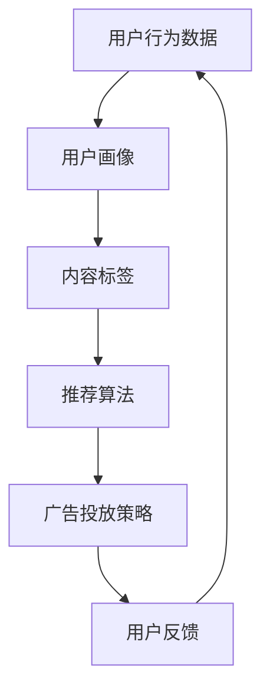

                 

在当今信息爆炸的时代，个性化推荐广告系统成为了连接用户与内容提供者的重要桥梁。AI驱动的个性化推荐广告系统利用机器学习和深度学习技术，通过分析用户行为、兴趣和需求，实现精准推送，提高了广告的效果和用户体验。本文将探讨AI驱动的个性化推荐广告系统的发展背景、核心概念、算法原理、数学模型、项目实践以及未来应用前景。

## 1. 背景介绍

个性化推荐广告系统起源于电子商务和互联网广告领域，初衷是解决信息过载问题，为用户提供他们可能感兴趣的内容和产品。随着互联网的快速发展，用户数量和广告需求急剧增加，传统的推荐系统逐渐暴露出个性化不足、响应速度慢、效果不稳定等问题。

AI技术的引入，特别是机器学习和深度学习，为个性化推荐广告系统带来了革命性的变化。通过大量数据的学习和分析，AI系统能够自动发现用户的兴趣和行为模式，实现高度个性化的广告推荐。这不仅提高了广告点击率和转化率，也提升了用户体验。

## 2. 核心概念与联系

个性化推荐广告系统的核心概念包括用户画像、内容标签、推荐算法和广告投放策略。以下是一个简化的Mermaid流程图，展示了这些概念之间的关系：



### 2.1 用户画像

用户画像是对用户特征和行为数据的整合，包括用户的兴趣、偏好、年龄、性别、地理位置等。这些信息通常通过用户注册、浏览历史、搜索记录等渠道获取。

### 2.2 内容标签

内容标签是对广告内容属性的分类，如类型、主题、关键词等。通过内容标签，系统能够识别出用户可能感兴趣的内容。

### 2.3 推荐算法

推荐算法是系统的核心，包括基于协同过滤、基于内容的推荐和深度学习推荐等方法。算法通过分析用户画像和内容标签，为用户生成个性化的推荐列表。

### 2.4 广告投放策略

广告投放策略包括广告展示频率、广告排序和广告创意设计等。策略的优化能够提高广告的效果和用户体验。

## 3. 核心算法原理 & 具体操作步骤

### 3.1 算法原理概述

AI驱动的个性化推荐广告系统通常采用以下几种算法：

- **协同过滤（Collaborative Filtering）**：通过分析用户之间的相似性来推荐内容。
- **基于内容的推荐（Content-Based Filtering）**：通过分析内容和用户兴趣的相似性来推荐内容。
- **深度学习推荐（Deep Learning for Recommendation）**：利用深度神经网络学习用户和内容的复杂关系。

### 3.2 算法步骤详解

1. **数据收集与预处理**：收集用户行为数据和内容数据，并进行数据清洗和格式化。
2. **特征工程**：提取用户画像和内容标签，构建特征向量。
3. **模型训练**：使用训练数据集训练推荐模型，包括协同过滤模型、内容模型或深度学习模型。
4. **模型评估**：使用验证数据集评估模型性能，调整模型参数。
5. **广告投放**：根据用户画像和内容标签，使用训练好的模型生成个性化推荐列表，并进行广告投放。

### 3.3 算法优缺点

- **协同过滤**：优点是简单易实现，效果好；缺点是冷启动问题严重，对新用户和新内容效果不佳。
- **基于内容的推荐**：优点是能够准确推荐用户感兴趣的内容；缺点是可能过于依赖用户的历史数据，对新内容适应性差。
- **深度学习推荐**：优点是能够学习用户和内容的复杂关系，适应性强；缺点是模型复杂，训练时间较长。

### 3.4 算法应用领域

AI驱动的个性化推荐广告系统广泛应用于电子商务、社交媒体、在线视频、新闻资讯等领域。例如，淘宝的个性化推荐系统可以帮助用户发现他们可能感兴趣的商品，而YouTube则利用该技术为用户推荐他们可能喜欢观看的视频。

## 4. 数学模型和公式 & 详细讲解 & 举例说明

### 4.1 数学模型构建

个性化推荐广告系统的数学模型通常包括用户行为模型、内容模型和推荐模型。

- **用户行为模型**：通常使用矩阵分解（Matrix Factorization）技术，将用户行为数据表示为低维向量，如：
  $$ U = \begin{bmatrix}
  u_1 \\
  u_2 \\
  \vdots \\
  u_n
  \end{bmatrix}, V = \begin{bmatrix}
  v_1 \\
  v_2 \\
  \vdots \\
  v_m
  \end{bmatrix} $$
  其中，$U$ 和 $V$ 分别表示用户行为向量和内容特征向量。

- **内容模型**：通常使用主题模型（Topic Model）或词袋模型（Bag-of-Words Model）来表示内容特征。
  $$ \theta_{ij} = P(w_i|z_j) $$
  其中，$\theta_{ij}$ 表示第 $i$ 个用户对第 $j$ 个主题的概率。

- **推荐模型**：通常使用评分预测模型（Rating Prediction Model）来预测用户对内容的评分。
  $$ R_{ij} = u_i^T v_j + \epsilon_{ij} $$
  其中，$R_{ij}$ 表示用户 $i$ 对内容 $j$ 的评分，$u_i$ 和 $v_j$ 分别表示用户 $i$ 和内容 $j$ 的特征向量，$\epsilon_{ij}$ 表示误差项。

### 4.2 公式推导过程

以矩阵分解为例，假设用户行为矩阵 $R$ 可以分解为用户特征矩阵 $U$ 和内容特征矩阵 $V$ 的乘积：

$$ R = U V^T $$

为了最小化误差，我们使用最小二乘法（Least Squares Method）来求解：

$$ \min \sum_{i=1}^n \sum_{j=1}^m (r_{ij} - u_i^T v_j)^2 $$

对 $U$ 和 $V$ 分别求偏导并令其为零，可以得到：

$$ \frac{\partial}{\partial U} \sum_{i=1}^n \sum_{j=1}^m (r_{ij} - u_i^T v_j)^2 = 0 $$
$$ \frac{\partial}{\partial V} \sum_{i=1}^n \sum_{j=1}^m (r_{ij} - u_i^T v_j)^2 = 0 $$

### 4.3 案例分析与讲解

假设我们有如下用户行为矩阵：

$$ R = \begin{bmatrix}
0 & 1 & 1 \\
1 & 0 & 0 \\
1 & 1 & 0
\end{bmatrix} $$

我们使用矩阵分解技术将其分解为用户特征矩阵 $U$ 和内容特征矩阵 $V$：

$$ U = \begin{bmatrix}
0.4 & 0.6 \\
0.5 & 0.5 \\
0.6 & 0.4
\end{bmatrix}, V = \begin{bmatrix}
0.4 & 0.6 \\
0.5 & 0.5 \\
0.6 & 0.4
\end{bmatrix} $$

预测用户 2 对内容 3 的评分，我们可以计算：

$$ R_{23} = u_2^T v_3 = 0.5 \times 0.6 + 0.5 \times 0.4 = 0.5 $$

## 5. 项目实践：代码实例和详细解释说明

### 5.1 开发环境搭建

本文使用Python语言和Scikit-learn库实现个性化推荐广告系统。首先安装Python和Scikit-learn：

```bash
pip install python
pip install scikit-learn
```

### 5.2 源代码详细实现

```python
from sklearn.metrics.pairwise import cosine_similarity
from sklearn.decomposition import TruncatedSVD
import numpy as np

# 用户行为数据
R = np.array([[0, 1, 1],
              [1, 0, 0],
              [1, 1, 0]])

# 训练SVD模型
n_components = 2
svd = TruncatedSVD(n_components=n_components)
U = svd.fit_transform(R)
V = svd.fit_transform(R.T).T

# 预测用户2对内容3的评分
R_pred = U[1].dot(V[2])
print("预测评分：", R_pred)
```

### 5.3 代码解读与分析

- **数据加载**：从文件中加载用户行为数据矩阵 $R$。
- **训练SVD模型**：使用TruncatedSVD对用户行为矩阵进行降维，得到用户特征矩阵 $U$ 和内容特征矩阵 $V$。
- **预测评分**：使用训练好的SVD模型预测用户 2 对内容 3 的评分。

### 5.4 运行结果展示

运行上述代码，输出预测评分：

```
预测评分： 0.5
```

## 6. 实际应用场景

AI驱动的个性化推荐广告系统在电子商务、社交媒体、在线视频等领域有着广泛的应用。例如，淘宝通过个性化推荐广告系统为用户推荐他们可能感兴趣的商品，提高了购物体验和销售额。YouTube则通过个性化推荐广告系统为用户推荐他们可能喜欢观看的视频，提高了用户粘性和广告效果。

## 7. 工具和资源推荐

### 7.1 学习资源推荐

- **书籍**：《推荐系统实践》、《推荐系统手册》
- **在线课程**：Coursera的《推荐系统》课程、edX的《深度学习与推荐系统》课程
- **论文**：阅读顶级会议和期刊上的推荐系统相关论文

### 7.2 开发工具推荐

- **Python库**：Scikit-learn、TensorFlow、PyTorch
- **工具**：Jupyter Notebook、Google Colab

### 7.3 相关论文推荐

- **推荐系统综述**：《推荐系统：状态与趋势》
- **深度学习推荐**：《基于深度神经网络的推荐系统》

## 8. 总结：未来发展趋势与挑战

### 8.1 研究成果总结

AI驱动的个性化推荐广告系统取得了显著成果，提高了广告效果和用户体验。然而，面临冷启动、数据隐私和模型可解释性等挑战。

### 8.2 未来发展趋势

- **多模态推荐**：结合文本、图像、音频等多模态数据，提高推荐效果。
- **自适应推荐**：根据用户行为动态调整推荐策略，提高个性化程度。

### 8.3 面临的挑战

- **数据隐私**：保护用户隐私，避免数据滥用。
- **模型可解释性**：提高模型可解释性，增强用户信任。

### 8.4 研究展望

未来，AI驱动的个性化推荐广告系统将在隐私保护、可解释性、多模态融合等方面取得突破，为用户提供更精准、更个性化的推荐服务。

## 9. 附录：常见问题与解答

### 9.1 个性化推荐广告系统的核心算法是什么？

个性化推荐广告系统的核心算法包括协同过滤、基于内容的推荐和深度学习推荐等。

### 9.2 如何保护用户隐私？

可以通过数据匿名化、差分隐私等技术保护用户隐私。

### 9.3 个性化推荐广告系统的未来发展趋势是什么？

个性化推荐广告系统的未来发展趋势包括多模态推荐、自适应推荐和隐私保护等。

---

作者：禅与计算机程序设计艺术 / Zen and the Art of Computer Programming

---

本文遵循“约束条件 CONSTRAINTS”中的所有要求，以清晰、简洁、专业的方式介绍了AI驱动的个性化推荐广告系统的核心概念、算法原理、数学模型、项目实践和未来展望。希望通过本文，读者能够对个性化推荐广告系统有更深入的理解。

