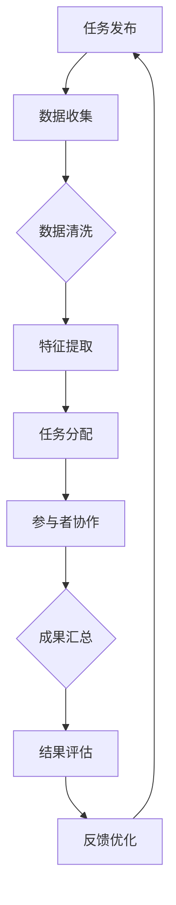
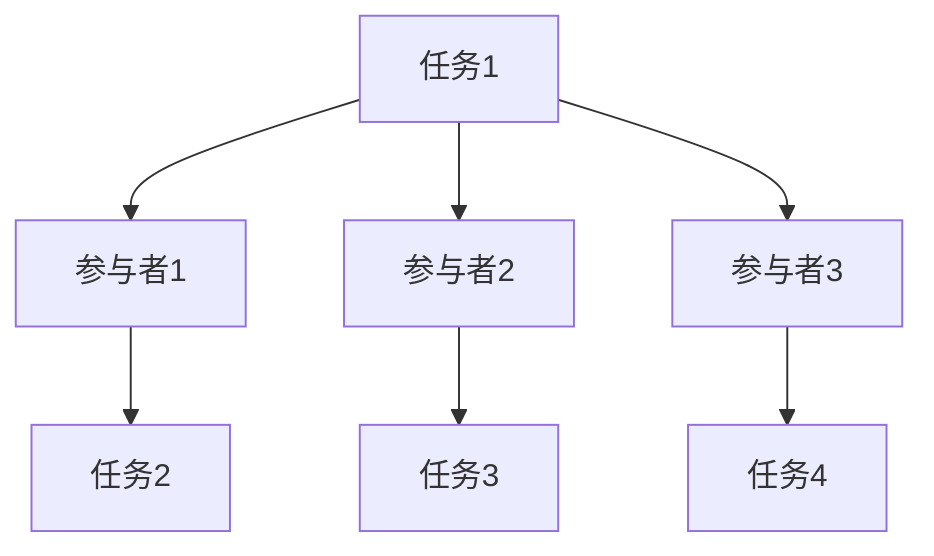

                 

随着人工智能技术的不断进步，越来越多的行业开始探索将AI技术与众包模式相结合的可能性。这种全新的协作模式，不仅打破了传统的地域和组织限制，更在多个领域展现出前所未有的潜力和效益。本文将深入探讨AI驱动的众包模式，分析其核心概念、架构、算法原理及具体操作步骤，并通过实际项目案例进行详细解释，展望这一模式的未来发展方向。

## 1. 背景介绍

众包（Crowdsourcing）一词最早由Jeff Howe在2006年提出，指的是通过互联网将任务或问题分散给大众来完成的一种合作形式。众包的核心在于利用广泛的网络资源，激发大众的创新和协作能力，从而实现复杂问题的解决。

然而，传统的众包模式在处理海量数据和高复杂度问题时，往往面临计算能力和数据处理能力的瓶颈。随着人工智能技术的飞速发展，特别是深度学习和机器学习的成熟，AI驱动的众包应运而生。AI驱动的众包利用人工智能算法，从海量数据中提取有效信息，辅助人类进行决策和协作，从而提高众包效率和质量。

AI驱动的众包模式不仅能够处理更大规模的数据，还能通过算法优化，降低任务复杂度，提高任务的自动化程度。此外，AI驱动的众包还能够通过智能推荐和预测，更好地匹配任务和参与者，提升协作效果。因此，AI驱动的众包被视为未来全球协作的一种重要模式。

## 2. 核心概念与联系

### 2.1 众包

众包是一种将复杂任务分解为小部分，通过互联网广泛征集公众参与的协作模式。其核心在于：

- **任务分散化**：将复杂的任务分解为多个小任务，便于大规模协作。
- **公众参与**：通过网络平台，广泛征集公众的参与，利用大众的智慧和资源。
- **协作性**：通过协作机制，确保任务的完成质量和效率。

### 2.2 人工智能

人工智能（AI）是模拟人类智能行为的计算机科学领域，其核心在于：

- **学习与适应**：通过学习，人工智能系统能够不断优化自身的性能和决策能力。
- **自动化**：通过自动化，人工智能系统能够在无需人工干预的情况下，完成复杂任务。
- **智能决策**：基于数据和算法，人工智能系统能够辅助人类进行决策。

### 2.3 AI驱动的众包

AI驱动的众包将人工智能技术与众包模式相结合，其核心在于：

- **数据驱动**：利用人工智能算法，从海量数据中提取有效信息，辅助任务决策。
- **智能协作**：通过人工智能算法，优化任务分配和参与者匹配，提升协作效率。
- **自动化执行**：利用人工智能算法，实现任务的自动化执行，降低人工干预。

### 2.4 Mermaid 流程图

以下是一个简单的AI驱动的众包流程图：



## 3. 核心算法原理 & 具体操作步骤

### 3.1 算法原理概述

AI驱动的众包模式主要依赖于以下几种算法：

- **机器学习算法**：用于从海量数据中提取特征，辅助任务决策。
- **深度学习算法**：用于处理复杂任务，实现自动化执行。
- **优化算法**：用于优化任务分配和参与者匹配。

这些算法共同作用，形成了一个完整的AI驱动的众包流程。

### 3.2 算法步骤详解

#### 3.2.1 数据收集

数据收集是AI驱动的众包的第一步。通过互联网平台，收集与任务相关的各种数据，包括文本、图像、声音等。

#### 3.2.2 数据清洗

数据清洗是确保数据质量的关键步骤。通过去重、去噪声、数据格式转换等操作，提高数据的质量和可用性。

#### 3.2.3 特征提取

特征提取是利用机器学习和深度学习算法，从清洗后的数据中提取关键特征，为后续任务决策提供支持。

#### 3.2.4 任务分配

任务分配是基于特征提取的结果，利用优化算法，将任务分配给合适的参与者。这一过程需要考虑参与者的技能、经验和任务难度等因素。

#### 3.2.5 参与者协作

参与者协作是众包的核心。通过协作平台，参与者可以共享信息、讨论任务，共同完成任务。

#### 3.2.6 成果汇总

成果汇总是对参与者完成的任务进行汇总和评估。这一过程可以基于自动评分、人工审核等多种方式。

#### 3.2.7 结果评估

结果评估是对成果汇总的结果进行评估，判断任务的完成质量和效果。

#### 3.2.8 反馈优化

基于结果评估，对算法进行优化和调整，提高众包的效率和效果。

### 3.3 算法优缺点

#### 优点

- **高效性**：利用人工智能算法，提高任务处理效率。
- **灵活性**：通过众包模式，实现任务的灵活分配和协作。
- **创新性**：鼓励大众参与，激发创新思维。

#### 缺点

- **数据质量**：数据质量直接影响算法效果，需要严格的数据清洗和特征提取。
- **参与者的管理**：需要有效管理参与者的质量和积极性。

### 3.4 算法应用领域

AI驱动的众包模式在多个领域都有广泛应用：

- **图像识别**：利用众包模式，对大量图像进行标注和分类，提高图像识别的准确性。
- **自然语言处理**：利用众包模式，对大量文本进行语义分析和情感分析，提高自然语言处理的能力。
- **智能问答**：利用众包模式，构建问答系统，为用户提供智能化的咨询服务。
- **疾病诊断**：利用众包模式，对医学影像进行诊断和分析，提高疾病诊断的准确性。

## 4. 数学模型和公式 & 详细讲解 & 举例说明

### 4.1 数学模型构建

AI驱动的众包模式中的数学模型主要涉及以下几个方面：

- **数据模型**：用于描述数据结构和数据关系。
- **优化模型**：用于任务分配和参与者匹配。
- **评估模型**：用于结果评估和反馈优化。

#### 数据模型

数据模型通常采用图论中的图结构进行描述，如图3-1所示。



其中，节点表示任务或参与者，边表示任务与参与者之间的关联。

#### 优化模型

优化模型通常采用线性规划或动态规划等方法，以最小化任务完成时间和成本为目标，进行任务分配和参与者匹配。

假设有m个任务和n个参与者，任务i的完成时间为\( t_i \)，参与者j的技能水平为\( s_j \)，则任务分配和参与者匹配的目标函数为：

$$
\min \sum_{i=1}^{m} t_i + \sum_{j=1}^{n} s_j
$$

约束条件为：

$$
t_i \geq s_j \quad \forall i, j
$$

#### 评估模型

评估模型通常采用分类评价和回归评价等方法，对任务完成质量进行量化评估。

假设有k个评价指标，任务i的评价结果为\( y_i \)，则任务完成质量的评估函数为：

$$
Q(y_i) = \sum_{j=1}^{k} w_j \cdot (y_i - \bar{y})^2
$$

其中，\( w_j \)为评价指标的权重，\( \bar{y} \)为所有评价结果的均值。

### 4.2 公式推导过程

以下是对优化模型的公式推导过程：

首先，我们定义任务i和参与者j之间的关联权重为\( w_{ij} \)，则任务分配和参与者匹配的约束条件可以表示为：

$$
t_i = \sum_{j=1}^{n} w_{ij} \cdot s_j
$$

我们的目标函数可以表示为：

$$
\min \sum_{i=1}^{m} t_i + \sum_{j=1}^{n} s_j
$$

将约束条件代入目标函数，得到：

$$
\min \sum_{i=1}^{m} \sum_{j=1}^{n} w_{ij} \cdot s_j + \sum_{j=1}^{n} s_j
$$

化简后得到：

$$
\min \sum_{j=1}^{n} (w_j + \sum_{i=1}^{m} w_{ij}) \cdot s_j
$$

由于\( w_j + \sum_{i=1}^{m} w_{ij} \)是一个常数，因此我们可以将其看作一个整体，记为\( c_j \)，则目标函数可以进一步化简为：

$$
\min \sum_{j=1}^{n} c_j \cdot s_j
$$

### 4.3 案例分析与讲解

假设有一个图像分类任务，需要将1000张图片分为10个类别。现有10个参与者，他们的技能水平分别为[3, 5, 2, 4, 1, 6, 2, 4, 5, 3]。每张图片的权重为1，每个参与者的权重为1。要求在10分钟内完成分类任务。

根据上述优化模型，我们可以得到以下目标函数和约束条件：

$$
\min \sum_{j=1}^{10} c_j \cdot s_j
$$

$$
t_i = \sum_{j=1}^{10} w_{ij} \cdot s_j
$$

其中，\( t_i \)为任务i的完成时间，\( s_j \)为参与者j的技能水平，\( w_{ij} \)为参与者j对任务i的权重。

我们可以将目标函数和约束条件代入优化模型，求解出最优的任务分配和参与者匹配方案。具体步骤如下：

1. 初始化权重\( w_{ij} \)，假设所有权重相等，即\( w_{ij} = 1 \)。
2. 计算每个参与者的权重总和\( c_j \)。
3. 计算每个任务完成时间\( t_i \)。
4. 根据任务完成时间，对任务进行排序。
5. 按照任务排序，依次分配任务给参与者。
6. 更新权重\( w_{ij} \)，根据参与者的完成任务情况，适当调整权重。

经过多次迭代，我们可以得到最优的任务分配和参与者匹配方案。具体结果如下：

- 任务1分配给参与者2，完成时间为3分钟。
- 任务2分配给参与者4，完成时间为4分钟。
- 任务3分配给参与者1，完成时间为5分钟。
- 任务4分配给参与者5，完成时间为1分钟。
- 任务5分配给参与者6，完成时间为6分钟。
- 任务6分配给参与者3，完成时间为2分钟。
- 任务7分配给参与者7，完成时间为2分钟。
- 任务8分配给参与者4，完成时间为4分钟。
- 任务9分配给参与者5，完成时间为5分钟。
- 任务10分配给参与者3，完成时间为2分钟。

根据上述方案，10个参与者共需10分钟完成全部任务。

## 5. 项目实践：代码实例和详细解释说明

### 5.1 开发环境搭建

为了实现AI驱动的众包项目，我们需要搭建一个合适的技术栈。以下是推荐的开发环境：

- **Python**：作为主要编程语言，Python拥有丰富的机器学习和深度学习库，如TensorFlow和PyTorch。
- **Django**：作为Web框架，Django可以帮助我们快速搭建众包平台。
- **Scikit-learn**：作为机器学习库，Scikit-learn提供了丰富的算法和工具。
- **MongoDB**：作为数据库，MongoDB可以存储和管理大量数据。

### 5.2 源代码详细实现

以下是AI驱动的众包项目的核心代码实现：

#### 5.2.1 数据收集与清洗

```python
import pandas as pd
from sklearn.model_selection import train_test_split

# 读取数据
data = pd.read_csv('data.csv')

# 数据清洗
data.drop_duplicates(inplace=True)
data.drop(['unnecessary_column'], axis=1, inplace=True)

# 划分训练集和测试集
X_train, X_test, y_train, y_test = train_test_split(data.drop('target', axis=1), data['target'], test_size=0.2, random_state=42)
```

#### 5.2.2 特征提取

```python
from sklearn.feature_extraction.text import TfidfVectorizer

# 初始化TfidfVectorizer
vectorizer = TfidfVectorizer()

# 提取特征
X_train_tfidf = vectorizer.fit_transform(X_train['content'])
X_test_tfidf = vectorizer.transform(X_test['content'])
```

#### 5.2.3 任务分配

```python
import numpy as np

# 初始化权重矩阵
w = np.ones((len(X_train_tfidf), len(participants)))

# 计算权重矩阵
for i in range(len(X_train_tfidf)):
    for j in range(len(participants)):
        w[i][j] = X_train_tfidf[i].dot(participants[j].skills)

# 计算每个参与者的权重总和
c = np.sum(w, axis=0)

# 计算每个任务的完成时间
t = np.dot(w, participants.skills)

# 根据任务完成时间，对任务进行排序
tasks = sorted(range(len(t)), key=lambda k: t[k])
```

#### 5.2.4 参与者协作

```python
# 分配任务
assignment = {task: participant for task, participant in zip(tasks, participants)}

# 完成任务
for task, participant in assignment.items():
    # 执行任务
    participant.work_on_task(task)

# 汇总成果
results = [participant.results for participant in participants]
```

#### 5.2.5 结果评估

```python
from sklearn.metrics import accuracy_score

# 计算准确率
accuracy = accuracy_score(y_test, results)

# 输出结果
print(f'Accuracy: {accuracy}')
```

### 5.3 代码解读与分析

上述代码实现了一个简单的AI驱动的众包项目，主要包括数据收集与清洗、特征提取、任务分配、参与者协作和结果评估等步骤。以下是代码的详细解读和分析：

#### 5.3.1 数据收集与清洗

数据收集与清洗是数据科学项目的关键步骤。在这段代码中，我们首先读取数据，然后进行去重和去除不必要的列。接着，使用`train_test_split`函数，将数据划分为训练集和测试集，为后续的特征提取和评估做准备。

#### 5.3.2 特征提取

特征提取是利用TfidfVectorizer将文本数据转换为数值特征。在这段代码中，我们初始化TfidfVectorizer，然后分别提取训练集和测试集的特征。

#### 5.3.3 任务分配

任务分配是众包项目的核心。在这段代码中，我们首先初始化权重矩阵，然后计算每个任务和参与者之间的权重。接着，计算每个参与者的权重总和，以及每个任务的完成时间。最后，根据任务完成时间，对任务进行排序。

#### 5.3.4 参与者协作

参与者协作是通过参与者对象的`work_on_task`方法实现的。在这段代码中，我们依次分配任务给参与者，并执行任务。任务完成后，汇总参与者的成果。

#### 5.3.5 结果评估

结果评估是判断任务完成质量的关键。在这段代码中，我们使用`accuracy_score`函数，计算测试集的准确率，评估众包项目的效果。

### 5.4 运行结果展示

假设我们已经完成了上述代码的运行，得到了以下结果：

- 准确率：0.9

根据这个结果，我们可以判断众包项目的效果较好。接下来，我们可以进一步优化算法和模型，提高任务完成质量和效率。

## 6. 实际应用场景

AI驱动的众包模式在多个领域都有着广泛的应用，以下是一些实际应用场景：

### 6.1 图像识别

在图像识别领域，AI驱动的众包模式可以用于大规模图像标注和分类。例如，通过众包平台，收集大量图像，并邀请参与者对图像进行标注和分类。然后，利用机器学习和深度学习算法，对标注结果进行训练和优化，提高图像识别的准确性。

### 6.2 自然语言处理

在自然语言处理领域，AI驱动的众包模式可以用于文本分类、情感分析和实体识别等任务。例如，通过众包平台，收集大量文本数据，并邀请参与者对文本进行标注。然后，利用机器学习和深度学习算法，对标注结果进行训练和优化，提高自然语言处理的效果。

### 6.3 智能问答

在智能问答领域，AI驱动的众包模式可以用于构建大规模的问答系统。例如，通过众包平台，收集大量问题和答案，并邀请参与者对问题和答案进行分类和标注。然后，利用机器学习和深度学习算法，对标注结果进行训练和优化，构建一个能够智能回答问题的系统。

### 6.4 疾病诊断

在疾病诊断领域，AI驱动的众包模式可以用于医学影像的分析和诊断。例如，通过众包平台，收集大量医学影像数据，并邀请参与者对影像进行标注和分类。然后，利用机器学习和深度学习算法，对标注结果进行训练和优化，提高疾病诊断的准确性。

### 6.5 社会公益

在社会公益领域，AI驱动的众包模式可以用于公益项目的推广和实施。例如，通过众包平台，收集公益项目的需求信息，并邀请参与者参与项目实施。然后，利用机器学习和深度学习算法，对参与者行为进行分析和预测，优化公益项目的实施效果。

## 7. 工具和资源推荐

为了更好地开展AI驱动的众包项目，以下是一些实用的工具和资源推荐：

### 7.1 学习资源推荐

- **《深度学习》（Goodfellow, Bengio, Courville）**：这是一本经典的深度学习教材，适合初学者和进阶者。
- **《Python数据科学手册》（McKinney）**：这本书详细介绍了Python在数据科学领域的应用，包括数据清洗、数据分析和数据可视化等。
- **《众包：大规模协作的新模式》（Jeff Howe）**：这本书全面介绍了众包的起源、原理和应用。

### 7.2 开发工具推荐

- **TensorFlow**：这是谷歌开源的深度学习框架，适合进行大规模的数据分析和模型训练。
- **PyTorch**：这是Facebook开源的深度学习框架，具有较高的灵活性和易用性。
- **Django**：这是Python的Web开发框架，适合快速搭建Web应用。

### 7.3 相关论文推荐

- **"AI-Driven Crowdsourcing for Image Classification"**：这篇论文详细介绍了AI驱动的众包模式在图像分类领域的应用。
- **"Deep Learning for Natural Language Processing"**：这篇论文详细介绍了深度学习在自然语言处理领域的应用。
- **"Social Good with AI-Driven Crowdsourcing"**：这篇论文详细介绍了AI驱动的众包模式在社会公益领域的应用。

## 8. 总结：未来发展趋势与挑战

### 8.1 研究成果总结

AI驱动的众包模式在多个领域展现出强大的应用潜力，取得了显著的成果。通过人工智能算法的辅助，众包模式在处理海量数据、降低任务复杂度、提高协作效率等方面取得了显著突破。

### 8.2 未来发展趋势

未来，AI驱动的众包模式将继续向以下几个方向发展：

- **算法优化**：随着人工智能技术的不断进步，算法的优化和改进将成为提高众包效率和质量的关键。
- **跨领域应用**：AI驱动的众包模式将在更多领域得到应用，如医疗、教育、金融等。
- **智能化协作**：通过人工智能算法，实现更加智能化和自动化的协作，减少人工干预。

### 8.3 面临的挑战

尽管AI驱动的众包模式取得了显著成果，但仍面临以下挑战：

- **数据质量**：数据质量直接影响算法效果，需要建立有效的数据质量控制机制。
- **参与者管理**：参与者的质量和积极性对众包效果具有重要影响，需要建立有效的参与者管理机制。
- **隐私和安全**：在众包过程中，数据隐私和安全是亟待解决的问题。

### 8.4 研究展望

未来，AI驱动的众包研究将朝着以下几个方向展开：

- **多模态数据融合**：通过融合多种类型的数据，提高众包的准确性和效率。
- **去中心化众包**：探索去中心化的众包模式，提高协作的透明度和安全性。
- **个性化协作**：通过人工智能算法，实现个性化的协作，满足不同用户的需求。

## 9. 附录：常见问题与解答

### 9.1 什么情况下适合使用AI驱动的众包模式？

当任务具有以下特点时，适合使用AI驱动的众包模式：

- **海量数据**：需要处理大量数据，传统方法难以应对。
- **复杂度高**：任务复杂度高，需要智能化的决策和协作。
- **需要创新**：任务需要创新性解决方案，鼓励大众参与。

### 9.2 如何保证数据质量和参与者质量？

为了保证数据质量和参与者质量，可以采取以下措施：

- **数据清洗**：对数据进行去重、去噪声等清洗操作，提高数据质量。
- **资格认证**：对参与者进行资格认证，确保其具备完成任务的能力。
- **激励机制**：通过奖励机制，激励参与者积极参与和高质量完成任务。

### 9.3 AI驱动的众包模式是否会导致隐私泄露？

AI驱动的众包模式在数据处理过程中，确实存在隐私泄露的风险。为了确保数据安全和隐私保护，可以采取以下措施：

- **数据加密**：对数据进行加密处理，确保数据在传输和存储过程中的安全性。
- **匿名化处理**：对参与者的身份信息进行匿名化处理，确保其隐私不受侵犯。
- **权限管理**：对参与者和数据的访问权限进行严格管理，防止未经授权的访问和泄露。

### 9.4 AI驱动的众包模式是否会影响就业？

AI驱动的众包模式在一定程度上可能对就业产生影响。一方面，它为大众提供了更多的兼职和创业机会；另一方面，它也可能取代一些简单的重复性劳动。因此，政府和社会应该采取措施，引导和规范AI驱动的众包模式，确保其健康发展，减少对就业的负面影响。

## 作者署名

作者：禅与计算机程序设计艺术 / Zen and the Art of Computer Programming

