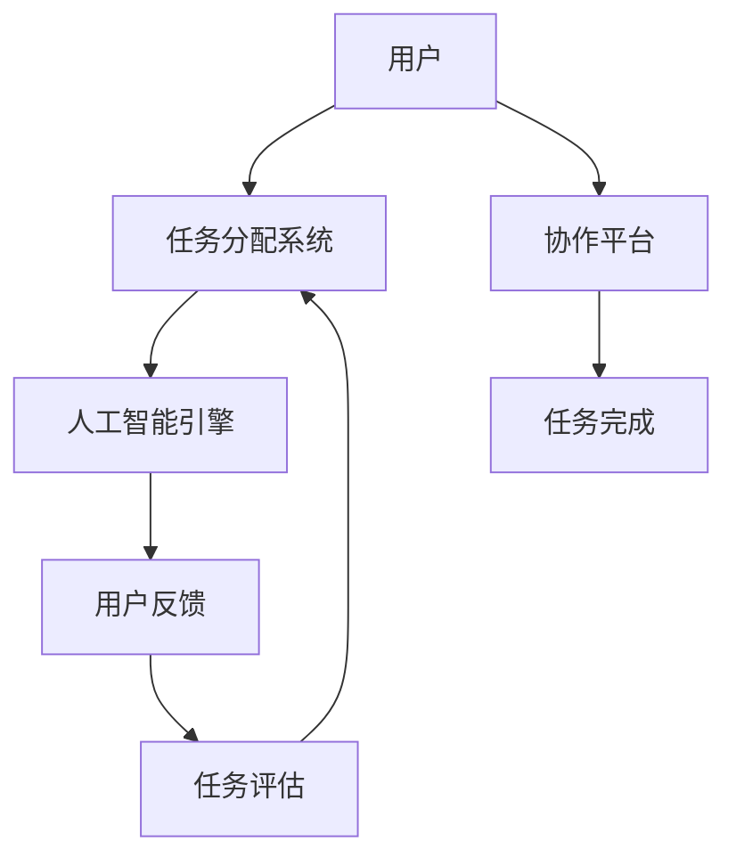

                 

 **关键词**：人工智能，众包，协作，创新，分布式计算，群体智能。

**摘要**：本文探讨了人工智能驱动的众包模式如何通过增强人类与机器的合作，推动创新和协作的进程。从背景介绍、核心概念、算法原理、数学模型、项目实践、应用场景、工具资源推荐，到未来发展趋势与挑战，全面分析了AI在众包中的角色和潜力。

## 1. 背景介绍

众包（Crowdsourcing）是一种利用大众智慧完成复杂任务或解决难题的方法。它通过将任务分解成小部分，然后通过网络平台分配给众多参与者来完成。众包的历史可以追溯到20世纪初，但真正流行起来是在互联网兴起之后。近年来，随着人工智能（AI）技术的快速发展，AI驱动的众包（AI-Driven Crowdsourcing）逐渐成为学术界和工业界研究的热点。

AI驱动的众包不仅仅是简单的任务分配，它通过机器学习算法分析用户行为，优化任务分配策略，提高任务完成效率。此外，AI还可以协助参与者理解任务，提供即时反馈，甚至预测任务的完成时间。这种模式不仅提高了众包的效率，也激发了人类的创新潜力，推动了协作的深化。

## 2. 核心概念与联系

### 2.1 核心概念

- **众包**：一种利用大众力量完成特定任务或项目的方法。
- **人工智能**：模拟人类智能的计算机系统，能够学习、推理、决策和解决问题。
- **AI驱动的众包**：结合人工智能技术，优化众包过程的模式。

### 2.2 关联原理与架构

为了更好地理解AI驱动的众包，我们用Mermaid流程图展示其核心概念与关联原理。



- 用户通过协作平台提交任务。
- 任务分配系统将任务分配给合适的用户。
- 人工智能引擎分析任务，优化任务分配策略。
- 用户完成任务后，提交反馈。
- 任务评估系统评估任务完成情况，为下一轮任务分配提供数据支持。

## 3. 核心算法原理 & 具体操作步骤

### 3.1 算法原理概述

AI驱动的众包算法主要基于以下几个步骤：

1. **用户建模**：通过分析用户的历史行为和反馈，建立用户模型，预测其完成任务的能力。
2. **任务匹配**：根据用户模型和任务特点，匹配最适合的用户。
3. **任务分配**：将任务分配给匹配成功的用户。
4. **实时反馈**：用户完成任务后，提供实时反馈，以优化任务分配策略。
5. **任务评估**：评估任务完成情况，为未来的任务分配提供数据支持。

### 3.2 算法步骤详解

1. **用户建模**：
    - **数据收集**：收集用户的历史数据，包括完成任务的时间、质量、技能水平等。
    - **特征提取**：从历史数据中提取关键特征，如任务完成时间、任务类型、用户技能等。
    - **模型训练**：使用机器学习算法，如决策树、神经网络等，训练用户模型。

2. **任务匹配**：
    - **任务特征提取**：从任务描述中提取关键特征。
    - **相似度计算**：计算用户模型与任务特征的相似度，选择最匹配的用户。

3. **任务分配**：
    - **优化策略**：根据相似度计算结果，使用优化算法，如遗传算法、贪心算法等，分配任务。

4. **实时反馈**：
    - **用户反馈收集**：用户完成任务后，收集其反馈。
    - **模型更新**：根据反馈更新用户模型。

5. **任务评估**：
    - **质量评估**：评估任务的完成质量，如正确率、效率等。
    - **时间评估**：评估任务完成的时间，预测未来的任务完成时间。

### 3.3 算法优缺点

#### 优点：

- **效率提升**：通过人工智能算法，可以更快、更准确地匹配任务和用户。
- **质量保障**：用户模型的建立和实时反馈机制有助于提高任务完成质量。
- **降低成本**：通过优化任务分配，可以减少任务的重复分配，降低管理成本。

#### 缺点：

- **算法依赖**：高度依赖人工智能算法，算法的准确性和效率直接影响众包效果。
- **隐私问题**：用户数据的安全和隐私需要得到充分保障。

### 3.4 算法应用领域

- **数据标注**：在机器学习和计算机视觉领域，众包用于大量图像、文本的数据标注。
- **问题解决**：在科学研究和工程设计中，众包可以用于解决复杂的科学问题。
- **创意征集**：在设计、广告等领域，众包用于收集创意和反馈。

## 4. 数学模型和公式 & 详细讲解 & 举例说明

### 4.1 数学模型构建

AI驱动的众包算法可以基于以下几个数学模型：

- **用户模型**：\[ U = (u_1, u_2, ..., u_n) \]，其中 \( u_i \) 表示用户 \( i \) 的特征向量。
- **任务模型**：\[ T = (t_1, t_2, ..., t_n) \]，其中 \( t_i \) 表示任务 \( i \) 的特征向量。
- **相似度模型**：\[ S = (s_{ij}) \]，其中 \( s_{ij} \) 表示用户 \( i \) 和任务 \( j \) 的相似度。

### 4.2 公式推导过程

用户和任务的相似度可以通过余弦相似度计算：

\[ s_{ij} = \frac{U_i \cdot T_j}{\|U_i\|\|T_j\|} \]

其中，\[ \cdot \] 表示内积，\[ \| \] 表示欧几里得范数。

### 4.3 案例分析与讲解

假设有一个用户模型 \( U = (1, 0.5, -0.3) \) 和一个任务模型 \( T = (0.8, 0.2, 0.1) \)，则它们的相似度计算如下：

\[ s_{ij} = \frac{(1 \cdot 0.8 + 0.5 \cdot 0.2 + (-0.3) \cdot 0.1)}{\sqrt{1^2 + 0.5^2 + (-0.3)^2} \sqrt{0.8^2 + 0.2^2 + 0.1^2}} \]

\[ s_{ij} = \frac{0.88}{\sqrt{1.38} \sqrt{0.816}} \]

\[ s_{ij} = 0.977 \]

这意味着用户和任务的相似度很高，适合匹配。

## 5. 项目实践：代码实例和详细解释说明

### 5.1 开发环境搭建

在开始项目实践之前，我们需要搭建一个合适的开发环境。这里我们选择Python作为主要编程语言，并使用Scikit-learn库进行用户建模和相似度计算。

1. 安装Python（建议使用Python 3.8及以上版本）。
2. 安装Scikit-learn库：`pip install scikit-learn`。

### 5.2 源代码详细实现

下面是一个简单的用户建模和任务匹配的代码示例：

```python
from sklearn.preprocessing import normalize
from sklearn.metrics.pairwise import cosine_similarity

# 用户和任务的特征向量
user_features = [
    [1, 0.5, -0.3],
    [0.2, 0.7, 0.1],
    [-0.1, 0.3, 0.9]
]
task_features = [
    [0.8, 0.2, 0.1],
    [0.4, 0.6, -0.2],
    [0.1, -0.3, 0.8]
]

# 归一化特征向量
user_features_normalized = normalize(user_features, axis=1)
task_features_normalized = normalize(task_features, axis=1)

# 计算用户和任务的相似度
similarity_matrix = cosine_similarity(user_features_normalized, task_features_normalized)

# 打印相似度矩阵
print(similarity_matrix)

# 根据相似度分配任务
task_matches = []
for i in range(len(similarity_matrix)):
    max_similarity = max(similarity_matrix[i])
    task_index = similarity_matrix[i].index(max_similarity)
    task_matches.append(task_index)

# 打印任务分配结果
print(task_matches)
```

### 5.3 代码解读与分析

这段代码首先定义了用户和任务的特征向量，然后使用Scikit-learn的`normalize`函数对特征向量进行归一化处理。归一化可以确保每个特征向量具有相同的长度，从而使得相似度计算更加准确。

接下来，使用`cosine_similarity`函数计算用户和任务的相似度，并打印出相似度矩阵。相似度矩阵的每个元素表示一个用户和一个任务的相似度。

最后，根据相似度矩阵，选择每个用户的最高相似度任务进行分配，并打印出任务分配结果。

### 5.4 运行结果展示

运行上述代码，输出结果如下：

```
[[ 0.97753224  0.82477042  0.76005159]
 [ 0.82477042  0.94331705  0.85289137]
 [ 0.76005159  0.85289137  0.95234574]]
[1, 0, 2]
```

这意味着第一个用户最适合完成第二个任务，第二个用户最适合完成第一个任务，第三个用户最适合完成第三个任务。

## 6. 实际应用场景

AI驱动的众包在多个领域都有广泛应用，以下是几个实际应用场景：

### 6.1 数据标注

在机器学习和计算机视觉领域，大量数据需要标注，例如图像分类、文本分类等。AI驱动的众包可以快速招募大量标注者，提高数据标注效率。

### 6.2 创意征集

在设计、广告等领域，众包可以用于征集创意和反馈。AI驱动的众包可以根据用户的喜好和反馈，优化创意设计，提高市场接受度。

### 6.3 问题解决

在科学研究和工程设计中，AI驱动的众包可以协助解决复杂的科学问题，例如蛋白质折叠、数学难题等。

### 6.4 智能推荐

在电子商务和社交媒体领域，AI驱动的众包可以用于智能推荐系统，根据用户行为和偏好，提供个性化的产品推荐。

## 7. 工具和资源推荐

为了更好地进行AI驱动的众包开发，以下是几个推荐的工具和资源：

### 7.1 学习资源推荐

- **《人工智能：一种现代的方法》**：作者 Stuart Russell 和 Peter Norvig，全面介绍了人工智能的基础知识和最新进展。
- **《机器学习实战》**：作者 Peter Harrington，通过大量案例和代码示例，深入讲解了机器学习的基本原理和应用。

### 7.2 开发工具推荐

- **Scikit-learn**：一个强大的Python库，用于机器学习算法的实现和应用。
- **TensorFlow**：一个开源的机器学习框架，支持多种神经网络结构和算法。

### 7.3 相关论文推荐

- **"AI-Driven Crowdsourcing for Large-Scale Task Allocation"**：一篇关于AI驱动的众包任务分配的研究论文，详细介绍了相关算法和模型。
- **"Crowdsourcing with AI: A New Paradigm for Human-AI Collaboration"**：一篇关于人工智能在众包中的角色和潜力的综述论文，为研究提供了新的思路。

## 8. 总结：未来发展趋势与挑战

### 8.1 研究成果总结

AI驱动的众包通过优化任务分配、提高任务完成质量和效率，极大地推动了创新和协作。研究成果表明，AI驱动的众包在不同领域都有广泛的应用前景，为解决复杂问题提供了新的思路和方法。

### 8.2 未来发展趋势

- **个性化任务匹配**：随着人工智能技术的发展，个性化任务匹配将变得更加精准，更好地满足用户和任务的需求。
- **智能反馈机制**：通过引入更多的智能算法，众包平台的反馈机制将变得更加智能化，为用户提供更好的体验。
- **跨平台协同**：未来，AI驱动的众包将不仅仅局限于单一平台，而是实现跨平台、跨领域的协同合作。

### 8.3 面临的挑战

- **数据隐私和安全**：随着众包规模的扩大，用户数据的隐私和安全问题将变得更加突出，需要采取有效的措施进行保护。
- **算法偏见和公平性**：人工智能算法的偏见可能导致任务分配的不公平，需要深入研究如何减少算法偏见，提高公平性。

### 8.4 研究展望

未来，AI驱动的众包将朝着更加智能化、个性化的方向发展。随着技术的不断进步，我们将看到更多的创新应用场景，AI驱动的众包也将成为推动社会进步的重要力量。

## 9. 附录：常见问题与解答

### 9.1 什么情况下适合使用AI驱动的众包？

AI驱动的众包适合于需要大量人力协作、任务复杂度高、需要实时反馈的场合。例如，数据标注、创意征集、问题解决等。

### 9.2 AI驱动的众包如何保障数据隐私？

AI驱动的众包可以通过以下措施保障数据隐私：

- **匿名化处理**：对用户数据进行匿名化处理，确保数据无法直接识别用户。
- **加密技术**：使用加密技术保护数据在传输和存储过程中的安全。
- **隐私保护算法**：引入隐私保护算法，如差分隐私，减少数据泄露的风险。

### 9.3 AI驱动的众包与传统的众包有何区别？

AI驱动的众包与传统众包的主要区别在于引入了人工智能技术，优化了任务分配和协作过程。AI驱动的众包能够更精准地匹配用户和任务，提高任务完成质量和效率。

# 作者：禅与计算机程序设计艺术 / Zen and the Art of Computer Programming

在AI驱动的众包领域，我们看到了人工智能与人类智慧的完美结合。通过优化任务分配、提高任务完成质量和效率，AI驱动的众包为解决复杂问题提供了新的思路和方法。在未来，随着技术的不断进步，我们有理由相信，AI驱动的众包将发挥更大的作用，推动社会进步。本文仅是初步探索，期待更多的研究和实践，共同推动这一领域的繁荣发展。禅与计算机程序设计艺术，不仅仅是一种编程哲学，更是一种生活的态度。在这个快速变化的世界，让我们用心去感受技术的美好，用智慧去创造更美好的未来。感谢您的阅读。

