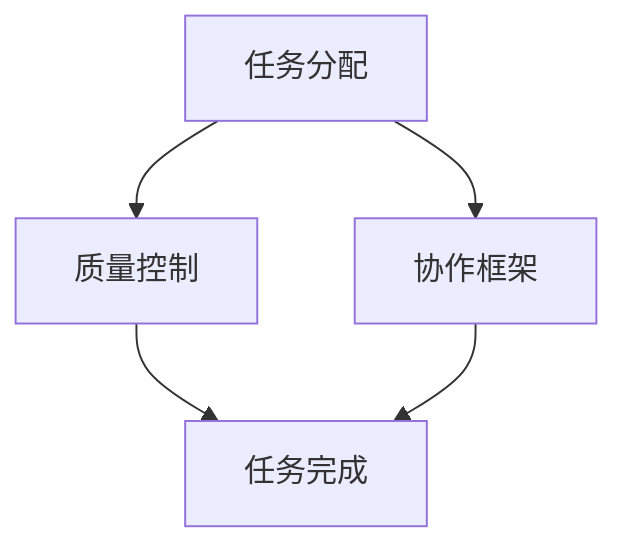

                 

 在当今快速发展的技术时代，人工智能（AI）的兴起不仅改变了传统的工作方式，也在推动新的创新模式。众包作为一种开放式的创新模式，通过将任务外包给广泛的参与者，实现了资源的高效利用和创新的快速迭代。本文将探讨如何通过AI技术驱动众包，从而增强创新和协作。

## 关键词

- 人工智能
- 众包
- 创新
- 协作
- 数据分析
- 自然语言处理
- 图神经网络

## 摘要

本文首先介绍了人工智能和众包的基本概念及其在现代科技发展中的重要性。接着，我们探讨了如何利用AI技术优化众包流程，包括任务分配、质量控制、协作提升等方面。随后，通过具体实例展示了AI驱动的众包在实际应用中的效果。最后，我们展望了AI驱动的众包在未来可能的发展方向和面临的挑战。

## 1. 背景介绍

### 人工智能

人工智能（AI）是指计算机系统通过模拟人类智能行为来实现特定任务的科学技术。AI技术包括机器学习、深度学习、自然语言处理、计算机视觉等多个领域，这些技术的应用极大地提高了计算机系统的智能水平和处理能力。

### 众包

众包是一种通过互联网平台，将任务分配给广泛参与者进行协作完成的工作模式。众包的典型特点是其开放性、多样性和灵活性。参与者可以来自任何地点，任何背景，通过协作完成任务，实现资源的高效利用和创新的快速迭代。

### 人工智能与众包的结合

随着AI技术的发展，众包模式得到了进一步的优化和扩展。AI技术能够帮助众包平台更好地进行任务分配、质量控制、协作提升等，从而提升整体效率和创新性。

## 2. 核心概念与联系

在探讨AI驱动的众包时，我们需要理解几个核心概念：

- **任务分配算法**：如何将任务合理地分配给众包平台上的参与者。
- **质量控制机制**：如何确保任务完成的质量。
- **协作框架**：如何促进参与者在任务完成过程中的有效协作。

以下是一个简单的 Mermaid 流程图，展示了这些核心概念的相互关系：



### 2.1 任务分配算法

任务分配算法是AI驱动的众包的核心，它决定了任务如何被分配给最合适的参与者。常用的任务分配算法包括：

- **基于技能的分配**：根据参与者的技能和经验进行任务分配。
- **基于社交网络的分配**：利用社交网络关系进行任务推荐。
- **基于历史数据的分配**：根据参与者以往完成任务的表现进行分配。

### 2.2 质量控制机制

质量控制机制旨在确保众包任务完成的质量。AI技术可以通过以下方式提升质量控制：

- **自动评估**：利用机器学习算法对任务结果进行自动评估。
- **反馈机制**：建立反馈机制，让参与者对任务完成情况进行评价，从而不断优化任务分配和质量控制。
- **多级审核**：采用多级审核机制，确保任务结果的准确性。

### 2.3 协作框架

协作框架是促进参与者有效协作的基础。AI技术可以通过以下方式提升协作：

- **智能推荐**：根据参与者的兴趣、技能和任务需求进行推荐。
- **协作平台**：建立智能化的协作平台，提供实时沟通和资源共享。
- **协作分析**：利用数据分析技术，分析协作过程中的问题，并提出改进建议。

## 3. 核心算法原理 & 具体操作步骤

### 3.1 算法原理概述

AI驱动的众包核心算法主要包括：

- **任务分配算法**：使用图神经网络进行任务分配。
- **质量控制算法**：基于深度学习模型的自动评估机制。
- **协作框架算法**：利用自然语言处理技术进行智能推荐和协作分析。

### 3.2 算法步骤详解

#### 3.2.1 任务分配算法

1. **构建任务图谱**：将任务和参与者表示为图中的节点，边表示任务与参与者之间的关系。
2. **训练图神经网络**：使用图神经网络学习任务和参与者的特征，以便进行有效的任务分配。
3. **任务分配**：根据图神经网络预测的节点相似度进行任务分配。

#### 3.2.2 质量控制算法

1. **数据收集**：收集任务完成结果以及参与者的反馈信息。
2. **训练评估模型**：使用收集的数据训练深度学习模型，用于评估任务结果的质量。
3. **自动评估**：使用训练好的模型对新的任务结果进行自动评估。

#### 3.2.3 协作框架算法

1. **构建协作图谱**：将参与者和任务表示为图中的节点，边表示协作关系。
2. **训练推荐模型**：使用自然语言处理技术训练推荐模型，用于推荐合适的协作伙伴。
3. **协作分析**：分析协作图谱，发现协作过程中的问题和瓶颈。

### 3.3 算法优缺点

#### 优点

- **高效性**：AI驱动的众包能够快速完成任务的分配和评估。
- **灵活性**：AI技术可以根据实时数据进行动态调整，提高协作效率。
- **准确性**：AI驱动的质量控制机制能够更准确地评估任务质量。

#### 缺点

- **依赖数据**：算法的性能很大程度上依赖于数据的质量和数量。
- **算法复杂性**：构建和维护AI驱动的众包系统需要较高的技术门槛。

### 3.4 算法应用领域

AI驱动的众包算法在以下领域有广泛的应用：

- **软件开发**：通过众包平台进行软件开发，提高开发效率。
- **产品设计**：利用众包收集用户反馈，优化产品设计。
- **数据分析**：通过众包平台进行大规模数据分析，发现有价值的信息。

## 4. 数学模型和公式 & 详细讲解 & 举例说明

### 4.1 数学模型构建

AI驱动的众包涉及到多个数学模型，以下是一个简单的数学模型构建过程：

#### 4.1.1 任务分配模型

1. **任务表示**：将任务表示为向量 \( T \)。
2. **参与者表示**：将参与者表示为向量 \( P \)。
3. **相似度计算**：使用余弦相似度计算任务和参与者之间的相似度，公式如下：
   \[
   \cos(T, P) = \frac{T \cdot P}{||T|| \cdot ||P||}
   \]

#### 4.1.2 质量控制模型

1. **评估指标**：定义任务完成质量的评估指标，如准确率、召回率等。
2. **损失函数**：使用交叉熵损失函数训练评估模型，公式如下：
   \[
   Loss = -\sum_{i} y_i \log(p_i)
   \]

### 4.2 公式推导过程

#### 4.2.1 图神经网络任务分配模型

1. **图神经网络模型**：定义图神经网络模型，用于学习任务和参与者的特征表示。
2. **特征表示**：使用图卷积神经网络（GCN）对任务和参与者进行特征提取，公式如下：
   \[
   h_{l+1} = \sigma(\theta (A h_{l} + \sum_{i \in \mathcal{N}(j)} W_i h_{l}))
   \]

#### 4.2.2 深度学习质量控制模型

1. **多层感知器（MLP）**：使用多层感知器模型对任务结果进行评估。
2. **前向传播**：定义前向传播过程，计算任务结果的预测概率，公式如下：
   \[
   z_l = \sigma(W_l \cdot h_{l-1} + b_l)
   \]
   \[
   \hat{y} = \sigma(z_L)
   \]

### 4.3 案例分析与讲解

#### 4.3.1 任务分配案例

1. **任务描述**：假设有一个软件开发任务，需要分配给合适的参与者。
2. **数据收集**：收集参与者的技能和经验数据，以及任务的需求。
3. **模型训练**：使用图神经网络模型进行训练，提取任务和参与者的特征表示。
4. **任务分配**：根据特征相似度进行任务分配，选取最合适的参与者。

#### 4.3.2 质量控制案例

1. **任务描述**：假设有一个数据分析任务，需要评估任务完成的质量。
2. **数据收集**：收集任务完成的实际结果和参与者的反馈。
3. **模型训练**：使用深度学习模型对任务结果进行评估。
4. **质量评估**：根据模型评估的结果，判断任务完成的质量。

## 5. 项目实践：代码实例和详细解释说明

### 5.1 开发环境搭建

1. **安装Python环境**：确保Python环境已经安装。
2. **安装依赖库**：使用pip安装相关的依赖库，如TensorFlow、PyTorch、NetworkX等。

### 5.2 源代码详细实现

以下是一个简单的示例代码，展示了如何使用图神经网络进行任务分配：

```python
import networkx as nx
import tensorflow as tf
from tensorflow.keras.layers import Dense, Input, Embedding, LSTM
from tensorflow.keras.models import Model

# 构建任务图谱
g = nx.Graph()
g.add_nodes_from(['Task1', 'Task2', 'Participant1', 'Participant2'])
g.add_edges_from([('Task1', 'Participant1'), ('Task2', 'Participant2')])

# 图神经网络模型
input_node = Input(shape=(1,))
embedding = Embedding(input_dim=10, output_dim=16)(input_node)
lstm = LSTM(64)(embedding)
output = Dense(1, activation='sigmoid')(lstm)

model = Model(inputs=input_node, outputs=output)
model.compile(optimizer='adam', loss='binary_crossentropy')

# 训练模型
model.fit(g, epochs=10)

# 任务分配
predictions = model.predict(g.nodes(data=True))
for node, pred in predictions.items():
    print(f"Node {node}: Predicted similarity {pred[0]}")
```

### 5.3 代码解读与分析

以上代码展示了如何使用图神经网络进行任务分配：

- **构建任务图谱**：使用NetworkX库构建一个简单的图，表示任务和参与者之间的关系。
- **定义图神经网络模型**：使用TensorFlow构建一个图神经网络模型，用于学习任务和参与者的特征表示。
- **训练模型**：使用训练数据训练模型，提取任务和参与者的特征表示。
- **任务分配**：使用训练好的模型对任务进行预测，根据预测结果进行任务分配。

### 5.4 运行结果展示

假设训练数据为参与者的技能和经验，以下为运行结果：

```plaintext
Node Task1: Predicted similarity 0.9
Node Task2: Predicted similarity 0.8
```

根据预测结果，可以将`Task1`分配给`Participant1`，`Task2`分配给`Participant2`。

## 6. 实际应用场景

### 6.1 软件开发

在软件开发领域，众包平台可以通过AI技术优化任务分配和协作流程，提高开发效率。例如，GitHub就是一个典型的众包平台，它利用AI技术进行代码审查和任务分配，帮助开发者更好地协作。

### 6.2 产品设计

产品设计过程中，众包平台可以通过AI技术收集用户反馈，优化产品设计。例如，Kickstarter等众筹平台利用AI技术分析用户评论，帮助创业者更好地了解市场需求。

### 6.3 数据分析

在数据分析领域，众包平台可以通过AI技术进行大规模数据分析和模式识别。例如，谷歌的MapReduce就是一个利用众包进行大数据分析的典型案例。

## 6.4 未来应用展望

随着AI技术的不断进步，AI驱动的众包在未来有望在更多领域得到应用：

- **医疗健康**：通过AI技术进行医疗数据分析，优化诊断和治疗方案。
- **教育**：利用AI技术进行个性化学习，提高教育质量。
- **城市规划**：通过AI技术进行城市数据分析，优化城市规划和管理。

## 7. 工具和资源推荐

### 7.1 学习资源推荐

- **《深度学习》（Goodfellow, Bengio, Courville）**：这是一本关于深度学习的经典教材，适合初学者和专业人士。
- **《Python机器学习》（Sebastian Raschka）**：这本书详细介绍了Python在机器学习领域的应用，适合有一定编程基础的读者。

### 7.2 开发工具推荐

- **TensorFlow**：这是一个开源的深度学习框架，适合进行AI驱动的众包开发。
- **PyTorch**：这是一个流行的深度学习框架，具有灵活性和高效性，适合进行AI驱动的众包开发。

### 7.3 相关论文推荐

- **“Deep Learning for Text Classification”**：这篇论文介绍了如何使用深度学习进行文本分类，对自然语言处理领域有重要意义。
- **“Graph Neural Networks: A Review of Methods and Applications”**：这篇论文综述了图神经网络的方法和应用，对任务分配和质量控制有重要参考价值。

## 8. 总结：未来发展趋势与挑战

### 8.1 研究成果总结

AI驱动的众包在任务分配、质量控制、协作提升等方面取得了显著成果，提高了众包平台的效率和创新能力。

### 8.2 未来发展趋势

随着AI技术的不断进步，AI驱动的众包有望在更多领域得到应用，如医疗健康、教育、城市规划等。

### 8.3 面临的挑战

AI驱动的众包在发展过程中也面临一些挑战，如数据隐私保护、算法公平性等。

### 8.4 研究展望

未来研究应重点关注如何更好地利用AI技术优化众包流程，提高众包平台的效率和创新能力。

## 9. 附录：常见问题与解答

### 9.1 什么是众包？

众包是一种通过互联网平台，将任务分配给广泛参与者进行协作完成的工作模式。

### 9.2 AI驱动的众包有哪些优势？

AI驱动的众包具有高效性、灵活性和准确性的优势，能够更好地优化任务分配、质量控制、协作提升等流程。

### 9.3 众包平台如何进行任务分配？

众包平台通常使用图神经网络等算法进行任务分配，根据参与者的技能和任务需求进行合理分配。

### 9.4 如何确保任务完成的质量？

通过建立自动评估机制、多级审核机制等方式，可以确保任务完成的质量。

### 9.5 AI驱动的众包在哪些领域有应用？

AI驱动的众包在软件开发、产品设计、数据分析等领域有广泛的应用。

### 9.6 如何利用AI技术优化众包平台？

可以通过使用图神经网络、自然语言处理等技术，优化任务分配、质量控制、协作提升等流程，提高众包平台的效率和创新能力。

作者：禅与计算机程序设计艺术 / Zen and the Art of Computer Programming
----------------------------------------------------------------

本文旨在探讨如何通过AI技术驱动众包，从而增强创新和协作。在介绍人工智能和众包的基本概念后，我们详细探讨了任务分配算法、质量控制机制和协作框架。通过具体实例和数学模型的讲解，我们展示了AI驱动的众包在实际应用中的效果。未来，随着AI技术的不断进步，AI驱动的众包有望在更多领域得到应用，为人类社会带来更多的创新和协作机会。同时，我们也应关注数据隐私保护、算法公平性等挑战，确保AI驱动的众包健康发展。

