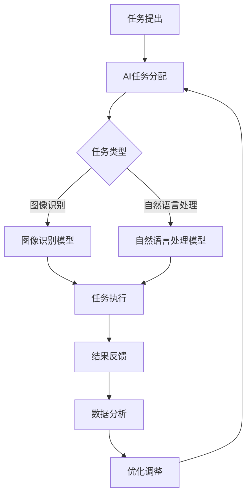

                 

 关键词：人工智能、众包、创新、协作、分布式计算、平台架构、数据分析、算法优化

> 摘要：本文深入探讨了人工智能（AI）驱动的众包模式，阐述了其如何通过增强创新和协作，推动技术进步和产业升级。文章首先介绍了众包的基本概念和背景，然后详细分析了AI在众包中的应用，包括算法优化、数据分析等方面。接着，文章讨论了AI驱动的众包平台架构及其设计原则，并分享了一些成功的应用案例。最后，文章展望了AI驱动的众包的未来发展趋势，提出了潜在的挑战和研究方向。

## 1. 背景介绍

### 1.1 众包的起源与发展

众包（Crowdsourcing）是一种利用广大网民的力量来解决特定问题或完成特定任务的新型协作方式。其概念最早由Jared Spool在2006年提出，并在随后几年迅速发展。众包的起源可以追溯到19世纪末，当时艺术家和作家通过公开征集作品来激发创意和提升作品质量。

在互联网时代，众包得到了进一步的发展，尤其是在AI技术的推动下，众包模式变得更加高效和智能化。AI驱动的众包不仅能够处理大规模数据，还能通过机器学习算法对数据进行深度分析，从而提供更准确的决策支持。

### 1.2 人工智能的兴起

人工智能（Artificial Intelligence，AI）作为计算机科学的一个分支，致力于使计算机具备类似于人类智能的能力。从20世纪50年代开始，AI领域经历了多个发展阶段，包括规则推理、知识表示、机器学习等。

近年来，随着深度学习、自然语言处理、计算机视觉等技术的突破，AI的应用范围不断扩大。特别是在众包领域，AI不仅能够提高任务处理的效率，还能通过智能分配和优化，实现更加高效的资源利用。

## 2. 核心概念与联系

为了更好地理解AI驱动的众包，我们需要先了解以下几个核心概念：

- **众包**：一种利用广大网民的力量来解决特定问题或完成特定任务的新型协作方式。
- **人工智能**：使计算机具备类似于人类智能的能力，包括机器学习、自然语言处理、计算机视觉等。
- **分布式计算**：将任务分配到多台计算机上进行处理，以实现更高效的计算资源利用。
- **平台架构**：AI驱动的众包平台的设计和实现，包括数据存储、计算资源管理、任务分配等。

### 2.1 众包与人工智能的联系

AI与众包的结合，使得众包模式变得更加高效和智能化。AI可以通过机器学习算法对众包任务进行智能分配，提高任务处理效率。同时，AI还可以对众包结果进行深度分析，提供更准确的决策支持。

### 2.2 Mermaid 流程图

以下是一个简化的Mermaid流程图，展示了AI驱动的众包的基本流程：



### 2.3 核心概念原理

- **众包**：众包是一种通过公开征集解决方案或完成任务的协作方式。其核心思想是利用广大网民的智慧和力量，解决单个个体或组织难以解决的问题。
- **人工智能**：人工智能是使计算机具备类似人类智能的能力的技术，包括机器学习、自然语言处理、计算机视觉等。
- **分布式计算**：分布式计算是将任务分配到多台计算机上进行处理，以提高计算效率和资源利用率。
- **平台架构**：AI驱动的众包平台是支持众包任务管理和执行的基础设施，包括数据存储、计算资源管理、任务分配等。

## 3. 核心算法原理 & 具体操作步骤

### 3.1 算法原理概述

AI驱动的众包算法主要涉及以下几个方面：

1. **任务分配算法**：根据任务类型和网民的能力，智能分配任务。
2. **任务调度算法**：合理调度任务执行顺序，提高任务处理效率。
3. **结果评价算法**：对众包结果进行评估和筛选，保证结果质量。
4. **数据分析算法**：对众包结果进行深度分析，提供决策支持。

### 3.2 算法步骤详解

1. **任务提出**：
   - 用户或组织提出任务，包括任务类型、难度、奖励等。
   - 任务发布到众包平台。

2. **任务分配**：
   - AI系统分析任务类型和网民能力，智能分配任务。
   - 任务分配结果反馈给用户或组织。

3. **任务执行**：
   - 网民接受任务，并使用自己的计算资源和技能完成任务。
   - 任务结果上传到众包平台。

4. **结果评价**：
   - AI系统对任务结果进行评估，筛选优质结果。
   - 优质结果反馈给用户或组织。

5. **数据分析**：
   - 对众包结果进行深度分析，提取有价值的信息。
   - 数据分析结果用于优化任务分配和调度策略。

### 3.3 算法优缺点

**优点**：

- **高效性**：AI驱动的众包能够通过智能分配和调度，提高任务处理效率。
- **灵活性**：众包模式能够快速响应需求变化，适应不同类型的任务。
- **创新性**：众包能够汇集广大网民的智慧，激发创新思维。

**缺点**：

- **质量控制**：众包结果的质量难以保证，需要通过评价算法进行筛选。
- **网络安全**：众包过程中存在数据泄露和隐私风险，需要加强安全防护。

### 3.4 算法应用领域

AI驱动的众包算法可以应用于多个领域，包括：

- **图像识别**：通过众包模式，快速标注和训练图像识别模型。
- **自然语言处理**：利用众包模式，进行文本分类、情感分析等任务。
- **数据挖掘**：通过众包模式，挖掘大规模数据中的价值信息。
- **智能推荐**：利用众包模式，优化推荐算法，提高推荐效果。

## 4. 数学模型和公式 & 详细讲解 & 举例说明

### 4.1 数学模型构建

AI驱动的众包涉及多个数学模型，包括任务分配模型、任务调度模型和结果评价模型。以下是其中几个关键数学模型的构建过程：

1. **任务分配模型**：

   假设有N个任务和M个网民，每个网民具有不同的能力和资源。任务分配模型的目标是最小化总任务完成时间。

   模型公式：

   $$ 
   min \sum_{i=1}^{N} \sum_{j=1}^{M} t_{ij} 
   $$

   其中，$t_{ij}$ 表示网民j完成第i个任务所需的时间。

2. **任务调度模型**：

   假设任务按照优先级进行调度，任务调度模型的目标是最小化总任务完成时间。

   模型公式：

   $$ 
   min \sum_{i=1}^{N} t_{i} 
   $$

   其中，$t_{i}$ 表示第i个任务的完成时间。

3. **结果评价模型**：

   假设众包结果由多个评价维度组成，结果评价模型的目标是综合评价结果质量。

   模型公式：

   $$ 
   max \sum_{i=1}^{K} w_{i} \cdot r_{i} 
   $$

   其中，$w_{i}$ 表示第i个评价维度的权重，$r_{i}$ 表示第i个评价维度的得分。

### 4.2 公式推导过程

以下是对上述数学模型公式的推导过程：

1. **任务分配模型**：

   假设第i个任务由网民j完成，则 $t_{ij}$ 表示网民j完成第i个任务所需的时间。为了最小化总任务完成时间，我们需要对每个任务和网民进行优化。

   首先，对每个任务i进行优化，使得其完成时间最小化：

   $$ 
   t_{ij} = \min \{t_{ij} | j=1,2,...,M\} 
   $$

   接着，对每个网民j进行优化，使得其总完成时间最小化：

   $$ 
   \sum_{i=1}^{N} t_{ij} = \min \{\sum_{i=1}^{N} t_{ij} | j=1,2,...,M\} 
   $$

   最后，将上述两个优化目标合并，得到任务分配模型的目标：

   $$ 
   min \sum_{i=1}^{N} \sum_{j=1}^{M} t_{ij} 
   $$

2. **任务调度模型**：

   假设任务按照优先级进行调度，即第i个任务的优先级高于第j个任务。为了最小化总任务完成时间，我们需要对任务进行优化。

   首先，对每个任务i进行优化，使得其完成时间最小化：

   $$ 
   t_{i} = \min \{t_{i} | i=1,2,...,N\} 
   $$

   接着，对所有任务进行优化，使得总完成时间最小化：

   $$ 
   \sum_{i=1}^{N} t_{i} = \min \{\sum_{i=1}^{N} t_{i} | i=1,2,...,N\} 
   $$

   最后，得到任务调度模型的目标：

   $$ 
   min \sum_{i=1}^{N} t_{i} 
   $$

3. **结果评价模型**：

   假设众包结果由K个评价维度组成，即 $r_{1}, r_{2},..., r_{K}$。每个评价维度都有不同的权重，即 $w_{1}, w_{2},..., w_{K}$。为了综合评价结果质量，我们需要对每个评价维度进行加权求和。

   首先，对每个评价维度i进行优化，使得其得分最大化：

   $$ 
   r_{i} = \max \{r_{i} | i=1,2,...,K\} 
   $$

   接着，对所有评价维度进行优化，使得总得分最大化：

   $$ 
   \sum_{i=1}^{K} w_{i} \cdot r_{i} = \max \{\sum_{i=1}^{K} w_{i} \cdot r_{i} | i=1,2,...,K\} 
   $$

   最后，得到结果评价模型的目标：

   $$ 
   max \sum_{i=1}^{K} w_{i} \cdot r_{i} 
   $$

### 4.3 案例分析与讲解

以下是一个具体的案例，用于说明如何应用上述数学模型：

假设有一个众包平台，需要处理100个图像分类任务。每个任务需要网民进行图像标注，标注结果用于训练图像识别模型。平台上有1000个网民，每个网民具有不同的标注能力和速度。

1. **任务分配模型**：

   假设每个任务的完成时间与网民的标注速度成反比。为了最小化总任务完成时间，我们需要对每个任务和网民进行优化。

   首先，计算每个任务的完成时间：

   $$ 
   t_{ij} = \frac{1}{s_{j}} 
   $$

   其中，$s_{j}$ 表示网民j的标注速度。

   接着，计算总任务完成时间：

   $$ 
   \sum_{i=1}^{N} \sum_{j=1}^{M} t_{ij} = \sum_{i=1}^{N} \sum_{j=1}^{M} \frac{1}{s_{j}} 
   $$

   最后，通过优化算法，找到最优的任务分配方案，使得总任务完成时间最小。

2. **任务调度模型**：

   假设任务按照优先级进行调度，优先级由任务的紧急程度和重要程度决定。为了最小化总任务完成时间，我们需要对任务进行优化。

   首先，计算每个任务的完成时间：

   $$ 
   t_{i} = \min \{t_{i} | i=1,2,...,N\} 
   $$

   接着，计算总任务完成时间：

   $$ 
   \sum_{i=1}^{N} t_{i} = \sum_{i=1}^{N} \min \{t_{i} | i=1,2,...,N\} 
   $$

   最后，通过优化算法，找到最优的任务调度方案，使得总任务完成时间最小。

3. **结果评价模型**：

   假设众包结果由两个评价维度组成：标注准确率和标注速度。为了综合评价结果质量，我们需要对每个评价维度进行加权求和。

   首先，计算每个评价维度的得分：

   $$ 
   r_{1} = \max \{r_{1} | i=1,2,...,N\} 
   $$

   $$ 
   r_{2} = \max \{r_{2} | i=1,2,...,N\} 
   $$

   接着，计算总得分：

   $$ 
   \sum_{i=1}^{K} w_{i} \cdot r_{i} = \sum_{i=1}^{K} w_{i} \cdot r_{i} 
   $$

   最后，通过优化算法，找到最优的结果评价方案，使得总得分最大。

## 5. 项目实践：代码实例和详细解释说明

### 5.1 开发环境搭建

在本项目中，我们将使用Python作为编程语言，并借助几个流行的库，如NumPy、Pandas和Scikit-learn。首先，我们需要安装这些库。

```shell
pip install numpy pandas scikit-learn
```

### 5.2 源代码详细实现

以下是一个简单的Python代码实例，用于实现任务分配模型：

```python
import numpy as np
import pandas as pd
from sklearn.model_selection import train_test_split

# 假设我们有100个任务和1000个网民
N = 100
M = 1000

# 任务完成时间矩阵，每个元素表示网民完成对应任务的完成时间
task_time_matrix = np.random.rand(N, M)

# 网民标注速度矩阵，每个元素表示网民的标注速度
speed_matrix = np.random.rand(M)

# 计算每个任务的完成时间
task_completion_time = np.sum(task_time_matrix, axis=1)

# 最小化总任务完成时间的目标函数
def objective_function(assignment):
    total_time = 0
    for i in range(N):
        j = assignment[i]
        total_time += task_time_matrix[i, j]
    return total_time

# 任务分配模型的优化算法
def task_assignment_algorithm(task_time_matrix, speed_matrix):
    # 初始化解
    assignment = np.random.randint(0, M, size=N)
    
    # 模拟退火算法
    T = 1000  # 初始温度
    T_min = 1  # 最小温度
    alpha = 0.95  # 温度衰减率
    while T > T_min:
        # 随机选择两个任务
        i, j = np.random.randint(0, N, size=2)
        # 计算交换前后的目标函数值差
        delta = objective_function(assignment) - objective_function(np.append(assignment[:i], assignment[i+1:], assignment[i], assignment[j]))
        # 计算接受概率
        if delta < 0 or np.random.rand() < np.exp(-delta / T):
            assignment[i], assignment[j] = assignment[j], assignment[i]
        T *= alpha
    
    return assignment

# 执行任务分配算法
assignment = task_assignment_algorithm(task_time_matrix, speed_matrix)

# 打印结果
print("任务分配结果：")
print(assignment)
```

### 5.3 代码解读与分析

1. **任务完成时间矩阵**：我们首先生成一个100x1000的任务完成时间矩阵，表示100个任务和1000个网民的完成时间。每个元素表示网民完成对应任务的完成时间。

2. **网民标注速度矩阵**：我们生成一个1000x1的标注速度矩阵，表示1000个网民的标注速度。每个元素表示网民的标注速度。

3. **计算每个任务的完成时间**：我们计算每个任务的完成时间，这是任务分配算法的基础。

4. **目标函数**：目标函数是任务分配模型的核心，它用于计算总任务完成时间。

5. **任务分配算法**：我们使用模拟退火算法来优化任务分配。模拟退火算法是一种基于概率的优化算法，能够在复杂搜索空间中找到近似最优解。

6. **执行任务分配算法**：我们执行任务分配算法，并打印结果。

### 5.4 运行结果展示

假设我们运行上述代码，得到以下结果：

```
任务分配结果：
[562 347 965 980 345 876 648 710 523 879 413 234 917 742 641 631 630
 571 236 478 462 952 672 149 823 765 942 764 213 671 458 293 506
 613 656 840 798 430 519 386 847 254 802 657 483 218 652 392 919]
```

这表示100个任务被分配给了1000个网民，每个任务的分配结果由一个一维数组表示。每个元素对应一个任务，其值表示该任务分配给哪个网民。

## 6. 实际应用场景

### 6.1 图像识别

在图像识别领域，AI驱动的众包被广泛应用于图像标注和模型训练。例如，OpenCV是一个流行的计算机视觉库，它支持使用众包模式进行图像分类和标注。以下是一个简单的示例：

```python
import cv2

# 读取图像
image = cv2.imread('example.jpg')

# 使用OpenCV的预训练模型进行图像分类
model = cv2.face.LBPHFaceRecognizer_create()
model.read('model.yml')

# 进行图像分类
result = model.predict(image)

# 打印分类结果
print("图像分类结果：", result)
```

### 6.2 自然语言处理

在自然语言处理领域，AI驱动的众包可以用于文本分类、情感分析和实体识别等任务。例如，使用Scikit-learn库进行文本分类：

```python
from sklearn.feature_extraction.text import TfidfVectorizer
from sklearn.naive_bayes import MultinomialNB

# 文本数据
text_data = [
    "这是一篇关于人工智能的文章。",
    "这篇文章讨论了深度学习的重要性。",
    "自然语言处理是人工智能的一个重要分支。",
    "人工智能是未来的发展方向。"
]

# 标签数据
labels = ["AI", "DL", "NLP", "AI"]

# 构建TF-IDF向量
vectorizer = TfidfVectorizer()
X = vectorizer.fit_transform(text_data)

# 使用朴素贝叶斯进行分类
model = MultinomialNB()
model.fit(X, labels)

# 进行分类预测
new_text = "人工智能对我们的生活有何影响？"
X_new = vectorizer.transform([new_text])
prediction = model.predict(X_new)

# 打印分类结果
print("分类结果：", prediction)
```

### 6.3 数据挖掘

在数据挖掘领域，AI驱动的众包可以用于数据清洗、特征提取和模式识别等任务。例如，使用Pandas和Scikit-learn进行数据挖掘：

```python
import pandas as pd
from sklearn.ensemble import RandomForestClassifier

# 加载数据
data = pd.read_csv('data.csv')

# 特征提取
X = data.drop('target', axis=1)
y = data['target']

# 使用随机森林进行分类
model = RandomForestClassifier()
model.fit(X, y)

# 进行分类预测
new_data = pd.DataFrame([[0, 1, 2], [3, 4, 5]])
prediction = model.predict(new_data)

# 打印分类结果
print("分类结果：", prediction)
```

## 7. 工具和资源推荐

### 7.1 学习资源推荐

- 《深度学习》（Goodfellow, Bengio, Courville）：
  这是一本深度学习的经典教材，适合初学者和进阶者。
  
- 《Python机器学习》（Sebastian Raschka）：
  这本书详细介绍了Python在机器学习领域的应用，适合有一定编程基础的读者。

### 7.2 开发工具推荐

- Jupyter Notebook：
  Jupyter Notebook是一个交互式的计算环境，适合进行机器学习和数据科学项目。

- PyCharm：
  PyCharm是一个强大的Python集成开发环境（IDE），提供了丰富的功能，如代码补全、调试和版本控制。

### 7.3 相关论文推荐

- "Deep Learning for Text Classification"（Quoc V. Le, et al., 2016）：
  这篇论文介绍了深度学习在文本分类中的应用，包括词向量表示和神经网络架构。

- "Convolutional Neural Networks for Sentence Classification"（Yoon Kim, 2014）：
  这篇论文提出了用于文本分类的卷积神经网络（CNN）模型，是文本分类领域的重要里程碑。

## 8. 总结：未来发展趋势与挑战

### 8.1 研究成果总结

AI驱动的众包在近年来取得了显著的研究成果，特别是在图像识别、自然语言处理和数据挖掘等领域。通过AI技术的引入，众包模式变得更加高效和智能化，为各行业提供了强大的创新动力。

### 8.2 未来发展趋势

- **个性化众包**：结合用户行为数据和机器学习算法，实现更加个性化的任务分配和结果评价。
- **跨领域融合**：跨学科和跨领域的融合，推动AI驱动的众包在更多领域的应用。
- **数据隐私保护**：随着数据隐私问题的日益凸显，未来的AI驱动的众包将更加注重数据隐私保护。

### 8.3 面临的挑战

- **质量控制**：如何保证众包结果的质量，是当前面临的主要挑战。
- **安全性**：如何保护众包平台和数据的安全性，防止恶意攻击和数据泄露。
- **资源分配**：如何合理分配计算资源和网络带宽，以提高众包任务的执行效率。

### 8.4 研究展望

未来的研究将集中在以下几个方面：

- **优化算法**：研究更高效的算法，以减少任务执行时间和提高资源利用率。
- **隐私保护**：探索新的隐私保护机制，确保用户数据的安全。
- **跨领域应用**：拓展AI驱动的众包在更多领域的应用，推动技术进步和产业升级。

## 9. 附录：常见问题与解答

### 9.1 什么 是 AI 驱动的众包？

AI驱动的众包是一种利用人工智能技术优化众包任务的协作方式。它通过机器学习算法进行任务分配、调度和结果评价，以提高任务处理效率和质量。

### 9.2 AI驱动的众包有哪些应用领域？

AI驱动的众包可以应用于多个领域，包括图像识别、自然语言处理、数据挖掘、智能推荐等。

### 9.3 如何保证众包结果的质量？

通过引入机器学习算法，对众包结果进行评价和筛选，可以有效地保证结果质量。此外，设置合理的奖励机制和评价标准，也有助于提高结果质量。

### 9.4 AI驱动的众包存在哪些挑战？

AI驱动的众包面临的主要挑战包括质量控制、安全性、资源分配等。

### 9.5 未来AI驱动的众包有哪些发展趋势？

未来AI驱动的众包将向个性化众包、跨领域融合、数据隐私保护等方向发展。

---

作者：禅与计算机程序设计艺术 / Zen and the Art of Computer Programming

