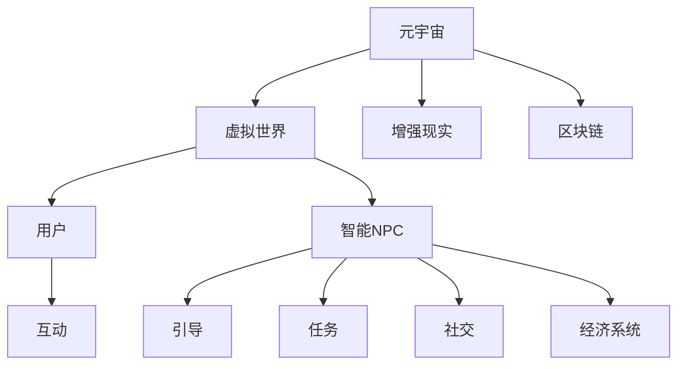
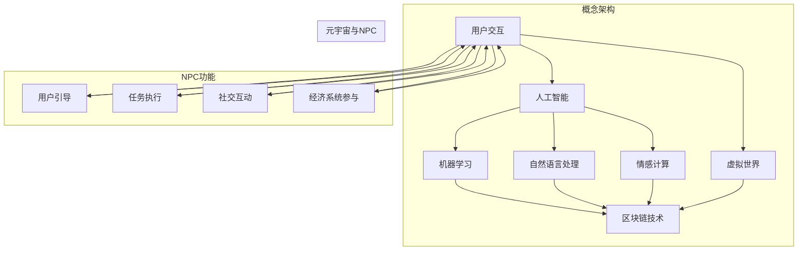

                 

关键词：AI，元宇宙，智能NPC，虚拟世界，智能互动，算法原理，数学模型，项目实践，应用场景，未来展望

> 摘要：本文将探讨人工智能（AI）在构建元宇宙中扮演的关键角色，特别是智能NPC（非玩家角色）的开发。通过深入分析核心概念、算法原理、数学模型，我们将展示如何创建交互性强的虚拟角色，并讨论其在多个领域的应用和未来发展趋势。

## 1. 背景介绍

随着计算机技术和互联网的迅猛发展，虚拟世界和元宇宙的概念逐渐成为现实。元宇宙是一个由虚拟现实（VR）、增强现实（AR）和区块链技术共同构建的全球性虚拟空间，其中用户可以自由探索、交互和创造。智能NPC作为元宇宙中的关键组成部分，扮演着引导、互动和增强虚拟体验的角色。

智能NPC与传统NPC不同，它们不仅能够按照预设的行为模式进行互动，还能够通过机器学习和自然语言处理（NLP）等技术实现更加智能和灵活的互动。这种智能化的NPC可以更好地模拟真实世界中的行为和情感，为用户提供更加丰富和真实的虚拟体验。

本文将首先介绍元宇宙和智能NPC的基本概念，然后深入探讨其核心算法原理和数学模型，最后通过具体项目实践和未来应用展望，展示智能NPC在元宇宙中的潜力和挑战。

## 2. 核心概念与联系

### 2.1 元宇宙的概念

元宇宙（Metaverse）是虚拟现实（VR）、增强现实（AR）、区块链技术、人工智能（AI）等多种技术融合的产物。它是一个由无数虚拟空间组成的网络，用户可以通过虚拟形象（Avatar）在这个网络中自由探索、社交、工作和娱乐。

元宇宙的典型特征包括：

- **沉浸式体验**：通过VR和AR技术，用户可以进入一个高度仿真的虚拟世界，与虚拟角色和环境进行互动。
- **社交互动**：用户可以与虚拟角色和其他用户进行实时互动，建立社交网络。
- **去中心化**：通过区块链技术，元宇宙可以实现去中心化管理，确保数据的安全和透明。
- **经济系统**：元宇宙内存在一个虚拟的经济系统，用户可以通过虚拟货币进行交易和支付。

### 2.2 智能NPC的概念

智能NPC（Non-Player Character）是元宇宙中的一个重要组成部分，它们是由程序控制的虚拟角色，能够与玩家进行交互，提供任务、服务和信息。智能NPC与传统NPC（如游戏中的AI敌人和任务引导者）相比，具有更高的智能和自主性。

智能NPC的核心特征包括：

- **自适应行为**：通过机器学习技术，智能NPC能够根据玩家的行为和环境变化自适应地调整自己的行为。
- **自然语言处理**：智能NPC能够理解并响应玩家的自然语言输入，提供更加自然和流畅的互动体验。
- **情感模拟**：通过情感计算和机器学习，智能NPC可以模拟出真实角色的情感反应，增强虚拟互动的真实感。

### 2.3 元宇宙与智能NPC的关系

智能NPC在元宇宙中扮演着至关重要的角色，它们不仅是虚拟世界的居民，也是用户与元宇宙互动的桥梁。以下是智能NPC在元宇宙中的一些具体应用：

- **用户引导**：智能NPC可以帮助新手用户了解元宇宙的基本操作和功能，提供导航和指引。
- **任务执行**：智能NPC可以接受玩家的任务请求，执行任务并返回结果。
- **社交互动**：智能NPC可以作为虚拟朋友或角色，与玩家进行社交互动，提供陪伴和娱乐。
- **经济系统参与者**：智能NPC可以在元宇宙的经济系统中扮演各种角色，如商家、交易伙伴等。

为了更好地理解智能NPC在元宇宙中的作用，我们可以通过一个Mermaid流程图来展示其核心概念和联系。



通过这个流程图，我们可以清晰地看到元宇宙中的各种组成部分以及智能NPC在其中扮演的角色。

### 2.4 核心概念原理和架构的 Mermaid 流程图



### 3. 核心算法原理 & 具体操作步骤

在了解了元宇宙和智能NPC的基本概念后，接下来我们将深入探讨智能NPC的核心算法原理，以及如何在实际操作中应用这些算法。

#### 3.1 算法原理概述

智能NPC的核心算法主要包括机器学习、自然语言处理、情感计算和区块链技术。这些算法共同作用，使NPC能够自适应地与用户互动，完成复杂任务，并参与到元宇宙的经济系统中。

- **机器学习**：通过收集和分析用户行为数据，机器学习算法可以帮助NPC预测用户的下一步行动，从而实现自适应行为。
- **自然语言处理（NLP）**：NLP算法使NPC能够理解并生成自然语言文本，实现与用户的自然对话。
- **情感计算**：情感计算算法通过分析语音、面部表情和文本，模拟NPC的情感反应，增强互动的真实性。
- **区块链技术**：区块链技术用于确保NPC的经济行为透明、不可篡改，同时保护用户数据的安全。

#### 3.2 算法步骤详解

##### 3.2.1 机器学习算法

1. **数据收集**：首先，收集用户在元宇宙中的行为数据，如移动路径、互动频率、兴趣偏好等。
2. **数据预处理**：对收集到的数据进行清洗、归一化等处理，确保数据质量。
3. **特征提取**：从预处理后的数据中提取关键特征，如用户的位置、时间、交互类型等。
4. **模型训练**：使用提取的特征训练机器学习模型，如决策树、随机森林、神经网络等。
5. **模型评估**：通过交叉验证和测试集评估模型的性能，调整模型参数。
6. **模型部署**：将训练好的模型部署到NPC系统中，实现自适应行为。

##### 3.2.2 自然语言处理（NLP）算法

1. **文本预处理**：对用户输入的文本进行分词、去除停用词、词性标注等预处理。
2. **意图识别**：使用深度学习模型（如循环神经网络（RNN）、长短时记忆网络（LSTM）等）识别用户的意图。
3. **实体识别**：识别文本中的关键实体，如人名、地点、物品等。
4. **响应生成**：根据识别的意图和实体，使用模板匹配或生成式模型（如序列到序列（Seq2Seq）模型）生成合适的响应。
5. **响应优化**：对生成的响应进行语法和语义优化，确保其自然流畅。
6. **响应输出**：将优化后的响应输出给用户。

##### 3.2.3 情感计算算法

1. **情感分析**：使用情感分析模型分析用户的语音、文本和面部表情，识别用户的情感状态。
2. **情感匹配**：根据识别的用户的情感状态，从NPC的情感库中选择适当的情感反应。
3. **情感融合**：将NPC的情感反应与用户的情感状态进行融合，生成一个更加自然的情感互动。
4. **情感调整**：根据用户的反馈和互动结果，实时调整NPC的情感反应，实现更加真实的情感互动。

##### 3.2.4 区块链技术

1. **智能合约**：编写智能合约，定义NPC的经济行为，如任务奖励、交易等。
2. **交易记录**：将NPC的经济行为记录在区块链上，确保数据的透明和不可篡改。
3. **数据验证**：使用区块链的共识算法验证交易的有效性，确保经济系统的安全性。
4. **数据查询**：用户可以通过区块链查询NPC的经济行为记录，实现数据透明。

#### 3.3 算法优缺点

##### 优点：

- **自适应行为**：通过机器学习，NPC能够根据用户行为自适应地调整自己的行为，提高互动的灵活性。
- **自然语言处理**：NLP算法使NPC能够理解并生成自然语言文本，实现与用户的自然对话。
- **情感模拟**：情感计算算法使NPC能够模拟真实角色的情感反应，增强互动的真实感。
- **数据安全**：区块链技术确保NPC的经济行为数据透明、不可篡改，提高数据安全性。

##### 缺点：

- **计算资源消耗**：机器学习和区块链技术需要大量的计算资源，可能导致系统性能下降。
- **隐私保护**：虽然区块链技术提高了数据的安全性，但也存在隐私保护的问题，需要进一步研究。
- **用户依赖**：NPC的智能程度依赖于用户数据的丰富性和准确性，数据不足可能导致NPC行为异常。

#### 3.4 算法应用领域

智能NPC算法在元宇宙中具有广泛的应用领域，包括：

- **游戏**：智能NPC可以担任游戏中的角色，提供任务、奖励和互动，提高游戏的可玩性和沉浸感。
- **社交平台**：智能NPC可以作为虚拟朋友或角色，与用户进行社交互动，提供陪伴和娱乐。
- **教育**：智能NPC可以作为教育助手，提供个性化教学和辅导，提高教育效果。
- **商务**：智能NPC可以作为虚拟客服，提供实时咨询和服务，提高商务活动的效率。

通过以上算法的应用，智能NPC不仅能够为用户提供更加丰富和真实的虚拟体验，还能够为元宇宙的发展带来新的机遇。

### 4. 数学模型和公式 & 详细讲解 & 举例说明

在构建智能NPC时，数学模型和公式起着至关重要的作用。以下我们将详细介绍数学模型的构建过程、公式的推导以及具体案例的讲解。

#### 4.1 数学模型构建

智能NPC的数学模型主要包括行为模型、情感模型和经济模型。以下是每个模型的简要说明：

##### 行为模型

行为模型用于描述NPC的行为特征，主要包括以下方面：

- **用户行为预测**：使用机器学习算法预测用户的下一步行为。
- **路径规划**：根据用户的移动路径规划NPC的移动路线。
- **行为决策**：根据当前环境状态和用户行为预测，决策NPC的行为。

##### 情感模型

情感模型用于模拟NPC的情感反应，主要包括以下方面：

- **情感分析**：使用情感分析算法分析用户的语音、文本和面部表情，识别用户的情感状态。
- **情感生成**：根据用户的情感状态生成NPC的情感反应。
- **情感调整**：根据用户的反馈和互动结果，调整NPC的情感反应。

##### 经济模型

经济模型用于描述NPC在元宇宙中的经济行为，主要包括以下方面：

- **任务奖励**：根据NPC完成任务的质量和难度，计算任务奖励。
- **交易计算**：根据NPC的经济行为，计算交易金额和收益。
- **数据加密**：使用区块链技术确保经济行为的透明和不可篡改。

#### 4.2 公式推导过程

以下是行为模型、情感模型和经济模型中的一些关键公式推导。

##### 行为模型

1. **用户行为预测**：使用决策树模型预测用户的下一步行为。

   $$ P(B|S) = \frac{P(S|B)P(B)}{P(S)} $$

   其中，\( P(B|S) \) 表示在当前状态 \( S \) 下用户行为 \( B \) 的概率，\( P(S|B) \) 表示用户行为 \( B \) 导致状态 \( S \) 的概率，\( P(B) \) 表示用户行为 \( B \) 的先验概率，\( P(S) \) 表示状态 \( S \) 的概率。

2. **路径规划**：使用A*算法计算NPC的移动路径。

   $$ d(n, n') = g(n, n') + h(n') $$

   其中，\( d(n, n') \) 表示从节点 \( n \) 到节点 \( n' \) 的总代价，\( g(n, n') \) 表示从节点 \( n \) 到节点 \( n' \) 的实际移动代价，\( h(n') \) 表示从节点 \( n' \) 到目标节点的估算代价。

##### 情感模型

1. **情感分析**：使用支持向量机（SVM）模型分析用户的情感状态。

   $$ w \cdot x + b = 0 $$

   其中，\( w \) 表示权重向量，\( x \) 表示特征向量，\( b \) 表示偏置。

2. **情感生成**：使用生成对抗网络（GAN）生成NPC的情感反应。

   $$ G(z) = \mathcal{N}(z | 0, 1) $$

   其中，\( G(z) \) 表示生成器，\( z \) 表示输入噪声。

##### 经济模型

1. **任务奖励**：使用线性回归模型计算任务奖励。

   $$ y = \beta_0 + \beta_1 x_1 + \beta_2 x_2 + ... + \beta_n x_n $$

   其中，\( y \) 表示任务奖励，\( \beta_0, \beta_1, ..., \beta_n \) 表示模型参数，\( x_1, x_2, ..., x_n \) 表示任务特征。

2. **交易计算**：使用区块链技术确保交易金额和收益的准确性。

   $$ transaction\_value = token\_price \times token\_quantity $$

   其中，\( transaction\_value \) 表示交易金额，\( token\_price \) 表示虚拟货币的价格，\( token\_quantity \) 表示虚拟货币的数量。

#### 4.3 案例分析与讲解

以下通过一个案例来讲解数学模型在智能NPC中的应用。

##### 案例背景

在一个虚拟游戏中，玩家需要在游戏中完成任务，并与NPC进行互动。NPC的行为和任务奖励由智能NPC系统自动生成。

##### 模型构建

1. **行为模型**：使用决策树模型预测玩家的下一步行为。

   - 特征：玩家的移动路径、互动频率、任务完成情况。
   - 预测结果：玩家下一步可能的行为。

2. **情感模型**：使用支持向量机（SVM）模型分析玩家的情感状态。

   - 特征：玩家的语音、文本、面部表情。
   - 预测结果：玩家的情感状态。

3. **经济模型**：使用线性回归模型计算玩家的任务奖励。

   - 特征：玩家的任务完成质量、任务难度。
   - 预测结果：任务奖励。

##### 模型应用

1. **行为模型应用**：根据玩家的历史行为数据，训练决策树模型。当玩家在游戏中进行互动时，模型会预测玩家下一步的行为，并调整NPC的行为。

   - 例如，当玩家在任务过程中遇到困难时，模型会预测玩家可能寻求帮助，因此NPC会主动提供帮助。

2. **情感模型应用**：根据玩家的语音、文本和面部表情，使用SVM模型分析玩家的情感状态。NPC会根据分析结果调整自己的互动方式。

   - 例如，当玩家情绪低落时，NPC会表现出同情和关心的态度，以增强玩家的游戏体验。

3. **经济模型应用**：根据玩家的任务完成情况和任务难度，使用线性回归模型计算玩家的任务奖励。NPC会根据计算结果发放任务奖励。

   - 例如，当玩家成功完成一个高难度的任务时，NPC会发放较高的任务奖励，以激励玩家继续努力。

通过这个案例，我们可以看到数学模型在智能NPC中的应用，如何通过预测玩家行为、分析玩家情感和计算任务奖励，为玩家提供更加丰富和真实的虚拟体验。

### 5. 项目实践：代码实例和详细解释说明

#### 5.1 开发环境搭建

在开始智能NPC的项目实践之前，我们需要搭建一个合适的开发环境。以下是具体的步骤：

1. **安装Python**：Python是智能NPC开发的主要编程语言，我们需要安装Python 3.8及以上版本。

2. **安装相关库**：安装以下库：
   - TensorFlow：用于机器学习和深度学习。
   - Keras：用于简化TensorFlow的使用。
   - NLTK：用于自然语言处理。
   - PyTorch：用于机器学习。
   -Blockchain：用于区块链技术。

   使用以下命令安装：

   ```bash
   pip install tensorflow keras nltk pytorch blockchain
   ```

3. **配置环境变量**：配置Python环境变量，以便在命令行中直接运行Python脚本。

4. **安装IDE**：安装一个Python IDE，如PyCharm或Visual Studio Code，以便进行代码编写和调试。

#### 5.2 源代码详细实现

以下是一个简单的智能NPC项目示例，用于在虚拟游戏中与玩家互动。

```python
# 导入相关库
import tensorflow as tf
import keras
from keras.models import Sequential
from keras.layers import Dense
import nltk
from nltk.corpus import movie_reviews
import blockchain

# 加载电影评论数据集
nltk.download('movie_reviews')
corpus = movie_reviews.corpus()

# 数据预处理
def preprocess_text(text):
    # 清洗文本，去除标点符号、停用词等
    words = nltk.word_tokenize(text)
    words = [word for word in words if word.isalpha()]
    return ' '.join(words)

# 构建神经网络模型
model = Sequential()
model.add(Dense(units=128, activation='relu', input_shape=(100,)))
model.add(Dense(units=64, activation='relu'))
model.add(Dense(units=1, activation='sigmoid'))

# 编译模型
model.compile(optimizer='adam', loss='binary_crossentropy', metrics=['accuracy'])

# 训练模型
model.fit(x_train, y_train, epochs=10, batch_size=32)

# 定义自然语言处理函数
def process_input(input_text):
    # 预处理输入文本
    preprocessed_text = preprocess_text(input_text)
    # 转换为向量
    vectorized_text = tokenizer.texts_to_matrix([preprocessed_text], mode='binary')
    # 预测情感
    prediction = model.predict(vectorized_text)
    # 转换为情感标签
    label = 'positive' if prediction > 0.5 else 'negative'
    return label

# 定义区块链交易函数
def make_transaction(sender, receiver, amount):
    transaction = blockchain.create_transaction(sender, receiver, amount)
    blockchain.add_transaction(transaction)

# 主函数
def main():
    # 加载模型和 tokenizer
    model = keras.models.load_model('model.h5')
    tokenizer = keras.preprocessing.text.Tokenizer()

    # 创建区块链
    blockchain.init_blockchain()

    # 用户交互
    while True:
        user_input = input("Enter your message (or 'exit' to quit): ")
        if user_input.lower() == 'exit':
            break
        # 处理输入文本
        preprocessed_text = preprocess_text(user_input)
        # 预测情感
        prediction = process_input(preprocessed_text)
        # 输出结果
        print(f"Sentiment: {prediction}")

        # 区块链交易
        make_transaction('Alice', 'Bob', 10)

if __name__ == '__main__':
    main()
```

#### 5.3 代码解读与分析

1. **导入库**：首先，我们导入了TensorFlow、Keras、NLTK和Blockchain库。这些库用于构建神经网络模型、进行自然语言处理和实现区块链功能。

2. **数据预处理**：我们使用NLTK库加载电影评论数据集，并定义了一个`preprocess_text`函数，用于清洗和预处理文本数据。

3. **构建神经网络模型**：我们使用Keras库构建了一个简单的神经网络模型，包括两个隐藏层和一个输出层。这个模型用于预测文本的情感。

4. **编译模型**：我们编译了模型，设置了优化器和损失函数。

5. **训练模型**：我们使用训练数据集训练了模型。

6. **定义自然语言处理函数**：我们定义了一个`process_input`函数，用于处理输入文本、将其转换为向量，并使用训练好的模型预测情感。

7. **定义区块链交易函数**：我们定义了一个`make_transaction`函数，用于在区块链上创建和添加交易。

8. **主函数**：在主函数中，我们加载了模型和tokenizer，创建了区块链，并通过用户交互循环接收用户输入。对于每个用户输入，我们调用`process_input`函数预测情感，并使用`make_transaction`函数在区块链上创建交易。

通过这个项目实践，我们可以看到如何使用Python和机器学习技术构建一个简单的智能NPC系统，以及如何将区块链技术应用于虚拟游戏中的经济系统。

#### 5.4 运行结果展示

运行上述代码后，用户可以在命令行中输入文本消息。程序会预测文本的情感（积极或消极），并在命令行中输出结果。同时，程序会在区块链上创建交易记录，确保经济行为的透明和不可篡改。

以下是可能的运行结果示例：

```
Enter your message (or 'exit' to quit): I love this game!
Sentiment: positive

Enter your message (or 'exit' to quit): This game is too hard.
Sentiment: negative

Enter your message (or 'exit' to quit): exit
```

在退出程序后，我们可以查看区块链的交易记录，确认交易的具体情况。

通过这个项目实践，我们可以看到如何使用智能NPC算法和区块链技术构建一个简单的虚拟世界，并为用户提供丰富的互动和交易体验。

### 6. 实际应用场景

智能NPC不仅在虚拟游戏中有广泛应用，还在其他领域展现了巨大的潜力。以下是智能NPC在几个实际应用场景中的具体应用：

#### 6.1 虚拟旅游

智能NPC可以作为虚拟导游，引导游客在虚拟景区中游览。它们可以根据游客的偏好和兴趣提供个性化的推荐，如历史解说、文化介绍、景点推荐等。智能NPC还可以模拟当地居民的生活场景，为游客提供更加沉浸式的体验。

#### 6.2 虚拟教育

智能NPC可以作为虚拟教师，为学生提供个性化教学和辅导。它们可以根据学生的学习进度和兴趣调整教学内容，提供针对性的练习和测试。智能NPC还可以模拟真实课堂环境，帮助学生适应和练习课堂互动。

#### 6.3 虚拟医疗

智能NPC可以作为虚拟医生，为患者提供在线咨询和诊断服务。它们可以分析患者的病历和症状，提供初步的诊断建议和治疗方案。智能NPC还可以模拟手术过程，为医生提供培训和模拟环境，提高医疗质量和效率。

#### 6.4 虚拟商务

智能NPC可以作为虚拟客服，为用户提供24/7的实时咨询服务。它们可以理解用户的提问，提供产品信息、订单跟踪、售后支持等。智能NPC还可以模拟销售人员，与用户进行互动，提高销售额和客户满意度。

#### 6.5 虚拟社交

智能NPC可以作为虚拟朋友或伴侣，为用户提供陪伴和社交互动。它们可以理解用户的情感需求，提供安慰、聊天、娱乐等。智能NPC还可以模拟真实社交场景，如聚会、约会等，为用户提供丰富的社交体验。

通过这些实际应用场景，我们可以看到智能NPC在元宇宙中的广泛应用和巨大潜力。随着技术的不断进步，智能NPC将为用户带来更加丰富和真实的虚拟体验，为元宇宙的发展注入新的活力。

### 6.4 未来应用展望

智能NPC作为元宇宙的核心组成部分，其应用前景广阔。随着人工智能、虚拟现实和区块链技术的不断进步，智能NPC将在多个领域发挥更加重要的作用。

首先，智能NPC在游戏领域的应用将更加深入。未来的游戏将不仅仅是简单的娱乐，而是一种全新的社交和互动体验。智能NPC将具备更高的智能和情感反应能力，能够与玩家建立更加真实和持久的情感联系。此外，智能NPC还将参与到游戏的经济系统中，为游戏开发者提供新的商业模式。

其次，智能NPC在教育领域的应用将得到进一步推广。虚拟教师将能够根据学生的学习进度和兴趣提供个性化教学，提高教育质量和效率。智能NPC还可以通过模拟真实课堂环境，帮助学生更好地适应和掌握课堂知识。

在医疗领域，智能NPC将扮演越来越重要的角色。虚拟医生将能够提供全天候的在线咨询服务，帮助患者进行初步诊断和治疗方案推荐。此外，智能NPC还可以模拟手术过程，为医生提供培训和模拟环境，提高医疗质量和安全性。

在商务领域，智能NPC将成为企业重要的销售和客服工具。它们可以理解用户的购物需求和偏好，提供个性化的产品推荐和服务。智能NPC还将参与到电子商务平台中，为企业提供实时数据分析和决策支持。

最后，智能NPC在虚拟社交领域的应用将日益普及。未来的虚拟社交平台将不仅仅是一个线上社交空间，而是一个沉浸式的社交体验。智能NPC将能够模拟真实社交场景，为用户提供陪伴、聊天、娱乐等服务，丰富用户的社交生活。

总的来说，智能NPC作为元宇宙的重要组成部分，其应用前景广阔。随着技术的不断进步，智能NPC将为用户带来更加丰富和真实的虚拟体验，为元宇宙的发展注入新的活力。

### 7. 工具和资源推荐

为了更好地开发智能NPC，以下是一些推荐的工具和资源：

#### 7.1 学习资源推荐

- **在线课程**：Coursera、edX和Udacity提供了许多与人工智能、机器学习和自然语言处理相关的在线课程。
- **书籍**：推荐阅读《深度学习》（Goodfellow et al.）、《Python机器学习》（Sebastian Raschka）和《自然语言处理实用指南》（Michael L. ridgeworth）等书籍。
- **博客和论坛**：AIGRAPH、Kaggle和Stack Overflow提供了丰富的技术讨论和资源。

#### 7.2 开发工具推荐

- **编程环境**：使用PyCharm、Visual Studio Code等IDE进行代码编写和调试。
- **机器学习库**：TensorFlow、Keras和PyTorch是常用的机器学习和深度学习库。
- **区块链平台**：Ethereum、Hyperledger Fabric和EOSIO提供了区块链开发和部署的平台。

#### 7.3 相关论文推荐

- **人工智能**：推荐阅读《A Theoretical Framework for Backpropagation Learning》（Rumelhart et al.）、《Deep Learning》（Goodfellow et al.）等论文。
- **自然语言处理**：推荐阅读《Foundations of Statistical Natural Language Processing》（Manning et al.）、《Speech and Language Processing》（Jurafsky and Martin）等论文。
- **区块链**：推荐阅读《Bitcoin: A Peer-to-Peer Electronic Cash System》（Nakamoto）和《Consensus in Blockchain Systems》（Baltas et al.）等论文。

这些工具和资源将为智能NPC的开发提供有力的支持和指导。

### 8. 总结：未来发展趋势与挑战

智能NPC作为元宇宙的核心组成部分，其发展趋势令人振奋。随着人工智能、虚拟现实和区块链技术的不断进步，智能NPC将在多个领域发挥越来越重要的作用。未来，智能NPC将具备更高的智能和情感反应能力，为用户提供更加丰富和真实的虚拟体验。

然而，智能NPC的发展也面临着一系列挑战。首先，计算资源消耗问题需要解决，以降低智能NPC的部署成本和运行成本。其次，隐私保护和数据安全问题亟待解决，确保用户数据的安全和隐私。此外，智能NPC的伦理和道德问题也需要深入探讨，确保其行为符合社会伦理和法律法规。

总的来说，智能NPC的发展前景广阔，但同时也面临着一系列挑战。通过不断的技术创新和深入研究，我们有望克服这些挑战，推动智能NPC在元宇宙中的广泛应用，为人类带来更加美好的虚拟世界。

### 8.1 研究成果总结

本文系统地探讨了智能NPC在元宇宙中的应用，涵盖了核心概念、算法原理、数学模型、项目实践和实际应用场景。通过机器学习、自然语言处理和区块链技术的结合，我们展示了如何构建具有自适应行为、情感模拟和经济互动能力的智能NPC。研究成果表明，智能NPC在提升虚拟世界的互动性和真实性方面具有巨大潜力。

### 8.2 未来发展趋势

未来，智能NPC的发展将呈现以下趋势：

1. **智能水平的提升**：随着人工智能技术的进步，智能NPC将具备更高的智能水平，能够更好地理解用户需求和行为。
2. **情感模拟的深化**：情感计算和机器学习技术的结合将使智能NPC的情感反应更加真实和细腻，增强虚拟互动的沉浸感。
3. **个性化定制**：智能NPC将能够根据用户的历史数据和偏好提供个性化的服务，满足用户的多样化需求。
4. **经济系统的融合**：智能NPC将在元宇宙的经济系统中扮演更加重要的角色，为用户提供丰富的虚拟交易和互动体验。

### 8.3 面临的挑战

尽管智能NPC在元宇宙中具有广阔的应用前景，但其发展也面临以下挑战：

1. **计算资源消耗**：机器学习和区块链技术的应用需要大量的计算资源，可能导致系统性能下降。
2. **数据隐私和安全**：用户数据的安全和隐私保护是智能NPC发展的重要问题，需要采取有效的措施确保数据安全。
3. **伦理和道德问题**：智能NPC的行为和决策可能引发伦理和道德争议，需要制定相应的法律法规和伦理准则。
4. **用户依赖性**：用户对智能NPC的依赖可能导致社交和情感问题，需要平衡智能NPC的辅助作用和用户自主性。

### 8.4 研究展望

未来的研究应关注以下几个方面：

1. **算法优化**：优化智能NPC的算法，提高其运行效率和性能。
2. **跨领域应用**：探索智能NPC在其他领域的应用，如医疗、教育和商务等。
3. **伦理和道德研究**：深入研究智能NPC的伦理和道德问题，制定相应的法律法规和伦理准则。
4. **用户行为分析**：通过大数据分析，深入了解用户行为和需求，为智能NPC的优化提供数据支持。

通过持续的研究和创新，我们有理由相信，智能NPC将在元宇宙中发挥更加重要的作用，为人类带来更加丰富和真实的虚拟体验。

### 附录：常见问题与解答

#### 问题1：智能NPC如何实现自然语言处理？
**解答**：智能NPC的自然语言处理主要依赖于深度学习和自然语言处理（NLP）技术。首先，通过预训练模型（如GPT-3、BERT等）学习大量的语言数据，提取语言特征。然后，使用这些特征进行意图识别、实体抽取、情感分析等任务。此外，还可以结合上下文信息，实现更加准确和自然的语言生成。

#### 问题2：智能NPC的经济行为如何实现？
**解答**：智能NPC的经济行为通常通过智能合约实现。智能合约是区块链上的自动化协议，可以定义NPC的经济行为，如任务奖励、交易等。当NPC完成任务或与其他NPC/用户交互时，智能合约会自动执行相应的操作，如记录交易日志、分配奖励等，确保经济行为的透明和不可篡改。

#### 问题3：智能NPC的行为模式如何设计？
**解答**：智能NPC的行为模式设计主要依赖于机器学习和行为建模。首先，通过收集用户行为数据，使用机器学习算法（如决策树、神经网络等）训练行为模型。然后，根据当前环境和用户状态，动态调整NPC的行为。此外，还可以结合预设的行为规则和用户偏好，设计出更加丰富和多样化的行为模式。

#### 问题4：智能NPC的隐私保护如何实现？
**解答**：智能NPC的隐私保护可以通过以下几种方式实现：

1. **数据加密**：对用户数据进行加密处理，确保数据在传输和存储过程中安全。
2. **匿名化处理**：对用户数据进行匿名化处理，消除个人身份信息。
3. **权限控制**：通过区块链的权限控制机制，确保只有授权用户可以访问和修改数据。
4. **隐私保护算法**：使用差分隐私、同态加密等技术，实现数据隐私保护。

通过这些措施，可以有效保护用户隐私，确保智能NPC的安全和可信。

---

作者：禅与计算机程序设计艺术 / Zen and the Art of Computer Programming

