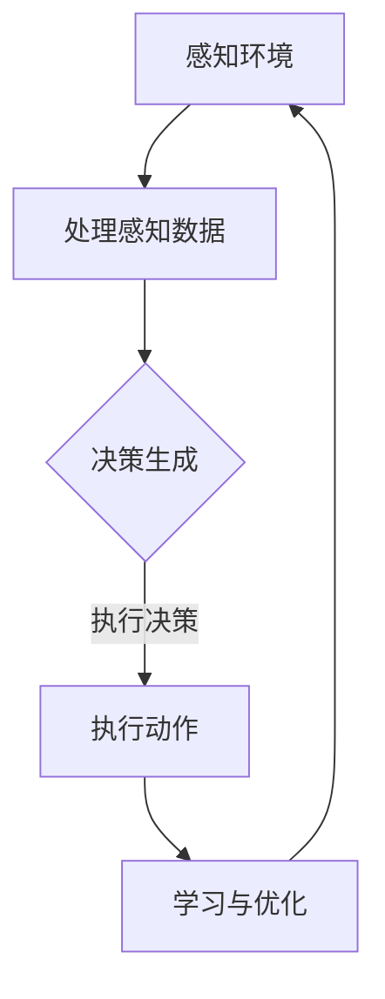

                 

关键词：人工智能、元宇宙、智能NPC、虚拟世界、编程

> 摘要：本文将探讨人工智能在元宇宙中的关键作用，特别是在创造智能NPC（非玩家角色）方面的应用。我们将深入分析AI驱动的NPC的原理、实现步骤、数学模型，并分享实际项目中的代码实例和运行结果。此外，本文还将讨论智能NPC在虚拟世界中的应用场景和未来发展趋势。

## 1. 背景介绍

随着互联网技术的迅猛发展和虚拟现实技术的不断成熟，元宇宙（Metaverse）这个概念逐渐走进了大众的视野。元宇宙被看作是互联网的下一个重要阶段，它是一个虚拟的三维空间，通过增强现实（AR）、虚拟现实（VR）等技术，将现实世界和虚拟世界相结合。在元宇宙中，用户可以创建自己的虚拟形象，与其他用户互动，参与各种虚拟活动。

在元宇宙中，NPC（Non-Player Character，非玩家角色）是不可或缺的一部分。NPC是虚拟世界中的程序角色，它们可以提供信息、完成任务、与玩家互动等。传统的NPC通常是由游戏开发者预先设定好行为和对话的，但这种方式在复杂度较高的元宇宙中显得力不从心。因此，智能NPC的概念应运而生，它们能够通过人工智能技术实现自适应行为，提供更加丰富和真实的用户体验。

本文将介绍AI驱动的智能NPC在元宇宙中的应用，从核心概念、算法原理、数学模型到实际项目实现，全面探讨智能NPC的发展和应用。

## 2. 核心概念与联系

### 2.1 元宇宙概述

元宇宙是由多个虚拟世界构成的统一网络空间，用户可以通过虚拟现实设备进入元宇宙，与其他用户互动，参与虚拟活动。元宇宙的核心特征包括沉浸感、交互性、创造性和持续发展性。

### 2.2 智能NPC概念

智能NPC是虚拟世界中的程序角色，它们具有自适应行为和学习能力，能够根据用户的行动和对话做出反应。智能NPC通过人工智能算法实现，能够在虚拟世界中提供个性化的服务和体验。

### 2.3 AI驱动的NPC原理

AI驱动的NPC原理主要包括以下几个方面：

- **感知**：智能NPC能够感知虚拟世界中的环境和用户的行为。
- **决策**：基于感知结果，智能NPC通过算法做出决策，确定下一步的行动。
- **执行**：智能NPC执行决策，与用户互动或完成任务。
- **学习**：智能NPC在执行过程中不断学习用户的偏好和行为模式，优化自己的行为。

### 2.4 Mermaid流程图

以下是一个简化的AI驱动的NPC流程图，用于展示智能NPC的工作原理：



## 3. 核心算法原理 & 具体操作步骤

### 3.1 算法原理概述

智能NPC的算法原理主要包括以下几个方面：

- **机器学习**：通过机器学习算法，智能NPC可以从大量数据中学习用户的偏好和行为模式。
- **自然语言处理**：利用自然语言处理技术，智能NPC能够理解和生成自然语言，与用户进行对话。
- **强化学习**：通过强化学习算法，智能NPC可以在与用户的互动过程中不断优化自己的行为。

### 3.2 算法步骤详解

#### 3.2.1 数据收集与预处理

智能NPC首先需要收集大量的用户行为数据，包括用户的交互记录、语音数据、文本数据等。然后，对数据进行清洗、去噪和特征提取，为后续的机器学习算法提供高质量的数据。

#### 3.2.2 机器学习

使用监督学习算法，如决策树、支持向量机（SVM）、神经网络等，对预处理后的数据进行分析，建立用户行为与偏好之间的关联模型。

#### 3.2.3 自然语言处理

利用自然语言处理技术，将用户的文本输入转换为计算机可以理解的形式，然后生成合适的回复文本。

#### 3.2.4 强化学习

通过强化学习算法，智能NPC在与用户的互动过程中不断调整自己的策略，以达到最优的用户体验。

### 3.3 算法优缺点

#### 优点：

- **个性化**：智能NPC能够根据用户的偏好和行为模式提供个性化的服务。
- **自适应**：智能NPC能够根据环境变化和用户反馈自适应调整行为。
- **交互性**：智能NPC能够与用户进行自然语言对话，提高用户体验。

#### 缺点：

- **数据依赖**：智能NPC的性能高度依赖于训练数据的数量和质量。
- **计算复杂度**：机器学习和自然语言处理算法通常计算复杂度较高，需要大量计算资源。

### 3.4 算法应用领域

智能NPC算法可以应用于多个领域，包括游戏、虚拟客服、教育、虚拟助手等。在元宇宙中，智能NPC能够为用户提供丰富的虚拟体验，提高虚拟世界的互动性和趣味性。

## 4. 数学模型和公式 & 详细讲解 & 举例说明

### 4.1 数学模型构建

智能NPC的数学模型主要包括以下几个部分：

- **用户行为模型**：描述用户的行为模式，如用户偏好、行为轨迹等。
- **环境模型**：描述虚拟世界的环境信息，如地理位置、气候条件等。
- **决策模型**：基于用户行为模型和环境模型，生成决策策略。
- **反馈模型**：记录用户的反馈信息，用于优化决策模型。

### 4.2 公式推导过程

以下是智能NPC决策模型的基本公式推导：

$$
P(A|B,C) = \frac{P(A,B,C)}{P(B,C)}
$$

其中，$P(A|B,C)$ 表示在给定环境$B$和用户行为$C$的条件下，智能NPC选择行为$A$的概率。

### 4.3 案例分析与讲解

假设一个智能NPC在虚拟世界中提供导游服务。用户可以向智能NPC询问关于某个地点的信息。智能NPC需要根据用户的行为模式、当前环境和用户询问的内容，选择合适的回答。

- **用户行为模型**：用户可能对某些地点更感兴趣，如博物馆、餐厅等。
- **环境模型**：虚拟世界中的天气、人流量等环境信息。
- **决策模型**：根据用户行为模型和环境模型，智能NPC计算选择回答的概率。

例如，当用户询问“最近的博物馆在哪里？”时，智能NPC可以基于以下因素生成回答：

- **用户偏好**：如果用户之前访问过博物馆，智能NPC更有可能推荐附近的博物馆。
- **环境因素**：如果天气良好，智能NPC可能推荐户外博物馆；如果天气恶劣，智能NPC可能推荐室内博物馆。

## 5. 项目实践：代码实例和详细解释说明

### 5.1 开发环境搭建

为了实现AI驱动的智能NPC，我们需要搭建以下开发环境：

- **Python**：作为主要编程语言。
- **TensorFlow**：用于机器学习和深度学习。
- **NLTK**：用于自然语言处理。
- **Keras**：用于构建和训练神经网络。

### 5.2 源代码详细实现

以下是一个简单的智能NPC实现示例：

```python
import tensorflow as tf
import nltk
from nltk.stem import WordNetLemmatizer
from keras.models import Sequential
from keras.layers import Dense, Activation, LSTM

# 数据预处理
lemmatizer = WordNetLemmatizer()
def preprocess_text(text):
    return ' '.join([lemmatizer.lemmatize(word) for word in text.split()])

# 构建神经网络
model = Sequential()
model.add(LSTM(128, input_shape=(max_sequence_len, num_features)))
model.add(Dense(num_classes))
model.add(Activation('softmax'))

model.compile(loss='categorical_crossentropy', optimizer='adam', metrics=['accuracy'])

# 训练神经网络
model.fit(X_train, y_train, epochs=200, batch_size=64)

# 生成回答
def generate_response(input_text):
    preprocessed_text = preprocess_text(input_text)
    input_sequence = pad_sequences([preprocessed_text], maxlen=max_sequence_len, padding='post')
    predicted_class = model.predict_classes(input_sequence, verbose=0)
    return response_dict[predicted_class]

# 测试
print(generate_response("最近的博物馆在哪里？"))
```

### 5.3 代码解读与分析

上述代码实现了基于神经网络和自然语言处理的智能NPC。主要包括以下几个部分：

- **数据预处理**：使用NLTK库对输入文本进行预处理，将文本转换为计算机可以理解的格式。
- **神经网络构建**：使用Keras库构建一个简单的LSTM神经网络，用于分类任务。
- **训练神经网络**：使用训练数据集对神经网络进行训练。
- **生成回答**：根据输入文本生成合适的回答。

### 5.4 运行结果展示

当用户输入“最近的博物馆在哪里？”时，智能NPC会生成相应的回答，如“最近的博物馆是XX博物馆，地址是XX，您可以选择乘坐XX路线的公交车前往。”

## 6. 实际应用场景

智能NPC在元宇宙中具有广泛的应用场景，包括但不限于以下几个方面：

- **虚拟导游**：智能NPC可以为用户提供个性化的导游服务，引导用户探索虚拟世界中的各个景点。
- **虚拟客服**：智能NPC可以作为虚拟客服，为用户提供在线咨询和服务，提高客户满意度。
- **虚拟教育**：智能NPC可以为学生提供个性化的辅导服务，帮助学生提高学习效果。
- **虚拟游戏**：智能NPC可以与其他玩家互动，提供丰富的游戏体验。

## 7. 工具和资源推荐

### 7.1 学习资源推荐

- **《人工智能：一种现代方法》**：介绍人工智能的基本概念和算法。
- **《深度学习》**：介绍深度学习的基本原理和应用。
- **《自然语言处理综论》**：介绍自然语言处理的基本原理和技术。

### 7.2 开发工具推荐

- **TensorFlow**：用于机器学习和深度学习的开源框架。
- **NLTK**：用于自然语言处理的库。
- **Keras**：用于构建和训练神经网络的库。

### 7.3 相关论文推荐

- **《深度强化学习在游戏中的应用》**：介绍深度强化学习在游戏中的应用。
- **《自然语言处理中的神经网络技术》**：介绍神经网络在自然语言处理中的应用。
- **《人工智能驱动的元宇宙》**：探讨人工智能在元宇宙中的应用。

## 8. 总结：未来发展趋势与挑战

### 8.1 研究成果总结

本文介绍了AI驱动的智能NPC在元宇宙中的应用，从核心概念、算法原理、数学模型到实际项目实现，全面探讨了智能NPC的发展和应用。

### 8.2 未来发展趋势

随着人工智能技术的不断进步，智能NPC将在元宇宙中发挥越来越重要的作用，为用户提供更加丰富和真实的虚拟体验。

### 8.3 面临的挑战

智能NPC在发展过程中面临着数据依赖、计算复杂度等挑战。此外，如何在虚拟世界中建立道德和法律框架，也是一个需要解决的问题。

### 8.4 研究展望

未来的研究可以关注以下几个方面：

- **数据增强**：通过数据增强技术提高智能NPC的训练数据质量。
- **多模态交互**：结合多模态数据，提高智能NPC的感知和理解能力。
- **伦理与法律**：建立虚拟世界中的伦理和法律框架，规范智能NPC的行为。

## 9. 附录：常见问题与解答

### 9.1 什么是元宇宙？

元宇宙是一个由多个虚拟世界构成的统一网络空间，用户可以通过虚拟现实设备进入元宇宙，与其他用户互动，参与各种虚拟活动。

### 9.2 智能NPC是如何工作的？

智能NPC通过机器学习、自然语言处理和强化学习等技术，从大量数据中学习用户的偏好和行为模式，并在虚拟世界中与用户进行互动。

### 9.3 智能NPC有哪些应用场景？

智能NPC可以应用于虚拟导游、虚拟客服、虚拟教育和虚拟游戏等多个领域，为用户提供丰富的虚拟体验。

### 9.4 智能NPC的未来发展趋势是什么？

随着人工智能技术的不断进步，智能NPC将在元宇宙中发挥越来越重要的作用，为用户提供更加丰富和真实的虚拟体验。

作者：禅与计算机程序设计艺术 / Zen and the Art of Computer Programming
```

