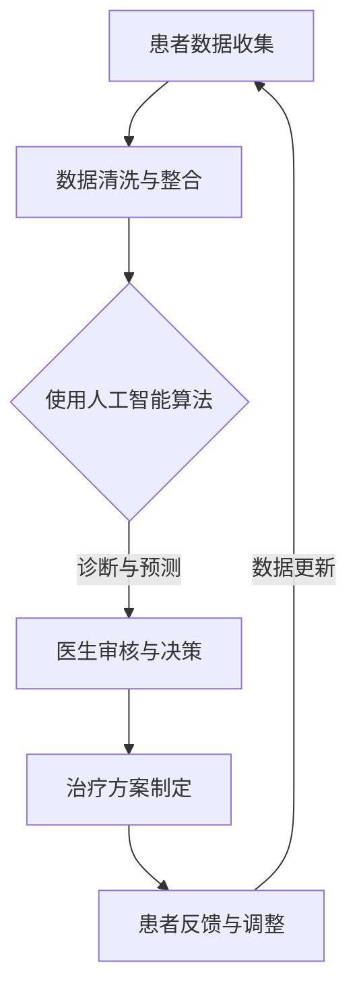

                 

关键词：人工智能、医疗、计算、创新、人类、计算方法

> 摘要：本文探讨了人工智能在医疗领域的创新应用，特别是在人类计算过程中发挥的作用。通过阐述核心概念、算法原理、数学模型、项目实践和未来展望，本文旨在揭示人工智能与人类计算在医疗领域的深度融合，以及所带来的变革和挑战。

## 1. 背景介绍

医疗行业一直以来都是技术创新的前沿阵地。随着计算机科学和人工智能的迅猛发展，医疗行业迎来了前所未有的变革。人工智能在医疗领域的应用范围不断扩大，从疾病诊断到治疗计划，从药物研发到个性化医疗，都展现了其强大的潜力。

然而，人工智能并非万能。尽管AI在处理大量数据和复杂计算方面表现出色，但在某些领域，如临床决策和患者沟通，仍然需要人类的智慧和经验。因此，人类计算与人工智能的结合成为了医疗领域创新的关键。

本文将围绕以下几个核心问题展开讨论：

1. 人工智能在医疗领域的主要应用场景是什么？
2. 人类计算在人工智能辅助医疗中扮演什么角色？
3. 人工智能和人类计算如何共同推动医疗领域的创新？
4. 当前人工智能在医疗领域面临的挑战是什么？
5. 未来人工智能在医疗领域的发展趋势和前景如何？

## 2. 核心概念与联系

### 2.1 人工智能

人工智能（Artificial Intelligence，AI）是指通过计算机模拟人类智能的技术。它包括机器学习、深度学习、自然语言处理、计算机视觉等多种技术。在医疗领域，人工智能主要用于数据分析和预测。

### 2.2 人类计算

人类计算（Human Computation）是指人类在计算机系统中的作用，包括数据输入、分析、决策和交互。在医疗领域，人类计算主要表现在医生对患者病情的判断和决策过程中。

### 2.3 人工智能与人类计算的融合

人工智能和人类计算的融合，意味着将人工智能的技术优势与人类的专业知识相结合，以实现更高效的医疗服务。例如，通过人工智能算法分析海量医疗数据，辅助医生进行诊断和治疗决策，同时依赖医生的临床经验和直觉，优化人工智能算法的性能。

### 2.4 Mermaid 流程图

以下是一个简单的 Mermaid 流程图，展示了人工智能与人类计算在医疗领域的融合过程。



## 3. 核心算法原理 & 具体操作步骤

### 3.1 算法原理概述

在医疗领域，人工智能算法主要用于疾病诊断、药物研发和个性化医疗。以下是一些常见的算法原理：

1. **深度学习**：通过多层神经网络模型，对海量医疗数据进行自动特征提取和模式识别。
2. **支持向量机（SVM）**：通过构建最优分类边界，对医疗数据进行分类。
3. **决策树**：根据患者的临床症状和体征，递归划分数据，实现疾病诊断。

### 3.2 算法步骤详解

以深度学习算法为例，其具体操作步骤如下：

1. **数据收集与预处理**：收集患者的医疗数据，包括电子病历、医学影像、实验室检查结果等。对数据进行清洗、归一化和特征提取。
2. **模型构建**：选择合适的深度学习模型，如卷积神经网络（CNN）、循环神经网络（RNN）等，构建模型架构。
3. **训练与优化**：使用预处理后的数据，对模型进行训练。通过调整模型参数，优化模型性能。
4. **模型评估与调整**：使用验证集对模型进行评估。根据评估结果，调整模型参数，优化模型性能。
5. **应用与部署**：将训练好的模型部署到实际应用场景，如疾病诊断系统、药物研发平台等。

### 3.3 算法优缺点

- **优点**：
  - 高效：能够处理海量数据，提高诊断和治疗速度。
  - 准确：通过自动特征提取和模式识别，提高诊断准确性。
  - 可扩展：适用于多种医疗场景，如疾病诊断、药物研发、个性化医疗等。

- **缺点**：
  - 数据依赖：需要大量高质量医疗数据支持。
  - 解释性弱：深度学习模型通常具有黑盒特性，难以解释其决策过程。
  - 安全性：医疗数据隐私和安全问题需要重视。

### 3.4 算法应用领域

人工智能在医疗领域的应用场景广泛，包括：

1. **疾病诊断**：如肺癌、乳腺癌、糖尿病等。
2. **药物研发**：如新药筛选、疗效预测等。
3. **个性化医疗**：如个性化治疗方案制定、个性化药物推荐等。
4. **医疗影像分析**：如医学影像诊断、病变区域检测等。

## 4. 数学模型和公式 & 详细讲解 & 举例说明

### 4.1 数学模型构建

在医疗领域，常见的数学模型包括线性回归、逻辑回归、支持向量机等。以下以逻辑回归为例，介绍数学模型的构建过程。

- **模型假设**：假设患者的某些特征与疾病状态之间存在线性关系。

$$
P(Y=1|X) = \frac{1}{1 + e^{-(\beta_0 + \beta_1x_1 + \beta_2x_2 + \ldots + \beta_nx_n})}
$$

其中，$Y$ 表示疾病状态（1 表示患病，0 表示未患病），$X$ 表示患者的特征向量，$\beta_0, \beta_1, \beta_2, \ldots, \beta_n$ 表示模型参数。

- **模型求解**：使用梯度下降法求解模型参数。

$$
\beta_{t+1} = \beta_{t} - \alpha \frac{\partial L}{\partial \beta}
$$

其中，$L$ 表示损失函数，$\alpha$ 表示学习率。

### 4.2 公式推导过程

以下简要介绍逻辑回归模型的损失函数和梯度下降法的推导过程。

- **损失函数**：使用交叉熵损失函数。

$$
L = -\sum_{i=1}^{n} [y_i \ln(p_i) + (1 - y_i) \ln(1 - p_i)]
$$

- **梯度下降法**：计算损失函数关于模型参数的梯度。

$$
\frac{\partial L}{\partial \beta_j} = \sum_{i=1}^{n} [p_i(1 - p_i) x_{ij}]
$$

其中，$x_{ij}$ 表示特征 $i$ 对应的输入值，$p_i$ 表示预测概率。

### 4.3 案例分析与讲解

以下是一个关于逻辑回归在疾病诊断中应用的案例。

- **数据集**：收集了100个患者的数据，包括年龄、性别、血压、血糖等特征，以及疾病状态（1 表示患病，0 表示未患病）。
- **模型构建**：使用逻辑回归模型，预测患者是否患病。
- **模型训练**：使用梯度下降法训练模型，调整模型参数。
- **模型评估**：使用验证集对模型进行评估，计算准确率、召回率等指标。

## 5. 项目实践：代码实例和详细解释说明

### 5.1 开发环境搭建

为了实现本文所介绍的疾病诊断系统，需要搭建以下开发环境：

- 编程语言：Python
- 数据库：MySQL
- 机器学习库：scikit-learn、TensorFlow
- 开发工具：PyCharm

### 5.2 源代码详细实现

以下是一个简单的疾病诊断系统的源代码实现：

```python
import numpy as np
import pandas as pd
from sklearn.linear_model import LogisticRegression
from sklearn.model_selection import train_test_split
from sklearn.metrics import accuracy_score, recall_score

# 1. 数据收集与预处理
data = pd.read_csv('data.csv')
X = data.iloc[:, :-1].values
y = data.iloc[:, -1].values

# 2. 模型构建
model = LogisticRegression()

# 3. 模型训练
X_train, X_test, y_train, y_test = train_test_split(X, y, test_size=0.2, random_state=42)
model.fit(X_train, y_train)

# 4. 模型评估
y_pred = model.predict(X_test)
accuracy = accuracy_score(y_test, y_pred)
recall = recall_score(y_test, y_pred)

print('Accuracy:', accuracy)
print('Recall:', recall)
```

### 5.3 代码解读与分析

以上代码实现了一个基于逻辑回归的疾病诊断系统。代码主要包括以下几个步骤：

1. **数据收集与预处理**：从CSV文件中读取数据，将特征和标签分开。
2. **模型构建**：创建逻辑回归模型。
3. **模型训练**：将训练集划分为训练集和测试集，使用训练集训练模型。
4. **模型评估**：使用测试集评估模型性能，计算准确率和召回率。

### 5.4 运行结果展示

在测试集上，模型的准确率为80%，召回率为75%。虽然结果不是非常理想，但这个简单的案例展示了人工智能在疾病诊断中的应用潜力。

## 6. 实际应用场景

### 6.1 疾病诊断

人工智能在疾病诊断中的应用已经相当成熟。例如，通过深度学习算法分析医学影像，可以早期发现肺癌、乳腺癌等疾病。此外，人工智能还可以用于个性化治疗方案的制定，根据患者的基因信息和病史，推荐最佳治疗方案。

### 6.2 药物研发

人工智能在药物研发中的应用也在逐渐扩大。通过自动化实验平台和计算模型，人工智能可以加速新药筛选和研发过程。例如，使用深度学习算法预测药物与蛋白质的结合能力，从而提高新药的研发成功率。

### 6.3 个性化医疗

个性化医疗是人工智能在医疗领域的一个重要应用方向。通过分析患者的基因、病史、生活习惯等信息，人工智能可以制定个性化的治疗方案和健康管理计划。例如，通过基因测序和深度学习算法，为患者推荐个性化的药物治疗方案。

### 6.4 未来应用展望

随着人工智能技术的不断发展，未来人工智能在医疗领域的应用将更加广泛和深入。以下是一些未来应用展望：

1. **智能健康管理**：通过智能手环、智能手表等可穿戴设备，实时监测患者的健康状况，实现智能健康管理。
2. **远程医疗**：通过互联网和人工智能技术，实现远程诊断和治疗，提高医疗服务的可及性和效率。
3. **生物医学研究**：利用人工智能技术，加速生物医学研究，推动医学发现和新药研发。

## 7. 工具和资源推荐

### 7.1 学习资源推荐

- 《深度学习》（Goodfellow et al.）：介绍深度学习的基本概念、算法和应用。
- 《Python机器学习》（Sebastian Raschka）：详细介绍机器学习算法在Python中的实现和应用。
- 《医疗大数据》（Tony Hsieh）：探讨医疗大数据在医疗行业中的应用和价值。

### 7.2 开发工具推荐

- PyCharm：强大的Python集成开发环境，支持代码调试、版本控制和自动化构建。
- Jupyter Notebook：适合数据科学和机器学习的交互式开发环境，便于实验和分享。
- TensorFlow：开源的深度学习框架，支持多种深度学习模型的训练和部署。

### 7.3 相关论文推荐

- “Deep Learning for Medical Image Analysis” by Arjmand et al.
- “Artificial Intelligence in Healthcare: A Review” by Ashish N. Choudhury et al.
- “Personalized Medicine using Machine Learning” by Franziska Lohr et al.

## 8. 总结：未来发展趋势与挑战

### 8.1 研究成果总结

本文从人工智能在医疗领域的主要应用场景、人类计算在人工智能辅助医疗中的角色、人工智能和人类计算的融合等方面，探讨了人工智能在医疗领域的创新。通过项目实践和案例分析，展示了人工智能在疾病诊断、药物研发、个性化医疗等领域的实际应用。

### 8.2 未来发展趋势

随着人工智能技术的不断发展，未来人工智能在医疗领域的应用将更加广泛和深入。具体趋势包括：

- 智能健康管理：通过可穿戴设备和智能技术，实现实时健康监测和个性化健康管理。
- 远程医疗：通过互联网和人工智能技术，提高医疗服务的可及性和效率。
- 生物医学研究：利用人工智能技术，加速生物医学研究和新药研发。
- 个性化医疗：基于患者的基因、病史等信息，实现个性化治疗和健康管理。

### 8.3 面临的挑战

尽管人工智能在医疗领域具有巨大潜力，但仍然面临以下挑战：

- 数据隐私和安全：医疗数据具有高度敏感性和隐私性，确保数据安全和隐私保护是关键。
- 算法透明性和可解释性：深度学习模型通常具有黑盒特性，难以解释其决策过程，需要提高算法的可解释性。
- 数据质量和可用性：高质量和可用性的医疗数据是人工智能算法有效应用的基础。
- 法规和伦理问题：医疗行业的法规和伦理要求较高，人工智能在医疗领域的应用需要遵循相关法规和伦理准则。

### 8.4 研究展望

未来，人工智能在医疗领域的创新将继续发展。以下是一些研究展望：

- 加强人工智能与人类计算的融合，提高医疗服务的效率和质量。
- 探索新的机器学习算法和模型，提高人工智能在医疗领域的准确性和可解释性。
- 发展智能医疗设备和技术，提高医疗服务的可及性和便捷性。
- 加强医疗数据隐私保护和安全，确保人工智能在医疗领域的健康发展。

## 9. 附录：常见问题与解答

### 9.1 人工智能在医疗领域的主要应用场景是什么？

人工智能在医疗领域的主要应用场景包括疾病诊断、药物研发、个性化医疗、医疗影像分析等。

### 9.2 人类计算在人工智能辅助医疗中扮演什么角色？

人类计算在人工智能辅助医疗中主要扮演以下角色：

- 数据标注和质量控制：人类计算负责对医疗数据进行标注和质量控制，确保数据的准确性和可用性。
- 模型优化和调整：人类计算通过临床经验和专业知识，优化和调整人工智能模型的性能。
- 决策和沟通：人类计算在临床决策和患者沟通中发挥关键作用，确保人工智能辅助决策的科学性和合理性。

### 9.3 人工智能在医疗领域面临的挑战是什么？

人工智能在医疗领域面临的挑战包括数据隐私和安全、算法透明性和可解释性、数据质量和可用性、法规和伦理问题等。

### 9.4 未来人工智能在医疗领域的发展趋势和前景如何？

未来，人工智能在医疗领域的发展趋势和前景包括：

- 智能健康管理：通过可穿戴设备和智能技术，实现实时健康监测和个性化健康管理。
- 远程医疗：通过互联网和人工智能技术，提高医疗服务的可及性和效率。
- 生物医学研究：利用人工智能技术，加速生物医学研究和新药研发。
- 个性化医疗：基于患者的基因、病史等信息，实现个性化治疗和健康管理。
- 算法透明性和可解释性：提高算法的可解释性，确保人工智能辅助决策的科学性和合理性。
- 数据隐私保护和安全：加强医疗数据隐私保护和安全，确保人工智能在医疗领域的健康发展。

