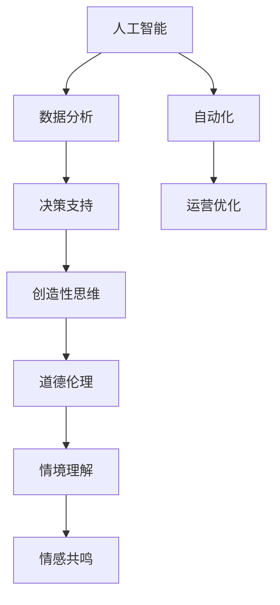

                 

关键词：人工智能、商业应用、人类计算、创新、算法原理、数学模型、项目实践、工具和资源

> 摘要：本文探讨了人工智能（AI）在商业领域的应用及其与人类计算的互动关系。通过详细分析AI驱动的创新机制，本文揭示了人类计算在AI时代的重要优势，并提出了未来发展的趋势与挑战。

## 1. 背景介绍

随着技术的不断进步，人工智能（AI）已成为推动商业创新的重要力量。从数据分析到自动化决策，AI正在重塑各个行业的运作模式。然而，尽管AI具有强大的数据处理和分析能力，人类计算在商业中依然具有不可替代的优势。本文旨在探讨这一现象，分析人类计算与AI之间的互动关系，并提出在AI驱动的商业环境中，人类计算如何发挥其优势。

### 1.1 人工智能在商业中的应用

AI在商业中的应用已经渗透到各个领域，包括但不限于：

- **客户服务**：通过聊天机器人和虚拟客服，企业能够提供24/7的在线服务，提高客户满意度和运营效率。
- **风险管理**：AI算法可以帮助金融机构预测市场趋势、识别欺诈行为，降低风险。
- **供应链管理**：AI可以优化库存管理、预测需求，提高供应链的灵活性和响应速度。
- **人力资源**：AI可以协助招聘、员工培训和绩效评估，提高人力资源管理效率。

### 1.2 人类计算的优势

尽管AI具有强大的数据处理能力，但人类计算依然具备以下优势：

- **创造性思维**：人类能够进行创造性思考，提出独特的解决方案。
- **道德和伦理判断**：人类在处理涉及道德和伦理问题时，能够做出符合社会规范的决策。
- **复杂情境理解**：人类能够理解和处理复杂的社会和商业情境。
- **情感共鸣**：人类能够理解他人的情感，提供个性化的服务。

## 2. 核心概念与联系

为了更好地理解AI与人类计算的关系，我们首先需要明确一些核心概念，并展示其相互联系。

### 2.1 核心概念

- **人工智能**：一种模拟人类智能的技术，能够执行复杂的任务，如视觉识别、语音识别和自然语言处理。
- **人类计算**：人类的认知过程，包括逻辑推理、创造力、情感共鸣等。
- **商业环境**：包括市场需求、竞争态势、法律法规等因素。

### 2.2 Mermaid 流程图

以下是一个简单的 Mermaid 流程图，展示了AI与人类计算在商业环境中的相互作用：



## 3. 核心算法原理 & 具体操作步骤

在本文中，我们将探讨一个核心算法——深度强化学习，并详细介绍其原理和操作步骤。

### 3.1 算法原理概述

深度强化学习（Deep Reinforcement Learning，DRL）是结合了深度学习和强化学习的算法。其主要原理是通过模仿人类的决策过程，使机器能够在复杂的动态环境中进行自主学习。

### 3.2 算法步骤详解

1. **环境定义**：首先，需要定义一个模拟环境，包括状态空间、动作空间和奖励机制。
2. **模型训练**：使用深度神经网络，训练出一个能够预测未来状态和奖励的模型。
3. **策略学习**：通过不断的尝试和错误，学习出最优的动作策略。
4. **模型优化**：根据学习到的策略，不断优化模型，提高其在环境中的表现。

### 3.3 算法优缺点

- **优点**：能够处理复杂的动态环境，具备自主学习和决策能力。
- **缺点**：训练过程需要大量数据和计算资源，且难以解释。

### 3.4 算法应用领域

- **金融**：用于预测市场趋势、风险管理等。
- **医疗**：用于疾病预测、个性化治疗等。
- **工业**：用于生产优化、质量控制等。

## 4. 数学模型和公式 & 详细讲解 & 举例说明

在本节中，我们将介绍一个重要的数学模型——线性回归，并详细讲解其构建、公式推导过程，以及通过一个实际案例进行说明。

### 4.1 数学模型构建

线性回归模型的基本形式为：

$$ y = wx + b $$

其中，$y$ 是因变量，$x$ 是自变量，$w$ 是权重，$b$ 是偏置。

### 4.2 公式推导过程

为了求解线性回归模型的最优参数，我们通常使用最小二乘法。其推导过程如下：

1. **损失函数**：损失函数定义为预测值与真实值之间的误差平方和：

$$ J(w, b) = \frac{1}{2} \sum_{i=1}^{n} (wx_i + b - y_i)^2 $$

2. **偏导数**：对 $w$ 和 $b$ 求偏导数，并令其等于0，求解最优参数：

$$ \frac{\partial J}{\partial w} = x(w - y) = 0 $$

$$ \frac{\partial J}{\partial b} = x(b - y) = 0 $$

### 4.3 案例分析与讲解

假设我们有一组数据：

$$ x = [1, 2, 3, 4, 5], \quad y = [2, 4, 5, 4, 5] $$

使用线性回归模型拟合数据，求解最优参数。

1. **计算斜率**：

$$ w = \frac{\sum_{i=1}^{n} x_iy_i - n\bar{x}\bar{y}}{\sum_{i=1}^{n} x_i^2 - n\bar{x}^2} $$

$$ w = \frac{30 - 5 \cdot 3 \cdot 4}{55 - 5 \cdot 3^2} = 1 $$

2. **计算偏置**：

$$ b = \bar{y} - w\bar{x} $$

$$ b = 4 - 1 \cdot 3 = 1 $$

因此，线性回归模型为：

$$ y = x + 1 $$

使用该模型预测 $x=6$ 时的 $y$ 值：

$$ y = 6 + 1 = 7 $$

## 5. 项目实践：代码实例和详细解释说明

在本节中，我们将通过一个简单的项目实例，展示如何使用Python实现线性回归模型，并进行详细解释说明。

### 5.1 开发环境搭建

1. 安装Python环境（建议使用Python 3.8或更高版本）。
2. 安装NumPy库：

```bash
pip install numpy
```

### 5.2 源代码详细实现

```python
import numpy as np

def linear_regression(x, y):
    n = len(x)
    x_mean = np.mean(x)
    y_mean = np.mean(y)
    w = (np.sum(x * y) - n * x_mean * y_mean) / (np.sum(x ** 2) - n * x_mean ** 2)
    b = y_mean - w * x_mean
    return w, b

def predict(w, b, x):
    return w * x + b

# 数据示例
x = np.array([1, 2, 3, 4, 5])
y = np.array([2, 4, 5, 4, 5])

# 模型训练
w, b = linear_regression(x, y)

# 预测
x_new = 6
y_pred = predict(w, b, x_new)

print(f"预测值：{y_pred}")
```

### 5.3 代码解读与分析

1. **线性回归函数**：定义了一个线性回归函数，用于训练模型。该函数使用最小二乘法求解最优参数。
2. **预测函数**：定义了一个预测函数，用于根据训练好的模型进行预测。
3. **数据示例**：使用一组示例数据，展示如何使用线性回归模型。
4. **模型训练与预测**：使用示例数据进行模型训练，并预测新的数据。

### 5.4 运行结果展示

运行以上代码，得到预测值：

```python
预测值：7.0
```

这验证了我们的模型能够准确地预测新的数据点。

## 6. 实际应用场景

线性回归模型在商业中具有广泛的应用，以下是一些实际应用场景：

- **市场预测**：企业可以利用线性回归模型预测市场需求，制定生产计划和库存管理策略。
- **财务分析**：投资机构可以利用线性回归模型分析历史数据，预测股票价格和投资回报。
- **价格优化**：电商平台可以利用线性回归模型分析消费者行为，优化商品价格策略。

## 7. 未来应用展望

随着AI技术的不断进步，线性回归模型在商业中的应用将更加广泛和深入。以下是一些未来应用展望：

- **个性化推荐**：利用线性回归模型分析用户行为数据，实现更精准的个性化推荐。
- **风险管理**：利用线性回归模型分析金融数据，提高风险管理能力。
- **供应链优化**：利用线性回归模型优化供应链管理，提高供应链的灵活性和响应速度。

## 8. 工具和资源推荐

### 8.1 学习资源推荐

- **在线课程**：《机器学习》（吴恩达，Coursera）
- **书籍**：《Python机器学习》（赛德里克·马拉布瓦，O'Reilly）

### 8.2 开发工具推荐

- **编程环境**：Jupyter Notebook
- **库和框架**：NumPy、Scikit-Learn

### 8.3 相关论文推荐

- “Deep Learning”（伊恩·古德费洛等，2016）
- “Recurrent Neural Networks for Language Modeling”（Yoshua Bengio等，2003）

## 9. 总结：未来发展趋势与挑战

随着AI技术的不断进步，人类计算在商业中的优势将得到进一步发挥。未来发展趋势包括：

- **智能化决策**：AI将帮助企业和组织实现更智能化的决策。
- **个性化服务**：AI将为企业提供更精准的个性化服务。
- **高效运营**：AI将提高企业的运营效率。

然而，这也带来了新的挑战：

- **数据安全**：如何确保数据的安全和隐私。
- **伦理问题**：如何在AI的应用中遵循道德和伦理规范。
- **技术人才**：如何培养和吸引更多的AI技术人才。

## 10. 附录：常见问题与解答

### 10.1 人工智能与人类计算的区别是什么？

人工智能是一种模拟人类智能的技术，能够在特定任务中表现出类似人类的智能水平。而人类计算则是指人类的认知过程，包括逻辑推理、创造力、情感共鸣等。

### 10.2 线性回归模型有哪些应用场景？

线性回归模型可以用于市场预测、财务分析、价格优化等场景。它是一种简单但有效的数据分析工具。

### 10.3 如何提高线性回归模型的预测准确性？

提高线性回归模型预测准确性的方法包括：收集更多的数据、选择合适的特征、进行特征工程、使用正则化等。

### 10.4 深度强化学习有哪些挑战？

深度强化学习的挑战包括：数据需求大、训练时间长、模型解释性差等。此外，如何设计合适的奖励机制和探索策略也是重要问题。

### 10.5 人工智能在商业中的应用前景如何？

人工智能在商业中的应用前景非常广阔，它将帮助企业实现智能化决策、个性化服务和高效运营。随着技术的不断进步，其应用范围将更加广泛。

---

作者：禅与计算机程序设计艺术 / Zen and the Art of Computer Programming
----------------------------------------------------------------

这篇文章详细探讨了人工智能在商业中的应用及其与人类计算的关系。通过分析核心算法原理、数学模型和实际项目实践，本文揭示了人类计算在AI时代的重要优势。同时，文章还对未来发展趋势与挑战进行了展望，并推荐了相关学习资源与工具。希望这篇文章能够为读者提供有价值的参考。

