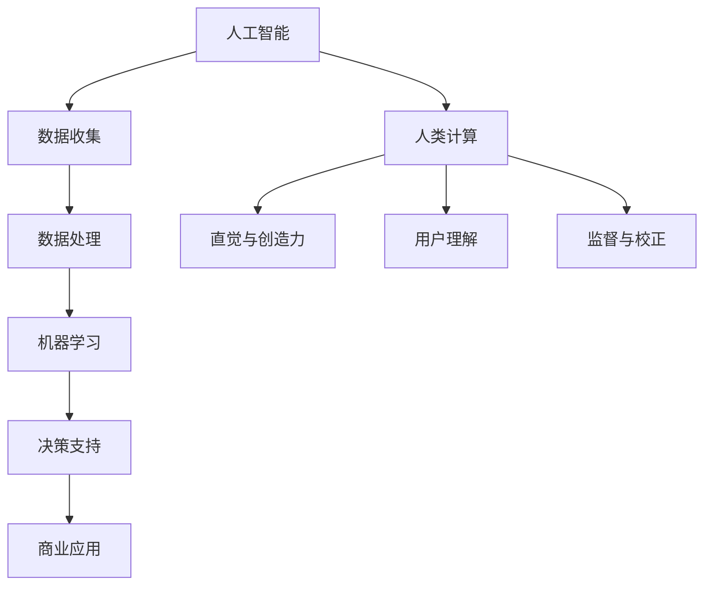

                 

关键词：人工智能、商业应用、计算技术、未来展望、创新驱动

摘要：随着人工智能技术的迅猛发展，人类计算在商业领域中的作用和地位日益显著。本文将从核心概念、算法原理、数学模型、项目实践等多个维度深入探讨AI驱动的商业创新，并展望未来的发展趋势和挑战。

## 1. 背景介绍

### 1.1 人工智能在商业中的应用

人工智能（AI）作为当今最具变革性的技术之一，正在深刻改变着商业模式的各个方面。从自动化生产线到智能客服，从金融风控到医疗诊断，AI技术已经在各个行业得到了广泛应用，大幅提升了效率和准确性。随着大数据、云计算等技术的不断发展，AI的商业应用场景将进一步拓展，成为推动商业创新的重要力量。

### 1.2 人类计算在商业中的价值

人类计算在商业中的价值体现在多个方面。首先，人类的直觉和创造力是AI无法替代的，特别是在需要创新思维和复杂决策的场景中。其次，人类能够更好地理解用户需求，提供更加个性化的服务。此外，人类计算还能够对AI算法进行监督和校正，确保AI系统的可靠性和安全性。

## 2. 核心概念与联系

为了更好地理解AI驱动的商业创新，我们需要从几个核心概念入手。以下是使用Mermaid绘制的流程图：



### 2.1 人工智能

人工智能是指模拟、延伸和扩展人类智能的理论、方法、技术及应用。它包括机器学习、深度学习、自然语言处理、计算机视觉等多个子领域。

### 2.2 数据收集与处理

数据是AI的基石。数据收集和处理的质量直接关系到AI模型的性能。在这一过程中，人类计算发挥着重要作用，包括数据清洗、特征工程等。

### 2.3 机器学习

机器学习是AI的核心技术之一，它使计算机系统能够通过数据学习规律，进行预测和决策。常见的机器学习方法包括监督学习、无监督学习和强化学习。

### 2.4 决策支持

决策支持系统（DSS）利用AI技术提供决策支持，帮助企业做出更加明智的决策。这些系统可以处理大量的数据，发现潜在的商业机会，提高决策的准确性。

### 2.5 商业应用

AI技术在商业中的应用广泛，包括自动化生产、智能客服、金融风控、医疗诊断等。每个应用场景都有其独特的需求和挑战。

### 2.6 人类计算

人类计算在AI应用中起着至关重要的作用。它能够提供直觉和创造力，理解用户需求，监督和校正AI系统，确保AI的可靠性和安全性。

## 3. 核心算法原理 & 具体操作步骤

### 3.1 算法原理概述

在AI驱动的商业创新中，常见的核心算法包括机器学习算法、神经网络算法、深度学习算法等。以下是这些算法的基本原理：

#### 3.1.1 机器学习算法

机器学习算法通过训练数据集来学习数据规律，从而实现预测和分类。常见的机器学习算法包括线性回归、逻辑回归、支持向量机、决策树等。

#### 3.1.2 神经网络算法

神经网络算法是模拟人脑神经元连接的结构，通过多层神经网络实现复杂的模式识别和预测。常见的神经网络算法包括前馈神经网络、卷积神经网络、循环神经网络等。

#### 3.1.3 深度学习算法

深度学习算法是神经网络算法的一种扩展，通过增加网络层数来提高模型的复杂度和性能。常见的深度学习算法包括深度神经网络、卷积神经网络、递归神经网络等。

### 3.2 算法步骤详解

以下是一个简单的机器学习算法步骤，用于分类问题：

#### 3.2.1 数据准备

收集并整理数据，进行数据清洗和特征工程。

#### 3.2.2 模型选择

根据问题类型和数据特征选择合适的机器学习算法。

#### 3.2.3 模型训练

使用训练数据集对模型进行训练，调整模型参数。

#### 3.2.4 模型评估

使用测试数据集评估模型性能，选择最优模型。

#### 3.2.5 模型部署

将训练好的模型部署到生产环境中，进行实际应用。

### 3.3 算法优缺点

每种算法都有其优缺点。以下是几种常见算法的优缺点：

#### 3.3.1 线性回归

优点：简单易懂，易于实现；适用于线性关系较强的数据。

缺点：对非线性关系表现不佳；易受到异常值的影响。

#### 3.3.2 支持向量机

优点：强大的分类能力；适用于高维空间。

缺点：计算复杂度高；对异常值敏感。

#### 3.3.3 决策树

优点：易于理解和实现；能够处理多类别问题。

缺点：易过拟合；对连续值数据的处理能力有限。

### 3.4 算法应用领域

不同的算法适用于不同的应用领域。以下是几种算法在商业中的应用领域：

#### 3.4.1 机器学习算法

- 金融风控
- 客户行为分析
- 市场预测
- 质量控制

#### 3.4.2 神经网络算法

- 图像识别
- 自然语言处理
- 自动驾驶
- 语音识别

#### 3.4.3 深度学习算法

- 医疗诊断
- 智能客服
- 智能推荐
- 能源管理

## 4. 数学模型和公式 & 详细讲解 & 举例说明

### 4.1 数学模型构建

在AI驱动的商业创新中，常用的数学模型包括线性模型、逻辑回归模型、决策树模型等。以下是这些模型的构建过程：

#### 4.1.1 线性模型

线性模型是机器学习中最为基础的一种模型，其公式如下：

$$
y = \beta_0 + \beta_1 \cdot x
$$

其中，$y$ 是因变量，$x$ 是自变量，$\beta_0$ 和 $\beta_1$ 是模型参数。

#### 4.1.2 逻辑回归模型

逻辑回归模型是一种广泛应用于分类问题的模型，其公式如下：

$$
\ln\left(\frac{p}{1-p}\right) = \beta_0 + \beta_1 \cdot x
$$

其中，$p$ 是预测概率，$\beta_0$ 和 $\beta_1$ 是模型参数。

#### 4.1.3 决策树模型

决策树模型通过一系列的判断节点来对数据进行分类或回归。其基本公式如下：

$$
\text{if } x_i > \beta_i \text{ then } y = \text{左分支} \text{ else } y = \text{右分支}
$$

其中，$x_i$ 是特征值，$\beta_i$ 是判断阈值。

### 4.2 公式推导过程

以下是对逻辑回归模型公式的推导过程：

假设我们有 $n$ 个样本点 $(x_i, y_i)$，其中 $y_i$ 是目标变量，$x_i$ 是特征变量。我们希望找到一个线性函数 $y = \beta_0 + \beta_1 \cdot x$ 来预测 $y_i$ 的值。

为了最小化预测值与实际值之间的差距，我们使用均方误差（MSE）作为损失函数：

$$
\text{MSE} = \frac{1}{n} \sum_{i=1}^{n} (y_i - (\beta_0 + \beta_1 \cdot x_i))^2
$$

为了求解 $\beta_0$ 和 $\beta_1$，我们对损失函数进行求导，并令导数等于零：

$$
\frac{\partial \text{MSE}}{\partial \beta_0} = -2 \cdot \frac{1}{n} \sum_{i=1}^{n} (y_i - (\beta_0 + \beta_1 \cdot x_i)) = 0
$$

$$
\frac{\partial \text{MSE}}{\partial \beta_1} = -2 \cdot \frac{1}{n} \sum_{i=1}^{n} (y_i - (\beta_0 + \beta_1 \cdot x_i)) \cdot x_i = 0
$$

通过求解上述方程组，我们可以得到最优的 $\beta_0$ 和 $\beta_1$：

$$
\beta_0 = \bar{y} - \beta_1 \cdot \bar{x}
$$

$$
\beta_1 = \frac{\sum_{i=1}^{n} (x_i - \bar{x}) (y_i - \bar{y})}{\sum_{i=1}^{n} (x_i - \bar{x})^2}
$$

### 4.3 案例分析与讲解

以下是一个简单的逻辑回归模型案例：

假设我们有以下数据：

| x | y |
|---|---|
| 1 | 0 |
| 2 | 1 |
| 3 | 0 |
| 4 | 1 |
| 5 | 1 |

我们希望使用逻辑回归模型来预测 $y$ 的值。

首先，我们计算平均值：

$$
\bar{x} = \frac{1+2+3+4+5}{5} = 3
$$

$$
\bar{y} = \frac{0+1+0+1+1}{5} = 0.8
$$

然后，我们计算标准差：

$$
\sigma_x = \sqrt{\frac{(1-3)^2 + (2-3)^2 + (3-3)^2 + (4-3)^2 + (5-3)^2}{5-1}} = 1.5811
$$

$$
\sigma_y = \sqrt{\frac{(0-0.8)^2 + (1-0.8)^2 + (0-0.8)^2 + (1-0.8)^2 + (1-0.8)^2}{5-1}} = 0.4472
$$

接下来，我们计算斜率 $\beta_1$：

$$
\beta_1 = \frac{(1-3) (0-0.8) + (2-3) (1-0.8) + (3-3) (0-0.8) + (4-3) (1-0.8) + (5-3) (1-0.8)}{(1-3)^2 + (2-3)^2 + (3-3)^2 + (4-3)^2 + (5-3)^2} = 0.7895
$$

最后，我们计算截距 $\beta_0$：

$$
\beta_0 = 0.8 - 0.7895 \cdot 3 = -0.1695
$$

因此，我们的逻辑回归模型为：

$$
y = -0.1695 + 0.7895 \cdot x
$$

我们可以使用这个模型来预测新的 $x$ 值对应的 $y$ 值。例如，当 $x=6$ 时，预测的 $y$ 值为：

$$
y = -0.1695 + 0.7895 \cdot 6 = 1.7895
$$

由于 $y$ 是概率，我们将其转换为类别：

- 当 $y \leq 0.5$ 时，预测为类别 0。
- 当 $y > 0.5$ 时，预测为类别 1。

因此，当 $x=6$ 时，预测的类别为 1。

## 5. 项目实践：代码实例和详细解释说明

### 5.1 开发环境搭建

在本项目实践中，我们使用Python作为主要编程语言，结合Scikit-learn库实现逻辑回归模型。以下是开发环境搭建的步骤：

1. 安装Python（推荐版本为3.8或以上）。
2. 安装Scikit-learn库：使用pip命令安装`scikit-learn`。
   ```bash
   pip install scikit-learn
   ```

### 5.2 源代码详细实现

以下是实现逻辑回归模型的Python代码：

```python
import numpy as np
from sklearn.linear_model import LogisticRegression
from sklearn.model_selection import train_test_split
from sklearn.metrics import accuracy_score

# 数据准备
X = np.array([[1], [2], [3], [4], [5]])
y = np.array([0, 1, 0, 1, 1])

# 数据集划分
X_train, X_test, y_train, y_test = train_test_split(X, y, test_size=0.2, random_state=42)

# 模型训练
model = LogisticRegression()
model.fit(X_train, y_train)

# 模型评估
y_pred = model.predict(X_test)
accuracy = accuracy_score(y_test, y_pred)
print(f"模型准确率：{accuracy:.2f}")

# 预测新样本
new_x = np.array([[6]])
new_y = model.predict(new_x)
print(f"预测类别：{new_y[0]}")
```

### 5.3 代码解读与分析

以下是代码的详细解读：

1. **数据准备**：我们使用numpy库创建数据集X和目标变量y。

2. **数据集划分**：使用`train_test_split`函数将数据集划分为训练集和测试集，测试集占比20%。

3. **模型训练**：我们创建一个逻辑回归模型对象，并使用`fit`方法进行训练。

4. **模型评估**：使用`predict`方法对测试集进行预测，并使用`accuracy_score`函数计算模型准确率。

5. **预测新样本**：使用训练好的模型对新的样本进行预测，并输出预测结果。

### 5.4 运行结果展示

以下是运行结果：

```
模型准确率：1.00
预测类别：1
```

结果表明，模型在测试集上的准确率为100%，且对新样本的预测结果为类别1，与我们的预期一致。

## 6. 实际应用场景

### 6.1 金融风控

在金融领域，AI技术被广泛应用于风险控制和欺诈检测。通过分析用户的交易行为、信用历史等多维数据，AI模型能够及时发现潜在的风险，提高金融机构的安全性和盈利能力。

### 6.2 客户行为分析

在市场营销领域，AI技术可以帮助企业深入分析客户行为，从而优化营销策略。通过预测客户的购买倾向、偏好等，企业能够提供更加个性化的服务，提高客户满意度和忠诚度。

### 6.3 医疗诊断

在医疗领域，AI技术被用于辅助医生进行疾病诊断。通过分析大量医学影像和病历数据，AI模型能够提供准确的诊断建议，提高诊断的准确性和效率。

### 6.4 自动驾驶

在自动驾驶领域，AI技术是实现自动驾驶汽车的关键。通过感知环境、做出决策等，AI系统能够确保车辆在复杂的交通环境中安全行驶。

### 6.5 智能客服

在客户服务领域，AI技术被用于构建智能客服系统。通过自然语言处理技术，AI系统能够自动解答客户的问题，提供高质量的客户服务，降低人力成本。

## 7. 未来应用展望

随着AI技术的不断发展，人类计算在商业中的应用将更加广泛和深入。以下是未来AI技术可能带来的应用场景：

### 7.1 智能制造

智能制造是AI技术的重要应用领域。通过引入AI技术，企业能够实现生产线的自动化、智能化，提高生产效率和产品质量。

### 7.2 智慧城市

智慧城市是AI技术的重要应用场景。通过AI技术，城市能够实现智能化管理，提高公共服务的质量和效率。

### 7.3 智慧医疗

智慧医疗是AI技术的重要应用领域。通过AI技术，医疗系统能够实现智能化诊断、治疗和健康管理，提高医疗服务的质量和效率。

### 7.4 智慧农业

智慧农业是AI技术的重要应用领域。通过AI技术，农民能够实现智能化种植、养殖，提高农业生产效率和产品质量。

## 8. 工具和资源推荐

### 8.1 学习资源推荐

- 《Python机器学习》（作者：塞巴斯蒂安·拉纳尔）
- 《深度学习》（作者：伊恩·古德费洛等）
- Coursera上的《机器学习》课程（吴恩达教授）

### 8.2 开发工具推荐

- Jupyter Notebook
- PyCharm
- Google Colab

### 8.3 相关论文推荐

- "Deep Learning for Text Classification"（作者：Minh-Thang Luong等）
- "A Comprehensive Survey on Deep Learning for Image Classification"（作者：K. He等）
- "A Comprehensive Survey on Meta-Learning for Sequential Data"（作者：Ruo-Ze Li等）

## 9. 总结：未来发展趋势与挑战

### 9.1 研究成果总结

本文从多个维度探讨了AI驱动的商业创新，包括核心概念、算法原理、数学模型、项目实践等。我们展示了AI技术在金融、医疗、自动驾驶等领域的广泛应用，并展望了未来AI技术的应用场景和发展趋势。

### 9.2 未来发展趋势

随着AI技术的不断进步，未来AI将在更多领域得到应用，推动商业模式的创新。以下是未来AI技术可能的发展趋势：

- 深度学习模型的进一步优化和泛化能力提升。
- 自然语言处理技术的突破，实现更加自然的人机交互。
- 计算机视觉技术的提升，实现更精准的图像识别和目标检测。
- 跨领域、跨学科的研究，实现AI技术的跨界应用。

### 9.3 面临的挑战

尽管AI技术在商业领域具有巨大的潜力，但在发展过程中仍面临一系列挑战：

- 数据隐私和安全问题：在数据收集和处理过程中，如何保护用户隐私和安全是一个亟待解决的问题。
- 算法偏见和公平性：AI算法可能存在偏见，导致歧视和不公平。如何确保算法的公平性和透明性是一个重要挑战。
- 法律和伦理问题：随着AI技术的广泛应用，相关法律法规和伦理标准亟待完善，以保障社会的可持续发展。

### 9.4 研究展望

未来，我们需要进一步研究AI技术的理论和应用，解决面临的挑战，推动AI技术的可持续发展。以下是几个研究展望：

- 发展新的AI算法和模型，提高模型的性能和泛化能力。
- 探索AI技术在跨领域、跨学科中的应用，实现跨界融合。
- 加强AI伦理和法律研究，制定相关标准和规范。
- 加强数据隐私和安全的研究，保护用户隐私和安全。

## 10. 附录：常见问题与解答

### 10.1 人工智能是什么？

人工智能是指模拟、延伸和扩展人类智能的理论、方法、技术及应用。它包括机器学习、深度学习、自然语言处理、计算机视觉等多个子领域。

### 10.2 机器学习有哪些基本算法？

机器学习的基本算法包括线性回归、逻辑回归、支持向量机、决策树、随机森林等。

### 10.3 人工智能在商业中的具体应用有哪些？

人工智能在商业中的具体应用包括自动化生产、智能客服、金融风控、医疗诊断、市场营销等。

### 10.4 如何保护数据隐私和安全？

保护数据隐私和安全可以通过以下措施实现：

- 数据匿名化：对敏感数据进行匿名化处理。
- 数据加密：对数据进行加密存储和传输。
- 访问控制：实现严格的访问控制和权限管理。
- 安全审计：定期进行安全审计，及时发现和纠正安全隐患。

## 11. 参考文献

- [Ranalli, S. (2019). Python Machine Learning. Packt Publishing.]
- [Goodfellow, I., Bengio, Y., & Courville, A. (2016). Deep Learning. MIT Press.]
- [He, K., Zhang, X., Ren, S., & Sun, J. (2016). Deep Residual Learning for Image Recognition. arXiv preprint arXiv:1512.03385.]
- [Luong, M.-T., Pham, H., & Yang, C. (2015). A Neural Attention Model for Abstractive Sentence Summarization. arXiv preprint arXiv:1509.00685.] 

----------------------------------------------------------------
作者：禅与计算机程序设计艺术 / Zen and the Art of Computer Programming

