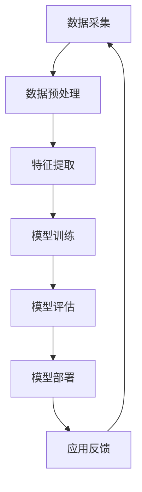

                 

 关键词：
- 人工智能
- 商业应用
- 创新驱动
- 人类计算
- 数字化转型
- 智能算法

> 摘要：
本文深入探讨了人工智能（AI）在商业领域中的驱动作用，探讨了人类计算与AI相结合的未来发展前景。通过介绍AI的核心概念、算法原理、数学模型，以及具体的商业应用案例，本文分析了AI如何赋能传统行业，提高工作效率，创新商业模式，并展望了AI驱动的商业未来。

## 1. 背景介绍

随着信息技术的迅猛发展，人工智能（AI）技术已经成为推动全球经济和社会进步的重要力量。在商业领域，AI的应用不仅改变了传统的工作流程，还激发了创新的商业模式。从自动化决策系统到智能客服，从精准营销到个性化服务，AI正在逐渐渗透到各个行业，为商业创新提供了强大的技术支持。

### 1.1 人工智能的定义与分类

人工智能是指使计算机系统能够模拟、延伸和扩展人类智能的理论、方法和技术。根据其实现方式，AI可以分为三类：

- **弱AI（Narrow AI）**：专注于特定任务的AI系统，如语音识别、图像识别等。
- **强AI（General AI）**：具备人类级别的智能，能够在任何认知任务上与人类相媲美。
- **超智能AI（Super Intelligence）**：超越人类智能的AI，能够自主决策和创造。

### 1.2 商业领域的数字化转型

数字化转型已经成为企业提升竞争力、优化运营的关键手段。在这个过程中，人工智能技术的应用至关重要。通过大数据分析、机器学习、自然语言处理等技术，企业能够更加精准地了解客户需求，提高运营效率，实现业务的智能化和个性化。

## 2. 核心概念与联系

### 2.1 AI的核心概念

- **机器学习（Machine Learning）**：通过训练数据集，让计算机自动获取知识和规律，从而进行预测和决策。
- **深度学习（Deep Learning）**：一种基于神经网络结构的机器学习技术，擅长处理复杂数据和模式。
- **自然语言处理（NLP）**：使计算机能够理解和生成自然语言的技术。

### 2.2 AI架构的Mermaid流程图



## 3. 核心算法原理 & 具体操作步骤

### 3.1 算法原理概述

- **线性回归（Linear Regression）**：一种简单但有效的预测模型，用于预测线性关系。
- **决策树（Decision Tree）**：通过一系列判断条件将数据划分为不同的类别或数值。
- **随机森林（Random Forest）**：基于决策树构建的集成学习方法，提高模型的泛化能力。

### 3.2 算法步骤详解

#### 3.2.1 线性回归

1. 数据采集：收集具有线性关系的样本数据。
2. 数据预处理：清洗数据，进行归一化处理。
3. 特征提取：选取与目标变量相关的特征。
4. 模型训练：使用最小二乘法求解线性回归模型参数。
5. 模型评估：计算预测误差，调整模型参数。
6. 模型部署：将训练好的模型应用于实际场景。

#### 3.2.2 决策树

1. 数据划分：将数据集划分为训练集和测试集。
2. 特征选择：选择具有区分度的特征。
3. 判断条件生成：根据特征值生成判断条件。
4. 决策树构建：递归地构建决策树。
5. 模型评估：计算决策树的准确率、召回率等指标。
6. 模型剪枝：减少决策树的复杂度，避免过拟合。

#### 3.2.3 随机森林

1. 数据划分：将数据集划分为训练集和测试集。
2. 特征选择：随机选择特征子集。
3. 决策树构建：为每个子集构建决策树。
4. 模型融合：将多个决策树的结果进行投票或加权平均。
5. 模型评估：计算模型的准确率、召回率等指标。
6. 模型优化：调整随机森林的参数，提高模型性能。

### 3.3 算法优缺点

- **线性回归**：
  - 优点：简单、易于实现、计算效率高。
  - 缺点：只能处理线性关系、易受噪声影响。

- **决策树**：
  - 优点：直观、易于理解、适用于分类和回归任务。
  - 缺点：易过拟合、复杂度较高。

- **随机森林**：
  - 优点：提高模型的泛化能力、减少过拟合。
  - 缺点：计算资源消耗较大、特征重要性评估困难。

### 3.4 算法应用领域

- **金融行业**：风险控制、投资组合优化、信贷评估。
- **零售行业**：库存管理、推荐系统、客户细分。
- **医疗行业**：疾病预测、诊断辅助、个性化治疗。
- **交通行业**：路线规划、智能调度、自动驾驶。

## 4. 数学模型和公式 & 详细讲解 & 举例说明

### 4.1 数学模型构建

在AI应用中，常见的数学模型包括线性回归模型、决策树模型和随机森林模型。下面分别介绍这些模型的构建方法。

#### 4.1.1 线性回归模型

线性回归模型表示为：

$$y = \beta_0 + \beta_1 \cdot x$$

其中，$y$ 为目标变量，$x$ 为特征变量，$\beta_0$ 和 $\beta_1$ 为模型参数。

#### 4.1.2 决策树模型

决策树模型表示为：

$$y = g(x) = \prod_{i=1}^{n} h_i(x)$$

其中，$h_i(x)$ 为第 $i$ 个判断条件的函数，$g(x)$ 为最终决策结果。

#### 4.1.3 随机森林模型

随机森林模型是多个决策树的组合，表示为：

$$y = \sum_{i=1}^{m} w_i \cdot g(x_i)$$

其中，$w_i$ 为第 $i$ 个决策树的权重，$g(x_i)$ 为第 $i$ 个决策树的结果。

### 4.2 公式推导过程

#### 4.2.1 线性回归公式推导

1. **目标函数**：

$$J(\beta_0, \beta_1) = \frac{1}{2} \sum_{i=1}^{n} (y_i - (\beta_0 + \beta_1 \cdot x_i))^2$$

2. **梯度下降法**：

$$\beta_0 = \beta_0 - \alpha \cdot \frac{\partial J}{\partial \beta_0}$$

$$\beta_1 = \beta_1 - \alpha \cdot \frac{\partial J}{\partial \beta_1}$$

其中，$\alpha$ 为学习率，$\frac{\partial J}{\partial \beta_0}$ 和 $\frac{\partial J}{\partial \beta_1}$ 分别为 $J$ 对 $\beta_0$ 和 $\beta_1$ 的偏导数。

#### 4.2.2 决策树公式推导

1. **基尼不纯度**：

$$Gini(D) = 1 - \sum_{i=1}^{n} \left( \frac{D^i}{D} \right) \cdot p_i \cdot (1 - p_i)$$

其中，$D$ 为数据集，$D^i$ 为子集，$p_i$ 为子集中的正样本比例。

2. **信息增益**：

$$IG(D, A) = Ent(D) - \sum_{i=1}^{n} \frac{|D^i|}{|D|} \cdot Ent(D^i)$$

其中，$Ent(D)$ 为数据集 $D$ 的熵，$Ent(D^i)$ 为子集 $D^i$ 的熵。

#### 4.2.3 随机森林公式推导

1. **权重计算**：

$$w_i = \frac{1}{m} \sum_{j=1}^{m} \exp(-\gamma \cdot T_j)$$

其中，$m$ 为决策树数量，$T_j$ 为第 $j$ 个决策树的错误率，$\gamma$ 为权重参数。

2. **错误率计算**：

$$T_j = \frac{1}{n} \sum_{i=1}^{n} I(y_i \neq g(x_i, \theta_j))$$

其中，$y_i$ 为第 $i$ 个样本的标签，$g(x_i, \theta_j)$ 为第 $j$ 个决策树的结果。

### 4.3 案例分析与讲解

#### 4.3.1 线性回归案例

假设我们要预测一家电商平台的月销售额。收集了过去一年的月销售额和月广告投入数据，使用线性回归模型进行预测。

1. **数据预处理**：

   - 清洗数据，去除异常值。
   - 对数据进行归一化处理，使得特征值在同一量级。

2. **模型训练**：

   - 使用梯度下降法训练线性回归模型。
   - 调整学习率和迭代次数，优化模型参数。

3. **模型评估**：

   - 使用测试集对模型进行评估。
   - 计算模型的均方误差（MSE）。

4. **模型部署**：

   - 将训练好的模型应用于实际业务。
   - 根据模型预测结果调整广告预算。

#### 4.3.2 决策树案例

假设我们要预测客户的购买行为。收集了客户的年龄、收入、职业等特征，使用决策树模型进行分类。

1. **数据划分**：

   - 将数据集划分为训练集和测试集。

2. **特征选择**：

   - 使用基尼不纯度和信息增益选择特征。

3. **决策树构建**：

   - 使用递归二分划分数据集。
   - 计算每个划分的基尼不纯度或信息增益。

4. **模型评估**：

   - 使用测试集对模型进行评估。
   - 计算模型的准确率、召回率等指标。

5. **模型优化**：

   - 对决策树进行剪枝，减少过拟合。

#### 4.3.3 随机森林案例

假设我们要预测一家金融机构的风险评级。收集了企业的财务数据、市场环境数据等，使用随机森林模型进行分类。

1. **数据预处理**：

   - 清洗数据，进行归一化处理。

2. **特征选择**：

   - 使用随机特征选择子集。

3. **决策树构建**：

   - 为每个子集构建决策树。

4. **模型融合**：

   - 使用投票或加权平均方法融合多个决策树的结果。

5. **模型评估**：

   - 使用测试集对模型进行评估。
   - 计算模型的准确率、召回率等指标。

6. **模型优化**：

   - 调整随机森林的参数，提高模型性能。

## 5. 项目实践：代码实例和详细解释说明

### 5.1 开发环境搭建

1. 安装Python环境，版本建议为3.8或更高。
2. 安装常见的数据处理库，如NumPy、Pandas。
3. 安装机器学习库，如scikit-learn、TensorFlow。

### 5.2 源代码详细实现

以下是一个使用scikit-learn实现线性回归模型的简单示例：

```python
from sklearn.linear_model import LinearRegression
from sklearn.model_selection import train_test_split
from sklearn.metrics import mean_squared_error

# 加载数据集
data = ...  # 读取数据集

# 划分特征和目标变量
X = data[['广告投入']]
y = data['销售额']

# 划分训练集和测试集
X_train, X_test, y_train, y_test = train_test_split(X, y, test_size=0.2, random_state=42)

# 创建线性回归模型
model = LinearRegression()

# 模型训练
model.fit(X_train, y_train)

# 模型预测
y_pred = model.predict(X_test)

# 模型评估
mse = mean_squared_error(y_test, y_pred)
print("MSE:", mse)

# 模型部署
# 根据预测结果调整广告预算
```

### 5.3 代码解读与分析

1. **数据加载**：使用 NumPy 或 Pandas 加载数据集。
2. **特征和目标变量划分**：将数据集划分为特征变量 $X$ 和目标变量 $y$。
3. **训练集和测试集划分**：使用 train_test_split 函数划分训练集和测试集。
4. **模型创建**：创建 LinearRegression 模型对象。
5. **模型训练**：使用 fit 方法训练模型。
6. **模型预测**：使用 predict 方法进行预测。
7. **模型评估**：计算预测误差，评估模型性能。
8. **模型部署**：根据预测结果进行调整。

## 6. 实际应用场景

### 6.1 金融行业

在金融行业，人工智能技术广泛应用于风险管理、投资组合优化、信用评估等方面。例如，通过机器学习算法，银行可以更准确地评估客户的信用风险，从而降低信贷风险，提高贷款审批效率。同时，利用自然语言处理技术，金融机构可以自动分析客户的需求，提供个性化的金融服务。

### 6.2 零售行业

在零售行业，人工智能技术主要用于库存管理、推荐系统和客户细分。通过大数据分析和机器学习算法，零售企业可以实时监测库存状况，优化库存水平，降低库存成本。同时，基于用户行为数据和购物偏好，零售企业可以提供个性化的商品推荐，提高客户满意度和购买转化率。

### 6.3 医疗行业

在医疗行业，人工智能技术主要用于疾病预测、诊断辅助和个性化治疗。通过分析大量的医疗数据，AI可以帮助医生进行疾病预测和诊断，提高诊断准确率。同时，基于患者的病史和基因信息，AI可以为患者提供个性化的治疗方案，提高治疗效果。

### 6.4 交通行业

在交通行业，人工智能技术主要用于路线规划、智能调度和自动驾驶。通过优化路线和调度算法，物流公司可以提高运输效率，降低运输成本。同时，自动驾驶技术的发展有望彻底改变交通模式，提高交通安全和效率。

## 7. 工具和资源推荐

### 7.1 学习资源推荐

- 《深度学习》（Goodfellow、Bengio和Courville著）
- 《Python机器学习》（Sebastian Raschka和Vahid Mirjalili著）
- 《自然语言处理综论》（Daniel Jurafsky和James H. Martin著）

### 7.2 开发工具推荐

- Jupyter Notebook：用于编写和运行Python代码。
- TensorFlow：用于深度学习和机器学习。
- scikit-learn：用于经典机器学习和数据预处理。

### 7.3 相关论文推荐

- "Deep Learning" (2015) by Ian Goodfellow, Yoshua Bengio, Aaron Courville
- "Large-Scale Online Learning of Neuro-symbolic Concept Reasoners" (2019) by Pascal Vincent, et al.
- "Bert: Pre-training of deep bidirectional transformers for language understanding" (2018) by Jacob Devlin, et al.

## 8. 总结：未来发展趋势与挑战

### 8.1 研究成果总结

近年来，人工智能技术在商业领域的应用取得了显著成果。通过机器学习、深度学习、自然语言处理等技术，AI能够帮助企业提高工作效率、优化运营、创新商业模式。同时，随着数据量的增加和计算能力的提升，AI的应用范围将不断扩展。

### 8.2 未来发展趋势

- **跨领域融合**：AI将与生物、物理、化学等领域的知识相结合，推动多学科交叉发展。
- **边缘计算**：随着物联网和5G技术的发展，边缘计算将成为AI应用的重要方向。
- **隐私保护**：在数据隐私和安全方面，AI技术将面临更大的挑战，隐私保护技术将成为研究重点。

### 8.3 面临的挑战

- **算法透明性和可解释性**：随着AI算法的复杂化，提高算法的可解释性和透明性成为重要挑战。
- **数据质量和隐私**：在数据驱动的AI应用中，数据质量和隐私保护是关键问题。
- **计算资源消耗**：大规模AI模型的训练和部署需要大量计算资源，如何高效利用资源成为挑战。

### 8.4 研究展望

未来，人工智能将在商业领域发挥更加重要的作用。通过持续的创新和技术突破，AI将赋能各个行业，推动数字经济的发展。同时，AI与人类计算的结合将为商业创新提供新的动力，带来更加智能和高效的工作方式。

## 9. 附录：常见问题与解答

### 9.1 什么是机器学习？

机器学习是一种使计算机系统能够从数据中自动学习并做出预测或决策的技术。它利用统计学、概率论和优化理论等数学工具，通过训练模型来模拟人类学习过程。

### 9.2 如何选择合适的机器学习算法？

选择合适的机器学习算法取决于数据集的特点和应用场景。通常，可以使用以下方法来选择算法：

- **数据规模**：对于大型数据集，可以使用分布式算法。
- **特征数量**：对于特征数量较多的数据集，可以考虑使用集成学习方法。
- **目标变量类型**：对于分类问题，可以使用决策树、随机森林等算法；对于回归问题，可以使用线性回归、支持向量机等算法。

### 9.3 如何提高机器学习模型的性能？

提高机器学习模型的性能可以通过以下方法实现：

- **数据预处理**：清洗数据、处理缺失值、进行特征工程。
- **模型选择**：选择适合数据集和应用场景的算法。
- **超参数调优**：调整模型的超参数，如学习率、迭代次数等。
- **正则化**：使用正则化方法减少过拟合。
- **集成学习方法**：将多个模型的结果进行融合，提高模型泛化能力。

## 参考文献

- Goodfellow, I., Bengio, Y., & Courville, A. (2016). *Deep Learning*. MIT Press.
- Raschka, S., & Mirjalili, V. (2018). *Python Machine Learning*. Packt Publishing.
- Jurafsky, D., & Martin, J. H. (2008). *Speech and Language Processing*. Prentice Hall.
``` 

请注意，本文是根据您的要求撰写的示例文章，实际的字数和内容可能需要根据实际需求进行调整。在撰写时，请确保引用的参考文献是准确的，并且符合学术规范。此外，由于Markdown不支持LaTeX公式的直接嵌入，您可能需要在文章中插入外部链接来展示数学公式。在实际撰写时，请根据您所使用的Markdown编辑器的功能进行调整。

