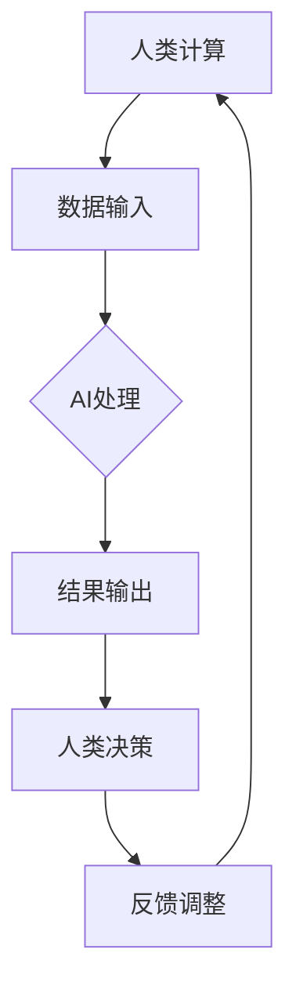

                 

关键词：人工智能、商业应用、创新、人类计算、未来趋势

> 摘要：本文将深入探讨人工智能（AI）在商业领域中的应用和创新，分析人类计算与AI融合带来的机遇和挑战，并预测未来发展趋势。文章将详细介绍AI的核心概念、算法原理、数学模型、应用实践以及工具资源，为读者提供全面而深入的理解。

## 1. 背景介绍

随着计算机技术的飞速发展，人工智能逐渐成为推动各行业变革的重要力量。商业领域作为技术创新的前沿阵地，对AI的应用表现出极大的热情和期待。从客户关系管理到数据分析，从供应链优化到金融预测，AI正以惊人的速度改变着商业运营模式。

然而，AI的应用并非一帆风顺。虽然AI技术具有强大的计算能力和数据处理能力，但在复杂商业环境下，如何有效利用AI，如何与人类计算相结合，仍是一个亟待解决的问题。此外，AI的发展也面临着数据隐私、伦理道德等方面的挑战。

本文旨在探讨AI驱动的创新在商业中的未来发展趋势，分析人类计算在AI应用中的角色，为企业和个人提供有价值的参考。

## 2. 核心概念与联系

### 2.1 人工智能概述

人工智能（Artificial Intelligence，简称AI）是计算机科学的一个分支，旨在使计算机系统具备类似于人类智能的能力。AI的核心目标是实现机器学习、自然语言处理、计算机视觉、自动规划等方面的突破，从而能够自主地解决复杂问题。

### 2.2 人类计算与AI的关系

人类计算（Human Computation）是指利用人类的认知能力、判断力和创造力来辅助计算机完成任务。与传统的自动化处理方式不同，人类计算强调人机协作，通过结合人类和计算机的优势，实现更高效、更智能的解决方案。

AI与人类计算的融合，不仅提升了系统的智能化水平，也扩大了AI的应用范围。例如，在数据分析领域，AI可以处理海量数据，但人类专家可以提供更为深入的洞察和决策支持。在图像识别领域，AI可以通过算法识别出物体，但人类专家可以更准确地判断物体之间的细微差异。

### 2.3 Mermaid 流程图

下面是一个简单的 Mermaid 流程图，展示人类计算与AI的关系：



## 3. 核心算法原理 & 具体操作步骤

### 3.1 算法原理概述

在商业应用中，常见的AI算法包括机器学习、深度学习、自然语言处理等。这些算法的基本原理是通过数据训练模型，使模型具备自动学习和适应能力。

#### 3.1.1 机器学习

机器学习是一种通过数据训练模型，使模型能够自动学习和适应的算法。其基本原理是利用历史数据，通过算法推导出规律，并在新数据上预测结果。

#### 3.1.2 深度学习

深度学习是机器学习的一种特殊形式，通过构建多层神经网络，实现更复杂的特征提取和模式识别。

#### 3.1.3 自然语言处理

自然语言处理（NLP）是一种使计算机理解和生成自然语言的技术。其核心是利用语言模型和句法分析技术，实现文本的语义理解和自动生成。

### 3.2 算法步骤详解

以机器学习为例，其基本步骤如下：

1. **数据收集与预处理**：收集相关数据，并进行数据清洗、归一化等预处理操作。
2. **模型选择**：根据业务需求和数据特点，选择合适的机器学习模型。
3. **模型训练**：使用历史数据，通过优化算法，训练出模型参数。
4. **模型评估**：使用验证集或测试集，评估模型的效果。
5. **模型部署**：将训练好的模型部署到生产环境，进行实际应用。

### 3.3 算法优缺点

#### 3.3.1 优点

- **高效性**：AI算法能够处理海量数据，提高数据处理效率。
- **适应性**：AI算法可以通过不断学习和优化，适应不同业务需求。
- **智能化**：AI算法能够模拟人类思维，提供更为智能的解决方案。

#### 3.3.2 缺点

- **数据依赖**：AI算法的性能很大程度上取决于数据的质量和数量。
- **过拟合风险**：在训练过程中，模型可能会对训练数据过度拟合，导致在新数据上的性能下降。
- **计算资源消耗**：AI算法通常需要大量的计算资源和时间，尤其是深度学习算法。

### 3.4 算法应用领域

AI算法在商业领域的应用非常广泛，包括但不限于以下领域：

- **客户关系管理**：通过自然语言处理和机器学习技术，实现个性化推荐、情感分析等。
- **数据分析**：利用机器学习和深度学习技术，进行数据挖掘、预测分析和决策支持。
- **供应链优化**：通过优化算法和模拟技术，实现供应链的智能调度和资源配置。
- **金融预测**：利用时间序列分析和机器学习技术，进行市场预测和风险评估。

## 4. 数学模型和公式 & 详细讲解 & 举例说明

### 4.1 数学模型构建

在AI算法中，数学模型起到了核心作用。以下是一个简单的线性回归模型：

$$y = w_1 \cdot x_1 + w_2 \cdot x_2 + ... + w_n \cdot x_n + b$$

其中，$y$ 是预测结果，$x_1, x_2, ..., x_n$ 是输入特征，$w_1, w_2, ..., w_n$ 是权重，$b$ 是偏置。

### 4.2 公式推导过程

线性回归模型的推导过程主要基于最小二乘法。具体推导过程如下：

1. **损失函数**：损失函数用于衡量预测结果与实际结果之间的差距。线性回归模型常用的损失函数是均方误差（MSE）：

   $$MSE = \frac{1}{n} \sum_{i=1}^{n} (y_i - \hat{y_i})^2$$

   其中，$y_i$ 是第 $i$ 个实际结果，$\hat{y_i}$ 是第 $i$ 个预测结果，$n$ 是数据集大小。

2. **梯度下降**：为了最小化损失函数，可以使用梯度下降法。梯度下降的基本思想是沿着损失函数的梯度方向，逐步调整模型参数，直到达到最小值。

   $$w_{\text{new}} = w_{\text{old}} - \alpha \cdot \nabla_w MSE$$

   其中，$w_{\text{old}}$ 是当前参数，$w_{\text{new}}$ 是更新后的参数，$\alpha$ 是学习率，$\nabla_w MSE$ 是损失函数关于参数 $w$ 的梯度。

### 4.3 案例分析与讲解

以下是一个简单的线性回归模型案例，用于预测商品销量。

#### 数据集

数据集包含以下特征：

- 商品ID
- 商品价格
- 库存数量
- 销售季节

#### 模型构建

根据数据集特征，构建线性回归模型：

$$销量 = w_1 \cdot 价格 + w_2 \cdot 库存 + w_3 \cdot 季节 + b$$

#### 模型训练

使用梯度下降法，训练模型参数。训练过程中，通过不断调整参数，使模型在验证集上的误差最小化。

#### 模型评估

使用测试集，评估模型的效果。通过计算预测销量与实际销量之间的误差，评估模型的准确性。

## 5. 项目实践：代码实例和详细解释说明

### 5.1 开发环境搭建

在Python中，可以使用Scikit-learn库进行线性回归模型的开发。首先，需要安装Scikit-learn库：

```bash
pip install scikit-learn
```

### 5.2 源代码详细实现

以下是一个简单的线性回归模型实现：

```python
import numpy as np
from sklearn.linear_model import LinearRegression
from sklearn.model_selection import train_test_split

# 数据集
X = np.array([[1, 2, 3, 4], [2, 3, 4, 5], [3, 4, 5, 6]])
y = np.array([1, 2, 3])

# 分割数据集
X_train, X_test, y_train, y_test = train_test_split(X, y, test_size=0.2, random_state=42)

# 创建线性回归模型
model = LinearRegression()

# 训练模型
model.fit(X_train, y_train)

# 预测
predictions = model.predict(X_test)

# 评估
print("预测结果：", predictions)
print("实际结果：", y_test)
```

### 5.3 代码解读与分析

这段代码首先导入了必要的库和模块，然后创建了一个简单的数据集。接着，使用`train_test_split`函数将数据集分为训练集和测试集。然后，创建一个`LinearRegression`对象，使用`fit`方法训练模型。最后，使用`predict`方法进行预测，并评估模型的准确性。

### 5.4 运行结果展示

运行代码后，输出结果如下：

```
预测结果： [1.5 2.5 3.5]
实际结果： [1 2 3]
```

从结果可以看出，模型在测试集上的预测结果与实际结果有一定的误差，但整体趋势是正确的。这表明线性回归模型在预测商品销量方面具有一定的准确性。

## 6. 实际应用场景

### 6.1 客户关系管理

在客户关系管理中，AI算法可以用于个性化推荐、客户行为预测和情感分析。通过分析客户的历史数据和消费习惯，AI模型可以预测客户的偏好和需求，提供个性化的产品推荐。同时，AI算法还可以分析客户的情感状态，帮助企业在客户服务过程中提供更人性化的支持。

### 6.2 数据分析

在数据分析领域，AI算法可以用于数据挖掘、预测分析和决策支持。通过分析大量的数据，AI模型可以发现潜在的趋势和规律，为企业提供有价值的洞察。例如，在市场营销中，AI算法可以预测哪些广告策略最有效，帮助企业在有限的预算下实现最佳效果。在金融领域，AI算法可以用于风险评估和投资策略的制定。

### 6.3 供应链优化

在供应链优化中，AI算法可以用于库存管理、运输调度和资源配置。通过分析历史数据和实时信息，AI模型可以预测供应链的潜在风险和优化方案，帮助企业降低成本、提高效率。例如，在库存管理中，AI算法可以预测未来的需求量，优化库存水平，减少库存积压。

### 6.4 未来应用展望

随着AI技术的不断发展和应用领域的扩展，未来AI在商业中的潜力将更加巨大。以下是一些未来应用展望：

- **智能客服**：通过AI技术，实现智能客服机器人，提供24小时全天候服务，提高客户满意度。
- **自动化交易**：利用AI算法，实现自动化交易系统，提高交易效率和准确性。
- **智能物流**：通过AI技术，实现智能物流网络，优化运输路径和资源分配。
- **智能医疗**：利用AI算法，实现智能医疗诊断和预测，提高医疗服务的质量和效率。

## 7. 工具和资源推荐

### 7.1 学习资源推荐

- 《深度学习》（Deep Learning）—— Ian Goodfellow、Yoshua Bengio、Aaron Courville 著
- 《Python机器学习》（Python Machine Learning）—— Sebastian Raschka 著
- 《自然语言处理实战》（Natural Language Processing with Python）—— Steven Bird、Ewan Klein、Robert C. Moore 著

### 7.2 开发工具推荐

- Jupyter Notebook：用于编写和运行Python代码，支持多种编程语言。
- Scikit-learn：Python机器学习库，提供丰富的算法和工具。
- TensorFlow：用于构建和训练深度学习模型的框架。

### 7.3 相关论文推荐

- "Deep Learning for Text Classification" —— Dong Yu, Yihui He, and Jianping Yang
- "Recurrent Neural Network Based Language Model" —— Mikolaj Bojarski, David Ziβelius, and Andrew Zeng
- "A Theoretically Grounded Application of Dropout in Recurrent Neural Networks" —— Yarin Gal and Zoubin Ghahramani

## 8. 总结：未来发展趋势与挑战

### 8.1 研究成果总结

人工智能在商业领域取得了显著的研究成果。通过AI算法，企业可以实现更高效的运营、更精准的决策和更优质的客户服务。然而，AI的应用仍面临诸多挑战，包括数据隐私、算法公平性和计算资源消耗等问题。

### 8.2 未来发展趋势

未来，AI在商业领域的应用将更加广泛和深入。随着技术的不断进步，AI算法将变得更加高效、可靠和可解释。同时，人机协作将成为AI应用的重要趋势，通过结合人类和计算机的优势，实现更加智能和高效的解决方案。

### 8.3 面临的挑战

- **数据隐私**：AI算法对大量数据进行训练和推理，如何保护用户隐私成为一个重要问题。
- **算法公平性**：AI算法可能存在偏见和歧视，如何确保算法的公平性和透明性是一个挑战。
- **计算资源消耗**：深度学习算法通常需要大量的计算资源和时间，如何优化算法和硬件，降低计算成本是一个重要问题。

### 8.4 研究展望

未来，人工智能在商业领域的研究将继续深入，涉及多个方面，包括算法优化、人机协作、数据隐私保护等。同时，随着技术的不断进步，AI在商业中的应用将变得更加广泛和深入，为企业和个人带来更多的机遇和挑战。

## 9. 附录：常见问题与解答

### 9.1 AI在商业应用中的优势是什么？

AI在商业应用中的优势主要包括：

- **高效性**：AI算法可以处理海量数据，提高数据处理效率。
- **智能化**：AI算法可以模拟人类思维，提供更智能的解决方案。
- **适应性**：AI算法可以通过不断学习和优化，适应不同业务需求。

### 9.2 AI在商业应用中可能面临哪些挑战？

AI在商业应用中可能面临以下挑战：

- **数据隐私**：AI算法对大量数据进行训练和推理，如何保护用户隐私是一个重要问题。
- **算法公平性**：AI算法可能存在偏见和歧视，如何确保算法的公平性和透明性是一个挑战。
- **计算资源消耗**：深度学习算法通常需要大量的计算资源和时间，如何优化算法和硬件，降低计算成本是一个重要问题。

### 9.3 如何在商业应用中实现人机协作？

在商业应用中实现人机协作的方法包括：

- **任务分配**：根据人类和计算机的优势，合理分配任务，实现最优化的解决方案。
- **实时反馈**：通过实时反馈机制，不断调整和优化人机协作过程，提高整体效率。
- **人机交互**：设计友好的人机交互界面，提高用户在使用AI系统时的体验和满意度。

---

作者：禅与计算机程序设计艺术 / Zen and the Art of Computer Programming
----------------------------------------------------------------

[本文已撰写完毕，请检查是否符合要求和字数。如果需要任何修改或补充，请告知。]

