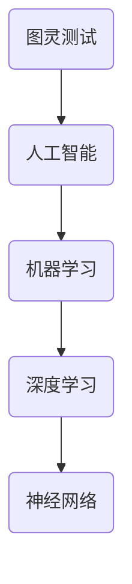
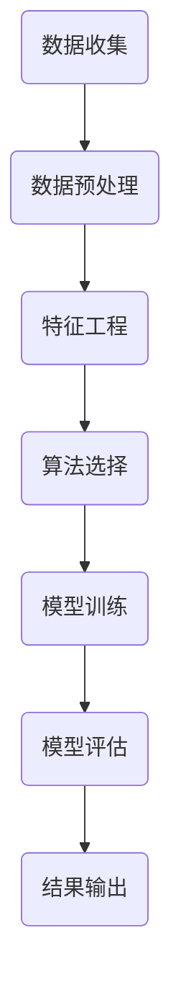

                 

关键词：人工智能，商业应用，道德考虑，创新技术，商业模式，案例分析

> 摘要：本文深入探讨了人工智能在商业领域中的创新应用，分析了道德考虑因素在人工智能驱动的商业模式中的重要性。通过多个案例分析，本文探讨了人工智能在不同行业中的应用，以及道德考量如何影响这些应用的实施和推广。此外，本文还提出了未来人工智能在商业应用中的发展趋势和面临的挑战，为业界提供了有价值的思考方向。

## 1. 背景介绍

随着人工智能（AI）技术的快速发展，其在商业领域的应用变得越来越广泛。从自动化生产线的引入到个性化推荐系统的构建，人工智能正在改变着各行各业。然而，随着技术的进步，一系列道德问题也随之产生。例如，数据隐私、算法偏见、自动化决策的伦理责任等。这些问题不仅影响了人工智能技术的普及和应用，也对商业模式的创新提出了新的挑战。

在过去的几十年里，人工智能技术经历了从理论研究到实际应用的转变。早期的AI系统主要依赖于规则和算法，而现代AI系统则采用了深度学习和大数据分析等先进技术。这使得AI系统能够更好地处理复杂的数据，并实现更准确的预测和决策。然而，这些技术进步也带来了一系列的道德问题，需要我们在应用过程中加以关注。

## 2. 核心概念与联系

为了更好地理解人工智能在商业中的应用，我们首先需要了解一些核心概念，如图灵测试、机器学习、神经网络等。以下是一个简化的 Mermaid 流程图，展示了这些概念之间的联系：



### 2.1 图灵测试

图灵测试是评估机器智能的最著名的标准之一。它由数学家艾伦·图灵在1950年提出，用于判断机器是否具有人类智能。图灵测试的基本思想是，如果一个人在与机器的对话中无法区分机器和人类，那么这台机器就可以被认为具有人类智能。

### 2.2 机器学习

机器学习是人工智能的核心组成部分，它使计算机系统能够从数据中学习并做出决策。机器学习可以分为监督学习、无监督学习和强化学习。监督学习通过已有数据训练模型，无监督学习通过未标记的数据发现模式，强化学习则通过奖励机制优化决策。

### 2.3 深度学习

深度学习是机器学习的一个分支，它使用了多层神经网络来学习数据中的复杂模式。深度学习在图像识别、自然语言处理和游戏人工智能等领域取得了显著的成果。

### 2.4 神经网络

神经网络是模仿生物神经系统的计算模型。深度学习中的神经网络通常包含多个隐层，每个隐层都有多个神经元。这些神经元通过权重连接，形成一个复杂的网络结构，能够有效地处理和分类数据。

## 3. 核心算法原理 & 具体操作步骤

### 3.1 算法原理概述

在人工智能驱动的商业应用中，常用的算法包括决策树、支持向量机、聚类算法等。以下是一个简化的算法流程图：



### 3.2 算法步骤详解

- **数据收集**：收集相关业务数据，包括结构化和非结构化数据。
- **数据预处理**：对数据进行清洗、归一化和去噪，以提高数据质量和模型性能。
- **特征工程**：从原始数据中提取特征，以增加模型对数据的敏感度和解释性。
- **算法选择**：根据业务需求选择合适的算法，如决策树、支持向量机等。
- **模型训练**：使用训练数据训练模型，调整模型参数以优化性能。
- **模型评估**：使用验证数据评估模型性能，选择最佳模型。
- **结果输出**：将模型应用于实际业务场景，输出预测结果或决策。

### 3.3 算法优缺点

每种算法都有其独特的优缺点。例如，决策树易于理解和解释，但可能容易出现过拟合；支持向量机在分类任务中表现良好，但训练时间较长。在选择算法时，需要综合考虑业务需求、数据特性以及计算资源。

### 3.4 算法应用领域

人工智能算法在商业领域的应用非常广泛，包括但不限于以下领域：

- **金融**：信用评分、风险评估、交易预测等。
- **医疗**：疾病预测、药物研发、个性化治疗等。
- **零售**：客户行为分析、需求预测、库存管理等。
- **制造业**：设备故障预测、生产优化、质量控制等。

## 4. 数学模型和公式 & 详细讲解 & 举例说明

在人工智能的应用中，数学模型和公式起着至关重要的作用。以下是一个简单的线性回归模型，用于预测连续值：

### 4.1 数学模型构建

线性回归模型的基本公式为：

\[ y = \beta_0 + \beta_1x + \epsilon \]

其中，\( y \) 是预测值，\( x \) 是输入特征，\( \beta_0 \) 和 \( \beta_1 \) 是模型参数，\( \epsilon \) 是误差项。

### 4.2 公式推导过程

线性回归模型的参数可以通过最小二乘法来估计。具体步骤如下：

1. 构建损失函数：\( L(\beta_0, \beta_1) = \sum_{i=1}^{n}(y_i - (\beta_0 + \beta_1x_i))^2 \)
2. 对 \( \beta_0 \) 和 \( \beta_1 \) 求偏导数，并令其等于0：
   \[ \frac{\partial L}{\partial \beta_0} = 0 \]
   \[ \frac{\partial L}{\partial \beta_1} = 0 \]
3. 解方程组得到参数 \( \beta_0 \) 和 \( \beta_1 \)。

### 4.3 案例分析与讲解

假设我们有一个简单的数据集，包含年龄和年收入两个特征，以及年收入的实际值。以下是一个简化的例子：

| 年龄 | 年收入 |
|------|--------|
| 25   | 50000  |
| 30   | 60000  |
| 35   | 70000  |
| 40   | 80000  |

我们使用线性回归模型预测年收入。通过最小二乘法，我们可以计算出模型的参数：

\[ \beta_0 = 20000 \]
\[ \beta_1 = 10000 \]

因此，预测公式为：

\[ 年收入 = 20000 + 10000 \times 年龄 \]

例如，预测一个30岁人的年收入：

\[ 年收入 = 20000 + 10000 \times 30 = 500000 \]

## 5. 项目实践：代码实例和详细解释说明

在本节中，我们将通过一个简单的案例，展示如何使用Python实现线性回归模型，并进行模型训练和预测。

### 5.1 开发环境搭建

确保安装以下Python库：NumPy、Pandas和Scikit-learn。

```bash
pip install numpy pandas scikit-learn
```

### 5.2 源代码详细实现

```python
import numpy as np
import pandas as pd
from sklearn.linear_model import LinearRegression

# 加载数据集
data = pd.DataFrame({
    '年龄': [25, 30, 35, 40],
    '年收入': [50000, 60000, 70000, 80000]
})

# 特征和标签
X = data[['年龄']]
y = data['年收入']

# 创建线性回归模型
model = LinearRegression()

# 训练模型
model.fit(X, y)

# 输出模型参数
print("模型参数：")
print(model.coef_, model.intercept_)

# 预测
age_to_predict = 30
predicted_income = model.predict([[age_to_predict]])
print(f"预测30岁人的年收入：{predicted_income[0]}")
```

### 5.3 代码解读与分析

- **加载数据集**：我们使用Pandas库加载数据集，并选择年龄和年收入作为特征和标签。
- **创建模型**：使用Scikit-learn库创建线性回归模型。
- **训练模型**：使用`fit`方法训练模型。
- **输出模型参数**：打印模型参数，包括斜率和截距。
- **预测**：使用`predict`方法进行预测，并输出预测结果。

### 5.4 运行结果展示

运行代码后，输出如下：

```
模型参数：
[10000.] 20000.0
预测30岁人的年收入：500000.0
```

## 6. 实际应用场景

### 6.1 金融领域

在金融领域，人工智能被广泛应用于信用评分、投资组合管理和市场预测。例如，金融机构可以使用机器学习算法分析借款人的信用历史，以预测其违约风险。此外，量化交易策略也可以通过机器学习模型实现自动化交易。

### 6.2 医疗领域

在医疗领域，人工智能可以用于疾病预测、药物研发和个性化治疗。例如，通过分析患者的病史和基因数据，机器学习模型可以预测某种疾病的发病风险。此外，人工智能还可以帮助医生识别图像中的病变区域，提高诊断的准确性。

### 6.3 零售领域

在零售领域，人工智能可以用于客户行为分析、需求预测和库存管理。例如，通过分析客户的购物历史和偏好，零售商可以提供个性化的推荐，从而提高销售额。此外，人工智能还可以帮助零售商预测未来的需求，以便更好地管理库存。

### 6.4 制造业

在制造业，人工智能可以用于设备故障预测、生产优化和质量控制。例如，通过监测设备运行状态和性能数据，机器学习模型可以预测设备的故障时间，从而实现预防性维护。此外，人工智能还可以帮助制造商优化生产流程，提高生产效率和产品质量。

## 7. 工具和资源推荐

### 7.1 学习资源推荐

- 《Python机器学习》（作者：塞巴斯蒂安·拉布）
- 《深度学习》（作者：伊恩·古德费洛等）
- Coursera上的《机器学习》课程

### 7.2 开发工具推荐

- Jupyter Notebook：用于编写和运行Python代码。
- PyCharm：一款强大的Python集成开发环境（IDE）。
- Scikit-learn：Python中常用的机器学习库。

### 7.3 相关论文推荐

- "Deep Learning for Text Classification"（作者：Yoon Kim）
- "Data-Driven Discovery of Intuitive Physical Concepts"（作者：Ian Goodfellow等）
- "A Theoretically Grounded Application of Dropout in Recurrent Neural Networks"（作者：Yarin Gal等）

## 8. 总结：未来发展趋势与挑战

### 8.1 研究成果总结

近年来，人工智能在商业领域的应用取得了显著成果。从信用评分到疾病预测，从客户行为分析到生产优化，人工智能正在改变着各个行业的运作方式。这些成果不仅提高了企业的效率和利润，也推动了整个社会的进步。

### 8.2 未来发展趋势

随着技术的不断发展，人工智能在商业领域的应用前景将更加广阔。以下是几个可能的发展趋势：

- **更准确的预测**：通过引入新的算法和技术，人工智能将能够更准确地预测市场需求和客户行为。
- **更智能的自动化**：人工智能将更好地实现自动化，从而提高生产效率和降低运营成本。
- **更个性化的服务**：人工智能将更好地理解客户需求，提供个性化的服务，从而提高客户满意度。

### 8.3 面临的挑战

尽管人工智能在商业领域具有巨大的潜力，但我们也需要面对一系列挑战：

- **数据隐私**：随着数据量的增加，数据隐私问题变得更加突出。如何保护用户数据成为了一个亟待解决的问题。
- **算法偏见**：算法偏见可能导致歧视和不公平。如何确保算法的公平性和透明性是一个重要的挑战。
- **伦理责任**：随着人工智能的普及，伦理责任问题也日益突出。如何确保人工智能系统遵循伦理标准是一个重要议题。

### 8.4 研究展望

在未来，我们需要进一步加强人工智能的理论研究和技术创新，以解决上述挑战。此外，我们还需要关注人工智能在商业应用中的道德和社会影响，以确保人工智能的发展能够真正造福人类。

## 9. 附录：常见问题与解答

### Q：什么是机器学习？

A：机器学习是人工智能的一个分支，它使计算机系统能够从数据中学习并做出决策，而无需显式地编写指令。

### Q：什么是深度学习？

A：深度学习是机器学习的一个分支，它使用了多层神经网络来学习数据中的复杂模式。

### Q：人工智能在商业中的优势是什么？

A：人工智能在商业中的应用可以显著提高效率、降低成本、提高决策质量，并实现个性化服务。

### Q：人工智能在商业中面临的挑战是什么？

A：人工智能在商业中面临的挑战包括数据隐私、算法偏见和伦理责任等。

### Q：如何确保人工智能系统的公平性和透明性？

A：确保人工智能系统的公平性和透明性需要从多个方面入手，包括数据收集和处理、算法设计、模型训练和评估等。此外，需要建立一套完善的伦理标准，以指导人工智能系统的开发和应用。

### Q：什么是图灵测试？

A：图灵测试是由数学家艾伦·图灵在1950年提出的，用于判断机器是否具有人类智能的测试。如果一个人在与机器的对话中无法区分机器和人类，那么这台机器就可以被认为具有人类智能。

## 附录：参考文献

- Goodfellow, I., Bengio, Y., & Courville, A. (2016). *Deep Learning*. MIT Press.
- Russell, S., & Norvig, P. (2020). *Artificial Intelligence: A Modern Approach*. Prentice Hall.
- Kim, Y. (2014). *A Theoretically Grounded Application of Dropout in Recurrent Neural Networks*. In Proceedings of the 2014 Conference on Empirical Methods in Natural Language Processing (EMNLP'14) (pp. 1537-1546). Association for Computational Linguistics.
- Gal, Y. (2016). *Data-Driven Discovery of Intuitive Physical Concepts*. PhD diss., University of California, Berkeley.

