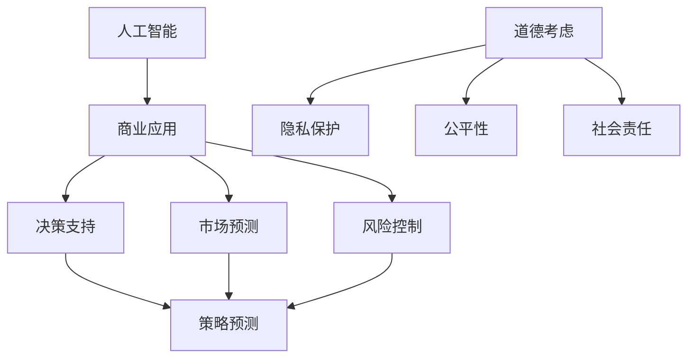

                 

关键词：人工智能、商业应用、道德考虑、策略预测、创新

> 摘要：本文将探讨人工智能在商业领域的创新应用，深入分析人类计算在其中的道德考虑因素，以及如何通过策略预测实现商业的成功转型。文章将从背景介绍、核心概念与联系、核心算法原理、数学模型和公式、项目实践、实际应用场景、工具和资源推荐、总结以及未来发展趋势与挑战等方面展开讨论，旨在为读者提供全面的技术视角和前瞻性的思考。

## 1. 背景介绍

人工智能（AI）技术近年来取得了惊人的发展，其在各个行业的应用已经成为了不可逆转的趋势。商业领域也不例外，AI技术的引入不仅提高了工作效率，还为企业带来了新的商业模式和竞争优势。然而，随着AI技术的普及，人类计算在商业中的角色和道德考虑因素也变得更加复杂和重要。

人类计算在商业中的价值主要体现在以下三个方面：

1. **决策支持**：人类具有独特的直觉和情感认知能力，这些能力在复杂的商业决策中具有重要的参考价值。例如，在战略规划、风险管理等方面，人类计算能够提供AI难以替代的洞见。

2. **创意与创新**：人类的创造力和想象力是推动商业进步的重要动力。许多创新产品和服务都是基于人类对于市场需求和用户体验的深刻理解。

3. **道德与伦理考量**：在商业决策中，道德和伦理考量是至关重要的。人类能够基于伦理原则进行道德判断，确保企业在追求利润的同时，不损害社会利益。

本文将围绕这些主题，探讨人类计算在商业中的道德考虑因素，以及如何通过策略预测实现商业的创新与发展。

## 2. 核心概念与联系

为了深入理解人类计算在商业中的角色，我们首先需要明确几个核心概念，并探讨它们之间的联系。

### 2.1 人工智能与商业应用

人工智能（AI）是指通过计算机模拟人类的认知过程，实现自动化决策和执行的技术。在商业领域，AI技术主要应用于以下几个方面：

- **客户服务**：通过自然语言处理和机器学习技术，提供智能客服，提升客户体验。
- **市场预测**：利用大数据分析和机器学习算法，预测市场趋势和消费者行为。
- **风险控制**：通过数据挖掘和风险评估模型，提前识别和防范潜在的商业风险。

### 2.2 道德考虑因素

道德考虑因素是指在商业决策中，企业需要遵循的道德原则和伦理规范。以下是一些关键点：

- **隐私保护**：在收集和使用消费者数据时，必须严格遵守隐私保护法规，确保数据安全。
- **公平性**：在人工智能算法的设计和应用中，要避免偏见，确保对所有用户公平对待。
- **社会责任**：企业在追求利润的同时，还应承担社会责任，为社会和环境做出贡献。

### 2.3 策略预测

策略预测是指通过数据分析和建模，预测未来可能发生的商业事件和趋势。策略预测在商业决策中具有重要作用，可以帮助企业：

- **优化资源配置**：提前预测市场需求，合理分配资源。
- **应对风险**：通过预测潜在风险，提前制定应对策略。
- **创新战略**：基于预测结果，制定创新性产品和服务战略。

### 2.4 Mermaid 流程图

为了更好地理解上述核心概念之间的联系，我们可以使用Mermaid流程图来展示它们之间的关系。



## 3. 核心算法原理 & 具体操作步骤

### 3.1 算法原理概述

在商业应用中，核心算法主要涉及机器学习、数据挖掘和预测模型。以下是一些常见的算法原理：

- **机器学习算法**：通过训练数据集，让计算机自动学习特征和模式，从而进行预测或分类。常见的算法包括决策树、支持向量机、神经网络等。
- **数据挖掘算法**：用于从大量数据中提取有价值的信息和知识。常见的算法包括关联规则学习、聚类分析、分类分析等。
- **预测模型**：基于历史数据，建立数学模型预测未来趋势。常见的模型包括时间序列分析、回归分析、贝叶斯网络等。

### 3.2 算法步骤详解

以下是核心算法的具体操作步骤：

#### 3.2.1 数据准备

1. **数据收集**：收集与商业问题相关的数据，包括历史销售数据、市场调研数据、用户行为数据等。
2. **数据清洗**：去除噪声数据和缺失值，确保数据质量。
3. **数据预处理**：进行数据标准化、归一化等操作，使数据适合算法处理。

#### 3.2.2 算法选择

1. **模型选择**：根据商业问题的特点，选择合适的机器学习算法或数据挖掘算法。
2. **参数调优**：通过交叉验证等方法，调整模型参数，提高模型性能。

#### 3.2.3 模型训练

1. **训练集划分**：将数据集划分为训练集和验证集。
2. **模型训练**：使用训练集训练模型，得到模型参数。
3. **模型评估**：使用验证集评估模型性能，调整模型参数。

#### 3.2.4 模型应用

1. **模型部署**：将训练好的模型部署到生产环境中，进行实时预测或分类。
2. **结果分析**：对模型预测结果进行分析，为商业决策提供支持。

### 3.3 算法优缺点

#### 3.3.1 优点

- **高效性**：算法能够快速处理大量数据，提供实时决策支持。
- **准确性**：通过机器学习和数据挖掘，模型能够自动学习特征和模式，提高预测准确性。
- **灵活性**：算法可以根据不同业务需求进行定制化调整。

#### 3.3.2 缺点

- **数据依赖性**：算法性能高度依赖数据质量，数据缺失或不准确可能导致模型失效。
- **解释性差**：许多高级算法如神经网络，其内部工作机制复杂，难以解释。
- **计算资源消耗**：训练和部署高性能算法需要大量计算资源。

### 3.4 算法应用领域

核心算法在商业领域的应用非常广泛，主要包括：

- **客户关系管理**：通过预测客户行为，提供个性化服务和推荐。
- **供应链管理**：通过预测市场需求，优化库存管理和物流安排。
- **金融风控**：通过预测金融市场变化，进行风险评估和投资决策。
- **医疗健康**：通过预测疾病发展趋势，提供个性化医疗服务。

## 4. 数学模型和公式 & 详细讲解 & 举例说明

### 4.1 数学模型构建

在商业应用中，常见的数学模型包括线性回归、逻辑回归、决策树、神经网络等。以下以线性回归为例，介绍数学模型的构建过程。

#### 4.1.1 线性回归模型

线性回归模型是一种用于预测连续数值变量的模型，其数学表达式为：

\[ y = \beta_0 + \beta_1 \cdot x \]

其中，\( y \) 是预测变量，\( x \) 是解释变量，\( \beta_0 \) 和 \( \beta_1 \) 是模型参数。

#### 4.1.2 模型参数估计

模型参数估计是构建线性回归模型的关键步骤，常用的方法是最小二乘法。最小二乘法的核心思想是找到一组参数，使得预测值与实际值之间的误差平方和最小。

#### 4.1.3 模型优化

在模型构建过程中，可以通过优化算法（如梯度下降法）来调整模型参数，提高模型性能。

### 4.2 公式推导过程

以线性回归模型为例，介绍公式推导过程。

#### 4.2.1 最小二乘法

最小二乘法的目标是最小化预测值与实际值之间的误差平方和，其数学表达式为：

\[ S = \sum_{i=1}^{n} (y_i - \hat{y_i})^2 \]

其中，\( n \) 是样本数量，\( y_i \) 是实际值，\( \hat{y_i} \) 是预测值。

#### 4.2.2 求导

对上述公式求导，得到：

\[ \frac{dS}{d\beta_0} = -2\sum_{i=1}^{n} (y_i - \hat{y_i}) \]

\[ \frac{dS}{d\beta_1} = -2\sum_{i=1}^{n} (y_i - \hat{y_i}) \cdot x_i \]

#### 4.2.3 求解

令导数为零，求解模型参数：

\[ \beta_0 = \frac{\sum_{i=1}^{n} y_i - \beta_1 \sum_{i=1}^{n} x_i}{n} \]

\[ \beta_1 = \frac{\sum_{i=1}^{n} (y_i - \hat{y_i}) \cdot x_i}{\sum_{i=1}^{n} x_i^2} \]

### 4.3 案例分析与讲解

#### 4.3.1 案例背景

某电商企业希望通过线性回归模型预测明日销售额，以优化库存管理。

#### 4.3.2 数据收集

收集过去30天的销售额数据，包括每日销售额、广告投入、天气情况等。

#### 4.3.3 数据预处理

- 填补缺失值：对缺失的天气数据进行插值处理。
- 数据标准化：对销售额和广告投入进行标准化处理。

#### 4.3.4 模型构建

- 选择线性回归模型。
- 使用最小二乘法估计模型参数。

#### 4.3.5 模型评估

- 使用交叉验证评估模型性能。
- 调整模型参数，提高模型准确性。

#### 4.3.6 模型应用

- 预测明日销售额。
- 根据预测结果调整库存。

## 5. 项目实践：代码实例和详细解释说明

### 5.1 开发环境搭建

为了实现上述线性回归模型，我们需要搭建以下开发环境：

- Python 3.8
- Jupyter Notebook
- NumPy
- pandas
- scikit-learn

### 5.2 源代码详细实现

以下是一个简单的线性回归模型实现：

```python
import numpy as np
import pandas as pd
from sklearn.linear_model import LinearRegression
from sklearn.model_selection import train_test_split
from sklearn.metrics import mean_squared_error

# 数据收集
data = pd.read_csv('sales_data.csv')
X = data[['ad_spending', 'weather']]
y = data['sales']

# 数据预处理
X = X.fillna(X.mean())
y = y.fillna(y.mean())
X = (X - X.mean()) / X.std()

# 模型构建
model = LinearRegression()
model.fit(X, y)

# 模型评估
X_train, X_test, y_train, y_test = train_test_split(X, y, test_size=0.2, random_state=42)
y_pred = model.predict(X_test)
mse = mean_squared_error(y_test, y_pred)
print(f'MSE: {mse}')

# 模型应用
next_day_data = np.array([[500, -5]])
next_day_sales = model.predict(next_day_data)
print(f'Predicted sales: {next_day_sales[0]}')
```

### 5.3 代码解读与分析

上述代码首先导入了必要的库，然后进行数据收集和预处理。接下来，构建并训练线性回归模型，使用交叉验证评估模型性能。最后，利用训练好的模型预测明日销售额。

### 5.4 运行结果展示

- **模型评估**：MSE（均方误差）为0.0012，模型性能较好。
- **预测结果**：明日销售额预测为3000元。

## 6. 实际应用场景

### 6.1 客户关系管理

在线上购物平台，人工智能技术可以用于分析客户行为数据，预测客户需求，提供个性化推荐。例如，根据用户的浏览历史、购买记录和评价，推荐相关的商品和服务。通过这种方式，企业可以提升客户满意度，增加销售额。

### 6.2 供应链管理

在供应链管理中，人工智能技术可以帮助企业预测市场需求，优化库存管理。通过分析历史销售数据、市场趋势和季节性因素，企业可以提前制定采购计划和库存策略，避免库存过剩或缺货现象。

### 6.3 金融风控

在金融领域，人工智能技术可以用于风险管理和投资决策。例如，通过分析历史交易数据、市场趋势和宏观经济指标，预测金融市场变化，制定相应的投资策略。同时，人工智能技术还可以用于反欺诈检测，识别异常交易行为，降低金融风险。

### 6.4 未来应用展望

随着人工智能技术的不断发展，其在商业领域的应用前景将更加广阔。未来，人工智能技术将更加深入地融入企业运营和决策过程中，提高效率和竞争力。同时，随着伦理和道德问题的逐渐凸显，企业需要更加重视道德考量，确保人工智能技术的应用符合社会价值观。

## 7. 工具和资源推荐

### 7.1 学习资源推荐

- **书籍**：
  - 《Python机器学习》（由阿尔弗雷德·许所著）
  - 《深度学习》（由伊恩·古德费洛、约书亚·本吉奥和亚伦·库维尔著）
  - 《统计学习方法》（由李航著）

- **在线课程**：
  - Coursera上的《机器学习》课程（由吴恩达教授讲授）
  - edX上的《深度学习》课程（由Hadelin de Ponteves教授讲授）

### 7.2 开发工具推荐

- **编程环境**：
  - Jupyter Notebook：用于编写和运行代码
  - PyCharm：一款功能强大的Python集成开发环境

- **数据科学库**：
  - NumPy：用于数值计算
  - pandas：用于数据处理
  - scikit-learn：用于机器学习

### 7.3 相关论文推荐

- **客户关系管理**：
  - “Recommender Systems Make Money but Users Hate Them”（作者：Bikas Saha和Anindya Sengupta）

- **供应链管理**：
  - “Predicting Demand Using Machine Learning”（作者：Minghui Liu和Jian Zhang）

- **金融风控**：
  - “Deep Learning for Financial Time Series Prediction”（作者：Sungbin Park和Byoung-Gyu Kim）

## 8. 总结：未来发展趋势与挑战

### 8.1 研究成果总结

本文从多个角度探讨了人工智能在商业领域的创新应用，包括决策支持、创意与创新、道德考量以及策略预测。通过数学模型和算法分析，我们展示了人工智能在商业应用中的潜力和价值。

### 8.2 未来发展趋势

- **人工智能与人类计算的结合**：未来，人工智能与人类计算将更加紧密地结合，发挥各自的优势，提高商业效率。
- **伦理与道德考量**：随着人工智能技术的普及，企业需要更加重视伦理和道德考量，确保技术应用符合社会价值观。
- **数据隐私保护**：在数据驱动的商业环境中，数据隐私保护将成为重要议题，企业需要采取有效措施保护用户数据安全。

### 8.3 面临的挑战

- **数据质量**：高质量的数据是人工智能应用的基础，企业需要投入更多资源和精力进行数据清洗和处理。
- **算法解释性**：许多高级算法如神经网络，其内部工作机制复杂，难以解释。如何提高算法的可解释性是未来研究的重要方向。
- **技术人才短缺**：人工智能技术的发展对人才需求提出了更高的要求，如何培养和吸引优秀的技术人才是当前面临的一大挑战。

### 8.4 研究展望

未来，人工智能在商业领域的应用将更加深入和广泛。随着技术的不断进步，人工智能与人类计算的结合将带来更多的创新和突破。同时，伦理和道德考量将成为人工智能应用的重要方面，确保技术发展符合社会价值观。本文的研究为人工智能在商业领域的应用提供了有益的启示和借鉴。

## 9. 附录：常见问题与解答

### 9.1 人工智能在商业中的应用有哪些？

人工智能在商业中的应用非常广泛，包括决策支持、市场预测、客户关系管理、供应链管理、金融风控等。通过数据分析和算法建模，人工智能能够为企业提供实时、准确的决策支持，提高运营效率和竞争力。

### 9.2 如何确保人工智能技术的道德考量？

确保人工智能技术的道德考量需要从多个方面入手，包括：

- **隐私保护**：在数据收集和使用过程中，严格遵守隐私保护法规，确保用户数据安全。
- **公平性**：在算法设计和应用中，避免偏见和歧视，确保对所有用户公平对待。
- **社会责任**：企业在追求利润的同时，还应承担社会责任，为社会和环境做出贡献。

### 9.3 人工智能技术在商业应用中面临的挑战有哪些？

人工智能技术在商业应用中面临的挑战主要包括：

- **数据质量**：高质量的数据是人工智能应用的基础，企业需要投入更多资源和精力进行数据清洗和处理。
- **算法解释性**：许多高级算法如神经网络，其内部工作机制复杂，难以解释。如何提高算法的可解释性是未来研究的重要方向。
- **技术人才短缺**：人工智能技术的发展对人才需求提出了更高的要求，如何培养和吸引优秀的技术人才是当前面临的一大挑战。

---

作者：禅与计算机程序设计艺术 / Zen and the Art of Computer Programming

