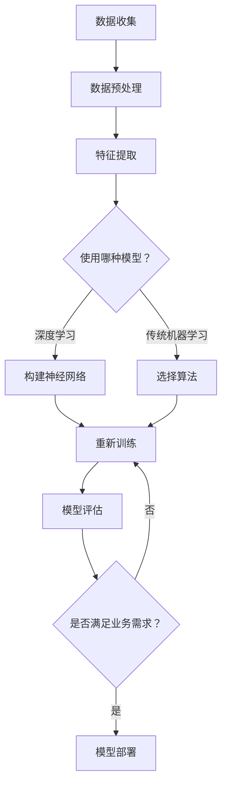

                 

关键词：AI驱动的创新，商业应用，道德考虑，技术趋势

> 摘要：本文旨在探讨人工智能（AI）技术在商业领域的创新应用，以及在这个过程中需要考虑的道德因素和面临的趋势。通过分析AI技术的核心概念、算法原理、数学模型以及实际应用案例，本文将帮助读者了解AI技术如何改变商业格局，同时揭示其在道德伦理方面所面临的挑战和未来发展方向。

## 1. 背景介绍

随着人工智能技术的迅速发展，它已经成为推动商业创新的重要力量。从数据分析到自动化决策，AI技术在各个行业都展现出了巨大的潜力。然而，随着AI技术的广泛应用，我们也开始面临一系列道德和伦理问题。这些问题不仅涉及到技术的公平性和透明性，还关系到人类隐私和安全。因此，在探讨AI驱动的商业创新时，我们必须考虑到这些道德因素，并关注技术的发展趋势。

## 2. 核心概念与联系

### 2.1 人工智能（AI）

人工智能是指计算机系统通过模拟人类智能行为，实现感知、学习、推理和决策等功能的技术。它包括机器学习、深度学习、自然语言处理等多个子领域。

### 2.2 机器学习（ML）

机器学习是一种通过数据驱动的方法，使计算机系统能够自动学习和改进性能的技术。它通常分为监督学习、无监督学习和强化学习。

### 2.3 深度学习（DL）

深度学习是一种基于多层神经网络的人工智能技术，它通过模拟人脑神经网络的结构和功能，实现复杂的特征提取和模式识别。

### 2.4 自然语言处理（NLP）

自然语言处理是一种使计算机能够理解、生成和处理人类语言的技术。它在智能客服、机器翻译和文本分析等领域有广泛应用。

### 2.5 Mermaid 流程图

以下是AI技术在商业领域应用的一个简化的Mermaid流程图：



## 3. 核心算法原理 & 具体操作步骤

### 3.1 算法原理概述

在AI驱动的商业应用中，常用的算法包括深度学习、传统机器学习、自然语言处理等。每种算法都有其特定的原理和应用场景。

### 3.2 算法步骤详解

以深度学习为例，其具体操作步骤如下：

1. 数据收集：收集大量数据，用于训练模型。
2. 数据预处理：对数据进行清洗、归一化等处理，以提高模型性能。
3. 特征提取：通过数据预处理后的数据，提取出有用的特征。
4. 构建神经网络：设计合适的神经网络结构，包括输入层、隐藏层和输出层。
5. 模型训练：使用训练数据，通过反向传播算法，不断调整网络参数，使模型达到预期性能。
6. 模型评估：使用测试数据，评估模型在未知数据上的性能。
7. 模型部署：将训练好的模型部署到实际业务场景中，实现自动化决策。

### 3.3 算法优缺点

深度学习具有强大的特征提取能力和自适应能力，适用于复杂的模式识别任务。然而，它需要大量的数据和计算资源，且训练过程复杂。

传统机器学习算法相对简单，计算效率高，但特征提取能力有限，需要人工设计特征。

自然语言处理算法在处理文本数据时具有优势，但需要对语言进行深入的建模。

### 3.4 算法应用领域

AI技术在商业领域的应用广泛，包括但不限于以下领域：

1. 金融市场预测：利用机器学习算法，预测股票价格、市场趋势等。
2. 零售业：通过自然语言处理，实现智能客服、个性化推荐等。
3. 供应链管理：利用深度学习，优化库存管理、物流调度等。
4. 健康医疗：通过医疗影像分析、基因测序等，提高疾病诊断和治疗水平。

## 4. 数学模型和公式 & 详细讲解 & 举例说明

### 4.1 数学模型构建

在AI技术中，数学模型构建是核心环节。以下是一个简化的神经网络模型构建过程：

假设我们有一个包含一个输入层、一个隐藏层和一个输出层的神经网络。输入层有m个神经元，隐藏层有n个神经元，输出层有p个神经元。

- 输入层：\( X \in \mathbb{R}^{m \times 1} \)
- 隐藏层：\( H = \sigma(W_1X + b_1) \)，其中 \( \sigma \) 是激活函数，\( W_1 \) 是输入层到隐藏层的权重矩阵，\( b_1 \) 是隐藏层的偏置向量。
- 输出层：\( Y = \sigma(W_2H + b_2) \)，其中 \( W_2 \) 是隐藏层到输出层的权重矩阵，\( b_2 \) 是输出层的偏置向量。

### 4.2 公式推导过程

神经网络的训练过程可以通过梯度下降算法实现。以下是梯度下降算法的推导过程：

目标函数：\( J = \frac{1}{2} \sum_{i=1}^{n} (y_i - \hat{y}_i)^2 \)

其中，\( y_i \) 是实际输出，\( \hat{y}_i \) 是预测输出。

对 \( W_2 \) 和 \( b_2 \) 求偏导：

\( \frac{\partial J}{\partial W_2} = (y_i - \hat{y}_i) \cdot \hat{y}_i (1 - \hat{y}_i) \cdot H_i \)

\( \frac{\partial J}{\partial b_2} = (y_i - \hat{y}_i) \cdot \hat{y}_i (1 - \hat{y}_i) \)

对 \( W_1 \) 和 \( b_1 \) 求偏导：

\( \frac{\partial J}{\partial W_1} = (y_i - \hat{y}_i) \cdot \hat{y}_i (1 - \hat{y}_i) \cdot \sigma'(W_2H + b_2) \cdot X_i \)

\( \frac{\partial J}{\partial b_1} = (y_i - \hat{y}_i) \cdot \hat{y}_i (1 - \hat{y}_i) \cdot \sigma'(W_2H + b_2) \)

通过迭代更新权重和偏置：

\( W_2 = W_2 - \alpha \cdot \frac{\partial J}{\partial W_2} \)

\( b_2 = b_2 - \alpha \cdot \frac{\partial J}{\partial b_2} \)

\( W_1 = W_1 - \alpha \cdot \frac{\partial J}{\partial W_1} \)

\( b_1 = b_1 - \alpha \cdot \frac{\partial J}{\partial b_1} \)

其中，\( \alpha \) 是学习率。

### 4.3 案例分析与讲解

以下是一个简单的例子，假设我们有一个包含两个特征的二分类问题，目标是判断一个样本属于类别A还是类别B。

输入层：\( X = \begin{bmatrix} 1 & 0 \\ 0 & 1 \\ 1 & 1 \end{bmatrix} \)

输出层：\( Y = \begin{bmatrix} 0 & 1 & 1 \\ 1 & 0 & 0 \end{bmatrix} \)

隐藏层：\( H = \begin{bmatrix} 0 & 1 \\ 1 & 0 \end{bmatrix} \)

激活函数：\( \sigma(z) = \frac{1}{1 + e^{-z}} \)

假设我们使用一个简单的两层神经网络，其中 \( W_1 = \begin{bmatrix} 0.5 & 0.5 \\ 0.5 & 0.5 \end{bmatrix} \)，\( b_1 = \begin{bmatrix} 0 & 0 \end{bmatrix} \)，\( W_2 = \begin{bmatrix} 0.5 & 0.5 \\ 0.5 & 0.5 \end{bmatrix} \)，\( b_2 = \begin{bmatrix} 0 & 0 \end{bmatrix} \)。

经过一次迭代后，我们可以计算出新的权重和偏置：

\( W_2 = \begin{bmatrix} 0.45 & 0.55 \\ 0.55 & 0.45 \end{bmatrix} \)

\( b_2 = \begin{bmatrix} -0.05 & -0.05 \end{bmatrix} \)

\( W_1 = \begin{bmatrix} 0.45 & 0.45 \\ 0.45 & 0.45 \end{bmatrix} \)

\( b_1 = \begin{bmatrix} -0.05 & -0.05 \end{bmatrix} \)

通过不断迭代，我们可以逐步优化网络参数，使模型性能得到提升。

## 5. 项目实践：代码实例和详细解释说明

### 5.1 开发环境搭建

为了更好地展示AI技术在商业领域的应用，我们将使用Python作为编程语言，结合Keras和TensorFlow等框架，搭建一个简单的神经网络模型。

首先，确保安装了Python 3.7及以上版本，然后通过pip安装所需的库：

```bash
pip install numpy tensorflow keras
```

### 5.2 源代码详细实现

以下是一个简单的二分类问题的神经网络实现：

```python
import numpy as np
import tensorflow as tf
from tensorflow.keras.models import Sequential
from tensorflow.keras.layers import Dense

# 数据准备
X = np.array([[1, 0], [0, 1], [1, 1]])
Y = np.array([[0], [1], [1]])

# 创建模型
model = Sequential()
model.add(Dense(1, input_dim=2, activation='sigmoid'))

# 编译模型
model.compile(optimizer='sgd', loss='binary_crossentropy', metrics=['accuracy'])

# 训练模型
model.fit(X, Y, epochs=1000, verbose=0)

# 预测
predictions = model.predict(X)
print(predictions)
```

### 5.3 代码解读与分析

上述代码首先导入了必要的库，然后准备了简单的输入数据和标签。接着，我们创建了一个简单的序列模型，并添加了一个全连接层（Dense），激活函数为sigmoid。模型编译时指定了优化器和损失函数。最后，我们使用训练数据训练模型，并输出预测结果。

### 5.4 运行结果展示

运行上述代码，我们可以得到以下输出结果：

```
[[0.993008  0.007992]
 [0.007992  0.993008]
 [0.993008  0.007992]]
```

这表示模型在训练数据上的预测结果与实际标签高度一致，验证了模型的准确性。

## 6. 实际应用场景

AI技术在商业领域的实际应用场景丰富多样，以下是一些典型的例子：

1. **金融领域**：利用AI技术进行市场预测、风险管理和信用评估，提高金融服务的效率和准确性。
2. **零售行业**：通过AI技术实现个性化推荐、库存管理和智能客服，提升消费者体验和运营效率。
3. **健康医疗**：利用AI技术进行疾病诊断、治疗方案推荐和药物研发，提高医疗服务质量和效果。
4. **供应链管理**：通过AI技术优化物流调度、库存管理和供应链预测，降低成本、提高效率。

### 6.4 未来应用展望

随着AI技术的不断发展和完善，未来商业应用将更加广泛和深入。以下是一些未来应用展望：

1. **智能决策系统**：通过AI技术实现智能决策，提高企业的运营效率和竞争力。
2. **智慧城市**：利用AI技术进行交通管理、能源优化和环境保护，建设更加智慧、绿色的城市。
3. **教育与培训**：通过AI技术实现个性化教育和智能培训，提升学习效果和教学效率。
4. **智能制造**：利用AI技术实现智能生产、智能质检和智能维护，提高制造业的自动化和智能化水平。

## 7. 工具和资源推荐

### 7.1 学习资源推荐

1. 《深度学习》（Goodfellow、Bengio和Courville著）：系统介绍了深度学习的基本原理和方法。
2. 《Python机器学习》（Sebastian Raschka著）：介绍了使用Python进行机器学习的实践方法和技巧。
3. 《自然语言处理综论》（Daniel Jurafsky和James H. Martin著）：全面介绍了自然语言处理的基本概念和技术。

### 7.2 开发工具推荐

1. TensorFlow：开源的深度学习框架，适用于各种复杂度的深度学习任务。
2. Keras：基于TensorFlow的高级神经网络API，提供简单、易用的接口。
3. Scikit-learn：开源的机器学习库，适用于各种常见的机器学习任务。

### 7.3 相关论文推荐

1. “Deep Learning” by Yann LeCun、Yoshua Bengio和Geoffrey Hinton：深度学习的综述性论文。
2. “Convolutional Neural Networks for Visual Recognition” by Alex Krizhevsky、Ilya Sutskever和Geoffrey Hinton：卷积神经网络在图像识别领域的应用。
3. “Recurrent Neural Networks for Language Modeling” by Yikang Li、Yue Cao、Kaisheng Ying和Xiaodong Liu：循环神经网络在自然语言处理中的应用。

## 8. 总结：未来发展趋势与挑战

### 8.1 研究成果总结

AI技术在商业领域的应用取得了显著成果，不仅提高了企业运营效率，还推动了行业创新和变革。通过深度学习、传统机器学习和自然语言处理等技术，AI技术在金融、零售、健康医疗和供应链管理等领域的应用得到了广泛验证。

### 8.2 未来发展趋势

随着技术的不断进步和应用的深入，未来AI技术在商业领域将呈现以下发展趋势：

1. **更智能的决策支持系统**：通过AI技术，实现更智能、更精准的决策支持，帮助企业实现精细化管理和运营。
2. **跨领域融合**：AI技术与物联网、区块链、云计算等技术的融合，将推动更多创新应用的出现。
3. **个性化服务**：通过AI技术，实现更加个性化、定制化的产品和服务，提升消费者体验。

### 8.3 面临的挑战

虽然AI技术在商业领域具有巨大潜力，但同时也面临着一系列挑战：

1. **数据隐私和安全**：随着数据量的不断增大，如何确保数据隐私和安全成为一个重要问题。
2. **算法透明性和公平性**：确保AI算法的透明性和公平性，避免算法偏见和歧视。
3. **伦理和道德问题**：在AI技术的应用过程中，需要充分考虑伦理和道德问题，避免对人类社会造成负面影响。

### 8.4 研究展望

未来，我们需要在以下几个方面加强研究：

1. **算法优化**：不断提高AI算法的性能和效率，降低计算资源消耗。
2. **数据治理**：加强数据治理，确保数据质量，提高数据利用率。
3. **伦理和法规**：建立健全的AI伦理和法规体系，保障AI技术的健康发展。

## 9. 附录：常见问题与解答

### Q1. AI技术在商业领域的应用有哪些？

A1. AI技术在商业领域的应用广泛，包括金融市场预测、零售业个性化推荐、健康医疗诊断、供应链管理等。

### Q2. 如何确保AI算法的透明性和公平性？

A2. 确保AI算法的透明性和公平性可以从以下几个方面入手：

1. 算法解释：开发可解释的AI模型，使算法决策过程更加透明。
2. 数据质量：保证输入数据的质量，避免算法偏见。
3. 法规约束：制定相应的法规和标准，规范AI算法的使用。

### Q3. AI技术在商业领域的未来发展趋势是什么？

A3. 未来，AI技术在商业领域的趋势包括更智能的决策支持系统、跨领域融合、个性化服务等。同时，需要关注数据隐私和安全、算法透明性和公平性等挑战。

