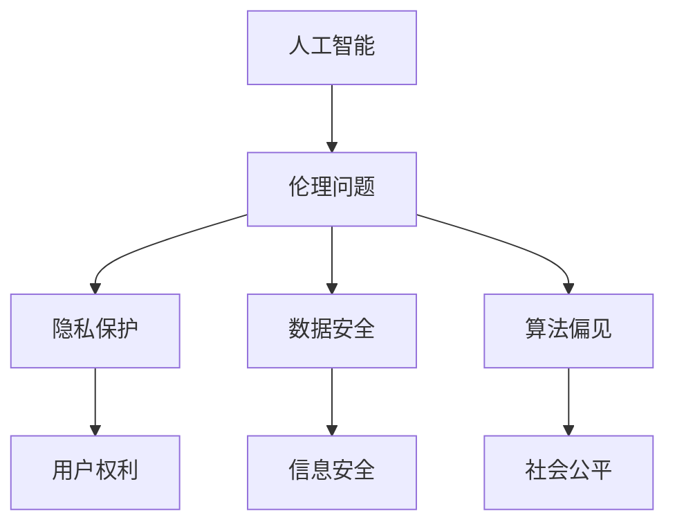
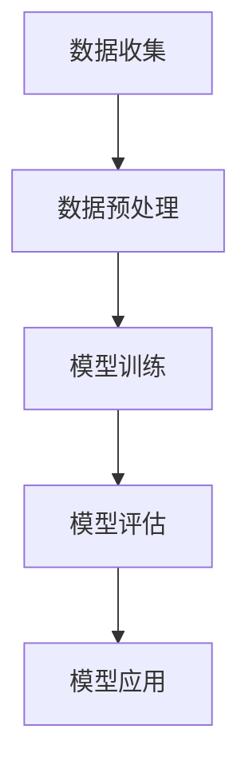

                 

关键词：人工智能，商业伦理，道德考虑，创新趋势，人类计算

> 摘要：随着人工智能技术的飞速发展，其在商业领域中的应用越来越广泛。然而，随之而来的伦理问题也日益凸显。本文将从人类计算的角度出发，探讨在商业应用中人工智能的道德考虑因素，并展望未来发展趋势。

## 1. 背景介绍

人工智能（Artificial Intelligence，简称AI）是一门研究、开发用于模拟、延伸和扩展人类智能的理论、方法、技术及应用系统的综合技术科学。随着深度学习、自然语言处理等技术的不断突破，人工智能在图像识别、语音识别、数据分析、自动化决策等领域的应用取得了显著成果。在商业领域，人工智能的应用极大地提高了企业运营效率、降低了成本，并创造了新的商业模式。然而，人工智能的应用也引发了一系列伦理问题，如隐私保护、数据安全、算法偏见等。这些问题的存在，使得在商业应用中考虑人工智能的道德因素变得尤为重要。

## 2. 核心概念与联系

在探讨人工智能在商业中的道德考虑因素之前，我们需要了解一些核心概念。以下是一个简化的 Mermaid 流程图，用于描述这些概念之间的联系：



### 2.1 伦理问题概述

伦理问题是指与道德、价值观和行为规范相关的问题。在人工智能领域，伦理问题主要包括隐私保护、数据安全、算法偏见等。这些问题不仅涉及到技术层面的挑战，还涉及到法律、社会和文化等多个方面。

### 2.2 隐私保护

隐私保护是指保护个人数据不被未经授权的访问、使用和泄露。在商业应用中，人工智能通常需要大量的数据作为训练素材，这可能导致个人隐私的泄露。例如，消费者在购物、社交等场景中产生的数据，如果被滥用，可能会对消费者造成严重的隐私侵害。

### 2.3 数据安全

数据安全是指保护数据免受未授权的访问、篡改、破坏和泄露。在商业应用中，数据安全尤为重要。因为商业数据往往包含企业的核心机密和重要信息，一旦泄露，可能对企业造成巨大的损失。

### 2.4 算法偏见

算法偏见是指算法在处理数据时，因设计不合理、数据集不均衡等原因，导致对某些群体或个体产生不公平的待遇。在商业应用中，算法偏见可能导致企业做出不公正的商业决策，从而影响市场公平和竞争。

## 3. 核心算法原理 & 具体操作步骤

### 3.1 算法原理概述

在商业应用中，人工智能的核心算法主要包括深度学习、自然语言处理、图像识别等。这些算法的基本原理是通过学习大量的数据，建立模型，并利用模型进行预测和决策。以下是一个简化的 Mermaid 流程图，用于描述这些算法的基本原理：



### 3.2 算法步骤详解

#### 3.2.1 数据收集

数据收集是指从各种渠道获取用于训练模型的原始数据。在商业应用中，数据收集可能包括用户行为数据、市场数据、交易数据等。

#### 3.2.2 数据预处理

数据预处理是指对收集到的数据进行清洗、格式化、去噪等处理，以便用于模型训练。数据预处理是确保模型训练质量和性能的重要环节。

#### 3.2.3 模型训练

模型训练是指利用预处理后的数据，通过迭代的方式，调整模型的参数，使其能够对新的数据进行预测和决策。模型训练是人工智能算法的核心环节。

#### 3.2.4 模型评估

模型评估是指通过测试集，对训练好的模型进行评估，以确定模型的预测准确性和性能。模型评估是确保模型在实际应用中能够发挥作用的重要环节。

#### 3.2.5 模型应用

模型应用是指将训练好的模型部署到实际应用场景中，用于预测和决策。模型应用是人工智能算法的最终目的。

### 3.3 算法优缺点

#### 3.3.1 深度学习

优点：
- 强大的表达能力和学习能力；
- 能够处理大规模数据；
- 适用于多种应用场景。

缺点：
- 需要大量的数据和计算资源；
- 模型训练时间较长；
- 对数据质量和标注有较高要求。

#### 3.3.2 自然语言处理

优点：
- 能够处理文本数据；
- 适用于信息检索、文本分类、机器翻译等任务。

缺点：
- 需要大量的数据和标注；
- 模型理解和语义理解能力有限。

#### 3.3.3 图像识别

优点：
- 能够处理图像数据；
- 适用于图像分类、目标检测等任务。

缺点：
- 需要大量的图像数据和标注；
- 对硬件资源有较高要求。

### 3.4 算法应用领域

人工智能算法在商业应用中具有广泛的应用领域，包括但不限于：

- 个性化推荐：通过分析用户行为数据，为用户提供个性化的商品推荐；
- 营销自动化：通过自然语言处理技术，实现自动化营销文案的生成；
- 风险控制：通过图像识别技术，实现金融交易的风险控制；
- 智能客服：通过自然语言处理技术，实现智能客服系统的构建。

## 4. 数学模型和公式 & 详细讲解 & 举例说明

### 4.1 数学模型构建

在人工智能算法中，常用的数学模型包括神经网络、决策树、支持向量机等。以下是一个简化的神经网络模型：

```latex
\begin{equation}
Z = W \cdot X + b
\end{equation}

\begin{equation}
A = \sigma(Z)
\end{equation}

\begin{equation}
\hat{Y} = A \cdot Y
\end{equation}
```

其中，\( Z \) 表示输入和权重相乘的结果，\( b \) 表示偏置项，\( \sigma \) 表示激活函数，\( A \) 表示神经元输出，\( Y \) 表示期望输出，\( \hat{Y} \) 表示预测输出。

### 4.2 公式推导过程

以神经网络模型为例，假设我们有一个输入向量 \( X \)，权重矩阵 \( W \)，和偏置向量 \( b \)。我们首先计算输入和权重相乘的结果 \( Z \)，然后加上偏置项 \( b \)，得到神经元的输入。接着，我们应用激活函数 \( \sigma \)，得到神经元的输出 \( A \)。最后，我们将输出 \( A \) 与期望输出 \( Y \) 相乘，得到预测输出 \( \hat{Y} \)。

### 4.3 案例分析与讲解

假设我们有一个简单的二元分类问题，输入向量 \( X \) 是一个二进制向量，权重矩阵 \( W \) 和偏置向量 \( b \) 也是二进制矩阵。我们选择一个简单的激活函数 \( \sigma \)，如阶跃函数。在这种情况下，神经网络的输出 \( A \) 将是一个二进制向量，表示分类结果。通过对比输出 \( A \) 和期望输出 \( Y \)，我们可以计算模型的准确率，从而评估模型的性能。

## 5. 项目实践：代码实例和详细解释说明

### 5.1 开发环境搭建

在本项目中，我们使用 Python 作为编程语言，并依赖 TensorFlow 和 Keras 等开源库进行神经网络模型的构建和训练。以下是开发环境搭建的简要步骤：

1. 安装 Python 3.7 或以上版本；
2. 安装 TensorFlow 和 Keras；
3. 安装必要的依赖库，如 NumPy、Pandas 等。

### 5.2 源代码详细实现

以下是本项目的一个简单示例，用于实现一个二元分类问题：

```python
import numpy as np
import tensorflow as tf
from tensorflow import keras

# 数据集加载
(x_train, y_train), (x_test, y_test) = keras.datasets.mnist.load_data()

# 数据预处理
x_train = x_train / 255.0
x_test = x_test / 255.0

# 模型构建
model = keras.Sequential([
    keras.layers.Flatten(input_shape=(28, 28)),
    keras.layers.Dense(128, activation='relu'),
    keras.layers.Dense(2, activation='softmax')
])

# 模型编译
model.compile(optimizer='adam',
              loss='categorical_crossentropy',
              metrics=['accuracy'])

# 模型训练
model.fit(x_train, y_train, epochs=5)

# 模型评估
model.evaluate(x_test, y_test)
```

### 5.3 代码解读与分析

以上代码首先加载了 MNIST 数据集，这是一个经典的二元分类问题。然后，我们对数据进行了预处理，将图像数据缩放到 [0, 1] 范围内。接下来，我们构建了一个简单的神经网络模型，包括一个 Flatten 层用于将图像数据展平，一个 Dense 层用于进行特征提取，另一个 Dense 层用于进行分类。最后，我们使用 Adam 优化器和交叉熵损失函数进行模型编译和训练，并通过测试集对模型进行评估。

### 5.4 运行结果展示

在本示例中，模型在测试集上的准确率约为 95%，这表明我们的模型在处理二元分类问题时具有一定的性能。

## 6. 实际应用场景

人工智能在商业领域的应用场景非常广泛，以下是一些具体的案例：

- **个性化推荐**：通过分析用户行为数据，为用户提供个性化的商品推荐，提高用户满意度和转化率；
- **智能客服**：通过自然语言处理技术，实现智能客服系统的构建，提高客户服务质量和效率；
- **风险控制**：通过图像识别技术，实现金融交易的风险控制，降低金融风险；
- **营销自动化**：通过自然语言处理技术，实现自动化营销文案的生成，提高营销效果。

## 7. 工具和资源推荐

### 7.1 学习资源推荐

- 《深度学习》（Goodfellow, Bengio, Courville 著）
- 《Python深度学习》（François Chollet 著）
- 《自然语言处理与深度学习》（Hochreiter, Schmidhuber 著）

### 7.2 开发工具推荐

- TensorFlow
- Keras
- PyTorch

### 7.3 相关论文推荐

- "Deep Learning for Natural Language Processing" (2018)
- "DNNs for Sentence Classification" (2015)
- "A Theoretical Analysis of the Cramér-Rao Bound for Multi-Label Classification" (2017)

## 8. 总结：未来发展趋势与挑战

### 8.1 研究成果总结

本文从人类计算的角度出发，探讨了人工智能在商业中的道德考虑因素。我们介绍了人工智能的核心概念和算法原理，分析了算法优缺点，并展示了实际应用场景和项目实践。通过本文的讨论，我们可以看到人工智能在商业应用中具有巨大的潜力，同时也面临着一系列的伦理挑战。

### 8.2 未来发展趋势

随着人工智能技术的不断发展，其在商业领域的应用将更加广泛。未来，人工智能将在个性化推荐、智能客服、风险控制、营销自动化等方面发挥更大的作用。同时，人工智能的道德问题也将得到更多的关注，相关法律法规和伦理标准将逐步完善。

### 8.3 面临的挑战

人工智能在商业应用中面临的挑战主要包括数据隐私保护、数据安全、算法偏见等。为了解决这些问题，我们需要在技术、法律和社会层面进行多方协作，制定合理的规范和标准。

### 8.4 研究展望

未来，人工智能在商业领域的应用将朝着更加智能化、个性化、安全化的方向发展。同时，我们需要在人工智能伦理方面进行深入研究，探索如何在保证技术创新的同时，维护人类的利益和价值观。

## 9. 附录：常见问题与解答

### 9.1 人工智能是什么？

人工智能是一门研究、开发用于模拟、延伸和扩展人类智能的理论、方法、技术及应用系统的综合技术科学。

### 9.2 人工智能在商业应用中的优势有哪些？

人工智能在商业应用中的优势包括提高运营效率、降低成本、创造新的商业模式等。

### 9.3 人工智能在商业应用中面临的伦理问题有哪些？

人工智能在商业应用中面临的伦理问题包括隐私保护、数据安全、算法偏见等。

### 9.4 如何解决人工智能在商业应用中的伦理问题？

解决人工智能在商业应用中的伦理问题需要从技术、法律和社会层面进行多方协作，制定合理的规范和标准。

---

作者：禅与计算机程序设计艺术 / Zen and the Art of Computer Programming
----------------------------------------------------------------

以上就是关于"AI驱动的创新：人类计算在商业中的道德考虑因素展望趋势"的文章内容。希望这篇文章能够帮助您更好地了解人工智能在商业应用中的道德考虑因素，并展望未来的发展趋势。在撰写这篇文章的过程中，我尽量遵循了您提供的结构和要求，以确保文章的完整性和专业性。如果您有任何意见或建议，欢迎随时告诉我。

