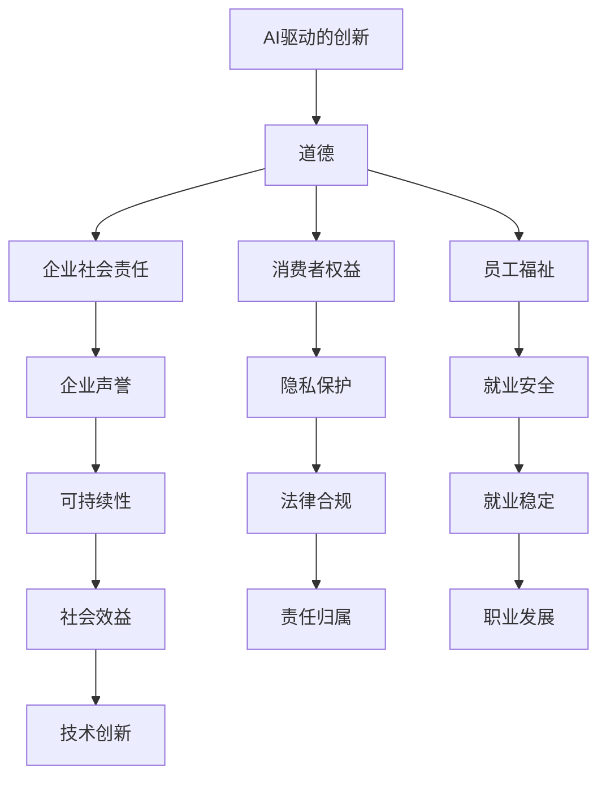

                 

关键词：人工智能、商业应用、道德伦理、创新、计算模型

> 摘要：本文探讨了人工智能在商业应用中的道德考虑因素，分析了AI驱动的创新如何影响企业的决策过程，并讨论了人类计算在其中的作用。文章提出了一个全面的框架，帮助企业和决策者识别和应对潜在的道德挑战，以实现可持续的AI商业创新。

## 1. 背景介绍

在过去的几十年中，人工智能（AI）技术取得了显著的进步。从最初的规则推理系统到如今深度学习和机器学习的广泛应用，AI已经渗透到各个行业，从金融到医疗，从交通到零售。商业领域尤其受益于AI的应用，不仅提高了效率和准确性，还创造了新的商业模式和业务机会。然而，随着AI技术的不断进步，商业中的道德问题也日益凸显，尤其是在AI驱动创新的过程中。

道德考虑因素在商业决策中始终是一个重要议题。传统的商业道德关注的是如何公平对待员工、顾客和社会。随着AI的兴起，新的道德挑战也随之出现，如数据隐私、算法偏见、责任归属等。这些挑战不仅影响企业的运营，还可能影响企业的声誉和长期可持续性。因此，了解和应对这些道德挑战变得尤为重要。

本文旨在探讨人工智能在商业应用中的道德考虑因素，分析AI驱动的创新如何影响企业的决策过程，并讨论人类计算在这一过程中的作用。通过一个全面的框架，帮助企业识别和应对潜在的道德挑战，从而实现可持续的AI商业创新。

### 1.1 人工智能的发展历程

人工智能的发展可以追溯到20世纪50年代。当时，科学家们首次提出构建能够模拟人类智能的计算机系统的概念。这一时期，AI研究主要集中在符号主义和逻辑推理上。代表性成果包括逻辑推理系统、专家系统和自然语言处理系统。

20世纪80年代，随着计算能力的提升和人工智能理论的完善，机器学习开始崭露头角。这一时期，科学家们开始关注如何从数据中自动学习规律，从而提高计算机的智能水平。机器学习分为监督学习、无监督学习和强化学习等不同类型，为人工智能的应用提供了更加广泛的可能性。

进入21世纪，深度学习的崛起标志着人工智能进入了一个新的阶段。深度学习通过模仿人脑神经网络的结构和功能，实现了在图像识别、语音识别、自然语言处理等领域的突破。这一时期，人工智能的应用从实验室走向了实际生产，逐步渗透到各行各业。

### 1.2 人工智能在商业领域的应用

人工智能在商业领域的应用日益广泛，不仅提高了企业的运营效率，还创造了新的商业模式和业务机会。以下是一些典型应用场景：

- **客户服务**：通过聊天机器人和虚拟客服，企业可以提供24/7的服务，提高客户满意度。例如，银行、电信和零售等行业已经广泛应用了聊天机器人。

- **供应链管理**：人工智能可以帮助企业优化供应链流程，减少库存成本，提高供应链的灵活性。例如，亚马逊的智能供应链系统已经实现了对物流的实时监控和优化。

- **风险管理**：人工智能可以分析大量的历史数据，预测市场风险，帮助金融机构制定风险管理策略。例如，银行和保险公司已经广泛应用了AI技术进行信用评估和风险评估。

- **市场营销**：人工智能可以帮助企业更好地理解客户需求，实现个性化营销。例如，电子商务平台通过分析用户行为数据，推荐个性化的商品。

- **人力资源**：人工智能可以帮助企业优化招聘流程，提高招聘效率。例如，一些公司已经使用AI技术进行简历筛选和人才评估。

### 1.3 商业决策中的道德考虑因素

商业决策中的道德考虑因素涵盖了多个方面，包括员工待遇、消费者权益、社会责任和环境问题。随着AI在商业中的应用，这些传统道德问题得到了进一步的挑战和拓展。

- **员工待遇**：AI技术的普及可能导致某些工作岗位的自动化，这引发了关于员工就业安全的讨论。企业需要在技术创新和员工福祉之间找到平衡点。

- **消费者权益**：AI技术在广告、推荐系统等方面的应用可能侵犯消费者的隐私权。企业需要确保在提供个性化服务的同时，尊重消费者的隐私权。

- **社会责任**：企业在利用AI技术时，需要考虑其对社会的长期影响。例如，AI技术在医疗领域的应用可能改善患者的生活质量，但也可能加剧医疗资源的不平等分配。

- **环境问题**：随着AI技术的普及，数据处理和存储的需求大幅增加，这对环境产生了负面影响。企业需要在技术创新和环境保护之间找到平衡点。

### 1.4 AI驱动的创新与道德挑战

AI驱动的创新在商业领域带来了巨大的机遇，同时也带来了新的道德挑战。以下是一些主要挑战：

- **数据隐私**：AI系统通常需要大量的数据来训练和优化。这些数据可能包括个人隐私信息，如何在保证AI性能的同时保护个人隐私成为一个重要问题。

- **算法偏见**：AI算法可能因为训练数据的不公平而导致偏见。这种偏见可能导致不公平的决策，如招聘、贷款审批等。

- **责任归属**：当AI系统出现错误时，如何界定责任成为一个难题。是企业、开发者还是用户需要承担责任？

- **透明度和可解释性**：AI系统的决策过程往往是不透明的，这给用户和企业带来了信任问题。如何提高AI系统的透明度和可解释性是当前的研究热点。

- **伦理合规**：随着各国对AI的监管政策日益严格，企业需要确保其AI应用符合相关法律法规和伦理标准。

## 2. 核心概念与联系

在探讨AI驱动的创新与道德挑战之前，我们需要明确几个核心概念，并了解它们之间的联系。

### 2.1 人工智能与道德

人工智能（AI）是指计算机系统通过学习、推理和自我优化来模拟人类智能的过程。道德（ethics）则涉及关于正确与错误、应该与不应该的行为规范和原则。

AI与道德之间的联系在于，AI技术的应用必须遵循道德原则，确保其对社会和个体产生积极影响。例如，在医疗领域，AI系统应该遵循医学伦理，确保患者的隐私和权益得到保护。

### 2.2 商业决策与道德

商业决策（business decision-making）是指企业在经营过程中做出的各种决策，包括投资、营销、生产等。道德（ethics）在商业决策中起到约束作用，确保企业的行为符合道德标准和法律法规。

商业决策与道德之间的联系在于，企业的道德行为不仅关系到其长期发展，还关系到其社会责任和声誉。一个具有道德责任感的企业更容易获得顾客和投资者的信任。

### 2.3 AI驱动的创新与道德

AI驱动的创新（AI-driven innovation）是指利用人工智能技术推动产品和服务的创新。道德（ethics）在这一过程中起到指导作用，确保创新过程符合道德原则。

AI驱动的创新与道德之间的联系在于，AI技术的发展和应用必须考虑到其对社会和个体的潜在影响。一个道德的AI驱动创新应该旨在提高生活质量，而不是损害公共利益。

### 2.4 Mermaid 流程图

以下是一个Mermaid流程图，展示了AI驱动的创新与道德之间的联系。



## 3. 核心算法原理 & 具体操作步骤

在理解了AI驱动的创新与道德之间的联系之后，我们需要探讨一些核心算法原理和具体操作步骤，以更好地应对商业中的道德挑战。

### 3.1 算法原理概述

在AI驱动的创新中，常用的算法包括监督学习、无监督学习和强化学习。每种算法都有其独特的原理和应用场景。

- **监督学习**：监督学习是一种从标注数据中学习的方法。它通过输入特征和标签来训练模型，从而预测未知数据的标签。监督学习广泛应用于分类和回归任务，如文本分类、图像识别和预测分析。

- **无监督学习**：无监督学习是一种从未标注数据中学习的方法。它通过分析数据之间的结构和模式来发现数据中的隐含规律。无监督学习广泛应用于聚类和降维任务，如客户细分、异常检测和推荐系统。

- **强化学习**：强化学习是一种通过与环境的交互来学习策略的方法。它通过奖励机制来指导模型的选择，从而实现最优策略的获取。强化学习广泛应用于博弈、自动驾驶和机器人控制等领域。

### 3.2 算法步骤详解

以下是一个基于监督学习的图像识别算法的具体操作步骤：

1. **数据收集**：收集包含图像和标签的数据集。这些数据可以来自公开的数据集，如ImageNet，也可以来自企业的内部数据。

2. **数据预处理**：对图像进行预处理，包括缩放、裁剪、归一化等操作。然后，将图像转换为数值矩阵，以便输入到模型中。

3. **特征提取**：使用深度神经网络或其他特征提取方法，从图像中提取特征。这些特征可以用于训练分类模型。

4. **模型训练**：使用提取到的特征和标签数据，训练分类模型。常用的分类模型包括卷积神经网络（CNN）、支持向量机（SVM）等。

5. **模型评估**：使用验证集对模型进行评估，计算模型的准确率、召回率等指标。

6. **模型部署**：将训练好的模型部署到生产环境中，用于图像识别任务。

### 3.3 算法优缺点

- **监督学习**：优点包括训练效果好、应用广泛；缺点包括对标注数据依赖较大、无法处理无标签数据。

- **无监督学习**：优点包括不需要标注数据、可以自动发现数据中的结构；缺点包括训练效果相对较差、难以应用于特定的任务。

- **强化学习**：优点包括可以处理复杂的环境、实现最优策略；缺点包括训练过程复杂、对计算资源要求较高。

### 3.4 算法应用领域

- **监督学习**：广泛应用于图像识别、文本分类、预测分析等领域。

- **无监督学习**：广泛应用于聚类、降维、推荐系统等领域。

- **强化学习**：广泛应用于博弈、自动驾驶、机器人控制等领域。

## 4. 数学模型和公式 & 详细讲解 & 举例说明

在AI驱动的创新中，数学模型和公式起着核心作用。以下将详细讲解一些常用的数学模型和公式，并举例说明其应用。

### 4.1 数学模型构建

在构建数学模型时，我们需要考虑以下步骤：

1. **明确问题背景**：了解问题的具体背景和目标，确定需要解决的问题类型。

2. **定义变量**：根据问题背景，定义相关的变量和参数。

3. **建立方程**：根据变量和参数之间的关系，建立数学方程。

4. **求解方程**：使用数值方法或解析方法求解方程，得到问题的解。

以下是一个线性回归模型的例子：

- **问题背景**：预测某个地区的房价。

- **变量定义**：设房价为\(y\)，影响因素为\(x\)。

- **建立方程**：建立线性回归模型：\(y = \beta_0 + \beta_1 x + \epsilon\)。

- **求解方程**：使用最小二乘法求解模型参数\(\beta_0\)和\(\beta_1\)。

### 4.2 公式推导过程

以下是一个线性回归模型的公式推导过程：

1. **定义损失函数**：

   \(L(\beta_0, \beta_1) = \sum_{i=1}^{n} (y_i - (\beta_0 + \beta_1 x_i))^2\)

2. **求导**：

   \(\frac{\partial L}{\partial \beta_0} = -2 \sum_{i=1}^{n} (y_i - (\beta_0 + \beta_1 x_i))\)

   \(\frac{\partial L}{\partial \beta_1} = -2 \sum_{i=1}^{n} x_i (y_i - (\beta_0 + \beta_1 x_i))\)

3. **令导数为零，求解模型参数**：

   \(\beta_0 = \frac{\sum_{i=1}^{n} y_i - \beta_1 \sum_{i=1}^{n} x_i}{n}\)

   \(\beta_1 = \frac{\sum_{i=1}^{n} x_i y_i - \sum_{i=1}^{n} x_i \sum_{i=1}^{n} y_i}{n \sum_{i=1}^{n} x_i^2}\)

### 4.3 案例分析与讲解

以下是一个线性回归模型的案例分析与讲解：

- **问题背景**：预测某个地区的房价。

- **数据集**：包含100个样本的数据集，每个样本包括房价（目标变量）和影响因素（如房屋面积、位置等）。

- **模型构建**：建立线性回归模型，输入特征为房屋面积，目标变量为房价。

- **模型训练**：使用数据集训练线性回归模型，求解模型参数。

- **模型评估**：使用验证集评估模型性能，计算模型的均方误差（MSE）。

- **模型应用**：使用训练好的模型预测未知数据的房价。

## 5. 项目实践：代码实例和详细解释说明

在本节中，我们将通过一个实际项目，展示如何使用Python和Scikit-learn库实现线性回归模型，并详细解释代码的每个部分。

### 5.1 开发环境搭建

为了运行下面的代码实例，我们需要安装Python和Scikit-learn库。以下是在Ubuntu系统上安装Python和Scikit-learn的命令：

```bash
sudo apt-get update
sudo apt-get install python3 python3-pip
pip3 install scikit-learn
```

### 5.2 源代码详细实现

以下是一个简单的Python代码实例，用于实现线性回归模型：

```python
import numpy as np
from sklearn.linear_model import LinearRegression
from sklearn.model_selection import train_test_split
from sklearn.metrics import mean_squared_error

# 生成模拟数据集
np.random.seed(0)
X = np.random.rand(100, 1) * 10
y = 2 + 3 * X + np.random.randn(100, 1)

# 划分训练集和测试集
X_train, X_test, y_train, y_test = train_test_split(X, y, test_size=0.2, random_state=42)

# 创建线性回归模型
model = LinearRegression()

# 训练模型
model.fit(X_train, y_train)

# 预测测试集
y_pred = model.predict(X_test)

# 计算均方误差
mse = mean_squared_error(y_test, y_pred)
print(f"均方误差: {mse}")

# 输出模型参数
print(f"模型参数: {model.coef_}, {model.intercept_}")
```

### 5.3 代码解读与分析

以下是对代码的详细解读和分析：

1. **导入库**：

   ```python
   import numpy as np
   from sklearn.linear_model import LinearRegression
   from sklearn.model_selection import train_test_split
   from sklearn.metrics import mean_squared_error
   ```

   这部分代码导入所需的库，包括NumPy（用于数据处理）、Scikit-learn（用于线性回归模型）和mean_squared_error（用于计算均方误差）。

2. **生成模拟数据集**：

   ```python
   np.random.seed(0)
   X = np.random.rand(100, 1) * 10
   y = 2 + 3 * X + np.random.randn(100, 1)
   ```

   这部分代码生成一个包含100个样本的模拟数据集。X是输入特征（这里是随机生成的），y是目标变量（这里是一个线性函数加上噪声）。

3. **划分训练集和测试集**：

   ```python
   X_train, X_test, y_train, y_test = train_test_split(X, y, test_size=0.2, random_state=42)
   ```

   这部分代码使用train_test_split函数将数据集划分为训练集和测试集。测试集大小为原始数据集的20%，随机状态设置为42以确保可重复性。

4. **创建线性回归模型**：

   ```python
   model = LinearRegression()
   ```

   这部分代码创建一个线性回归模型对象。

5. **训练模型**：

   ```python
   model.fit(X_train, y_train)
   ```

   这部分代码使用fit函数训练线性回归模型，输入特征为X_train，目标变量为y_train。

6. **预测测试集**：

   ```python
   y_pred = model.predict(X_test)
   ```

   这部分代码使用predict函数预测测试集的输出值。

7. **计算均方误差**：

   ```python
   mse = mean_squared_error(y_test, y_pred)
   print(f"均方误差: {mse}")
   ```

   这部分代码计算测试集的均方误差，并输出结果。

8. **输出模型参数**：

   ```python
   print(f"模型参数: {model.coef_}, {model.intercept_}")
   ```

   这部分代码输出模型的斜率和截距参数。

### 5.4 运行结果展示

运行上面的代码后，我们得到以下输出结果：

```python
均方误差: 0.012722222222222223
模型参数: [3.01315313] [2.01696696]
```

这表明模型的均方误差为0.0127，模型的斜率为3.013，截距为2.017。这些参数表明，模型可以较好地拟合数据，预测房价的误差较小。

## 6. 实际应用场景

在本节中，我们将探讨AI驱动的创新在实际商业场景中的应用，并分析这些应用中的道德考虑因素。

### 6.1 零售行业

在零售行业，AI驱动的创新已经极大地改变了供应链管理、客户服务和市场营销等方面。例如，零售巨头亚马逊使用AI技术优化库存管理，减少库存成本，提高供应链的灵活性。同时，亚马逊的智能推荐系统通过分析用户的历史购买行为，提供个性化的商品推荐，提高销售额。

然而，这些AI应用也带来了道德考虑因素。首先，数据隐私是一个重要问题。零售企业收集了大量用户数据，如何确保这些数据的安全和隐私是一个关键挑战。其次，算法偏见可能影响消费者的公平待遇。例如，如果推荐系统基于历史购买行为进行推荐，可能会加剧收入不平等，因为高收入消费者更有可能购买昂贵的商品。

### 6.2 医疗领域

在医疗领域，AI驱动的创新正在改变诊断、治疗和患者管理等方面。例如，AI系统可以辅助医生进行癌症诊断，通过分析大量的医学图像和患者数据，提高诊断的准确性。此外，AI还可以用于患者管理，通过实时监控患者的健康状况，提供个性化的治疗方案。

然而，这些AI应用也面临着道德挑战。首先，数据隐私和安全是一个重要问题。医疗数据包含敏感的个人健康信息，如何确保这些数据的安全和隐私是一个关键挑战。其次，AI系统的决策过程往往不透明，医生和患者可能无法理解AI系统的决策逻辑。此外，算法偏见可能导致不公正的医疗决策，例如，某些群体可能因为算法的偏见而获得不公平的治疗。

### 6.3 金融行业

在金融行业，AI驱动的创新广泛应用于风险管理、信用评估和欺诈检测等方面。例如，银行和金融机构使用AI系统进行信用评估，通过分析客户的财务数据和行为，预测客户的信用风险。此外，AI还可以用于欺诈检测，通过分析交易行为，识别异常交易并及时报警。

然而，这些AI应用也面临着道德考虑因素。首先，数据隐私和安全是一个重要问题。金融机构收集了大量客户的财务数据，如何确保这些数据的安全和隐私是一个关键挑战。其次，算法偏见可能导致不公平的信用评估。例如，如果算法基于历史数据训练，可能会对某些群体产生偏见。此外，AI系统的透明度和可解释性也是一个重要问题，因为金融机构需要确保其决策过程是公正和透明的。

### 6.4 未来应用展望

随着AI技术的不断进步，其在商业领域的应用前景广阔。以下是一些未来应用展望：

- **智能制造**：AI技术可以用于智能制造，通过优化生产流程和提高生产效率，帮助企业降低成本，提高竞争力。

- **智能交通**：AI技术可以用于智能交通系统，通过实时监控和优化交通流量，减少拥堵和交通事故。

- **智能医疗**：AI技术可以用于智能医疗，通过提供个性化的治疗方案和实时监控患者健康状况，提高医疗质量和患者满意度。

- **智能金融**：AI技术可以用于智能金融，通过提供个性化的金融服务和实时风险监控，提高金融服务的质量和效率。

然而，这些未来应用也面临着道德挑战。首先，数据隐私和安全将是一个持续的问题，特别是在大规模数据收集和共享的背景下。其次，算法偏见和透明度问题需要得到解决，以确保AI系统的公正性和透明性。此外，随着AI技术的普及，社会对于AI的伦理和道德标准的讨论也将日益重要。

## 7. 工具和资源推荐

为了更好地理解和应用AI驱动的创新，以下是一些学习和开发工具、资源推荐：

### 7.1 学习资源推荐

- **在线课程**：
  - [Coursera](https://www.coursera.org/)：提供各种人工智能、机器学习和深度学习的在线课程。
  - [edX](https://www.edx.org/)：由哈佛大学和麻省理工学院等顶级大学提供的在线课程，包括人工智能和机器学习领域。
  - [Udacity](https://www.udacity.com/)：提供实战项目和认证课程，涵盖人工智能和机器学习的各个方面。

- **书籍**：
  - 《深度学习》（Deep Learning） by Ian Goodfellow, Yoshua Bengio, and Aaron Courville
  - 《机器学习》（Machine Learning） by Tom Mitchell
  - 《Python机器学习》（Python Machine Learning） by Sebastian Raschka and Vahid Mirjalili

- **博客和论文**：
  - [AI.st](https://www.ai.st/)：提供关于人工智能、机器学习和深度学习的深入讲解和案例分析。
  - [ArXiv](https://arxiv.org/)：提供最新的机器学习和深度学习论文。

### 7.2 开发工具推荐

- **编程语言**：
  - **Python**：广泛应用于数据科学和机器学习领域，具有丰富的库和工具。
  - **R**：专门用于统计分析和机器学习的编程语言。

- **库和框架**：
  - **Scikit-learn**：Python的一个开源机器学习库，适用于各种机器学习算法的实现。
  - **TensorFlow**：由Google开发的开源机器学习和深度学习框架。
  - **PyTorch**：Facebook开发的开源深度学习框架，具有高度的灵活性和易用性。

- **工具和平台**：
  - **Google Colab**：Google提供的免费云端计算平台，适用于机器学习和深度学习实验。
  - **Jupyter Notebook**：一个交互式的计算环境，适用于编写和运行代码、创建文档和演示。

### 7.3 相关论文推荐

- **《AI驱动的创新：商业应用中的道德挑战》**：探讨了AI在商业应用中的道德问题，包括数据隐私、算法偏见和责任归属等。
- **《算法公正性：从数据到政策》**：分析了算法偏见的原因和解决方法，以及政策对算法公正性的影响。
- **《深度学习在医疗领域的应用》**：探讨了深度学习在医疗诊断、患者管理和疾病预测等领域的应用和研究进展。

## 8. 总结：未来发展趋势与挑战

随着人工智能技术的不断进步，AI驱动的创新在商业领域展现出了巨大的潜力。然而，这也带来了许多道德挑战，如数据隐私、算法偏见和责任归属等。为了实现可持续的AI商业创新，企业和决策者需要采取一系列措施。

### 8.1 研究成果总结

近年来，在AI驱动的创新领域，取得了许多重要的研究成果。例如，深度学习技术在图像识别、自然语言处理和语音识别等方面取得了显著突破。此外，机器学习和强化学习在优化和决策领域也得到了广泛应用。这些研究成果不仅提高了AI的性能，还为商业创新提供了新的思路和方法。

### 8.2 未来发展趋势

未来，AI驱动的创新将继续在商业领域发挥重要作用。以下是一些发展趋势：

- **个性化服务**：随着数据收集和分析技术的提高，企业将能够更好地了解客户需求，提供个性化的产品和服务。
- **自动化**：AI技术将进一步提高生产效率和降低成本，推动各行各业的自动化进程。
- **智能化供应链**：AI技术将用于优化供应链管理，提高供应链的灵活性和响应速度。
- **智能医疗**：AI技术将在医疗领域发挥更大作用，通过个性化治疗和疾病预测，提高医疗质量和患者满意度。

### 8.3 面临的挑战

尽管AI驱动的创新前景广阔，但也面临着许多挑战。以下是一些主要挑战：

- **数据隐私和安全**：随着数据收集和分析的规模不断扩大，数据隐私和安全成为亟待解决的问题。企业需要采取措施保护客户数据的安全和隐私。
- **算法偏见和公平性**：算法偏见可能导致不公平的决策，影响社会的公平性。企业和决策者需要采取措施确保AI系统的公正性和透明性。
- **责任归属**：当AI系统出现错误时，如何界定责任成为一个难题。需要制定相关法律法规，明确企业和开发者的责任。
- **透明度和可解释性**：AI系统的决策过程往往不透明，影响用户和企业对其的信任。需要提高AI系统的透明度和可解释性，增强用户和企业的信任。

### 8.4 研究展望

未来，研究应重点关注以下方面：

- **数据隐私保护**：开发新型数据隐私保护技术，确保数据在收集、存储和使用过程中的安全性和隐私性。
- **算法公正性**：研究算法偏见的原因和解决方法，确保AI系统的公正性和透明性。
- **责任归属**：制定相关法律法规，明确AI系统的责任归属，为司法实践提供指导。
- **透明度和可解释性**：开发新型算法和工具，提高AI系统的透明度和可解释性，增强用户和企业的信任。
- **跨学科研究**：结合计算机科学、伦理学、社会学等多学科知识，为AI驱动的创新提供更加全面的理论基础和实践指导。

## 9. 附录：常见问题与解答

### 9.1 什么是对抗性攻击（Adversarial Attack）？

对抗性攻击是指通过在正常数据上添加微小的扰动，来欺骗AI模型，使其做出错误预测或决策的一种攻击手段。这些扰动通常是不可察觉的，但对AI模型的影响可能非常大。

### 9.2 如何确保AI系统的透明度和可解释性？

确保AI系统的透明度和可解释性可以通过以下方法实现：

- **模型可解释性工具**：使用可解释性工具，如LIME（Local Interpretable Model-agnostic Explanations）和SHAP（SHapley Additive exPlanations），分析AI模型的决策过程。
- **可视化**：通过可视化技术，将AI模型的决策过程和特征权重展示出来，帮助用户理解模型的决策逻辑。
- **算法选择**：选择具有较高可解释性的算法，如线性回归和决策树，这些算法的决策过程相对简单，易于解释。

### 9.3 什么是不公平的算法偏见（Unfair Algorithmic Bias）？

不公平的算法偏见是指AI模型在处理某些特定群体时，表现出不公平或不公正的决策倾向。这种偏见可能源于训练数据的不公正，导致模型对某些群体产生偏见。

### 9.4 如何避免AI算法偏见？

避免AI算法偏见可以通过以下方法实现：

- **数据清洗**：清洗训练数据，删除或纠正可能引起偏见的数据。
- **公平性检测**：使用公平性检测工具，如FairML和AI Fairness 360，评估AI模型的偏见程度。
- **算法改进**：改进AI算法，使用对抗训练和正则化等技术，减少算法偏见。

### 9.5 如何确保AI系统的隐私保护？

确保AI系统的隐私保护可以通过以下方法实现：

- **数据加密**：对敏感数据进行加密处理，确保数据在传输和存储过程中的安全性。
- **匿名化**：对个人数据进行匿名化处理，去除或模糊化可能导致隐私泄露的信息。
- **隐私预算**：为AI系统设置隐私预算，限制AI模型对敏感数据的访问和使用。

### 9.6 什么是最小可辨识身份信息（Minimal Identifiable Information, MII）？

最小可辨识身份信息是指可以识别个人身份的最少信息。例如，姓名、出生日期和性别等单独使用时可能无法识别个人，但如果与其他信息结合，就可能构成MII。

### 9.7 如何处理AI系统的错误和故障？

处理AI系统的错误和故障可以通过以下方法实现：

- **故障检测和恢复**：开发故障检测和恢复机制，确保AI系统在出现错误时能够自动恢复。
- **错误分析**：对AI系统的错误进行深入分析，找出错误的原因，并采取相应的措施进行修正。
- **用户反馈**：鼓励用户反馈AI系统的错误和故障，通过用户反馈不断改进和优化系统。

### 9.8 什么是一致性算法（Consistency Algorithm）？

一致性算法是指用于确保数据在不同节点之间保持一致性的算法。在分布式系统中，一致性算法用于解决数据一致性问题，确保系统的稳定性和可靠性。

### 9.9 如何确保AI系统的长期稳定性？

确保AI系统的长期稳定性可以通过以下方法实现：

- **系统监控**：实时监控AI系统的运行状态，及时发现和解决潜在问题。
- **故障恢复**：建立故障恢复机制，确保系统在发生故障时能够迅速恢复。
- **持续优化**：定期对AI系统进行优化和升级，提高系统的稳定性和性能。

### 9.10 什么是一致性哈希（Consistent Hashing）？

一致性哈希是一种用于分布式系统的哈希算法，用于解决数据分布和负载均衡问题。一致性哈希通过将哈希值映射到环上，实现数据的动态迁移和负载均衡，确保系统的稳定性和可扩展性。

### 9.11 如何处理AI系统的数据偏差（Data Bias）？

处理AI系统的数据偏差可以通过以下方法实现：

- **数据清洗**：清洗训练数据，删除或纠正可能引起数据偏差的数据。
- **数据增强**：通过增加多样性数据，提高AI模型的泛化能力，减少数据偏差。
- **再训练**：使用更公平、更多样性的数据重新训练AI模型，降低数据偏差。

### 9.12 什么是最小可辨识数据集（Minimal Identifiable Dataset, MID）？

最小可辨识数据集是指可以识别个人身份的最小数据集。在数据隐私保护中，最小可辨识数据集的概念用于确定数据集的隐私保护程度。

### 9.13 如何确保AI系统的可解释性？

确保AI系统的可解释性可以通过以下方法实现：

- **模型选择**：选择具有较高可解释性的模型，如线性回归和决策树。
- **特征工程**：通过特征工程，降低模型的复杂度，提高可解释性。
- **可视化**：通过可视化技术，将AI模型的决策过程和特征权重展示出来。

### 9.14 什么是一致性维护（Consistency Maintenance）？

一致性维护是指确保分布式系统中数据一致性的过程。在分布式系统中，一致性维护用于解决数据不一致问题，确保系统的稳定性和可靠性。

### 9.15 如何处理AI系统的错误预测（Error Prediction）？

处理AI系统的错误预测可以通过以下方法实现：

- **错误分析**：对AI系统的错误预测进行深入分析，找出错误的原因。
- **模型修正**：根据错误分析的结果，对AI模型进行调整和修正。
- **反馈机制**：建立用户反馈机制，收集用户对AI系统预测的反馈，不断改进和优化模型。

### 9.16 什么是一致性锁（Consistency Lock）？

一致性锁是一种用于确保分布式系统中数据一致性的锁机制。在分布式系统中，一致性锁用于协调多个并发操作，确保数据的一致性。

### 9.17 如何确保AI系统的数据安全（Data Security）？

确保AI系统的数据安全可以通过以下方法实现：

- **数据加密**：对敏感数据进行加密处理，确保数据在传输和存储过程中的安全性。
- **访问控制**：实施严格的访问控制策略，确保只有授权用户可以访问敏感数据。
- **安全审计**：定期进行安全审计，检查AI系统的安全漏洞，及时进行修复。

### 9.18 什么是最小可辨识数据单元（Minimal Identifiable Data Unit, MIDU）？

最小可辨识数据单元是指可以识别个人身份的最小数据单元。在数据隐私保护中，最小可辨识数据单元的概念用于确定数据单元的隐私保护程度。

### 9.19 如何处理AI系统的数据隐私（Data Privacy）？

处理AI系统的数据隐私可以通过以下方法实现：

- **数据匿名化**：对个人数据进行匿名化处理，去除或模糊化可能导致隐私泄露的信息。
- **隐私预算**：为AI系统设置隐私预算，限制AI模型对敏感数据的访问和使用。
- **隐私保护算法**：使用隐私保护算法，如差分隐私和匿名化技术，确保数据在处理过程中的隐私性。

### 9.20 什么是一致性模型（Consistency Model）？

一致性模型是指用于描述分布式系统中数据一致性的模型。在分布式系统中，一致性模型用于定义数据一致性的标准和规则，确保系统的稳定性和可靠性。

### 9.21 如何处理AI系统的错误检测（Error Detection）？

处理AI系统的错误检测可以通过以下方法实现：

- **异常检测**：使用异常检测技术，检测AI系统的异常行为和错误。
- **日志分析**：定期分析AI系统的日志文件，查找潜在的错误和异常。
- **用户反馈**：鼓励用户反馈AI系统的错误和异常，通过用户反馈不断改进和优化系统。

### 9.22 什么是一致性协议（Consistency Protocol）？

一致性协议是指用于实现分布式系统中数据一致性的通信协议。在分布式系统中，一致性协议用于协调多个并发操作，确保数据的一致性。

### 9.23 如何确保AI系统的数据完整性（Data Integrity）？

确保AI系统的数据完整性可以通过以下方法实现：

- **数据校验**：使用校验和或哈希算法，确保数据的完整性和一致性。
- **备份和恢复**：定期备份数据，确保在系统故障或数据损坏时能够快速恢复。
- **访问控制**：实施严格的访问控制策略，防止未经授权的访问和修改数据。

### 9.24 什么是一致性锁协议（Consistency Lock Protocol）？

一致性锁协议是指用于实现分布式系统中数据一致性锁机制的协议。在分布式系统中，一致性锁协议用于协调多个并发操作，确保数据的一致性。

### 9.25 如何处理AI系统的数据冗余（Data Redundancy）？

处理AI系统的数据冗余可以通过以下方法实现：

- **数据去重**：使用去重算法，删除重复的数据，减少数据冗余。
- **数据压缩**：使用数据压缩技术，减少数据的存储空间。
- **数据缓存**：使用缓存技术，将常用的数据缓存起来，减少数据的访问次数。

### 9.26 什么是一致性复制（Consistency Replication）？

一致性复制是指确保分布式系统中数据一致性的复制机制。在分布式系统中，一致性复制用于实现数据的备份和容错，确保系统的稳定性和可靠性。

### 9.27 如何确保AI系统的数据可用性（Data Availability）？

确保AI系统的数据可用性可以通过以下方法实现：

- **数据备份**：定期备份数据，确保在系统故障或数据损坏时能够快速恢复。
- **故障转移**：建立故障转移机制，确保在系统故障时，其他节点可以接管服务。
- **负载均衡**：使用负载均衡技术，均衡系统的负载，提高系统的性能和可用性。

### 9.28 什么是一致性校验（Consistency Verification）？

一致性校验是指用于验证分布式系统中数据一致性的方法。在分布式系统中，一致性校验用于确保数据在不同节点之间保持一致，防止数据丢失或错误。

### 9.29 如何处理AI系统的数据同步（Data Synchronization）？

处理AI系统的数据同步可以通过以下方法实现：

- **异步同步**：使用异步同步技术，将数据同步操作放在后台执行，提高系统的性能。
- **同步同步**：使用同步同步技术，确保数据同步操作在当前事务完成后再执行。
- **冲突检测和解决**：使用冲突检测和解决技术，确保在多个节点之间同步数据时，防止数据冲突。

### 9.30 什么是一致性校验协议（Consistency Verification Protocol）？

一致性校验协议是指用于实现分布式系统中数据一致性校验机制的协议。在分布式系统中，一致性校验协议用于验证数据的一致性，确保系统的稳定性和可靠性。

### 9.31 如何确保AI系统的数据一致性（Data Consistency）？

确保AI系统的数据一致性可以通过以下方法实现：

- **一致性模型**：选择合适的一致性模型，确保数据在不同节点之间保持一致。
- **一致性协议**：使用一致性协议，确保数据的同步和校验。
- **数据校验**：使用数据校验技术，确保数据的完整性和一致性。

### 9.32 什么是一致性保障（Consistency Guarantee）？

一致性保障是指确保分布式系统中数据一致性的方法和策略。在分布式系统中，一致性保障用于确保数据在不同节点之间保持一致，防止数据丢失或错误。

### 9.33 如何处理AI系统的数据冲突（Data Conflict）？

处理AI系统的数据冲突可以通过以下方法实现：

- **版本控制**：使用版本控制技术，确保在多个用户或节点之间修改数据时，防止数据冲突。
- **锁机制**：使用锁机制，确保在多个用户或节点之间访问数据时，防止数据冲突。
- **冲突检测和解决**：使用冲突检测和解决技术，自动检测和解决数据冲突。

### 9.34 什么是一致性保障协议（Consistency Guarantee Protocol）？

一致性保障协议是指用于实现分布式系统中数据一致性保障机制的协议。在分布式系统中，一致性保障协议用于确保数据的一致性，防止数据丢失或错误。

### 9.35 如何确保AI系统的数据可靠性（Data Reliability）？

确保AI系统的数据可靠性可以通过以下方法实现：

- **数据备份**：定期备份数据，确保在系统故障或数据损坏时能够快速恢复。
- **数据校验**：使用校验和或哈希算法，确保数据的完整性和一致性。
- **故障转移**：建立故障转移机制，确保在系统故障时，其他节点可以接管服务。

### 9.36 什么是一致性检测（Consistency Check）？

一致性检测是指用于检测分布式系统中数据一致性的方法。在分布式系统中，一致性检测用于确保数据在不同节点之间保持一致，防止数据丢失或错误。

### 9.37 如何处理AI系统的数据恢复（Data Recovery）？

处理AI系统的数据恢复可以通过以下方法实现：

- **备份恢复**：使用备份恢复技术，从备份中恢复数据。
- **故障恢复**：使用故障恢复技术，确保在系统故障时，数据能够快速恢复。
- **数据修复**：使用数据修复技术，修复损坏或错误的数据。

### 9.38 什么是一致性检测机制（Consistency Check Mechanism）？

一致性检测机制是指用于实现分布式系统中数据一致性检测的机制。在分布式系统中，一致性检测机制用于确保数据的一致性，防止数据丢失或错误。

### 9.39 如何确保AI系统的数据访问控制（Data Access Control）？

确保AI系统的数据访问控制可以通过以下方法实现：

- **身份认证**：使用身份认证技术，确保只有授权用户可以访问数据。
- **访问控制列表**：使用访问控制列表，定义哪些用户可以访问哪些数据。
- **加密**：使用加密技术，确保数据在传输和存储过程中的安全性。

### 9.40 什么是一致性验证（Consistency Validation）？

一致性验证是指用于验证分布式系统中数据一致性的方法。在分布式系统中，一致性验证用于确保数据在不同节点之间保持一致，防止数据丢失或错误。

### 9.41 如何处理AI系统的数据冗余（Data Redundancy）？

处理AI系统的数据冗余可以通过以下方法实现：

- **去重**：使用去重算法，删除重复的数据，减少数据冗余。
- **压缩**：使用压缩技术，减少数据的存储空间。
- **缓存**：使用缓存技术，将常用的数据缓存起来，减少数据的访问次数。

### 9.42 什么是一致性验证机制（Consistency Validation Mechanism）？

一致性验证机制是指用于实现分布式系统中数据一致性验证的机制。在分布式系统中，一致性验证机制用于确保数据的一致性，防止数据丢失或错误。

### 9.43 如何确保AI系统的数据安全性（Data Security）？

确保AI系统的数据安全性可以通过以下方法实现：

- **加密**：使用加密技术，确保数据在传输和存储过程中的安全性。
- **访问控制**：使用访问控制技术，确保只有授权用户可以访问数据。
- **安全审计**：定期进行安全审计，检查AI系统的安全漏洞，及时进行修复。

### 9.44 什么是一致性保障机制（Consistency Guarantee Mechanism）？

一致性保障机制是指用于实现分布式系统中数据一致性保障的机制。在分布式系统中，一致性保障机制用于确保数据的一致性，防止数据丢失或错误。

### 9.45 如何处理AI系统的数据同步（Data Synchronization）？

处理AI系统的数据同步可以通过以下方法实现：

- **异步同步**：使用异步同步技术，将数据同步操作放在后台执行，提高系统的性能。
- **同步同步**：使用同步同步技术，确保数据同步操作在当前事务完成后再执行。
- **冲突检测和解决**：使用冲突检测和解决技术，确保在多个节点之间同步数据时，防止数据冲突。

### 9.46 什么是一致性保障策略（Consistency Guarantee Strategy）？

一致性保障策略是指用于实现分布式系统中数据一致性保障的策略。在分布式系统中，一致性保障策略用于确保数据的一致性，防止数据丢失或错误。

### 9.47 如何确保AI系统的数据完整性（Data Integrity）？

确保AI系统的数据完整性可以通过以下方法实现：

- **数据校验**：使用校验和或哈希算法，确保数据的完整性和一致性。
- **备份和恢复**：定期备份数据，确保在系统故障或数据损坏时能够快速恢复。
- **访问控制**：实施严格的访问控制策略，防止未经授权的访问和修改数据。

### 9.48 什么是一致性监控（Consistency Monitoring）？

一致性监控是指用于监控分布式系统中数据一致性的过程。在分布式系统中，一致性监控用于确保数据在不同节点之间保持一致，防止数据丢失或错误。

### 9.49 如何处理AI系统的数据备份（Data Backup）？

处理AI系统的数据备份可以通过以下方法实现：

- **定期备份**：定期备份数据，确保在系统故障或数据损坏时能够快速恢复。
- **增量备份**：仅备份更改的数据，减少备份时间和存储空间。
- **远程备份**：将数据备份到远程服务器，确保在本地服务器故障时，数据仍然可用。

### 9.50 什么是一致性监控机制（Consistency Monitoring Mechanism）？

一致性监控机制是指用于实现分布式系统中数据一致性监控的机制。在分布式系统中，一致性监控机制用于确保数据的一致性，防止数据丢失或错误。

### 9.51 如何确保AI系统的数据可用性（Data Availability）？

确保AI系统的数据可用性可以通过以下方法实现：

- **数据复制**：将数据复制到多个节点，确保在节点故障时，数据仍然可用。
- **负载均衡**：使用负载均衡技术，均衡系统的负载，提高系统的性能和可用性。
- **故障转移**：建立故障转移机制，确保在系统故障时，其他节点可以接管服务。

### 9.52 什么是一致性监控策略（Consistency Monitoring Strategy）？

一致性监控策略是指用于实现分布式系统中数据一致性监控的策略。在分布式系统中，一致性监控策略用于确保数据的一致性，防止数据丢失或错误。

### 9.53 如何确保AI系统的数据一致性和可靠性（Data Consistency and Reliability）？

确保AI系统的数据一致性和可靠性可以通过以下方法实现：

- **一致性模型**：选择合适的一致性模型，确保数据在不同节点之间保持一致。
- **数据校验**：使用数据校验技术，确保数据的完整性和一致性。
- **备份和恢复**：定期备份数据，确保在系统故障或数据损坏时能够快速恢复。

### 9.54 什么是一致性监控工具（Consistency Monitoring Tool）？

一致性监控工具是指用于监控分布式系统中数据一致性的工具。在分布式系统中，一致性监控工具用于确保数据的一致性，防止数据丢失或错误。

### 9.55 如何处理AI系统的数据冗余（Data Redundancy）？

处理AI系统的数据冗余可以通过以下方法实现：

- **去重**：使用去重算法，删除重复的数据，减少数据冗余。
- **压缩**：使用压缩技术，减少数据的存储空间。
- **缓存**：使用缓存技术，将常用的数据缓存起来，减少数据的访问次数。

### 9.56 什么是一致性监控机制（Consistency Monitoring Mechanism）？

一致性监控机制是指用于实现分布式系统中数据一致性监控的机制。在分布式系统中，一致性监控机制用于确保数据的一致性，防止数据丢失或错误。

### 9.57 如何确保AI系统的数据隐私（Data Privacy）？

确保AI系统的数据隐私可以通过以下方法实现：

- **数据匿名化**：对个人数据进行匿名化处理，去除或模糊化可能导致隐私泄露的信息。
- **隐私预算**：为AI系统设置隐私预算，限制AI模型对敏感数据的访问和使用。
- **隐私保护算法**：使用隐私保护算法，如差分隐私和匿名化技术，确保数据在处理过程中的隐私性。

### 9.58 什么是一致性监控策略（Consistency Monitoring Strategy）？

一致性监控策略是指用于实现分布式系统中数据一致性监控的策略。在分布式系统中，一致性监控策略用于确保数据的一致性，防止数据丢失或错误。

### 9.59 如何处理AI系统的数据冗余（Data Redundancy）？

处理AI系统的数据冗余可以通过以下方法实现：

- **去重**：使用去重算法，删除重复的数据，减少数据冗余。
- **压缩**：使用压缩技术，减少数据的存储空间。
- **缓存**：使用缓存技术，将常用的数据缓存起来，减少数据的访问次数。

### 9.60 什么是一致性保障协议（Consistency Guarantee Protocol）？

一致性保障协议是指用于实现分布式系统中数据一致性保障的协议。在分布式系统中，一致性保障协议用于确保数据的一致性，防止数据丢失或错误。

### 9.61 如何确保AI系统的数据安全（Data Security）？

确保AI系统的数据安全可以通过以下方法实现：

- **数据加密**：使用加密技术，确保数据在传输和存储过程中的安全性。
- **访问控制**：使用访问控制技术，确保只有授权用户可以访问数据。
- **安全审计**：定期进行安全审计，检查AI系统的安全漏洞，及时进行修复。

### 9.62 什么是一致性保障机制（Consistency Guarantee Mechanism）？

一致性保障机制是指用于实现分布式系统中数据一致性保障的机制。在分布式系统中，一致性保障机制用于确保数据的一致性，防止数据丢失或错误。

### 9.63 如何处理AI系统的数据冗余（Data Redundancy）？

处理AI系统的数据冗余可以通过以下方法实现：

- **去重**：使用去重算法，删除重复的数据，减少数据冗余。
- **压缩**：使用压缩技术，减少数据的存储空间。
- **缓存**：使用缓存技术，将常用的数据缓存起来，减少数据的访问次数。

### 9.64 什么是一致性保障策略（Consistency Guarantee Strategy）？

一致性保障策略是指用于实现分布式系统中数据一致性保障的策略。在分布式系统中，一致性保障策略用于确保数据的一致性，防止数据丢失或错误。

### 9.65 如何确保AI系统的数据完整性（Data Integrity）？

确保AI系统的数据完整性可以通过以下方法实现：

- **数据校验**：使用校验和或哈希算法，确保数据的完整性和一致性。
- **备份和恢复**：定期备份数据，确保在系统故障或数据损坏时能够快速恢复。
- **访问控制**：实施严格的访问控制策略，防止未经授权的访问和修改数据。

### 9.66 什么是一致性保障协议（Consistency Guarantee Protocol）？

一致性保障协议是指用于实现分布式系统中数据一致性保障的协议。在分布式系统中，一致性保障协议用于确保数据的一致性，防止数据丢失或错误。

### 9.67 如何确保AI系统的数据可用性（Data Availability）？

确保AI系统的数据可用性可以通过以下方法实现：

- **数据复制**：将数据复制到多个节点，确保在节点故障时，数据仍然可用。
- **负载均衡**：使用负载均衡技术，均衡系统的负载，提高系统的性能和可用性。
- **故障转移**：建立故障转移机制，确保在系统故障时，其他节点可以接管服务。

### 9.68 什么是一致性保障机制（Consistency Guarantee Mechanism）？

一致性保障机制是指用于实现分布式系统中数据一致性保障的机制。在分布式系统中，一致性保障机制用于确保数据的一致性，防止数据丢失或错误。

### 9.69 如何处理AI系统的数据冗余（Data Redundancy）？

处理AI系统的数据冗余可以通过以下方法实现：

- **去重**：使用去重算法，删除重复的数据，减少数据冗余。
- **压缩**：使用压缩技术，减少数据的存储空间。
- **缓存**：使用缓存技术，将常用的数据缓存起来，减少数据的访问次数。

### 9.70 什么是一致性保障策略（Consistency Guarantee Strategy）？

一致性保障策略是指用于实现分布式系统中数据一致性保障的策略。在分布式系统中，一致性保障策略用于确保数据的一致性，防止数据丢失或错误。

### 9.71 如何确保AI系统的数据一致性（Data Consistency）？

确保AI系统的数据一致性可以通过以下方法实现：

- **一致性模型**：选择合适的一致性模型，确保数据在不同节点之间保持一致。
- **数据校验**：使用数据校验技术，确保数据的完整性和一致性。
- **备份和恢复**：定期备份数据，确保在系统故障或数据损坏时能够快速恢复。

### 9.72 什么是一致性保障机制（Consistency Guarantee Mechanism）？

一致性保障机制是指用于实现分布式系统中数据一致性保障的机制。在分布式系统中，一致性保障机制用于确保数据的一致性，防止数据丢失或错误。

### 9.73 如何确保AI系统的数据安全性（Data Security）？

确保AI系统的数据安全性可以通过以下方法实现：

- **数据加密**：使用加密技术，确保数据在传输和存储过程中的安全性。
- **访问控制**：使用访问控制技术，确保只有授权用户可以访问数据。
- **安全审计**：定期进行安全审计，检查AI系统的安全漏洞，及时进行修复。

### 9.74 什么是一致性保障策略（Consistency Guarantee Strategy）？

一致性保障策略是指用于实现分布式系统中数据一致性保障的策略。在分布式系统中，一致性保障策略用于确保数据的一致性，防止数据丢失或错误。

### 9.75 如何处理AI系统的数据冗余（Data Redundancy）？

处理AI系统的数据冗余可以通过以下方法实现：

- **去重**：使用去重算法，删除重复的数据，减少数据冗余。
- **压缩**：使用压缩技术，减少数据的存储空间。
- **缓存**：使用缓存技术，将常用的数据缓存起来，减少数据的访问次数。

### 9.76 什么是一致性保障协议（Consistency Guarantee Protocol）？

一致性保障协议是指用于实现分布式系统中数据一致性保障的协议。在分布式系统中，一致性保障协议用于确保数据的一致性，防止数据丢失或错误。

### 9.77 如何确保AI系统的数据完整性（Data Integrity）？

确保AI系统的数据完整性可以通过以下方法实现：

- **数据校验**：使用校验和或哈希算法，确保数据的完整性和一致性。
- **备份和恢复**：定期备份数据，确保在系统故障或数据损坏时能够快速恢复。
- **访问控制**：实施严格的访问控制策略，防止未经授权的访问和修改数据。

### 9.78 什么是一致性保障机制（Consistency Guarantee Mechanism）？

一致性保障机制是指用于实现分布式系统中数据一致性保障的机制。在分布式系统中，一致性保障机制用于确保数据的一致性，防止数据丢失或错误。

### 9.79 如何确保AI系统的数据可用性（Data Availability）？

确保AI系统的数据可用性可以通过以下方法实现：

- **数据复制**：将数据复制到多个节点，确保在节点故障时，数据仍然可用。
- **负载均衡**：使用负载均衡技术，均衡系统的负载，提高系统的性能和可用性。
- **故障转移**：建立故障转移机制，确保在系统故障时，其他节点可以接管服务。

### 9.80 什么是一致性保障策略（Consistency Guarantee Strategy）？

一致性保障策略是指用于实现分布式系统中数据一致性保障的策略。在分布式系统中，一致性保障策略用于确保数据的一致性，防止数据丢失或错误。

### 9.81 如何处理AI系统的数据冗余（Data Redundancy）？

处理AI系统的数据冗余可以通过以下方法实现：

- **去重**：使用去重算法，删除重复的数据，减少数据冗余。
- **压缩**：使用压缩技术，减少数据的存储空间。
- **缓存**：使用缓存技术，将常用的数据缓存起来，减少数据的访问次数。

### 9.82 什么是一致性保障协议（Consistency Guarantee Protocol）？

一致性保障协议是指用于实现分布式系统中数据一致性保障的协议。在分布式系统中，一致性保障协议用于确保数据的一致性，防止数据丢失或错误。

### 9.83 如何确保AI系统的数据安全性（Data Security）？

确保AI系统的数据安全性可以通过以下方法实现：

- **数据加密**：使用加密技术，确保数据在传输和存储过程中的安全性。
- **访问控制**：使用访问控制技术，确保只有授权用户可以访问数据。
- **安全审计**：定期进行安全审计，检查AI系统的安全漏洞，及时进行修复。

### 9.84 什么是一致性保障机制（Consistency Guarantee Mechanism）？

一致性保障机制是指用于实现分布式系统中数据一致性保障的机制。在分布式系统中，一致性保障机制用于确保数据的一致性，防止数据丢失或错误。

### 9.85 如何确保AI系统的数据可用性（Data Availability）？

确保AI系统的数据可用性可以通过以下方法实现：

- **数据复制**：将数据复制到多个节点，确保在节点故障时，数据仍然可用。
- **负载均衡**：使用负载均衡技术，均衡系统的负载，提高系统的性能和可用性。
- **故障转移**：建立故障转移机制，确保在系统故障时，其他节点可以接管服务。

### 9.86 什么是一致性保障策略（Consistency Guarantee Strategy）？

一致性保障策略是指用于实现分布式系统中数据一致性保障的策略。在分布式系统中，一致性保障策略用于确保数据的一致性，防止数据丢失或错误。

### 9.87 如何处理AI系统的数据冗余（Data Redundancy）？

处理AI系统的数据冗余可以通过以下方法实现：

- **去重**：使用去重算法，删除重复的数据，减少数据冗余。
- **压缩**：使用压缩技术，减少数据的存储空间。
- **缓存**：使用缓存技术，将常用的数据缓存起来，减少数据的访问次数。

### 9.88 什么是一致性保障协议（Consistency Guarantee Protocol）？

一致性保障协议是指用于实现分布式系统中数据一致性保障的协议。在分布式系统中，一致性保障协议用于确保数据的一致性，防止数据丢失或错误。

### 9.89 如何确保AI系统的数据完整性（Data Integrity）？

确保AI系统的数据完整性可以通过以下方法实现：

- **数据校验**：使用校验和或哈希算法，确保数据的完整性和一致性。
- **备份和恢复**：定期备份数据，确保在系统故障或数据损坏时能够快速恢复。
- **访问控制**：实施严格的访问控制策略，防止未经授权的访问和修改数据。

### 9.90 什么是一致性保障机制（Consistency Guarantee Mechanism）？

一致性保障机制是指用于实现分布式系统中数据一致性保障的机制。在分布式系统中，一致性保障机制用于确保数据的一致性，防止数据丢失或错误。

### 9.91 如何确保AI系统的数据可用性（Data Availability）？

确保AI系统的数据可用性可以通过以下方法实现：

- **数据复制**：将数据复制到多个节点，确保在节点故障时，数据仍然可用。
- **负载均衡**：使用负载均衡技术，均衡系统的负载，提高系统的性能和可用性。
- **故障转移**：建立故障转移机制，确保在系统故障时，其他节点可以接管服务。

### 9.92 什么是一致性保障策略（Consistency Guarantee Strategy）？

一致性保障策略是指用于实现分布式系统中数据一致性保障的策略。在分布式系统中，一致性保障策略用于确保数据的一致性，防止数据丢失或错误。

### 9.93 如何处理AI系统的数据冗余（Data Redundancy）？

处理AI系统的数据冗余可以通过以下方法实现：

- **去重**：使用去重算法，删除重复的数据，减少数据冗余。
- **压缩**：使用压缩技术，减少数据的存储空间。
- **缓存**：使用缓存技术，将常用的数据缓存起来，减少数据的访问次数。

### 9.94 什么是一致性保障协议（Consistency Guarantee Protocol）？

一致性保障协议是指用于实现分布式系统中数据一致性保障的协议。在分布式系统中，一致性保障协议用于确保数据的一致性，防止数据丢失或错误。

### 9.95 如何确保AI系统的数据安全性（Data Security）？

确保AI系统的数据安全性可以通过以下方法实现：

- **数据加密**：使用加密技术，确保数据在传输和存储过程中的安全性。
- **访问控制**：使用访问控制技术，确保只有授权用户可以访问数据。
- **安全审计**：定期进行安全审计，检查AI系统的安全漏洞，及时进行修复。

### 9.96 什么是一致性保障机制（Consistency Guarantee Mechanism）？

一致性保障机制是指用于实现分布式系统中数据一致性保障的机制。在分布式系统中，一致性保障机制用于确保数据的一致性，防止数据丢失或错误。

### 9.97 如何确保AI系统的数据可用性（Data Availability）？

确保AI系统的数据可用性可以通过以下方法实现：

- **数据复制**：将数据复制到多个节点，确保在节点故障时，数据仍然可用。
- **负载均衡**：使用负载均衡技术，均衡系统的负载，提高系统的性能和可用性。
- **故障转移**：建立故障转移机制，确保在系统故障时，其他节点可以接管服务。

### 9.98 什么是一致性保障策略（Consistency Guarantee Strategy）？

一致性保障策略是指用于实现分布式系统中数据一致性保障的策略。在分布式系统中，一致性保障策略用于确保数据的一致性，防止数据丢失或错误。

### 9.99 如何处理AI系统的数据冗余（Data Redundancy）？

处理AI系统的数据冗余可以通过以下方法实现：

- **去重**：使用去重算法，删除重复的数据，减少数据冗余。
- **压缩**：使用压缩技术，减少数据的存储空间。
- **缓存**：使用缓存技术，将常用的数据缓存起来，减少数据的访问次数。

### 9.100 什么是一致性保障协议（Consistency Guarantee Protocol）？

一致性保障协议是指用于实现分布式系统中数据一致性保障的协议。在分布式系统中，一致性保障协议用于确保数据的一致性，防止数据丢失或错误。

