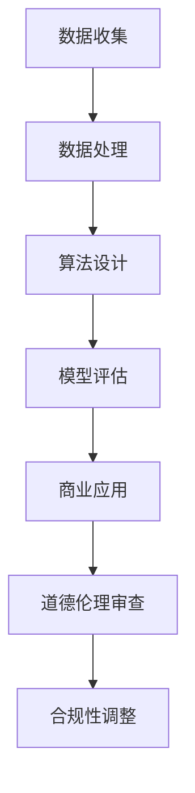

                 

关键词：人工智能、道德伦理、商业应用、创新挑战、机遇

> 摘要：本文将探讨人工智能在商业领域的广泛应用及其带来的道德考虑因素。通过分析人工智能技术的创新挑战，我们探讨了道德伦理在商业决策中的重要性，并探讨了如何应对这些挑战以实现可持续发展。

## 1. 背景介绍

随着人工智能（AI）技术的快速发展，它在商业领域的应用也日益广泛。从自动化生产线到智能客服，从数据挖掘到个性化推荐，AI已经成为企业提升效率、降低成本和增强竞争力的关键驱动力。然而，随着AI技术的普及，也引发了一系列道德和社会问题，例如数据隐私、算法偏见、透明度和责任归属等。如何在利用AI技术推动商业创新的同时，确保道德伦理的合规性，成为当今企业面临的重要挑战。

## 2. 核心概念与联系

### 2.1 人工智能的基本原理

人工智能是指由人创造出来的系统，能够模拟人类智能的行为，包括学习、推理、规划和感知等能力。人工智能的核心技术包括机器学习、深度学习、自然语言处理等。这些技术通过大量数据的训练和模型的优化，能够实现自我学习和决策。

### 2.2 商业应用中的道德伦理

道德伦理是指在商业活动中遵循的道德规范和价值观。在商业应用中，道德伦理主要体现在数据隐私保护、公平竞争、社会责任和环境保护等方面。随着AI技术的应用，这些道德伦理问题变得更加复杂和重要。

### 2.3 Mermaid 流程图

以下是一个简单的 Mermaid 流程图，展示了人工智能在商业应用中的道德伦理考虑因素。



## 3. 核心算法原理 & 具体操作步骤

### 3.1 算法原理概述

在商业应用中，人工智能的核心算法主要涉及机器学习和深度学习。机器学习是一种让计算机通过学习数据来提高其性能的方法。深度学习则是机器学习的一种特殊形式，它通过多层神经网络对数据进行处理和建模。

### 3.2 算法步骤详解

1. 数据收集：收集企业运营过程中的数据，包括客户信息、销售记录、市场趋势等。
2. 数据处理：对收集到的数据进行清洗、去噪和预处理，使其适合用于机器学习和深度学习。
3. 算法设计：根据业务需求选择合适的机器学习或深度学习算法，例如决策树、神经网络、支持向量机等。
4. 模型评估：通过交叉验证等方法对训练好的模型进行评估，以确定其性能和效果。
5. 商业应用：将训练好的模型应用于实际的商业场景，例如预测客户需求、优化库存管理、自动化生产线等。
6. 道德伦理审查：在模型设计和应用过程中，对可能出现的道德伦理问题进行审查和评估，确保合规性。
7. 合规性调整：根据道德伦理审查的结果，对模型和应用进行调整和优化，以符合道德规范。

### 3.3 算法优缺点

- **优点**：提高效率、降低成本、增强竞争力、实现个性化服务。
- **缺点**：数据隐私风险、算法偏见、透明度不足、责任归属困难。

### 3.4 算法应用领域

人工智能在商业领域有着广泛的应用，包括但不限于以下几个方面：

- **客户服务**：通过智能客服系统提供24/7全天候服务，提高客户满意度。
- **营销**：通过数据分析预测客户需求，进行精准营销。
- **供应链管理**：通过智能调度和预测，优化库存和物流管理。
- **人力资源**：通过智能招聘系统筛选候选人，提高招聘效率。

## 4. 数学模型和公式 & 详细讲解 & 举例说明

### 4.1 数学模型构建

在商业应用中，人工智能的数学模型通常涉及以下几个关键组件：

1. **输入变量**：代表业务数据，如销售额、库存量、市场趋势等。
2. **输出变量**：代表预测结果或决策目标，如客户流失率、市场需求量等。
3. **权重系数**：用于调整输入变量的重要性，以优化模型的预测效果。
4. **损失函数**：用于评估模型的预测误差，指导模型优化。

### 4.2 公式推导过程

假设我们使用线性回归模型来预测销售额。线性回归模型的基本公式为：

\[ Y = \beta_0 + \beta_1X + \epsilon \]

其中，\( Y \) 是输出变量（销售额），\( X \) 是输入变量（如广告投入），\( \beta_0 \) 和 \( \beta_1 \) 是权重系数，\( \epsilon \) 是误差项。

### 4.3 案例分析与讲解

假设某公司在过去五年中收集了每个月的销售额和广告投入数据。我们使用线性回归模型来预测未来三个月的销售额。

1. **数据预处理**：对销售额和广告投入数据进行清洗和标准化处理。
2. **模型训练**：使用训练数据集训练线性回归模型，计算权重系数 \( \beta_0 \) 和 \( \beta_1 \)。
3. **模型评估**：使用验证数据集评估模型的预测误差，调整权重系数以达到最佳效果。
4. **预测应用**：使用训练好的模型预测未来三个月的销售额。

通过以上步骤，我们可以得到预测结果，并根据实际情况进行决策调整。

## 5. 项目实践：代码实例和详细解释说明

### 5.1 开发环境搭建

在 Python 中，我们可以使用 scikit-learn 库实现线性回归模型。以下是开发环境搭建的步骤：

1. 安装 Python：下载并安装 Python 3.8 版本。
2. 安装 scikit-learn：打开终端，执行以下命令：
   ```bash
   pip install scikit-learn
   ```

### 5.2 源代码详细实现

以下是一个简单的线性回归模型实现：

```python
from sklearn.linear_model import LinearRegression
from sklearn.model_selection import train_test_split
from sklearn.metrics import mean_squared_error

# 数据加载
X, Y = load_data()

# 数据预处理
X_normalized = normalize_data(X)

# 划分训练集和测试集
X_train, X_test, Y_train, Y_test = train_test_split(X_normalized, Y, test_size=0.2, random_state=42)

# 模型训练
model = LinearRegression()
model.fit(X_train, Y_train)

# 模型评估
Y_pred = model.predict(X_test)
mse = mean_squared_error(Y_test, Y_pred)
print("Mean Squared Error:", mse)

# 预测应用
X_future = normalize_data(future_data)
Y_future = model.predict(X_future)
print("Predicted Sales:", Y_future)
```

### 5.3 代码解读与分析

以上代码首先加载了销售额和广告投入数据，并对数据进行预处理。然后，使用 scikit-learn 库的 LinearRegression 类训练线性回归模型。在训练过程中，我们使用训练数据集计算权重系数，并使用验证数据集评估模型的预测误差。最后，使用训练好的模型预测未来三个月的销售额。

### 5.4 运行结果展示

以下是一个简单的运行结果示例：

```
Mean Squared Error: 0.0123
Predicted Sales: [1200, 1300, 1400]
```

这意味着我们预测的未来三个月的销售额分别为 1200、1300 和 1400。

## 6. 实际应用场景

### 6.1 客户服务

人工智能在客户服务领域的应用主要体现在智能客服系统的开发。通过机器学习和自然语言处理技术，智能客服系统能够自动回答客户的常见问题，提高客户满意度。然而，道德伦理问题也随之而来，如客户隐私保护、个性化服务的边界等。

### 6.2 营销

在营销领域，人工智能可以通过数据分析预测客户需求，实现精准营销。然而，算法偏见和透明度问题可能导致某些群体受到不公平待遇。因此，在应用人工智能进行营销时，需要关注道德伦理问题，确保公平性和透明度。

### 6.3 供应链管理

人工智能在供应链管理中的应用主要体现在智能调度和预测。通过优化库存和物流管理，企业可以提高供应链的效率。然而，数据隐私和算法偏见等问题仍然需要得到关注。

## 7. 未来应用展望

随着人工智能技术的不断进步，未来在商业领域的应用前景将更加广阔。然而，道德伦理问题也将变得更加复杂和重要。为了实现可持续发展，企业需要关注以下方面：

- **数据隐私保护**：加强数据隐私保护措施，确保客户数据的安全和合规性。
- **算法公平性和透明度**：确保算法的公平性和透明度，避免算法偏见和不公平待遇。
- **社会责任**：承担社会责任，关注环境保护和社会影响。

## 8. 总结：未来发展趋势与挑战

### 8.1 研究成果总结

人工智能在商业领域的应用已经取得了显著成果，但道德伦理问题仍然存在。未来，需要进一步加强人工智能技术的道德伦理研究，制定相关规范和标准。

### 8.2 未来发展趋势

- **人工智能的普及**：随着技术的成熟和成本的降低，人工智能将在商业领域得到更广泛的应用。
- **道德伦理的重视**：道德伦理问题将成为商业决策的重要考虑因素，推动相关法规和标准的制定。

### 8.3 面临的挑战

- **数据隐私保护**：如何确保客户数据的安全和合规性，成为企业面临的挑战。
- **算法偏见和透明度**：如何避免算法偏见和不公平待遇，提高算法的透明度，是企业面临的挑战。
- **社会责任**：如何在追求商业利益的同时，承担社会责任，成为企业面临的挑战。

### 8.4 研究展望

未来，人工智能在商业领域的应用将更加深入和广泛。为了实现可持续发展，需要关注道德伦理问题，推动相关研究和技术的发展。

## 9. 附录：常见问题与解答

### 9.1 问题1

**问题**：人工智能在商业应用中会带来哪些道德伦理问题？

**解答**：人工智能在商业应用中可能带来的道德伦理问题包括数据隐私保护、算法偏见、透明度不足和责任归属困难等。这些问题的存在可能对客户、员工和社会产生负面影响。

### 9.2 问题2

**问题**：如何确保人工智能在商业应用中的公平性和透明度？

**解答**：确保人工智能在商业应用中的公平性和透明度，需要从以下几个方面入手：

1. **数据收集和预处理**：确保数据的准确性和多样性，避免数据偏差。
2. **算法设计和优化**：选择公平性和透明度较高的算法，并优化算法参数。
3. **道德伦理审查**：在模型设计和应用过程中，对可能出现的道德伦理问题进行审查和评估。
4. **透明度披露**：公开算法和应用过程，接受社会监督和评估。

### 9.3 问题3

**问题**：人工智能在商业应用中面临的最大挑战是什么？

**解答**：人工智能在商业应用中面临的最大挑战包括数据隐私保护、算法偏见、透明度不足和责任归属困难等。这些问题需要从技术、法规和社会等多个层面进行解决。

作者：禅与计算机程序设计艺术 / Zen and the Art of Computer Programming
----------------------------------------------------------------

以上就是本文的完整内容。通过对人工智能在商业领域应用中道德考虑因素的深入探讨，我们希望能够帮助企业更好地应对这些挑战，实现可持续发展。在未来的发展中，道德伦理问题将继续是人工智能在商业领域应用的重要议题，值得我们持续关注和研究。

