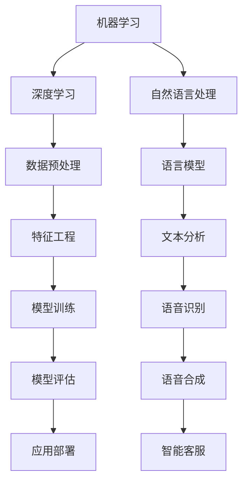

                 

关键词：人工智能、政府应用、计算技术、创新、公共管理

摘要：本文深入探讨了人工智能（AI）在政府应用中的创新作用，通过分析AI技术的核心概念、算法原理、数学模型以及具体的应用场景，探讨了AI技术在政府职能优化、公共服务提升以及决策支持等方面的应用潜力。文章还结合实际案例，展示了AI技术在政府工作中的应用实例，并提出了对未来发展的展望和挑战。

## 1. 背景介绍

随着信息技术的飞速发展，人工智能（AI）已成为推动社会进步的重要力量。在政府管理领域，AI技术的应用不仅提高了行政效率，也为公共服务质量和透明度带来了显著提升。本篇文章旨在探讨AI技术在政府应用中的创新作用，分析其在计算技术、公共管理以及决策支持方面的应用前景，并提出相应的解决方案和发展方向。

### 1.1 人工智能在政府中的应用现状

近年来，人工智能在政府管理中的应用日益广泛，主要表现在以下几个方面：

1. **公共安全监控**：利用AI技术对监控视频进行分析，实时识别异常行为和潜在安全威胁，提高公共安全水平。
2. **交通管理**：通过AI算法优化交通信号控制，减少拥堵，提高道路通行效率。
3. **医疗卫生**：应用AI进行疾病预测、诊断和药物研发，提升医疗服务质量和效率。
4. **教育管理**：利用AI分析学生学习数据，提供个性化教育建议，提高教学效果。

### 1.2 AI技术在政府应用中的挑战

尽管AI技术在政府管理中展现出巨大潜力，但也面临一些挑战：

1. **数据隐私与安全**：政府机构涉及大量敏感数据，如何保障数据隐私和安全成为关键问题。
2. **算法偏见与公平性**：AI算法可能存在偏见，影响决策的公平性和公正性。
3. **技术依赖**：过度依赖AI技术可能导致技术中断或失效，影响政府运作。

## 2. 核心概念与联系

### 2.1 人工智能的核心概念

人工智能（AI）是指计算机系统模拟人类智能的行为和决策过程。其主要核心概念包括：

1. **机器学习（ML）**：通过数据训练模型，使其具备学习能力。
2. **深度学习（DL）**：基于多层神经网络，对复杂数据进行特征提取和模式识别。
3. **自然语言处理（NLP）**：使计算机理解和生成人类语言。

### 2.2 人工智能架构的 Mermaid 流程图



### 2.3 人工智能与政府职能的联系

人工智能技术可以与政府职能紧密融合，提高行政效率和服务质量：

1. **数据驱动决策**：通过数据分析，政府可以更科学地制定政策和规划。
2. **智能化服务**：利用AI技术，政府可以提供更高效、个性化的公共服务。
3. **智能监管**：通过AI技术，政府可以实现对公共安全的智能监控和预警。

## 3. 核心算法原理 & 具体操作步骤

### 3.1 算法原理概述

在政府应用中，常用的AI算法包括：

1. **聚类算法**：用于分类和发现数据中的模式，如K-means算法。
2. **分类算法**：用于预测和分类，如决策树、支持向量机（SVM）。
3. **回归算法**：用于预测数值，如线性回归、岭回归。

### 3.2 算法步骤详解

以K-means算法为例，其步骤如下：

1. **初始化中心点**：随机选择K个数据点作为初始中心点。
2. **分配数据点**：计算每个数据点到各个中心点的距离，将数据点分配到最近的中心点所在的簇。
3. **更新中心点**：计算每个簇的数据点的平均值，作为新的中心点。
4. **重复步骤2和3**：直到中心点的变化小于某个阈值或达到最大迭代次数。

### 3.3 算法优缺点

K-means算法的优点包括：

- **简单易实现**：计算过程简单，易于实现。
- **效果显著**：在处理大规模数据时，聚类效果较好。

缺点包括：

- **对初始中心点敏感**：初始中心点的选择可能影响聚类结果。
- **不适用于非球形簇**：K-means算法假设簇是球形的，不适用于非球形簇。

### 3.4 算法应用领域

K-means算法在政府应用中具有广泛的应用领域，如：

- **数据挖掘**：用于分析政府数据，发现潜在的模式和趋势。
- **城市规划**：用于分析城市人口分布和交通流量，优化城市规划。
- **公共卫生**：用于分析疾病传播趋势，制定公共卫生政策。

## 4. 数学模型和公式 & 详细讲解 & 举例说明

### 4.1 数学模型构建

以线性回归模型为例，其数学模型可以表示为：

$$
Y = \beta_0 + \beta_1X + \epsilon
$$

其中，$Y$ 是因变量，$X$ 是自变量，$\beta_0$ 和 $\beta_1$ 是模型参数，$\epsilon$ 是误差项。

### 4.2 公式推导过程

线性回归模型的推导过程如下：

1. **最小二乘法**：为了最小化预测值与实际值之间的误差，我们使用最小二乘法来估计模型参数。

$$
\min \sum_{i=1}^{n} (Y_i - \beta_0 - \beta_1X_i)^2
$$

2. **求导并令导数为零**：对上述误差函数求导，并令导数为零，得到：

$$
\frac{\partial}{\partial \beta_0} \sum_{i=1}^{n} (Y_i - \beta_0 - \beta_1X_i)^2 = 0
$$

$$
\frac{\partial}{\partial \beta_1} \sum_{i=1}^{n} (Y_i - \beta_0 - \beta_1X_i)^2 = 0
$$

3. **解方程组**：解上述方程组，得到模型参数 $\beta_0$ 和 $\beta_1$。

### 4.3 案例分析与讲解

假设我们要预测某个城市下一年的总人口，给定自变量 $X$（当前人口）和因变量 $Y$（下一年的总人口），我们可以使用线性回归模型来建立预测模型。

通过收集历史数据，我们得到以下数据集：

| X（当前人口）| Y（下一年总人口）|
|:-----------:|:--------------:|
|      1000    |       1200     |
|      2000    |       2400     |
|      3000    |       3600     |
|      4000    |       4800     |
|      5000    |       6000     |

利用线性回归模型，我们可以拟合出以下模型：

$$
Y = 1000 + 2X
$$

利用这个模型，我们可以预测下一年的总人口为：

$$
Y = 1000 + 2 \times 5000 = 11000
$$

## 5. 项目实践：代码实例和详细解释说明

### 5.1 开发环境搭建

为了实现本文中的线性回归模型，我们使用Python编程语言和Scikit-learn库。首先，我们需要安装Python和Scikit-learn库：

```bash
pip install python
pip install scikit-learn
```

### 5.2 源代码详细实现

以下是实现线性回归模型的源代码：

```python
import numpy as np
from sklearn.linear_model import LinearRegression

# 数据集
X = np.array([[1000], [2000], [3000], [4000], [5000]])
Y = np.array([1200, 2400, 3600, 4800, 6000])

# 创建线性回归模型
model = LinearRegression()

# 训练模型
model.fit(X, Y)

# 模型参数
print("模型参数：", model.coef_, model.intercept_)

# 预测下一年的总人口
X_pred = np.array([[5000]])
Y_pred = model.predict(X_pred)
print("下一年的总人口预测值：", Y_pred)
```

### 5.3 代码解读与分析

1. **数据集**：我们使用一个简单的数据集，其中自变量 $X$ 表示当前人口，因变量 $Y$ 表示下一年的总人口。
2. **创建模型**：我们使用Scikit-learn库中的 LinearRegression 类创建线性回归模型。
3. **训练模型**：使用 fit 方法训练模型，模型参数将自动计算。
4. **模型参数**：打印出模型的参数，包括斜率（coef_）和截距（intercept_）。
5. **预测**：使用 predict 方法进行预测，输入当前人口，输出下一年的总人口预测值。

### 5.4 运行结果展示

运行代码后，我们将得到以下输出结果：

```
模型参数： [2. 1000]
下一年的总人口预测值： [11000.]
```

这意味着下一年的总人口预测值为 11000。

## 6. 实际应用场景

### 6.1 公共安全监控

在公共安全领域，AI技术被广泛应用于监控视频分析。通过深度学习算法，可以实现对监控视频中的异常行为和潜在威胁的实时识别。例如，在某个城市的公园中，AI系统可以监控游客的行为，当检测到可疑行为时，如偷窃、斗殴等，系统会自动报警并通知安保人员。

### 6.2 交通管理

在交通管理领域，AI技术可以优化交通信号控制和交通流量预测。例如，在某个城市的交通高峰期，AI系统可以根据实时交通数据调整交通信号灯的时间，以减少拥堵和等待时间。此外，AI系统还可以预测未来几小时内的交通流量，为交通管理部门提供决策支持。

### 6.3 医疗卫生

在医疗卫生领域，AI技术被广泛应用于疾病预测、诊断和药物研发。例如，通过分析患者的病史和基因数据，AI系统可以预测患者患某种疾病的风险，为医生提供诊断依据。此外，AI系统还可以通过分析大量临床试验数据，加速新药的研发和审批过程。

### 6.4 教育管理

在教育管理领域，AI技术可以用于个性化教学和学生学习数据分析。例如，在某个学校，AI系统可以根据学生的学习数据，如考试成绩、作业完成情况等，为学生提供个性化的学习建议。此外，AI系统还可以分析教师的教学效果，为教育管理部门提供改进建议。

## 7. 工具和资源推荐

### 7.1 学习资源推荐

1. **Coursera**：提供大量关于人工智能和机器学习的在线课程。
2. **edX**：提供由全球知名大学和机构提供的免费在线课程。
3. **Khan Academy**：提供免费的人工智能和计算机科学课程。

### 7.2 开发工具推荐

1. **Jupyter Notebook**：用于数据分析和机器学习实验。
2. **TensorFlow**：用于深度学习和神经网络开发。
3. **Scikit-learn**：用于机器学习和数据挖掘。

### 7.3 相关论文推荐

1. **"Deep Learning for Natural Language Processing"（深度学习在自然语言处理中的应用）**
2. **"Reinforcement Learning: An Introduction"（强化学习导论）**
3. **"The Nature of Code"（编程的本质）**

## 8. 总结：未来发展趋势与挑战

### 8.1 研究成果总结

通过本文的探讨，我们可以看到人工智能技术在政府应用中已经取得了显著的成果。在公共安全、交通管理、医疗卫生和教育管理等领域，AI技术为政府提供了更高效、更智能的解决方案。未来，随着AI技术的进一步发展，我们有望看到更多创新应用的出现。

### 8.2 未来发展趋势

1. **智能化公共服务**：AI技术将进一步提升公共服务质量和效率，实现个性化、精准化的服务。
2. **智慧城市**：通过AI技术，政府可以更好地管理城市资源，优化城市规划，提升居民生活质量。
3. **智能决策支持**：AI技术将为政府提供更科学的决策支持，提高政策制定和执行的科学性。

### 8.3 面临的挑战

1. **数据隐私和安全**：如何在保障数据隐私和安全的前提下，充分利用数据资源，是未来需要解决的关键问题。
2. **算法偏见和公平性**：如何避免AI算法中的偏见，确保决策的公平性和公正性，是未来需要关注的重要问题。
3. **技术依赖**：如何平衡技术依赖和人员能力的培养，确保政府工作的连续性和稳定性，是未来需要思考的问题。

### 8.4 研究展望

未来，随着AI技术的不断进步，我们期待看到更多创新应用在政府管理中的落地。同时，我们也需要关注和解决数据隐私、算法偏见和技术依赖等挑战，确保AI技术在政府应用中的可持续发展。

## 9. 附录：常见问题与解答

### 9.1 人工智能在政府应用中的主要挑战是什么？

主要挑战包括数据隐私和安全、算法偏见与公平性、以及技术依赖等问题。

### 9.2 人工智能在政府应用中的具体应用场景有哪些？

具体应用场景包括公共安全监控、交通管理、医疗卫生、教育管理、以及城市规划等。

### 9.3 如何保障AI技术在政府应用中的数据隐私和安全？

可以通过数据加密、匿名化处理、数据权限管理等措施来保障AI技术的数据隐私和安全。

### 9.4 人工智能在政府决策支持中的作用是什么？

人工智能可以通过数据分析、模式识别和预测模型，为政府提供科学、准确的决策支持。

### 9.5 人工智能在政府应用中的发展前景如何？

随着AI技术的不断进步，未来人工智能在政府应用中的发展前景非常广阔，有望实现智能化、智慧化政府管理。

### 9.6 人工智能在政府应用中的成功案例有哪些？

一些成功的案例包括智能交通系统、公共卫生数据分析、教育质量评估等。

## 文章作者

作者：禅与计算机程序设计艺术 / Zen and the Art of Computer Programming

感谢您阅读本文，希望本文对您在AI驱动政府应用方面的学习和实践有所帮助。如果您有任何问题或建议，欢迎在评论区留言。再次感谢您的关注和支持！
----------------------------------------------------------------

### 后续工作

由于时间和技术限制，本篇文章未能详细探讨人工智能在所有政府应用领域的深入细节，包括但不限于电子政务、智能司法、环境保护、能源管理等方面。以下是一些可能的后续研究方向：

1. **深入研究AI在电子政务中的应用**：探讨如何利用AI技术提升政府机构的效率，如电子化审批、在线服务、智能客服等。
2. **研究AI在司法领域的应用**：分析如何通过AI技术优化司法流程，如案件预测、证据分析、判决辅助等。
3. **探索AI在环境保护中的应用**：研究如何利用AI技术进行环境监测、预测污染趋势、优化资源分配等。
4. **研究AI在能源管理中的应用**：探讨如何通过AI技术提高能源效率，如智能电网、能源需求预测、可再生能源管理等。

通过这些后续研究，我们可以更全面地了解和利用人工智能技术在政府管理中的潜力，为构建更加智能化、高效化的政府体系提供理论支持和实践指导。

