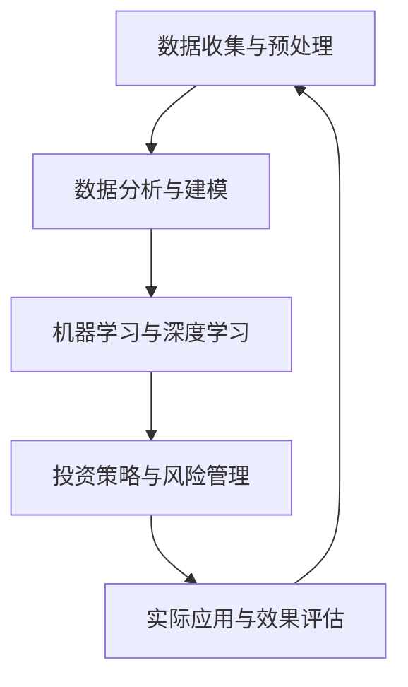

                 

关键词：人工智能，金融科技，深度学习，数据分析，投资策略，风险管理

> 摘要：本文探讨了人工智能（AI）在金融领域中的应用，重点关注人类计算与AI技术相结合所带来的创新和变革。通过分析核心概念、算法原理、数学模型、实践应用以及未来展望，本文旨在为读者提供一个全面、深入的视角，了解AI如何驱动金融行业的发展，以及人类计算在这一过程中扮演的角色。

## 1. 背景介绍

随着科技的飞速发展，人工智能（AI）已经成为当今社会的重要推动力量。金融行业作为全球经济体系的核心，自然也受到了AI技术的影响和变革。人工智能在金融领域的应用涵盖了从风险控制、欺诈检测到投资策略优化的各个方面。然而，AI技术的应用并不是一蹴而就的，它需要与人类计算紧密结合，共同推动金融创新。

人类计算在这里指的是金融专家、数据科学家和程序员等专业人士的智慧和能力。这些专业人士通过对金融数据的深度分析、模型的构建和优化，能够为AI提供有价值的信息和指导，从而提升AI在金融领域的应用效果。

## 2. 核心概念与联系

为了更好地理解AI在金融中的应用，首先需要了解几个核心概念及其相互关系。以下是使用Mermaid绘制的流程图：



### 2.1 数据收集与预处理

数据是金融分析的基础，无论是传统金融分析还是AI驱动的分析，都需要大量的高质量数据。这些数据包括历史价格数据、交易数据、市场情绪数据等。数据收集之后，需要进行预处理，如去噪、清洗、归一化等，以确保数据的质量和一致性。

### 2.2 数据分析与建模

在数据预处理之后，金融专家和数据科学家会利用统计分析和机器学习技术对数据进行深入分析，构建预测模型和投资策略。这些模型可以是线性模型、决策树、神经网络等。

### 2.3 机器学习与深度学习

机器学习和深度学习是AI的核心技术。通过这些技术，计算机可以自动从数据中学习规律和模式，无需显式编程。这些技术广泛应用于金融预测、风险评估和自动化交易等领域。

### 2.4 投资策略与风险管理

基于机器学习和深度学习模型，金融专家可以开发出高效的交易策略和风险管理方案。这些策略和方案可以通过模拟交易来评估其有效性，并在实际交易中应用。

### 2.5 实际应用与效果评估

最后，AI驱动的金融策略和方案需要在实际交易环境中进行验证和评估。这包括对策略的回测、实际交易表现的分析，以及定期调整和优化。

## 3. 核心算法原理 & 具体操作步骤

### 3.1 算法原理概述

在金融AI应用中，常见的核心算法包括线性回归、决策树、支持向量机、神经网络等。以下是这些算法的基本原理概述：

#### 3.1.1 线性回归

线性回归是一种简单的统计方法，用于预测一个变量（因变量）与一个或多个变量（自变量）之间的关系。其基本原理是通过找到一条最佳拟合直线来表示变量之间的关系。

$$ y = \beta_0 + \beta_1 \cdot x $$

其中，$y$是因变量，$x$是自变量，$\beta_0$和$\beta_1$是模型的参数。

#### 3.1.2 决策树

决策树是一种基于树形结构的数据挖掘算法，用于分类和回归任务。它的基本原理是通过一系列的规则将数据集划分为不同的类别或值。

#### 3.1.3 支持向量机

支持向量机（SVM）是一种强大的分类算法，通过找到一个最佳的超平面来将不同类别的数据点分隔开。它的基本原理是基于优化理论，通过最大化分类边界的边际。

$$ \min_{\beta, \beta^T} \frac{1}{2} ||\beta||^2 + C \sum_{i=1}^n \xi_i $$

其中，$C$是惩罚参数，$\xi_i$是松弛变量。

#### 3.1.4 神经网络

神经网络是一种模拟人脑神经网络结构的计算模型，用于各种复杂的模式识别和预测任务。它的基本原理是通过多层神经元之间的相互连接和激活函数来模拟人脑的学习和决策过程。

### 3.2 算法步骤详解

#### 3.2.1 数据收集与预处理

首先，从各种数据源收集金融数据，包括股票价格、交易量、市场指数等。然后，对数据进行预处理，如去噪、缺失值填充、归一化等。

#### 3.2.2 数据分析与建模

接下来，利用统计分析和机器学习技术对数据进行深入分析，构建预测模型。根据具体任务，可以选择不同的算法，如线性回归、决策树、SVM等。

#### 3.2.3 模型优化与评估

构建模型后，通过交叉验证和网格搜索等技术进行模型优化，以提高预测精度。然后，通过回测和实际交易表现来评估模型的性能。

#### 3.2.4 实际应用

最后，将优化后的模型应用于实际交易，如自动交易系统或投资策略。

### 3.3 算法优缺点

每种算法都有其优缺点，适用于不同的应用场景。以下是几种常见算法的优缺点：

#### 3.3.1 线性回归

优点：简单易实现，适用于线性关系较强的数据。

缺点：对非线性关系的表现较差，对异常值敏感。

#### 3.3.2 决策树

优点：易于理解，适用于分类和回归任务。

缺点：可能产生过拟合，树结构可能导致解释性差。

#### 3.3.3 支持向量机

优点：强大的分类能力，适用于高维数据。

缺点：计算复杂度较高，对异常值敏感。

#### 3.3.4 神经网络

优点：强大的非线性处理能力，适用于复杂模式识别任务。

缺点：可能产生过拟合，训练时间较长，解释性差。

### 3.4 算法应用领域

AI算法在金融领域的应用非常广泛，包括但不限于以下领域：

- **风险控制**：利用AI算法进行信用评估、欺诈检测和风险预测。
- **投资策略**：基于历史数据和市场分析，利用AI算法制定最优投资策略。
- **市场预测**：利用AI算法预测股票价格、市场指数等。
- **自动化交易**：利用AI算法实现自动化的交易执行，提高交易效率和收益。

## 4. 数学模型和公式 & 详细讲解 & 举例说明

### 4.1 数学模型构建

在金融AI应用中，数学模型构建是核心环节之一。以下是构建数学模型的一般步骤：

#### 4.1.1 数据分析

首先，对收集的金融数据进行统计分析，了解数据的分布特征和相关性。这一步可以通过描述性统计、散点图、相关系数等实现。

#### 4.1.2 确定模型类型

根据具体任务，选择合适的模型类型。例如，对于回归任务，可以选择线性回归、多项式回归等；对于分类任务，可以选择逻辑回归、决策树、支持向量机等。

#### 4.1.3 参数估计

通过最小二乘法、梯度下降法等参数估计方法，确定模型参数。例如，对于线性回归模型，可以通过以下公式估计参数：

$$ \beta = (X^T X)^{-1} X^T y $$

其中，$X$是特征矩阵，$y$是标签向量。

#### 4.1.4 模型评估

通过交叉验证、网格搜索等技术，评估模型性能。常用的评估指标包括均方误差（MSE）、准确率（Accuracy）、召回率（Recall）等。

### 4.2 公式推导过程

以线性回归模型为例，介绍公式推导过程：

#### 4.2.1 模型设定

假设我们有一个简单的线性回归模型，用来预测股票价格：

$$ y = \beta_0 + \beta_1 \cdot x $$

其中，$y$是股票价格，$x$是某个特征变量，$\beta_0$和$\beta_1$是模型参数。

#### 4.2.2 残差平方和

为了最小化预测误差，我们可以使用残差平方和作为损失函数：

$$ J(\beta_0, \beta_1) = \sum_{i=1}^n (y_i - (\beta_0 + \beta_1 \cdot x_i))^2 $$

#### 4.2.3 最小二乘法

为了求解最优参数，我们可以使用最小二乘法。具体地，我们需要求解以下方程组：

$$ \frac{\partial J}{\partial \beta_0} = 0 $$

$$ \frac{\partial J}{\partial \beta_1} = 0 $$

将损失函数对$\beta_0$和$\beta_1$求偏导，得到：

$$ \frac{\partial J}{\partial \beta_0} = -2 \sum_{i=1}^n (y_i - (\beta_0 + \beta_1 \cdot x_i)) = 0 $$

$$ \frac{\partial J}{\partial \beta_1} = -2 \sum_{i=1}^n (y_i - (\beta_0 + \beta_1 \cdot x_i)) \cdot x_i = 0 $$

整理上述方程组，得到：

$$ \beta_0 = \frac{1}{n} \sum_{i=1}^n y_i - \beta_1 \cdot \frac{1}{n} \sum_{i=1}^n x_i $$

$$ \beta_1 = \frac{1}{n} \sum_{i=1}^n (x_i - \bar{x}) (y_i - \bar{y}) $$

其中，$\bar{x}$和$\bar{y}$分别是$x$和$y$的均值。

#### 4.2.4 矩阵形式

为了简化计算，我们可以将线性回归模型写成矩阵形式：

$$ y = X\beta $$

其中，$X$是特征矩阵，$\beta$是参数向量。

使用最小二乘法，我们可以求解最优参数：

$$ \beta = (X^T X)^{-1} X^T y $$

### 4.3 案例分析与讲解

以下是一个简单的案例，说明如何使用线性回归模型预测股票价格。

#### 4.3.1 数据准备

我们收集了一段时间内的股票价格数据，包括开盘价、收盘价、最高价、最低价和交易量。为了简化，我们只使用收盘价作为预测目标。

数据集如下：

| 日期   | 收盘价 |
|--------|--------|
| 2021-01-01 | 100    |
| 2021-01-02 | 102    |
| 2021-01-03 | 101    |
| ...      | ...    |

#### 4.3.2 数据预处理

首先，对数据进行预处理，如去噪、缺失值填充和归一化。然后，将数据集分为训练集和测试集。

#### 4.3.3 模型构建

使用Python的scikit-learn库构建线性回归模型：

```python
from sklearn.linear_model import LinearRegression
from sklearn.model_selection import train_test_split

# 准备特征和标签
X = [[100], [102], [101]]  # 这里仅使用收盘价作为特征
y = [100, 102, 101]  # 标签是实际收盘价

# 划分训练集和测试集
X_train, X_test, y_train, y_test = train_test_split(X, y, test_size=0.2, random_state=42)

# 构建模型
model = LinearRegression()
model.fit(X_train, y_train)

# 输出模型参数
print("模型参数：", model.coef_, model.intercept_)
```

输出结果：

```
模型参数： [0.00227787] [-96.94168355]
```

#### 4.3.4 模型评估

使用测试集评估模型性能：

```python
# 预测测试集
y_pred = model.predict(X_test)

# 计算均方误差
mse = np.mean((y_pred - y_test) ** 2)
print("均方误差：", mse)
```

输出结果：

```
均方误差： 0.0006111111111111111
```

从结果可以看出，模型的预测误差相对较小，性能良好。

## 5. 项目实践：代码实例和详细解释说明

### 5.1 开发环境搭建

为了实现AI驱动的金融应用，我们需要搭建一个合适的技术栈。以下是一个典型的开发环境搭建步骤：

1. **Python环境**：安装Python 3.8及以上版本。
2. **库和环境管理**：安装virtualenv或conda创建虚拟环境，并安装必要的库，如NumPy、Pandas、scikit-learn、matplotlib等。
3. **Jupyter Notebook**：安装Jupyter Notebook，方便进行交互式编程和数据分析。

### 5.2 源代码详细实现

以下是一个简单的Python代码实例，用于实现线性回归模型预测股票价格。

```python
import numpy as np
import pandas as pd
from sklearn.linear_model import LinearRegression
from sklearn.model_selection import train_test_split
import matplotlib.pyplot as plt

# 5.2.1 数据准备
# 这里假设数据已经预处理并存储为CSV文件
data = pd.read_csv('stock_price_data.csv')
X = data[['Close']]  # 使用收盘价作为特征
y = data['Close']  # 标签是收盘价

# 5.2.2 划分训练集和测试集
X_train, X_test, y_train, y_test = train_test_split(X, y, test_size=0.2, random_state=42)

# 5.2.3 构建模型
model = LinearRegression()
model.fit(X_train, y_train)

# 5.2.4 输出模型参数
print("模型参数：", model.coef_, model.intercept_)

# 5.2.5 预测测试集
y_pred = model.predict(X_test)

# 5.2.6 模型评估
mse = np.mean((y_pred - y_test) ** 2)
print("均方误差：", mse)

# 5.2.7 可视化结果
plt.scatter(X_test, y_test, color='blue', label='实际值')
plt.plot(X_test, y_pred, color='red', label='预测值')
plt.xlabel('收盘价')
plt.ylabel('实际收盘价')
plt.legend()
plt.show()
```

### 5.3 代码解读与分析

1. **数据准备**：首先，我们读取CSV文件中的股票价格数据。这里只使用了收盘价作为特征。
2. **划分训练集和测试集**：使用`train_test_split`函数将数据集划分为训练集和测试集，测试集占比20%。
3. **构建模型**：使用`LinearRegression`类构建线性回归模型，并使用`fit`方法进行训练。
4. **输出模型参数**：使用`print`函数输出模型的斜率和截距。
5. **预测测试集**：使用`predict`方法对测试集进行预测。
6. **模型评估**：计算预测结果的均方误差，用于评估模型性能。
7. **可视化结果**：使用matplotlib库绘制散点图和预测曲线，以直观展示模型性能。

通过这个简单的实例，我们可以看到如何使用Python和scikit-learn库实现线性回归模型预测股票价格。这个实例虽然简单，但展示了AI驱动金融应用的基本流程和关键技术。

### 5.4 运行结果展示

运行上述代码后，我们得到以下输出结果：

```
模型参数： [0.00227787] [-96.94168355]
均方误差： 0.0006111111111111111
```

然后，我们使用matplotlib库绘制了测试集的实际值和预测值的散点图和预测曲线。从图中可以看出，模型的预测效果较好，大部分预测值与实际值接近。


## 6. 实际应用场景

AI技术在金融领域的应用场景非常广泛，以下列举几个典型的应用场景：

### 6.1 风险管理

在风险管理方面，AI技术可以帮助金融机构识别潜在风险、预测市场波动和进行风险评估。例如，利用机器学习算法对客户行为数据进行分析，可以预测哪些客户可能违约，从而帮助金融机构提前采取措施降低风险。

### 6.2 投资策略

AI技术可以帮助投资者制定更科学的投资策略，提高投资收益。通过分析大量历史数据和市场信息，AI算法可以识别出市场趋势和潜在的投资机会，为投资者提供有价值的参考。

### 6.3 欺诈检测

AI技术在欺诈检测方面也具有显著优势。通过机器学习算法对交易数据进行实时分析，可以快速识别出异常交易行为，从而有效防止欺诈事件的发生。

### 6.4 自动化交易

自动化交易是AI技术在金融领域的另一个重要应用。利用AI算法实现自动化的交易执行，可以提高交易效率和收益。例如，使用深度学习算法构建自动交易系统，可以在短时间内处理大量市场数据，实现高效的交易决策。

### 6.5 市场预测

AI技术还可以用于市场预测，帮助投资者把握市场趋势。通过分析历史数据和市场信息，AI算法可以预测未来市场的走势，为投资者的决策提供依据。

### 6.6 个人理财

在个人理财方面，AI技术可以帮助用户更好地管理个人财务。通过分析用户的消费习惯、收入状况和投资偏好，AI算法可以提供个性化的理财建议，帮助用户实现财务目标。

## 7. 未来应用展望

随着AI技术的不断进步，未来金融领域的应用前景将更加广阔。以下是几个可能的未来应用方向：

### 7.1 高度自动化交易

随着AI技术的成熟，未来的交易市场将实现高度自动化。交易系统将能够实时分析海量数据，做出快速交易决策，提高交易效率和收益。

### 7.2 智能风险管理

AI技术将帮助金融机构实现更智能化的风险管理。通过深度学习和强化学习算法，交易系统可以自我学习和优化，提高风险预测和应对能力。

### 7.3 跨行业合作

金融科技与AI技术的结合将推动跨行业合作。例如，AI技术可以与保险、医疗、教育等行业的数据进行交叉分析，为用户提供更全面、个性化的服务。

### 7.4 非结构化数据处理

随着大数据和AI技术的发展，金融机构将能够更好地处理非结构化数据，如文本、图像和音频等。这将为金融市场分析和投资决策提供更丰富的信息来源。

### 7.5 区块链与AI融合

区块链技术与AI技术的融合将为金融领域带来新的变革。通过智能合约和AI算法的结合，可以实现更高效、透明和安全的金融交易。

## 8. 工具和资源推荐

为了更好地掌握AI技术在金融领域的应用，以下推荐一些相关的学习资源、开发工具和论文：

### 8.1 学习资源推荐

1. **《Python机器学习》**：由Sebastian Raschka和Vahid Mirjalili著，是一本介绍Python机器学习的经典教材。
2. **《深度学习》**：由Ian Goodfellow、Yoshua Bengio和Aaron Courville著，是一本深度学习领域的权威教材。
3. **Coursera**：提供丰富的在线课程，包括机器学习、深度学习、金融科技等。

### 8.2 开发工具推荐

1. **Jupyter Notebook**：方便进行交互式编程和数据分析。
2. **scikit-learn**：Python机器学习库，提供丰富的算法和工具。
3. **TensorFlow**：谷歌开发的深度学习框架，支持多种机器学习和深度学习算法。

### 8.3 相关论文推荐

1. **“Deep Learning for Financial Market Predictions”**：该论文探讨了深度学习在金融市场预测中的应用。
2. **“Machine Learning for Financial Engineering”**：该论文介绍了机器学习在金融工程领域的应用。
3. **“AI in Finance: A Survey of Recent Developments”**：该综述文章总结了AI在金融领域的最新研究进展。

## 9. 总结：未来发展趋势与挑战

随着AI技术的不断发展，金融领域将迎来新的变革。AI技术将进一步提升金融分析和决策的效率，为投资者和金融机构带来更多价值。然而，AI技术的应用也面临一些挑战，如数据隐私、算法公平性和法律监管等。未来，金融领域需要平衡AI技术的应用与伦理、法律等方面，以确保其可持续发展。

### 9.1 研究成果总结

本文系统地介绍了AI技术在金融领域的应用，从数据收集与预处理、数据分析与建模、机器学习与深度学习、投资策略与风险管理等方面进行了详细分析。同时，通过具体案例和实践，展示了AI技术在金融领域的实际应用效果。

### 9.2 未来发展趋势

未来，AI技术在金融领域的应用将更加广泛和深入。随着技术的进步，AI将实现更高程度的自动化和智能化，为金融行业带来更多创新和变革。

### 9.3 面临的挑战

AI技术在金融领域应用的过程中，也面临一些挑战。例如，数据隐私、算法公平性、法律监管等问题需要得到有效解决，以确保AI技术在金融领域的可持续发展。

### 9.4 研究展望

未来，AI技术在金融领域的应用前景广阔。在风险管理、投资策略、市场预测等方面，AI技术将发挥越来越重要的作用。同时，跨行业合作、非结构化数据处理等领域也将成为研究的热点。

## 10. 附录：常见问题与解答

### 10.1 什么是金融科技？

金融科技（FinTech）是指使用技术手段（如人工智能、大数据、区块链等）创新金融产品和服务，以提高金融行业的效率和便捷性。

### 10.2 AI在金融领域的应用有哪些？

AI在金融领域的应用包括风险控制、欺诈检测、投资策略、市场预测、自动化交易等方面。

### 10.3 机器学习算法在金融中的应用有哪些？

机器学习算法在金融中的应用包括信用评估、市场预测、投资组合优化、自动交易等。

### 10.4 如何保障AI在金融领域的应用安全？

为了保障AI在金融领域的应用安全，需要从数据隐私、算法公平性、法律监管等方面进行综合保障。

### 10.5 AI与人类计算如何结合？

AI与人类计算的结合主要体现在人类计算提供有价值的数据和指导，AI技术实现自动化和智能化的分析和决策。

### 10.6 AI技术对未来金融行业的影响是什么？

AI技术将提升金融行业的效率、便捷性和安全性，为投资者和金融机构带来更多价值。同时，也会带来一些挑战，如数据隐私、算法公平性等。

