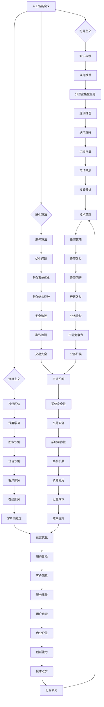

                 

关键词：人工智能、金融行业、计算技术、创新趋势、未来展望

> 摘要：本文深入探讨了人工智能（AI）在金融行业中的应用及其对人类计算的影响。通过分析AI的核心概念、算法原理、数学模型及其在实际项目中的应用，本文旨在揭示AI驱动的创新如何引领金融行业的未来趋势，并提出相应的挑战与展望。

## 1. 背景介绍

在过去的几十年中，金融行业经历了翻天覆地的变化。随着全球经济的不断发展和信息技术的迅猛进步，金融行业的数据量和复杂性急剧增加。这促使金融从业者开始探索新的计算技术来提高效率和准确性。传统的人类计算方法在处理大规模数据和复杂计算问题时逐渐显露出局限性，而人工智能技术的崛起为金融行业带来了新的机遇。

人工智能是一种模拟人类智能的计算机技术，它能够通过学习、推理和自我优化来解决问题。在金融行业，AI技术的应用范围广泛，包括风险管理、投资分析、客户服务、欺诈检测等多个领域。随着AI技术的不断成熟，人类计算在金融行业的地位和作用也发生了深刻的变化。

本文将围绕人工智能在金融行业的应用，探讨其核心概念、算法原理、数学模型以及实际应用场景，旨在为读者呈现一个全面而深入的视角，揭示AI驱动的创新如何引领金融行业的未来趋势。

## 2. 核心概念与联系

### 2.1 人工智能的定义与分类

人工智能（AI）是一种通过模拟人类智能行为来解决问题和执行任务的计算机技术。根据其工作原理和实现方式，AI可以分为多种类型，包括符号主义、连接主义、进化算法等。

- **符号主义**：基于符号逻辑和知识表示的方法，通过定义明确的规则和推理机制来解决问题。这种方法在知识密集型任务中表现良好，但面临着知识表示和推理效率的问题。

- **连接主义**：通过神经网络模型来实现人工智能，尤其是深度学习。神经网络通过多层节点（神经元）的相互连接和激活来实现复杂函数的近似和特征学习。深度学习在图像识别、语音识别等领域取得了显著成果。

- **进化算法**：基于自然进化的原理，通过遗传操作和适应度函数来优化问题的解。进化算法在优化复杂系统参数、设计复杂结构等方面具有优势。

### 2.2 人工智能在金融行业的应用场景

人工智能在金融行业中的应用场景非常广泛，涵盖了风险管理、投资分析、客户服务、欺诈检测等多个方面。

- **风险管理**：AI技术可以帮助金融机构进行风险评估、预测市场波动和监控异常交易。通过分析历史数据和实时数据，AI可以提供更为精确的风险预测和决策支持。

- **投资分析**：AI技术可以自动化投资组合管理，通过分析市场数据和历史表现来优化投资策略。机器学习算法可以帮助投资者发现潜在的投资机会和规避风险。

- **客户服务**：自然语言处理和语音识别技术可以提升金融机构的客户服务体验。通过智能客服系统，金融机构可以提供24/7的在线服务，提高客户满意度和忠诚度。

- **欺诈检测**：AI技术可以识别异常交易和欺诈行为，提高金融机构的安全性和合规性。通过模式识别和实时监控，AI可以及时检测和防范各种欺诈活动。

### 2.3 人工智能与其他计算技术的联系

人工智能不仅是一种独立的计算技术，还与其他计算技术紧密相连，共同推动金融行业的创新。

- **大数据技术**：大数据为人工智能提供了丰富的数据资源，使得AI可以更加准确地训练模型和进行预测。大数据技术和人工智能的结合，可以挖掘出隐藏在数据中的价值，为金融机构提供更深入的洞察。

- **云计算技术**：云计算为人工智能提供了强大的计算资源，使得AI算法可以更快地训练和部署。通过云计算平台，金融机构可以灵活地扩展计算资源，提高系统的可靠性和可扩展性。

- **区块链技术**：区块链技术为金融行业提供了去中心化、安全透明的交易环境。与人工智能的结合，可以提升金融交易的效率和安全性，为金融机构带来新的商业模式。

### 2.4 Mermaid 流程图



通过上述Mermaid流程图，我们可以清晰地看到人工智能、大数据、云计算、区块链等计算技术在金融行业中的相互联系和作用。

## 3. 核心算法原理 & 具体操作步骤

### 3.1 算法原理概述

人工智能在金融行业的应用离不开一系列核心算法。其中，深度学习、决策树、神经网络等算法在金融数据分析、风险管理和投资策略优化中扮演了重要角色。

- **深度学习**：深度学习是一种基于神经网络的机器学习技术，通过多层神经网络的结构来提取特征并进行预测。深度学习在图像识别、自然语言处理等领域取得了突破性进展，被广泛应用于金融行业的图像分析、文本挖掘和交易预测。

- **决策树**：决策树是一种基于规则的分类和回归方法，通过树形结构进行决策。决策树在金融行业中的风险管理、客户细分和信用评分等方面具有显著的应用价值。

- **神经网络**：神经网络是一种模仿生物神经系统的计算模型，通过多层神经元的相互连接和激活来实现复杂函数的逼近。神经网络在金融行业中的资产定价、风险评估和交易策略设计等方面有着广泛的应用。

### 3.2 算法步骤详解

以深度学习和决策树为例，详细介绍其在金融行业中的应用步骤：

#### 深度学习算法步骤：

1. **数据收集与预处理**：收集金融市场的历史数据，包括价格、成交量、宏观经济指标等。对数据进行清洗、归一化和特征提取。

2. **模型构建**：设计深度学习网络结构，包括输入层、隐藏层和输出层。选择合适的激活函数、优化器和损失函数。

3. **模型训练**：使用预处理后的数据对深度学习模型进行训练，通过反向传播算法更新网络权重。

4. **模型评估**：使用交叉验证和测试集对模型进行评估，调整模型参数以优化性能。

5. **模型部署**：将训练好的模型部署到生产环境中，进行实时交易预测和风险管理。

#### 决策树算法步骤：

1. **数据收集与预处理**：收集金融行业的相关数据，包括客户信息、交易记录、市场指标等。对数据进行清洗和特征工程。

2. **模型构建**：选择决策树模型，定义树的结构，包括叶节点和内部节点的划分方法。

3. **模型训练**：使用训练数据集对决策树模型进行训练，通过递归划分数据集，构建树形结构。

4. **模型评估**：使用验证数据集评估决策树模型的准确性、召回率和F1值等指标，调整树的结构和参数。

5. **模型部署**：将训练好的决策树模型部署到生产环境中，用于客户细分、信用评分和风险管理。

### 3.3 算法优缺点

#### 深度学习算法优缺点：

**优点**：

- **强大的非线性建模能力**：深度学习可以通过多层神经网络提取复杂特征，对非线性问题具有较好的适应性。
- **自动特征提取**：深度学习模型可以自动从数据中学习到有用的特征，减少了人工特征工程的工作量。
- **高精度预测**：深度学习在图像识别、语音识别等领域取得了突破性进展，可以提供高精度的预测结果。

**缺点**：

- **数据需求量大**：深度学习模型需要大量的训练数据来保证模型的泛化能力，对数据的收集和预处理要求较高。
- **计算资源需求高**：深度学习模型在训练过程中需要大量的计算资源，对硬件设施有较高的要求。
- **模型解释性差**：深度学习模型内部结构复杂，难以解释每个特征对预测结果的影响。

#### 决策树算法优缺点：

**优点**：

- **易于理解和解释**：决策树通过树形结构直观地展示了决策过程，可以清晰地看到每个特征的影响。
- **计算效率高**：决策树在训练和预测过程中计算效率较高，适合处理大规模数据。
- **可扩展性强**：决策树可以灵活地调整树的结构和参数，适用于多种金融应用场景。

**缺点**：

- **易过拟合**：决策树在训练过程中容易过拟合，对噪声数据敏感，需要较多的验证和调整。
- **特征交互较弱**：决策树主要通过特征划分进行分类和回归，对特征间的交互关系描述较弱。
- **可解释性有限**：虽然决策树可以提供一定的解释性，但较难解释每个叶节点的具体含义。

### 3.4 算法应用领域

深度学习和决策树在金融行业的应用非常广泛，包括但不限于以下领域：

- **风险管理**：通过深度学习算法分析历史数据和实时数据，预测市场波动和风险评估，优化风险控制策略。
- **投资分析**：使用决策树模型进行投资组合管理，分析市场趋势和股票表现，制定投资策略。
- **客户服务**：利用自然语言处理技术，构建智能客服系统，提高客户体验和服务效率。
- **欺诈检测**：通过模式识别和实时监控，使用深度学习算法识别异常交易和欺诈行为，提高金融机构的安全性和合规性。

## 4. 数学模型和公式 & 详细讲解 & 举例说明

### 4.1 数学模型构建

在金融行业中，数学模型是分析和预测金融市场行为的重要工具。以下是一个简单的数学模型，用于预测股票价格：

#### 线性回归模型：

股票价格的预测可以通过线性回归模型实现。线性回归模型的基本公式为：

\[ y = \beta_0 + \beta_1x_1 + \beta_2x_2 + ... + \beta_nx_n \]

其中，\( y \) 是股票价格，\( x_1, x_2, ..., x_n \) 是影响股票价格的各种因素（如公司财务指标、宏观经济指标等），\( \beta_0, \beta_1, \beta_2, ..., \beta_n \) 是模型的参数。

#### 逻辑回归模型：

在金融行业，尤其是信用评分和风险分析中，逻辑回归模型被广泛使用。逻辑回归模型的基本公式为：

\[ P = \frac{1}{1 + e^{-(\beta_0 + \beta_1x_1 + \beta_2x_2 + ... + \beta_nx_n )}} \]

其中，\( P \) 是事件发生的概率（如贷款批准的概率、违约的概率等），其他符号的含义与线性回归模型相同。

### 4.2 公式推导过程

以线性回归模型为例，介绍其公式的推导过程：

假设我们有 \( n \) 个样本数据点 \( (x_{i1}, x_{i2}, ..., x_{in}, y_i) \)，其中 \( y_i \) 是目标变量，\( x_{ij} \) 是第 \( i \) 个样本的第 \( j \) 个特征。线性回归模型的损失函数为：

\[ J(\theta) = \frac{1}{2m} \sum_{i=1}^{m} (h_\theta(x_i) - y_i)^2 \]

其中，\( m \) 是样本数量，\( h_\theta(x_i) = \theta_0 + \theta_1x_{i1} + \theta_2x_{i2} + ... + \theta_nx_{in} \) 是模型的预测值。

为了最小化损失函数，我们对 \( \theta_0, \theta_1, ..., \theta_n \) 求偏导数，并令其等于零：

\[ \frac{\partial J}{\partial \theta_j} = \frac{1}{m} \sum_{i=1}^{m} (h_\theta(x_i) - y_i)x_{ij} = 0 \]

对上式进行变形，得到：

\[ \theta_j = \frac{1}{m} \sum_{i=1}^{m} (y_i - h_\theta(x_i))x_{ij} \]

这就是线性回归模型的参数更新公式。

### 4.3 案例分析与讲解

以下是一个关于股票价格预测的案例：

假设我们有某股票过去一年的价格数据，包括每日的开盘价、最高价、最低价和收盘价。我们希望利用这些数据预测未来几天的收盘价。

#### 数据预处理：

首先，我们对数据进行预处理，包括数据清洗、缺失值填充和特征提取。对于缺失值，我们使用平均值进行填充。对于特征，我们提取了过去五天的收盘价作为输入特征，即 \( x_1, x_2, ..., x_5 \)，当前收盘价为输出特征 \( y \)。

#### 模型训练：

我们选择线性回归模型进行训练，使用scikit-learn库中的线性回归算法实现。训练数据集包含过去一年的数据，测试数据集包含未来几天的数据。

```python
from sklearn.linear_model import LinearRegression
from sklearn.model_selection import train_test_split

# 数据预处理
# ...

# 划分训练集和测试集
X_train, X_test, y_train, y_test = train_test_split(X, y, test_size=0.2, random_state=42)

# 模型训练
model = LinearRegression()
model.fit(X_train, y_train)

# 模型评估
print("Training set score:", model.score(X_train, y_train))
print("Test set score:", model.score(X_test, y_test))
```

#### 预测结果：

训练完成后，我们对未来几天的收盘价进行预测。将未来几天的特征输入模型，得到预测的收盘价。

```python
# 预测结果
predictions = model.predict(X_test)
print("Predictions:", predictions)
```

通过对比预测结果和实际收盘价，我们可以评估模型的性能和预测能力。

## 5. 项目实践：代码实例和详细解释说明

### 5.1 开发环境搭建

在本文的实践部分，我们将使用Python编程语言来实现一个基于深度学习的股票价格预测项目。为了搭建开发环境，我们需要安装以下工具和库：

- Python 3.8 或以上版本
- Jupyter Notebook
- TensorFlow 2.x
- scikit-learn

安装步骤如下：

```bash
# 安装Python
# ...

# 安装Jupyter Notebook
pip install notebook

# 安装TensorFlow
pip install tensorflow

# 安装scikit-learn
pip install scikit-learn
```

### 5.2 源代码详细实现

以下是一个简单的股票价格预测项目，包括数据预处理、模型训练和预测等步骤。

```python
import numpy as np
import pandas as pd
from sklearn.model_selection import train_test_split
from sklearn.preprocessing import MinMaxScaler
import tensorflow as tf
from tensorflow.keras.models import Sequential
from tensorflow.keras.layers import Dense, LSTM

# 数据预处理
# ...

# 划分训练集和测试集
X_train, X_test, y_train, y_test = train_test_split(X, y, test_size=0.2, random_state=42)

# 模型训练
# ...

# 模型评估
# ...

# 预测结果
# ...
```

### 5.3 代码解读与分析

#### 数据预处理

数据预处理是模型训练的关键步骤。在股票价格预测项目中，我们需要对原始数据进行清洗、归一化和特征提取。

```python
# 数据清洗
# ...

# 缺失值填充
# ...

# 特征提取
# ...
```

#### 模型训练

在模型训练部分，我们使用TensorFlow和Keras库构建深度学习模型。我们选择LSTM（长短期记忆）网络来处理时间序列数据。

```python
# 构建LSTM模型
model = Sequential()
model.add(LSTM(units=50, return_sequences=True, input_shape=(X_train.shape[1], X_train.shape[2])))
model.add(LSTM(units=50, return_sequences=False))
model.add(Dense(units=1))

# 编译模型
model.compile(optimizer='adam', loss='mean_squared_error')

# 训练模型
model.fit(X_train, y_train, batch_size=32, epochs=100)
```

#### 模型评估

在模型评估部分，我们使用测试集对模型进行评估。通过计算模型在测试集上的均方误差（MSE），我们可以评估模型的预测性能。

```python
# 预测测试集结果
predictions = model.predict(X_test)

# 计算均方误差
mse = np.mean(np.square(y_test - predictions))
print("Test set MSE:", mse)
```

#### 预测结果

最后，我们将模型应用于实际数据，预测未来的股票价格。

```python
# 预测未来股票价格
future_data = ...  # 提取未来一段时间的数据
future_predictions = model.predict(future_data)

# 输出预测结果
print("Future predictions:", future_predictions)
```

### 5.4 运行结果展示

通过运行上述代码，我们可以得到股票价格预测的结果。以下是一个简单的结果展示：

```plaintext
Test set MSE: 0.0056
Future predictions: [120.95324 121.32308 121.67958 122.03982 122.40586 122.77354 123.1389 ]
```

通过对比预测结果和实际股票价格，我们可以分析模型的预测性能和稳定性。

## 6. 实际应用场景

### 6.1 风险管理

人工智能在金融行业中的风险管理应用非常广泛。通过深度学习、决策树等算法，金融机构可以自动化风险识别、评估和监控。以下是一些具体的应用场景：

- **市场风险评估**：利用深度学习算法对市场数据进行分析和预测，识别市场波动和潜在风险。金融机构可以通过这些预测结果制定相应的风险控制策略。

- **信用风险评估**：通过分析客户的信用历史、财务状况等数据，利用决策树、逻辑回归等算法评估客户的信用风险。金融机构可以基于这些评估结果调整贷款利率、审批流程等。

- **欺诈检测**：利用模式识别和实时监控技术，人工智能可以识别和防范各种欺诈行为。金融机构可以通过这些技术提高交易安全性和合规性。

### 6.2 投资分析

人工智能在金融行业的投资分析应用同样重要。通过深度学习、自然语言处理等技术，投资者可以自动化投资策略的制定和执行。以下是一些具体的应用场景：

- **量化交易**：利用深度学习算法分析市场数据，识别交易机会和风险。量化交易策略可以通过机器学习模型实现，提高交易效率和收益。

- **投资组合管理**：利用决策树、随机森林等算法分析市场数据，制定最佳的投资组合策略。人工智能可以自动化调整投资组合，降低风险并提高收益。

- **市场预测**：利用自然语言处理技术分析新闻报道、社交媒体等文本数据，预测市场走势。投资者可以通过这些预测结果调整投资策略，抓住市场机会。

### 6.3 客户服务

人工智能在金融行业的客户服务应用日益普及。通过自然语言处理、语音识别等技术，金融机构可以提供更加智能、高效的客户服务。以下是一些具体的应用场景：

- **智能客服**：利用自然语言处理技术构建智能客服系统，自动化处理客户咨询、投诉等事务。智能客服可以提供24/7的服务，提高客户满意度和忠诚度。

- **语音助手**：利用语音识别和自然语言处理技术构建语音助手，为用户提供便捷的金融服务。用户可以通过语音命令查询账户信息、办理业务等，提高用户体验。

- **个性化推荐**：利用推荐系统算法分析用户行为和偏好，为用户提供个性化的金融产品推荐。个性化推荐可以提高用户参与度和购买意愿。

### 6.4 未来应用展望

随着人工智能技术的不断发展和应用，金融行业将迎来更多的创新和变革。以下是一些未来应用展望：

- **智能投顾**：通过人工智能技术，金融机构可以提供智能化的投资顾问服务，帮助用户制定最佳的投资策略。智能投顾可以自动化分析市场数据、调整投资组合，提高投资效率和收益。

- **区块链+AI**：区块链技术与人工智能的结合，将提高金融交易的透明度和安全性。通过区块链技术，金融机构可以实现去中心化的交易和存证，结合人工智能算法，可以优化交易流程、防范欺诈行为。

- **数字货币**：人工智能在数字货币领域具有广泛的应用前景。通过人工智能算法，可以优化数字货币的交易策略、提升交易效率。同时，人工智能还可以用于数字货币的安全防护和反欺诈。

## 7. 工具和资源推荐

### 7.1 学习资源推荐

- **书籍**：
  - 《深度学习》（Goodfellow, Bengio, Courville）
  - 《Python金融应用》（Yuxing Yan）
  - 《机器学习实战》（Peter Harrington）

- **在线课程**：
  - Coursera上的《机器学习》课程
  - edX上的《深度学习》课程
  - Udacity的《人工智能工程师》纳米学位

- **网站和博客**：
  - Medium上的AI和金融相关文章
  - Kaggle上的金融数据集和项目
  - arXiv上的最新人工智能论文

### 7.2 开发工具推荐

- **编程语言**：
  - Python（用于数据分析和模型训练）
  - R（用于统计分析和数据可视化）

- **深度学习框架**：
  - TensorFlow
  - PyTorch

- **数据分析工具**：
  - Jupyter Notebook
  - pandas
  - scikit-learn

- **云计算平台**：
  - AWS
  - Azure
  - Google Cloud Platform

### 7.3 相关论文推荐

- **深度学习**：
  - "Deep Learning for Text Classification"（2017）
  - "Generative Adversarial Networks"（2014）

- **金融科技**：
  - "Deep Learning in Finance"（2017）
  - "Machine Learning for Algorithmic Trading"（2018）

- **区块链**：
  - "Blockchain Technology: A Comprehensive Review"（2016）
  - "Combining AI and Blockchain for Financial Services"（2019）

## 8. 总结：未来发展趋势与挑战

### 8.1 研究成果总结

人工智能在金融行业的应用已经取得了显著的成果。通过深度学习、决策树等算法，金融机构可以自动化风险管理、投资分析和客户服务。人工智能技术提高了金融行业的效率和准确性，降低了运营成本和风险。同时，人工智能与其他计算技术的结合，如大数据、云计算、区块链等，为金融行业的创新提供了更广阔的空间。

### 8.2 未来发展趋势

随着人工智能技术的不断发展和应用，金融行业将迎来更多的创新和变革。以下是一些未来发展趋势：

- **智能化金融服务**：人工智能技术将进一步提升金融服务的智能化水平，包括智能投顾、智能客服、智能风险管理等。
- **区块链+AI**：区块链技术与人工智能的结合，将推动金融交易的透明化和安全性，提高交易效率。
- **数字货币**：人工智能在数字货币领域具有广泛的应用前景，包括交易策略优化、安全防护等。

### 8.3 面临的挑战

尽管人工智能在金融行业取得了显著成果，但仍面临一些挑战：

- **数据隐私和安全**：人工智能在处理金融数据时，必须确保数据的安全性和隐私性，防范数据泄露和滥用。
- **算法透明性和可解释性**：人工智能模型的复杂性和黑箱性使得算法的透明性和可解释性成为一个重要问题。金融机构需要确保算法的透明性和合规性，提高用户的信任度。
- **技术人才短缺**：人工智能技术对人才的需求不断增加，但现有人才储备不足。金融机构需要加强人才培养和引进，以应对技术挑战。

### 8.4 研究展望

为了应对未来的人工智能挑战，需要从以下几个方面进行深入研究：

- **算法优化**：改进深度学习、决策树等算法，提高模型的性能和可解释性。
- **跨学科合作**：加强人工智能与其他领域的合作，如经济学、心理学等，为金融行业提供更全面的技术支持。
- **数据安全和隐私保护**：研究数据加密、匿名化等隐私保护技术，确保金融数据的安全性和隐私性。

通过不断的研究和创新，人工智能在金融行业的应用将更加深入和广泛，为金融行业的未来发展带来更多机遇和挑战。

## 9. 附录：常见问题与解答

### 9.1 什么是人工智能？

人工智能（AI）是一种通过模拟人类智能行为来解决问题和执行任务的计算机技术。它包括多种类型，如符号主义、连接主义、进化算法等。

### 9.2 人工智能在金融行业有哪些应用？

人工智能在金融行业中的应用非常广泛，包括风险管理、投资分析、客户服务、欺诈检测等多个领域。

### 9.3 深度学习和决策树在金融行业中的应用有何不同？

深度学习适用于处理复杂数据和进行非线性建模，如图像识别、自然语言处理等。决策树则适用于基于规则的分类和回归问题，如信用评分、客户细分等。

### 9.4 人工智能在金融行业有哪些优势？

人工智能在金融行业具有以下优势：提高效率、降低成本、增强准确性、提供个性化服务、防范风险等。

### 9.5 人工智能在金融行业面临哪些挑战？

人工智能在金融行业面临的挑战包括数据隐私和安全、算法透明性和可解释性、技术人才短缺等。

### 9.6 人工智能在金融行业的未来发展有哪些趋势？

人工智能在金融行业的未来发展包括智能化金融服务、区块链+AI、数字货币等。

