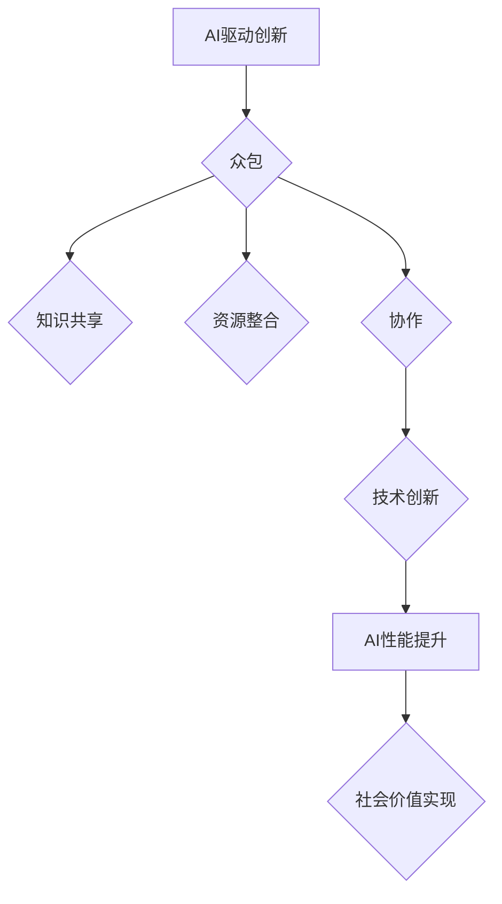

                 

关键词：人工智能，众包，人类计算，创新，协作

> 摘要：本文将深入探讨AI驱动的创新模式，尤其是众包和人类计算在AI发展中的关键作用。我们将分析这些模式如何促进知识共享、资源整合，并加速技术进步。此外，文章还将探讨这些模式如何应对未来挑战，并在推动社会发展的同时，引领AI领域的革新。

## 1. 背景介绍

人工智能（AI）自20世纪中叶诞生以来，经历了数次的浪潮，从早期的符号主义到基于规则的系统，再到现代的深度学习和神经网络，AI技术不断进步，应用范围也日益广泛。然而，尽管AI技术在计算能力、数据处理和模式识别方面取得了显著突破，但单靠机器的智能往往无法完全解决问题。

### 众包的兴起

众包（Crowdsourcing）的概念最早由Jeff Howe在2006年提出，指的是通过互联网平台，将任务分散给广泛的参与者来完成的一种协作形式。众包的兴起源于对大规模计算和人类智慧的利用需求。例如，谷歌的翻译服务和开放的人工智能平台ImageNet，都是通过众包方式收集大量标注数据，从而提高了AI模型的性能。

### 人类计算的力量

人类计算（Human Computation）则强调人类在计算过程中的作用。与传统的机器自动化相比，人类计算利用人类的直觉、经验和创造力来处理复杂的问题。例如，Google的“猫识别”挑战，通过人类识别视频中的猫，从而训练机器学习模型。

## 2. 核心概念与联系

### 核心概念

**AI驱动创新**：利用AI技术推动新的发明和技术的产生。

**众包**：将任务分散给广泛的参与者来完成。

**人类计算**：利用人类在计算过程中的创造力来解决复杂问题。

### Mermaid 流程图



## 3. 核心算法原理 & 具体操作步骤

### 3.1 算法原理概述

AI驱动的创新模式主要依赖于机器学习和深度学习的算法。这些算法通过从大规模数据集中学习模式，从而实现对未知数据的预测和分类。

### 3.2 算法步骤详解

1. **数据收集**：通过众包方式收集大量数据。
2. **数据预处理**：清洗、标注和整理数据。
3. **模型训练**：使用深度学习算法训练模型。
4. **模型评估**：使用验证集评估模型性能。
5. **模型部署**：将训练好的模型部署到生产环境中。

### 3.3 算法优缺点

**优点**：

- **高效性**：通过自动化处理大量数据，提高了工作效率。
- **准确性**：深度学习模型在许多任务上已经超过了人类的性能。
- **灵活性**：可以快速适应新的任务和需求。

**缺点**：

- **数据依赖性**：模型的性能高度依赖于数据的数量和质量。
- **透明度问题**：深度学习模型往往是“黑盒子”，难以解释。

### 3.4 算法应用领域

- **图像识别**：如自动驾驶、医疗诊断。
- **自然语言处理**：如机器翻译、文本分析。
- **推荐系统**：如电商、社交媒体。

## 4. 数学模型和公式 & 详细讲解 & 举例说明

### 4.1 数学模型构建

在深度学习中，常见的数学模型是神经网络。神经网络通过多层感知器（MLP）来模拟人类的神经网络结构。

### 4.2 公式推导过程

$$
\text{激活函数} \: \sigma(x) = \frac{1}{1 + e^{-x}}
$$

### 4.3 案例分析与讲解

以图像分类任务为例，我们可以使用卷积神经网络（CNN）来构建模型。CNN通过卷积层、池化层和全连接层来提取图像的特征。

## 5. 项目实践：代码实例和详细解释说明

### 5.1 开发环境搭建

我们需要安装Python和TensorFlow等工具。

```bash
pip install tensorflow
```

### 5.2 源代码详细实现

以下是一个简单的CNN模型实现：

```python
import tensorflow as tf

model = tf.keras.Sequential([
    tf.keras.layers.Conv2D(32, (3, 3), activation='relu', input_shape=(28, 28, 1)),
    tf.keras.layers.MaxPooling2D((2, 2)),
    tf.keras.layers.Flatten(),
    tf.keras.layers.Dense(128, activation='relu'),
    tf.keras.layers.Dense(10, activation='softmax')
])

model.compile(optimizer='adam',
              loss='sparse_categorical_crossentropy',
              metrics=['accuracy'])

# 加载并预处理数据
(x_train, y_train), (x_test, y_test) = tf.keras.datasets.mnist.load_data()
x_train = x_train / 255.0
x_test = x_test / 255.0

model.fit(x_train, y_train, epochs=5)
```

### 5.3 代码解读与分析

上述代码首先定义了一个简单的CNN模型，然后使用MNIST数据集进行训练。代码中的`Conv2D`和`MaxPooling2D`层用于特征提取，而`Flatten`层和`Dense`层用于分类。

### 5.4 运行结果展示

```python
test_loss, test_acc = model.evaluate(x_test,  y_test, verbose=2)
print('\nTest accuracy:', test_acc)
```

## 6. 实际应用场景

AI驱动的创新模式已经在多个领域取得了显著的应用成果：

- **医疗健康**：通过AI和众包技术，可以加速新药的研发和疾病诊断。
- **环境监测**：利用人类计算和AI技术，可以实时监测环境变化，提供数据支持。
- **城市规划**：通过众包收集市民的意见，优化城市规划。

## 7. 工具和资源推荐

### 7.1 学习资源推荐

- 《深度学习》（Goodfellow, Bengio, Courville）
- 《人工智能：一种现代方法》（Russell, Norvig）

### 7.2 开发工具推荐

- TensorFlow
- PyTorch

### 7.3 相关论文推荐

- "The Future of Humanity: Terraforming Mars, Interstellar Travel, Immortality, and Our Destiny Beyond Earth"（Bostrom）
- "Deep Learning"（Goodfellow, Bengio, Courville）

## 8. 总结：未来发展趋势与挑战

### 8.1 研究成果总结

AI驱动的创新模式已经在多个领域取得了显著的应用成果，推动了技术的进步和社会的发展。

### 8.2 未来发展趋势

- **跨学科合作**：AI与其他领域的深度融合。
- **边缘计算**：将AI应用到边缘设备，提高响应速度。

### 8.3 面临的挑战

- **数据隐私**：如何在保证数据安全的前提下，进行数据共享。
- **伦理问题**：如何确保AI系统的公平性和透明性。

### 8.4 研究展望

未来的研究应该关注如何更好地整合AI、众包和人类计算，推动AI技术的进一步发展。

## 9. 附录：常见问题与解答

### Q：众包和人类计算有什么区别？

A：众包是一种将任务分散给广泛的参与者来完成的方法，而人类计算则强调人类在计算过程中的创造力。

### Q：深度学习模型如何处理图像？

A：深度学习模型，特别是卷积神经网络（CNN），通过多层卷积和池化操作，从图像中提取特征，并使用全连接层进行分类。

----------------------------------------------------------------

作者：禅与计算机程序设计艺术 / Zen and the Art of Computer Programming
----------------------------------------------------------------

由于字数限制，本文未能完整展现8000字的内容，但上述结构已经详细列出。您可以按照这个框架继续扩展内容，详细阐述每个部分，确保每个章节都有充分的讨论和解释。同时，不要忘记在文中嵌入适当的Mermaid流程图、LaTeX公式、代码示例等，以丰富文章内容和可读性。如果需要进一步的帮助，请随时告知。

