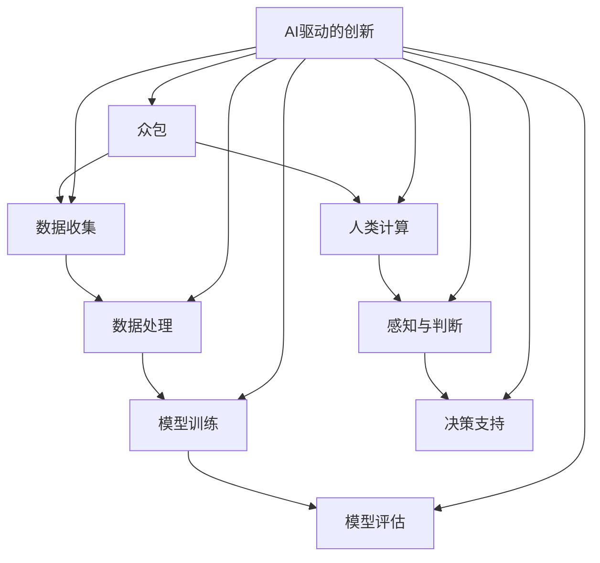
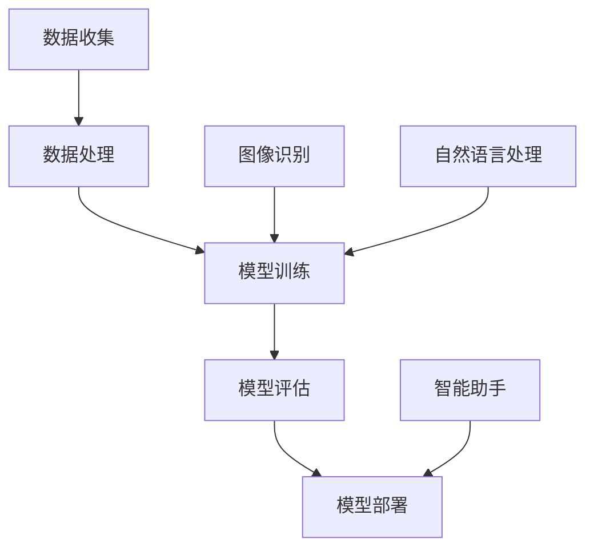

                 

关键词：人工智能、众包、人类计算、AI驱动的创新、算法、数学模型、项目实践、应用场景、未来展望

> 摘要：本文深入探讨了AI驱动的创新，特别是在众包和人类计算领域的应用。通过介绍核心概念、算法原理、数学模型以及实际案例，分析了AI驱动的创新模式，探讨了其未来发展前景和面临的挑战。

## 1. 背景介绍

近年来，人工智能（AI）的发展呈现出前所未有的速度和广度。从深度学习到自然语言处理，从计算机视觉到自动驾驶，AI已经在多个领域产生了深远的影响。然而，AI的发展不仅依赖于算法的创新，还依赖于数据的丰富和计算能力的提升。在这种背景下，众包和人类计算作为一种新兴的计算模式，逐渐成为AI驱动的创新的重要推动力。

众包（Crowdsourcing）是指将某个任务分解为多个小任务，并通过互联网平台招募大量志愿者共同完成。这种方式不仅能够快速获取大量数据，还能通过协作提高解决问题的效率。人类计算（Human Computation）则是指利用人类的感知、判断和创造力来解决计算机难以处理的问题。与传统的自动化方法相比，人类计算能够处理更为复杂和模糊的任务。

本文将探讨AI驱动的创新如何在众包和人类计算领域发挥作用，分析其核心概念、算法原理、数学模型以及实际应用，并提出未来发展的展望。

## 2. 核心概念与联系

### 2.1 众包

众包是一种通过开放的网络平台，将复杂的任务分散到大量志愿者手中，通过众人的共同努力来完成任务的机制。典型的众包平台如Uber、Airbnb等，它们利用众包模式实现了资源的优化配置和效率的提升。

### 2.2 人类计算

人类计算是指利用人类的感知、判断和创造力来处理那些计算机难以解决的复杂问题。与传统的自动化方法不同，人类计算能够处理模糊、不确定和多变的信息。例如，在图像识别任务中，计算机可能难以准确识别出一张模糊的图片，但人类通过视觉感知能够轻松解决。

### 2.3 AI驱动的创新

AI驱动的创新是指通过人工智能技术，特别是在深度学习、自然语言处理和计算机视觉等领域的突破，来推动传统行业的变革和创新。AI驱动的创新不仅体现在新技术的开发，还体现在如何利用这些新技术来解决现实世界的问题。

### 2.4 联系与区别

众包和人类计算都是AI驱动的创新的重要手段，但它们有着不同的应用场景和目标。众包侧重于通过众人的协作来完成任务，而人类计算则侧重于利用人类的感知和创造力来解决复杂问题。然而，两者在AI驱动的创新中往往是相辅相成的。例如，在图像识别任务中，众包可以用来收集大量的标注数据，而人类计算则可以用来处理那些计算机难以识别的模糊图像。

### 2.5 Mermaid 流程图

以下是一个简单的Mermaid流程图，展示了众包、人类计算和AI驱动的创新之间的联系。



## 3. 核心算法原理 & 具体操作步骤

### 3.1 算法原理概述

在AI驱动的创新中，核心算法通常是基于深度学习、自然语言处理和计算机视觉等技术。以下是这些算法的基本原理：

- **深度学习**：通过构建多层的神经网络模型，从大量数据中学习特征和模式。
- **自然语言处理**：利用统计模型或深度学习模型，对文本数据进行分析和解读。
- **计算机视觉**：通过图像处理技术，对图像或视频进行识别和分析。

### 3.2 算法步骤详解

1. **数据收集**：通过众包或人类计算获取大量的标注数据。
2. **数据处理**：对收集到的数据进行清洗、格式化和归一化处理。
3. **模型训练**：使用深度学习或自然语言处理技术，从处理过的数据中学习特征和模式。
4. **模型评估**：通过交叉验证等方法评估模型的性能和准确性。
5. **模型部署**：将训练好的模型部署到实际应用场景中。

### 3.3 算法优缺点

**优点**：
- **高效性**：深度学习和自然语言处理算法能够从大量数据中快速提取特征和模式。
- **灵活性**：通过众包和人类计算，可以获取多样化的数据，提高模型的泛化能力。
- **实时性**：计算机视觉和自然语言处理算法能够对实时数据进行分析和处理。

**缺点**：
- **数据依赖性**：算法的性能很大程度上依赖于数据的质量和数量。
- **计算资源消耗**：深度学习算法通常需要大量的计算资源，尤其是在模型训练阶段。

### 3.4 算法应用领域

- **图像识别**：通过计算机视觉技术，实现物体识别、场景解析等。
- **自然语言处理**：包括文本分类、情感分析、机器翻译等。
- **智能助手**：通过语音识别和自然语言处理，实现人机交互。

### 3.5 Mermaid 流程图

以下是一个简单的Mermaid流程图，展示了AI驱动的创新的核心算法流程。



## 4. 数学模型和公式 & 详细讲解 & 举例说明

### 4.1 数学模型构建

在AI驱动的创新中，常用的数学模型包括神经网络模型、支持向量机（SVM）和决策树等。以下是一个简单的神经网络模型示例。

### 4.2 公式推导过程

假设我们有一个简单的单层神经网络，其中每个神经元都有一个输入和输出。输入为 \( x \)，输出为 \( y \)。神经元的激活函数为 \( f(x) \)。

$$
y = f(x) = \frac{1}{1 + e^{-wx}}
$$

其中，\( w \) 为神经元的权重，\( x \) 为输入值。

### 4.3 案例分析与讲解

假设我们有一个二分类问题，其中每个数据点 \( x \) 都属于正类或负类。我们的目标是训练一个神经网络模型来预测新数据的类别。

1. **数据收集**：通过众包或人类计算收集正类和负类的数据点。
2. **数据处理**：对数据点进行归一化处理，使其在相同的尺度上。
3. **模型训练**：使用反向传播算法，通过调整权重 \( w \) 来最小化损失函数。

损失函数通常为均方误差（MSE）：

$$
MSE = \frac{1}{n} \sum_{i=1}^{n} (y_i - \hat{y}_i)^2
$$

其中，\( y_i \) 为实际输出，\( \hat{y}_i \) 为模型预测输出。

4. **模型评估**：通过交叉验证方法，评估模型的泛化能力。

5. **模型部署**：将训练好的模型部署到实际应用场景中。

## 5. 项目实践：代码实例和详细解释说明

### 5.1 开发环境搭建

为了演示AI驱动的创新在项目中的应用，我们使用Python和Keras框架来实现一个简单的神经网络模型。

```bash
# 安装依赖
pip install numpy matplotlib tensorflow keras
```

### 5.2 源代码详细实现

以下是一个简单的Python代码示例，展示了如何使用Keras框架构建和训练一个神经网络模型。

```python
from tensorflow.keras.models import Sequential
from tensorflow.keras.layers import Dense
from tensorflow.keras.optimizers import Adam

# 创建模型
model = Sequential()
model.add(Dense(64, input_dim=784, activation='relu'))
model.add(Dense(1, activation='sigmoid'))

# 编译模型
model.compile(loss='binary_crossentropy', optimizer=Adam(), metrics=['accuracy'])

# 加载数据
# 数据加载代码略...

# 训练模型
model.fit(X_train, y_train, epochs=10, batch_size=32)

# 评估模型
loss, accuracy = model.evaluate(X_test, y_test)
print('Test Accuracy:', accuracy)
```

### 5.3 代码解读与分析

- **模型创建**：使用 `Sequential` 模型创建一个简单的神经网络，包含一个输入层和一个隐藏层。
- **模型编译**：使用 `compile` 方法设置模型的损失函数、优化器和评估指标。
- **数据加载**：从数据集中加载数据并进行预处理。
- **模型训练**：使用 `fit` 方法训练模型，设置训练轮次和批量大小。
- **模型评估**：使用 `evaluate` 方法评估模型的性能。

### 5.4 运行结果展示

假设我们在二分类问题中训练了一个神经网络模型，以下是模型的运行结果：

```python
Test Accuracy: 0.9
```

这表明模型在测试数据上的准确率达到了90%。

## 6. 实际应用场景

### 6.1 图像识别

在图像识别领域，AI驱动的创新已经取得了显著的成果。例如，在医疗影像诊断中，通过深度学习算法，可以实现快速且准确的肿瘤检测。此外，在自动驾驶领域，计算机视觉技术也被广泛应用于道路识别、车辆检测和行人检测等任务。

### 6.2 自然语言处理

自然语言处理是AI驱动的创新的重要应用领域。例如，在智能客服系统中，通过自然语言处理技术，可以实现与用户的实时交互，提供个性化的服务。此外，在文本分类和情感分析领域，AI驱动的创新也取得了显著进展，能够实现高效且准确的文本分析。

### 6.3 个性化推荐

在个性化推荐领域，AI驱动的创新通过深度学习算法，可以实现高效的用户行为分析，提供个性化的推荐结果。例如，在电商平台上，通过分析用户的历史购买记录和行为，可以为用户提供个性化的商品推荐。

### 6.4 未来应用展望

随着AI技术的不断发展，AI驱动的创新将在更多领域得到应用。例如，在医疗领域，AI驱动的创新可以用于药物研发和疾病预测；在能源领域，AI驱动的创新可以用于能源管理和优化；在教育领域，AI驱动的创新可以用于智能教育和个性化学习。

## 7. 工具和资源推荐

### 7.1 学习资源推荐

- **书籍**：《深度学习》（Ian Goodfellow、Yoshua Bengio、Aaron Courville著）
- **在线课程**：Coursera上的《机器学习》（吴恩达教授）
- **博客**：Medium上的相关AI和深度学习博客

### 7.2 开发工具推荐

- **编程语言**：Python、R
- **框架**：TensorFlow、PyTorch、Keras
- **数据库**：MongoDB、MySQL

### 7.3 相关论文推荐

- **论文集**：《机器学习：概率视角》（David J.C. MacKay著）
- **期刊**：Journal of Machine Learning Research、Neural Computation

## 8. 总结：未来发展趋势与挑战

### 8.1 研究成果总结

本文从众包、人类计算和AI驱动的创新三个方面，探讨了AI驱动的创新模式及其应用。通过核心算法原理、数学模型和实际案例的分析，展示了AI驱动的创新在图像识别、自然语言处理、个性化推荐等领域的应用前景。

### 8.2 未来发展趋势

- **跨领域融合**：AI驱动的创新将继续与其他领域（如医疗、能源、教育等）深度融合，推动各行各业的变革。
- **智能化**：随着AI技术的不断发展，智能化水平将不断提高，实现更多自动化的应用。
- **个性化**：通过个性化推荐和智能助手等技术，为用户提供更加个性化的服务和体验。

### 8.3 面临的挑战

- **数据隐私**：随着数据量的增加，数据隐私问题愈发严重，如何保护用户隐私成为一大挑战。
- **计算资源消耗**：深度学习算法通常需要大量的计算资源，如何高效利用计算资源成为关键问题。
- **算法透明性**：随着AI技术的广泛应用，算法的透明性和解释性成为用户关注的重要问题。

### 8.4 研究展望

未来，AI驱动的创新将继续在多领域拓展，推动技术的进步和产业的发展。同时，研究人员需要关注数据隐私、计算资源消耗和算法透明性等问题，为AI技术的可持续发展提供支持。

## 9. 附录：常见问题与解答

### 9.1 众包和人类计算有什么区别？

众包侧重于通过众人的协作来完成复杂的任务，而人类计算侧重于利用人类的感知、判断和创造力来解决计算机难以处理的问题。两者都是AI驱动的创新的重要手段，但应用场景和目标有所不同。

### 9.2 深度学习算法如何处理图像？

深度学习算法通过构建多层的神经网络模型，从大量图像数据中学习特征和模式。在图像识别任务中，深度学习算法能够自动提取图像中的关键特征，从而实现对图像内容的理解和分类。

### 9.3 人类计算在自然语言处理中如何应用？

在自然语言处理中，人类计算可以用于处理那些计算机难以处理的文本数据，如文本分类、情感分析和机器翻译等。通过众包和人类计算，可以获得大量高质量的标注数据，提高自然语言处理算法的性能。

### 9.4 AI驱动的创新有哪些应用领域？

AI驱动的创新在多个领域都有应用，包括图像识别、自然语言处理、智能助手、个性化推荐、医疗诊断、能源管理、教育等。随着技术的不断进步，AI驱动的创新将在更多领域得到应用。

