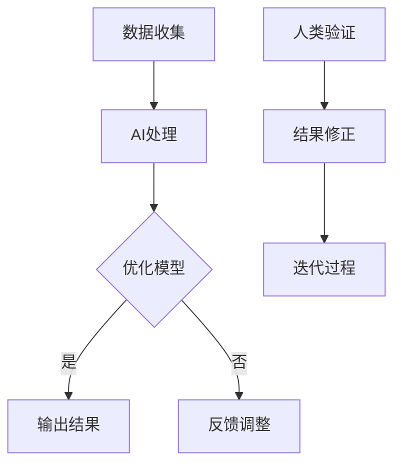

                 

 关键词：人工智能，众包，人类计算，创新，协作，技术发展，应用场景

> 摘要：本文探讨了人工智能（AI）驱动下，利用众包和人类计算实现创新的方法和策略。通过分析众包与人类计算的基本原理及其在AI应用中的整合，本文揭示了其在提升计算能力、优化问题解决和创新思维方面的巨大潜力。同时，文章还对当前的研究进展和未来发展方向进行了探讨。

## 1. 背景介绍

### 1.1 人工智能的崛起

人工智能作为21世纪最具变革性的技术之一，正迅速改变着各个领域的运作方式。从自动化生产线到智能助手，AI的应用已深入人心。AI的核心在于其能够通过机器学习和深度学习算法从大量数据中学习规律，并在此基础上进行决策和预测。

### 1.2 众包的发展

众包（Crowdsourcing）是近年来兴起的一种协作模式，它通过将任务分散到广泛的参与者群体中来共同完成。这种模式不仅降低了成本，还极大地提高了问题的解决效率。众包的成功案例包括维基百科、InnoCentive以及各种在线创意竞赛平台。

### 1.3 人类计算的作用

人类计算（Human Computation）是一种结合了人类智慧和机器处理能力的计算模式。它利用人类的感知、推理和创造力来处理那些机器难以解决的复杂问题。人类计算在图像识别、语音识别和数据分析等领域展现出了强大的能力。

## 2. 核心概念与联系

在AI驱动的创新中，众包和人类计算扮演着至关重要的角色。它们不仅相互补充，还与AI技术紧密结合，形成了一种全新的计算模式。

### 2.1 众包与AI的整合

众包可以通过以下几种方式与AI相结合：

1. **数据收集**：众包平台可以收集大量标注数据，这些数据是机器学习算法训练的重要资源。
2. **算法优化**：通过众包，可以收集到多样化的解决方案，这些方案可以为算法优化提供灵感。
3. **协同工作**：AI可以辅助众包任务的执行，例如通过推荐系统来优化任务分配。

### 2.2 人类计算与AI的结合

人类计算与AI的结合体现在以下几个方面：

1. **人机协作**：AI可以识别和处理人类难以直接解决的任务，而人类则能够对AI的输出进行验证和修正。
2. **智能引导**：AI可以帮助人类计算识别问题，并提供解决思路。
3. **知识融合**：AI可以整合人类专家的知识，形成更加全面和准确的模型。

### 2.3 Mermaid 流程图

以下是一个简单的Mermaid流程图，展示了众包、人类计算与AI的整合过程：



## 3. 核心算法原理 & 具体操作步骤

### 3.1 算法原理概述

在AI驱动的创新中，常见的核心算法包括：

1. **机器学习算法**：用于从数据中学习规律，并用于预测和分类。
2. **深度学习算法**：利用多层神经网络来模拟人类的认知过程。
3. **强化学习算法**：通过试错来学习最优策略。

### 3.2 算法步骤详解

1. **数据收集**：通过众包平台收集大规模数据集。
2. **数据预处理**：清洗和标准化数据，以便进行机器学习。
3. **模型训练**：使用训练数据集来训练机器学习模型。
4. **模型评估**：使用验证数据集来评估模型性能。
5. **模型优化**：根据评估结果调整模型参数。
6. **人类计算**：利用人类智慧对模型输出进行验证和修正。
7. **迭代过程**：不断重复上述步骤，以提升模型性能。

### 3.3 算法优缺点

- **优点**：
  - **高效性**：通过众包和人类计算，可以快速收集大量数据和解决方案。
  - **多样性**：多样化的数据和解决方案有助于提高模型的泛化能力。
  - **创新性**：结合人类智慧，可以产生新颖的解决方案。

- **缺点**：
  - **成本**：众包和人类计算都需要投入大量资源。
  - **质量控制**：确保众包数据的质量和人类计算的结果准确性是一个挑战。

### 3.4 算法应用领域

- **医疗健康**：用于疾病诊断和药物研发。
- **金融科技**：用于风险评估和欺诈检测。
- **教育**：用于个性化学习和智能评估。
- **娱乐**：用于内容推荐和游戏设计。

## 4. 数学模型和公式 & 详细讲解 & 举例说明

### 4.1 数学模型构建

在AI驱动的创新中，常见的数学模型包括：

1. **线性回归模型**：用于预测连续值。
2. **逻辑回归模型**：用于分类问题。
3. **神经网络模型**：用于复杂的数据处理和模式识别。

### 4.2 公式推导过程

以下是一个简单的线性回归模型的公式推导过程：

- **模型设定**：假设我们有n个数据点 (x_i, y_i)，其中 x_i 是自变量，y_i 是因变量。
- **模型假设**：线性回归模型假设 y_i 可以表示为 x_i 的线性组合，即 y_i = β_0 + β_1 * x_i + ε_i，其中 β_0 和 β_1 是模型参数，ε_i 是误差项。
- **损失函数**：为了最小化预测误差，我们使用平方损失函数，即 L(β_0, β_1) = Σ(y_i - (β_0 + β_1 * x_i))^2。
- **参数估计**：通过最小化损失函数，我们可以得到模型参数的估计值 β_0 和 β_1。

### 4.3 案例分析与讲解

假设我们有一个数据集，其中自变量 x_i 是学生的考试成绩，因变量 y_i 是学生的升学情况（0表示未升学，1表示升学）。我们可以使用线性回归模型来预测升学情况。

- **数据收集**：通过众包平台收集考试成绩和升学情况的数据。
- **数据预处理**：清洗数据，确保数据的准确性和一致性。
- **模型训练**：使用训练数据集来训练线性回归模型。
- **模型评估**：使用验证数据集来评估模型性能。
- **模型优化**：根据评估结果调整模型参数。
- **人类计算**：利用专家知识对模型输出进行验证和修正。

## 5. 项目实践：代码实例和详细解释说明

### 5.1 开发环境搭建

在本项目中，我们将使用Python作为主要编程语言，结合TensorFlow和Scikit-learn库来实现线性回归模型。

- **安装Python**：确保Python环境已安装。
- **安装TensorFlow**：使用pip安装tensorflow库。
- **安装Scikit-learn**：使用pip安装scikit-learn库。

### 5.2 源代码详细实现

以下是一个简单的线性回归模型的实现代码：

```python
import numpy as np
import tensorflow as tf
from sklearn import linear_model

# 数据集
X = np.array([[1], [2], [3], [4], [5]])
y = np.array([1, 1.5, 2.5, 3.5, 5])

# TensorFlow模型
model = tf.keras.Sequential([
    tf.keras.layers.Dense(units=1, input_shape=[1])
])

# 编译模型
model.compile(optimizer='sgd', loss='mean_squared_error')

# 训练模型
model.fit(X, y, epochs=500)

# 预测
print(model.predict([[6]]))

# 使用Scikit-learn模型
lm = linear_model.LinearRegression()
lm.fit(X, y)

# 预测
print(lm.predict([[6]]))
```

### 5.3 代码解读与分析

- **数据集**：我们使用一个简单的数据集，其中自变量是学生的考试成绩，因变量是学生的升学情况。
- **TensorFlow模型**：我们使用TensorFlow库来实现线性回归模型。模型由一个全连接层（Dense）组成，输出层只有一个神经元，用于预测升学情况。
- **Scikit-learn模型**：我们使用Scikit-learn库来实现线性回归模型。这是一个基于传统的线性回归算法的实现。
- **训练与预测**：我们使用训练数据集来训练模型，并使用测试数据集来评估模型性能。最后，我们使用模型来预测新学生的升学情况。

## 6. 实际应用场景

### 6.1 医疗健康

在医疗健康领域，AI驱动的众包和人类计算可以用于：

- **疾病诊断**：通过众包收集病例数据和专家意见，利用AI技术进行疾病诊断。
- **药物研发**：利用人类专家的知识来指导AI筛选潜在药物，并优化药物配方。

### 6.2 金融科技

在金融科技领域，AI驱动的众包和人类计算可以用于：

- **风险评估**：通过众包收集海量交易数据，利用AI技术进行风险评估。
- **欺诈检测**：利用人类计算对交易行为进行分析，以检测潜在欺诈行为。

### 6.3 教育

在教育领域，AI驱动的众包和人类计算可以用于：

- **个性化学习**：通过众包收集学生的学习数据和教师的教学经验，利用AI技术为学生提供个性化学习计划。
- **智能评估**：利用AI和人类计算结合的方法，对学生作业和考试进行智能评估。

## 7. 工具和资源推荐

### 7.1 学习资源推荐

- **在线课程**：Coursera、edX和Udacity提供了丰富的AI和机器学习在线课程。
- **书籍推荐**：《深度学习》（Goodfellow、Bengio和Courville著）、《Python机器学习》（Sebastian Raschka著）。

### 7.2 开发工具推荐

- **编程语言**：Python和R是AI开发的流行语言。
- **框架**：TensorFlow、PyTorch和Keras是流行的深度学习框架。

### 7.3 相关论文推荐

- **《深度学习》（Goodfellow、Bengio和Courville著）**：这是一本深度学习的经典教材。
- **《强化学习》（Sutton和Barto著）**：这是一本强化学习的权威教材。
- **《机器学习》（Tom Mitchell著）**：这是一本机器学习的经典教材。

## 8. 总结：未来发展趋势与挑战

### 8.1 研究成果总结

AI驱动的创新通过众包和人类计算实现了以下几个方面的成果：

- **提高了计算能力**：众包和人类计算提供了大规模的数据和多样化的解决方案，提升了算法的性能。
- **优化了问题解决**：AI和人类智慧的结合，使得问题解决更加高效和准确。
- **促进了创新思维**：众包和人类计算激发了创新思维，推动了新的技术和应用的发展。

### 8.2 未来发展趋势

未来，AI驱动的创新将在以下几个方面继续发展：

- **更高效的数据收集和利用**：随着技术的进步，数据收集和处理的效率将进一步提升。
- **更智能的算法设计**：通过不断的研究，将开发出更加智能和高效的算法。
- **跨领域的融合应用**：AI驱动的创新将在更多领域得到应用，实现跨领域的融合。

### 8.3 面临的挑战

尽管AI驱动的创新具有巨大的潜力，但同时也面临以下挑战：

- **数据隐私和安全**：如何在确保数据隐私和安全的前提下，有效地利用众包和人类计算？
- **质量控制**：如何保证众包数据的质量和人类计算的结果准确性？
- **伦理和法律问题**：随着AI技术的发展，如何处理与伦理和法律相关的问题？

### 8.4 研究展望

未来的研究将集中在以下几个方面：

- **算法优化**：通过研究和开发新的算法，提升AI驱动的创新效率。
- **人机协作**：研究更加智能的人机协作机制，实现人类和AI的更好融合。
- **跨领域应用**：探索AI驱动的创新在更多领域的应用，推动科技进步和社会发展。

## 9. 附录：常见问题与解答

### 9.1 问题1：什么是众包？

**答案**：众包是一种将任务分散到广泛参与者群体中的协作模式，通过这些参与者的共同努力，以解决问题或完成任务。

### 9.2 问题2：人类计算有哪些优势？

**答案**：人类计算的优势在于其感知、推理和创造力，这些能力使得人类计算在处理复杂问题和进行创新思维方面具有显著优势。

### 9.3 问题3：如何确保众包数据的质量？

**答案**：确保众包数据质量的方法包括建立严格的参与规则、进行数据清洗和验证、以及使用机器学习算法来识别和处理异常数据。

---

# 结论

AI驱动的创新：利用众包和人类计算

作者：禅与计算机程序设计艺术 / Zen and the Art of Computer Programming

本文探讨了AI驱动的创新，通过众包和人类计算实现创新的策略和方法。通过分析这些核心概念及其在AI应用中的整合，本文揭示了其在提升计算能力、优化问题解决和创新思维方面的巨大潜力。未来，随着技术的不断进步，AI驱动的创新将在更多领域得到应用，为社会带来更多的变革和创新。|

