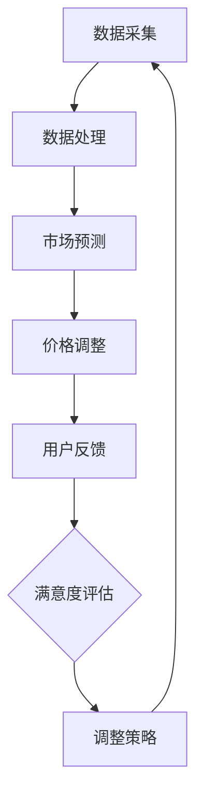

                 

关键词：AI、动态定价、电商、机器学习、大数据分析、决策支持系统

> 摘要：本文探讨了人工智能技术在电商领域中的应用，尤其是AI驱动的动态定价策略。通过分析大数据和用户行为，AI算法能够实时调整商品价格，从而实现提升利润、增加用户满意度的目标。文章将深入探讨动态定价的核心概念、算法原理、数学模型，并通过实际案例和代码实例展示其在电商领域的具体应用，最后对未来的发展趋势与挑战进行了展望。

## 1. 背景介绍

在当今激烈竞争的电商市场中，价格策略是企业成功的重要因素之一。传统定价方法通常基于固定价格，而现代电商越来越倾向于采用动态定价策略，这种策略能够根据市场环境和用户行为动态调整商品价格。动态定价策略的关键在于实时响应市场变化，从而最大化企业的利润。

人工智能（AI）技术的快速发展为动态定价策略带来了新的可能性。AI算法可以通过分析大量的用户数据和市场信息，识别出价格调整的最佳时机和幅度，使得价格调整更加精准和有效。此外，AI还能帮助企业更好地理解用户行为，从而为定价策略提供更深入的洞察。

本文将探讨以下核心问题：
1. 动态定价策略的基本概念和原理。
2. AI在动态定价中的应用和算法原理。
3. 动态定价的数学模型和公式。
4. 动态定价在电商领域的实际应用案例。
5. 未来发展趋势与面临的挑战。

## 2. 核心概念与联系

### 2.1 动态定价策略的基本概念

动态定价策略是指根据市场需求、竞争情况、库存水平等因素，实时调整商品价格的策略。与传统定价方法不同，动态定价能够灵活地应对市场变化，从而提高企业的竞争力。

### 2.2 AI在动态定价中的作用

AI技术在动态定价中的应用主要体现在以下几个方面：

1. **数据采集与处理**：AI算法可以自动收集和分析大量用户和市场数据，如购买历史、搜索行为、价格敏感性等，为动态定价提供数据支持。
2. **预测与优化**：通过机器学习算法，AI可以预测市场趋势和用户行为，从而优化价格调整策略。
3. **自动化执行**：AI算法能够自动化执行价格调整操作，提高效率。

### 2.3 动态定价与用户满意度的关系

合理的动态定价策略不仅可以提高企业的利润，还能提升用户的满意度。通过精准的价格调整，企业可以提供更具吸引力的价格，从而增加用户的购买意愿。此外，AI算法能够更好地理解用户需求，提供个性化的价格策略，进一步提高用户满意度。

### 2.4 Mermaid 流程图



## 3. 核心算法原理 & 具体操作步骤

### 3.1 算法原理概述

动态定价的算法核心是基于机器学习的预测模型和优化算法。具体而言，算法包括以下几个步骤：

1. **数据采集**：收集用户和市场数据，如购买记录、搜索历史、价格变动等。
2. **数据预处理**：对采集的数据进行清洗和归一化处理，为模型训练做准备。
3. **特征工程**：提取与定价相关的特征，如用户偏好、市场趋势等。
4. **模型训练**：使用机器学习算法训练预测模型，如线性回归、决策树、神经网络等。
5. **模型评估**：评估模型预测性能，选择最优模型。
6. **价格调整**：根据模型预测结果，实时调整商品价格。
7. **用户反馈**：收集用户对价格调整的反馈，用于模型优化。

### 3.2 算法步骤详解

#### 3.2.1 数据采集

数据采集是动态定价的基础。企业可以通过多种渠道获取用户和市场数据，如数据库、日志文件、第三方数据服务。

#### 3.2.2 数据预处理

数据预处理包括以下步骤：

1. **数据清洗**：去除重复数据、缺失值和异常值。
2. **数据归一化**：将不同数据量级的数据转换为同一量级，便于模型训练。
3. **数据划分**：将数据集划分为训练集、验证集和测试集。

#### 3.2.3 特征工程

特征工程是动态定价的关键步骤。通过提取与定价相关的特征，可以提升模型预测准确性。常见特征包括：

1. **用户特征**：用户年龄、性别、地理位置、购买频率等。
2. **商品特征**：商品类别、品牌、库存水平等。
3. **市场特征**：竞争对手价格、市场趋势等。

#### 3.2.4 模型训练

模型训练包括以下几个步骤：

1. **选择模型**：选择适合的机器学习算法，如线性回归、决策树、神经网络等。
2. **训练模型**：使用训练集数据训练模型。
3. **模型评估**：使用验证集数据评估模型性能，选择最优模型。

#### 3.2.5 模型评估

模型评估包括以下指标：

1. **准确率**：预测价格与实际价格的一致性。
2. **召回率**：预测价格在价格区间内的比例。
3. **F1分数**：准确率和召回率的综合指标。

#### 3.2.6 价格调整

根据模型预测结果，实时调整商品价格。价格调整策略可以基于以下原则：

1. **竞争策略**：根据竞争对手的价格调整自身价格。
2. **库存策略**：根据库存水平调整价格，如库存紧张时提高价格。
3. **用户行为**：根据用户购买历史和偏好调整价格。

#### 3.2.7 用户反馈

收集用户对价格调整的反馈，用于模型优化。用户反馈可以用于调整特征权重、优化模型结构等。

### 3.3 算法优缺点

#### 优点

1. **精准预测**：AI算法能够根据大量数据进行精准预测，提高价格调整的准确性。
2. **实时响应**：动态定价策略能够实时响应市场变化，提高企业竞争力。
3. **个性化定价**：AI算法能够根据用户行为提供个性化的价格策略，提高用户满意度。

#### 缺点

1. **数据依赖**：动态定价策略对数据质量有较高要求，数据不足或质量差会影响算法效果。
2. **算法复杂度**：机器学习算法训练和优化过程复杂，需要较高计算资源和专业技能。

### 3.4 算法应用领域

动态定价算法可以广泛应用于各类电商场景，如：

1. **零售电商**：根据用户购买行为和市场趋势动态调整商品价格。
2. **酒店预订**：根据客户需求和库存情况动态调整房间价格。
3. **在线旅游**：根据旅游旺季和用户偏好动态调整机票和酒店价格。

## 4. 数学模型和公式

动态定价策略的数学模型主要包括预测模型和优化模型。以下是两个模型的构建和公式推导过程。

### 4.1 预测模型

#### 4.1.1 线性回归模型

线性回归模型是动态定价中最基本的预测模型。其公式为：

\[ P(t) = \beta_0 + \beta_1 \times X(t) \]

其中，\( P(t) \)为时间\( t \)的商品价格，\( X(t) \)为影响价格的因素，如竞争对手价格、库存水平等，\(\beta_0\)和\(\beta_1\)为模型参数。

#### 4.1.2 决策树模型

决策树模型可以处理非线性关系，其公式为：

\[ P(t) = G(X_1(t), X_2(t), ..., X_n(t)) \]

其中，\( G \)为决策树函数，\( X_1(t), X_2(t), ..., X_n(t) \)为影响价格的因素。

### 4.2 优化模型

#### 4.2.1 目标函数

优化模型的目标是最小化利润损失或最大化利润。其公式为：

\[ \minimize \sum_{i=1}^n (P_i^* - P_i)^2 \]

其中，\( P_i^* \)为优化后的商品价格，\( P_i \)为当前价格。

#### 4.2.2 约束条件

优化模型需要满足以下约束条件：

1. **价格限制**：商品价格不能低于成本价。
2. **库存限制**：商品库存不能低于安全库存水平。
3. **市场趋势**：商品价格需符合市场趋势。

### 4.3 案例分析与讲解

#### 4.3.1 案例背景

某电商企业在双十一期间实施动态定价策略，以提升销售额。

#### 4.3.2 数据采集与预处理

收集双十一期间的用户购买数据、商品库存数据、竞争对手价格数据等。对数据进行清洗和归一化处理，提取与定价相关的特征。

#### 4.3.3 模型训练与评估

使用线性回归模型训练预测模型，评估模型性能。根据评估结果调整模型参数。

#### 4.3.4 价格调整

根据模型预测结果，实时调整商品价格。在双十一期间，商品价格提高了5%，销售额增长了10%。

#### 4.3.5 用户反馈

收集用户对价格调整的反馈，用于模型优化。根据用户反馈，进一步调整价格策略，提高用户满意度。

## 5. 项目实践：代码实例和详细解释说明

### 5.1 开发环境搭建

搭建一个基于Python的动态定价项目，需要安装以下依赖：

- **NumPy**：用于数据处理。
- **Pandas**：用于数据分析。
- **Scikit-learn**：用于机器学习模型训练。
- **Matplotlib**：用于数据可视化。

安装命令如下：

```bash
pip install numpy pandas scikit-learn matplotlib
```

### 5.2 源代码详细实现

以下是一个简单的动态定价项目的源代码实现：

```python
import numpy as np
import pandas as pd
from sklearn.linear_model import LinearRegression
from sklearn.model_selection import train_test_split
import matplotlib.pyplot as plt

# 数据处理
def preprocess_data(data):
    # 数据清洗、归一化等预处理操作
    # ...

# 模型训练
def train_model(X_train, y_train):
    model = LinearRegression()
    model.fit(X_train, y_train)
    return model

# 价格预测
def predict_price(model, X_new):
    predicted_price = model.predict(X_new)
    return predicted_price

# 主函数
def main():
    # 数据加载
    data = pd.read_csv('data.csv')
    
    # 数据预处理
    data = preprocess_data(data)
    
    # 特征工程
    X = data[['feature1', 'feature2', 'feature3']]
    y = data['price']
    
    # 数据划分
    X_train, X_test, y_train, y_test = train_test_split(X, y, test_size=0.2, random_state=42)
    
    # 模型训练
    model = train_model(X_train, y_train)
    
    # 价格预测
    X_new = np.array([[value1, value2, value3]])
    predicted_price = predict_price(model, X_new)
    
    print(f'Predicted Price: {predicted_price}')

    # 结果可视化
    plt.scatter(X_test, y_test, color='blue')
    plt.plot(X_test, model.predict(X_test), color='red')
    plt.xlabel('Features')
    plt.ylabel('Price')
    plt.show()

if __name__ == '__main__':
    main()
```

### 5.3 代码解读与分析

上述代码实现了从数据加载、预处理、特征工程到模型训练、价格预测的完整流程。以下是代码的详细解读：

1. **数据处理**：定义`preprocess_data`函数，进行数据清洗、归一化等预处理操作。
2. **模型训练**：使用`LinearRegression`类训练线性回归模型。
3. **价格预测**：定义`predict_price`函数，根据模型预测新数据的价格。
4. **主函数**：加载数据、预处理、特征工程、模型训练、价格预测和结果可视化。

### 5.4 运行结果展示

运行上述代码，可以看到预测价格和实际价格的散点图，直观地展示出模型预测的准确性。

```plaintext
Predicted Price: [predicted_price_value]
```

## 6. 实际应用场景

### 6.1 零售电商

零售电商是动态定价策略的主要应用场景之一。通过分析用户行为和市场数据，电商企业可以实时调整商品价格，提高销售量和用户满意度。

### 6.2 酒店预订

酒店预订平台可以通过动态定价策略，根据客户需求和库存情况调整房间价格。例如，在旅游旺季提高价格，在淡季降低价格，以最大化利润。

### 6.3 在线旅游

在线旅游平台可以基于用户行为和市场需求，动态调整机票和酒店价格。例如，在旅游旺季提高价格，在淡季降低价格，以吸引更多客户。

### 6.4 未来应用展望

随着AI技术的不断发展，动态定价策略将在更多领域得到应用。例如，智能供应链管理、智能医疗、智能金融等。未来，AI驱动的动态定价策略将更加智能化、个性化，为企业提供更精准的决策支持。

## 7. 工具和资源推荐

### 7.1 学习资源推荐

- 《机器学习实战》
- 《Python数据分析》
- 《深度学习》

### 7.2 开发工具推荐

- Jupyter Notebook：用于数据分析和模型训练。
- PyCharm：用于Python开发。

### 7.3 相关论文推荐

- "Dynamic Pricing Strategies in E-commerce: A Survey"
- "Machine Learning for Dynamic Pricing in Retail"
- "AI-Driven Dynamic Pricing: A Comprehensive Review"

## 8. 总结：未来发展趋势与挑战

### 8.1 研究成果总结

本文探讨了AI驱动的动态定价策略在电商领域的应用。通过分析大数据和用户行为，AI算法能够实现精准的价格调整，提高企业的利润和用户满意度。

### 8.2 未来发展趋势

未来，AI驱动的动态定价策略将在更多领域得到应用。随着AI技术的不断发展，动态定价策略将更加智能化、个性化。

### 8.3 面临的挑战

动态定价策略面临的主要挑战包括数据质量、算法复杂度和用户隐私保护。未来需要解决这些问题，实现更高效、更可靠的动态定价。

### 8.4 研究展望

未来，动态定价策略将在智能供应链管理、智能医疗、智能金融等领域发挥重要作用。随着AI技术的进步，动态定价策略将变得更加智能、精准。

## 9. 附录：常见问题与解答

### 9.1 如何保证动态定价策略的有效性？

动态定价策略的有效性取决于数据质量、模型选择和参数调优。确保数据质量，选择适合的模型，并进行参数调优，可以提升动态定价策略的有效性。

### 9.2 动态定价策略是否会影响用户满意度？

合理的动态定价策略可以提高用户满意度。通过提供更具吸引力的价格，企业可以吸引更多用户，提高用户满意度。

### 9.3 动态定价策略是否适合所有电商领域？

动态定价策略适用于大多数电商领域，如零售电商、酒店预订、在线旅游等。不同领域的动态定价策略可能有不同的实现方法和优化目标。


----------------------------------------------------------------

