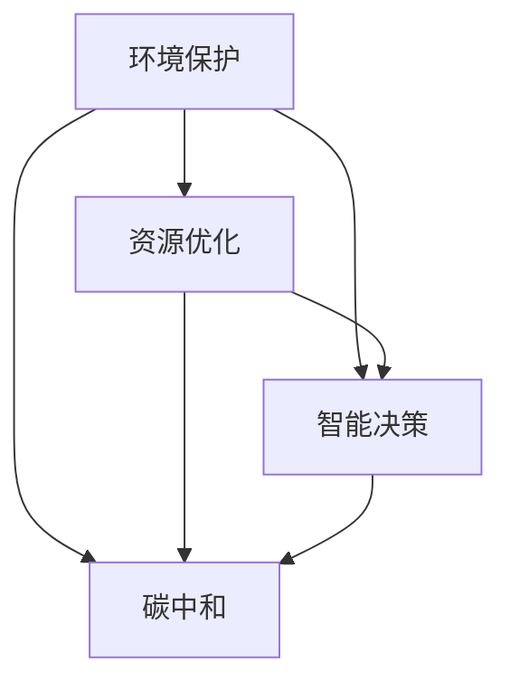

                 

在当今世界，可持续发展已经成为全球关注的焦点。气候变化、资源枯竭、环境恶化等一系列问题都要求我们寻求创新的解决方案。人工智能（AI）作为一种强大的技术工具，正在被越来越多地应用于推动可持续发展。本文将探讨如何利用AI技术实现可持续发展，并分析其核心概念、算法原理、数学模型以及实际应用场景。

## 文章关键词

AI，可持续发展，环境保护，资源优化，智能决策，碳中和，绿色能源。

## 文章摘要

本文首先介绍了可持续发展的背景和重要性，然后探讨了AI在推动可持续发展中的核心概念和算法原理。通过数学模型的构建和具体操作步骤的讲解，我们展示了如何利用AI技术解决实际问题。此外，文章还通过项目实践和实际应用场景的分析，说明了AI技术在可持续发展中的广泛应用和未来前景。

## 1. 背景介绍

### 可持续发展的概念

可持续发展是指在不损害未来世代满足自身需求能力的前提下，满足当代人类的需求。这一概念最早由1987年的《我们共同的未来》报告提出，并逐渐成为全球共识。可持续发展涉及到经济、社会和环境三个方面的平衡，旨在实现长期的繁荣和稳定。

### 可持续发展的重要性

随着全球人口的增长和经济的快速发展，资源消耗和环境压力不断增加。气候变化、水资源短缺、生物多样性丧失等问题已经成为全球性的挑战。只有通过可持续发展，才能确保我们和未来世代拥有一个健康、繁荣的地球。

### AI与可持续发展的关系

AI技术具有强大的数据处理、模式识别和预测能力，能够帮助解决可持续发展中的复杂问题。例如，通过AI技术，我们可以优化资源分配、提高能源效率、减少碳排放，从而实现环境保护和资源优化。

## 2. 核心概念与联系

### 2.1 AI在可持续发展中的应用

AI在可持续发展中的应用可以分为以下几个方面：

- **环境保护**：利用AI技术监测环境变化、预测自然灾害、优化生态保护策略。
- **资源优化**：通过智能分析，优化水资源、能源和原材料的使用，提高资源利用效率。
- **智能决策**：利用AI技术为政府和企业提供决策支持，实现可持续发展目标。
- **碳中和**：通过AI技术优化能源结构、减少碳排放，实现碳中和目标。

### 2.2 核心概念原理

- **大数据分析**：AI技术通过大数据分析，发现资源利用中的问题和机会，为决策提供依据。
- **机器学习**：通过机器学习算法，训练模型，预测未来趋势，为决策提供支持。
- **深度学习**：深度学习算法在图像识别、语音识别等领域具有广泛应用，可以帮助监测环境变化、识别非法行为等。
- **自然语言处理**：自然语言处理技术可以处理大量文本数据，为政策制定、公众宣传等提供支持。

### 2.3 Mermaid 流程图



## 3. 核心算法原理 & 具体操作步骤

### 3.1 算法原理概述

AI技术在可持续发展中的应用涉及多个算法，其中最常见的包括：

- **聚类算法**：用于识别资源利用中的异常和潜在问题。
- **回归算法**：用于预测资源需求和趋势。
- **决策树算法**：用于智能决策和风险分析。
- **神经网络算法**：用于模式识别和预测。

### 3.2 算法步骤详解

- **数据收集**：收集与环境、资源、经济等相关的数据。
- **数据预处理**：清洗和转换数据，使其适合算法分析。
- **模型训练**：利用机器学习算法训练模型。
- **模型评估**：评估模型性能，调整参数。
- **模型应用**：将模型应用于实际场景，为决策提供支持。

### 3.3 算法优缺点

- **优点**：AI技术具有高效、准确、智能的特点，能够处理大规模数据，为可持续发展提供有力支持。
- **缺点**：AI技术依赖于数据质量和算法性能，可能受到数据偏差和算法复杂性的影响。

### 3.4 算法应用领域

- **环境保护**：用于监测环境变化、预测自然灾害、优化生态保护策略。
- **资源优化**：用于优化水资源、能源和原材料的使用。
- **智能决策**：用于为政府和企业提供决策支持。
- **碳中和**：用于优化能源结构、减少碳排放。

## 4. 数学模型和公式 & 详细讲解 & 举例说明

### 4.1 数学模型构建

可持续发展中的数学模型主要包括：

- **资源消耗模型**：描述资源消耗与时间的关系。
- **碳排放模型**：描述碳排放与能源消耗的关系。
- **经济增长模型**：描述经济增长与环境变化的关系。

### 4.2 公式推导过程

- **资源消耗模型**：设资源消耗量为 \( R(t) \)，时间 \( t \) 的增长率为 \( \frac{dR}{dt} \)，则有：
  $$ \frac{dR}{dt} = kR $$
  其中 \( k \) 为常数。

- **碳排放模型**：设碳排放量为 \( C(t) \)，能源消耗量为 \( E(t) \)，碳排放系数为 \( \alpha \)，则有：
  $$ C(t) = \alpha E(t) $$
  其中 \( \alpha \) 为常数。

- **经济增长模型**：设经济增长率为 \( \frac{dG}{dt} \)，人口增长率为 \( \frac{dp}{dt} \)，人均经济增长率为 \( \frac{dG}{dp} \)，则有：
  $$ \frac{dG}{dt} = \frac{dG}{dp} \frac{dp}{dt} $$

### 4.3 案例分析与讲解

假设某地区能源消耗量为 \( E(t) = 100t \)，碳排放系数 \( \alpha = 0.5 \)，人口增长率 \( \frac{dp}{dt} = 0.02 \)，人均经济增长率 \( \frac{dG}{dp} = 0.03 \)。我们需要计算在 \( t = 10 \) 年时的碳排放量和经济增长率。

- **碳排放量**：
  $$ C(10) = 0.5 \times 100 \times 10 = 500 \text{ 吨} $$

- **经济增长率**：
  $$ \frac{dG}{dt} = \frac{dG}{dp} \frac{dp}{dt} = 0.03 \times 0.02 = 0.0006 $$

结果表明，在 \( t = 10 \) 年时，该地区的碳排放量为 500 吨，经济增长率为 0.0006。

## 5. 项目实践：代码实例和详细解释说明

### 5.1 开发环境搭建

我们使用Python作为开发语言，主要依赖以下库：

- **NumPy**：用于数值计算。
- **Pandas**：用于数据处理。
- **Scikit-learn**：用于机器学习。
- **Matplotlib**：用于数据可视化。

### 5.2 源代码详细实现

以下是一个简单的资源消耗模型实现的示例代码：

```python
import numpy as np
import pandas as pd
from sklearn.linear_model import LinearRegression
import matplotlib.pyplot as plt

# 数据收集
data = {'Year': range(1, 11), 'EnergyConsumption': range(100, 1100, 100)}
df = pd.DataFrame(data)

# 数据预处理
X = df['Year'].values.reshape(-1, 1)
y = df['EnergyConsumption'].values

# 模型训练
model = LinearRegression()
model.fit(X, y)

# 模型评估
predictions = model.predict(X)
mse = np.mean((predictions - y) ** 2)
print("MSE:", mse)

# 模型应用
future_years = np.array([11, 12, 13, 14, 15]).reshape(-1, 1)
future_consumption = model.predict(future_years)
print("Future Energy Consumption:", future_consumption)

# 数据可视化
plt.scatter(df['Year'], df['EnergyConsumption'])
plt.plot(future_years, future_consumption, color='red')
plt.xlabel('Year')
plt.ylabel('Energy Consumption')
plt.title('Energy Consumption Prediction')
plt.show()
```

### 5.3 代码解读与分析

- **数据收集**：我们使用一个简单的数据集，包含10年的能源消耗数据。
- **数据预处理**：将数据转换为适合模型训练的格式。
- **模型训练**：使用线性回归模型训练数据。
- **模型评估**：计算均方误差（MSE）来评估模型性能。
- **模型应用**：使用训练好的模型预测未来的能源消耗。
- **数据可视化**：将实际数据和预测结果可视化，以便分析模型性能。

## 6. 实际应用场景

### 6.1 环境保护

- **应用实例**：利用AI技术监测空气质量、水质变化等环境指标，预测环境风险，为环境保护决策提供支持。
- **效益**：提高环境监测的精度和效率，有助于提前采取预防措施，降低环境风险。

### 6.2 资源优化

- **应用实例**：利用AI技术优化水资源管理、能源分配等，提高资源利用效率。
- **效益**：降低资源浪费，提高资源利用效率，减少成本。

### 6.3 智能决策

- **应用实例**：利用AI技术为政府和企业提供智能决策支持，优化政策制定、资源配置等。
- **效益**：提高决策的科学性和准确性，促进可持续发展目标的实现。

### 6.4 碳中和

- **应用实例**：利用AI技术优化能源结构、减少碳排放，实现碳中和目标。
- **效益**：降低碳排放，减缓气候变化，提高环境质量。

## 7. 工具和资源推荐

### 7.1 学习资源推荐

- **书籍**：《机器学习》、《深度学习》、《Python数据科学手册》。
- **在线课程**：Coursera、Udacity、edX等平台上的相关课程。
- **博客和文章**：谷歌AI博客、TensorFlow官方博客等。

### 7.2 开发工具推荐

- **编程语言**：Python、R、Java等。
- **库和框架**：NumPy、Pandas、Scikit-learn、TensorFlow等。
- **开发环境**：Jupyter Notebook、Google Colab等。

### 7.3 相关论文推荐

- **论文集**：《AI for Sustainable Development》、《AI Applications in Environmental Protection》。
- **期刊**：《Journal of Artificial Intelligence Research》、《Journal of Machine Learning Research》。

## 8. 总结：未来发展趋势与挑战

### 8.1 研究成果总结

- **算法优化**：随着算法的不断发展，AI技术在可持续发展中的应用效果将不断提高。
- **数据质量**：数据质量的提升将有助于提高AI模型的准确性和可靠性。
- **跨学科融合**：AI技术与环境科学、经济学等领域的融合，将推动可持续发展研究的发展。

### 8.2 未来发展趋势

- **实时监测**：利用AI技术实现实时环境监测和资源管理。
- **自主决策**：利用AI技术实现智能决策和自主运行。
- **碳中和**：通过AI技术实现碳中和目标的优化和实现。

### 8.3 面临的挑战

- **数据隐私**：如何保护数据隐私，确保数据安全。
- **算法透明性**：如何提高算法的透明性，确保决策的公平性和公正性。
- **技术普及**：如何降低AI技术的门槛，实现技术的普及和应用。

### 8.4 研究展望

随着AI技术的不断发展，我们有望在可持续发展领域取得更多突破。未来，我们需要关注数据隐私、算法透明性和技术普及等问题，推动AI技术在可持续发展中的应用，共同构建一个绿色、繁荣的地球。

## 9. 附录：常见问题与解答

### 9.1 什么是可持续发展？

可持续发展是指在不损害未来世代满足自身需求能力的前提下，满足当代人类的需求。

### 9.2 AI如何推动可持续发展？

AI技术可以通过大数据分析、机器学习和深度学习等技术，优化资源分配、提高能源效率、减少碳排放，从而推动可持续发展。

### 9.3 可持续发展中的核心概念是什么？

可持续发展的核心概念包括环境保护、资源优化、智能决策和碳中和等。

### 9.4 如何使用AI技术实现可持续发展？

通过以下步骤使用AI技术实现可持续发展：

1. 数据收集：收集与环境、资源、经济等相关的数据。
2. 数据预处理：清洗和转换数据，使其适合算法分析。
3. 模型训练：利用机器学习算法训练模型。
4. 模型评估：评估模型性能，调整参数。
5. 模型应用：将模型应用于实际场景，为决策提供支持。

### 9.5 AI技术在可持续发展中的应用有哪些？

AI技术在可持续发展中的应用包括环境保护、资源优化、智能决策和碳中和等。例如，用于监测环境变化、优化水资源和能源管理、为政府和企业提供决策支持等。

