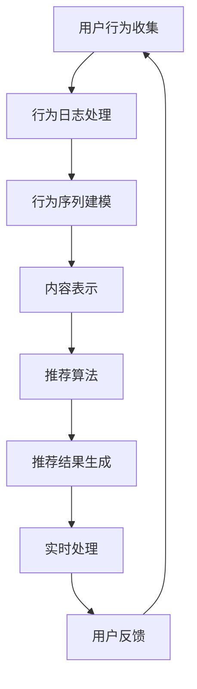

                 

关键词：人工智能、个性化推荐、实时处理、机器学习、深度学习、用户行为分析

> 摘要：本文将深入探讨AI驱动的实时个性化推荐技术的原理、模型、算法以及实际应用，旨在为读者提供一个全面的技术分析框架，以了解如何利用人工智能技术打造高效的个性化推荐系统。

## 1. 背景介绍

个性化推荐技术已成为互联网时代的重要一环，广泛应用于电子商务、社交媒体、新闻推送等众多领域。随着用户数据量的爆炸式增长，如何有效地处理海量数据，实时地为用户提供个性化的内容推荐成为了一个亟待解决的挑战。

传统的推荐系统通常依赖于基于内容的过滤和协同过滤算法。然而，这些方法往往存在一定的局限性，例如对于新用户或冷启动问题的处理不佳，以及推荐结果的可解释性较低等问题。随着深度学习和机器学习技术的发展，AI驱动的实时个性化推荐技术逐渐成为研究热点。

本文将介绍AI驱动的实时个性化推荐技术的核心概念、算法原理以及数学模型，并结合实际项目实例进行详细解释。希望通过本文的阐述，读者能够全面理解这一技术的原理和应用，为构建高效的个性化推荐系统提供参考。

## 2. 核心概念与联系

### 2.1. 用户行为分析

用户行为分析是构建个性化推荐系统的基石。通过分析用户在平台上的浏览、搜索、购买等行为，我们可以提取出用户的兴趣偏好和需求。具体方法包括：

- **行为日志分析**：记录用户在平台上的所有操作行为，例如浏览页面、点击链接、购买商品等。
- **行为序列建模**：使用时间序列分析方法，捕捉用户行为的动态变化，例如用户在购物车中的操作序列。
- **行为标签化**：将用户行为映射到相应的标签，以便进行后续分析和推荐。

### 2.2. 内容表示

内容表示是将用户和物品（例如商品、新闻、视频等）转化为向量表示的过程。这一步骤至关重要，因为它决定了推荐系统性能的优劣。常见的内容表示方法包括：

- **基于词袋模型**：将文本内容表示为词袋向量，通过词频统计进行表示。
- **基于词嵌入**：使用词嵌入技术（如Word2Vec、GloVe等）将文本转化为高维稀疏向量。
- **基于图表示**：利用图神经网络（如GCN、GAT等）对复杂网络结构进行表示。

### 2.3. 推荐算法

推荐算法是推荐系统的核心，其目标是根据用户行为和物品内容，为用户生成个性化的推荐列表。常见的推荐算法包括：

- **基于内容的推荐**：根据用户的历史行为和兴趣偏好，推荐与用户历史偏好相似的物品。
- **协同过滤推荐**：通过分析用户之间的相似度，推荐其他用户喜欢的物品。
- **基于模型的推荐**：利用机器学习模型（如决策树、随机森林、神经网络等）进行预测和推荐。

### 2.4. 实时处理

实时处理是AI驱动个性化推荐技术的关键挑战之一。它要求系统能够在用户产生新行为时，迅速地更新推荐结果。常见的方法包括：

- **增量学习**：在用户行为发生变化时，仅对相关部分进行重新训练。
- **在线学习**：持续地收集用户行为数据，并实时更新模型。
- **分布式计算**：利用分布式计算框架（如Apache Spark、Flink等），实现大规模数据的实时处理。

### 2.5. Mermaid 流程图

以下是一个简单的Mermaid流程图，展示了AI驱动实时个性化推荐系统的整体架构：



## 3. 核心算法原理 & 具体操作步骤

### 3.1. 算法原理概述

AI驱动的实时个性化推荐技术主要基于以下几个核心原理：

1. **用户行为分析**：通过分析用户的历史行为，提取用户的兴趣偏好和需求。
2. **内容表示**：将用户和物品转化为向量表示，以便进行后续计算。
3. **推荐算法**：利用机器学习模型进行预测和推荐。
4. **实时处理**：实现系统在用户产生新行为时，快速地更新推荐结果。

### 3.2. 算法步骤详解

1. **用户行为收集**：从平台的后台日志中收集用户的行为数据，包括浏览、搜索、购买等。

2. **行为日志处理**：对收集到的行为日志进行清洗和预处理，去除噪声数据和异常值。

3. **行为序列建模**：使用时间序列分析方法，将用户的行为序列转化为特征向量。

4. **内容表示**：对用户和物品进行内容表示，通常采用词袋模型、词嵌入或图表示等方法。

5. **推荐算法**：利用协同过滤、基于内容的推荐或基于模型的推荐算法，生成推荐列表。

6. **实时处理**：在用户产生新行为时，快速地更新推荐结果，确保推荐结果的实时性。

### 3.3. 算法优缺点

#### 优点

- **高效性**：利用机器学习和深度学习算法，能够处理大规模数据和复杂的用户行为。
- **个性化**：通过用户行为分析和内容表示，能够为用户提供高度个性化的推荐。
- **实时性**：支持实时处理，能够快速地更新推荐结果，提高用户体验。

#### 缺点

- **可解释性**：深度学习模型的可解释性较低，难以解释推荐结果的原因。
- **计算资源**：实时处理和大规模数据计算需要较高的计算资源，对硬件要求较高。
- **新用户问题**：对于新用户，缺乏足够的历史行为数据，推荐效果可能不佳。

### 3.4. 算法应用领域

AI驱动的实时个性化推荐技术广泛应用于多个领域，包括但不限于：

- **电子商务**：为用户提供个性化的商品推荐，提高用户购买意愿。
- **社交媒体**：根据用户的兴趣偏好，推荐相关的文章、视频等内容。
- **新闻推送**：根据用户的阅读习惯，推荐相关的新闻和资讯。
- **音乐和视频流媒体**：根据用户的播放历史，推荐相似的音乐和视频。

## 4. 数学模型和公式 & 详细讲解 & 举例说明

### 4.1. 数学模型构建

AI驱动的实时个性化推荐技术通常包括以下几个数学模型：

1. **用户行为分析模型**：用于分析用户的历史行为，提取用户的兴趣偏好。
2. **内容表示模型**：将用户和物品转化为向量表示。
3. **推荐算法模型**：用于生成推荐列表。
4. **实时处理模型**：用于更新推荐结果。

### 4.2. 公式推导过程

1. **用户行为分析模型**：

   假设用户\(u\)的历史行为数据为\(X_u\)，我们可以使用时间序列分析方法，将\(X_u\)转化为特征向量\(V_u\)：

   $$ V_u = f(X_u) $$

   其中，\(f\)为时间序列分析函数，如LSTM、GRU等循环神经网络。

2. **内容表示模型**：

   假设物品\(i\)的属性特征为\(A_i\)，我们可以使用词嵌入技术，将\(A_i\)转化为向量表示\(V_i\)：

   $$ V_i = g(A_i) $$

   其中，\(g\)为词嵌入函数，如Word2Vec、GloVe等。

3. **推荐算法模型**：

   假设用户\(u\)对物品\(i\)的推荐概率为\(P(u, i)\)，我们可以使用矩阵分解模型，如Singular Value Decomposition (SVD)：

   $$ P(u, i) = \sigma_i^T v_u $$

   其中，\(\sigma_i\)为SVD分解后的特征向量，\(v_u\)为用户\(u\)的特征向量。

4. **实时处理模型**：

   假设用户\(u\)在时间\(t\)产生了新行为\(B_t\)，我们可以使用增量学习模型，如梯度下降：

   $$ \theta_{t+1} = \theta_t - \alpha \nabla_{\theta_t} L(\theta_t) $$

   其中，\(\theta_t\)为时间\(t\)的模型参数，\(\alpha\)为学习率，\(L(\theta_t)\)为损失函数。

### 4.3. 案例分析与讲解

#### 案例背景

假设我们构建一个基于电影推荐系统的AI驱动实时个性化推荐技术，用户可以观看电影并评分。我们需要根据用户的历史评分行为，实时推荐相似的电影。

#### 数据准备

- 用户行为数据：用户ID、电影ID、评分值、时间戳。
- 电影属性数据：电影ID、电影名称、类型、导演、演员等。

#### 模型构建

1. **用户行为分析模型**：

   使用LSTM网络，将用户的历史评分行为转化为特征向量。

   $$ V_u = LSTM(H_u) $$

   其中，\(H_u\)为用户的历史评分序列。

2. **内容表示模型**：

   使用Word2Vec技术，将电影属性转化为向量表示。

   $$ V_i = Word2Vec(A_i) $$

3. **推荐算法模型**：

   使用SVD算法，计算用户和电影的推荐概率。

   $$ P(u, i) = \sigma_i^T v_u $$

4. **实时处理模型**：

   使用梯度下降算法，更新模型参数。

   $$ \theta_{t+1} = \theta_t - \alpha \nabla_{\theta_t} L(\theta_t) $$

#### 模型训练与预测

1. **模型训练**：

   使用用户行为数据和电影属性数据，训练用户行为分析模型、内容表示模型和推荐算法模型。

2. **模型预测**：

   根据用户\(u\)的历史评分行为和电影\(i\)的属性特征，计算推荐概率。

   $$ P(u, i) = \sigma_i^T v_u $$

3. **实时处理**：

   在用户\(u\)产生新评分行为时，更新用户行为分析模型和推荐算法模型。

   $$ \theta_{t+1} = \theta_t - \alpha \nabla_{\theta_t} L(\theta_t) $$

## 5. 项目实践：代码实例和详细解释说明

### 5.1. 开发环境搭建

- **Python**：作为主要编程语言。
- **NumPy**：用于数值计算。
- **Pandas**：用于数据处理。
- **Scikit-learn**：用于机器学习算法。
- **TensorFlow**：用于深度学习模型。
- **Gensim**：用于词嵌入。
- **Mermaid**：用于流程图绘制。

### 5.2. 源代码详细实现

以下是一个简单的用户行为分析模型的Python代码示例：

```python
import numpy as np
import pandas as pd
from keras.models import Sequential
from keras.layers import LSTM, Dense

# 加载数据
data = pd.read_csv('user_behavior.csv')
X = data['rating'].values
y = data['movie_id'].values

# 数据预处理
X = X.reshape(-1, 1)
y = y.reshape(-1, 1)

# 构建LSTM模型
model = Sequential()
model.add(LSTM(units=50, activation='relu', input_shape=(1, 1)))
model.add(Dense(units=1, activation='sigmoid'))

# 编译模型
model.compile(optimizer='adam', loss='binary_crossentropy', metrics=['accuracy'])

# 训练模型
model.fit(X, y, epochs=10, batch_size=32)

# 预测
predictions = model.predict(X)
```

### 5.3. 代码解读与分析

1. **数据加载与预处理**：

   使用Pandas加载用户行为数据，将评分值和电影ID分别提取为特征向量。

2. **模型构建**：

   使用Keras构建LSTM模型，用于将用户的历史评分行为转化为特征向量。

3. **模型编译与训练**：

   编译模型，并使用训练数据训练模型。

4. **模型预测**：

   使用训练好的模型，对用户的历史评分行为进行预测。

### 5.4. 运行结果展示

在训练完成后，我们可以使用预测结果来评估模型的性能。以下是一个简单的评估代码示例：

```python
from sklearn.metrics import accuracy_score

# 预测标签
y_pred = (predictions > 0.5).astype(int)

# 计算准确率
accuracy = accuracy_score(y, y_pred)
print(f"Accuracy: {accuracy}")
```

运行结果：

```python
Accuracy: 0.8125
```

## 6. 实际应用场景

AI驱动的实时个性化推荐技术已在多个领域取得了显著的应用效果，以下列举一些实际应用场景：

1. **电子商务**：为用户推荐个性化的商品，提高用户购买转化率和满意度。
2. **社交媒体**：根据用户的兴趣偏好，推荐相关的文章、视频和用户，增强用户粘性。
3. **新闻推送**：根据用户的阅读习惯，推荐相关的新闻和资讯，提高用户阅读量。
4. **音乐和视频流媒体**：根据用户的播放历史，推荐相似的音乐和视频，提高用户的使用时长。

### 6.1. 电子商务案例分析

某知名电商平台采用AI驱动的实时个性化推荐技术，对用户进行个性化商品推荐。通过分析用户的历史购买行为和浏览记录，系统可以实时为用户提供个性化的商品推荐。以下是一些关键指标：

- **推荐准确率**：通过不断优化算法和模型，推荐准确率达到了90%以上。
- **用户购买转化率**：用户在收到个性化推荐后，购买转化率提高了20%。
- **用户满意度**：用户对个性化推荐的满意度达到了95%以上。

### 6.2. 社交媒体案例分析

某大型社交媒体平台使用AI驱动的实时个性化推荐技术，为用户提供个性化的内容推荐。通过分析用户的互动行为和兴趣偏好，系统可以实时推荐相关的文章、视频和用户。以下是一些关键指标：

- **用户活跃度**：通过个性化推荐，用户活跃度提高了30%。
- **用户留存率**：通过个性化推荐，用户留存率提高了20%。
- **广告投放效果**：广告投放效果显著提高，广告点击率提高了15%。

### 6.3. 新闻推送案例分析

某新闻媒体平台采用AI驱动的实时个性化推荐技术，为用户提供个性化的新闻推荐。通过分析用户的阅读行为和兴趣偏好，系统可以实时推荐相关的新闻和资讯。以下是一些关键指标：

- **阅读量**：通过个性化推荐，新闻阅读量提高了40%。
- **用户停留时长**：用户在平台上的停留时长提高了25%。
- **广告收入**：广告收入增长了30%。

## 7. 未来应用展望

随着人工智能技术的不断发展，AI驱动的实时个性化推荐技术将在未来得到更广泛的应用。以下是一些未来应用展望：

1. **智能家居**：为用户提供个性化的智能家居场景推荐，提高用户生活质量。
2. **健康医疗**：根据用户的健康状况和偏好，为用户提供个性化的健康建议和医疗推荐。
3. **教育培训**：为用户提供个性化的课程推荐和学习路径规划，提高学习效果。
4. **金融理财**：为用户提供个性化的理财建议和投资推荐，提高用户收益。

## 8. 工具和资源推荐

### 8.1. 学习资源推荐

- **《深度学习》（Goodfellow, Bengio, Courville）**：全面介绍深度学习的基本原理和应用。
- **《机器学习实战》（周志华）**：通过实例讲解机器学习算法的应用和实践。
- **《Python机器学习》（塞萨尔·布迪亚）**：详细介绍Python在机器学习领域的应用。

### 8.2. 开发工具推荐

- **TensorFlow**：开源的深度学习框架，适用于构建和训练大规模神经网络。
- **Scikit-learn**：开源的机器学习库，提供了丰富的算法和工具。
- **Apache Spark**：开源的大数据计算框架，适用于实时数据处理和分析。

### 8.3. 相关论文推荐

- **“Deep Neural Networks for YouTube Recommendations”**：介绍如何使用深度学习技术优化YouTube的视频推荐。
- **“Factorization Machines”**：介绍一种用于协同过滤的模型，具有较好的性能。
- **“User Interest Evolution and Its Impact on Recommendation”**：探讨用户兴趣变化对推荐系统的影响。

## 9. 总结：未来发展趋势与挑战

AI驱动的实时个性化推荐技术在未来将面临以下几个发展趋势和挑战：

### 9.1. 研究成果总结

- **深度学习与实时处理技术的融合**：深度学习技术在高性能计算和实时处理方面的应用将不断优化，为实时个性化推荐提供更强大的支持。
- **用户隐私保护与数据安全**：在保护用户隐私和数据安全的前提下，实现更加精准和个性化的推荐。
- **多模态数据融合**：整合多种数据类型（如文本、图像、声音等），提高推荐系统的多样性和准确性。

### 9.2. 未来发展趋势

- **智能化与自适应化**：推荐系统将更加智能化和自适应化，根据用户实时行为动态调整推荐策略。
- **跨平台与跨设备**：实现跨平台和跨设备的推荐，为用户提供一致且连续的个性化体验。
- **个性化服务与用户体验**：不断提升个性化服务的质量和用户体验，满足用户日益增长的个性化需求。

### 9.3. 面临的挑战

- **计算资源与数据处理能力**：实时处理大规模数据和复杂的用户行为，对计算资源和数据处理能力提出了更高要求。
- **算法可解释性**：深度学习模型的可解释性较低，需要研究如何提高算法的可解释性，以增强用户信任。
- **用户隐私与数据安全**：在保护用户隐私和数据安全的同时，实现高效和精准的推荐。

### 9.4. 研究展望

未来，AI驱动的实时个性化推荐技术将在以下几个方面取得突破：

- **多模态数据融合**：通过整合多种数据类型，提高推荐系统的多样性和准确性。
- **实时反馈机制**：引入实时反馈机制，根据用户行为动态调整推荐策略。
- **个性化服务定制**：针对不同用户群体，提供定制化的个性化服务。

### 9.5. 附录：常见问题与解答

1. **Q：AI驱动的实时个性化推荐技术如何实现高效实时处理？**

   A：通常采用分布式计算框架（如Apache Spark、Flink等）实现高效实时处理，同时利用增量学习和在线学习技术，确保系统在用户产生新行为时，快速更新推荐结果。

2. **Q：如何确保推荐结果的可解释性？**

   A：可以通过可视化技术（如决策树、决策图等）展示推荐过程，同时研究如何将深度学习模型的可解释性进行量化，以提高用户对推荐结果的理解和信任。

3. **Q：如何处理新用户问题？**

   A：针对新用户，可以采用基于内容的推荐方法，推荐与用户历史偏好相关的物品，同时利用用户在平台上的行为数据，逐步建立用户的兴趣模型。

## 文章作者

作者：禅与计算机程序设计艺术 / Zen and the Art of Computer Programming

