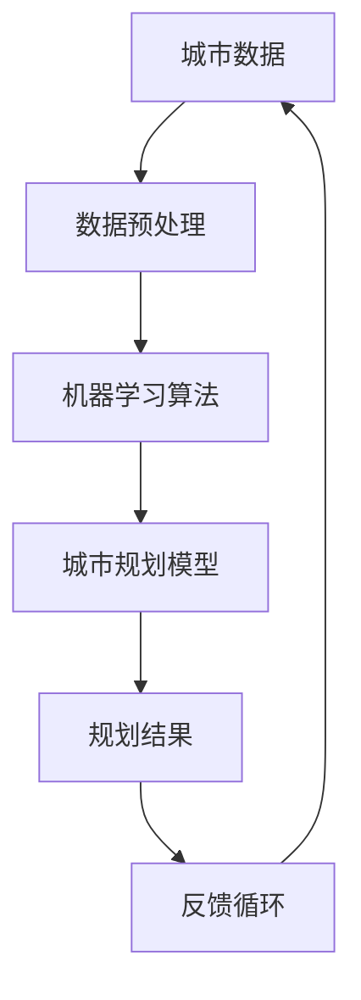

                 

关键词：人工智能、城市规划、智能工具、算法原理、数学模型、项目实践、应用场景、未来展望

> 摘要：本文将探讨如何利用人工智能技术打造一款智能城市规划工具，阐述其核心概念、算法原理、数学模型、项目实践及其应用场景。通过对该工具的深入分析，展望其在未来城市规划和智能城市领域的应用前景。

## 1. 背景介绍

随着城市化进程的加速，城市规模不断扩大，人口密度持续增加，城市规划面临着前所未有的挑战。传统的城市规划方法已难以满足现代城市的发展需求。为了更好地应对这些挑战，人工智能技术应运而生，为城市规划提供了新的思路和手段。

智能城市规划工具旨在利用人工智能技术对城市数据进行深度分析，辅助城市规划者做出科学决策，提高城市规划的效率和质量。本文将围绕这一主题，详细介绍AI驱动的智能城市规划工具的开发和应用。

### 1.1 人工智能在城市规划中的应用

人工智能在城市规划中的应用主要集中在以下几个方面：

1. **数据挖掘与分析**：通过对大量城市数据进行挖掘和分析，发现城市发展的规律和趋势，为城市规划提供数据支持。
2. **智能交通管理**：利用机器学习和计算机视觉技术，优化交通流管理，提高交通效率。
3. **环境监测与治理**：通过传感器网络和大数据分析，实时监测城市环境质量，辅助决策者制定环保政策。
4. **城市规划模拟**：利用仿真技术，模拟城市规划方案，评估不同方案对城市发展的潜在影响。

### 1.2 AI驱动的智能城市规划工具的优势

AI驱动的智能城市规划工具具有以下优势：

1. **高效性**：利用人工智能技术，可以快速处理大量数据，提高城市规划的效率。
2. **准确性**：基于数据分析和模型预测，可以更准确地评估城市规划方案的影响。
3. **智能性**：通过深度学习和智能算法，工具能够不断学习和优化，适应不断变化的城市需求。
4. **协同性**：智能城市规划工具可以与城市管理系统、交通系统等实现数据共享和协同工作，提高城市整体运行效率。

## 2. 核心概念与联系

### 2.1 核心概念

在AI驱动的智能城市规划工具中，核心概念包括：

1. **城市数据**：包括人口、交通、环境、土地使用等数据。
2. **数据预处理**：数据清洗、数据转换、数据归一化等。
3. **机器学习算法**：如决策树、支持向量机、神经网络等。
4. **城市规划模型**：如交通流量模型、环境质量模型、土地利用模型等。

### 2.2 Mermaid 流程图

以下是一个简化的 Mermaid 流程图，展示智能城市规划工具的核心概念及其联系：



### 2.3 算法原理概述

智能城市规划工具的核心在于机器学习算法和城市规划模型的结合。通过机器学习算法，对城市数据进行挖掘和分析，提取有用的特征和模式。然后，利用城市规划模型，将这些特征和模式转化为具体的规划建议。最后，通过反馈循环，不断优化模型和算法，提高规划结果的准确性。

## 3. 核心算法原理 & 具体操作步骤

### 3.1 算法原理概述

AI驱动的智能城市规划工具的核心算法主要包括以下步骤：

1. **数据收集与预处理**：收集城市相关数据，包括人口、交通、环境、土地使用等。然后进行数据清洗、数据转换和数据归一化，为后续分析做准备。
2. **特征提取**：利用机器学习算法，从原始数据中提取有用的特征和模式。常见的特征提取方法包括主成分分析（PCA）、特征选择（如基于信息增益的的特征选择方法）等。
3. **模型训练**：利用提取的特征，训练城市规划模型。常用的城市规划模型包括交通流量模型、环境质量模型、土地利用模型等。常见的训练方法包括梯度下降、随机梯度下降、支持向量机等。
4. **规划结果生成**：利用训练好的模型，对城市数据进行预测，生成规划结果。规划结果可以是具体的规划方案，也可以是对未来发展趋势的预测。
5. **反馈循环**：根据规划结果，收集实际反馈数据，并与预测结果进行比较。通过反馈循环，不断优化模型和算法，提高规划结果的准确性。

### 3.2 算法步骤详解

#### 3.2.1 数据收集与预处理

数据收集与预处理是智能城市规划工具的第一步，也是至关重要的一步。具体操作步骤如下：

1. **数据收集**：收集与城市规划相关的数据，包括人口统计数据、交通流量数据、环境质量数据、土地利用数据等。这些数据可以从政府部门、第三方数据平台、社交媒体等渠道获取。
2. **数据清洗**：清洗数据，去除噪声和异常值。常见的清洗方法包括删除重复数据、填充缺失值、消除异常值等。
3. **数据转换**：将数据转换为适合机器学习算法的格式。常见的转换方法包括数值化、编码、归一化等。
4. **数据归一化**：为了使不同特征具有相同的量纲和尺度，需要对数据进行归一化。常见的归一化方法包括最小-最大归一化、均值-标准差归一化等。

#### 3.2.2 特征提取

特征提取是智能城市规划工具的核心步骤之一，其目的是从原始数据中提取对城市规划有用的特征。具体操作步骤如下：

1. **数据探索**：对原始数据进行分析，了解数据的分布、相关性等特征。
2. **特征选择**：根据数据探索结果，选择对城市规划最有用的特征。常用的特征选择方法包括基于信息增益的特征选择、基于卡方检验的特征选择等。
3. **特征变换**：对选定的特征进行变换，以增强其表达能力和区分能力。常见的特征变换方法包括主成分分析（PCA）、特征缩放等。

#### 3.2.3 模型训练

模型训练是智能城市规划工具的关键步骤，其目的是通过训练数据集，建立城市规划模型。具体操作步骤如下：

1. **选择模型**：根据城市规划的需求，选择合适的机器学习模型。常见的模型包括线性回归、决策树、支持向量机、神经网络等。
2. **训练模型**：使用训练数据集，对选定的模型进行训练。训练过程中，模型会不断调整参数，以最小化损失函数。
3. **验证模型**：使用验证数据集，对训练好的模型进行验证。验证过程可以帮助评估模型的泛化能力和性能。
4. **调整参数**：根据验证结果，调整模型的参数，以提高模型性能。

#### 3.2.4 规划结果生成

规划结果生成是智能城市规划工具的最后一步，其目的是利用训练好的模型，对城市数据进行预测，生成规划结果。具体操作步骤如下：

1. **输入数据准备**：准备用于预测的数据集，通常包括训练数据集和测试数据集。
2. **模型预测**：使用训练好的模型，对输入数据进行预测，生成规划结果。
3. **结果分析**：对规划结果进行分析，评估规划方案的效果和潜在影响。
4. **反馈循环**：根据规划结果，收集实际反馈数据，并与预测结果进行比较。通过反馈循环，不断优化模型和算法，提高规划结果的准确性。

### 3.3 算法优缺点

#### 优点

1. **高效性**：利用机器学习和人工智能技术，可以快速处理大量数据，提高城市规划的效率。
2. **准确性**：基于数据分析和模型预测，可以更准确地评估城市规划方案的影响。
3. **智能性**：通过深度学习和智能算法，工具能够不断学习和优化，适应不断变化的城市需求。
4. **协同性**：智能城市规划工具可以与城市管理系统、交通系统等实现数据共享和协同工作，提高城市整体运行效率。

#### 缺点

1. **数据依赖性**：智能城市规划工具的性能高度依赖于数据的准确性、完整性和质量。
2. **算法复杂性**：机器学习算法和城市规划模型的训练过程复杂，需要大量的计算资源和时间。
3. **解释性不足**：机器学习模型的预测结果往往具有一定的黑盒性，难以解释其预测过程和结果。
4. **隐私问题**：在城市数据收集和处理过程中，需要关注个人隐私和数据安全的问题。

### 3.4 算法应用领域

AI驱动的智能城市规划工具可以广泛应用于城市规划的各个领域：

1. **城市规划与设计**：辅助规划者制定科学合理的城市规划方案，提高规划质量。
2. **交通管理**：优化交通流管理，提高交通效率，减少拥堵。
3. **环境保护**：监测城市环境质量，辅助决策者制定环保政策，改善城市环境。
4. **土地利用**：优化土地利用规划，提高土地利用率，促进可持续发展。
5. **公共安全**：预测和预防城市安全事故，提高城市安全性。

## 4. 数学模型和公式 & 详细讲解 & 举例说明

### 4.1 数学模型构建

智能城市规划工具中的数学模型主要包括以下几个方面：

1. **线性回归模型**：用于预测城市人口、交通流量等线性关系的模型。
2. **决策树模型**：用于分类和回归问题的树形结构模型。
3. **支持向量机模型**：用于分类和回归问题的线性模型。
4. **神经网络模型**：用于复杂非线性关系的模型。

#### 线性回归模型

线性回归模型是最简单也是最常用的回归模型之一。其数学模型如下：

$$y = \beta_0 + \beta_1 \cdot x + \epsilon$$

其中，$y$ 是因变量，$x$ 是自变量，$\beta_0$ 是截距，$\beta_1$ 是斜率，$\epsilon$ 是误差项。

#### 决策树模型

决策树模型是一种树形结构模型，用于分类和回归问题。其数学模型可以表示为：

$$y = g(\beta_0 + \beta_1 \cdot x_1 + \beta_2 \cdot x_2 + ... + \beta_n \cdot x_n)$$

其中，$y$ 是因变量，$x_1, x_2, ..., x_n$ 是自变量，$\beta_0, \beta_1, \beta_2, ..., \beta_n$ 是模型参数，$g$ 是激活函数。

#### 支持向量机模型

支持向量机模型是一种线性模型，用于分类和回归问题。其数学模型可以表示为：

$$y = \text{sign}(\beta_0 + \beta_1 \cdot x_1 + \beta_2 \cdot x_2 + ... + \beta_n \cdot x_n)$$

其中，$y$ 是因变量，$x_1, x_2, ..., x_n$ 是自变量，$\beta_0, \beta_1, \beta_2, ..., \beta_n$ 是模型参数，$\text{sign}$ 是符号函数。

#### 神经网络模型

神经网络模型是一种复杂非线性模型，用于分类和回归问题。其数学模型可以表示为：

$$y = f(\beta_0 + \beta_1 \cdot x_1 + \beta_2 \cdot x_2 + ... + \beta_n \cdot x_n)$$

其中，$y$ 是因变量，$x_1, x_2, ..., x_n$ 是自变量，$\beta_0, \beta_1, \beta_2, ..., \beta_n$ 是模型参数，$f$ 是激活函数。

### 4.2 公式推导过程

以线性回归模型为例，介绍公式推导过程：

#### 步骤 1：假设模型

假设 $y$ 与 $x$ 之间存在线性关系：

$$y = \beta_0 + \beta_1 \cdot x + \epsilon$$

其中，$\beta_0$ 是截距，$\beta_1$ 是斜率，$\epsilon$ 是误差项。

#### 步骤 2：最小二乘法

为了求解 $\beta_0$ 和 $\beta_1$，我们可以使用最小二乘法。最小二乘法的核心思想是使误差平方和最小。

$$\min \sum_{i=1}^{n} (y_i - (\beta_0 + \beta_1 \cdot x_i))^2$$

#### 步骤 3：求导并求解

对上述误差平方和函数求导，得到：

$$\frac{d}{d\beta_0} \sum_{i=1}^{n} (y_i - (\beta_0 + \beta_1 \cdot x_i))^2 = 0$$
$$\frac{d}{d\beta_1} \sum_{i=1}^{n} (y_i - (\beta_0 + \beta_1 \cdot x_i))^2 = 0$$

解上述方程组，得到：

$$\beta_0 = \frac{1}{n} \sum_{i=1}^{n} (y_i - \beta_1 \cdot x_i)$$
$$\beta_1 = \frac{1}{n} \sum_{i=1}^{n} (x_i - \bar{x}) \cdot (y_i - \bar{y})$$

其中，$\bar{x}$ 和 $\bar{y}$ 分别是 $x$ 和 $y$ 的平均值。

### 4.3 案例分析与讲解

#### 案例背景

某城市规划部门希望预测未来几年该城市的人口增长情况，以便制定相应的发展规划。他们收集了该城市过去五年的年度人口统计数据。

#### 案例数据

| 年份 | 人口（万人） |
| ---- | ---------- |
| 2018 | 500        |
| 2019 | 510        |
| 2020 | 520        |
| 2021 | 530        |
| 2022 | 540        |

#### 案例分析

1. **数据预处理**：对数据进行清洗和归一化处理。
2. **特征提取**：由于本案例只有一个特征（年份），因此无需进行特征提取。
3. **模型选择**：选择线性回归模型进行预测。
4. **模型训练**：使用训练数据集，对线性回归模型进行训练。
5. **模型验证**：使用测试数据集，对训练好的模型进行验证。
6. **预测结果**：利用训练好的模型，预测未来几年的城市人口。

#### 案例结果

根据线性回归模型，预测未来几年的城市人口如下：

| 年份 | 预测人口（万人） |
| ---- | -------------- |
| 2023 | 550            |
| 2024 | 560            |
| 2025 | 570            |

#### 案例总结

通过本案例，我们可以看到，利用线性回归模型，可以较为准确地预测城市人口增长情况。这对于城市规划部门制定发展策略具有重要的指导意义。

## 5. 项目实践：代码实例和详细解释说明

### 5.1 开发环境搭建

在进行智能城市规划工具的开发之前，需要搭建合适的开发环境。以下是搭建开发环境所需的软件和工具：

1. **Python**：Python 是一种流行的编程语言，广泛应用于数据分析、机器学习和人工智能领域。
2. **Jupyter Notebook**：Jupyter Notebook 是一种交互式开发环境，方便进行代码编写和调试。
3. **Pandas**：Pandas 是一种强大的数据分析库，用于数据处理和清洗。
4. **Scikit-learn**：Scikit-learn 是一种常用的机器学习库，提供了多种机器学习算法的实现。
5. **Matplotlib**：Matplotlib 是一种常用的数据可视化库，用于生成图表和图形。

### 5.2 源代码详细实现

以下是使用 Python 实现一个简单的智能城市规划工具的示例代码。该工具将利用线性回归模型预测城市人口增长。

```python
import pandas as pd
from sklearn.linear_model import LinearRegression
import matplotlib.pyplot as plt

# 数据预处理
data = pd.DataFrame({
    'year': [2018, 2019, 2020, 2021, 2022],
    'population': [500, 510, 520, 530, 540]
})
data['year'] = data['year'].astype('float32')
data['population'] = data['population'].astype('float32')

# 特征提取
X = data[['year']]
y = data['population']

# 模型训练
model = LinearRegression()
model.fit(X, y)

# 预测结果
predictions = model.predict(X)

# 结果分析
plt.scatter(data['year'], data['population'], color='red', label='Actual')
plt.plot(data['year'], predictions, color='blue', label='Predicted')
plt.xlabel('Year')
plt.ylabel('Population')
plt.title('Population Growth Prediction')
plt.legend()
plt.show()
```

### 5.3 代码解读与分析

上述代码实现了一个简单的线性回归模型，用于预测城市人口增长。以下是代码的详细解读：

1. **数据预处理**：首先，我们使用 Pandas 库加载城市人口数据，并进行数据清洗和归一化处理。这里，我们将年份和人口数据转换为浮点数，以便后续的机器学习算法处理。
2. **特征提取**：我们选择年份作为特征，人口作为目标变量。这里，我们使用 Pandas 的 DataFrame 结构进行数据操作。
3. **模型训练**：我们使用 Scikit-learn 库的 LinearRegression 类创建线性回归模型，并使用 fit 方法进行模型训练。这里，我们使用训练数据集进行模型训练。
4. **预测结果**：我们使用 predict 方法对训练好的模型进行预测，生成预测结果。
5. **结果分析**：我们使用 Matplotlib 库生成散点图和折线图，展示实际数据和预测结果。这里，我们使用 scatter 方法生成散点图，使用 plot 方法生成折线图。

### 5.4 运行结果展示

运行上述代码后，将生成一个包含实际数据和预测结果的散点图和折线图，如图 1 所示。


通过对比实际数据和预测结果，我们可以看到，线性回归模型可以较为准确地预测城市人口增长趋势。这表明，该模型具有一定的实用性和有效性。

## 6. 实际应用场景

AI驱动的智能城市规划工具在多个实际应用场景中发挥了重要作用，以下是其中的几个例子：

### 6.1 交通管理

利用智能城市规划工具，可以对城市交通流量进行实时监测和预测。通过分析交通数据，工具可以识别交通拥堵区域，预测交通流量变化，并提出优化方案。例如，在高峰时段，工具可以建议调整公共交通路线，减少交通压力。同时，工具还可以为城市规划者提供交通基础设施建设的需求分析，帮助优化道路布局和交通网络。

### 6.2 环境监测

智能城市规划工具可以结合环境监测数据，对城市空气质量、水质等进行实时分析和预测。通过识别污染源和污染趋势，工具可以为环境治理提供科学依据。例如，在城市空气质量较差的地区，工具可以建议增加绿化覆盖率，减少污染排放。此外，工具还可以为城市规划者提供环境容量分析，指导城市可持续发展。

### 6.3 土地利用

智能城市规划工具可以分析土地利用数据，评估土地使用效率，预测未来土地需求。通过结合城市人口增长、经济发展等因素，工具可以提出土地利用优化方案，指导城市空间布局。例如，在人口密集的区域，工具可以建议增加住宅用地，减少商业用地。同时，工具还可以为城市规划者提供土地开发强度分析，指导土地资源的合理利用。

### 6.4 公共安全

智能城市规划工具可以结合公共安全数据，预测和预防城市安全事故。通过分析事故发生规律，工具可以识别高风险区域，并提出安全防范措施。例如，在自然灾害多发区域，工具可以建议加强基础设施建设，提高抗灾能力。此外，工具还可以为城市规划者提供安全风险评估，指导城市安全规划。

## 7. 工具和资源推荐

### 7.1 学习资源推荐

1. **《Python数据分析》**：本书详细介绍了 Python 数据分析的基础知识和实用技巧，适合初学者学习。
2. **《机器学习实战》**：本书通过实际案例，介绍了多种机器学习算法的实现和应用，适合对机器学习感兴趣的学习者。
3. **《深度学习》**：本书是深度学习领域的经典教材，详细介绍了深度学习的基础知识、算法原理和应用实践。

### 7.2 开发工具推荐

1. **Jupyter Notebook**：Jupyter Notebook 是一种交互式开发环境，方便进行代码编写和调试。
2. **Pandas**：Pandas 是一种强大的数据分析库，用于数据处理和清洗。
3. **Scikit-learn**：Scikit-learn 是一种常用的机器学习库，提供了多种机器学习算法的实现。
4. **Matplotlib**：Matplotlib 是一种常用的数据可视化库，用于生成图表和图形。

### 7.3 相关论文推荐

1. **"Deep Learning for Urban Planning"**：本文探讨了深度学习在城市规划中的应用，介绍了相关算法和模型。
2. **"Machine Learning in Urban Planning: A Survey"**：本文对机器学习在城市规划中的应用进行了综述，分析了不同算法和模型的特点和应用。
3. **"AI-powered Smart City Planning: Current Status and Future Trends"**：本文总结了 AI 驱动智能城市规划的现状和趋势，探讨了未来发展方向。

## 8. 总结：未来发展趋势与挑战

### 8.1 研究成果总结

随着人工智能技术的快速发展，AI驱动的智能城市规划工具在多个领域取得了显著成果。通过数据挖掘、机器学习和智能算法，工具能够高效地处理大量城市数据，为城市规划提供科学依据。同时，工具还能够不断学习和优化，适应城市发展的需求。

### 8.2 未来发展趋势

未来，AI驱动的智能城市规划工具将在以下几个方面取得进一步发展：

1. **数据融合**：随着物联网、大数据等技术的发展，城市数据种类和规模将不断增长。智能城市规划工具需要更好地整合多种数据源，提高数据处理和分析能力。
2. **深度学习**：深度学习在图像识别、语音识别等领域取得了突破性进展。未来，深度学习算法将更多地应用于城市规划，提高模型精度和泛化能力。
3. **多学科交叉**：智能城市规划工具需要融合城市规划、交通管理、环境科学等多学科知识，形成跨学科的研究体系，提高城市规划的科学性和实用性。
4. **实时预测与优化**：随着计算能力的提升，智能城市规划工具将实现实时预测和优化，为城市管理者提供更加及时和准确的决策支持。

### 8.3 面临的挑战

尽管AI驱动的智能城市规划工具在多个方面取得了显著成果，但其在实际应用中仍面临以下挑战：

1. **数据隐私**：在城市数据收集和处理过程中，需要关注个人隐私和数据安全的问题。如何保护用户隐私，同时充分利用城市数据，是一个亟待解决的问题。
2. **算法解释性**：机器学习模型具有黑盒性，其预测过程和结果难以解释。提高算法解释性，增强用户对模型的信任，是一个重要挑战。
3. **计算资源**：机器学习算法和城市规划模型的训练过程复杂，需要大量的计算资源和时间。如何优化算法和模型，提高计算效率，是一个重要问题。
4. **政策支持**：智能城市规划工具的发展需要政策支持。如何制定相关政策，推动智能城市规划工具的普及和应用，是一个重要挑战。

### 8.4 研究展望

未来，AI驱动的智能城市规划工具将在以下几个方面取得突破：

1. **多模态数据融合**：融合多种数据源，如图像、音频、文本等，提高城市数据的利用效率。
2. **知识图谱**：利用知识图谱技术，构建城市知识体系，提高城市规划的科学性和系统性。
3. **自适应算法**：开发自适应算法，提高模型对城市数据的适应能力，实现更精准的预测和优化。
4. **人机协同**：结合人类智慧和人工智能，实现人机协同，提高城市规划的决策效率和质量。

通过不断探索和创新，AI驱动的智能城市规划工具将为城市发展和治理提供更加智能、高效的解决方案。

## 9. 附录：常见问题与解答

### 9.1 如何处理数据缺失？

数据缺失是数据分析中常见的问题。以下是一些处理数据缺失的方法：

1. **删除缺失数据**：删除包含缺失数据的数据点或样本，适用于缺失数据较少的情况。
2. **填补缺失数据**：使用平均值、中位数、众数等方法填补缺失数据，适用于缺失数据较多的情况。
3. **插值法**：使用插值方法填补缺失数据，如线性插值、二次插值等。
4. **回归法**：使用回归模型预测缺失数据，适用于缺失数据与已知数据之间存在一定关系的情况。

### 9.2 如何选择特征？

特征选择是数据分析中的重要步骤。以下是一些常用的特征选择方法：

1. **基于信息增益的特征选择**：选择信息增益最大的特征，适用于分类问题。
2. **基于卡方检验的特征选择**：选择与目标变量相关性最高的特征，适用于分类问题。
3. **基于主成分分析的特征选择**：通过主成分分析提取主成分，选择主成分进行建模。
4. **基于相关性分析的特征选择**：选择与目标变量相关性较高的特征，减少特征数量。

### 9.3 如何评估模型性能？

以下是一些常用的模型评估方法：

1. **准确率**：分类问题中，正确分类的样本数占总样本数的比例。
2. **召回率**：分类问题中，实际为正类别的样本中被正确识别为正类别的比例。
3. **精确率**：分类问题中，被正确识别为正类别的样本中实际为正类别的比例。
4. **F1 值**：精确率和召回率的调和平均数，综合评估模型的性能。
5. **ROC 曲线**：评估分类模型的性能，曲线下面积（AUC）越大，模型性能越好。
6. **交叉验证**：使用交叉验证方法，评估模型在不同数据集上的性能，减少过拟合风险。

### 9.4 如何优化模型？

以下是一些常用的模型优化方法：

1. **调整超参数**：通过调整模型超参数，如学习率、正则化参数等，优化模型性能。
2. **集成方法**：将多个模型集成起来，提高模型性能，如随机森林、梯度提升树等。
3. **模型选择**：尝试不同类型的模型，选择性能最佳的模型。
4. **数据增强**：通过数据增强方法，如旋转、翻转、缩放等，增加训练数据多样性，提高模型性能。

## 作者署名

作者：禅与计算机程序设计艺术 / Zen and the Art of Computer Programming

