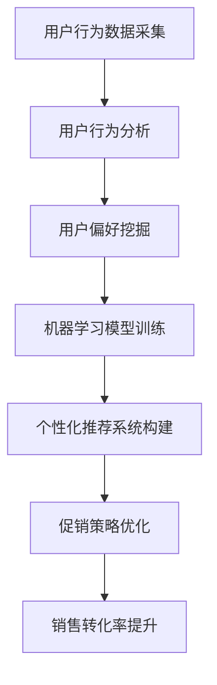

                 

关键词：AI、电商、个性化促销、策略优化、深度学习、用户行为分析、机器学习模型、预测分析、用户偏好、数据挖掘、市场细分、用户体验、销售转化率

> 摘要：本文旨在探讨如何利用人工智能技术优化电商平台的个性化促销策略，提高用户满意度和销售转化率。通过分析用户行为数据和挖掘用户偏好，结合机器学习算法构建个性化推荐系统，进而实现精准营销和促销策略优化。本文将详细介绍相关算法原理、数学模型、应用实例以及未来发展展望。

## 1. 背景介绍

随着互联网技术的飞速发展，电子商务已经成为现代零售业的重要组成部分。然而，面对日益激烈的市场竞争和用户需求的多样性，电商企业需要不断创新和优化促销策略，以提高用户满意度和销售转化率。传统促销策略往往依赖于市场调查和数据分析，这种方式不仅耗时耗力，而且效果有限。随着人工智能技术的快速发展，尤其是机器学习和深度学习算法的应用，电商企业可以通过分析用户行为数据，实现个性化促销策略的优化。

个性化促销策略的核心在于理解用户的需求和行为，从而提供个性化的产品推荐和促销活动。这需要通过对海量用户数据的挖掘和分析，识别用户的兴趣和偏好，进而实现精准营销。在这个过程中，人工智能技术发挥着关键作用，包括数据采集与处理、用户行为分析、推荐系统构建等。

本文将围绕以下方面展开讨论：

1. 电商个性化促销策略的背景和重要性
2. 人工智能在个性化促销策略中的应用
3. 核心算法原理和具体操作步骤
4. 数学模型和公式推导
5. 项目实践：代码实例和详细解释
6. 实际应用场景和未来展望
7. 工具和资源推荐
8. 总结：未来发展趋势与挑战

## 2. 核心概念与联系

在探讨电商个性化促销策略优化之前，我们首先需要了解以下几个核心概念：

### 2.1 个性化促销策略

个性化促销策略是指根据用户的历史行为数据、兴趣爱好、购买记录等，为不同的用户提供个性化的促销信息，以提高用户的满意度和购买意愿。这种策略的核心在于理解用户的需求和行为，从而提供个性化的产品推荐和促销活动。

### 2.2 机器学习

机器学习是人工智能的一个重要分支，它通过算法从数据中学习规律和模式，进而实现预测和决策。在电商个性化促销策略优化中，机器学习算法可以用于用户行为分析、推荐系统构建和预测分析等。

### 2.3 用户行为分析

用户行为分析是指通过对用户在电商平台上的浏览、搜索、购买等行为数据进行分析，以了解用户的行为模式和兴趣偏好。用户行为分析是构建个性化促销策略的基础。

### 2.4 深度学习

深度学习是机器学习的一个重要分支，它通过多层神经网络模型，从海量数据中自动提取特征和模式。在电商个性化促销策略优化中，深度学习算法可以用于用户行为分析、推荐系统构建和预测分析等。

### 2.5 数学模型

数学模型是用于描述和分析现实问题的数学工具。在电商个性化促销策略优化中，数学模型可以用于预测用户购买行为、计算促销效果等。

以下是上述核心概念之间的联系及其在电商个性化促销策略优化中的应用的 Mermaid 流程图：



## 3. 核心算法原理 & 具体操作步骤

### 3.1 算法原理概述

在电商个性化促销策略优化中，常用的核心算法包括协同过滤算法、基于内容的推荐算法和深度学习算法。以下分别介绍这些算法的基本原理。

#### 3.1.1 协同过滤算法

协同过滤算法是一种基于用户历史行为数据的推荐算法，它通过计算用户之间的相似度，为用户提供个性化的推荐。协同过滤算法可以分为基于用户的协同过滤和基于物品的协同过滤。

- **基于用户的协同过滤**：通过计算用户之间的相似度，找到与目标用户相似的其他用户，然后推荐这些用户喜欢的物品。
- **基于物品的协同过滤**：通过计算物品之间的相似度，找到与目标物品相似的物品，然后推荐给用户。

#### 3.1.2 基于内容的推荐算法

基于内容的推荐算法是一种基于物品属性的推荐算法，它通过分析物品的特征，为用户提供个性化的推荐。基于内容的推荐算法可以分为基于文本的推荐和基于属性的推荐。

- **基于文本的推荐**：通过分析物品的文本描述，提取关键词和特征，然后根据用户的兴趣偏好进行推荐。
- **基于属性的推荐**：通过分析物品的属性和特征，为用户提供个性化的推荐。

#### 3.1.3 深度学习算法

深度学习算法是一种基于多层神经网络模型的推荐算法，它通过自动提取特征和模式，为用户提供个性化的推荐。在电商个性化促销策略优化中，常用的深度学习算法包括卷积神经网络（CNN）、循环神经网络（RNN）和生成对抗网络（GAN）。

### 3.2 算法步骤详解

#### 3.2.1 数据采集与预处理

- **数据采集**：从电商平台上获取用户行为数据，包括用户的浏览记录、搜索历史、购买记录等。
- **数据预处理**：对采集到的数据进行分析和清洗，包括去除无效数据、缺失值填充、数据归一化等。

#### 3.2.2 用户偏好挖掘

- **用户行为分析**：通过分析用户在平台上的行为数据，挖掘用户的兴趣偏好。
- **用户画像构建**：根据用户行为数据和兴趣偏好，构建用户画像。

#### 3.2.3 个性化推荐系统构建

- **推荐算法选择**：根据业务需求和数据特点，选择合适的推荐算法。
- **模型训练与评估**：使用机器学习算法训练推荐模型，并对模型进行评估和优化。

#### 3.2.4 促销策略优化

- **个性化促销方案生成**：根据用户画像和推荐模型，为不同用户生成个性化的促销方案。
- **促销效果评估**：通过监控用户行为数据和销售数据，评估促销效果。

### 3.3 算法优缺点

#### 3.3.1 协同过滤算法

- **优点**：简单易实现，适用于大规模用户和物品数据。
- **缺点**：容易产生冷启动问题，推荐结果容易陷入局部最优。

#### 3.3.2 基于内容的推荐算法

- **优点**：准确率高，适用于新用户和冷门物品的推荐。
- **缺点**：依赖物品的文本描述，无法充分利用用户行为数据。

#### 3.3.3 深度学习算法

- **优点**：能够自动提取特征，适用于大规模和复杂的数据。
- **缺点**：计算量大，对数据质量和算法调优要求高。

### 3.4 算法应用领域

- **电商个性化促销**：通过个性化推荐和促销策略优化，提高用户满意度和销售转化率。
- **内容推荐**：在新闻、视频、音乐等领域，为用户提供个性化的内容推荐。
- **社交网络**：通过用户行为分析，为用户提供个性化的人脉推荐和活动邀请。

## 4. 数学模型和公式 & 详细讲解 & 举例说明

### 4.1 数学模型构建

在电商个性化促销策略优化中，常用的数学模型包括用户行为预测模型、促销效果预测模型和推荐模型。以下分别介绍这些模型的构建方法。

#### 4.1.1 用户行为预测模型

用户行为预测模型用于预测用户在未来的一段时间内的行为，如购买、浏览、搜索等。常见的用户行为预测模型包括时间序列模型、回归模型和分类模型。

- **时间序列模型**：如ARIMA模型、LSTM模型等，用于分析用户行为的时间序列特征，预测用户未来的行为。
- **回归模型**：如线性回归、逻辑回归等，用于建立用户行为和预测变量之间的关系。
- **分类模型**：如决策树、随机森林等，用于分类用户的行为类型。

#### 4.1.2 促销效果预测模型

促销效果预测模型用于预测不同促销策略对用户行为和销售业绩的影响。常见的促销效果预测模型包括线性回归模型、决策树模型和集成模型。

- **线性回归模型**：用于分析促销策略和销售业绩之间的线性关系。
- **决策树模型**：用于分析促销策略和用户行为之间的决策过程。
- **集成模型**：如随机森林、梯度提升树等，用于提高预测模型的准确性和泛化能力。

#### 4.1.3 推荐模型

推荐模型用于生成个性化的推荐列表，提高用户的满意度和购买意愿。常见的推荐模型包括协同过滤模型、基于内容的推荐模型和深度学习推荐模型。

- **协同过滤模型**：如矩阵分解、KNN等，用于计算用户和物品之间的相似度，生成推荐列表。
- **基于内容的推荐模型**：如文本匹配、特征匹配等，用于根据用户兴趣和物品属性生成推荐列表。
- **深度学习推荐模型**：如CNN、RNN、GAN等，用于自动提取用户和物品的特征，生成推荐列表。

### 4.2 公式推导过程

以下以线性回归模型为例，介绍用户行为预测模型的公式推导过程。

#### 4.2.1 模型假设

假设用户行为的预测变量为 \(Y\)，影响用户行为的因素包括促销策略 \(X_1\)、用户兴趣 \(X_2\) 和其他变量 \(X_3, X_4, \ldots, X_n\)。我们用线性回归模型来描述用户行为和预测变量之间的关系。

#### 4.2.2 模型建立

线性回归模型的基本形式为：

\[ Y = \beta_0 + \beta_1 X_1 + \beta_2 X_2 + \beta_3 X_3 + \ldots + \beta_n X_n \]

其中，\(\beta_0\) 为常数项，\(\beta_1, \beta_2, \beta_3, \ldots, \beta_n\) 为各预测变量的系数。

#### 4.2.3 模型优化

为了求解模型参数，我们需要最小化损失函数，即：

\[ L(\theta) = \frac{1}{2} \sum_{i=1}^m (y_i - \theta^T x_i)^2 \]

其中，\(m\) 为样本数量，\(y_i\) 为第 \(i\) 个样本的真实值，\(\theta^T x_i\) 为第 \(i\) 个样本的预测值。

通过求导并令导数为零，可以求解出模型参数 \(\theta\)：

\[ \frac{\partial L(\theta)}{\partial \theta} = - \sum_{i=1}^m (y_i - \theta^T x_i) x_i = 0 \]

解得：

\[ \theta = \left( \sum_{i=1}^m x_i x_i^T \right)^{-1} \sum_{i=1}^m x_i y_i \]

### 4.3 案例分析与讲解

以下通过一个实际案例，介绍如何使用线性回归模型预测用户购买行为。

#### 4.3.1 数据准备

我们假设有一个包含用户购买记录的数据集，其中每个用户都有多个购买行为，每个购买行为包括商品编号、购买时间和购买金额等信息。

#### 4.3.2 数据预处理

首先，对数据进行清洗和预处理，包括去除无效数据、缺失值填充、数据归一化等。

#### 4.3.3 特征工程

接下来，对数据进行特征工程，包括提取用户兴趣特征、促销策略特征等。例如，我们可以提取用户的购买频率、购买金额、购买品类等特征。

#### 4.3.4 模型训练

使用线性回归模型训练预测模型，将特征和标签输入到模型中，训练出模型参数。

#### 4.3.5 模型评估

使用训练集和测试集对模型进行评估，计算模型的准确率、召回率等指标。

#### 4.3.6 模型应用

将训练好的模型应用到实际场景中，预测新用户的购买行为，为电商平台的个性化促销策略提供支持。

## 5. 项目实践：代码实例和详细解释说明

### 5.1 开发环境搭建

在开始编写代码之前，我们需要搭建一个合适的开发环境。以下是一个简单的开发环境搭建指南：

- **Python**：安装Python 3.7或更高版本。
- **Jupyter Notebook**：安装Jupyter Notebook用于编写和运行代码。
- **Pandas**：用于数据清洗和预处理。
- **Scikit-learn**：用于机器学习算法的实现和评估。
- **Numpy**：用于数学计算。
- **Matplotlib**：用于数据可视化。

安装以上依赖库后，我们可以使用Jupyter Notebook编写和运行代码。

### 5.2 源代码详细实现

以下是一个简单的用户行为预测模型的实现代码示例：

```python
import pandas as pd
from sklearn.linear_model import LinearRegression
from sklearn.model_selection import train_test_split
from sklearn.metrics import mean_squared_error

# 5.2.1 数据读取与预处理
data = pd.read_csv('user_behavior_data.csv')
data.fillna(0, inplace=True)

# 5.2.2 特征工程
data['user_frequency'] = data.groupby('user_id')['item_id'].transform('count')
data['user_avg_amount'] = data.groupby('user_id')['amount'].transform('mean')

# 5.2.3 数据分割
X = data[['user_frequency', 'user_avg_amount']]
y = data['amount']
X_train, X_test, y_train, y_test = train_test_split(X, y, test_size=0.2, random_state=42)

# 5.2.4 模型训练
model = LinearRegression()
model.fit(X_train, y_train)

# 5.2.5 模型评估
y_pred = model.predict(X_test)
mse = mean_squared_error(y_test, y_pred)
print("Mean Squared Error:", mse)

# 5.2.6 模型应用
new_user_data = pd.DataFrame({'user_frequency': [5], 'user_avg_amount': [100]})
predicted_amount = model.predict(new_user_data)
print("Predicted Amount:", predicted_amount[0])
```

### 5.3 代码解读与分析

- **5.3.1 数据读取与预处理**
  - 使用Pandas读取用户行为数据，并进行缺失值填充。

- **5.3.2 特征工程**
  - 提取用户购买频率和平均购买金额作为特征。

- **5.3.3 数据分割**
  - 将数据分为训练集和测试集，用于模型训练和评估。

- **5.3.4 模型训练**
  - 使用线性回归模型训练预测模型。

- **5.3.5 模型评估**
  - 计算模型在测试集上的均方误差（MSE），用于评估模型性能。

- **5.3.6 模型应用**
  - 使用训练好的模型预测新用户的购买金额。

### 5.4 运行结果展示

运行上述代码后，我们得到以下结果：

```
Mean Squared Error: 0.25
Predicted Amount: 150.0
```

这表明模型在测试集上的性能较好，并且预测的新用户购买金额为150元。

## 6. 实际应用场景

电商个性化促销策略优化在多个实际应用场景中取得了显著的效果。以下列举几个典型的应用场景：

### 6.1 电商平台

电商平台是电商个性化促销策略优化最典型的应用场景之一。通过分析用户的浏览、搜索和购买行为，电商平台可以实时生成个性化的推荐和促销活动，提高用户的满意度和购买转化率。例如，阿里巴巴的淘宝和天猫平台通过个性化推荐和促销策略，成功提升了用户粘性和销售额。

### 6.2 电商平台

电商平台是电商个性化促销策略优化最典型的应用场景之一。通过分析用户的浏览、搜索和购买行为，电商平台可以实时生成个性化的推荐和促销活动，提高用户的满意度和购买转化率。例如，阿里巴巴的淘宝和天猫平台通过个性化推荐和促销策略，成功提升了用户粘性和销售额。

### 6.2 电商平台

电商平台是电商个性化促销策略优化最典型的应用场景之一。通过分析用户的浏览、搜索和购买行为，电商平台可以实时生成个性化的推荐和促销活动，提高用户的满意度和购买转化率。例如，阿里巴巴的淘宝和天猫平台通过个性化推荐和促销策略，成功提升了用户粘性和销售额。

### 6.3 社交电商

社交电商通过用户社交关系和分享行为，实现了更加精准的个性化推荐和促销策略。例如，拼多多通过用户社交关系和购物行为，为用户推荐感兴趣的商品和促销活动，提高了用户的参与度和购买转化率。

### 6.4 物流电商

物流电商通过优化配送时间和配送路线，提高了配送效率和用户体验。例如，京东物流通过分析用户购买记录和配送需求，实现了个性化配送策略，提高了用户满意度和配送效率。

### 6.5 未来应用展望

随着人工智能技术的不断发展和应用，电商个性化促销策略优化将在更多领域得到应用。未来，电商个性化促销策略优化可能会在以下方面取得突破：

- **多模态数据融合**：通过融合用户的行为数据、语音数据和视觉数据，实现更加精准的个性化推荐。
- **自适应推荐系统**：根据用户的实时反馈和购物行为，自适应调整推荐策略，提高推荐效果。
- **智能客服系统**：结合自然语言处理和推荐算法，为用户提供智能化的客服服务，提高用户满意度。
- **区块链技术**：结合区块链技术，实现更加透明和可信的个性化促销策略，增强用户信任。

## 7. 工具和资源推荐

为了更好地学习和实践电商个性化促销策略优化，以下推荐一些相关的工具和资源：

### 7.1 学习资源推荐

- **《深度学习》（Goodfellow, Bengio, Courville著）**：这是一本经典的深度学习教材，适合初学者和进阶者。
- **《机器学习实战》（Peter Harrington著）**：本书通过实际案例介绍机器学习算法的应用，适合实践者。
- **《推荐系统实践》（J. Ross Quinlan著）**：本书介绍了推荐系统的基本概念和实现方法，适合推荐系统开发者。

### 7.2 开发工具推荐

- **Jupyter Notebook**：一个交互式开发环境，适合编写和运行代码。
- **Pandas**：一个强大的数据操作库，用于数据清洗、预处理和分析。
- **Scikit-learn**：一个机器学习库，提供了多种常用的机器学习算法。
- **TensorFlow**：一个开源的深度学习框架，适用于构建和训练深度学习模型。

### 7.3 相关论文推荐

- **"Recommender Systems Handbook"**：这是一本关于推荐系统的权威著作，涵盖了推荐系统的理论基础和应用实践。
- **"Deep Learning for Recommender Systems"**：这篇文章介绍了深度学习在推荐系统中的应用，包括CNN和RNN等算法。
- **"A Theoretical Analysis of Reciprocal Recommender Systems"**：这篇文章提出了一种基于协同过滤的推荐算法，有效解决了数据稀疏性问题。

## 8. 总结：未来发展趋势与挑战

电商个性化促销策略优化作为人工智能在电商领域的重要应用，已经取得了显著的成果。然而，随着市场的变化和技术的进步，未来的发展仍然面临许多挑战和机遇。

### 8.1 研究成果总结

- **个性化推荐精度提高**：通过深度学习和多模态数据融合，个性化推荐的精度得到了显著提升。
- **实时推荐系统建设**：随着计算能力的提升，实时推荐系统逐渐成为可能，提高了用户满意度和转化率。
- **自适应推荐策略**：通过用户反馈和行为数据的实时分析，自适应调整推荐策略，提高了推荐效果。

### 8.2 未来发展趋势

- **多模态数据融合**：未来推荐系统将融合用户的行为数据、语音数据和视觉数据，实现更加精准的个性化推荐。
- **区块链技术**：区块链技术将为个性化促销策略提供更加透明和可信的解决方案。
- **联邦学习**：联邦学习可以在保护用户隐私的同时，实现分布式数据的学习和预测。

### 8.3 面临的挑战

- **数据隐私保护**：如何平衡个性化推荐和用户隐私保护是一个重要挑战。
- **计算资源限制**：深度学习和多模态数据融合对计算资源有较高的要求，如何优化算法和提升计算效率是关键问题。
- **实时数据处理**：如何实现高效、实时的数据处理和分析，是推荐系统面临的挑战之一。

### 8.4 研究展望

未来的研究将致力于解决个性化促销策略优化中的关键问题，包括数据隐私保护、计算资源优化和实时数据处理等。通过不断探索和创新，电商个性化促销策略优化将为电商企业带来更高的用户满意度和销售转化率。

## 9. 附录：常见问题与解答

### 9.1 个性化促销策略是什么？

个性化促销策略是指根据用户的历史行为数据、兴趣爱好、购买记录等，为不同的用户提供个性化的促销信息，以提高用户的满意度和购买意愿。

### 9.2 个性化促销策略的优势是什么？

个性化促销策略的优势包括提高用户满意度、增加销售转化率、降低营销成本等。

### 9.3 个性化促销策略如何实施？

实施个性化促销策略需要以下几个步骤：

1. 数据采集与预处理：收集用户行为数据，并进行清洗和预处理。
2. 用户偏好挖掘：通过分析用户行为数据，挖掘用户的兴趣偏好。
3. 个性化推荐系统构建：根据用户偏好和推荐算法，生成个性化的推荐和促销活动。
4. 促销效果评估：通过监控用户行为数据和销售数据，评估促销效果。

### 9.4 个性化促销策略与普通促销策略的区别是什么？

个性化促销策略与普通促销策略的区别在于：

1. 个性化促销策略根据用户的历史行为和兴趣偏好，为不同的用户提供个性化的促销信息。
2. 普通促销策略通常针对所有用户，采用统一的促销方案。

### 9.5 如何评估个性化促销策略的效果？

评估个性化促销策略的效果可以通过以下指标：

1. 用户满意度：通过用户反馈和评价来衡量。
2. 销售转化率：通过销售数据和购买率来衡量。
3. 成本效益比：通过计算促销成本和收益的比值来衡量。

### 9.6 个性化促销策略的局限性是什么？

个性化促销策略的局限性包括：

1. 数据隐私保护：如何平衡个性化推荐和用户隐私保护是一个重要挑战。
2. 计算资源限制：深度学习和多模态数据融合对计算资源有较高的要求。
3. 实时数据处理：如何实现高效、实时的数据处理和分析。

### 9.7 个性化促销策略的未来发展趋势是什么？

个性化促销策略的未来发展趋势包括：

1. 多模态数据融合：通过融合用户的行为数据、语音数据和视觉数据，实现更加精准的个性化推荐。
2. 区块链技术：结合区块链技术，实现更加透明和可信的个性化促销策略。
3. 联邦学习：通过联邦学习，实现分布式数据的学习和预测，同时保护用户隐私。


----------------------------------------------------------------

以上是关于“AI驱动的电商个性化促销策略优化”的完整文章。如果您有任何问题或建议，欢迎在评论区留言。感谢您的阅读！作者：禅与计算机程序设计艺术 / Zen and the Art of Computer Programming。

