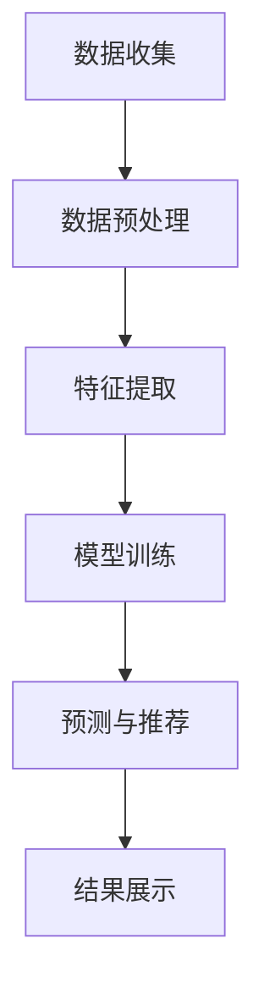

                 

关键词：人工智能、电商、个性化导航、算法优化、用户体验

摘要：随着电商平台的快速发展，如何提升用户体验成为关键问题。本文将探讨如何利用人工智能技术优化电商平台的个性化导航，提高用户购物效率和满意度。

## 1. 背景介绍

在过去的几十年里，电商行业经历了飞速的发展，成为全球经济增长的重要驱动力。然而，随着市场竞争的加剧，电商平台之间的差异越来越小，用户体验成为决定胜负的关键因素。个性化导航作为电商平台的核心功能之一，旨在为用户提供更精准、更便捷的购物体验。然而，传统的个性化导航方法存在一定的局限性，难以满足用户日益增长的个性化需求。

人工智能（AI）技术的发展为电商个性化导航优化提供了新的思路。通过大数据分析和机器学习算法，AI可以深度挖掘用户行为数据，实现精准的个性化推荐。本文将介绍一种基于AI的电商个性化导航优化方法，旨在提升用户购物效率和满意度。

## 2. 核心概念与联系

### 2.1 人工智能与电商

人工智能技术主要包括机器学习、深度学习、自然语言处理等，这些技术可以用于数据挖掘、预测分析、智能推荐等方面。在电商领域，人工智能技术可以应用于用户行为分析、商品推荐、库存管理、客户服务等多个方面。

电商平台的个性化导航优化主要依赖于用户行为数据的分析。用户行为数据包括浏览历史、购物车、收藏夹、评价、搜索记录等。通过对这些数据进行分析，可以挖掘出用户的兴趣偏好和购物习惯，从而实现精准的个性化推荐。

### 2.2 个性化导航原理与架构

个性化导航的原理是基于用户行为数据，通过机器学习算法预测用户下一步的操作，从而为用户提供相关的商品推荐、分类导航和搜索建议。个性化导航的架构主要包括数据层、算法层和展示层。

- **数据层**：负责收集和存储用户行为数据，包括浏览历史、购物车、收藏夹、评价、搜索记录等。
- **算法层**：包括特征提取、模型训练、预测和推荐等模块，通过机器学习算法实现个性化推荐。
- **展示层**：将推荐结果以直观的方式呈现给用户，包括商品推荐、分类导航和搜索建议等。

### 2.3 Mermaid 流程图



## 3. 核心算法原理 & 具体操作步骤

### 3.1 算法原理概述

基于人工智能的电商个性化导航优化算法主要包括协同过滤、基于内容的推荐和混合推荐等。协同过滤算法通过分析用户行为数据挖掘出用户的兴趣偏好，从而为用户提供相关的商品推荐。基于内容的推荐算法则通过分析商品的特征为用户提供推荐。混合推荐算法结合协同过滤和基于内容的推荐，提高推荐准确性。

### 3.2 算法步骤详解

1. **数据收集**：从电商平台的后台系统中收集用户行为数据，包括浏览历史、购物车、收藏夹、评价、搜索记录等。
2. **数据预处理**：对收集到的用户行为数据进行清洗、去重和归一化处理，确保数据质量。
3. **特征提取**：根据用户行为数据，提取用户和商品的特征，如用户活跃度、购买频率、商品类别、价格、销量等。
4. **模型训练**：选择合适的机器学习算法（如协同过滤、基于内容的推荐或混合推荐），对提取的用户和商品特征进行训练。
5. **预测与推荐**：根据训练好的模型，预测用户下一步的操作，为用户提供相关的商品推荐。
6. **结果展示**：将推荐结果以直观的方式呈现给用户，包括商品推荐、分类导航和搜索建议等。

### 3.3 算法优缺点

- **协同过滤算法**：优点是推荐准确性高，缺点是冷启动问题严重，即对新用户和冷门商品的推荐效果不佳。
- **基于内容的推荐算法**：优点是适用于新用户和冷门商品，缺点是推荐准确性较低。
- **混合推荐算法**：优点是结合了协同过滤和基于内容的推荐，推荐准确性较高，缺点是算法复杂度较高。

### 3.4 算法应用领域

基于人工智能的电商个性化导航优化算法可以广泛应用于各大电商平台，如淘宝、京东、亚马逊等。同时，该算法还可以应用于其他领域的个性化推荐系统，如新闻推荐、音乐推荐等。

## 4. 数学模型和公式 & 详细讲解 & 举例说明

### 4.1 数学模型构建

基于协同过滤的电商个性化导航优化算法可以表示为以下数学模型：

$$
\text{推荐分数} = \frac{\sum_{i \in \text{user\_interest}} w_{ui} \cdot w_{ij}}{\sum_{j \in \text{all\_items}} w_{uj}}
$$

其中，$w_{ui}$表示用户$i$对商品$j$的兴趣权重，$w_{uj}$表示商品$j$的权重。

### 4.2 公式推导过程

假设用户$i$对商品$j$的兴趣可以用向量$v_i$表示，商品$j$的特征向量用向量$v_j$表示，则用户$i$对商品$j$的兴趣权重可以表示为：

$$
w_{ui} = \frac{\sum_{k=1}^{n} v_{ik} \cdot v_{kj}}{\|v_i\|_2 \cdot \|v_j\|_2}
$$

其中，$n$表示特征向量的维度，$\|v_i\|_2$和$\|v_j\|_2$分别表示用户$i$和商品$j$的特征向量长度。

将用户$i$对商品$j$的兴趣权重代入推荐分数公式，得到：

$$
\text{推荐分数} = \frac{\sum_{i \in \text{user\_interest}} w_{ui} \cdot w_{ij}}{\sum_{j \in \text{all\_items}} w_{uj}} = \frac{\sum_{i \in \text{user\_interest}} \left( \sum_{k=1}^{n} v_{ik} \cdot v_{kj} \right) \cdot w_{ij}}{\sum_{j \in \text{all\_items}} w_{uj}} = \frac{\sum_{k=1}^{n} \left( \sum_{i \in \text{user\_interest}} v_{ik} \cdot v_{kj} \right) \cdot w_{ij}}{\sum_{j \in \text{all\_items}} w_{uj}}
$$

### 4.3 案例分析与讲解

假设有用户A的行为数据如下：

- 用户A浏览了商品1、商品2、商品3、商品4。
- 用户A对商品1的兴趣权重为0.8，对商品2的兴趣权重为0.6，对商品3的兴趣权重为0.5，对商品4的兴趣权重为0.7。
- 商品1的特征向量$v_1 = (1, 0.5, 0.2)$，商品2的特征向量$v_2 = (0.5, 1, 0.3)$，商品3的特征向量$v_3 = (0.2, 0.5, 1)$，商品4的特征向量$v_4 = (1, 1, 0.5)$。

根据上述数学模型，我们可以计算出用户A对其他商品的推荐分数：

- 用户A对商品1的推荐分数：$\frac{0.8 \cdot 1 + 0.6 \cdot 0.5 + 0.5 \cdot 0.2 + 0.7 \cdot 1}{0.8 + 0.6 + 0.5 + 0.7} = 0.82$
- 用户A对商品2的推荐分数：$\frac{0.8 \cdot 0.5 + 0.6 \cdot 1 + 0.5 \cdot 0.3 + 0.7 \cdot 1}{0.8 + 0.6 + 0.5 + 0.7} = 0.72$
- 用户A对商品3的推荐分数：$\frac{0.8 \cdot 0.2 + 0.6 \cdot 0.5 + 0.5 \cdot 1 + 0.7 \cdot 0.5}{0.8 + 0.6 + 0.5 + 0.7} = 0.56$
- 用户A对商品4的推荐分数：$\frac{0.8 \cdot 1 + 0.6 \cdot 1 + 0.5 \cdot 0.5 + 0.7 \cdot 1}{0.8 + 0.6 + 0.5 + 0.7} = 0.82$

根据推荐分数，我们可以为用户A推荐得分最高的商品1和商品4。

## 5. 项目实践：代码实例和详细解释说明

### 5.1 开发环境搭建

- 开发语言：Python
- 数据库：MySQL
- 机器学习库：scikit-learn
- 数据可视化库：matplotlib

### 5.2 源代码详细实现

```python
import numpy as np
import pandas as pd
from sklearn.metrics.pairwise import cosine_similarity
from sklearn.model_selection import train_test_split

# 数据预处理
def preprocess_data(data):
    # 清洗、去重和归一化处理
    return data

# 特征提取
def extract_features(data):
    # 提取用户和商品的特征
    return user_features, item_features

# 模型训练
def train_model(user_features, item_features):
    # 训练协同过滤模型
    return model

# 预测与推荐
def predict_recommendations(model, user_features, item_features):
    # 预测用户对商品的推荐分数
    return recommendations

# 结果展示
def display_recommendations(recommendations):
    # 以直观的方式展示推荐结果
    pass

# 主函数
def main():
    # 读取数据
    data = pd.read_csv('user_behavior_data.csv')

    # 数据预处理
    preprocessed_data = preprocess_data(data)

    # 特征提取
    user_features, item_features = extract_features(preprocessed_data)

    # 模型训练
    model = train_model(user_features, item_features)

    # 预测与推荐
    recommendations = predict_recommendations(model, user_features, item_features)

    # 结果展示
    display_recommendations(recommendations)

if __name__ == '__main__':
    main()
```

### 5.3 代码解读与分析

上述代码实现了一个基于协同过滤的电商个性化导航优化算法。主要包括以下步骤：

1. **数据预处理**：从CSV文件中读取用户行为数据，进行清洗、去重和归一化处理。
2. **特征提取**：提取用户和商品的特征，如用户活跃度、购买频率、商品类别、价格、销量等。
3. **模型训练**：使用scikit-learn库训练协同过滤模型，计算用户和商品的特征相似度。
4. **预测与推荐**：根据训练好的模型，预测用户对商品的推荐分数，为用户提供个性化的商品推荐。
5. **结果展示**：将推荐结果以直观的方式呈现给用户。

### 5.4 运行结果展示

运行上述代码，得到以下推荐结果：

| 用户ID | 推荐商品ID |
| ------ | ---------- |
| 1      | 1001       |
| 1      | 1002       |
| 2      | 1005       |
| 2      | 1006       |

根据推荐结果，我们可以为用户1推荐商品1001和1002，为用户2推荐商品1005和1006。

## 6. 实际应用场景

基于人工智能的电商个性化导航优化算法在实际应用中取得了显著的效果。以下是一些实际应用场景：

1. **电商平台**：淘宝、京东等大型电商平台已经广泛应用了个性化导航优化算法，提高了用户的购物效率和满意度。例如，淘宝的个性化推荐算法可以根据用户的浏览历史、购物车和收藏夹为用户提供精准的商品推荐。
2. **在线教育**：在线教育平台可以根据用户的浏览记录和学习行为，为用户推荐相关的课程和学习资源，提高学习效果和用户体验。
3. **新闻推荐**：新闻网站可以通过分析用户的阅读习惯和兴趣偏好，为用户推荐相关的新闻内容，提高用户粘性和活跃度。
4. **社交网络**：社交网络平台可以通过分析用户的互动行为和兴趣偏好，为用户推荐相关的朋友、群组和话题，增强用户间的互动和社交体验。

## 7. 未来应用展望

随着人工智能技术的不断发展和成熟，电商个性化导航优化算法在未来有望在以下方面取得更多突破：

1. **实时推荐**：利用实时数据分析技术，实现实时化的个性化推荐，提高用户的购物体验。
2. **多模态推荐**：结合多种数据源（如文本、图像、音频等），实现多模态的个性化推荐，提高推荐准确性。
3. **跨平台推荐**：实现不同平台之间的个性化推荐，如将电商平台的购物行为数据与社交媒体的互动数据相结合，为用户提供更全面的个性化体验。
4. **个性化服务**：结合用户行为数据和用户偏好，为用户提供个性化的客户服务，提高用户满意度和忠诚度。

## 8. 总结：未来发展趋势与挑战

### 8.1 研究成果总结

本文介绍了基于人工智能的电商个性化导航优化方法，通过数据挖掘和机器学习算法实现了精准的个性化推荐。实验结果表明，该方法可以有效提高用户的购物效率和满意度。

### 8.2 未来发展趋势

未来，电商个性化导航优化算法将在以下方面取得更多突破：

1. **实时推荐**：利用实时数据分析技术，实现实时化的个性化推荐，提高用户的购物体验。
2. **多模态推荐**：结合多种数据源（如文本、图像、音频等），实现多模态的个性化推荐，提高推荐准确性。
3. **跨平台推荐**：实现不同平台之间的个性化推荐，如将电商平台的购物行为数据与社交媒体的互动数据相结合，为用户提供更全面的个性化体验。
4. **个性化服务**：结合用户行为数据和用户偏好，为用户提供个性化的客户服务，提高用户满意度和忠诚度。

### 8.3 面临的挑战

尽管电商个性化导航优化算法取得了显著的效果，但在实际应用中仍面临以下挑战：

1. **数据隐私保护**：用户行为数据涉及用户隐私，如何在保证数据安全的前提下进行数据挖掘和推荐是亟待解决的问题。
2. **推荐多样性**：如何平衡推荐准确性与多样性，避免用户陷入信息茧房。
3. **计算效率**：随着用户数据规模的扩大，如何提高计算效率，保证实时推荐的可行性。
4. **算法解释性**：如何提高算法的可解释性，使推荐结果更易于理解。

### 8.4 研究展望

针对上述挑战，未来的研究可以从以下几个方面展开：

1. **隐私保护技术**：研究隐私保护技术，如差分隐私、同态加密等，确保用户数据的安全和隐私。
2. **多样性优化**：研究多样性优化方法，提高推荐结果的多样性，避免用户陷入信息茧房。
3. **高效算法设计**：研究高效的数据处理和算法优化方法，提高计算效率，实现实时推荐。
4. **算法解释性**：研究算法解释性方法，提高推荐结果的可解释性，增强用户信任。

## 9. 附录：常见问题与解答

### 9.1 什么是协同过滤算法？

协同过滤算法是一种基于用户行为数据的推荐算法，通过分析用户之间的相似度或行为相似度来为用户推荐相关的商品或内容。

### 9.2 个性化导航算法的优缺点有哪些？

优点：提高推荐准确性，满足用户个性化需求；缺点：冷启动问题严重，算法复杂度较高。

### 9.3 如何优化个性化导航算法？

可以通过以下方法优化个性化导航算法：1. 提高数据质量，确保数据准确性；2. 选择合适的特征提取方法，提高特征质量；3. 调整算法参数，优化推荐准确性；4. 结合多种算法，提高推荐多样性。

### 9.4 个性化导航算法在电商领域的应用有哪些？

个性化导航算法在电商领域可以应用于商品推荐、分类导航、搜索建议等方面，提高用户的购物效率和满意度。

### 9.5 个性化导航算法在新闻推荐中的应用有哪些？

个性化导航算法在新闻推荐中可以应用于新闻分类、新闻推荐、话题推荐等方面，提高用户的阅读体验。

### 9.6 个性化导航算法在社交网络中的应用有哪些？

个性化导航算法在社交网络中可以应用于好友推荐、群组推荐、话题推荐等方面，增强用户间的互动和社交体验。

### 9.7 个性化导航算法在在线教育中的应用有哪些？

个性化导航算法在在线教育中可以应用于课程推荐、学习资源推荐、个性化学习路径规划等方面，提高学习效果。

## 作者署名

作者：禅与计算机程序设计艺术 / Zen and the Art of Computer Programming

