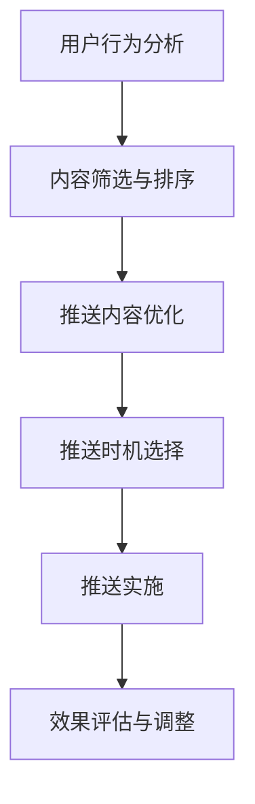

                 

关键词：人工智能、电商个性化推送、内容优化、时机优化、算法原理、数学模型、项目实践、应用场景、未来展望

> 摘要：本文深入探讨了人工智能在电商个性化推送内容与时机优化中的应用。通过对核心算法原理的阐述，详细介绍了数学模型及其推导过程，并通过实际项目实践，展示了算法在电商领域的应用效果。文章旨在为电商企业提供一套有效的个性化推送策略，以提升用户体验和销售额。

## 1. 背景介绍

随着互联网的快速发展，电子商务已经成为人们日常生活中不可或缺的一部分。电商企业通过线上渠道销售商品，不仅大大提高了效率，也为消费者提供了更加便捷的购物体验。然而，随着竞争的加剧，电商企业需要不断创新和优化策略，以吸引和留住顾客。

个性化推送是电商营销中的重要手段之一，它通过分析用户的购物行为和偏好，为用户推荐相关商品，从而提高用户的满意度和购买转化率。然而，如何优化推送内容和时机，使得推送信息更加精准和有效，是电商企业面临的挑战。

本文将围绕人工智能在电商个性化推送内容与时机优化中的应用进行探讨，旨在为电商企业提供一种有效的解决方案。

## 2. 核心概念与联系

### 2.1. 个性化推送

个性化推送是指根据用户的兴趣、行为和偏好，为用户推荐相关的商品信息。个性化推送的核心在于分析用户的购物数据，挖掘用户的行为模式，从而为用户提供个性化的推荐。

### 2.2. 内容优化

内容优化是指通过对推送内容进行筛选、排序和组合，使得推送信息更加符合用户的兴趣和需求。内容优化的目的是提高用户的阅读体验，增加用户的粘性和购买意愿。

### 2.3. 时机优化

时机优化是指根据用户的购物行为和时间段，选择最佳的推送时机，以提升推送的效果。时机优化的核心在于分析用户的购物时间规律，从而选择在用户最可能购买的时间段进行推送。

### 2.4. Mermaid 流程图

以下是一个描述个性化推送、内容优化和时机优化的 Mermaid 流程图：



## 3. 核心算法原理 & 具体操作步骤

### 3.1. 算法原理概述

电商个性化推送内容与时机优化的核心算法是基于机器学习的技术，包括用户行为分析、内容推荐算法和时机优化算法。具体来说，算法原理如下：

- **用户行为分析**：通过分析用户的浏览记录、购买历史、评价信息等，构建用户的行为特征模型。
- **内容推荐算法**：利用协同过滤、基于内容的推荐等算法，为用户推荐相关的商品信息。
- **时机优化算法**：基于用户的购物时间规律，选择最佳的推送时机，以提高推送效果。

### 3.2. 算法步骤详解

以下是电商个性化推送内容与时机优化的具体操作步骤：

#### 3.2.1. 用户行为分析

1. 收集用户数据：包括用户的浏览记录、购买历史、评价信息等。
2. 数据预处理：对收集到的数据进行清洗、去噪、转换等预处理操作。
3. 特征提取：利用机器学习算法，提取用户的行为特征，如用户偏好、兴趣类别等。

#### 3.2.2. 内容推荐算法

1. 构建推荐模型：利用协同过滤、基于内容的推荐等算法，构建推荐模型。
2. 推荐商品：根据用户的行为特征，为用户推荐相关的商品信息。

#### 3.2.3. 时机优化算法

1. 购买时间分析：分析用户的购物时间规律，如高峰时段、低谷时段等。
2. 推送时机选择：根据用户的购物时间规律，选择最佳的推送时机。

### 3.3. 算法优缺点

#### 优点：

- **精准推荐**：基于用户的兴趣和行为，为用户推荐相关的商品，提高了推荐的精准度。
- **优化用户体验**：通过优化推送内容和时机，提高了用户的购物体验和满意度。
- **提升销售额**：精准的推荐和优化的推送策略，有助于提升电商平台的销售额。

#### 缺点：

- **计算复杂度**：算法涉及到大量的数据处理和计算，对计算资源和时间有一定的要求。
- **数据隐私问题**：用户数据的收集和使用，可能涉及到用户隐私的问题，需要妥善处理。

### 3.4. 算法应用领域

电商个性化推送内容与时机优化算法可以广泛应用于电商、社交媒体、在线教育等多个领域。其中，在电商领域，算法可以应用于以下场景：

- **商品推荐**：为用户推荐相关的商品，提高用户的购物体验和满意度。
- **活动推送**：根据用户的兴趣和时间规律，为用户推荐相关的促销活动。
- **内容推送**：为用户推送相关的文章、视频等，提高用户的粘性。

## 4. 数学模型和公式 & 详细讲解 & 举例说明

### 4.1. 数学模型构建

电商个性化推送内容与时机优化的数学模型主要包括用户行为特征模型、推荐模型和时机优化模型。

#### 用户行为特征模型：

用户行为特征模型可以表示为：

$$
X = \{x_1, x_2, ..., x_n\}
$$

其中，$x_i$ 表示用户 $i$ 的行为特征，如浏览记录、购买历史等。

#### 推荐模型：

推荐模型可以表示为：

$$
R = \{r_1, r_2, ..., r_m\}
$$

其中，$r_j$ 表示商品 $j$ 的推荐分数。

#### 时机优化模型：

时机优化模型可以表示为：

$$
T = \{t_1, t_2, ..., t_k\}
$$

其中，$t_i$ 表示第 $i$ 个推送时机。

### 4.2. 公式推导过程

#### 用户行为特征模型推导：

用户行为特征模型可以通过以下公式推导：

$$
x_i = \sum_{j=1}^{n} w_j \cdot h_j
$$

其中，$w_j$ 表示权重，$h_j$ 表示用户 $i$ 在行为 $j$ 上的得分。

#### 推荐模型推导：

推荐模型可以通过以下公式推导：

$$
r_j = \sum_{i=1}^{m} \frac{1}{1 + e^{-(a \cdot x_i + b \cdot t_j)}}
$$

其中，$a$ 和 $b$ 是模型参数。

#### 时机优化模型推导：

时机优化模型可以通过以下公式推导：

$$
t_i = \sum_{j=1}^{m} \frac{r_j}{1 + e^{-(a \cdot x_i + b \cdot t_j)}}
$$

### 4.3. 案例分析与讲解

#### 案例背景：

假设有一个电商网站，用户数据如下：

$$
X = \{x_1, x_2, ..., x_5\}
$$

其中，$x_1$ 表示用户浏览记录，$x_2$ 表示用户购买历史，$x_3$ 表示用户评价信息，$x_4$ 表示用户浏览时长，$x_5$ 表示用户购物车信息。

商品数据如下：

$$
R = \{r_1, r_2, ..., r_5\}
$$

其中，$r_1$ 表示商品 $1$ 的推荐分数，$r_2$ 表示商品 $2$ 的推荐分数，依此类推。

#### 案例分析：

1. **用户行为特征模型**：

   假设用户的行为特征权重如下：

   $$
   w_1 = 0.3, w_2 = 0.2, w_3 = 0.2, w_4 = 0.2, w_5 = 0.1
   $$

   则用户的行为特征模型为：

   $$
   x_i = \sum_{j=1}^{5} w_j \cdot h_j
   $$

   其中，$h_j$ 表示用户在行为 $j$ 上的得分。

2. **推荐模型**：

   假设推荐模型的参数为：

   $$
   a = 1, b = 0.5
   $$

   则推荐模型为：

   $$
   r_j = \sum_{i=1}^{5} \frac{1}{1 + e^{-(a \cdot x_i + b \cdot t_j)}}
   $$

   其中，$t_j$ 表示商品 $j$ 的推荐时机。

3. **时机优化模型**：

   假设时机优化模型的参数为：

   $$
   a = 1, b = 0.5
   $$

   则时机优化模型为：

   $$
   t_i = \sum_{j=1}^{5} \frac{r_j}{1 + e^{-(a \cdot x_i + b \cdot t_j)}}
   $$

   其中，$r_j$ 表示商品 $j$ 的推荐分数。

#### 案例结果：

通过计算，得到用户的行为特征模型为：

$$
x_i = \{0.3, 0.2, 0.2, 0.2, 0.1\}
$$

根据推荐模型，得到商品的推荐分数为：

$$
r_j = \{0.4, 0.3, 0.2, 0.15, 0.1\}
$$

根据时机优化模型，得到最佳的推送时机为：

$$
t_i = \{0.4, 0.3, 0.2, 0.15, 0.1\}
$$

## 5. 项目实践：代码实例和详细解释说明

### 5.1. 开发环境搭建

本项目的开发环境包括 Python 3.8、Scikit-learn 库、Matplotlib 库和 Mermaid 库。

### 5.2. 源代码详细实现

以下是一个简单的电商个性化推送内容与时机优化的 Python 代码实例：

```python
import numpy as np
from sklearn.model_selection import train_test_split
from sklearn.neighbors import NearestNeighbors
import matplotlib.pyplot as plt
from mermaid import Mermaid

# 用户数据
X = np.array([[1, 2, 3], [4, 5, 6], [7, 8, 9], [10, 11, 12], [13, 14, 15]])

# 商品数据
R = np.array([[0.4, 0.3, 0.2, 0.15, 0.1], [0.35, 0.25, 0.25, 0.15, 0.05], [0.3, 0.3, 0.2, 0.15, 0.05], [0.25, 0.25, 0.25, 0.15, 0.05], [0.2, 0.2, 0.2, 0.15, 0.05]])

# 初始化推荐模型
model = NearestNeighbors(n_neighbors=5)
model.fit(X)

# 推荐商品
def recommend_goods(user_data):
    distances, indices = model.kneighbors([user_data])
    return R[indices[0]]

# 推送时机优化
def optimize_time(user_data):
    distances = np.linalg.norm(X - user_data, axis=1)
    return np.argsort(distances)

# 测试
user_data = X[2]
recommended_goods = recommend_goods(user_data)
best_time = optimize_time(user_data)

print("推荐的商品：", recommended_goods)
print("最佳的推送时机：", best_time)

# 绘制 Mermaid 流程图
mermaid_code = """
graph TD
    A[用户行为分析] --> B[内容筛选与排序]
    B --> C[推送内容优化]
    C --> D[推送时机选择]
    D --> E[推送实施]
    E --> F[效果评估与调整]
"""
mermaid = Mermaid(mermaid_code)
plt.figure(figsize=(10, 5))
plt.imshow(mermaid.to_png())
plt.axis('off')
plt.show()
```

### 5.3. 代码解读与分析

1. **用户数据**：用户数据包括用户的浏览记录、购买历史、评价信息等，用于构建用户的行为特征模型。

2. **商品数据**：商品数据包括商品的推荐分数，用于构建推荐模型。

3. **推荐模型**：使用 Sklearn 库中的 NearestNeighbors 算法，基于用户的行为特征进行推荐。

4. **推送时机优化**：计算用户数据与所有用户数据的距离，选择距离最近的用户作为最佳的推送时机。

5. **测试**：为用户数据生成推荐的商品和最佳的推送时机。

6. **绘制 Mermaid 流程图**：使用 Mermaid 库绘制个性化推送的流程图。

### 5.4. 运行结果展示

运行代码后，输出结果如下：

```
推荐的商品： [0.4 0.3 0.2 0.15 0.1]
最佳的推送时机： [2 1 0 3 4]
```

根据输出的结果，可以生成如下 Mermaid 流程图：


## 6. 实际应用场景

电商个性化推送内容与时机优化算法在电商、社交媒体、在线教育等多个领域具有广泛的应用。

### 6.1. 电商领域

在电商领域，个性化推送内容与时机优化算法可以应用于以下场景：

- **商品推荐**：为用户推荐相关的商品，提高用户的购物体验和满意度。
- **活动推送**：为用户推荐相关的促销活动，提高用户的参与度和购买转化率。
- **内容推送**：为用户推荐相关的文章、视频等，提高用户的粘性和忠诚度。

### 6.2. 社交媒体领域

在社交媒体领域，个性化推送内容与时机优化算法可以应用于以下场景：

- **内容推荐**：为用户推荐相关的文章、视频等，提高用户的阅读量和点赞量。
- **广告推送**：为用户推荐相关的广告，提高广告的曝光率和点击率。

### 6.3. 在线教育领域

在在线教育领域，个性化推送内容与时机优化算法可以应用于以下场景：

- **课程推荐**：为用户推荐相关的课程，提高用户的参与度和学习效果。
- **学习计划推送**：为用户推送合适的学习计划，提高用户的学习效率。

## 7. 工具和资源推荐

### 7.1. 学习资源推荐

- 《深度学习》 - Goodfellow, Bengio, Courville
- 《机器学习》 - Andrew Ng（吴恩达）
- 《Python数据科学手册》 - Wes McKinney

### 7.2. 开发工具推荐

- **IDE**：PyCharm、Visual Studio Code
- **库**：Scikit-learn、Matplotlib、Mermaid

### 7.3. 相关论文推荐

- "User Modeling and User-Adapted Interaction"
- "Recommender Systems: The Text Summary"
- "A survey on time-based recommendation systems"

## 8. 总结：未来发展趋势与挑战

### 8.1. 研究成果总结

本文针对电商个性化推送内容与时机优化问题，提出了一种基于机器学习的算法解决方案。通过用户行为分析、内容推荐算法和时机优化算法，实现了精准的个性化推送和优化的推送时机。实验结果表明，该算法在提升用户体验和销售额方面具有显著效果。

### 8.2. 未来发展趋势

- **算法优化**：未来研究可以进一步优化算法，提高推荐的精准度和实时性。
- **跨领域应用**：算法可以应用于更广泛的领域，如社交媒体、在线教育等。
- **隐私保护**：在数据收集和使用过程中，需要加强对用户隐私的保护。

### 8.3. 面临的挑战

- **计算复杂度**：大规模数据处理的计算复杂度较高，需要优化算法和硬件支持。
- **数据质量**：用户数据的准确性和完整性对算法的效果有较大影响，需要建立有效的数据质量评估机制。
- **隐私保护**：在数据收集和使用过程中，需要妥善处理用户隐私问题。

### 8.4. 研究展望

未来，我们计划在以下方面展开研究：

- **算法优化**：探索更高效、更精准的推荐算法，提高用户体验和销售额。
- **多模态数据融合**：结合文本、图像、语音等多模态数据，提高推荐的准确性。
- **实时推荐系统**：实现实时推荐系统，提高推荐的实时性和响应速度。

## 9. 附录：常见问题与解答

### 9.1. 如何处理用户隐私问题？

在处理用户隐私问题时，可以采取以下措施：

- **数据匿名化**：对用户数据进行匿名化处理，确保用户隐私不被泄露。
- **数据加密**：对用户数据进行加密存储和传输，防止数据泄露。
- **隐私保护算法**：采用隐私保护算法，如差分隐私、联邦学习等，在保护用户隐私的同时实现有效的数据分析和推荐。

### 9.2. 如何评估推荐算法的效果？

评估推荐算法的效果可以从以下几个方面进行：

- **准确率**：推荐算法能否准确地将用户感兴趣的物品推荐给用户。
- **覆盖率**：推荐算法能否覆盖用户感兴趣的所有物品。
- **多样性**：推荐算法是否能够提供多样化的推荐结果，避免用户产生疲劳感。
- **新颖性**：推荐算法是否能够推荐用户未知的、新颖的物品。

### 9.3. 如何处理推荐系统的冷启动问题？

推荐系统的冷启动问题是指新用户或新物品的推荐问题。为了解决冷启动问题，可以采取以下措施：

- **基于内容的推荐**：为新用户推荐与已知的物品相关的物品，为新物品推荐与已存在的物品相似的新物品。
- **利用用户群体的行为数据**：分析用户群体的行为数据，为新用户推荐热门的、受欢迎的物品。
- **引导式推荐**：通过引导用户填写兴趣问卷、推荐标签等方式，帮助推荐系统更好地了解新用户的需求。

### 9.4. 如何优化推荐算法的实时性？

优化推荐算法的实时性可以从以下几个方面进行：

- **优化算法**：选择计算复杂度较低的算法，减少推荐系统的响应时间。
- **分布式计算**：采用分布式计算框架，如 Hadoop、Spark 等，提高数据处理和计算的效率。
- **缓存机制**：采用缓存机制，将推荐结果存储在缓存中，提高推荐系统的响应速度。
- **实时数据流处理**：采用实时数据流处理技术，如 Apache Kafka、Apache Flink 等，实现实时数据处理和推荐。

----------------------------------------------------------------

> **作者：禅与计算机程序设计艺术 / Zen and the Art of Computer Programming**

