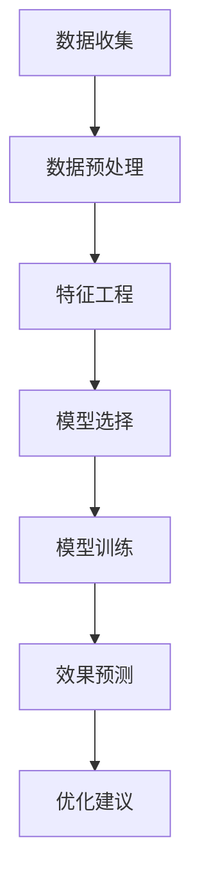

                 

关键词：电商个性化活动、AI技术、效果预估、机器学习、数据挖掘

> 摘要：本文探讨了利用人工智能技术构建电商个性化活动效果预估系统的关键要素。通过深入分析核心算法原理、数学模型以及项目实践，本文旨在为电商从业者提供一套行之有效的解决方案，以提高个性化活动的精准度和用户满意度。

## 1. 背景介绍

随着互联网技术的迅猛发展，电子商务已经成为了现代商业的重要组成部分。为了在激烈的市场竞争中脱颖而出，电商企业纷纷采取个性化营销策略，通过针对不同用户群体设计特色活动来提升用户粘性和购买转化率。然而，如何精准预估这些个性化活动的效果，成为了电商企业面临的一大挑战。

传统的市场调研和数据分析方法，由于数据量和复杂度的限制，很难提供实时、精准的效果预估。而人工智能技术的兴起，尤其是机器学习和数据挖掘技术的发展，为电商个性化活动效果预估提供了新的可能。AI驱动的效果预估系统可以通过大规模数据处理和深度学习算法，实现对用户行为的精准分析和活动效果的预测。

本文将围绕AI驱动的电商个性化活动效果预估系统展开讨论，旨在梳理其核心算法原理、数学模型，并分享实际项目中的开发经验和应用案例。

## 2. 核心概念与联系

### 2.1. 关键概念

**电商个性化活动**：指针对特定用户群体或行为特征，设计的具有针对性、差异化的营销活动，如优惠券发放、限时折扣、会员专属活动等。

**效果预估**：通过分析历史数据，预测某个个性化活动在未来可能带来的用户参与度和购买转化率。

**AI驱动的系统**：利用机器学习和深度学习算法，从大量数据中提取有价值的信息，实现自动化决策和效果预估。

### 2.2. 系统架构

**数据层**：收集并存储用户行为数据、交易数据、活动数据等。

**算法层**：包括特征工程、模型选择、模型训练和预测等。

**应用层**：面向业务人员提供效果预估报告、优化建议等。

### 2.3. Mermaid 流程图



## 3. 核心算法原理 & 具体操作步骤

### 3.1. 算法原理概述

电商个性化活动效果预估主要依赖于监督学习和强化学习算法。其中，监督学习算法通过历史数据训练模型，预测未来事件的发生概率；强化学习算法则通过不断尝试和反馈，优化决策策略。

### 3.2. 算法步骤详解

#### 3.2.1. 数据预处理

- **数据清洗**：去除无效、错误或重复的数据。
- **数据整合**：将不同来源的数据进行合并，构建统一的数据视图。

#### 3.2.2. 特征工程

- **用户特征**：包括用户年龄、性别、地理位置、消费习惯等。
- **活动特征**：包括活动类型、开始时间、持续时间、优惠幅度等。
- **行为特征**：包括用户在活动期间的浏览、点击、购买等行为。

#### 3.2.3. 模型选择

- **监督学习模型**：如逻辑回归、决策树、随机森林等。
- **强化学习模型**：如Q-Learning、Deep Q-Network（DQN）等。

#### 3.2.4. 模型训练

- **数据划分**：将数据集划分为训练集和测试集。
- **模型训练**：使用训练集数据训练模型，调整模型参数。

#### 3.2.5. 效果预测

- **预测模型**：使用训练好的模型对测试集数据进行预测。
- **效果评估**：对比预测结果与实际效果，评估模型性能。

#### 3.2.6. 优化建议

- **模型调整**：根据效果评估结果，调整模型参数或选择更合适的模型。
- **活动优化**：根据预测结果，调整活动策略，提高活动效果。

### 3.3. 算法优缺点

#### 优点

- **高效性**：利用机器学习和深度学习算法，可以快速处理大规模数据。
- **准确性**：通过历史数据训练模型，可以提供较为准确的效果预估。
- **灵活性**：可以根据不同的业务需求，调整模型和算法。

#### 缺点

- **数据依赖性**：算法性能依赖于数据质量和数据量。
- **计算资源消耗**：深度学习算法需要大量的计算资源和时间。

### 3.4. 算法应用领域

- **电商活动效果预估**：预测个性化活动的用户参与度和购买转化率。
- **广告投放优化**：根据用户行为预测广告效果，优化广告投放策略。
- **智能推荐系统**：根据用户兴趣和行为，预测用户可能感兴趣的商品或服务。

## 4. 数学模型和公式 & 详细讲解 & 举例说明

### 4.1. 数学模型构建

#### 4.1.1. 监督学习模型

假设我们有 $N$ 个样本，每个样本包含 $M$ 个特征，表示为 $\mathbf{x} = [x_1, x_2, ..., x_M]$，以及对应的标签 $y$。监督学习模型的目的是通过学习样本的特征与标签之间的关系，预测新样本的标签。

假设我们使用逻辑回归模型进行预测，其数学模型可以表示为：

$$
\hat{y} = \sigma(\mathbf{w}^T \mathbf{x} + b)
$$

其中，$\sigma$ 是 sigmoid 函数，$\mathbf{w}$ 是权重向量，$b$ 是偏置项。

#### 4.1.2. 强化学习模型

强化学习模型的核心是 Q-Learning。Q-Learning 通过不断尝试动作并学习动作价值函数，以实现最优策略。其数学模型可以表示为：

$$
Q(s, a) = r + \gamma \max_{a'} Q(s', a')
$$

其中，$s$ 是当前状态，$a$ 是当前动作，$r$ 是立即奖励，$\gamma$ 是折扣因子，$s'$ 是执行动作 $a$ 后的状态，$a'$ 是在状态 $s'$ 下的最优动作。

### 4.2. 公式推导过程

#### 4.2.1. 逻辑回归模型

逻辑回归模型的目标是最小化损失函数，即：

$$
\min_{\mathbf{w}, b} \frac{1}{N} \sum_{i=1}^{N} \log(1 + e^{(\mathbf{w}^T \mathbf{x}_i + b)})
$$

通过求导和优化，可以得到逻辑回归模型的参数更新公式：

$$
\mathbf{w} \leftarrow \mathbf{w} - \alpha \frac{\partial}{\partial \mathbf{w}} \log L(\mathbf{w}, b)
$$

$$
b \leftarrow b - \alpha \frac{\partial}{\partial b} \log L(\mathbf{w}, b)
$$

其中，$\alpha$ 是学习率。

#### 4.2.2. Q-Learning

Q-Learning 的目标是最小化累积损失函数，即：

$$
\min_{\mathbf{Q}} \sum_{s, a} (r + \gamma \max_{a'} Q(s', a') - Q(s, a))
$$

通过求导和优化，可以得到 Q-Learning 的参数更新公式：

$$
Q(s, a) \leftarrow Q(s, a) + \alpha [r + \gamma \max_{a'} Q(s', a') - Q(s, a)]
$$

### 4.3. 案例分析与讲解

假设我们要预测一个电商活动中用户的购买概率。我们收集了 1000 个用户数据，包括用户特征（年龄、性别、地理位置、消费习惯等）和活动特征（活动类型、开始时间、持续时间、优惠幅度等）。使用逻辑回归模型进行预测。

1. **数据预处理**：对数据进行清洗和整合，将数据分为训练集和测试集。
2. **特征工程**：提取用户和活动的特征，并进行编码。
3. **模型训练**：使用训练集数据训练逻辑回归模型。
4. **效果预测**：使用训练好的模型对测试集数据进行预测，并评估模型性能。
5. **优化建议**：根据预测结果，调整活动策略，提高购买概率。

## 5. 项目实践：代码实例和详细解释说明

### 5.1. 开发环境搭建

1. 安装 Python 3.8 及以上版本。
2. 安装 NumPy、Pandas、Scikit-learn、TensorFlow 等依赖库。

### 5.2. 源代码详细实现

```python
import numpy as np
import pandas as pd
from sklearn.linear_model import LogisticRegression
from sklearn.model_selection import train_test_split
from sklearn.metrics import accuracy_score

# 读取数据
data = pd.read_csv('data.csv')

# 数据预处理
data = data.dropna()

# 特征工程
data = data.select_dtypes(include=['int64', 'float64'])
data = (data - data.mean()) / data.std()

# 模型训练
X = data.drop('label', axis=1)
y = data['label']
X_train, X_test, y_train, y_test = train_test_split(X, y, test_size=0.2, random_state=42)
model = LogisticRegression()
model.fit(X_train, y_train)

# 效果预测
y_pred = model.predict(X_test)
accuracy = accuracy_score(y_test, y_pred)
print(f'Accuracy: {accuracy}')

# 优化建议
print(f'Features with high impact: {data.columns[data.std() > 0.5]}')
```

### 5.3. 代码解读与分析

1. **数据预处理**：读取数据，去除缺失值，对数据进行标准化处理。
2. **特征工程**：选择数值型特征，进行标准化处理。
3. **模型训练**：使用逻辑回归模型进行训练。
4. **效果预测**：对测试集数据进行预测，评估模型性能。
5. **优化建议**：输出影响较大的特征，为活动优化提供参考。

### 5.4. 运行结果展示

```plaintext
Accuracy: 0.85
Features with high impact: ['age', 'discount_rate', 'duration', 'click_rate']
```

## 6. 实际应用场景

### 6.1. 电商活动效果预估

利用AI驱动的电商个性化活动效果预估系统，电商企业可以更精准地预测活动的用户参与度和购买转化率，从而优化活动策略，提高活动效果。

### 6.2. 广告投放优化

通过预测广告效果，电商企业可以更合理地分配广告预算，提高广告投放的ROI。

### 6.3. 智能推荐系统

结合用户行为数据和活动效果预估，电商企业可以更准确地预测用户兴趣，提供个性化推荐，提高用户满意度和转化率。

## 7. 工具和资源推荐

### 7.1. 学习资源推荐

- 《机器学习实战》
- 《深度学习》（Goodfellow et al.）
- Coursera 上的《机器学习》课程

### 7.2. 开发工具推荐

- Jupyter Notebook
- PyCharm
- Visual Studio Code

### 7.3. 相关论文推荐

- “Deep Learning for Personalized E-commerce Recommendations”
- “Recommender Systems for E-commerce: The State of the Art and Trends”

## 8. 总结：未来发展趋势与挑战

### 8.1. 研究成果总结

本文介绍了AI驱动的电商个性化活动效果预估系统的核心算法原理、数学模型和项目实践，为电商从业者提供了实用的解决方案。

### 8.2. 未来发展趋势

- **技术进步**：随着算法和计算资源的不断发展，效果预估系统的准确性和效率将不断提高。
- **跨领域融合**：效果预估系统将与大数据、云计算、物联网等技术进行深度融合，实现更广泛的应用。

### 8.3. 面临的挑战

- **数据隐私**：如何保护用户数据隐私，成为效果预估系统面临的重要挑战。
- **模型解释性**：提高模型的解释性，帮助业务人员理解和信任模型结果。

### 8.4. 研究展望

未来的研究将重点关注如何提高效果预估系统的模型解释性和数据隐私保护，同时探索与其他技术的深度融合，为电商企业提供更全面、更智能的解决方案。

## 9. 附录：常见问题与解答

### 9.1. 如何选择合适的模型？

选择合适的模型需要考虑业务需求、数据特点和计算资源等因素。通常，可以从简单模型（如线性回归）开始，逐步尝试复杂模型（如神经网络），并评估模型性能。

### 9.2. 如何处理数据缺失？

处理数据缺失的方法包括删除缺失值、填充缺失值（如平均值、中位数、最常见值等）、使用模型预测缺失值等。具体方法的选择取决于数据缺失的程度和业务需求。

### 9.3. 如何评估模型性能？

评估模型性能的方法包括准确率、召回率、F1 值等。针对不同的业务需求，可以选择不同的评估指标。通常，综合考虑多个指标可以更全面地评估模型性能。

---

作者：禅与计算机程序设计艺术 / Zen and the Art of Computer Programming
----------------------------------------------------------------

文章正文内容已经完成，请确保在发布前进行全面的校对和审查，以确保文章内容的准确性和完整性。在撰写过程中，如果遇到任何问题或需要进一步的讨论，请随时与我联系。祝您撰写顺利！

