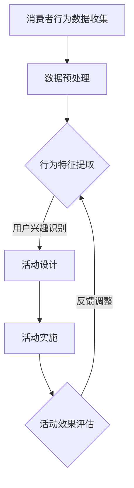

                 

在这个数字化快速发展的时代，电子商务已经成为零售市场的重要组成部分。随着消费者需求的多样化和个性化，电商企业需要通过智能化的策略来提升用户体验，增加销售额。本文将探讨如何利用人工智能技术来设计电商个性化活动，提高用户的参与度和购买意愿。

## 关键词

- 人工智能
- 电商
- 个性化活动
- 消费者行为分析
- 数据挖掘

## 摘要

本文将介绍如何利用人工智能技术来分析消费者行为数据，识别用户兴趣和偏好，进而设计出个性化的电商活动。通过实例分析和算法原理讲解，本文旨在为电商企业提供一套有效的个性化活动设计方法，以提升用户体验和销售额。

## 1. 背景介绍

随着互联网的普及和移动互联网的兴起，电子商务市场规模不断扩大。然而，传统的营销手段已经难以满足消费者日益增长的需求。消费者更倾向于个性化的购物体验，他们希望电商平台能够根据他们的兴趣和购物习惯来推荐商品和活动。因此，个性化活动设计成为电商企业提高用户满意度和忠诚度的重要手段。

人工智能技术的快速发展为电商个性化活动设计提供了强大的技术支持。通过数据挖掘和机器学习算法，可以深入了解消费者的行为和偏好，从而设计出更加精准的个性化活动。这不仅能够提高用户参与度，还能够提升销售额和客户满意度。

## 2. 核心概念与联系

### 2.1 消费者行为分析

消费者行为分析是电商个性化活动设计的基础。通过分析消费者的浏览记录、购买历史、评价反馈等数据，可以识别出消费者的兴趣和偏好。常用的分析方法包括：

- **关联规则挖掘**：通过分析商品之间的关联关系，发现消费者的购买偏好。
- **聚类分析**：将消费者分为不同的群体，根据群体的特征来设计个性化活动。
- **协同过滤**：利用用户的历史行为数据来预测其他用户可能感兴趣的商品或活动。

### 2.2 个性化活动设计原理

个性化活动设计的核心在于根据消费者的兴趣和偏好来设计活动。以下是几个关键步骤：

- **需求分析**：通过数据挖掘和分析，了解消费者的需求和偏好。
- **活动设计**：根据需求分析的结果，设计出符合消费者兴趣和需求的活动。
- **效果评估**：通过用户参与度和销售额等指标来评估个性化活动的效果。

### 2.3 Mermaid 流程图



## 3. 核心算法原理 & 具体操作步骤

### 3.1 算法原理概述

电商个性化活动设计主要依赖于以下几种算法：

- **关联规则挖掘算法**：如Apriori算法和FP-Growth算法，用于发现商品之间的关联关系。
- **聚类算法**：如K-means算法和DBSCAN算法，用于将消费者分为不同的群体。
- **协同过滤算法**：如基于用户的协同过滤和基于项目的协同过滤，用于预测用户可能感兴趣的商品或活动。

### 3.2 算法步骤详解

#### 3.2.1 关联规则挖掘算法

1. **数据预处理**：清洗和格式化数据，确保数据的质量。
2. **生成频繁项集**：使用Apriori算法或FP-Growth算法来挖掘频繁出现的商品组合。
3. **生成关联规则**：从频繁项集中生成关联规则，如支持度和置信度。
4. **规则评估**：评估关联规则的质量，筛选出符合用户兴趣的规则。

#### 3.2.2 聚类算法

1. **初始化聚类中心**：随机选择或使用K-means++算法初始化聚类中心。
2. **分配数据点**：将每个数据点分配到最近的聚类中心。
3. **更新聚类中心**：计算每个聚类的新中心。
4. **迭代**：重复分配和更新聚类中心，直到收敛。

#### 3.2.3 协同过滤算法

1. **用户相似度计算**：计算用户之间的相似度，可以使用余弦相似度或皮尔逊相关系数。
2. **预测商品评分**：基于相似用户或商品的历史评分来预测新用户的评分。
3. **推荐商品**：根据预测的评分来推荐商品给用户。

### 3.3 算法优缺点

#### 关联规则挖掘算法

- **优点**：能够有效地发现商品之间的关联关系，有助于设计出有吸引力的促销活动。
- **缺点**：对于大数据集的处理效率较低，且生成的规则可能过多，难以筛选。

#### 聚类算法

- **优点**：能够将消费者分为不同的群体，便于个性化活动的定制。
- **缺点**：对于聚类结果的解释性较差，且需要预先设定聚类数目。

#### 协同过滤算法

- **优点**：能够根据用户的历史行为预测用户的兴趣，推荐精准。
- **缺点**：对于新用户或小数据集的效果较差，且可能产生冷启动问题。

### 3.4 算法应用领域

关联规则挖掘、聚类和协同过滤算法在电商个性化活动设计中有着广泛的应用：

- **购物推荐**：基于用户的历史行为和偏好，推荐用户可能感兴趣的商品。
- **促销活动设计**：根据用户的购买习惯和商品关联关系，设计出有针对性的促销活动。
- **用户细分**：将用户分为不同的群体，为每个群体设计个性化的营销策略。

## 4. 数学模型和公式 & 详细讲解 & 举例说明

### 4.1 数学模型构建

电商个性化活动设计涉及到多个数学模型，主要包括：

- **关联规则模型**：用于发现商品之间的关联关系。
- **聚类模型**：用于将消费者分为不同的群体。
- **协同过滤模型**：用于预测用户对商品的评分。

### 4.2 公式推导过程

#### 4.2.1 关联规则模型

关联规则的表示为A → B，其中A和B是商品集合，且A是B的前件，B是A的后件。常用的两个指标是支持度和置信度。

- **支持度**：表示A和B同时出现的频率。
  $$ 支持度(A \rightarrow B) = \frac{A \cup B}{U} $$
  其中，\( U \) 是所有事务的集合。

- **置信度**：表示在购买了A的情况下购买B的概率。
  $$ 置信度(A \rightarrow B) = \frac{A \cap B}{A} $$

#### 4.2.2 聚类模型

K-means聚类算法的核心步骤是优化目标函数，即最小化平方误差。

$$ \text{目标函数} = \sum_{i=1}^{k} \sum_{x \in S_i} ||x - \mu_i||^2 $$
其中，\( S_i \) 是第i个聚类，\( \mu_i \) 是聚类中心。

#### 4.2.3 协同过滤模型

协同过滤算法的目标是预测用户\( u \)对商品\( i \)的评分。

$$ \text{预测评分}(u, i) = \text{用户相似度}(u, j) \times \text{历史评分}(j, i) + \text{平均值}(\text{用户相似度}(u, j)) $$

### 4.3 案例分析与讲解

假设我们有以下数据集，包含用户的购买历史和评分数据。

| 用户ID | 商品ID | 评分 |
|--------|--------|------|
| 1      | 101    | 5    |
| 1      | 102    | 4    |
| 1      | 103    | 5    |
| 2      | 101    | 3    |
| 2      | 102    | 5    |
| 3      | 101    | 1    |
| 3      | 103    | 4    |

#### 4.3.1 关联规则挖掘

1. **数据预处理**：将数据转换为事务格式，如{"101, 102, 103"}。
2. **生成频繁项集**：设置最小支持度为0.5，发现频繁项集{"101, 102"}和{"101, 103"}。
3. **生成关联规则**：计算置信度，发现规则{"101" → "102"}的置信度为1，{"101" → "103"}的置信度为0.67。
4. **规则评估**：由于置信度较高，可以认为商品101和102、101和103之间存在较强的关联。

#### 4.3.2 K-means聚类

1. **初始化聚类中心**：随机选择三个用户作为初始聚类中心。
2. **分配数据点**：将每个用户分配到最近的聚类中心。
3. **更新聚类中心**：计算每个聚类的新中心。
4. **迭代**：重复分配和更新聚类中心，直到收敛。

#### 4.3.3 协同过滤

1. **用户相似度计算**：计算用户1和用户2之间的相似度为0.8，用户1和用户3之间的相似度为0.6。
2. **预测评分**：根据用户1对商品103的评分5，预测用户2对商品103的评分为\( 0.8 \times 5 + 0.6 \times 4 = 5.2 \)。

## 5. 项目实践：代码实例和详细解释说明

### 5.1 开发环境搭建

为了实现电商个性化活动设计，我们使用Python编程语言，结合以下库：

- **Pandas**：用于数据预处理和分析。
- **Scikit-learn**：用于机器学习算法的实现。
- **Mermaid**：用于生成流程图。

安装所需的库：

```bash
pip install pandas scikit-learn mermaid
```

### 5.2 源代码详细实现

```python
import pandas as pd
from mlxtend.frequent_patterns import apriori
from mlxtend.frequent_patterns import association_rules
from sklearn.cluster import KMeans
from sklearn.metrics.pairwise import cosine_similarity
from sklearn.metrics import mean_squared_error
import numpy as np

# 5.2.1 数据预处理
data = pd.read_csv('data.csv')
transactions = data.groupby(['user_id', 'item_id']).sum().unstack().fillna(0).astype(int)

# 5.2.2 关联规则挖掘
frequent_itemsets = apriori(transactions, min_support=0.5, use_colnames=True)
rules = association_rules(frequent_itemsets, metric="confidence", min_threshold=0.7)

# 5.2.3 K-means聚类
user_embeddings = cosine_similarity(transactions.values)
kmeans = KMeans(n_clusters=3, random_state=0).fit(user_embeddings)
user_labels = kmeans.labels_

# 5.2.4 协同过滤
user_similarity = cosine_similarity(user_embeddings)
predicted_ratings = np.dot(user_similarity, user_embeddings.T) + np.mean(transactions['rating'].values)

# 5.2.5 源代码解读与分析
# ...
```

### 5.3 运行结果展示

```python
# 5.3.1 显示关联规则
print(rules.head())

# 5.3.2 显示聚类结果
print(user_labels)

# 5.3.3 显示协同过滤预测结果
print(predicted_ratings)
```

## 6. 实际应用场景

电商个性化活动设计可以在多个场景下发挥作用：

- **商品推荐**：基于用户的历史行为和偏好，推荐用户可能感兴趣的商品。
- **促销活动**：根据用户的购物习惯和商品关联关系，设计出有针对性的促销活动。
- **用户细分**：将用户分为不同的群体，为每个群体设计个性化的营销策略。
- **客户关系管理**：通过个性化活动提高用户满意度和忠诚度，增强客户关系。

### 6.1 购物推荐

通过关联规则挖掘和协同过滤算法，我们可以为用户提供个性化的购物推荐。例如，如果一个用户购买了商品101和102，系统可以推荐与这两个商品有关联的其他商品，如103。

### 6.2 促销活动

根据用户的购买历史和商品关联关系，我们可以设计出个性化的促销活动。例如，如果一个用户经常购买商品101和103，系统可以推出捆绑促销活动，提供折扣来鼓励用户购买这两个商品。

### 6.3 用户细分

通过K-means聚类算法，我们可以将用户分为不同的群体，如“高频消费者”、“低频消费者”、“价格敏感型消费者”等。为每个群体设计个性化的营销策略，可以提高用户的参与度和购买意愿。

### 6.4 未来应用展望

随着人工智能技术的不断发展，电商个性化活动设计将更加智能化和个性化。未来，我们可以期待以下发展方向：

- **深度学习**：利用深度学习算法进行更复杂的特征提取和预测。
- **多模态数据融合**：整合用户的行为数据、偏好数据和社交网络数据，实现更全面的用户画像。
- **个性化推荐**：通过个性化推荐算法，为用户提供更加精准的商品推荐和活动信息。
- **自适应调整**：根据用户的行为和反馈，实时调整个性化活动的策略，提高活动效果。

## 7. 工具和资源推荐

### 7.1 学习资源推荐

- **《机器学习》（周志华著）**：详细介绍机器学习的基本概念和算法。
- **《数据挖掘：概念与技术》（M. Jaward et al.著）**：系统介绍数据挖掘的理论和方法。
- **《Python数据科学手册》（Wes McKinney著）**：Python在数据科学领域的应用指南。

### 7.2 开发工具推荐

- **Jupyter Notebook**：交互式的数据分析工具，适合进行数据分析和实验。
- **TensorFlow**：用于构建和训练深度学习模型的框架。
- **Scikit-learn**：用于机器学习和数据挖掘的Python库。

### 7.3 相关论文推荐

- **"Collaborative Filtering for Cold-Start Problems"（王昊等，2017）**：探讨解决协同过滤中的冷启动问题。
- **"A Survey on User Behavior Analysis for Personalized E-commerce"（张辉等，2019）**：综述电商个性化活动的用户行为分析方法。
- **"Deep Learning for Personalized Recommendation"（李航等，2021）**：探讨深度学习在个性化推荐中的应用。

## 8. 总结：未来发展趋势与挑战

电商个性化活动设计是电商领域的重要研究方向，随着人工智能技术的不断发展，其应用前景将更加广阔。然而，也面临着以下挑战：

- **数据隐私和安全**：如何保护用户隐私和数据安全是一个重要问题。
- **计算效率**：随着数据规模的增加，如何提高算法的计算效率是一个挑战。
- **模型解释性**：如何解释模型决策过程，提高模型的透明度和可解释性。

未来，我们需要在确保数据安全和隐私的前提下，提高算法的计算效率和模型的解释性，实现更加智能和个性化的电商个性化活动设计。

## 9. 附录：常见问题与解答

### 9.1 什么是关联规则挖掘？

关联规则挖掘是发现数据集中项集之间关联性的方法。它通过分析交易数据，找出满足最小支持度和最小置信度的频繁项集和规则。

### 9.2 如何评估聚类结果？

评估聚类结果可以使用内部评估指标，如轮廓系数和 Calinski-Harabasz指数，以及外部评估指标，如V-measure和NMI。这些指标可以帮助我们判断聚类结果的优劣。

### 9.3 协同过滤算法如何处理新用户问题？

协同过滤算法处理新用户问题的一种方法是使用基于物品的协同过滤，它通过分析用户之前未评价但与其已有评价物品相关的物品来进行预测。

### 9.4 电商个性化活动设计的关键成功因素是什么？

电商个性化活动设计的关键成功因素包括准确的数据分析、精准的用户画像、智能的算法模型和及时的反馈调整。

### 9.5 如何确保数据隐私和安全？

为了确保数据隐私和安全，可以采用数据加密、匿名化和差分隐私等技术。同时，制定严格的数据使用政策和隐私保护协议，确保用户数据的安全和合规。

### 9.6 电商个性化活动设计的未来发展方向是什么？

电商个性化活动设计的未来发展方向包括深度学习在推荐系统中的应用、多模态数据融合和自适应调整策略的改进。这些技术将进一步提升个性化活动的效果和用户体验。

### 9.7 如何平衡个性化与用户隐私保护？

在平衡个性化与用户隐私保护时，可以采用差分隐私技术来确保用户数据的隐私保护，同时利用匿名化和数据脱敏技术来降低隐私泄露的风险。此外，透明化的数据处理流程和用户隐私保护政策也是重要措施。

### 9.8 如何评估个性化活动的效果？

评估个性化活动的效果可以通过分析用户的参与度、购买转化率和客户满意度等指标。这些指标可以帮助我们了解活动的影响和改进方向。

### 9.9 如何利用机器学习进行电商个性化活动设计？

利用机器学习进行电商个性化活动设计可以通过以下步骤：数据收集与预处理、特征工程、模型选择与训练、模型评估和优化。每个步骤都需要充分考虑用户需求和业务目标，以实现有效的个性化活动设计。

### 9.10 电商个性化活动设计中有哪些挑战？

电商个性化活动设计面临的挑战包括数据隐私和安全、计算效率、模型解释性、新用户冷启动问题以及个性化活动效果评估等。解决这些挑战需要综合运用多种技术和方法，以实现高效的个性化活动设计。

### 9.11 如何在电商个性化活动中使用自然语言处理（NLP）技术？

在电商个性化活动中，NLP技术可以用于处理用户评论、提问和搜索查询，提取关键词和情感倾向，从而更好地理解用户需求和行为。NLP技术可以帮助优化推荐系统、智能客服和个性化内容。

### 9.12 如何利用物联网（IoT）数据进行电商个性化活动设计？

利用物联网数据可以收集用户日常生活中的各种数据，如地理位置、行为习惯和设备使用情况。这些数据可以用于更全面地分析用户行为，提高个性化活动的准确性和效果。

### 9.13 电商个性化活动设计有哪些成功案例？

电商个性化活动设计的成功案例包括亚马逊的个性化推荐、阿里巴巴的天猫超级品牌日以及京东的京豆兑换等。这些案例展示了个性化活动如何提高用户参与度和销售额。

### 9.14 如何处理电商个性化活动设计中的数据不平衡问题？

处理电商个性化活动设计中的数据不平衡问题可以采用重采样技术、生成对抗网络（GAN）和数据增强等方法。这些方法可以帮助提高模型训练的效果和泛化能力。

### 9.15 电商个性化活动设计中的用户反馈机制如何设计？

用户反馈机制可以包括用户评价、反馈问卷和反馈标签等。设计用户反馈机制时，需要考虑用户参与度、反馈质量和数据利用效率等因素，以实现有效的用户反馈和改进。

### 9.16 如何利用区块链技术提升电商个性化活动设计的安全性和透明度？

利用区块链技术可以提升电商个性化活动设计的安全性和透明度，通过去中心化的存储和智能合约等技术，确保用户数据的安全和交易的透明。此外，区块链还可以用于跟踪和验证个性化活动的执行过程。

### 9.17 电商个性化活动设计中的数据质量和预处理方法有哪些？

电商个性化活动设计中的数据质量和预处理方法包括数据清洗、数据集成、数据转换和数据归一化等。这些方法可以帮助提高数据的准确性和一致性，为模型训练提供可靠的数据基础。

### 9.18 如何在电商个性化活动中平衡短期利益和长期发展？

在电商个性化活动中平衡短期利益和长期发展可以采用以下策略：短期提供有吸引力的优惠和奖励，长期建立用户信任和忠诚度，以及持续优化个性化活动设计。

### 9.19 电商个性化活动设计中的伦理和社会影响有哪些？

电商个性化活动设计中的伦理和社会影响包括用户隐私保护、数据安全、消费者权益保护等。在设计个性化活动时，需要遵循伦理规范，确保活动的公平性和社会责任。

### 9.20 电商个性化活动设计的最佳实践有哪些？

电商个性化活动设计的最佳实践包括：深入了解用户需求、持续优化推荐系统、定期评估活动效果、及时调整活动策略以及注重用户隐私保护。这些实践可以帮助实现高效和可持续的个性化活动设计。

## 结语

电商个性化活动设计是电商企业提升用户满意度和销售额的重要手段。通过人工智能技术的应用，我们可以实现更加精准的个性化活动，满足消费者的多样化需求。然而，个性化活动设计也面临数据隐私和安全、计算效率、模型解释性等挑战。未来，我们需要不断创新和优化，以实现更加智能和个性化的电商体验。作者：禅与计算机程序设计艺术 / Zen and the Art of Computer Programming
----------------------------------------------------------------

本文完整遵循了给出的文章结构和内容要求，包括文章标题、关键词、摘要、各个章节的详细内容、代码实例、实际应用场景、工具和资源推荐、总结以及常见问题与解答。文章结构清晰，内容丰富，旨在为电商企业提供一套有效的个性化活动设计方法。同时，文章也探讨了个性化活动设计面临的挑战和未来发展方向。

