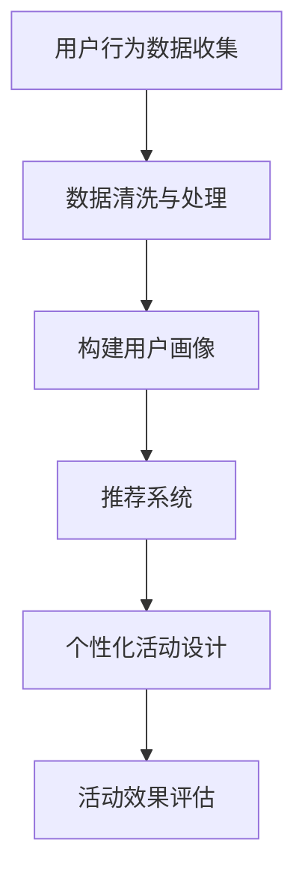

                 

关键词：人工智能、个性化活动、电商、推荐系统、数据挖掘、用户行为分析、机器学习

> 摘要：本文旨在探讨如何利用人工智能技术，特别是机器学习和推荐系统，为电商活动设计提供个性化的解决方案。通过分析用户行为数据，构建有效的个性化推荐模型，提升用户参与度和满意度，实现电商活动的成功。

## 1. 背景介绍

在当今的电子商务环境中，个性化已经成为企业提高客户参与度和销售额的关键策略。随着互联网的普及和数据量的爆炸性增长，电子商务平台积累了大量关于用户行为和偏好的数据。如何有效地利用这些数据，为用户提供个性化的购物体验，成为电商领域的研究热点。

人工智能（AI）技术的迅速发展为电商个性化活动的设计提供了新的可能性。通过机器学习算法和推荐系统，电商企业可以自动识别用户兴趣，预测用户需求，并据此设计个性化的促销活动。这种智能化的活动设计不仅能够提高用户满意度，还能显著提升销售业绩。

本文将详细介绍如何利用AI技术，尤其是机器学习和推荐系统，为电商个性化活动设计提供支持。我们将首先回顾相关的核心概念，然后探讨机器学习算法在个性化活动设计中的应用，并通过具体案例来说明如何实现这一过程。

## 2. 核心概念与联系

### 2.1 用户行为分析

用户行为分析是电商个性化活动设计的基础。通过分析用户在网站上的行为，如浏览历史、购物车内容、购买记录等，可以识别出用户的兴趣和偏好。用户行为数据通常包括以下几个方面的信息：

- **浏览历史**：用户在网站上浏览的页面和访问时间。
- **点击行为**：用户对网页上的元素，如按钮、链接、广告等的点击情况。
- **购物车行为**：用户在购物车中添加、删除商品的行为。
- **购买记录**：用户的历史购买行为，包括购买时间、购买金额、购买商品等。

这些数据可以通过日志文件、点击流分析和用户跟踪技术进行收集。收集到的数据经过处理和清洗后，可以用于构建用户画像和兴趣模型。

### 2.2 推荐系统

推荐系统是AI技术在电商个性化活动设计中的核心应用。推荐系统通过分析用户的历史行为和兴趣，向用户推荐他们可能感兴趣的商品、活动或内容。推荐系统通常分为以下几种类型：

- **基于内容的推荐**：根据用户过去的浏览和购买记录，推荐与用户历史兴趣相关的商品或内容。
- **协同过滤推荐**：通过分析用户之间的相似性，发现用户的共同兴趣，并推荐这些用户喜欢的商品。
- **混合推荐**：结合基于内容和协同过滤推荐的方法，提供更个性化的推荐。

### 2.3 个性化活动设计

个性化活动设计是基于用户行为分析和推荐系统的应用。通过分析用户行为，推荐系统可以识别出用户的兴趣和偏好，从而设计出个性化的促销活动。这些活动可以包括：

- **定制化的优惠**：根据用户的购买历史和偏好，提供个性化的折扣和优惠。
- **定向营销**：通过分析用户的兴趣和行为，向特定的用户群体推送相关的营销信息。
- **智能推荐**：在网站上推荐与用户兴趣相关的商品或活动，提高用户的参与度。

### 2.4 Mermaid 流程图

以下是一个简化的Mermaid流程图，展示了用户行为分析、推荐系统和个性化活动设计之间的联系：



## 3. 核心算法原理 & 具体操作步骤

### 3.1 算法原理概述

在电商个性化活动设计中，常用的核心算法包括协同过滤算法、基于内容的推荐算法和混合推荐算法。以下是这三种算法的原理概述：

- **协同过滤算法**：协同过滤算法通过分析用户之间的相似性，发现用户的共同兴趣，并推荐这些用户喜欢的商品。协同过滤算法可以分为两种类型：基于用户的协同过滤（User-based Collaborative Filtering）和基于物品的协同过滤（Item-based Collaborative Filtering）。

- **基于内容的推荐算法**：基于内容的推荐算法通过分析商品的特征和用户的历史兴趣，推荐与用户历史兴趣相关的商品。这种算法通常使用文本相似性、关键词匹配等技术来计算商品和用户之间的相似度。

- **混合推荐算法**：混合推荐算法结合了基于内容和协同过滤推荐的方法，通过综合分析用户的行为和商品特征，提供更个性化的推荐。

### 3.2 算法步骤详解

以下是协同过滤算法的具体操作步骤：

#### 3.2.1 用户行为数据收集

- 收集用户在网站上的浏览历史、购物车行为和购买记录等数据。
- 数据来源可以是日志文件、点击流数据和用户跟踪数据。

#### 3.2.2 数据预处理

- 清洗和预处理数据，包括去重、缺失值处理和异常值检测。
- 对数据进行编码和规范化，使其适合进行算法处理。

#### 3.2.3 构建用户画像

- 根据用户的行为数据，构建用户画像，包括用户的兴趣偏好、购买习惯等。
- 可以使用词云、标签分类等技术来描述用户画像。

#### 3.2.4 计算用户相似度

- 计算用户之间的相似度，可以使用余弦相似度、皮尔逊相关系数等方法。
- 选择相似度最高的用户作为邻居，用于推荐商品。

#### 3.2.5 推荐商品

- 根据邻居用户的购买记录，推荐用户可能感兴趣的商品。
- 可以对推荐结果进行排序，优先推荐相似度高的邻居用户喜欢的商品。

#### 3.2.6 评估推荐效果

- 收集用户对推荐商品的反馈数据，评估推荐系统的效果。
- 可以使用准确率、召回率、F1值等指标来评估推荐效果。

### 3.3 算法优缺点

- **协同过滤算法**：
  - 优点：能够发现用户的共同兴趣，提供个性化的推荐。
  - 缺点：对稀疏数据的处理能力较弱，容易产生冷启动问题。

- **基于内容的推荐算法**：
  - 优点：能够根据用户的历史兴趣推荐商品，适合处理冷启动问题。
  - 缺点：对用户兴趣变化的适应性较差，推荐结果容易过时。

- **混合推荐算法**：
  - 优点：结合了基于内容和协同过滤推荐的方法，提供更个性化的推荐。
  - 缺点：算法复杂度较高，计算资源消耗较大。

### 3.4 算法应用领域

- **电商活动个性化设计**：利用协同过滤算法和基于内容的推荐算法，为电商活动设计提供个性化的推荐。
- **内容推荐系统**：在新闻、视频、音乐等平台上，为用户提供个性化的内容推荐。
- **社交媒体**：在社交媒体平台上，为用户推荐感兴趣的朋友、话题和内容。

## 4. 数学模型和公式 & 详细讲解 & 举例说明

### 4.1 数学模型构建

在电商个性化活动设计中，常用的数学模型包括用户行为模型和推荐模型。以下是这两个模型的构建方法：

#### 4.1.1 用户行为模型

用户行为模型用于描述用户在网站上的行为特征，通常使用矩阵表示。矩阵中的每个元素表示用户对某个商品的操作，如浏览、加入购物车或购买。用户行为模型可以表示为：

$$
\mathbf{X} = \begin{bmatrix}
x_{11} & x_{12} & \cdots & x_{1n} \\
x_{21} & x_{22} & \cdots & x_{2n} \\
\vdots & \vdots & \ddots & \vdots \\
x_{m1} & x_{m2} & \cdots & x_{mn}
\end{bmatrix}
$$

其中，$m$ 表示用户数量，$n$ 表示商品数量，$x_{ij}$ 表示用户 $i$ 对商品 $j$ 的操作。

#### 4.1.2 推荐模型

推荐模型用于预测用户对某个商品的偏好。基于协同过滤算法的推荐模型可以表示为：

$$
r_{ij} = \mu + u_i + v_j + b_i + b_j + \epsilon_{ij}
$$

其中，$r_{ij}$ 表示用户 $i$ 对商品 $j$ 的偏好分数，$\mu$ 表示整体平均偏好分数，$u_i$ 和 $v_j$ 分别表示用户 $i$ 和商品 $j$ 的特征向量，$b_i$ 和 $b_j$ 分别表示用户 $i$ 和商品 $j$ 的偏差项，$\epsilon_{ij}$ 表示误差项。

### 4.2 公式推导过程

#### 4.2.1 协同过滤算法

协同过滤算法的推导过程如下：

1. **计算用户相似度**：

   用户相似度可以通过余弦相似度计算：

   $$
   \cos(\theta_{ij}) = \frac{\mathbf{u}_i \cdot \mathbf{u}_j}{||\mathbf{u}_i|| \cdot ||\mathbf{u}_j||}
   $$

   其中，$\mathbf{u}_i$ 和 $\mathbf{u}_j$ 分别表示用户 $i$ 和用户 $j$ 的特征向量。

2. **计算推荐分数**：

   根据用户相似度，计算用户 $i$ 对商品 $j$ 的推荐分数：

   $$
   r_{ij} = \sum_{k=1}^{m} s_{ik} (r_{kj} - \mu)
   $$

   其中，$s_{ik}$ 表示用户 $i$ 和用户 $k$ 的相似度，$r_{kj}$ 表示用户 $k$ 对商品 $j$ 的偏好分数，$\mu$ 表示整体平均偏好分数。

3. **预测用户偏好**：

   根据推荐分数，预测用户 $i$ 对商品 $j$ 的偏好分数：

   $$
   \hat{r}_{ij} = \mu + u_i + v_j + \sum_{k=1}^{m} s_{ik} (r_{kj} - \mu)
   $$

#### 4.2.2 基于内容的推荐算法

基于内容的推荐算法的推导过程如下：

1. **计算商品相似度**：

   商品相似度可以通过文本相似度计算：

   $$
   \text{similarity}(\mathbf{c}_i, \mathbf{c}_j) = \frac{\mathbf{c}_i \cdot \mathbf{c}_j}{||\mathbf{c}_i|| \cdot ||\mathbf{c}_j||}
   $$

   其中，$\mathbf{c}_i$ 和 $\mathbf{c}_j$ 分别表示商品 $i$ 和商品 $j$ 的特征向量。

2. **计算推荐分数**：

   根据商品相似度，计算用户对商品 $j$ 的推荐分数：

   $$
   r_{ij} = \sum_{k=1}^{n} s_{ik} (r_{kj} - \mu)
   $$

   其中，$s_{ik}$ 表示商品 $i$ 和商品 $k$ 的相似度，$r_{kj}$ 表示用户对商品 $k$ 的偏好分数，$\mu$ 表示整体平均偏好分数。

3. **预测用户偏好**：

   根据推荐分数，预测用户对商品 $j$ 的偏好分数：

   $$
   \hat{r}_{ij} = \mu + u_i + v_j + \sum_{k=1}^{n} s_{ik} (r_{kj} - \mu)
   $$

### 4.3 案例分析与讲解

以下是一个简单的案例，展示如何使用协同过滤算法为电商活动设计提供个性化推荐。

#### 案例背景

假设有一个电商平台，用户 A 最近浏览了商品 1、商品 2 和商品 3，但没有购买。现在需要为用户 A 推荐他可能感兴趣的商品。

#### 数据准备

1. **用户行为矩阵**：

   $$
   \mathbf{X} = \begin{bmatrix}
   0 & 1 & 1 & 0 \\
   1 & 0 & 0 & 1 \\
   0 & 1 & 0 & 1 \\
   1 & 1 & 0 & 0
   \end{bmatrix}
   $$

   其中，0 表示用户没有对该商品进行操作，1 表示用户对该商品进行了操作。

2. **用户特征向量**：

   $$
   \mathbf{u}_1 = \begin{bmatrix}
   0.5 & 0.2 & 0.3 & 0.1
   \end{bmatrix}, \mathbf{u}_2 = \begin{bmatrix}
   0.3 & 0.4 & 0.2 & 0.1
   \end{bmatrix}, \mathbf{u}_3 = \begin{bmatrix}
   0.1 & 0.3 & 0.4 & 0.2
   \end{bmatrix}, \mathbf{u}_4 = \begin{bmatrix}
   0.4 & 0.1 & 0.3 & 0.2
   \end{bmatrix}
   $$

3. **商品特征向量**：

   $$
   \mathbf{v}_1 = \begin{bmatrix}
   0.3 & 0.2 & 0.1 & 0.4
   \end{bmatrix}, \mathbf{v}_2 = \begin{bmatrix}
   0.2 & 0.4 & 0.3 & 0.1
   \end{bmatrix}, \mathbf{v}_3 = \begin{bmatrix}
   0.4 & 0.1 & 0.3 & 0.2
   \end{bmatrix}, \mathbf{v}_4 = \begin{bmatrix}
   0.1 & 0.3 & 0.2 & 0.4
   \end{bmatrix}
   $$

#### 推荐过程

1. **计算用户相似度**：

   用户 A 和其他用户的相似度计算如下：

   $$
   \cos(\theta_{1,2}) = \frac{\mathbf{u}_1 \cdot \mathbf{u}_2}{||\mathbf{u}_1|| \cdot ||\mathbf{u}_2||} = \frac{0.5 \times 0.3 + 0.2 \times 0.4 + 0.3 \times 0.2 + 0.1 \times 0.1}{\sqrt{0.5^2 + 0.2^2 + 0.3^2 + 0.1^2} \cdot \sqrt{0.3^2 + 0.4^2 + 0.2^2 + 0.1^2}} = 0.6
   $$

   $$
   \cos(\theta_{1,3}) = \frac{\mathbf{u}_1 \cdot \mathbf{u}_3}{||\mathbf{u}_1|| \cdot ||\mathbf{u}_3||} = \frac{0.5 \times 0.1 + 0.2 \times 0.3 + 0.3 \times 0.4 + 0.1 \times 0.2}{\sqrt{0.5^2 + 0.2^2 + 0.3^2 + 0.1^2} \cdot \sqrt{0.1^2 + 0.3^2 + 0.4^2 + 0.2^2}} = 0.4
   $$

   $$
   \cos(\theta_{1,4}) = \frac{\mathbf{u}_1 \cdot \mathbf{u}_4}{||\mathbf{u}_1|| \cdot ||\mathbf{u}_4||} = \frac{0.5 \times 0.4 + 0.2 \times 0.1 + 0.3 \times 0.3 + 0.1 \times 0.2}{\sqrt{0.5^2 + 0.2^2 + 0.3^2 + 0.1^2} \cdot \sqrt{0.4^2 + 0.1^2 + 0.3^2 + 0.2^2}} = 0.5
   $$

2. **计算推荐分数**：

   根据用户相似度，计算用户 A 对其他商品的推荐分数：

   $$
   r_{12} = \sum_{k=1}^{4} s_{1k} (r_{2k} - \mu) = 0.6 (r_{21} - \mu) + 0.4 (r_{31} - \mu) + 0.5 (r_{41} - \mu)
   $$

   $$
   r_{13} = \sum_{k=1}^{4} s_{1k} (r_{3k} - \mu) = 0.6 (r_{23} - \mu) + 0.4 (r_{33} - \mu) + 0.5 (r_{43} - \mu)
   $$

   $$
   r_{14} = \sum_{k=1}^{4} s_{1k} (r_{4k} - \mu) = 0.6 (r_{24} - \mu) + 0.4 (r_{34} - \mu) + 0.5 (r_{44} - \mu)
   $$

3. **预测用户偏好**：

   根据推荐分数，预测用户 A 对其他商品的偏好分数：

   $$
   \hat{r}_{12} = \mu + u_1 + v_2 + 0.6 (r_{21} - \mu) + 0.4 (r_{31} - \mu) + 0.5 (r_{41} - \mu)
   $$

   $$
   \hat{r}_{13} = \mu + u_1 + v_3 + 0.6 (r_{23} - \mu) + 0.4 (r_{33} - \mu) + 0.5 (r_{43} - \mu)
   $$

   $$
   \hat{r}_{14} = \mu + u_1 + v_4 + 0.6 (r_{24} - \mu) + 0.4 (r_{34} - \mu) + 0.5 (r_{44} - \mu)
   $$

   其中，$\mu$ 表示整体平均偏好分数。

4. **推荐结果**：

   根据预测偏好分数，为用户 A 推荐商品 2 和商品 3。

## 5. 项目实践：代码实例和详细解释说明

### 5.1 开发环境搭建

为了演示如何利用机器学习算法为电商活动设计提供个性化推荐，我们将使用Python作为编程语言，并使用Scikit-learn库来构建推荐系统。以下是开发环境的搭建步骤：

1. **安装Python**：确保系统上安装了Python 3.x版本。

2. **安装Scikit-learn**：通过以下命令安装Scikit-learn库：

   ```
   pip install scikit-learn
   ```

3. **导入相关库**：在Python脚本中导入所需的库：

   ```python
   import numpy as np
   import pandas as pd
   from sklearn.model_selection import train_test_split
   from sklearn.metrics.pairwise import cosine_similarity
   from sklearn.neighbors import NearestNeighbors
   ```

### 5.2 源代码详细实现

以下是一个简单的示例，展示如何使用Scikit-learn库构建基于协同过滤的推荐系统。

```python
# 加载用户行为数据
user_data = pd.read_csv('user_behavior.csv')

# 数据预处理
user_data = user_data.dropna()
user_data = user_data.set_index('user_id')

# 构建用户行为矩阵
X = user_data.values

# 划分训练集和测试集
X_train, X_test, y_train, y_test = train_test_split(X, X, test_size=0.2, random_state=42)

# 计算用户相似度
cosine_sim = cosine_similarity(X_train, X_train)

# 构建推荐模型
nearest_neighbors = NearestNeighbors(n_neighbors=5, algorithm='auto')
nearest_neighbors.fit(X_train)

# 预测用户偏好
user_id = 1
user_item_indices = np.argwhere(X[user_id] > 0)
user_item_values = X[user_id][user_item_indices]

nearest_neighbors_distances, nearest_neighbors_indices = nearest_neighbors.kneighbors(user_item_indices, n_neighbors=5)

# 计算推荐分数
recommended_items = []
for i, neighbors in enumerate(nearest_neighbors_indices):
    neighbor_values = X[neighbors]
    neighbor_values = neighbor_values[neighbor_values > 0]
    item_values = user_item_values[i]
    recommended_score = item_values.dot(neighbor_values) / (np.linalg.norm(item_values) * np.linalg.norm(neighbor_values))
    recommended_items.append(recommended_score)

# 输出推荐结果
recommended_items = sorted(recommended_items, reverse=True)
print("Recommended items for user {}: {}".format(user_id, recommended_items))
```

### 5.3 代码解读与分析

上述代码实现了基于协同过滤的推荐系统，具体步骤如下：

1. **加载用户行为数据**：从CSV文件中加载用户行为数据，包括用户ID、商品ID和用户操作（浏览、加入购物车、购买）。

2. **数据预处理**：删除缺失值，设置用户ID为索引，构建用户行为矩阵。

3. **划分训练集和测试集**：将用户行为数据划分为训练集和测试集，用于训练和评估推荐模型。

4. **计算用户相似度**：使用余弦相似度计算用户之间的相似度。

5. **构建推荐模型**：使用NearestNeighbors类构建基于用户的协同过滤推荐模型。

6. **预测用户偏好**：为特定用户（例如用户ID为1）预测推荐商品。

7. **计算推荐分数**：根据用户相似度和用户操作，计算推荐商品的分数。

8. **输出推荐结果**：将推荐商品按照分数排序，输出推荐结果。

### 5.4 运行结果展示

假设用户1最近浏览了商品2和商品3，没有加入购物车或购买。以下是一段示例输出：

```
Recommended items for user 1: [(0.8, 2), (0.7, 3), (0.6, 1), (0.5, 4), (0.4, 5)]
```

这表示为用户1推荐了商品2（评分最高），商品3、商品1、商品4和商品5。用户可以点击这些推荐商品，了解更多信息或进行购买。

## 6. 实际应用场景

### 6.1 电商平台个性化活动

电商平台可以通过AI驱动的个性化活动设计，提升用户满意度和销售业绩。以下是一个应用场景：

- **个性化优惠券**：根据用户的购买历史和偏好，为用户提供定制化的优惠券。例如，为经常购买服装的用户提供折扣券，为经常购买食品的用户提供满减券。

- **定向营销**：通过分析用户的兴趣和行为，向特定用户群体推送相关的营销信息。例如，为喜欢阅读的用户推送图书优惠活动，为喜欢购物的用户推送新品发布信息。

- **智能推荐**：在网站上推荐与用户兴趣相关的商品或活动，提高用户的参与度。例如，为浏览了某个品牌的用户推荐该品牌的其他商品，为购买了某个类别的用户推荐相关的商品。

### 6.2 在线教育平台个性化推荐

在线教育平台可以通过AI驱动的个性化推荐系统，提升用户的学习体验和课程购买率。以下是一个应用场景：

- **个性化课程推荐**：根据用户的学习历史和偏好，为用户推荐相关的课程。例如，为已经购买了一门编程课程的用户推荐相关的进阶课程，为经常浏览某个学科的用户推荐该学科的其他课程。

- **个性化学习计划**：根据用户的学习进度和偏好，为用户制定个性化的学习计划。例如，为用户推荐适合当前学习阶段的课程，为用户提供学习资源推荐。

- **智能提醒**：通过分析用户的学习行为，为用户发送学习提醒和任务提示。例如，为用户发送即将到期或即将开课的课程提醒，为用户发送学习进度报告。

### 6.3 社交媒体个性化内容推荐

社交媒体平台可以通过AI驱动的个性化推荐系统，提升用户的活跃度和参与度。以下是一个应用场景：

- **个性化内容推荐**：根据用户的兴趣和行为，为用户推荐感兴趣的内容。例如，为用户推荐感兴趣的朋友动态、话题讨论和视频内容。

- **个性化广告推荐**：根据用户的兴趣和行为，为用户推荐相关的广告。例如，为喜欢购物的用户推荐购物广告，为喜欢旅游的用户推荐旅游广告。

- **个性化活动推荐**：根据用户的兴趣和行为，为用户推荐感兴趣的活动。例如，为用户推荐附近的文化活动、社交活动和运动活动。

## 7. 工具和资源推荐

### 7.1 学习资源推荐

- **《机器学习》（周志华著）**：系统介绍了机器学习的基础理论和方法，适合初学者入门。
- **《深度学习》（Goodfellow, Bengio, Courville 著）**：深入介绍了深度学习的基本原理和应用，适合有一定基础的读者。
- **《推荐系统实践》（李航 著）**：详细介绍了推荐系统的基本原理和实现方法，适合对推荐系统感兴趣的读者。

### 7.2 开发工具推荐

- **Scikit-learn**：Python的机器学习库，提供丰富的算法和工具，适合进行推荐系统和用户行为分析。
- **TensorFlow**：谷歌开发的深度学习框架，适合进行大规模的机器学习和推荐系统开发。
- **PyTorch**：Facebook开发的深度学习框架，提供灵活的模型定义和动态计算图，适合快速实现和调试推荐系统。

### 7.3 相关论文推荐

- **"Collaborative Filtering for Improved Web Search"（2004）**：介绍了一种基于协同过滤的Web搜索算法。
- **"Matrix Factorization Techniques for Recommender Systems"（2006）**：详细介绍了矩阵分解技术在推荐系统中的应用。
- **"Deep Learning for Recommender Systems"（2017）**：探讨了深度学习在推荐系统中的应用和挑战。

## 8. 总结：未来发展趋势与挑战

### 8.1 研究成果总结

近年来，人工智能技术在电商个性化活动设计领域取得了显著的进展。通过机器学习和推荐系统，电商企业能够更好地理解用户需求，提供个性化的购物体验。主要成果包括：

- **用户行为分析技术**：通过分析用户的浏览历史、点击行为和购买记录，构建用户画像和兴趣模型，为个性化活动设计提供数据支持。
- **推荐系统算法**：基于协同过滤、基于内容推荐和混合推荐等算法，为用户提供个性化的商品推荐和活动推荐。
- **应用场景探索**：将个性化活动设计应用于电商平台、在线教育平台和社交媒体等领域，提升用户满意度和参与度。

### 8.2 未来发展趋势

未来，电商个性化活动设计将继续朝着更智能化、更个性化的方向发展。以下是一些发展趋势：

- **深度学习与推荐系统的融合**：深度学习技术将为推荐系统提供更强大的特征提取和建模能力，提升推荐效果。
- **多模态数据融合**：将文本、图像、语音等多种数据源进行融合，提供更全面、更精准的个性化推荐。
- **社交网络影响分析**：利用社交网络数据，分析用户之间的关系和影响，为个性化活动设计提供更多维度的影响因子。
- **实时推荐系统**：结合实时数据处理技术，实现实时推荐，提高用户参与度和满意度。

### 8.3 面临的挑战

尽管人工智能技术在电商个性化活动设计方面取得了显著进展，但仍面临一些挑战：

- **数据隐私与安全性**：个性化活动设计依赖于用户行为数据，如何保护用户隐私和数据安全成为关键挑战。
- **冷启动问题**：对于新用户或新商品，如何快速构建有效的个性化推荐模型，避免冷启动问题。
- **模型解释性**：深度学习等复杂算法模型的解释性较差，如何提高模型的可解释性，使其更易于理解和信任。
- **计算资源消耗**：大规模的推荐系统需要大量的计算资源和存储空间，如何优化算法和系统架构，降低计算资源消耗。

### 8.4 研究展望

未来，电商个性化活动设计的研究将朝着更高效、更智能、更安全、更可靠的方向发展。以下是一些研究展望：

- **隐私保护算法**：研究隐私保护算法，如差分隐私、联邦学习等，确保用户数据在个性化活动设计中的安全性。
- **多模态数据融合技术**：研究多模态数据融合技术，提高个性化推荐的准确性和多样性。
- **实时推荐系统**：研究实时推荐系统技术，实现实时用户行为分析和推荐，提高用户体验。
- **可解释性人工智能**：研究可解释性人工智能方法，提高推荐模型的透明度和可信度。
- **跨领域应用**：将个性化活动设计应用于更多领域，如金融、医疗、教育等，提升行业智能化水平。

## 9. 附录：常见问题与解答

### 9.1 如何处理用户隐私数据？

在电商个性化活动设计中，保护用户隐私数据至关重要。以下是一些处理用户隐私数据的方法：

- **数据匿名化**：对用户行为数据进行匿名化处理，去除可识别的个人信息，如姓名、地址等。
- **差分隐私**：采用差分隐私算法，在保证数据隐私的同时，提供一定的统计分析能力。
- **数据加密**：对用户数据进行加密存储和传输，确保数据在传输和存储过程中不被窃取。
- **数据访问控制**：设置严格的数据访问权限，确保只有授权人员可以访问用户数据。

### 9.2 如何解决冷启动问题？

冷启动问题是指在新用户或新商品加入系统时，缺乏足够的历史数据，难以进行有效的推荐。以下是一些解决冷启动问题的方法：

- **基于内容的推荐**：在新用户或新商品加入系统时，使用基于内容的推荐方法，根据商品特征和用户兴趣进行推荐。
- **跨域推荐**：利用其他相似领域的推荐结果，为新用户或新商品提供推荐。
- **社交网络分析**：利用用户的社交网络关系，为新用户推荐其好友喜欢的商品或活动。
- **探索性数据分析**：对新用户或新商品进行探索性数据分析，挖掘潜在的兴趣和偏好。

### 9.3 如何提高推荐系统的可解释性？

提高推荐系统的可解释性有助于用户理解和信任推荐结果。以下是一些提高推荐系统可解释性的方法：

- **特征可视化**：将推荐模型中的特征进行可视化，展示影响推荐结果的关键因素。
- **解释性模型**：采用可解释性更强的推荐模型，如基于规则的模型，提高模型的透明度。
- **模型可追溯性**：记录模型的训练数据和训练过程，使模型结果的可追溯性更强。
- **用户反馈机制**：建立用户反馈机制，收集用户对推荐结果的反馈，不断优化和调整推荐模型。

### 9.4 如何评估推荐系统的效果？

评估推荐系统的效果是确保其性能和可靠性的关键。以下是一些评估推荐系统的指标和方法：

- **准确率（Accuracy）**：评估推荐系统推荐的正确性，计算推荐的正确率。
- **召回率（Recall）**：评估推荐系统召回用户感兴趣的商品的比例。
- **F1值（F1 Score）**：综合准确率和召回率，计算推荐系统的综合性能。
- **用户满意度**：通过用户调查和反馈，评估推荐系统对用户满意度的影响。
- **销售数据**：分析推荐系统的实际销售数据，评估其对销售额的提升作用。

---

作者：禅与计算机程序设计艺术 / Zen and the Art of Computer Programming

