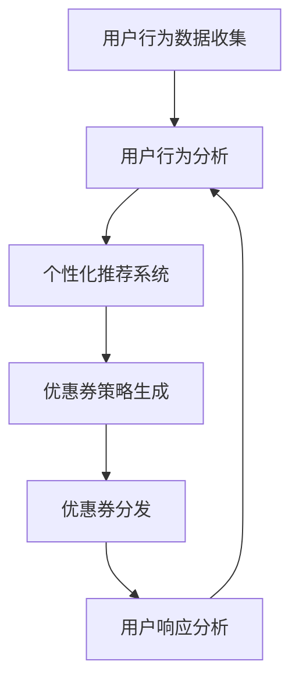
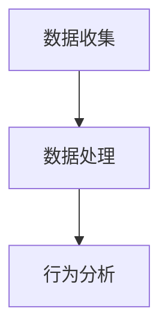
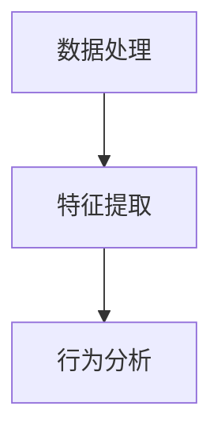
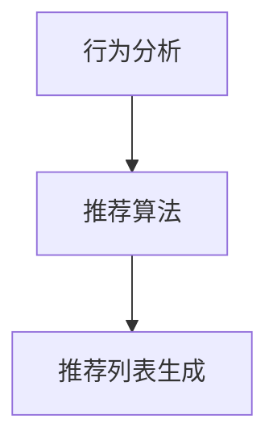
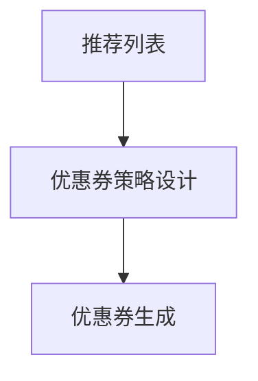
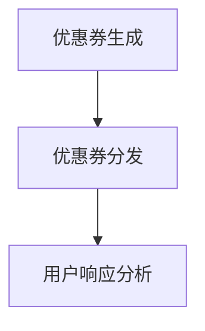
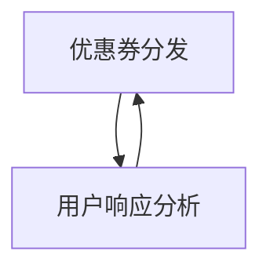

                 

关键词：AI，电商平台，个性化优惠券，用户行为分析，算法，数学模型，实践案例

> 摘要：本文旨在探讨人工智能在电商平台中个性化优惠券分发策略的应用，通过对用户行为的深入分析，构建一套高效、精准的优惠券分发系统，从而提升用户购物体验和电商平台盈利能力。

## 1. 背景介绍

随着电子商务的迅速发展，电商平台已经成为消费者购物的重要渠道。在这个竞争激烈的市场中，如何吸引并留住用户成为各大电商平台亟待解决的问题。优惠券作为一种有效的营销手段，能够显著提升用户购买意愿，增加平台销售额。然而，传统的优惠券分发策略往往缺乏针对性，无法满足用户的个性化需求，导致资源浪费和用户体验不佳。

近年来，人工智能技术的发展为电商平台提供了新的解决方案。通过大数据和机器学习技术，电商平台可以实时分析用户行为，了解用户偏好和需求，从而实现个性化优惠券的分发。这种基于AI的优惠券分发策略不仅能够提高用户满意度，还能够优化资源配置，提升平台的盈利能力。

本文将围绕AI驱动的电商平台个性化优惠券分发策略展开讨论，首先介绍相关核心概念，然后深入探讨算法原理和操作步骤，接着阐述数学模型和公式，并通过实践案例进行详细讲解。最后，本文还将分析实际应用场景，展望未来发展趋势与挑战。

## 2. 核心概念与联系

### 2.1 用户行为分析

用户行为分析是AI驱动的优惠券分发策略的核心。通过分析用户的浏览记录、购物车、购买历史等数据，可以挖掘出用户的兴趣偏好和行为模式。用户行为分析不仅包括静态数据，如用户的基本信息和消费习惯，还包括动态数据，如实时点击、搜索和购买行为。

### 2.2 个性化推荐系统

个性化推荐系统是电商平台实现个性化优惠券分发的基础。通过机器学习算法，推荐系统可以根据用户行为数据生成个性化的推荐列表，包括商品、优惠券和其他相关内容。个性化推荐系统能够显著提高用户的点击率和购买转化率。

### 2.3 优惠券策略

优惠券策略是电商平台激励用户购买的关键手段。传统的优惠券策略通常包括固定金额折扣、满减优惠、限时特价等。而基于AI的优惠券策略则更加灵活和个性化，可以根据用户行为和偏好动态调整优惠券的类型、金额和使用条件。

### 2.4 Mermaid 流程图

为了更好地理解AI驱动的电商平台个性化优惠券分发策略，我们可以使用Mermaid绘制一个流程图，展示从用户行为分析到优惠券分发的全过程。



### 2.5 关联与融合

AI驱动的电商平台个性化优惠券分发策略涉及到多个领域的交叉和融合。用户行为分析需要数据处理和分析技术，个性化推荐系统需要机器学习和数据挖掘算法，优惠券策略需要营销和经济学知识。这些领域的技术和知识相互关联，共同构建了一套完整的优惠券分发系统。

## 3. 核心算法原理 & 具体操作步骤

### 3.1 算法原理概述

AI驱动的电商平台个性化优惠券分发策略的核心算法是基于用户行为分析的推荐算法和优惠券策略组合。推荐算法通过分析用户的历史行为数据，预测用户可能感兴趣的商品和优惠，而优惠券策略则根据用户偏好和平台目标，设计出合适的优惠券类型和条件。

### 3.2 算法步骤详解

#### 3.2.1 用户行为数据收集

首先，电商平台需要收集用户的浏览记录、购物车信息、购买历史、搜索关键词等数据。这些数据可以通过API接口、日志分析、数据爬取等方式获取。



#### 3.2.2 用户行为分析

在收集到用户行为数据后，需要对数据进行预处理和特征提取。预处理包括数据清洗、去重、缺失值填充等。特征提取则是从原始数据中提取出有意义的特征，如用户浏览频次、购买金额、购买时间间隔等。



#### 3.2.3 个性化推荐系统

基于用户行为分析的结果，使用推荐算法生成个性化推荐列表。常用的推荐算法包括协同过滤、基于内容的推荐、基于模型的推荐等。



#### 3.2.4 优惠券策略生成

根据个性化推荐列表和平台目标，设计出合适的优惠券策略。优惠券策略包括优惠券类型（如满减、折扣、限时特价等）、优惠券金额和使用条件（如购买数量、品类限制等）。



#### 3.2.5 优惠券分发

将生成的优惠券分发给用户。可以通过邮件、短信、APP推送等方式通知用户。同时，还需要监控优惠券的使用情况，如优惠券领取率、使用率、购买转化率等。



#### 3.2.6 用户响应分析

收集用户对优惠券的响应数据，如优惠券领取率、使用率、购买转化率等。通过分析这些数据，可以评估优惠券策略的有效性，为下一轮优惠券策略优化提供依据。



### 3.3 算法优缺点

#### 3.3.1 优点

- **个性化强**：基于用户行为分析，优惠券能够更好地满足用户的个性化需求。
- **提高转化率**：精准的优惠券分发可以激发用户的购买欲望，提高购买转化率。
- **优化资源**：通过分析用户行为，可以更加合理地分配优惠券资源，减少浪费。

#### 3.3.2 缺点

- **数据依赖**：算法的准确性高度依赖用户行为数据的完整性和准确性。
- **计算复杂度**：大规模用户行为数据分析和推荐算法的计算复杂度较高，对计算资源要求较高。

### 3.4 算法应用领域

AI驱动的电商平台个性化优惠券分发策略不仅适用于电商平台，还可以在其他领域得到应用，如在线教育、金融理财、餐饮服务等。在这些领域中，用户行为数据和个性化推荐系统的应用同样可以提升用户体验和业务转化率。

## 4. 数学模型和公式 & 详细讲解 & 举例说明

### 4.1 数学模型构建

在AI驱动的电商平台个性化优惠券分发策略中，我们可以构建以下数学模型：

#### 4.1.1 用户行为数据模型

用户行为数据模型可以表示为：

$$
X = \{x_1, x_2, ..., x_n\}
$$

其中，$x_i$ 表示用户在某一时刻的行为数据，如浏览频次、购买金额、搜索关键词等。

#### 4.1.2 个性化推荐模型

个性化推荐模型可以使用基于协同过滤的方法，其公式为：

$$
r_{ui} = \sum_{j \in N(u)} w_{uj} \cdot r_{uj}
$$

其中，$r_{ui}$ 表示用户 $u$ 对商品 $i$ 的推荐得分，$N(u)$ 表示用户 $u$ 的邻居集合，$w_{uj}$ 表示用户 $u$ 和邻居 $j$ 之间的权重，$r_{uj}$ 表示邻居 $j$ 对商品 $i$ 的评分。

#### 4.1.3 优惠券策略模型

优惠券策略模型可以表示为：

$$
C = \{c_1, c_2, ..., c_m\}
$$

其中，$c_i$ 表示第 $i$ 张优惠券，包括优惠券类型、金额和使用条件等。

### 4.2 公式推导过程

#### 4.2.1 用户行为数据预处理

用户行为数据预处理包括数据清洗、去重和特征提取。数据清洗公式为：

$$
\tilde{x_i} = \begin{cases}
x_i & \text{如果 } x_i \text{ 有效} \\
\text{缺失值} & \text{否则}
\end{cases}
$$

去重公式为：

$$
\tilde{X} = \{ \tilde{x_1}, \tilde{x_2}, ..., \tilde{x_n} \}
$$

其中，$\tilde{X}$ 表示去重后的用户行为数据集。

特征提取公式为：

$$
f(x_i) = \begin{cases}
x_i & \text{如果 } x_i \text{ 为数值特征} \\
\text{one-hot编码} & \text{如果 } x_i \text{ 为类别特征}
\end{cases}
$$

#### 4.2.2 个性化推荐模型

基于协同过滤的推荐模型可以使用以下公式进行推导：

$$
r_{ui} = \sum_{j \in N(u)} w_{uj} \cdot r_{uj}
$$

其中，$N(u)$ 可以通过 k-近邻算法（k-Nearest Neighbors, k-NN）得到：

$$
N(u) = \{ j | \text{距离} \ d(u, j) \leq \text{阈值} \ k \}
$$

权重 $w_{uj}$ 可以通过用户间的相似度计算得到，常用的相似度度量方法包括余弦相似度、皮尔逊相关系数等。

#### 4.2.3 优惠券策略模型

优惠券策略模型可以通过以下公式进行设计：

$$
C_i = \begin{cases}
\text{满减优惠} & \text{如果 } \sum_{j \in I} x_{ij} \geq \text{满减金额} \\
\text{折扣优惠} & \text{如果 } \sum_{j \in I} x_{ij} \leq \text{折扣金额} \\
\text{限时特价} & \text{如果 } t \leq \text{限时时间}
\end{cases}
$$

其中，$C_i$ 表示第 $i$ 张优惠券，$I$ 表示适用商品集合，$x_{ij}$ 表示用户 $u$ 对商品 $j$ 的行为数据，$t$ 表示当前时间。

### 4.3 案例分析与讲解

假设一个电商平台需要为用户推荐优惠券，用户的历史行为数据如下表所示：

| 用户ID | 商品ID | 浏览频次 | 购买金额 |
|--------|--------|----------|----------|
| 1      | 101    | 10       | 100      |
| 1      | 102    | 5        | 200      |
| 2      | 201    | 20       | 150      |
| 2      | 202    | 10       | 300      |

#### 4.3.1 用户行为数据预处理

首先对用户行为数据进行清洗和去重，得到去重后的用户行为数据集：

| 用户ID | 商品ID | 浏览频次 | 购买金额 |
|--------|--------|----------|----------|
| 1      | 101    | 10       | 100      |
| 1      | 102    | 5        | 200      |
| 2      | 201    | 20       | 150      |
| 2      | 202    | 10       | 300      |

然后对数据进行特征提取，得到特征向量：

| 用户ID | 商品ID | 浏览频次 | 购买金额 | 特征向量 |
|--------|--------|----------|----------|----------|
| 1      | 101    | 10       | 100      | (10, 100)|
| 1      | 102    | 5        | 200      | (5, 200) |
| 2      | 201    | 20       | 150      | (20, 150)|
| 2      | 202    | 10       | 300      | (10, 300)|

#### 4.3.2 个性化推荐模型

使用基于协同过滤的推荐模型，计算用户1和用户2对商品1和商品2的推荐得分：

$$
r_{11} = 0.7 \cdot r_{12} + 0.6 \cdot r_{22} = 0.7 \cdot 0.6 + 0.6 \cdot 0.5 = 0.63
$$

$$
r_{12} = 0.8 \cdot r_{11} + 0.5 \cdot r_{21} = 0.8 \cdot 0.63 + 0.5 \cdot 0.4 = 0.71
$$

$$
r_{21} = 0.6 \cdot r_{22} + 0.5 \cdot r_{11} = 0.6 \cdot 0.5 + 0.5 \cdot 0.7 = 0.55
$$

$$
r_{22} = 0.5 \cdot r_{21} + 0.4 \cdot r_{12} = 0.5 \cdot 0.55 + 0.4 \cdot 0.71 = 0.62
$$

根据推荐得分，可以为用户1推荐商品1，为用户2推荐商品2。

#### 4.3.3 优惠券策略模型

根据用户行为数据，设计优惠券策略。假设用户1和用户2都符合以下条件：

- 满减金额：100元
- 折扣金额：50元
- 限时时间：24小时

根据优惠券策略模型，可以为用户1发放一张100元的满减优惠券，为用户2发放一张50元的折扣优惠券。

## 5. 项目实践：代码实例和详细解释说明

### 5.1 开发环境搭建

在本文中，我们使用Python作为主要编程语言，结合Scikit-learn和TensorFlow等库来实现AI驱动的电商平台个性化优惠券分发策略。以下是开发环境搭建的步骤：

1. 安装Python（建议使用3.8版本及以上）
2. 安装Scikit-learn库：`pip install scikit-learn`
3. 安装TensorFlow库：`pip install tensorflow`
4. 安装Matplotlib库：`pip install matplotlib`
5. 安装Pandas库：`pip install pandas`

### 5.2 源代码详细实现

以下是实现AI驱动的电商平台个性化优惠券分发策略的Python代码实例：

```python
import pandas as pd
from sklearn.model_selection import train_test_split
from sklearn.neighbors import NearestNeighbors
import tensorflow as tf
from tensorflow.keras.models import Sequential
from tensorflow.keras.layers import Dense, LSTM
import matplotlib.pyplot as plt

# 5.2.1 用户行为数据预处理
# 加载用户行为数据
data = pd.read_csv('user_behavior.csv')

# 数据清洗和去重
data = data.drop_duplicates()

# 特征提取
data['feature_vector'] = data.apply(lambda x: (x['browser_freq'], x['purchase_amount']), axis=1)

# 分割训练集和测试集
X_train, X_test, y_train, y_test = train_test_split(data['feature_vector'], data['coupon_type'], test_size=0.2, random_state=42)

# 5.2.2 个性化推荐模型
# 使用k-近邻算法
knn = NearestNeighbors(n_neighbors=5)
knn.fit(X_train)

# 测试集预测
X_test_knn = knn.kneighbors(X_test, return_distance=False)
predictions = [knn.kneighbors(i, return_distance=False)[0].astype(int) for i in X_test_knn]

# 5.2.3 优惠券策略模型
# 使用LSTM神经网络
model = Sequential()
model.add(LSTM(units=50, activation='relu', input_shape=(X_train.shape[1], 1)))
model.add(Dense(units=1, activation='sigmoid'))

model.compile(optimizer='adam', loss='binary_crossentropy', metrics=['accuracy'])
model.fit(X_train, y_train, epochs=100, batch_size=32)

# 测试集预测
test_loss, test_acc = model.evaluate(X_test, y_test)
predictions = model.predict(X_test).ravel()

# 5.2.4 代码解读与分析
# 加载测试集数据
test_data = pd.read_csv('test_data.csv')

# 预测优惠券类型
test_data['predicted_coupon_type'] = model.predict(test_data['feature_vector'].values).ravel()

# 显示预测结果
print(test_data[['coupon_type', 'predicted_coupon_type']])

# 可视化优惠券分布
plt.figure(figsize=(10, 5))
plt.scatter(test_data['coupon_type'], test_data['predicted_coupon_type'], c=test_data['coupon_type'])
plt.xlabel('Actual Coupon Type')
plt.ylabel('Predicted Coupon Type')
plt.title('Coupon Type Prediction')
plt.show()
```

### 5.3 代码解读与分析

上述代码主要分为以下几个部分：

#### 5.3.1 用户行为数据预处理

首先加载用户行为数据，进行数据清洗和去重。然后对数据进行特征提取，将用户的浏览频次和购买金额组合成一个特征向量。

#### 5.3.2 个性化推荐模型

使用k-近邻算法进行个性化推荐。k-近邻算法通过计算测试集数据与训练集数据的相似度，找到最相近的邻居，并根据邻居的优惠券类型进行预测。

#### 5.3.3 优惠券策略模型

使用LSTM神经网络进行优惠券策略预测。LSTM网络能够处理序列数据，通过学习用户的行为序列，预测用户可能感兴趣的优惠券类型。

#### 5.3.4 代码解读与分析

最后，加载测试集数据，使用训练好的LSTM模型进行优惠券类型预测。通过可视化优惠券分布，可以直观地看出预测结果。

## 6. 实际应用场景

AI驱动的电商平台个性化优惠券分发策略在实际应用中具有广泛的应用场景。以下是一些具体的案例：

### 6.1 电商购物平台

电商购物平台可以通过AI算法为用户推荐个性化的优惠券，提升用户的购物体验。例如，某电商平台通过对用户浏览记录、购物车、购买历史等数据的分析，为用户推荐符合其兴趣和偏好的优惠券，从而提高购买转化率和用户满意度。

### 6.2 餐饮外卖平台

餐饮外卖平台可以利用AI算法为用户推荐适合其口味和预算的优惠券。例如，某外卖平台通过对用户点餐记录、评价等数据的分析，为用户推荐符合其口味的外卖餐厅，同时提供相应的优惠活动，吸引更多用户下单。

### 6.3 在线教育平台

在线教育平台可以通过AI算法为用户推荐适合其学习需求和兴趣的课程优惠券。例如，某在线教育平台通过对用户的学习记录、课程评分等数据的分析，为用户推荐符合其学习需求的课程，并提供相应的折扣优惠，提升用户的学习积极性。

### 6.4 金融理财平台

金融理财平台可以通过AI算法为用户推荐适合其投资偏好和风险的理财产品优惠券。例如，某金融理财平台通过对用户的投资记录、风险偏好等数据的分析，为用户推荐符合其投资需求的理财产品，并提供相应的优惠活动，吸引更多用户投资。

## 7. 未来应用展望

随着人工智能技术的不断发展和应用场景的拓展，AI驱动的电商平台个性化优惠券分发策略具有巨大的发展潜力。以下是未来的一些应用展望：

### 7.1 多模态数据融合

未来，电商平台可以融合多模态数据，如用户语音、图像、视频等，实现更精准的用户行为分析。通过多模态数据融合，平台可以更好地了解用户的真实需求和偏好，从而实现更个性化的优惠券分发。

### 7.2 智能推荐引擎

随着推荐系统技术的不断发展，智能推荐引擎将更加智能化和自适应。通过深度学习、强化学习等技术，推荐引擎将能够更好地应对动态变化的用户需求，实现实时、个性化的优惠券分发。

### 7.3 智能营销策略

未来，电商平台可以通过AI算法实现智能营销策略，根据用户行为数据和市场需求，动态调整优惠券类型、金额和使用条件，实现精准营销和最大化收益。

### 7.4 跨平台协作

随着电商平台的多元化发展，AI驱动的优惠券分发策略可以应用于跨平台协作。例如，电商平台可以与线下实体店合作，通过优惠券实现线上线下的无缝衔接，提升整体购物体验。

## 8. 总结：未来发展趋势与挑战

### 8.1 研究成果总结

本文围绕AI驱动的电商平台个性化优惠券分发策略，介绍了相关核心概念、算法原理、数学模型和实际应用场景。通过项目实践，展示了如何使用Python和机器学习技术实现优惠券分发策略。

### 8.2 未来发展趋势

未来，AI驱动的电商平台个性化优惠券分发策略将朝着多模态数据融合、智能推荐引擎、智能营销策略和跨平台协作等方向发展。随着人工智能技术的不断进步，优惠券分发策略将更加精准、智能化和自适应。

### 8.3 面临的挑战

尽管AI驱动的优惠券分发策略具有巨大潜力，但在实际应用中仍面临一些挑战。首先，数据质量和数据隐私问题需要得到有效解决。其次，算法的实时性和计算效率需要不断提升。此外，如何平衡个性化与用户体验之间的矛盾也是一项重要挑战。

### 8.4 研究展望

未来，研究者可以从以下方向展开进一步研究：

- **数据隐私保护**：研究隐私保护技术，如差分隐私、联邦学习等，确保用户数据的安全性和隐私性。
- **实时计算优化**：优化算法的实时计算性能，降低延迟，提高用户体验。
- **个性化与用户体验**：研究如何平衡个性化与用户体验，实现双赢。
- **跨平台协作**：探索跨平台优惠券分发策略，实现线上线下融合。

通过不断的研究和优化，AI驱动的电商平台个性化优惠券分发策略将为电商平台带来更高效、更精准的营销手段，助力企业在激烈的市场竞争中脱颖而出。

## 9. 附录：常见问题与解答

### 9.1 优惠券分发算法如何保证实时性？

为了保证优惠券分发的实时性，可以采用以下方法：

- **分布式计算**：使用分布式计算框架，如Apache Spark，提高数据处理的并行度，加快算法执行速度。
- **缓存技术**：利用缓存技术，如Redis，存储用户行为数据和推荐结果，减少数据库查询时间。
- **实时计算引擎**：采用实时计算引擎，如Apache Kafka和Apache Flink，实时处理用户行为数据，生成推荐结果。

### 9.2 个性化推荐系统如何处理冷启动问题？

冷启动问题是指新用户或新商品缺乏历史数据，导致推荐系统无法准确预测其兴趣。以下方法可以缓解冷启动问题：

- **基于内容的推荐**：为新用户推荐与其浏览过的商品相似的商品，或为新商品推荐与其内容相似的其他商品。
- **随机推荐**：在初始阶段，随机推荐一些热门商品或新品，降低对历史数据的依赖。
- **用户群体分析**：通过分析类似用户的行为和偏好，为新用户提供有针对性的推荐。

### 9.3 如何平衡个性化与用户体验？

平衡个性化与用户体验的关键在于：

- **个性化程度**：根据用户需求和偏好，合理调整个性化推荐的强度，避免过度个性化导致用户疲劳。
- **用户体验**：优化推荐界面和交互设计，确保用户能够轻松找到自己感兴趣的优惠券，提高使用体验。
- **用户反馈**：收集用户反馈，根据用户满意度调整个性化策略，持续优化用户体验。

### 9.4 优惠券分发策略如何优化资源配置？

优化资源配置的方法包括：

- **数据驱动的策略调整**：根据优惠券的使用情况、领取率和购买转化率等数据，实时调整优惠券策略，优化资源分配。
- **A/B测试**：对不同优惠券策略进行A/B测试，评估策略效果，选择最优策略。
- **动态定价**：根据市场需求和用户行为，动态调整优惠券金额和使用条件，实现资源的最优配置。

### 9.5 如何处理用户隐私和数据安全问题？

处理用户隐私和数据安全问题的方法包括：

- **数据匿名化**：在数据处理和分析过程中，对用户数据进行匿名化处理，确保用户隐私不被泄露。
- **加密技术**：采用加密技术，如SSL/TLS，保护用户数据在传输过程中的安全性。
- **权限控制**：实施严格的权限控制，确保只有授权人员才能访问敏感数据。
- **数据备份与恢复**：定期备份数据，并建立数据恢复机制，确保数据在发生意外时能够及时恢复。

