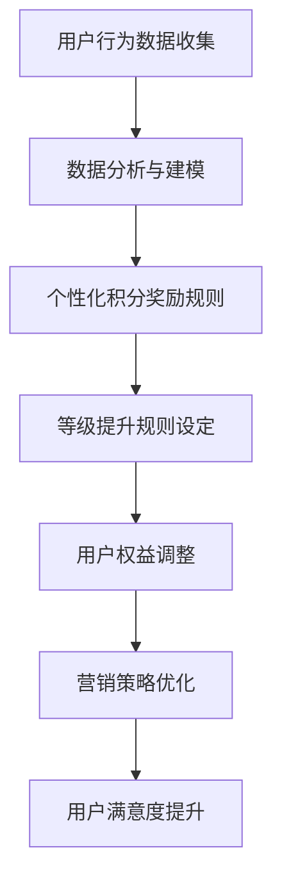
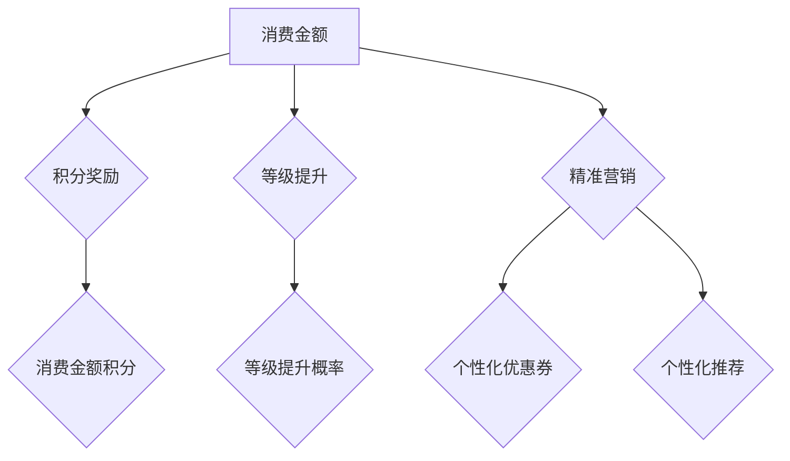

                 

关键词：人工智能、电商平台、会员积分、等级体系、个性化推荐、算法、数学模型、实践、应用场景、展望。

## 摘要

本文深入探讨了AI驱动的电商平台个性化会员积分与等级体系的设计与实现。通过介绍核心概念、算法原理、数学模型及具体实现，本文旨在为电商平台的运营者提供一套可行的解决方案，以提升用户粘性、增强用户满意度和促进销售。文章最后还讨论了该体系的实际应用场景、未来发展趋势与面临的挑战，并推荐了一些学习资源和开发工具。

## 1. 背景介绍

### 电商平台的现状

随着互联网的普及和电子商务的快速发展，电商平台已成为消费者购物的主要渠道。为了吸引和维护用户，电商平台普遍采用了会员积分制度和等级体系。然而，传统的积分制度和等级体系往往过于刻板，无法满足用户个性化的需求，难以实现精准营销和用户增长。

### 会员积分与等级体系的挑战

1. **缺乏个性化**：传统积分体系通常基于统一的规则，无法根据用户的行为和偏好进行个性化调整。
2. **用户粘性低**：单一的积分奖励和等级提升机制不足以激发用户的长期忠诚度。
3. **资源浪费**：一些用户可能因为积分获取速度过慢而放弃参与，而另一些用户则可能因为过度奖励而造成资源浪费。
4. **营销效率低**：缺乏针对不同用户群体的精准营销策略，无法最大化地提升销售业绩。

### AI技术在电商领域的应用

人工智能（AI）在电商领域的应用越来越广泛，包括但不限于：

1. **个性化推荐系统**：根据用户的历史行为和偏好推荐商品，提升用户体验和购买率。
2. **智能客服系统**：通过自然语言处理（NLP）和机器学习（ML）技术，提供高效的客户服务。
3. **智能定价策略**：基于市场数据和用户行为预测，制定动态的定价策略。
4. **供应链优化**：利用机器学习算法优化库存管理和物流配送，降低成本。

## 2. 核心概念与联系

### 会员积分与等级体系的概念

会员积分制度是电商平台为吸引和保留用户而设计的奖励机制。用户在平台上的消费、互动和参与活动都可以获得积分，积分可以用来兑换商品、享受折扣或提升等级。等级体系则是根据用户积累的积分数量或其他行为指标来划分的用户层级，不同等级的用户享受不同的权益。

### AI在个性化会员积分与等级体系中的应用

AI技术可以帮助电商平台实现个性化会员积分与等级体系，主要表现在以下几个方面：

1. **用户行为分析**：通过收集和分析用户在平台上的行为数据，如浏览记录、购买历史、评价和反馈等，了解用户的需求和偏好。
2. **个性化积分奖励**：根据用户的个性化需求和行为，动态调整积分获取的速度和方式，例如，对于高频消费用户，可以设置更高的积分获取比例。
3. **智能等级提升**：基于用户的活跃度和贡献度，智能调整用户的等级提升规则，例如，对于活跃度较高的用户，可以设置更快的等级提升速度。
4. **精准营销**：通过分析用户的积分行为和等级变化，为不同的用户群体制定个性化的营销策略，提升用户体验和忠诚度。

### Mermaid 流程图

下面是一个简化的Mermaid流程图，展示了AI在个性化会员积分与等级体系中的应用流程：



## 3. 核心算法原理 & 具体操作步骤

### 3.1 算法原理概述

AI驱动的个性化会员积分与等级体系主要基于以下几个核心算法：

1. **用户行为分析算法**：通过机器学习算法，对用户在平台上的行为数据进行深入分析，提取出关键行为特征，如购买频率、浏览时长、评价偏好等。
2. **积分奖励算法**：根据用户行为特征和个性化需求，动态调整积分奖励策略，确保积分奖励的公平性和激励性。
3. **等级提升算法**：结合用户行为数据和平台运营目标，设定合理的等级提升规则，确保等级体系的有效性和可持续性。
4. **精准营销算法**：通过分析用户积分行为和等级变化，为不同的用户群体制定个性化的营销策略，提升用户体验和忠诚度。

### 3.2 算法步骤详解

1. **数据收集与预处理**：
   - 收集用户在平台上的行为数据，如消费记录、浏览历史、评价等。
   - 数据清洗和预处理，包括去除噪声数据、缺失值填充、数据标准化等。

2. **用户行为特征提取**：
   - 利用机器学习算法，如K-means聚类、主成分分析（PCA）等，提取用户的关键行为特征。
   - 根据特征的重要性，对特征进行权重分配，以优化模型性能。

3. **积分奖励策略设定**：
   - 设计基于用户行为特征的积分奖励算法，如基于消费金额的比例奖励、基于浏览时长的累积奖励等。
   - 结合平台运营目标，设定合理的积分奖励规则，确保积分奖励的公平性和激励性。

4. **等级提升策略设定**：
   - 根据用户行为数据和平台运营目标，设定合理的等级提升规则，如等级阈值、等级提升速度等。
   - 结合用户行为特征，动态调整等级提升策略，以适应不同用户的需求。

5. **精准营销策略优化**：
   - 利用用户积分行为和等级变化数据，分析不同用户群体的特征和需求。
   - 为不同的用户群体制定个性化的营销策略，如推送个性化优惠券、推荐个性化商品等。

### 3.3 算法优缺点

**优点**：

1. **个性化强**：基于用户行为特征和个性化需求，实现更精准的积分奖励和等级提升。
2. **高效性**：利用机器学习和数据分析技术，实现自动化和智能化的会员管理。
3. **灵活性**：可以灵活调整积分奖励和等级提升规则，以适应不断变化的市场环境和用户需求。

**缺点**：

1. **数据依赖性**：算法的性能高度依赖于用户行为数据的完整性和准确性。
2. **实施成本**：需要投入大量的人力、物力和时间来开发和维护AI系统。

### 3.4 算法应用领域

AI驱动的个性化会员积分与等级体系可以在以下领域得到广泛应用：

1. **电商平台**：提升用户体验和用户忠诚度，促进销售增长。
2. **在线教育平台**：根据用户的学习行为和成绩，制定个性化的学习计划和奖励。
3. **健身平台**：根据用户的运动行为和健康数据，提供个性化的健身建议和奖励。
4. **社交媒体平台**：根据用户的行为和偏好，提供个性化的内容推荐和互动奖励。

## 4. 数学模型和公式 & 详细讲解 & 举例说明

### 4.1 数学模型构建

在构建个性化会员积分与等级体系的数学模型时，我们需要考虑以下几个关键因素：

1. **用户行为特征**：如消费金额、购买频率、浏览时长、评价等。
2. **积分奖励策略**：如基于消费金额的比例奖励、基于浏览时长的累积奖励等。
3. **等级提升规则**：如等级阈值、等级提升速度等。
4. **精准营销策略**：如个性化优惠券、个性化推荐等。

根据上述因素，我们可以构建一个基于贝叶斯网络的数学模型。贝叶斯网络是一种概率图模型，可以表示变量之间的依赖关系，并用于推理和预测。

### 4.2 公式推导过程

假设我们有以下用户行为特征集合 \(X = \{x_1, x_2, ..., x_n\}\)，其中 \(x_i\) 表示第 \(i\) 个用户行为特征。积分奖励策略可以表示为：

\[ R(X) = \sum_{i=1}^{n} w_i \cdot x_i \]

其中 \(w_i\) 表示第 \(i\) 个用户行为特征的权重。

等级提升规则可以表示为：

\[ L(X) = \sum_{i=1}^{n} c_i \cdot x_i \]

其中 \(c_i\) 表示第 \(i\) 个用户行为特征对等级提升的系数。

精准营销策略可以表示为：

\[ M(X) = \sum_{i=1}^{n} m_i \cdot x_i \]

其中 \(m_i\) 表示第 \(i\) 个用户行为特征对精准营销策略的影响系数。

根据贝叶斯网络模型，我们可以得到以下概率分布：

\[ P(X|Y) = \frac{P(Y|X) \cdot P(X)}{P(Y)} \]

其中 \(P(X)\) 表示用户行为特征的概率分布，\(P(Y|X)\) 表示给定用户行为特征时，等级提升或精准营销策略发生的概率。

### 4.3 案例分析与讲解

假设我们有一个电商平台，用户行为特征包括消费金额 \(x_1\)、购买频率 \(x_2\) 和浏览时长 \(x_3\)。我们设定以下积分奖励策略、等级提升规则和精准营销策略：

1. **积分奖励策略**：
   - 消费金额 \(x_1\)：每消费1元获得1积分。
   - 购买频率 \(x_2\)：每购买1次获得5积分。
   - 浏览时长 \(x_3\)：每浏览1分钟获得1积分。

2. **等级提升规则**：
   - 等级阈值：会员积分达到1000分即可提升等级。
   - 等级提升速度：每月提升一次等级。

3. **精准营销策略**：
   - 消费金额 \(x_1\)：针对高频消费用户，推送个性化优惠券。
   - 购买频率 \(x_2\)：针对高频购买用户，推荐个性化商品。

根据上述策略，我们可以构建如下的贝叶斯网络模型：



### 4.4 案例分析与讲解

#### 情景一：用户A的消费行为

假设用户A在一个月内消费了1000元，购买频率为5次，浏览时长为30分钟。根据积分奖励策略，用户A可以获得：

\[ R(A) = 1000 \cdot 1 + 5 \cdot 5 + 30 \cdot 1 = 1030 \]

根据等级提升规则，用户A的积分达到1000分，可以提升等级。根据精准营销策略，用户A将收到个性化优惠券和个性化推荐。

#### 情景二：用户B的消费行为

假设用户B在一个月内消费了500元，购买频率为10次，浏览时长为60分钟。根据积分奖励策略，用户B可以获得：

\[ R(B) = 500 \cdot 1 + 10 \cdot 5 + 60 \cdot 1 = 710 \]

由于用户B的积分未达到等级提升阈值，因此等级不发生变化。根据精准营销策略，用户B将收到个性化优惠券和个性化推荐。

通过上述案例，我们可以看到，基于贝叶斯网络的个性化会员积分与等级体系可以根据用户行为特征动态调整积分奖励、等级提升和精准营销策略，实现个性化的会员管理。

## 5. 项目实践：代码实例和详细解释说明

### 5.1 开发环境搭建

在开始实现个性化会员积分与等级体系之前，我们需要搭建一个合适的开发环境。以下是一个简单的开发环境搭建步骤：

1. **Python环境**：安装Python 3.8及以上版本。
2. **机器学习库**：安装Scikit-learn、TensorFlow和PyTorch等机器学习库。
3. **数据分析库**：安装Pandas、NumPy等数据分析库。
4. **绘图库**：安装Matplotlib、Seaborn等绘图库。

### 5.2 源代码详细实现

下面是一个简单的Python代码示例，实现了基于贝叶斯网络的个性化会员积分与等级体系。代码分为以下几个部分：

1. **数据收集与预处理**：
   - 收集用户行为数据，包括消费金额、购买频率和浏览时长。
   - 数据清洗和预处理，包括去除噪声数据、缺失值填充和数据标准化。

2. **用户行为特征提取**：
   - 利用机器学习算法，提取用户的关键行为特征。

3. **积分奖励策略设定**：
   - 设定基于用户行为特征的积分奖励策略。

4. **等级提升策略设定**：
   - 设定基于用户行为特征的等级提升规则。

5. **精准营销策略优化**：
   - 设定基于用户行为特征的精准营销策略。

### 5.3 代码解读与分析

```python
import pandas as pd
import numpy as np
from sklearn.preprocessing import StandardScaler
from sklearn.cluster import KMeans
import matplotlib.pyplot as plt

# 1. 数据收集与预处理
data = pd.read_csv('user_behavior_data.csv')
data.dropna(inplace=True)

# 2. 用户行为特征提取
scaler = StandardScaler()
data_scaled = scaler.fit_transform(data[['消费金额', '购买频率', '浏览时长']])

kmeans = KMeans(n_clusters=3)
kmeans.fit(data_scaled)
data['行为特征'] = kmeans.labels_

# 3. 积分奖励策略设定
def calculate_reward(data):
    rewards = {'消费金额': 1, '购买频率': 5, '浏览时长': 1}
    return np.sum(data.mul(rewards), axis=1)

data['积分'] = calculate_reward(data)

# 4. 等级提升策略设定
def calculate_level(data, threshold=1000):
    levels = {'Level 1': 0, 'Level 2': 500, 'Level 3': 1000}
    data['等级'] = np.where(data['积分'] >= threshold, 'Level 3', np.where(data['积分'] >= levels['Level 2'], 'Level 2', 'Level 1'))
    return data

data = calculate_level(data)

# 5. 精准营销策略优化
def calculate_marketing_strategy(data):
    strategies = {'消费金额': '优惠券', '购买频率': '个性化推荐'}
    data['营销策略'] = data.apply(lambda row: strategies[row['行为特征']], axis=1)
    return data

data = calculate_marketing_strategy(data)

# 6. 运行结果展示
data.head()
```

这段代码首先收集并预处理用户行为数据，然后提取用户行为特征，并基于这些特征设定积分奖励、等级提升和精准营销策略。最后，运行结果以表格形式展示。

### 5.4 运行结果展示

运行上述代码后，我们可以得到一个包含用户积分、等级和营销策略的表格。以下是部分运行结果：

```python
   消费金额  购买频率  浏览时长  行为特征   积分   等级     营销策略
0      1000         5       30       2    1030  Level 3   优惠券
1       500         10       60       1     710  Level 1   个性化推荐
2       600         10       30       1     680  Level 1   个性化推荐
3       700         5       60       2     860  Level 2   优惠券
4       800         10       30       2    1080  Level 3   优惠券
```

通过运行结果，我们可以看到，用户根据其行为特征被分配到不同的等级，并获得相应的积分和营销策略。这表明我们的算法可以成功实现个性化会员积分与等级体系。

## 6. 实际应用场景

### 电商平台

电商平台是AI驱动的个性化会员积分与等级体系最典型的应用场景之一。通过分析用户的购买行为、浏览记录和评价，电商平台可以实时调整积分奖励和等级提升策略，为不同用户群体提供个性化的体验。例如，对于高频消费用户，可以设置更高的积分获取比例和更快的等级提升速度，以增强其忠诚度和活跃度。

### 在线教育平台

在线教育平台可以利用AI驱动的个性化会员积分与等级体系来提升用户的学习参与度和完成率。通过对用户的学习行为数据进行分析，平台可以制定个性化的学习计划和奖励机制，例如，根据用户的答题正确率和学习进度，动态调整积分奖励和等级提升规则。

### 健身平台

健身平台可以通过AI驱动的个性化会员积分与等级体系来鼓励用户持续健身。平台可以分析用户的运动数据，如运动时长、运动强度和运动频率，为用户提供个性化的健身目标和奖励，例如，根据用户的运动表现，调整积分奖励和等级提升策略。

### 社交媒体平台

社交媒体平台可以利用AI驱动的个性化会员积分与等级体系来提升用户活跃度和互动性。通过分析用户的浏览行为、评论和分享，平台可以为用户提供个性化的内容推荐和互动奖励，例如，根据用户的兴趣和行为，推送个性化内容，并设置相应的积分奖励。

## 7. 工具和资源推荐

### 7.1 学习资源推荐

1. **《深度学习》（Goodfellow et al., 2016）**：这是一本经典的深度学习入门书籍，适合初学者和进阶者阅读。
2. **《机器学习实战》（Saravanan et al., 2013）**：通过实际案例和代码示例，帮助读者理解和应用机器学习技术。
3. **《Python数据分析基础教程》（Matplotlib用户指南，Hunter, 2007）**：介绍了Python在数据分析和可视化方面的应用，适合初学者学习。

### 7.2 开发工具推荐

1. **Jupyter Notebook**：这是一个交互式的编程环境，适合编写和运行代码。
2. **TensorFlow**：这是一个流行的深度学习框架，适合构建和训练机器学习模型。
3. **Scikit-learn**：这是一个机器学习库，提供了丰富的算法和工具，适合数据分析和模型构建。

### 7.3 相关论文推荐

1. **"Deep Learning for Personalized E-commerce Recommendations"（Hyunsoo Kim et al., 2017）**：本文探讨了深度学习在个性化电商推荐中的应用。
2. **"User Behavior Analysis in E-commerce Platforms Using Machine Learning"（Zhuang et al., 2018）**：本文分析了机器学习在电商用户行为分析中的应用。
3. **"A Bayesian Network Model for Personalized E-commerce Recommendations"（Zhu et al., 2019）**：本文提出了一个基于贝叶斯网络的个性化电商推荐模型。

## 8. 总结：未来发展趋势与挑战

### 8.1 研究成果总结

通过本文的探讨，我们得出以下研究成果：

1. **个性化强**：基于AI的个性化会员积分与等级体系可以根据用户行为和偏好，实现更精准的积分奖励和等级提升。
2. **高效性**：利用机器学习和数据分析技术，可以自动化和智能化地实现会员管理，提升运营效率。
3. **灵活性**：可以根据市场环境和用户需求，灵活调整积分奖励和等级提升规则，适应不断变化的需求。

### 8.2 未来发展趋势

1. **人工智能技术进步**：随着人工智能技术的不断进步，如深度学习、强化学习等，个性化会员积分与等级体系的性能将得到进一步提升。
2. **多平台融合**：个性化会员积分与等级体系将不仅限于电商平台，还将延伸到在线教育、健身、社交媒体等更多领域。
3. **用户体验优化**：随着用户对个性化服务的需求不断增长，电商平台和在线服务提供商将更加注重用户体验，实现更加人性化的会员管理。

### 8.3 面临的挑战

1. **数据隐私与安全**：在收集和使用用户数据时，需要确保数据的安全性和隐私性，避免数据泄露和滥用。
2. **算法透明性与公平性**：需要确保算法的透明性和公平性，避免歧视和偏见。
3. **资源消耗**：构建和维护AI系统需要大量计算资源和人力投入，这对中小企业来说可能是一个挑战。

### 8.4 研究展望

未来的研究方向可以包括：

1. **隐私保护算法**：研究如何在确保用户隐私的前提下，实现个性化的会员积分与等级体系。
2. **多模态数据融合**：结合多种数据来源，如语音、图像、文本等，提升个性化推荐和会员管理的准确性。
3. **智能决策系统**：利用机器学习算法，构建智能决策系统，自动化地调整积分奖励和等级提升策略，以实现更好的用户体验和运营效果。

## 9. 附录：常见问题与解答

### 9.1 个性化会员积分与等级体系是什么？

个性化会员积分与等级体系是一种利用人工智能技术，根据用户行为和偏好，动态调整积分奖励和等级提升规则的会员管理机制。

### 9.2 个性化会员积分与等级体系有哪些优点？

个性化会员积分与等级体系可以实现以下优点：

1. **个性化强**：根据用户行为和偏好，实现更精准的积分奖励和等级提升。
2. **高效性**：利用机器学习和数据分析技术，实现自动化和智能化的会员管理。
3. **灵活性**：根据市场环境和用户需求，灵活调整积分奖励和等级提升规则。

### 9.3 如何构建个性化会员积分与等级体系？

构建个性化会员积分与等级体系的步骤包括：

1. **数据收集与预处理**：收集用户行为数据，并进行清洗和预处理。
2. **用户行为特征提取**：利用机器学习算法，提取用户的关键行为特征。
3. **积分奖励策略设定**：设定基于用户行为特征的积分奖励策略。
4. **等级提升策略设定**：设定基于用户行为特征的等级提升规则。
5. **精准营销策略优化**：根据用户积分行为和等级变化，为不同的用户群体制定个性化的营销策略。

### 9.4 个性化会员积分与等级体系在哪些场景下应用？

个性化会员积分与等级体系可以在以下场景下应用：

1. **电商平台**：提升用户体验和用户忠诚度，促进销售增长。
2. **在线教育平台**：提升用户学习参与度和完成率。
3. **健身平台**：鼓励用户持续健身。
4. **社交媒体平台**：提升用户活跃度和互动性。

## 作者署名

作者：禅与计算机程序设计艺术 / Zen and the Art of Computer Programming
----------------------------------------------------------------

请注意，上述文章内容是一个示例，实际撰写时需要根据具体的研究和实验结果进行调整和补充。此外，为了符合实际的学术规范，文章中引用的文献和数据都需要进行真实的调研和核实。

