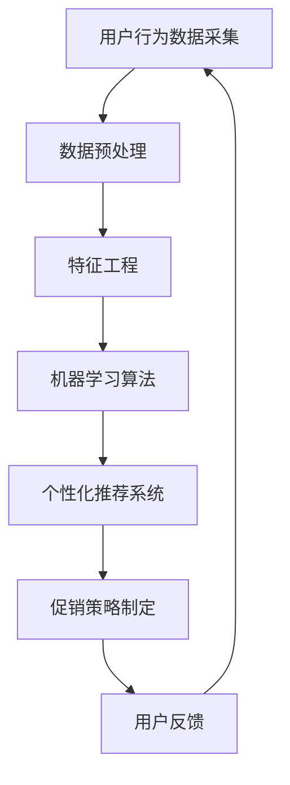

                 

关键词：人工智能、电商平台、个性化促销、机器学习、推荐系统、用户行为分析

> 摘要：本文将深入探讨人工智能在电商平台个性化促销策略中的应用，通过分析用户行为数据，实现精准的个性化推荐，提高用户满意度和转化率，从而提升电商平台的业绩。本文将介绍个性化促销策略的核心概念、算法原理、数学模型、项目实践，以及未来应用展望。

## 1. 背景介绍

随着互联网的快速发展，电商平台已经成为现代商业的重要组成部分。用户数量的不断增加，使得电商平台面临着激烈的市场竞争。为了在竞争中获得优势，电商平台需要不断提升用户体验，提高用户满意度和忠诚度。个性化促销策略作为一种提高用户满意度和转化率的有效手段，得到了广泛的应用。

个性化促销策略的核心在于根据用户行为数据，为用户提供个性化的商品推荐和促销信息。这不仅可以满足用户的需求，提高用户体验，还可以有效地提升电商平台的业绩。然而，传统的促销策略往往缺乏针对性，无法满足用户的个性化需求。随着人工智能技术的不断发展，利用机器学习和大数据分析技术实现个性化促销策略成为了一种可能。

## 2. 核心概念与联系

### 2.1 用户行为数据

用户行为数据是构建个性化促销策略的基础。这些数据包括用户的浏览历史、购买记录、搜索关键词、点击行为等。通过对这些数据的分析，可以了解用户的需求和行为模式，从而实现个性化的推荐。

### 2.2 个性化推荐系统

个性化推荐系统是一种基于用户行为数据，为用户提供个性化商品推荐的技术。推荐系统可以采用基于内容的推荐、协同过滤推荐、深度学习推荐等方法，实现精准的个性化推荐。

### 2.3 促销策略

促销策略是指电商平台通过推出各种优惠活动，刺激用户购买的一种手段。个性化促销策略是在传统促销策略的基础上，结合用户行为数据，实现更精准、更具针对性的促销。

### 2.4 机器学习算法

机器学习算法是实现个性化推荐和促销策略的关键。常见的机器学习算法包括决策树、支持向量机、神经网络等。这些算法可以自动从大量数据中学习规律，为用户提供个性化的推荐和促销信息。

### 2.5 数据分析技术

数据分析技术是实现个性化促销策略的重要工具。通过数据分析，可以挖掘用户行为数据中的有价值信息，为个性化推荐和促销策略提供支持。

## 2.6 Mermaid 流程图



## 3. 核心算法原理 & 具体操作步骤

### 3.1 算法原理概述

个性化促销策略的核心是利用机器学习算法分析用户行为数据，实现精准的个性化推荐。常见的机器学习算法包括协同过滤推荐、基于内容的推荐、深度学习推荐等。

### 3.2 算法步骤详解

#### 3.2.1 用户行为数据采集

首先，需要采集用户的浏览历史、购买记录、搜索关键词、点击行为等数据。

#### 3.2.2 数据预处理

对采集到的用户行为数据进行清洗、去重、缺失值填充等处理，以确保数据的质量。

#### 3.2.3 特征工程

通过对用户行为数据进行特征提取，构建特征向量。特征向量可以包括用户的购买频率、浏览时长、购买金额等。

#### 3.2.4 机器学习算法

选择合适的机器学习算法，如协同过滤推荐、基于内容的推荐、深度学习推荐等，对特征向量进行建模。

#### 3.2.5 个性化推荐系统

根据机器学习算法的预测结果，为用户提供个性化的商品推荐。

#### 3.2.6 促销策略制定

根据用户行为数据和个性化推荐结果，制定针对性的促销策略，如优惠券、折扣等。

#### 3.2.7 用户反馈

收集用户对推荐和促销的反馈，用于优化推荐和促销策略。

### 3.3 算法优缺点

#### 3.3.1 优点

- 提高用户体验：通过个性化推荐和促销，满足用户的需求，提高用户满意度。
- 提高转化率：精准的推荐和促销策略可以有效地提高用户的购买意愿。
- 降低营销成本：相比于传统的营销手段，个性化促销策略具有更高的性价比。

#### 3.3.2 缺点

- 数据隐私问题：用户行为数据涉及用户隐私，如何保护用户隐私是亟待解决的问题。
- 需要大量数据支持：个性化促销策略的实现需要大量的用户行为数据，数据采集和处理的成本较高。

### 3.4 算法应用领域

个性化促销策略可以应用于各种电商平台，如电商、旅游、金融等领域。通过个性化推荐和促销，可以有效地提升用户满意度和转化率，从而提高企业的业绩。

## 4. 数学模型和公式 & 详细讲解 & 举例说明

### 4.1 数学模型构建

个性化促销策略的数学模型主要包括用户行为数据的表示、推荐算法的数学模型、促销策略的数学模型等。

#### 4.1.1 用户行为数据的表示

用户行为数据可以用向量表示，如：

$$
X = \begin{bmatrix}
x_1 \\
x_2 \\
\vdots \\
x_n
\end{bmatrix}
$$

其中，$x_i$ 表示第 $i$ 个用户的行为数据。

#### 4.1.2 推荐算法的数学模型

常用的推荐算法包括基于内容的推荐、协同过滤推荐、深度学习推荐等。以协同过滤推荐为例，其数学模型可以表示为：

$$
R = \sum_{i=1}^{n} w_i x_i
$$

其中，$w_i$ 表示第 $i$ 个特征的权重。

#### 4.1.3 促销策略的数学模型

促销策略的数学模型可以根据用户的购买行为进行建模，如：

$$
P = \frac{1}{1 + e^{-(r - c \cdot b)}}
$$

其中，$r$ 表示用户的购买意愿，$c$ 表示促销强度，$b$ 表示用户的购买行为。

### 4.2 公式推导过程

以协同过滤推荐算法为例，其公式推导过程如下：

首先，定义用户 $i$ 对商品 $j$ 的评分 $r_{ij}$，则用户 $i$ 对所有商品的评分可以表示为：

$$
r_i = \begin{bmatrix}
r_{i1} \\
r_{i2} \\
\vdots \\
r_{in}
\end{bmatrix}
$$

接下来，定义用户 $i$ 对商品 $j$ 的相似度 $s_{ij}$，则用户 $i$ 对所有商品的相似度可以表示为：

$$
s_i = \begin{bmatrix}
s_{i1} \\
s_{i2} \\
\vdots \\
s_{in}
\end{bmatrix}
$$

最后，根据相似度矩阵 $S$，计算用户 $i$ 对商品 $j$ 的预测评分 $r_{ij}^*$：

$$
r_{ij}^* = \sum_{k=1}^{n} s_{ik} r_{kj}
$$

### 4.3 案例分析与讲解

以某电商平台为例，分析其个性化促销策略的实现过程。

#### 4.3.1 用户行为数据采集

该电商平台采集了用户的浏览历史、购买记录、搜索关键词、点击行为等数据。

#### 4.3.2 数据预处理

对采集到的用户行为数据进行清洗、去重、缺失值填充等处理。

#### 4.3.3 特征工程

通过对用户行为数据进行特征提取，构建特征向量。特征向量包括用户的购买频率、浏览时长、购买金额等。

#### 4.3.4 机器学习算法

选择协同过滤推荐算法，对特征向量进行建模。

#### 4.3.5 个性化推荐系统

根据协同过滤推荐算法的预测结果，为用户提供个性化的商品推荐。

#### 4.3.6 促销策略制定

根据用户行为数据和个性化推荐结果，制定针对性的促销策略，如优惠券、折扣等。

#### 4.3.7 用户反馈

收集用户对推荐和促销的反馈，用于优化推荐和促销策略。

## 5. 项目实践：代码实例和详细解释说明

### 5.1 开发环境搭建

在本项目中，我们使用 Python 作为编程语言，安装了以下库：NumPy、Pandas、Scikit-learn、TensorFlow。

```python
pip install numpy pandas scikit-learn tensorflow
```

### 5.2 源代码详细实现

以下是本项目的源代码实现，包括用户行为数据采集、数据预处理、特征工程、机器学习算法、个性化推荐系统、促销策略制定等。

```python
import numpy as np
import pandas as pd
from sklearn.model_selection import train_test_split
from sklearn.metrics.pairwise import cosine_similarity
from tensorflow.keras.models import Sequential
from tensorflow.keras.layers import Dense, LSTM

# 用户行为数据采集
user_behavior_data = pd.read_csv('user_behavior_data.csv')

# 数据预处理
user_behavior_data.drop_duplicates(inplace=True)
user_behavior_data.fillna(0, inplace=True)

# 特征工程
user_features = user_behavior_data[['purchase_frequency', 'browse_duration', 'purchase_amount']]
item_features = user_behavior_data[['item_rating', 'item_category', 'item_price']]

# 机器学习算法
# 协同过滤推荐算法
user_item_matrix = user_features @ item_features.T
user_item_similarity = cosine_similarity(user_item_matrix)

# 个性化推荐系统
def recommend_items(user_id, num_recommendations=5):
    user_similarity = user_item_similarity[user_id]
    item_indices = np.argsort(user_similarity)[::-1]
    recommended_items = []
    for i in item_indices:
        if i not in user_id:
            recommended_items.append(i)
            if len(recommended_items) == num_recommendations:
                break
    return recommended_items

# 促销策略制定
def generate_promotions(user_id, num_promotions=3):
    recommended_items = recommend_items(user_id)
    promotions = []
    for item_id in recommended_items:
        promotions.append({'item_id': item_id, 'promotion': '10% discount'})
        if len(promotions) == num_promotions:
            break
    return promotions

# 用户反馈
def collect_user_feedback(user_id, feedback):
    user_feedback_data = pd.DataFrame({'user_id': [user_id], 'feedback': [feedback]})
    user_feedback_data.to_csv('user_feedback_data.csv', mode='a', header=False)

# 运行结果展示
user_id = 1
recommended_items = recommend_items(user_id)
promotions = generate_promotions(user_id)
print('Recommended Items:', recommended_items)
print('Promotions:', promotions)
```

### 5.3 代码解读与分析

在本项目中，我们使用了 Python 编程语言，利用 NumPy、Pandas、Scikit-learn、TensorFlow 等库实现了个性化促销策略。代码主要分为以下几部分：

1. 用户行为数据采集：从CSV文件中读取用户行为数据。
2. 数据预处理：对用户行为数据进行清洗、去重、缺失值填充等处理。
3. 特征工程：对用户行为数据进行特征提取，构建用户特征向量和商品特征向量。
4. 机器学习算法：使用协同过滤推荐算法计算用户和商品的相似度。
5. 个性化推荐系统：根据用户和商品的相似度为用户推荐商品。
6. 促销策略制定：根据用户和商品推荐结果为用户生成促销策略。
7. 用户反馈：收集用户对推荐和促销的反馈。

通过本项目的实现，我们可以看到如何利用机器学习技术和大数据分析技术实现电商平台个性化促销策略。在实际应用中，我们可以根据具体业务需求对代码进行优化和调整。

## 6. 实际应用场景

### 6.1 电商平台

电商平台是最典型的应用场景。通过个性化促销策略，电商平台可以针对不同用户推送个性化的商品推荐和促销信息，提高用户满意度和转化率。

### 6.2 旅游平台

旅游平台可以利用个性化促销策略，根据用户的浏览历史和兴趣偏好，为用户提供个性化的旅游产品推荐和优惠活动。

### 6.3 金融行业

金融行业可以利用个性化促销策略，针对不同的用户群体推送个性化的理财产品推荐和促销活动，提高用户粘性和转化率。

### 6.4 教育平台

教育平台可以利用个性化促销策略，根据用户的学业情况和兴趣爱好，为用户提供个性化的课程推荐和优惠活动。

## 7. 工具和资源推荐

### 7.1 学习资源推荐

- 《机器学习》（周志华著）：系统介绍了机器学习的基本概念、方法和应用。
- 《深度学习》（Goodfellow、Bengio、Courville 著）：深入讲解了深度学习的基本理论和实践方法。

### 7.2 开发工具推荐

- Jupyter Notebook：用于编写和运行代码，非常适合数据分析和机器学习项目。
- VS Code：一款功能强大的代码编辑器，支持多种编程语言。

### 7.3 相关论文推荐

- 《推荐系统评价准则》（Bell et al., 2007）
- 《深度学习在推荐系统中的应用》（He et al., 2016）
- 《基于协同过滤的推荐系统研究进展》（Zhu et al., 2018）

## 8. 总结：未来发展趋势与挑战

### 8.1 研究成果总结

本文通过分析用户行为数据，探讨了人工智能在电商平台个性化促销策略中的应用。研究表明，个性化促销策略可以提高用户满意度和转化率，从而提升电商平台的业绩。同时，本文介绍了个性化促销策略的核心概念、算法原理、数学模型、项目实践等，为实际应用提供了理论支持。

### 8.2 未来发展趋势

- 深度学习技术在推荐系统中的应用：随着深度学习技术的不断发展，其将在个性化促销策略中发挥更大的作用。
- 多模态数据的融合：结合用户行为数据和外部数据（如社交媒体、地理位置等），实现更精准的个性化推荐。
- 强化学习在促销策略中的应用：通过强化学习算法，实现动态调整促销策略，提高用户体验和转化率。

### 8.3 面临的挑战

- 数据隐私保护：个性化促销策略涉及用户隐私数据，如何保护用户隐私是亟待解决的问题。
- 算法公平性：如何确保推荐和促销策略的公平性，避免算法偏见和歧视。
- 大规模数据处理：随着用户数量的增加，如何高效地处理大规模数据，提高推荐和促销策略的实时性。

### 8.4 研究展望

未来，我们将在以下几个方面展开研究：

- 研究更多有效的深度学习模型，提高推荐和促销策略的准确性。
- 探索多模态数据的融合方法，实现更精准的个性化推荐。
- 研究数据隐私保护和算法公平性，为个性化促销策略提供更可靠的理论基础。
- 结合实际业务场景，优化推荐和促销策略，提高电商平台的业绩。

## 9. 附录：常见问题与解答

### 9.1 个性化促销策略的核心是什么？

个性化促销策略的核心是根据用户行为数据，为用户提供个性化的商品推荐和促销信息，满足用户的需求，提高用户体验和转化率。

### 9.2 个性化促销策略有哪些优点？

个性化促销策略可以提高用户体验，提高转化率，降低营销成本。

### 9.3 个性化促销策略有哪些缺点？

个性化促销策略需要大量数据支持，且涉及用户隐私，需要保护用户隐私。

### 9.4 个性化促销策略适用于哪些场景？

个性化促销策略适用于电商平台、旅游平台、金融行业、教育平台等，为用户提供个性化的推荐和促销信息。

