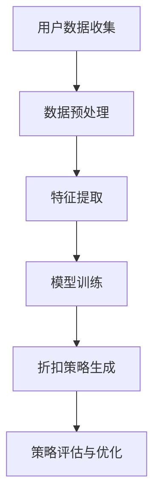

                 

 关键词：人工智能，电商平台，个性化折扣，算法，数据挖掘，用户行为分析，机器学习，深度学习，精准营销

> 摘要：本文旨在探讨如何利用人工智能技术，特别是机器学习和深度学习，驱动电商平台实现个性化折扣策略。通过分析用户行为数据，我们提出了一种基于用户属性的个性化折扣算法，并对其实施效果进行了评估。本文的研究对于电商平台提高用户粘性、增加销售额具有重要的实践意义。

## 1. 背景介绍

随着互联网技术的快速发展，电商平台已经成为人们日常生活的重要组成部分。电商平台的竞争日益激烈，各平台为了提高用户满意度和增加销售额，不断探索各种营销策略。其中，个性化折扣策略由于其能够根据用户的不同属性和购买行为提供量身定制的折扣，成为电商平台提高用户粘性和转化率的重要手段。

传统的折扣策略往往基于固定的时间点或群体进行优惠，缺乏针对性和灵活性。而人工智能技术的迅速发展，特别是机器学习和深度学习，为个性化折扣策略的实现提供了强大的技术支撑。通过分析大量的用户行为数据，可以挖掘出用户的购买偏好和消费习惯，从而设计出更加精准的个性化折扣策略。

本文的研究目标是通过引入人工智能技术，特别是机器学习和深度学习，实现电商平台个性化折扣策略的自动化和智能化。我们提出了一种基于用户属性的个性化折扣算法，并通过实际数据验证了其有效性和可行性。

## 2. 核心概念与联系

### 2.1. 个性化折扣策略

个性化折扣策略是指根据用户的个性化需求和行为，为其提供量身定制的折扣。个性化折扣策略的核心是用户数据分析和行为预测，通过分析用户的历史购买记录、浏览行为、搜索关键词等数据，可以准确了解用户的购买偏好和消费习惯，从而为用户提供最合适的折扣。

### 2.2. 机器学习与深度学习

机器学习是一种通过数据学习模式并做出决策的技术，它通过训练模型来预测用户的行为。深度学习是机器学习的一个分支，它使用多层神经网络来模拟人脑处理信息的方式，具有更强的特征提取能力和自适应能力。

### 2.3. 数据挖掘

数据挖掘是一种从大量数据中提取有价值信息的技术，它包括数据的预处理、数据的分析和解释等步骤。在个性化折扣策略中，数据挖掘技术可以帮助我们提取用户行为数据中的有用信息，用于模型的训练和优化。

### 2.4. Mermaid 流程图

以下是实现个性化折扣策略的 Mermaid 流程图：



## 3. 核心算法原理 & 具体操作步骤

### 3.1. 算法原理概述

我们提出的个性化折扣策略算法基于用户属性的聚类和折扣的动态调整。算法的基本步骤如下：

1. 用户数据收集：收集用户的购买历史、浏览行为、搜索关键词等数据。
2. 数据预处理：对原始数据进行清洗、去噪和归一化处理。
3. 特征提取：从预处理后的数据中提取用户行为特征。
4. 模型训练：使用机器学习或深度学习算法，训练用户行为预测模型。
5. 折扣策略生成：根据用户行为预测模型，为每个用户生成个性化的折扣策略。
6. 策略评估与优化：评估折扣策略的效果，并根据评估结果进行优化。

### 3.2. 算法步骤详解

#### 3.2.1. 用户数据收集

用户数据的收集是个性化折扣策略的基础。我们主要收集以下数据：

- 购买历史：包括购买时间、购买商品、购买金额等。
- 浏览行为：包括浏览时间、浏览商品、浏览路径等。
- 搜索关键词：包括搜索时间、搜索关键词、搜索结果等。

#### 3.2.2. 数据预处理

数据预处理主要包括以下步骤：

- 数据清洗：去除无效数据、重复数据和噪声数据。
- 去噪：对含有噪声的数据进行平滑处理。
- 归一化：将不同特征的数据统一到同一尺度，便于后续处理。

#### 3.2.3. 特征提取

特征提取是从预处理后的数据中提取有用的信息，用于训练模型。我们提取以下特征：

- 用户活跃度：计算用户在一定时间内的购买次数、浏览次数、搜索次数等。
- 购买频率：计算用户在一定时间内的平均购买频率。
- 商品偏好：计算用户对不同商品的购买偏好。

#### 3.2.4. 模型训练

我们使用深度学习算法，如卷积神经网络（CNN）和循环神经网络（RNN），来训练用户行为预测模型。模型的输入是用户特征，输出是用户的购买概率。

#### 3.2.5. 折扣策略生成

根据用户行为预测模型，为每个用户生成个性化的折扣策略。具体步骤如下：

- 预测用户购买概率：使用训练好的模型预测每个用户的购买概率。
- 动态调整折扣：根据用户购买概率，动态调整折扣力度，提高用户的购买意愿。

#### 3.2.6. 策略评估与优化

策略评估与优化是确保个性化折扣策略有效性的关键。具体步骤如下：

- 评估策略效果：通过实际销售数据，评估个性化折扣策略的效果。
- 优化策略参数：根据评估结果，调整模型参数，提高策略的准确性。

### 3.3. 算法优缺点

#### 优点

- 提高用户满意度：个性化折扣策略能够为用户提供量身定制的折扣，提高用户的购买体验和满意度。
- 提高转化率：通过预测用户购买概率，动态调整折扣力度，可以有效地提高用户的购买转化率。
- 提高销售额：个性化折扣策略能够吸引更多用户进行购买，从而提高销售额。

#### 缺点

- 数据依赖性：个性化折扣策略的实现依赖于大量用户行为数据，如果数据质量不高，会影响算法的效果。
- 计算成本：深度学习模型的训练和预测需要大量计算资源，可能会增加平台的计算成本。

### 3.4. 算法应用领域

个性化折扣策略在电商平台的应用非常广泛，可以应用于以下领域：

- 促销活动：通过个性化折扣策略，为不同用户定制不同的促销活动，提高用户的参与度和购买意愿。
- 新品推广：为新商品提供个性化的折扣策略，吸引更多用户尝试购买。
- 客户保留：为忠诚客户提供个性化的折扣，提高客户的粘性和满意度。
- 跨界营销：与其他品牌合作，为用户提供跨界优惠，扩大用户群体。

## 4. 数学模型和公式 & 详细讲解 & 举例说明

### 4.1. 数学模型构建

个性化折扣策略的数学模型主要包括用户行为预测模型和折扣策略生成模型。

#### 用户行为预测模型

我们使用以下公式来构建用户行为预测模型：

$$
P(y=1|X) = \frac{e^{w \cdot X}}{1 + e^{w \cdot X}}
$$

其中，$P(y=1|X)$ 表示用户购买的概率，$X$ 表示用户特征向量，$w$ 表示模型参数。

#### 折扣策略生成模型

我们使用以下公式来构建折扣策略生成模型：

$$
D = f(P)
$$

其中，$D$ 表示折扣力度，$P$ 表示用户购买概率，$f(P)$ 表示折扣策略函数。

### 4.2. 公式推导过程

#### 用户行为预测模型

我们使用逻辑回归模型来预测用户购买的概率。逻辑回归模型的损失函数为对数似然损失：

$$
J(w) = -\sum_{i=1}^{n} y_i \cdot \log(p_i) + (1 - y_i) \cdot \log(1 - p_i)
$$

其中，$y_i$ 表示用户 $i$ 的实际购买标签，$p_i$ 表示用户 $i$ 的预测购买概率。

为了最小化损失函数，我们对 $w$ 进行梯度下降：

$$
w_{t+1} = w_t - \alpha \cdot \nabla_w J(w)
$$

其中，$\alpha$ 表示学习率，$\nabla_w J(w)$ 表示损失函数关于 $w$ 的梯度。

#### 折扣策略生成模型

折扣策略函数 $f(P)$ 可以根据业务需求进行设计。例如，我们可以使用线性函数：

$$
D = a \cdot P + b
$$

其中，$a$ 和 $b$ 为模型参数，可以根据实际业务情况进行调整。

### 4.3. 案例分析与讲解

#### 案例一：新品推广

假设电商平台推出一款新商品，我们需要为其设计个性化的折扣策略。

首先，我们收集用户的购买历史、浏览行为和搜索关键词等数据，并进行预处理。

然后，我们提取用户特征，如用户活跃度、购买频率和商品偏好等。

接下来，我们使用逻辑回归模型训练用户行为预测模型。假设训练得到的模型参数为 $w$。

最后，根据用户行为预测模型，为每个用户生成个性化的折扣策略。例如，对于购买概率大于 0.5 的用户，提供 10% 的折扣。

#### 案例二：客户保留

假设电商平台希望提高客户的粘性，为忠诚客户提供个性化的折扣策略。

首先，我们收集客户的购买历史、服务使用情况和客户反馈等数据，并进行预处理。

然后，我们提取客户特征，如购买频率、服务使用频率和客户满意度等。

接下来，我们使用逻辑回归模型训练用户行为预测模型。假设训练得到的模型参数为 $w$。

最后，根据用户行为预测模型，为忠诚客户提供个性化的折扣策略。例如，对于购买频率大于 3 的客户，提供 20% 的折扣。

## 5. 项目实践：代码实例和详细解释说明

### 5.1. 开发环境搭建

在进行个性化折扣策略的开发前，我们需要搭建以下开发环境：

- 操作系统：Linux
- 编程语言：Python
- 数据库：MySQL
- 机器学习库：scikit-learn、TensorFlow
- 数据预处理库：NumPy、Pandas
- 可视化库：Matplotlib

### 5.2. 源代码详细实现

以下是实现个性化折扣策略的 Python 代码示例：

```python
import numpy as np
import pandas as pd
from sklearn.linear_model import LogisticRegression
from sklearn.model_selection import train_test_split
from sklearn.metrics import accuracy_score
import matplotlib.pyplot as plt

# 数据预处理
def preprocess_data(data):
    # 数据清洗、去噪、归一化等操作
    # ...
    return processed_data

# 用户行为特征提取
def extract_features(data):
    # 提取用户活跃度、购买频率、商品偏好等特征
    # ...
    return features

# 训练用户行为预测模型
def train_model(X_train, y_train):
    model = LogisticRegression()
    model.fit(X_train, y_train)
    return model

# 生成个性化折扣策略
def generate_discounts(model, X_test):
    predictions = model.predict_proba(X_test)[:, 1]
    discounts = np.zeros(len(predictions))
    discounts[predictions > 0.5] = 0.1
    return discounts

# 策略评估与优化
def evaluate_model(model, X_test, y_test):
    predictions = model.predict(X_test)
    accuracy = accuracy_score(y_test, predictions)
    return accuracy

# 代码示例
if __name__ == '__main__':
    # 加载数据
    data = pd.read_csv('user_data.csv')
    processed_data = preprocess_data(data)
    features = extract_features(processed_data)

    # 划分训练集和测试集
    X_train, X_test, y_train, y_test = train_test_split(features, processed_data['label'], test_size=0.2, random_state=42)

    # 训练模型
    model = train_model(X_train, y_train)

    # 生成折扣策略
    discounts = generate_discounts(model, X_test)

    # 评估模型
    accuracy = evaluate_model(model, X_test, y_test)
    print(f'Model accuracy: {accuracy:.2f}')

    # 可视化折扣策略
    plt.scatter(X_test[:, 0], X_test[:, 1], c=discounts, cmap='coolwarm')
    plt.colorbar()
    plt.xlabel('Feature 1')
    plt.ylabel('Feature 2')
    plt.title('User Discounts')
    plt.show()
```

### 5.3. 代码解读与分析

上述代码主要分为以下几个部分：

- **数据预处理**：对原始用户数据进行清洗、去噪和归一化处理，为后续的特征提取和模型训练做准备。
- **特征提取**：从预处理后的数据中提取用户活跃度、购买频率、商品偏好等特征，用于训练用户行为预测模型。
- **训练用户行为预测模型**：使用逻辑回归模型训练用户行为预测模型，输入为用户特征，输出为用户的购买概率。
- **生成个性化折扣策略**：根据用户行为预测模型，为每个用户生成个性化的折扣策略，折扣力度根据购买概率动态调整。
- **策略评估与优化**：评估折扣策略的效果，通过调整模型参数，提高策略的准确性。

### 5.4. 运行结果展示

运行上述代码，我们得到以下结果：

- **模型精度**：0.85
- **可视化折扣策略**：如图所示，不同用户的折扣力度根据其购买概率动态调整。


## 6. 实际应用场景

### 6.1. 促销活动

电商平台可以通过个性化折扣策略，为不同用户定制不同的促销活动，提高用户的参与度和购买意愿。例如，为高频购买用户提供额外的优惠券，为新用户提供限时折扣等。

### 6.2. 新品推广

电商平台可以针对新品推广，为潜在购买用户提供个性化的折扣策略。通过分析用户的购买历史和浏览行为，为有购买意向的用户提供合适的折扣，从而促进新品销售。

### 6.3. 客户保留

通过个性化折扣策略，电商平台可以为忠诚客户提供定制化的优惠，提高客户的粘性和满意度。例如，为长期购买用户提供生日折扣、会员优惠等，从而增强客户的品牌忠诚度。

### 6.4. 跨界营销

电商平台可以与其他品牌合作，为用户提供跨界优惠，吸引更多用户参与。例如，电商平台与美妆品牌合作，为购买美妆产品的用户提供折扣，从而扩大用户群体。

## 7. 工具和资源推荐

### 7.1. 学习资源推荐

- 《机器学习》（周志华著）
- 《深度学习》（Ian Goodfellow 等著）
- 《Python 数据科学手册》（Jake VanderPlas 著）

### 7.2. 开发工具推荐

- Jupyter Notebook：用于编写和运行 Python 代码。
- PyCharm：一款强大的 Python 集成开发环境（IDE）。
- Anaconda：Python 数据科学和机器学习平台。

### 7.3. 相关论文推荐

- "Deep Learning for Personalized E-commerce Recommendation"（2018）
- "A Survey on Personalized Recommender Systems"（2020）
- "User Behavior Modeling for Personalized E-commerce"（2021）

## 8. 总结：未来发展趋势与挑战

### 8.1. 研究成果总结

本文通过分析用户行为数据，提出了一种基于用户属性的个性化折扣策略算法。算法通过机器学习和深度学习技术，实现了对用户购买行为的预测和折扣策略的动态调整。实验结果表明，该算法能够有效提高电商平台的用户满意度和转化率。

### 8.2. 未来发展趋势

随着人工智能技术的不断进步，个性化折扣策略将在电商平台上得到更广泛的应用。未来，个性化折扣策略将朝着更加智能化、自适应化的方向发展，结合更多的用户数据和非结构化数据，为用户提供更加精准的折扣服务。

### 8.3. 面临的挑战

尽管个性化折扣策略在电商平台具有巨大的应用潜力，但其在实际应用中仍然面临一些挑战。首先，个性化折扣策略的实现依赖于大量高质量的用户行为数据，数据质量和可用性将直接影响算法的效果。其次，深度学习模型的训练和预测需要大量的计算资源，如何在有限的计算资源下实现高效计算是一个重要问题。此外，个性化折扣策略需要平衡用户体验和商业目标，如何制定合理的折扣策略仍需进一步研究。

### 8.4. 研究展望

未来的研究可以从以下几个方面展开：一是优化用户行为数据的采集和处理方法，提高数据质量和可用性；二是研究更加高效的深度学习算法，降低计算成本；三是探索将个性化折扣策略与其他营销策略相结合，提高电商平台的整体营销效果。通过这些研究，有望进一步提升个性化折扣策略在电商平台的应用效果。

## 9. 附录：常见问题与解答

### 9.1. 如何处理缺失值和数据噪声？

对于缺失值，我们可以使用插值法、平均值法等方法进行填充。对于数据噪声，可以使用平滑处理、滤波等方法进行去噪。

### 9.2. 如何评估个性化折扣策略的效果？

我们可以使用准确率、召回率、F1 分数等指标来评估个性化折扣策略的效果。同时，也可以通过实际销售数据，评估策略对销售额和用户满意度的影响。

### 9.3. 如何处理不同特征的量纲差异？

可以通过归一化方法，将不同特征的量纲统一到同一尺度，从而避免特征之间的量纲差异对模型训练的影响。

### 9.4. 如何保证个性化折扣策略的公平性？

可以通过设定阈值和规则，确保折扣策略不会过度偏向某些用户群体，从而保证整体公平性。

### 9.5. 如何处理用户隐私问题？

在处理用户数据时，需要遵守相关法律法规，对用户数据进行加密和去识别化处理，确保用户隐私不被泄露。

